<h1 align="center" style="margin: 30px 0 30px; font-weight: bold;">结构健康监测系统 v2.0.0</h1>

<h2>📋 系统简介</h2>

<ul>
    <li><strong>前端代码仓库地址</strong>：<a href="https://github.com/Tang17354395073/MoMagTracker-System/tree/master/MoMagTracker-Vue3" target="_blank">MoMagTracker-Vue3</a></li>
    <li><strong>后端代码仓库地址</strong>：<a href="https://github.com/Tang17354395073/MoMagTracker-System/tree/master/MoMagTracker-Vue" target="_blank">MoMagTracker-Vue</a></li>
    <li><strong>前端技术栈</strong>：<a href="https://v3.cn.vuejs.org" target="_blank">Vue3</a> + <a href="https://element-plus.org/zh-CN" target="_blank">Element Plus</a> + <a href="https://cn.vitejs.dev" target="_blank">Vite</a></li>
    <li><strong>后端技术栈</strong>：<a href="https://spring.io/projects/spring-boot/" target="_blank">SpringBoot</a> + <a href="https://docs.springframework.org.cn/spring-security/reference/index.html" target="_blank">Spring Security</a> + <a href="https://www.redis.io/" target="_blank">Redis</a> + <a href="https://jwt.io/" target="_blank">JWT</a></li>
    <li><strong>权限认证</strong>：使用 <code>JWT</code>，支持多终端认证系统</li>
    <li><strong>动态权限</strong>：支持加载动态权限菜单，多方式轻松权限控制</li>
    <li><strong>高效开发</strong>：使用代码生成器可以一键生成前后端代码</li>
</ul>

<h2>🚀 内置功能</h2>

<table>
    <thead>
        <tr>
            <th>模块</th>
            <th>功能描述</th>
        </tr>
    </thead>
    <tbody>
        <tr>
            <td>1. 系统管理</td>
            <td>管理系统基础配置，包括山东大学 601 实验室组织架构、用户权限、角色分配等</td>
        </tr>
        <tr>
            <td>2. 用户管理</td>
            <td>管理系统操作人员，支持视觉感知、触觉感知等部门的用户配置和权限分配</td>
        </tr>
        <tr>
            <td>3. 角色管理</td>
            <td>配置系统角色（首席执行官、项目经理、人力资源、普通员工等），分配菜单权限</td>
        </tr>
        <tr>
            <td>4. 部门管理</td>
            <td>树形结构管理山东大学601实验室组织架构，支持研发、测试、运维等部门的层级管理</td>
        </tr>
        <tr>
            <td>5. 岗位管理</td>
            <td>配置各部门下的岗位职责和权限范围</td>
        </tr>
        <tr>
            <td>6. 菜单管理</td>
            <td>配置系统功能菜单，包括系统管理、系统监控、系统工具、系统助手等模块</td>
        </tr>
        <tr>
            <td>7. 通知公告</td>
            <td>发布系统维护通知、新版本发布等公告信息</td>
        </tr>
        <tr>
            <td>8. 日志管理</td>
            <td>记录用户操作日志、登录日志，支持异常登录监控和审计</td>
        </tr>
        <tr>
            <td>9. 系统监控</td>
            <td>实时监控系统运行状态，包括在线用户、服务状态等</td>
        </tr>
        <tr>
            <td>10. 视频监测</td>
            <td>结构健康监测的核心功能，实时监控和分析结构状态数据</td>
        </tr>
        <tr>
            <td>11. 数据监控</td>
            <td>监控数据库连接池状态，分析SQL性能瓶颈</td>
        </tr>
        <tr>
            <td>12. 服务监控</td>
            <td>监视系统 CPU、内存、磁盘、堆栈等运行状态</td>
        </tr>
        <tr>
            <td>13. 缓存监控</td>
            <td>监控 Redis 缓存状态，查询缓存数据和统计信息</td>
        </tr>
        <tr>
            <td>14. 系统助手</td>
            <td>AI智能助手功能，包括应用创建、知识管理、工具调用等智能功能</td>
        </tr>
        <tr>
            <td>15. 应用创建</td>
            <td>创建和配置智能应用，支持结构健康监测的智能分析</td>
        </tr>
        <tr>
            <td>16. 数据管理</td>
            <td>管理结构健康监测的感知数据，包括视觉、触觉等感知数据</td>
        </tr>
        <tr>
            <td>17. 工具调用</td>
            <td>调用和配置结构健康监测相关的分析工具</td>
        </tr>
        <tr>
            <td>18. 系统工具</td>
            <td>提供代码生成、表单构建、系统接口等开发辅助工具</td>
        </tr>
        <tr>
            <td>19. 表单构建</td>
            <td>可视化构建结构健康监测系统的数据采集表单</td>
        </tr>
        <tr>
            <td>20. 代码生成</td>
            <td>一键生成结构健康监测业务模块的前后端代码</td>
        </tr>
        <tr>
            <td>21. 系统官网</td>
            <td>链接到项目 GitHub 官网，获取最新文档和更新</td>
        </tr>
    </tbody>
</table>
<h2>🔗 演示地址</h2>

<pre><code># 用户名：admin 
# 密码：admin123
➜  Local:   http://localhost:81/
➜  Network: http://192.168.137.1:81/
➜  Network: http://172.20.10.4:81/
➜  Network: http://172.24.224.1:81/

<h2>📸 系统截图</h2>

<h3>1. 系统首页</h3>

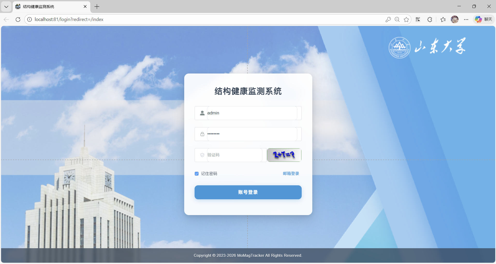

<h3>2. 数据分析</h3>

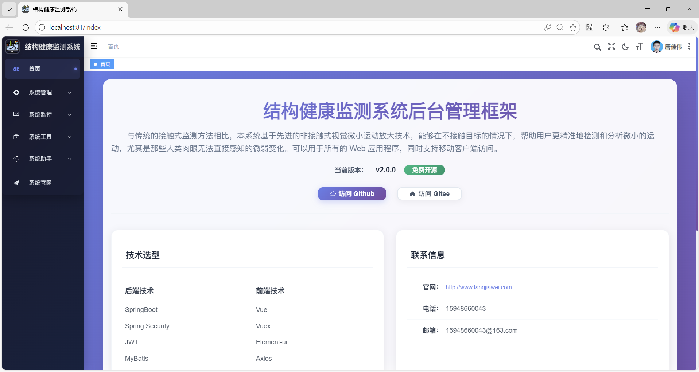

<h3>3. 监测详情</h3>

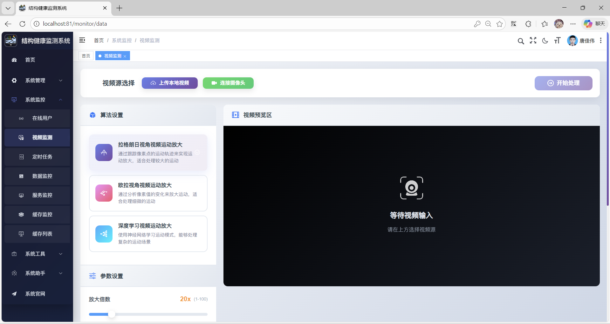

<h2>📞 联系我们</h2>

<p>如有任何问题或建议，请通过以下方式联系我们：</p>
<ul>
    <li>📧 邮箱：15948660043@163.com</li>
    <li>📖 文档：<a href="https://github.com/Tang17354395073/MoMagTracker-System/README.md" target="_blank">项目开发文档</a></li>
</ul>
<hr>
<div align="center">
    <sub>Copyright © 2025 - 结构健康监测系统</sub>
</div>

# 项目 MoMagTracker 开发文档

## 1 创建 Github 仓库 MoMagTracker-SyStem

### 1.1 推送项目至远程仓库

进入到 `E:\RuoYiProject\MoMagTracker-System` 文件夹，打开 `git`，输入下述命令

```shell
git init

touch README.md

git status

git add .

git status

git commit -m "第一次提交，生成总体概括 README.md 文件，以及初始版前端 MoMagTracker-Vue 和后端 MoMagTracker-Vue3 代码"

git remote add origin git@17354395073_github_account:Tang17354395073/MoMagTracker-System.git

git push -u origin master
```

- 结果

```shell
17354@LAPTOP-3CJQNHQH MINGW64 /e/RuoYiProject/MoMagTracker-System
$ git init
Initialized empty Git repository in E:/RuoYiProject/MoMagTracker-System/.git/

17354@LAPTOP-3CJQNHQH MINGW64 /e/RuoYiProject/MoMagTracker-System (master)
$ touch README.md

17354@LAPTOP-3CJQNHQH MINGW64 /e/RuoYiProject/MoMagTracker-System (master)
$ git status
On branch master

No commits yet

Untracked files:
  (use "git add <file>..." to include in what will be committed)
        MoMagTracker-Vue/
        MoMagTracker-Vue3/
        README.md

nothing added to commit but untracked files present (use "git add" to track)

17354@LAPTOP-3CJQNHQH MINGW64 /e/RuoYiProject/MoMagTracker-System (master)
$ git add .

17354@LAPTOP-3CJQNHQH MINGW64 /e/RuoYiProject/MoMagTracker-System (master)
$ git status
On branch master

No commits yet

Changes to be committed:
  (use "git rm --cached <file>..." to unstage)
        new file:   MoMagTracker-Vue/.github/FUNDING.yml
        new file:   MoMagTracker-Vue/.gitignore
        new file:   MoMagTracker-Vue/LICENSE
        new file:   MoMagTracker-Vue/README.md
        new file:   MoMagTracker-Vue/bin/clean.bat
        new file:   MoMagTracker-Vue/bin/package.bat
        new file:   MoMagTracker-Vue/bin/run.bat
        new file:   "MoMagTracker-Vue/doc/\342\225\232\342\214\240\342\225\245\342\224\224\342\225\227\342\225\226\342\225\233\342\224\202\342\225\251\342\225\243\342\225\231\342\224\234\342\225\251\342\225\223\342\226\223\303\237.docx"
        new file:   MoMagTracker-Vue/pom.xml
        new file:   MoMagTracker-Vue/ry.bat
        new file:   MoMagTracker-Vue/ry.sh
        new file:   MoMagTracker-Vue/sql/quartz.sql
        new file:   MoMagTracker-Vue/sql/ry_20250522.sql
        new file:   MoMagTracker-Vue/tracker-admin/pom.xml
        new file:   MoMagTracker-Vue/tracker-admin/src/main/java/tracker/MoMagTrackerApplication.java
        new file:   MoMagTracker-Vue/tracker-admin/src/main/java/tracker/MoMagTrackerServletInitializer.java
        new file:   MoMagTracker-Vue/tracker-admin/src/main/java/tracker/web/controller/common/CaptchaController.java
        new file:   MoMagTracker-Vue/tracker-admin/src/main/java/tracker/web/controller/common/CommonController.java
        new file:   MoMagTracker-Vue/tracker-admin/src/main/java/tracker/web/controller/monitor/CacheController.java
        new file:   MoMagTracker-Vue/tracker-admin/src/main/java/tracker/web/controller/monitor/ServerController.java
        new file:   MoMagTracker-Vue/tracker-admin/src/main/java/tracker/web/controller/monitor/SysLogininforController.java
        new file:   MoMagTracker-Vue/tracker-admin/src/main/java/tracker/web/controller/monitor/SysOperlogController.java
        new file:   MoMagTracker-Vue/tracker-admin/src/main/java/tracker/web/controller/monitor/SysUserOnlineController.java
        new file:   MoMagTracker-Vue/tracker-admin/src/main/java/tracker/web/controller/system/SysConfigController.java
        new file:   MoMagTracker-Vue/tracker-admin/src/main/java/tracker/web/controller/system/SysDeptController.java
        new file:   MoMagTracker-Vue/tracker-admin/src/main/java/tracker/web/controller/system/SysDictDataController.java
        new file:   MoMagTracker-Vue/tracker-admin/src/main/java/tracker/web/controller/system/SysDictTypeController.java
        new file:   MoMagTracker-Vue/tracker-admin/src/main/java/tracker/web/controller/system/SysIndexController.java
        new file:   MoMagTracker-Vue/tracker-admin/src/main/java/tracker/web/controller/system/SysLoginController.java
        new file:   MoMagTracker-Vue/tracker-admin/src/main/java/tracker/web/controller/system/SysMenuController.java
        new file:   MoMagTracker-Vue/tracker-admin/src/main/java/tracker/web/controller/system/SysNoticeController.java
        new file:   MoMagTracker-Vue/tracker-admin/src/main/java/tracker/web/controller/system/SysPostController.java
        new file:   MoMagTracker-Vue/tracker-admin/src/main/java/tracker/web/controller/system/SysProfileController.java
        new file:   MoMagTracker-Vue/tracker-admin/src/main/java/tracker/web/controller/system/SysRegisterController.java
        new file:   MoMagTracker-Vue/tracker-admin/src/main/java/tracker/web/controller/system/SysRoleController.java
        new file:   MoMagTracker-Vue/tracker-admin/src/main/java/tracker/web/controller/system/SysUserController.java
        new file:   MoMagTracker-Vue/tracker-admin/src/main/java/tracker/web/controller/tool/TestController.java
        new file:   MoMagTracker-Vue/tracker-admin/src/main/java/tracker/web/core/config/SwaggerConfig.java
        new file:   MoMagTracker-Vue/tracker-admin/src/main/resources/META-INF/spring-devtools.properties
        new file:   MoMagTracker-Vue/tracker-admin/src/main/resources/application-druid.yml
        new file:   MoMagTracker-Vue/tracker-admin/src/main/resources/application.yml
        new file:   MoMagTracker-Vue/tracker-admin/src/main/resources/banner.txt
        new file:   MoMagTracker-Vue/tracker-admin/src/main/resources/i18n/messages.properties
        new file:   MoMagTracker-Vue/tracker-admin/src/main/resources/logback.xml
        new file:   MoMagTracker-Vue/tracker-admin/src/main/resources/mybatis/mybatis-config.xml
        new file:   MoMagTracker-Vue/tracker-common/pom.xml
        new file:   MoMagTracker-Vue/tracker-common/src/main/java/tracker/common/annotation/Anonymous.java
        new file:   MoMagTracker-Vue/tracker-common/src/main/java/tracker/common/annotation/DataScope.java
        new file:   MoMagTracker-Vue/tracker-common/src/main/java/tracker/common/annotation/DataSource.java
        new file:   MoMagTracker-Vue/tracker-common/src/main/java/tracker/common/annotation/Excel.java
        new file:   MoMagTracker-Vue/tracker-common/src/main/java/tracker/common/annotation/Excels.java
        new file:   MoMagTracker-Vue/tracker-common/src/main/java/tracker/common/annotation/Log.java
        new file:   MoMagTracker-Vue/tracker-common/src/main/java/tracker/common/annotation/RateLimiter.java
        new file:   MoMagTracker-Vue/tracker-common/src/main/java/tracker/common/annotation/RepeatSubmit.java
        new file:   MoMagTracker-Vue/tracker-common/src/main/java/tracker/common/annotation/Sensitive.java
        new file:   MoMagTracker-Vue/tracker-common/src/main/java/tracker/common/config/RuoYiConfig.java
        new file:   MoMagTracker-Vue/tracker-common/src/main/java/tracker/common/config/serializer/SensitiveJsonSerializer.java
        new file:   MoMagTracker-Vue/tracker-common/src/main/java/tracker/common/constant/CacheConstants.java
        new file:   MoMagTracker-Vue/tracker-common/src/main/java/tracker/common/constant/Constants.java
        new file:   MoMagTracker-Vue/tracker-common/src/main/java/tracker/common/constant/GenConstants.java
        new file:   MoMagTracker-Vue/tracker-common/src/main/java/tracker/common/constant/HttpStatus.java
        new file:   MoMagTracker-Vue/tracker-common/src/main/java/tracker/common/constant/ScheduleConstants.java
        new file:   MoMagTracker-Vue/tracker-common/src/main/java/tracker/common/constant/UserConstants.java
        new file:   MoMagTracker-Vue/tracker-common/src/main/java/tracker/common/core/controller/BaseController.java
        new file:   MoMagTracker-Vue/tracker-common/src/main/java/tracker/common/core/domain/AjaxResult.java
        new file:   MoMagTracker-Vue/tracker-common/src/main/java/tracker/common/core/domain/BaseEntity.java
        new file:   MoMagTracker-Vue/tracker-common/src/main/java/tracker/common/core/domain/R.java
        new file:   MoMagTracker-Vue/tracker-common/src/main/java/tracker/common/core/domain/TreeEntity.java
        new file:   MoMagTracker-Vue/tracker-common/src/main/java/tracker/common/core/domain/TreeSelect.java
        new file:   MoMagTracker-Vue/tracker-common/src/main/java/tracker/common/core/domain/entity/SysDept.java
        new file:   MoMagTracker-Vue/tracker-common/src/main/java/tracker/common/core/domain/entity/SysDictData.java
        new file:   MoMagTracker-Vue/tracker-common/src/main/java/tracker/common/core/domain/entity/SysDictType.java
        new file:   MoMagTracker-Vue/tracker-common/src/main/java/tracker/common/core/domain/entity/SysMenu.java
        new file:   MoMagTracker-Vue/tracker-common/src/main/java/tracker/common/core/domain/entity/SysRole.java
        new file:   MoMagTracker-Vue/tracker-common/src/main/java/tracker/common/core/domain/entity/SysUser.java
        new file:   MoMagTracker-Vue/tracker-common/src/main/java/tracker/common/core/domain/model/LoginBody.java
        new file:   MoMagTracker-Vue/tracker-common/src/main/java/tracker/common/core/domain/model/LoginUser.java
        new file:   MoMagTracker-Vue/tracker-common/src/main/java/tracker/common/core/domain/model/RegisterBody.java
        new file:   MoMagTracker-Vue/tracker-common/src/main/java/tracker/common/core/page/PageDomain.java
        new file:   MoMagTracker-Vue/tracker-common/src/main/java/tracker/common/core/page/TableDataInfo.java
        new file:   MoMagTracker-Vue/tracker-common/src/main/java/tracker/common/core/page/TableSupport.java
        new file:   MoMagTracker-Vue/tracker-common/src/main/java/tracker/common/core/redis/RedisCache.java
        new file:   MoMagTracker-Vue/tracker-common/src/main/java/tracker/common/core/text/CharsetKit.java
        new file:   MoMagTracker-Vue/tracker-common/src/main/java/tracker/common/core/text/Convert.java
        new file:   MoMagTracker-Vue/tracker-common/src/main/java/tracker/common/core/text/StrFormatter.java
        new file:   MoMagTracker-Vue/tracker-common/src/main/java/tracker/common/enums/BusinessStatus.java
        new file:   MoMagTracker-Vue/tracker-common/src/main/java/tracker/common/enums/BusinessType.java
        new file:   MoMagTracker-Vue/tracker-common/src/main/java/tracker/common/enums/DataSourceType.java
        new file:   MoMagTracker-Vue/tracker-common/src/main/java/tracker/common/enums/DesensitizedType.java
        new file:   MoMagTracker-Vue/tracker-common/src/main/java/tracker/common/enums/HttpMethod.java
        new file:   MoMagTracker-Vue/tracker-common/src/main/java/tracker/common/enums/LimitType.java
        new file:   MoMagTracker-Vue/tracker-common/src/main/java/tracker/common/enums/OperatorType.java
        new file:   MoMagTracker-Vue/tracker-common/src/main/java/tracker/common/enums/UserStatus.java
        new file:   MoMagTracker-Vue/tracker-common/src/main/java/tracker/common/exception/DemoModeException.java
        new file:   MoMagTracker-Vue/tracker-common/src/main/java/tracker/common/exception/GlobalException.java
        new file:   MoMagTracker-Vue/tracker-common/src/main/java/tracker/common/exception/ServiceException.java
        new file:   MoMagTracker-Vue/tracker-common/src/main/java/tracker/common/exception/UtilException.java
        new file:   MoMagTracker-Vue/tracker-common/src/main/java/tracker/common/exception/base/BaseException.java
        new file:   MoMagTracker-Vue/tracker-common/src/main/java/tracker/common/exception/file/FileException.java
        new file:   MoMagTracker-Vue/tracker-common/src/main/java/tracker/common/exception/file/FileNameLengthLimitExceededException.java
        new file:   MoMagTracker-Vue/tracker-common/src/main/java/tracker/common/exception/file/FileSizeLimitExceededException.java
        new file:   MoMagTracker-Vue/tracker-common/src/main/java/tracker/common/exception/file/FileUploadException.java
        new file:   MoMagTracker-Vue/tracker-common/src/main/java/tracker/common/exception/file/InvalidExtensionException.java
        new file:   MoMagTracker-Vue/tracker-common/src/main/java/tracker/common/exception/job/TaskException.java
        new file:   MoMagTracker-Vue/tracker-common/src/main/java/tracker/common/exception/user/BlackListException.java
        new file:   MoMagTracker-Vue/tracker-common/src/main/java/tracker/common/exception/user/CaptchaException.java
        new file:   MoMagTracker-Vue/tracker-common/src/main/java/tracker/common/exception/user/CaptchaExpireException.java
        new file:   MoMagTracker-Vue/tracker-common/src/main/java/tracker/common/exception/user/UserException.java
        new file:   MoMagTracker-Vue/tracker-common/src/main/java/tracker/common/exception/user/UserNotExistsException.java
        new file:   MoMagTracker-Vue/tracker-common/src/main/java/tracker/common/exception/user/UserPasswordNotMatchException.java
        new file:   MoMagTracker-Vue/tracker-common/src/main/java/tracker/common/exception/user/UserPasswordRetryLimitExceedException.java
        new file:   MoMagTracker-Vue/tracker-common/src/main/java/tracker/common/filter/PropertyPreExcludeFilter.java
        new file:   MoMagTracker-Vue/tracker-common/src/main/java/tracker/common/filter/RepeatableFilter.java
        new file:   MoMagTracker-Vue/tracker-common/src/main/java/tracker/common/filter/RepeatedlyRequestWrapper.java
        new file:   MoMagTracker-Vue/tracker-common/src/main/java/tracker/common/filter/XssFilter.java
        new file:   MoMagTracker-Vue/tracker-common/src/main/java/tracker/common/filter/XssHttpServletRequestWrapper.java
        new file:   MoMagTracker-Vue/tracker-common/src/main/java/tracker/common/utils/Arith.java
        new file:   MoMagTracker-Vue/tracker-common/src/main/java/tracker/common/utils/DateUtils.java
        new file:   MoMagTracker-Vue/tracker-common/src/main/java/tracker/common/utils/DesensitizedUtil.java
        new file:   MoMagTracker-Vue/tracker-common/src/main/java/tracker/common/utils/DictUtils.java
        new file:   MoMagTracker-Vue/tracker-common/src/main/java/tracker/common/utils/ExceptionUtil.java
        new file:   MoMagTracker-Vue/tracker-common/src/main/java/tracker/common/utils/LogUtils.java
        new file:   MoMagTracker-Vue/tracker-common/src/main/java/tracker/common/utils/MessageUtils.java
        new file:   MoMagTracker-Vue/tracker-common/src/main/java/tracker/common/utils/PageUtils.java
        new file:   MoMagTracker-Vue/tracker-common/src/main/java/tracker/common/utils/SecurityUtils.java
        new file:   MoMagTracker-Vue/tracker-common/src/main/java/tracker/common/utils/ServletUtils.java
        new file:   MoMagTracker-Vue/tracker-common/src/main/java/tracker/common/utils/StringUtils.java
        new file:   MoMagTracker-Vue/tracker-common/src/main/java/tracker/common/utils/Threads.java
        new file:   MoMagTracker-Vue/tracker-common/src/main/java/tracker/common/utils/bean/BeanUtils.java
        new file:   MoMagTracker-Vue/tracker-common/src/main/java/tracker/common/utils/bean/BeanValidators.java
        new file:   MoMagTracker-Vue/tracker-common/src/main/java/tracker/common/utils/file/FileTypeUtils.java
        new file:   MoMagTracker-Vue/tracker-common/src/main/java/tracker/common/utils/file/FileUploadUtils.java
        new file:   MoMagTracker-Vue/tracker-common/src/main/java/tracker/common/utils/file/FileUtils.java
        new file:   MoMagTracker-Vue/tracker-common/src/main/java/tracker/common/utils/file/ImageUtils.java
        new file:   MoMagTracker-Vue/tracker-common/src/main/java/tracker/common/utils/file/MimeTypeUtils.java
        new file:   MoMagTracker-Vue/tracker-common/src/main/java/tracker/common/utils/html/EscapeUtil.java
        new file:   MoMagTracker-Vue/tracker-common/src/main/java/tracker/common/utils/html/HTMLFilter.java
        new file:   MoMagTracker-Vue/tracker-common/src/main/java/tracker/common/utils/http/HttpHelper.java
        new file:   MoMagTracker-Vue/tracker-common/src/main/java/tracker/common/utils/http/HttpUtils.java
        new file:   MoMagTracker-Vue/tracker-common/src/main/java/tracker/common/utils/ip/AddressUtils.java
        new file:   MoMagTracker-Vue/tracker-common/src/main/java/tracker/common/utils/ip/IpUtils.java
        new file:   MoMagTracker-Vue/tracker-common/src/main/java/tracker/common/utils/poi/ExcelHandlerAdapter.java
        new file:   MoMagTracker-Vue/tracker-common/src/main/java/tracker/common/utils/poi/ExcelUtil.java
        new file:   MoMagTracker-Vue/tracker-common/src/main/java/tracker/common/utils/reflect/ReflectUtils.java
        new file:   MoMagTracker-Vue/tracker-common/src/main/java/tracker/common/utils/sign/Base64.java
        new file:   MoMagTracker-Vue/tracker-common/src/main/java/tracker/common/utils/sign/Md5Utils.java
        new file:   MoMagTracker-Vue/tracker-common/src/main/java/tracker/common/utils/spring/SpringUtils.java
        new file:   MoMagTracker-Vue/tracker-common/src/main/java/tracker/common/utils/sql/SqlUtil.java
        new file:   MoMagTracker-Vue/tracker-common/src/main/java/tracker/common/utils/uuid/IdUtils.java
        new file:   MoMagTracker-Vue/tracker-common/src/main/java/tracker/common/utils/uuid/Seq.java
        new file:   MoMagTracker-Vue/tracker-common/src/main/java/tracker/common/utils/uuid/UUID.java
        new file:   MoMagTracker-Vue/tracker-common/src/main/java/tracker/common/xss/Xss.java
        new file:   MoMagTracker-Vue/tracker-common/src/main/java/tracker/common/xss/XssValidator.java
        new file:   MoMagTracker-Vue/tracker-framework/pom.xml
        new file:   MoMagTracker-Vue/tracker-framework/src/main/java/tracker/framework/aspectj/DataScopeAspect.java
        new file:   MoMagTracker-Vue/tracker-framework/src/main/java/tracker/framework/aspectj/DataSourceAspect.java
        new file:   MoMagTracker-Vue/tracker-framework/src/main/java/tracker/framework/aspectj/LogAspect.java
        new file:   MoMagTracker-Vue/tracker-framework/src/main/java/tracker/framework/aspectj/RateLimiterAspect.java
        new file:   MoMagTracker-Vue/tracker-framework/src/main/java/tracker/framework/config/ApplicationConfig.java
        new file:   MoMagTracker-Vue/tracker-framework/src/main/java/tracker/framework/config/CaptchaConfig.java
        new file:   MoMagTracker-Vue/tracker-framework/src/main/java/tracker/framework/config/DruidConfig.java
        new file:   MoMagTracker-Vue/tracker-framework/src/main/java/tracker/framework/config/FastJson2JsonRedisSerializer.java
        new file:   MoMagTracker-Vue/tracker-framework/src/main/java/tracker/framework/config/FilterConfig.java
        new file:   MoMagTracker-Vue/tracker-framework/src/main/java/tracker/framework/config/I18nConfig.java
        new file:   MoMagTracker-Vue/tracker-framework/src/main/java/tracker/framework/config/KaptchaTextCreator.java
        new file:   MoMagTracker-Vue/tracker-framework/src/main/java/tracker/framework/config/MyBatisConfig.java
        new file:   MoMagTracker-Vue/tracker-framework/src/main/java/tracker/framework/config/RedisConfig.java
        new file:   MoMagTracker-Vue/tracker-framework/src/main/java/tracker/framework/config/ResourcesConfig.java
        new file:   MoMagTracker-Vue/tracker-framework/src/main/java/tracker/framework/config/SecurityConfig.java
        new file:   MoMagTracker-Vue/tracker-framework/src/main/java/tracker/framework/config/ServerConfig.java
        new file:   MoMagTracker-Vue/tracker-framework/src/main/java/tracker/framework/config/ThreadPoolConfig.java
        new file:   MoMagTracker-Vue/tracker-framework/src/main/java/tracker/framework/config/properties/DruidProperties.java
        new file:   MoMagTracker-Vue/tracker-framework/src/main/java/tracker/framework/config/properties/PermitAllUrlProperties.java
        new file:   MoMagTracker-Vue/tracker-framework/src/main/java/tracker/framework/datasource/DynamicDataSource.java
        new file:   MoMagTracker-Vue/tracker-framework/src/main/java/tracker/framework/datasource/DynamicDataSourceContextHolder.java
        new file:   MoMagTracker-Vue/tracker-framework/src/main/java/tracker/framework/interceptor/RepeatSubmitInterceptor.java
        new file:   MoMagTracker-Vue/tracker-framework/src/main/java/tracker/framework/interceptor/impl/SameUrlDataInterceptor.java
        new file:   MoMagTracker-Vue/tracker-framework/src/main/java/tracker/framework/manager/AsyncManager.java
        new file:   MoMagTracker-Vue/tracker-framework/src/main/java/tracker/framework/manager/ShutdownManager.java
        new file:   MoMagTracker-Vue/tracker-framework/src/main/java/tracker/framework/manager/factory/AsyncFactory.java
        new file:   MoMagTracker-Vue/tracker-framework/src/main/java/tracker/framework/security/context/AuthenticationContextHolder.java
        new file:   MoMagTracker-Vue/tracker-framework/src/main/java/tracker/framework/security/context/PermissionContextHolder.java
        new file:   MoMagTracker-Vue/tracker-framework/src/main/java/tracker/framework/security/filter/JwtAuthenticationTokenFilter.java
        new file:   MoMagTracker-Vue/tracker-framework/src/main/java/tracker/framework/security/handle/AuthenticationEntryPointImpl.java
        new file:   MoMagTracker-Vue/tracker-framework/src/main/java/tracker/framework/security/handle/LogoutSuccessHandlerImpl.java
        new file:   MoMagTracker-Vue/tracker-framework/src/main/java/tracker/framework/web/domain/Server.java
        new file:   MoMagTracker-Vue/tracker-framework/src/main/java/tracker/framework/web/domain/server/Cpu.java
        new file:   MoMagTracker-Vue/tracker-framework/src/main/java/tracker/framework/web/domain/server/Jvm.java
        new file:   MoMagTracker-Vue/tracker-framework/src/main/java/tracker/framework/web/domain/server/Mem.java
        new file:   MoMagTracker-Vue/tracker-framework/src/main/java/tracker/framework/web/domain/server/Sys.java
        new file:   MoMagTracker-Vue/tracker-framework/src/main/java/tracker/framework/web/domain/server/SysFile.java
        new file:   MoMagTracker-Vue/tracker-framework/src/main/java/tracker/framework/web/exception/GlobalExceptionHandler.java
        new file:   MoMagTracker-Vue/tracker-framework/src/main/java/tracker/framework/web/service/PermissionService.java
        new file:   MoMagTracker-Vue/tracker-framework/src/main/java/tracker/framework/web/service/SysLoginService.java
        new file:   MoMagTracker-Vue/tracker-framework/src/main/java/tracker/framework/web/service/SysPasswordService.java
        new file:   MoMagTracker-Vue/tracker-framework/src/main/java/tracker/framework/web/service/SysPermissionService.java
        new file:   MoMagTracker-Vue/tracker-framework/src/main/java/tracker/framework/web/service/SysRegisterService.java
        new file:   MoMagTracker-Vue/tracker-framework/src/main/java/tracker/framework/web/service/TokenService.java
        new file:   MoMagTracker-Vue/tracker-framework/src/main/java/tracker/framework/web/service/UserDetailsServiceImpl.java
        new file:   MoMagTracker-Vue/tracker-generator/pom.xml
        new file:   MoMagTracker-Vue/tracker-generator/src/main/java/tracker/generator/config/GenConfig.java
        new file:   MoMagTracker-Vue/tracker-generator/src/main/java/tracker/generator/controller/GenController.java
        new file:   MoMagTracker-Vue/tracker-generator/src/main/java/tracker/generator/domain/GenTable.java
        new file:   MoMagTracker-Vue/tracker-generator/src/main/java/tracker/generator/domain/GenTableColumn.java
        new file:   MoMagTracker-Vue/tracker-generator/src/main/java/tracker/generator/mapper/GenTableColumnMapper.java
        new file:   MoMagTracker-Vue/tracker-generator/src/main/java/tracker/generator/mapper/GenTableMapper.java
        new file:   MoMagTracker-Vue/tracker-generator/src/main/java/tracker/generator/service/GenTableColumnServiceImpl.java
        new file:   MoMagTracker-Vue/tracker-generator/src/main/java/tracker/generator/service/GenTableServiceImpl.java
        new file:   MoMagTracker-Vue/tracker-generator/src/main/java/tracker/generator/service/IGenTableColumnService.java
        new file:   MoMagTracker-Vue/tracker-generator/src/main/java/tracker/generator/service/IGenTableService.java
        new file:   MoMagTracker-Vue/tracker-generator/src/main/java/tracker/generator/util/GenUtils.java
        new file:   MoMagTracker-Vue/tracker-generator/src/main/java/tracker/generator/util/VelocityInitializer.java
        new file:   MoMagTracker-Vue/tracker-generator/src/main/java/tracker/generator/util/VelocityUtils.java
        new file:   MoMagTracker-Vue/tracker-generator/src/main/resources/generator.yml
        new file:   MoMagTracker-Vue/tracker-generator/src/main/resources/mapper/generator/GenTableColumnMapper.xml
        new file:   MoMagTracker-Vue/tracker-generator/src/main/resources/mapper/generator/GenTableMapper.xml
        new file:   MoMagTracker-Vue/tracker-generator/src/main/resources/vm/java/controller.java.vm
        new file:   MoMagTracker-Vue/tracker-generator/src/main/resources/vm/java/domain.java.vm
        new file:   MoMagTracker-Vue/tracker-generator/src/main/resources/vm/java/mapper.java.vm
        new file:   MoMagTracker-Vue/tracker-generator/src/main/resources/vm/java/service.java.vm
        new file:   MoMagTracker-Vue/tracker-generator/src/main/resources/vm/java/serviceImpl.java.vm
        new file:   MoMagTracker-Vue/tracker-generator/src/main/resources/vm/java/sub-domain.java.vm
        new file:   MoMagTracker-Vue/tracker-generator/src/main/resources/vm/js/api.js.vm
        new file:   MoMagTracker-Vue/tracker-generator/src/main/resources/vm/sql/sql.vm
        new file:   MoMagTracker-Vue/tracker-generator/src/main/resources/vm/vue/index-tree.vue.vm
        new file:   MoMagTracker-Vue/tracker-generator/src/main/resources/vm/vue/index.vue.vm
        new file:   MoMagTracker-Vue/tracker-generator/src/main/resources/vm/vue/v3/index-tree.vue.vm
        new file:   MoMagTracker-Vue/tracker-generator/src/main/resources/vm/vue/v3/index.vue.vm
        new file:   MoMagTracker-Vue/tracker-generator/src/main/resources/vm/xml/mapper.xml.vm
        new file:   MoMagTracker-Vue/tracker-quartz/pom.xml
        new file:   MoMagTracker-Vue/tracker-quartz/src/main/java/tracker/quartz/config/ScheduleConfig.java
        new file:   MoMagTracker-Vue/tracker-quartz/src/main/java/tracker/quartz/controller/SysJobController.java
        new file:   MoMagTracker-Vue/tracker-quartz/src/main/java/tracker/quartz/controller/SysJobLogController.java
        new file:   MoMagTracker-Vue/tracker-quartz/src/main/java/tracker/quartz/domain/SysJob.java
        new file:   MoMagTracker-Vue/tracker-quartz/src/main/java/tracker/quartz/domain/SysJobLog.java
        new file:   MoMagTracker-Vue/tracker-quartz/src/main/java/tracker/quartz/mapper/SysJobLogMapper.java
        new file:   MoMagTracker-Vue/tracker-quartz/src/main/java/tracker/quartz/mapper/SysJobMapper.java
        new file:   MoMagTracker-Vue/tracker-quartz/src/main/java/tracker/quartz/service/ISysJobLogService.java
        new file:   MoMagTracker-Vue/tracker-quartz/src/main/java/tracker/quartz/service/ISysJobService.java
        new file:   MoMagTracker-Vue/tracker-quartz/src/main/java/tracker/quartz/service/impl/SysJobLogServiceImpl.java
        new file:   MoMagTracker-Vue/tracker-quartz/src/main/java/tracker/quartz/service/impl/SysJobServiceImpl.java
        new file:   MoMagTracker-Vue/tracker-quartz/src/main/java/tracker/quartz/task/RyTask.java
        new file:   MoMagTracker-Vue/tracker-quartz/src/main/java/tracker/quartz/util/AbstractQuartzJob.java
        new file:   MoMagTracker-Vue/tracker-quartz/src/main/java/tracker/quartz/util/CronUtils.java
        new file:   MoMagTracker-Vue/tracker-quartz/src/main/java/tracker/quartz/util/JobInvokeUtil.java
        new file:   MoMagTracker-Vue/tracker-quartz/src/main/java/tracker/quartz/util/QuartzDisallowConcurrentExecution.java
        new file:   MoMagTracker-Vue/tracker-quartz/src/main/java/tracker/quartz/util/QuartzJobExecution.java
        new file:   MoMagTracker-Vue/tracker-quartz/src/main/java/tracker/quartz/util/ScheduleUtils.java
        new file:   MoMagTracker-Vue/tracker-quartz/src/main/resources/mapper/quartz/SysJobLogMapper.xml
        new file:   MoMagTracker-Vue/tracker-quartz/src/main/resources/mapper/quartz/SysJobMapper.xml
        new file:   MoMagTracker-Vue/tracker-system/pom.xml
        new file:   MoMagTracker-Vue/tracker-system/src/main/java/tracker/system/domain/SysCache.java
        new file:   MoMagTracker-Vue/tracker-system/src/main/java/tracker/system/domain/SysConfig.java
        new file:   MoMagTracker-Vue/tracker-system/src/main/java/tracker/system/domain/SysLogininfor.java
        new file:   MoMagTracker-Vue/tracker-system/src/main/java/tracker/system/domain/SysNotice.java
        new file:   MoMagTracker-Vue/tracker-system/src/main/java/tracker/system/domain/SysOperLog.java
        new file:   MoMagTracker-Vue/tracker-system/src/main/java/tracker/system/domain/SysPost.java
        new file:   MoMagTracker-Vue/tracker-system/src/main/java/tracker/system/domain/SysRoleDept.java
        new file:   MoMagTracker-Vue/tracker-system/src/main/java/tracker/system/domain/SysRoleMenu.java
        new file:   MoMagTracker-Vue/tracker-system/src/main/java/tracker/system/domain/SysUserOnline.java
        new file:   MoMagTracker-Vue/tracker-system/src/main/java/tracker/system/domain/SysUserPost.java
        new file:   MoMagTracker-Vue/tracker-system/src/main/java/tracker/system/domain/SysUserRole.java
        new file:   MoMagTracker-Vue/tracker-system/src/main/java/tracker/system/domain/vo/MetaVo.java
        new file:   MoMagTracker-Vue/tracker-system/src/main/java/tracker/system/domain/vo/RouterVo.java
        new file:   MoMagTracker-Vue/tracker-system/src/main/java/tracker/system/mapper/SysConfigMapper.java
        new file:   MoMagTracker-Vue/tracker-system/src/main/java/tracker/system/mapper/SysDeptMapper.java
        new file:   MoMagTracker-Vue/tracker-system/src/main/java/tracker/system/mapper/SysDictDataMapper.java
        new file:   MoMagTracker-Vue/tracker-system/src/main/java/tracker/system/mapper/SysDictTypeMapper.java
        new file:   MoMagTracker-Vue/tracker-system/src/main/java/tracker/system/mapper/SysLogininforMapper.java
        new file:   MoMagTracker-Vue/tracker-system/src/main/java/tracker/system/mapper/SysMenuMapper.java
        new file:   MoMagTracker-Vue/tracker-system/src/main/java/tracker/system/mapper/SysNoticeMapper.java
        new file:   MoMagTracker-Vue/tracker-system/src/main/java/tracker/system/mapper/SysOperLogMapper.java
        new file:   MoMagTracker-Vue/tracker-system/src/main/java/tracker/system/mapper/SysPostMapper.java
        new file:   MoMagTracker-Vue/tracker-system/src/main/java/tracker/system/mapper/SysRoleDeptMapper.java
        new file:   MoMagTracker-Vue/tracker-system/src/main/java/tracker/system/mapper/SysRoleMapper.java
        new file:   MoMagTracker-Vue/tracker-system/src/main/java/tracker/system/mapper/SysRoleMenuMapper.java
        new file:   MoMagTracker-Vue/tracker-system/src/main/java/tracker/system/mapper/SysUserMapper.java
        new file:   MoMagTracker-Vue/tracker-system/src/main/java/tracker/system/mapper/SysUserPostMapper.java
        new file:   MoMagTracker-Vue/tracker-system/src/main/java/tracker/system/mapper/SysUserRoleMapper.java
        new file:   MoMagTracker-Vue/tracker-system/src/main/java/tracker/system/service/ISysConfigService.java
        new file:   MoMagTracker-Vue/tracker-system/src/main/java/tracker/system/service/ISysDeptService.java
        new file:   MoMagTracker-Vue/tracker-system/src/main/java/tracker/system/service/ISysDictDataService.java
        new file:   MoMagTracker-Vue/tracker-system/src/main/java/tracker/system/service/ISysDictTypeService.java
        new file:   MoMagTracker-Vue/tracker-system/src/main/java/tracker/system/service/ISysLogininforService.java
        new file:   MoMagTracker-Vue/tracker-system/src/main/java/tracker/system/service/ISysMenuService.java
        new file:   MoMagTracker-Vue/tracker-system/src/main/java/tracker/system/service/ISysNoticeService.java
        new file:   MoMagTracker-Vue/tracker-system/src/main/java/tracker/system/service/ISysOperLogService.java
        new file:   MoMagTracker-Vue/tracker-system/src/main/java/tracker/system/service/ISysPostService.java
        new file:   MoMagTracker-Vue/tracker-system/src/main/java/tracker/system/service/ISysRoleService.java
        new file:   MoMagTracker-Vue/tracker-system/src/main/java/tracker/system/service/ISysUserOnlineService.java
        new file:   MoMagTracker-Vue/tracker-system/src/main/java/tracker/system/service/ISysUserService.java
        new file:   MoMagTracker-Vue/tracker-system/src/main/java/tracker/system/service/impl/SysConfigServiceImpl.java
        new file:   MoMagTracker-Vue/tracker-system/src/main/java/tracker/system/service/impl/SysDeptServiceImpl.java
        new file:   MoMagTracker-Vue/tracker-system/src/main/java/tracker/system/service/impl/SysDictDataServiceImpl.java
        new file:   MoMagTracker-Vue/tracker-system/src/main/java/tracker/system/service/impl/SysDictTypeServiceImpl.java
        new file:   MoMagTracker-Vue/tracker-system/src/main/java/tracker/system/service/impl/SysLogininforServiceImpl.java
        new file:   MoMagTracker-Vue/tracker-system/src/main/java/tracker/system/service/impl/SysMenuServiceImpl.java
        new file:   MoMagTracker-Vue/tracker-system/src/main/java/tracker/system/service/impl/SysNoticeServiceImpl.java
        new file:   MoMagTracker-Vue/tracker-system/src/main/java/tracker/system/service/impl/SysOperLogServiceImpl.java
        new file:   MoMagTracker-Vue/tracker-system/src/main/java/tracker/system/service/impl/SysPostServiceImpl.java
        new file:   MoMagTracker-Vue/tracker-system/src/main/java/tracker/system/service/impl/SysRoleServiceImpl.java
        new file:   MoMagTracker-Vue/tracker-system/src/main/java/tracker/system/service/impl/SysUserOnlineServiceImpl.java
        new file:   MoMagTracker-Vue/tracker-system/src/main/java/tracker/system/service/impl/SysUserServiceImpl.java
        new file:   MoMagTracker-Vue/tracker-system/src/main/resources/mapper/system/SysConfigMapper.xml
        new file:   MoMagTracker-Vue/tracker-system/src/main/resources/mapper/system/SysDeptMapper.xml
        new file:   MoMagTracker-Vue/tracker-system/src/main/resources/mapper/system/SysDictDataMapper.xml
        new file:   MoMagTracker-Vue/tracker-system/src/main/resources/mapper/system/SysDictTypeMapper.xml
        new file:   MoMagTracker-Vue/tracker-system/src/main/resources/mapper/system/SysLogininforMapper.xml
        new file:   MoMagTracker-Vue/tracker-system/src/main/resources/mapper/system/SysMenuMapper.xml
        new file:   MoMagTracker-Vue/tracker-system/src/main/resources/mapper/system/SysNoticeMapper.xml
        new file:   MoMagTracker-Vue/tracker-system/src/main/resources/mapper/system/SysOperLogMapper.xml
        new file:   MoMagTracker-Vue/tracker-system/src/main/resources/mapper/system/SysPostMapper.xml
        new file:   MoMagTracker-Vue/tracker-system/src/main/resources/mapper/system/SysRoleDeptMapper.xml
        new file:   MoMagTracker-Vue/tracker-system/src/main/resources/mapper/system/SysRoleMapper.xml
        new file:   MoMagTracker-Vue/tracker-system/src/main/resources/mapper/system/SysRoleMenuMapper.xml
        new file:   MoMagTracker-Vue/tracker-system/src/main/resources/mapper/system/SysUserMapper.xml
        new file:   MoMagTracker-Vue/tracker-system/src/main/resources/mapper/system/SysUserPostMapper.xml
        new file:   MoMagTracker-Vue/tracker-system/src/main/resources/mapper/system/SysUserRoleMapper.xml
        new file:   MoMagTracker-Vue/tracker-ui/.editorconfig
        new file:   MoMagTracker-Vue/tracker-ui/.env.development
        new file:   MoMagTracker-Vue/tracker-ui/.env.production
        new file:   MoMagTracker-Vue/tracker-ui/.env.staging
        new file:   MoMagTracker-Vue/tracker-ui/.gitignore
        new file:   MoMagTracker-Vue/tracker-ui/README.md
        new file:   MoMagTracker-Vue/tracker-ui/babel.config.js
        new file:   MoMagTracker-Vue/tracker-ui/bin/build.bat
        new file:   MoMagTracker-Vue/tracker-ui/bin/package.bat
        new file:   MoMagTracker-Vue/tracker-ui/bin/run-web.bat
        new file:   MoMagTracker-Vue/tracker-ui/build/index.js
        new file:   MoMagTracker-Vue/tracker-ui/package.json
        new file:   MoMagTracker-Vue/tracker-ui/public/favicon.ico
        new file:   MoMagTracker-Vue/tracker-ui/public/favicon.ico.bak
        new file:   MoMagTracker-Vue/tracker-ui/public/html/ie.html
        new file:   MoMagTracker-Vue/tracker-ui/public/index.html
        new file:   MoMagTracker-Vue/tracker-ui/public/robots.txt
        new file:   MoMagTracker-Vue/tracker-ui/public/styles/theme-chalk/index.css
        new file:   MoMagTracker-Vue/tracker-ui/src/App.vue
        new file:   MoMagTracker-Vue/tracker-ui/src/api/login.js
        new file:   MoMagTracker-Vue/tracker-ui/src/api/menu.js
        new file:   MoMagTracker-Vue/tracker-ui/src/api/monitor/cache.js
        new file:   MoMagTracker-Vue/tracker-ui/src/api/monitor/job.js
        new file:   MoMagTracker-Vue/tracker-ui/src/api/monitor/jobLog.js
        new file:   MoMagTracker-Vue/tracker-ui/src/api/monitor/logininfor.js
        new file:   MoMagTracker-Vue/tracker-ui/src/api/monitor/online.js
        new file:   MoMagTracker-Vue/tracker-ui/src/api/monitor/operlog.js
        new file:   MoMagTracker-Vue/tracker-ui/src/api/monitor/server.js
        new file:   MoMagTracker-Vue/tracker-ui/src/api/system/config.js
        new file:   MoMagTracker-Vue/tracker-ui/src/api/system/dept.js
        new file:   MoMagTracker-Vue/tracker-ui/src/api/system/dict/data.js
        new file:   MoMagTracker-Vue/tracker-ui/src/api/system/dict/type.js
        new file:   MoMagTracker-Vue/tracker-ui/src/api/system/menu.js
        new file:   MoMagTracker-Vue/tracker-ui/src/api/system/notice.js
        new file:   MoMagTracker-Vue/tracker-ui/src/api/system/post.js
        new file:   MoMagTracker-Vue/tracker-ui/src/api/system/role.js
        new file:   MoMagTracker-Vue/tracker-ui/src/api/system/user.js
        new file:   MoMagTracker-Vue/tracker-ui/src/api/tool/gen.js
        new file:   MoMagTracker-Vue/tracker-ui/src/assets/401_images/401.gif
        new file:   MoMagTracker-Vue/tracker-ui/src/assets/404_images/404.png
        new file:   MoMagTracker-Vue/tracker-ui/src/assets/404_images/404_cloud.png
        new file:   MoMagTracker-Vue/tracker-ui/src/assets/icons/index.js
        new file:   MoMagTracker-Vue/tracker-ui/src/assets/icons/svg/404.svg
        new file:   MoMagTracker-Vue/tracker-ui/src/assets/icons/svg/bug.svg
        new file:   MoMagTracker-Vue/tracker-ui/src/assets/icons/svg/build.svg
        new file:   MoMagTracker-Vue/tracker-ui/src/assets/icons/svg/button.svg
        new file:   MoMagTracker-Vue/tracker-ui/src/assets/icons/svg/cascader.svg
        new file:   MoMagTracker-Vue/tracker-ui/src/assets/icons/svg/chart.svg
        new file:   MoMagTracker-Vue/tracker-ui/src/assets/icons/svg/checkbox.svg
        new file:   MoMagTracker-Vue/tracker-ui/src/assets/icons/svg/clipboard.svg
        new file:   MoMagTracker-Vue/tracker-ui/src/assets/icons/svg/code.svg
        new file:   MoMagTracker-Vue/tracker-ui/src/assets/icons/svg/color.svg
        new file:   MoMagTracker-Vue/tracker-ui/src/assets/icons/svg/component.svg
        new file:   MoMagTracker-Vue/tracker-ui/src/assets/icons/svg/dashboard.svg
        new file:   MoMagTracker-Vue/tracker-ui/src/assets/icons/svg/date-range.svg
        new file:   MoMagTracker-Vue/tracker-ui/src/assets/icons/svg/date.svg
        new file:   MoMagTracker-Vue/tracker-ui/src/assets/icons/svg/dict.svg
        new file:   MoMagTracker-Vue/tracker-ui/src/assets/icons/svg/documentation.svg
        new file:   MoMagTracker-Vue/tracker-ui/src/assets/icons/svg/download.svg
        new file:   MoMagTracker-Vue/tracker-ui/src/assets/icons/svg/drag.svg
        new file:   MoMagTracker-Vue/tracker-ui/src/assets/icons/svg/druid.svg
        new file:   MoMagTracker-Vue/tracker-ui/src/assets/icons/svg/edit.svg
        new file:   MoMagTracker-Vue/tracker-ui/src/assets/icons/svg/education.svg
        new file:   MoMagTracker-Vue/tracker-ui/src/assets/icons/svg/email.svg
        new file:   MoMagTracker-Vue/tracker-ui/src/assets/icons/svg/enter.svg
        new file:   MoMagTracker-Vue/tracker-ui/src/assets/icons/svg/example.svg
        new file:   MoMagTracker-Vue/tracker-ui/src/assets/icons/svg/excel.svg
        new file:   MoMagTracker-Vue/tracker-ui/src/assets/icons/svg/exit-fullscreen.svg
        new file:   MoMagTracker-Vue/tracker-ui/src/assets/icons/svg/eye-open.svg
        new file:   MoMagTracker-Vue/tracker-ui/src/assets/icons/svg/eye.svg
        new file:   MoMagTracker-Vue/tracker-ui/src/assets/icons/svg/form.svg
        new file:   MoMagTracker-Vue/tracker-ui/src/assets/icons/svg/fullscreen.svg
        new file:   MoMagTracker-Vue/tracker-ui/src/assets/icons/svg/github.svg
        new file:   MoMagTracker-Vue/tracker-ui/src/assets/icons/svg/guide.svg
        new file:   MoMagTracker-Vue/tracker-ui/src/assets/icons/svg/icon.svg
        new file:   MoMagTracker-Vue/tracker-ui/src/assets/icons/svg/input.svg
        new file:   MoMagTracker-Vue/tracker-ui/src/assets/icons/svg/international.svg
        new file:   MoMagTracker-Vue/tracker-ui/src/assets/icons/svg/job.svg
        new file:   MoMagTracker-Vue/tracker-ui/src/assets/icons/svg/language.svg
        new file:   MoMagTracker-Vue/tracker-ui/src/assets/icons/svg/link.svg
        new file:   MoMagTracker-Vue/tracker-ui/src/assets/icons/svg/list.svg
        new file:   MoMagTracker-Vue/tracker-ui/src/assets/icons/svg/lock.svg
        new file:   MoMagTracker-Vue/tracker-ui/src/assets/icons/svg/log.svg
        new file:   MoMagTracker-Vue/tracker-ui/src/assets/icons/svg/logininfor.svg
        new file:   MoMagTracker-Vue/tracker-ui/src/assets/icons/svg/message.svg
        new file:   MoMagTracker-Vue/tracker-ui/src/assets/icons/svg/money.svg
        new file:   MoMagTracker-Vue/tracker-ui/src/assets/icons/svg/monitor.svg
        new file:   MoMagTracker-Vue/tracker-ui/src/assets/icons/svg/more-up.svg
        new file:   MoMagTracker-Vue/tracker-ui/src/assets/icons/svg/nested.svg
        new file:   MoMagTracker-Vue/tracker-ui/src/assets/icons/svg/number.svg
        new file:   MoMagTracker-Vue/tracker-ui/src/assets/icons/svg/online.svg
        new file:   MoMagTracker-Vue/tracker-ui/src/assets/icons/svg/password.svg
        new file:   MoMagTracker-Vue/tracker-ui/src/assets/icons/svg/pdf.svg
        new file:   MoMagTracker-Vue/tracker-ui/src/assets/icons/svg/people.svg
        new file:   MoMagTracker-Vue/tracker-ui/src/assets/icons/svg/peoples.svg
        new file:   MoMagTracker-Vue/tracker-ui/src/assets/icons/svg/phone.svg
        new file:   MoMagTracker-Vue/tracker-ui/src/assets/icons/svg/post.svg
        new file:   MoMagTracker-Vue/tracker-ui/src/assets/icons/svg/qq.svg
        new file:   MoMagTracker-Vue/tracker-ui/src/assets/icons/svg/question.svg
        new file:   MoMagTracker-Vue/tracker-ui/src/assets/icons/svg/radio.svg
        new file:   MoMagTracker-Vue/tracker-ui/src/assets/icons/svg/rate.svg
        new file:   MoMagTracker-Vue/tracker-ui/src/assets/icons/svg/redis-list.svg
        new file:   MoMagTracker-Vue/tracker-ui/src/assets/icons/svg/redis.svg
        new file:   MoMagTracker-Vue/tracker-ui/src/assets/icons/svg/row.svg
        new file:   MoMagTracker-Vue/tracker-ui/src/assets/icons/svg/search.svg
        new file:   MoMagTracker-Vue/tracker-ui/src/assets/icons/svg/select.svg
        new file:   MoMagTracker-Vue/tracker-ui/src/assets/icons/svg/server.svg
        new file:   MoMagTracker-Vue/tracker-ui/src/assets/icons/svg/shopping.svg
        new file:   MoMagTracker-Vue/tracker-ui/src/assets/icons/svg/size.svg
        new file:   MoMagTracker-Vue/tracker-ui/src/assets/icons/svg/skill.svg
        new file:   MoMagTracker-Vue/tracker-ui/src/assets/icons/svg/slider.svg
        new file:   MoMagTracker-Vue/tracker-ui/src/assets/icons/svg/star.svg
        new file:   MoMagTracker-Vue/tracker-ui/src/assets/icons/svg/swagger.svg
        new file:   MoMagTracker-Vue/tracker-ui/src/assets/icons/svg/switch.svg
        new file:   MoMagTracker-Vue/tracker-ui/src/assets/icons/svg/system.svg
        new file:   MoMagTracker-Vue/tracker-ui/src/assets/icons/svg/tab.svg
        new file:   MoMagTracker-Vue/tracker-ui/src/assets/icons/svg/table.svg
        new file:   MoMagTracker-Vue/tracker-ui/src/assets/icons/svg/textarea.svg
        new file:   MoMagTracker-Vue/tracker-ui/src/assets/icons/svg/theme.svg
        new file:   MoMagTracker-Vue/tracker-ui/src/assets/icons/svg/time-range.svg
        new file:   MoMagTracker-Vue/tracker-ui/src/assets/icons/svg/time.svg
        new file:   MoMagTracker-Vue/tracker-ui/src/assets/icons/svg/tool.svg
        new file:   MoMagTracker-Vue/tracker-ui/src/assets/icons/svg/tree-table.svg
        new file:   MoMagTracker-Vue/tracker-ui/src/assets/icons/svg/tree.svg
        new file:   MoMagTracker-Vue/tracker-ui/src/assets/icons/svg/upload.svg
        new file:   MoMagTracker-Vue/tracker-ui/src/assets/icons/svg/user.svg
        new file:   MoMagTracker-Vue/tracker-ui/src/assets/icons/svg/validCode.svg
        new file:   MoMagTracker-Vue/tracker-ui/src/assets/icons/svg/wechat.svg
        new file:   MoMagTracker-Vue/tracker-ui/src/assets/icons/svg/zip.svg
        new file:   MoMagTracker-Vue/tracker-ui/src/assets/icons/svgo.yml
        new file:   MoMagTracker-Vue/tracker-ui/src/assets/images/dark.svg
        new file:   MoMagTracker-Vue/tracker-ui/src/assets/images/light.svg
        new file:   MoMagTracker-Vue/tracker-ui/src/assets/images/login-background.jpg
        new file:   MoMagTracker-Vue/tracker-ui/src/assets/images/pay.png
        new file:   MoMagTracker-Vue/tracker-ui/src/assets/images/profile.jpg
        new file:   MoMagTracker-Vue/tracker-ui/src/assets/logo/logo.png
        new file:   MoMagTracker-Vue/tracker-ui/src/assets/logo/logo.png.bak
        new file:   MoMagTracker-Vue/tracker-ui/src/assets/styles/btn.scss
        new file:   MoMagTracker-Vue/tracker-ui/src/assets/styles/element-ui.scss
        new file:   MoMagTracker-Vue/tracker-ui/src/assets/styles/element-variables.scss
        new file:   MoMagTracker-Vue/tracker-ui/src/assets/styles/index.scss
        new file:   MoMagTracker-Vue/tracker-ui/src/assets/styles/mixin.scss
        new file:   MoMagTracker-Vue/tracker-ui/src/assets/styles/ruoyi.scss
        new file:   MoMagTracker-Vue/tracker-ui/src/assets/styles/sidebar.scss
        new file:   MoMagTracker-Vue/tracker-ui/src/assets/styles/transition.scss
        new file:   MoMagTracker-Vue/tracker-ui/src/assets/styles/variables.scss
        new file:   MoMagTracker-Vue/tracker-ui/src/components/Breadcrumb/index.vue
        new file:   MoMagTracker-Vue/tracker-ui/src/components/Crontab/day.vue
        new file:   MoMagTracker-Vue/tracker-ui/src/components/Crontab/hour.vue
        new file:   MoMagTracker-Vue/tracker-ui/src/components/Crontab/index.vue
        new file:   MoMagTracker-Vue/tracker-ui/src/components/Crontab/min.vue
        new file:   MoMagTracker-Vue/tracker-ui/src/components/Crontab/month.vue
        new file:   MoMagTracker-Vue/tracker-ui/src/components/Crontab/result.vue
        new file:   MoMagTracker-Vue/tracker-ui/src/components/Crontab/second.vue
        new file:   MoMagTracker-Vue/tracker-ui/src/components/Crontab/week.vue
        new file:   MoMagTracker-Vue/tracker-ui/src/components/Crontab/year.vue
        new file:   MoMagTracker-Vue/tracker-ui/src/components/DictData/index.js
        new file:   MoMagTracker-Vue/tracker-ui/src/components/DictTag/index.vue
        new file:   MoMagTracker-Vue/tracker-ui/src/components/Editor/index.vue
        new file:   MoMagTracker-Vue/tracker-ui/src/components/FileUpload/index.vue
        new file:   MoMagTracker-Vue/tracker-ui/src/components/Hamburger/index.vue
        new file:   MoMagTracker-Vue/tracker-ui/src/components/HeaderSearch/index.vue
        new file:   MoMagTracker-Vue/tracker-ui/src/components/IconSelect/index.vue
        new file:   MoMagTracker-Vue/tracker-ui/src/components/IconSelect/requireIcons.js
        new file:   MoMagTracker-Vue/tracker-ui/src/components/ImagePreview/index.vue
        new file:   MoMagTracker-Vue/tracker-ui/src/components/ImageUpload/index.vue
        new file:   MoMagTracker-Vue/tracker-ui/src/components/Pagination/index.vue
        new file:   MoMagTracker-Vue/tracker-ui/src/components/PanThumb/index.vue
        new file:   MoMagTracker-Vue/tracker-ui/src/components/ParentView/index.vue
        new file:   MoMagTracker-Vue/tracker-ui/src/components/RightToolbar/index.vue
        new file:   MoMagTracker-Vue/tracker-ui/src/components/RuoYi/Doc/index.vue
        new file:   MoMagTracker-Vue/tracker-ui/src/components/RuoYi/Git/index.vue
        new file:   MoMagTracker-Vue/tracker-ui/src/components/Screenfull/index.vue
        new file:   MoMagTracker-Vue/tracker-ui/src/components/SizeSelect/index.vue
        new file:   MoMagTracker-Vue/tracker-ui/src/components/SvgIcon/index.vue
        new file:   MoMagTracker-Vue/tracker-ui/src/components/ThemePicker/index.vue
        new file:   MoMagTracker-Vue/tracker-ui/src/components/TopNav/index.vue
        new file:   MoMagTracker-Vue/tracker-ui/src/components/iFrame/index.vue
        new file:   MoMagTracker-Vue/tracker-ui/src/directive/dialog/drag.js
        new file:   MoMagTracker-Vue/tracker-ui/src/directive/dialog/dragHeight.js
        new file:   MoMagTracker-Vue/tracker-ui/src/directive/dialog/dragWidth.js
        new file:   MoMagTracker-Vue/tracker-ui/src/directive/index.js
        new file:   MoMagTracker-Vue/tracker-ui/src/directive/module/clipboard.js
        new file:   MoMagTracker-Vue/tracker-ui/src/directive/permission/hasPermi.js
        new file:   MoMagTracker-Vue/tracker-ui/src/directive/permission/hasRole.js
        new file:   MoMagTracker-Vue/tracker-ui/src/layout/components/AppMain.vue
        new file:   MoMagTracker-Vue/tracker-ui/src/layout/components/Copyright/index.vue
        new file:   MoMagTracker-Vue/tracker-ui/src/layout/components/IframeToggle/index.vue
        new file:   MoMagTracker-Vue/tracker-ui/src/layout/components/InnerLink/index.vue
        new file:   MoMagTracker-Vue/tracker-ui/src/layout/components/Navbar.vue
        new file:   MoMagTracker-Vue/tracker-ui/src/layout/components/Settings/index.vue
        new file:   MoMagTracker-Vue/tracker-ui/src/layout/components/Sidebar/FixiOSBug.js
        new file:   MoMagTracker-Vue/tracker-ui/src/layout/components/Sidebar/Item.vue
        new file:   MoMagTracker-Vue/tracker-ui/src/layout/components/Sidebar/Link.vue
        new file:   MoMagTracker-Vue/tracker-ui/src/layout/components/Sidebar/Logo.vue
        new file:   MoMagTracker-Vue/tracker-ui/src/layout/components/Sidebar/SidebarItem.vue
        new file:   MoMagTracker-Vue/tracker-ui/src/layout/components/Sidebar/index.vue
        new file:   MoMagTracker-Vue/tracker-ui/src/layout/components/TagsView/ScrollPane.vue
        new file:   MoMagTracker-Vue/tracker-ui/src/layout/components/TagsView/index.vue
        new file:   MoMagTracker-Vue/tracker-ui/src/layout/components/index.js
        new file:   MoMagTracker-Vue/tracker-ui/src/layout/index.vue
        new file:   MoMagTracker-Vue/tracker-ui/src/layout/mixin/ResizeHandler.js
        new file:   MoMagTracker-Vue/tracker-ui/src/main.js
        new file:   MoMagTracker-Vue/tracker-ui/src/permission.js
        new file:   MoMagTracker-Vue/tracker-ui/src/plugins/auth.js
        new file:   MoMagTracker-Vue/tracker-ui/src/plugins/cache.js
        new file:   MoMagTracker-Vue/tracker-ui/src/plugins/download.js
        new file:   MoMagTracker-Vue/tracker-ui/src/plugins/index.js
        new file:   MoMagTracker-Vue/tracker-ui/src/plugins/modal.js
        new file:   MoMagTracker-Vue/tracker-ui/src/plugins/tab.js
        new file:   MoMagTracker-Vue/tracker-ui/src/router/index.js
        new file:   MoMagTracker-Vue/tracker-ui/src/settings.js
        new file:   MoMagTracker-Vue/tracker-ui/src/store/getters.js
        new file:   MoMagTracker-Vue/tracker-ui/src/store/index.js
        new file:   MoMagTracker-Vue/tracker-ui/src/store/modules/app.js
        new file:   MoMagTracker-Vue/tracker-ui/src/store/modules/dict.js
        new file:   MoMagTracker-Vue/tracker-ui/src/store/modules/permission.js
        new file:   MoMagTracker-Vue/tracker-ui/src/store/modules/settings.js
        new file:   MoMagTracker-Vue/tracker-ui/src/store/modules/tagsView.js
        new file:   MoMagTracker-Vue/tracker-ui/src/store/modules/user.js
        new file:   MoMagTracker-Vue/tracker-ui/src/utils/auth.js
        new file:   MoMagTracker-Vue/tracker-ui/src/utils/dict/Dict.js
        new file:   MoMagTracker-Vue/tracker-ui/src/utils/dict/DictConverter.js
        new file:   MoMagTracker-Vue/tracker-ui/src/utils/dict/DictData.js
        new file:   MoMagTracker-Vue/tracker-ui/src/utils/dict/DictMeta.js
        new file:   MoMagTracker-Vue/tracker-ui/src/utils/dict/DictOptions.js
        new file:   MoMagTracker-Vue/tracker-ui/src/utils/dict/index.js
        new file:   MoMagTracker-Vue/tracker-ui/src/utils/dynamicTitle.js
        new file:   MoMagTracker-Vue/tracker-ui/src/utils/errorCode.js
        new file:   MoMagTracker-Vue/tracker-ui/src/utils/generator/config.js
        new file:   MoMagTracker-Vue/tracker-ui/src/utils/generator/css.js
        new file:   MoMagTracker-Vue/tracker-ui/src/utils/generator/drawingDefault.js
        new file:   MoMagTracker-Vue/tracker-ui/src/utils/generator/html.js
        new file:   MoMagTracker-Vue/tracker-ui/src/utils/generator/icon.json
        new file:   MoMagTracker-Vue/tracker-ui/src/utils/generator/js.js
        new file:   MoMagTracker-Vue/tracker-ui/src/utils/generator/render.js
        new file:   MoMagTracker-Vue/tracker-ui/src/utils/index.js
        new file:   MoMagTracker-Vue/tracker-ui/src/utils/jsencrypt.js
        new file:   MoMagTracker-Vue/tracker-ui/src/utils/permission.js
        new file:   MoMagTracker-Vue/tracker-ui/src/utils/request.js
        new file:   MoMagTracker-Vue/tracker-ui/src/utils/ruoyi.js
        new file:   MoMagTracker-Vue/tracker-ui/src/utils/scroll-to.js
        new file:   MoMagTracker-Vue/tracker-ui/src/utils/validate.js
        new file:   MoMagTracker-Vue/tracker-ui/src/views/dashboard/BarChart.vue
        new file:   MoMagTracker-Vue/tracker-ui/src/views/dashboard/LineChart.vue
        new file:   MoMagTracker-Vue/tracker-ui/src/views/dashboard/PanelGroup.vue
        new file:   MoMagTracker-Vue/tracker-ui/src/views/dashboard/PieChart.vue
        new file:   MoMagTracker-Vue/tracker-ui/src/views/dashboard/RaddarChart.vue
        new file:   MoMagTracker-Vue/tracker-ui/src/views/dashboard/mixins/resize.js
        new file:   MoMagTracker-Vue/tracker-ui/src/views/error/401.vue
        new file:   MoMagTracker-Vue/tracker-ui/src/views/error/404.vue
        new file:   MoMagTracker-Vue/tracker-ui/src/views/index.vue
        new file:   MoMagTracker-Vue/tracker-ui/src/views/index_v1.vue
        new file:   MoMagTracker-Vue/tracker-ui/src/views/login.vue
        new file:   MoMagTracker-Vue/tracker-ui/src/views/monitor/cache/index.vue
        new file:   MoMagTracker-Vue/tracker-ui/src/views/monitor/cache/list.vue
        new file:   MoMagTracker-Vue/tracker-ui/src/views/monitor/druid/index.vue
        new file:   MoMagTracker-Vue/tracker-ui/src/views/monitor/job/index.vue
        new file:   MoMagTracker-Vue/tracker-ui/src/views/monitor/job/log.vue
        new file:   MoMagTracker-Vue/tracker-ui/src/views/monitor/logininfor/index.vue
        new file:   MoMagTracker-Vue/tracker-ui/src/views/monitor/online/index.vue
        new file:   MoMagTracker-Vue/tracker-ui/src/views/monitor/operlog/index.vue
        new file:   MoMagTracker-Vue/tracker-ui/src/views/monitor/server/index.vue
        new file:   MoMagTracker-Vue/tracker-ui/src/views/redirect.vue
        new file:   MoMagTracker-Vue/tracker-ui/src/views/register.vue
        new file:   MoMagTracker-Vue/tracker-ui/src/views/system/config/index.vue
        new file:   MoMagTracker-Vue/tracker-ui/src/views/system/dept/index.vue
        new file:   MoMagTracker-Vue/tracker-ui/src/views/system/dict/data.vue
        new file:   MoMagTracker-Vue/tracker-ui/src/views/system/dict/index.vue
        new file:   MoMagTracker-Vue/tracker-ui/src/views/system/menu/index.vue
        new file:   MoMagTracker-Vue/tracker-ui/src/views/system/notice/index.vue
        new file:   MoMagTracker-Vue/tracker-ui/src/views/system/post/index.vue
        new file:   MoMagTracker-Vue/tracker-ui/src/views/system/role/authUser.vue
        new file:   MoMagTracker-Vue/tracker-ui/src/views/system/role/index.vue
        new file:   MoMagTracker-Vue/tracker-ui/src/views/system/role/selectUser.vue
        new file:   MoMagTracker-Vue/tracker-ui/src/views/system/user/authRole.vue
        new file:   MoMagTracker-Vue/tracker-ui/src/views/system/user/index.vue
        new file:   MoMagTracker-Vue/tracker-ui/src/views/system/user/profile/index.vue
        new file:   MoMagTracker-Vue/tracker-ui/src/views/system/user/profile/resetPwd.vue
        new file:   MoMagTracker-Vue/tracker-ui/src/views/system/user/profile/userAvatar.vue
        new file:   MoMagTracker-Vue/tracker-ui/src/views/system/user/profile/userInfo.vue
        new file:   MoMagTracker-Vue/tracker-ui/src/views/tool/build/CodeTypeDialog.vue
        new file:   MoMagTracker-Vue/tracker-ui/src/views/tool/build/DraggableItem.vue
        new file:   MoMagTracker-Vue/tracker-ui/src/views/tool/build/IconsDialog.vue
        new file:   MoMagTracker-Vue/tracker-ui/src/views/tool/build/RightPanel.vue
        new file:   MoMagTracker-Vue/tracker-ui/src/views/tool/build/TreeNodeDialog.vue
        new file:   MoMagTracker-Vue/tracker-ui/src/views/tool/build/index.vue
        new file:   MoMagTracker-Vue/tracker-ui/src/views/tool/gen/basicInfoForm.vue
        new file:   MoMagTracker-Vue/tracker-ui/src/views/tool/gen/createTable.vue
        new file:   MoMagTracker-Vue/tracker-ui/src/views/tool/gen/editTable.vue
        new file:   MoMagTracker-Vue/tracker-ui/src/views/tool/gen/genInfoForm.vue
        new file:   MoMagTracker-Vue/tracker-ui/src/views/tool/gen/importTable.vue
        new file:   MoMagTracker-Vue/tracker-ui/src/views/tool/gen/index.vue
        new file:   MoMagTracker-Vue/tracker-ui/src/views/tool/swagger/index.vue
        new file:   MoMagTracker-Vue/tracker-ui/vue.config.js
        new file:   MoMagTracker-Vue3/.env.development
        new file:   MoMagTracker-Vue3/.env.production
        new file:   MoMagTracker-Vue3/.env.staging
        new file:   MoMagTracker-Vue3/.github/FUNDING.yml
        new file:   MoMagTracker-Vue3/.gitignore
        new file:   MoMagTracker-Vue3/LICENSE
        new file:   MoMagTracker-Vue3/README.md
        new file:   MoMagTracker-Vue3/bin/build.bat
        new file:   MoMagTracker-Vue3/bin/package.bat
        new file:   MoMagTracker-Vue3/bin/run-web.bat
        new file:   MoMagTracker-Vue3/html/ie.html
        new file:   MoMagTracker-Vue3/index.html
        new file:   MoMagTracker-Vue3/package.json
        new file:   MoMagTracker-Vue3/public/favicon.ico
        new file:   MoMagTracker-Vue3/public/favicon.ico.bak
        new file:   MoMagTracker-Vue3/src/App.vue
        new file:   MoMagTracker-Vue3/src/api/login.js
        new file:   MoMagTracker-Vue3/src/api/menu.js
        new file:   MoMagTracker-Vue3/src/api/monitor/cache.js
        new file:   MoMagTracker-Vue3/src/api/monitor/job.js
        new file:   MoMagTracker-Vue3/src/api/monitor/jobLog.js
        new file:   MoMagTracker-Vue3/src/api/monitor/logininfor.js
        new file:   MoMagTracker-Vue3/src/api/monitor/online.js
        new file:   MoMagTracker-Vue3/src/api/monitor/operlog.js
        new file:   MoMagTracker-Vue3/src/api/monitor/server.js
        new file:   MoMagTracker-Vue3/src/api/system/config.js
        new file:   MoMagTracker-Vue3/src/api/system/dept.js
        new file:   MoMagTracker-Vue3/src/api/system/dict/data.js
        new file:   MoMagTracker-Vue3/src/api/system/dict/type.js
        new file:   MoMagTracker-Vue3/src/api/system/menu.js
        new file:   MoMagTracker-Vue3/src/api/system/notice.js
        new file:   MoMagTracker-Vue3/src/api/system/post.js
        new file:   MoMagTracker-Vue3/src/api/system/role.js
        new file:   MoMagTracker-Vue3/src/api/system/user.js
        new file:   MoMagTracker-Vue3/src/api/tool/gen.js
        new file:   MoMagTracker-Vue3/src/assets/401_images/401.gif
        new file:   MoMagTracker-Vue3/src/assets/404_images/404.png
        new file:   MoMagTracker-Vue3/src/assets/404_images/404_cloud.png
        new file:   MoMagTracker-Vue3/src/assets/icons/svg/404.svg
        new file:   MoMagTracker-Vue3/src/assets/icons/svg/bug.svg
        new file:   MoMagTracker-Vue3/src/assets/icons/svg/build.svg
        new file:   MoMagTracker-Vue3/src/assets/icons/svg/button.svg
        new file:   MoMagTracker-Vue3/src/assets/icons/svg/cascader.svg
        new file:   MoMagTracker-Vue3/src/assets/icons/svg/chart.svg
        new file:   MoMagTracker-Vue3/src/assets/icons/svg/checkbox.svg
        new file:   MoMagTracker-Vue3/src/assets/icons/svg/clipboard.svg
        new file:   MoMagTracker-Vue3/src/assets/icons/svg/code.svg
        new file:   MoMagTracker-Vue3/src/assets/icons/svg/color.svg
        new file:   MoMagTracker-Vue3/src/assets/icons/svg/component.svg
        new file:   MoMagTracker-Vue3/src/assets/icons/svg/dashboard.svg
        new file:   MoMagTracker-Vue3/src/assets/icons/svg/date-range.svg
        new file:   MoMagTracker-Vue3/src/assets/icons/svg/date.svg
        new file:   MoMagTracker-Vue3/src/assets/icons/svg/dict.svg
        new file:   MoMagTracker-Vue3/src/assets/icons/svg/documentation.svg
        new file:   MoMagTracker-Vue3/src/assets/icons/svg/download.svg
        new file:   MoMagTracker-Vue3/src/assets/icons/svg/drag.svg
        new file:   MoMagTracker-Vue3/src/assets/icons/svg/druid.svg
        new file:   MoMagTracker-Vue3/src/assets/icons/svg/edit.svg
        new file:   MoMagTracker-Vue3/src/assets/icons/svg/education.svg
        new file:   MoMagTracker-Vue3/src/assets/icons/svg/email.svg
        new file:   MoMagTracker-Vue3/src/assets/icons/svg/enter.svg
        new file:   MoMagTracker-Vue3/src/assets/icons/svg/example.svg
        new file:   MoMagTracker-Vue3/src/assets/icons/svg/excel.svg
        new file:   MoMagTracker-Vue3/src/assets/icons/svg/exit-fullscreen.svg
        new file:   MoMagTracker-Vue3/src/assets/icons/svg/eye-open.svg
        new file:   MoMagTracker-Vue3/src/assets/icons/svg/eye.svg
        new file:   MoMagTracker-Vue3/src/assets/icons/svg/form.svg
        new file:   MoMagTracker-Vue3/src/assets/icons/svg/fullscreen.svg
        new file:   MoMagTracker-Vue3/src/assets/icons/svg/github.svg
        new file:   MoMagTracker-Vue3/src/assets/icons/svg/guide.svg
        new file:   MoMagTracker-Vue3/src/assets/icons/svg/icon.svg
        new file:   MoMagTracker-Vue3/src/assets/icons/svg/input.svg
        new file:   MoMagTracker-Vue3/src/assets/icons/svg/international.svg
        new file:   MoMagTracker-Vue3/src/assets/icons/svg/job.svg
        new file:   MoMagTracker-Vue3/src/assets/icons/svg/language.svg
        new file:   MoMagTracker-Vue3/src/assets/icons/svg/link.svg
        new file:   MoMagTracker-Vue3/src/assets/icons/svg/list.svg
        new file:   MoMagTracker-Vue3/src/assets/icons/svg/lock.svg
        new file:   MoMagTracker-Vue3/src/assets/icons/svg/log.svg
        new file:   MoMagTracker-Vue3/src/assets/icons/svg/logininfor.svg
        new file:   MoMagTracker-Vue3/src/assets/icons/svg/message.svg
        new file:   MoMagTracker-Vue3/src/assets/icons/svg/money.svg
        new file:   MoMagTracker-Vue3/src/assets/icons/svg/monitor.svg
        new file:   MoMagTracker-Vue3/src/assets/icons/svg/moon.svg
        new file:   MoMagTracker-Vue3/src/assets/icons/svg/more-up.svg
        new file:   MoMagTracker-Vue3/src/assets/icons/svg/nested.svg
        new file:   MoMagTracker-Vue3/src/assets/icons/svg/number.svg
        new file:   MoMagTracker-Vue3/src/assets/icons/svg/online.svg
        new file:   MoMagTracker-Vue3/src/assets/icons/svg/password.svg
        new file:   MoMagTracker-Vue3/src/assets/icons/svg/pdf.svg
        new file:   MoMagTracker-Vue3/src/assets/icons/svg/people.svg
        new file:   MoMagTracker-Vue3/src/assets/icons/svg/peoples.svg
        new file:   MoMagTracker-Vue3/src/assets/icons/svg/phone.svg
        new file:   MoMagTracker-Vue3/src/assets/icons/svg/post.svg
        new file:   MoMagTracker-Vue3/src/assets/icons/svg/qq.svg
        new file:   MoMagTracker-Vue3/src/assets/icons/svg/question.svg
        new file:   MoMagTracker-Vue3/src/assets/icons/svg/radio.svg
        new file:   MoMagTracker-Vue3/src/assets/icons/svg/rate.svg
        new file:   MoMagTracker-Vue3/src/assets/icons/svg/redis-list.svg
        new file:   MoMagTracker-Vue3/src/assets/icons/svg/redis.svg
        new file:   MoMagTracker-Vue3/src/assets/icons/svg/row.svg
        new file:   MoMagTracker-Vue3/src/assets/icons/svg/search.svg
        new file:   MoMagTracker-Vue3/src/assets/icons/svg/select.svg
        new file:   MoMagTracker-Vue3/src/assets/icons/svg/server.svg
        new file:   MoMagTracker-Vue3/src/assets/icons/svg/shopping.svg
        new file:   MoMagTracker-Vue3/src/assets/icons/svg/size.svg
        new file:   MoMagTracker-Vue3/src/assets/icons/svg/skill.svg
        new file:   MoMagTracker-Vue3/src/assets/icons/svg/slider.svg
        new file:   MoMagTracker-Vue3/src/assets/icons/svg/star.svg
        new file:   MoMagTracker-Vue3/src/assets/icons/svg/sunny.svg
        new file:   MoMagTracker-Vue3/src/assets/icons/svg/swagger.svg
        new file:   MoMagTracker-Vue3/src/assets/icons/svg/switch.svg
        new file:   MoMagTracker-Vue3/src/assets/icons/svg/system.svg
        new file:   MoMagTracker-Vue3/src/assets/icons/svg/tab.svg
        new file:   MoMagTracker-Vue3/src/assets/icons/svg/table.svg
        new file:   MoMagTracker-Vue3/src/assets/icons/svg/textarea.svg
        new file:   MoMagTracker-Vue3/src/assets/icons/svg/theme.svg
        new file:   MoMagTracker-Vue3/src/assets/icons/svg/time-range.svg
        new file:   MoMagTracker-Vue3/src/assets/icons/svg/time.svg
        new file:   MoMagTracker-Vue3/src/assets/icons/svg/tool.svg
        new file:   MoMagTracker-Vue3/src/assets/icons/svg/tree-table.svg
        new file:   MoMagTracker-Vue3/src/assets/icons/svg/tree.svg
        new file:   MoMagTracker-Vue3/src/assets/icons/svg/upload.svg
        new file:   MoMagTracker-Vue3/src/assets/icons/svg/user.svg
        new file:   MoMagTracker-Vue3/src/assets/icons/svg/validCode.svg
        new file:   MoMagTracker-Vue3/src/assets/icons/svg/wechat.svg
        new file:   MoMagTracker-Vue3/src/assets/icons/svg/zip.svg
        new file:   MoMagTracker-Vue3/src/assets/images/dark.svg
        new file:   MoMagTracker-Vue3/src/assets/images/light.svg
        new file:   MoMagTracker-Vue3/src/assets/images/login-background-sdu.png
        new file:   MoMagTracker-Vue3/src/assets/images/login-background.jpg
        new file:   MoMagTracker-Vue3/src/assets/images/pay.png
        new file:   MoMagTracker-Vue3/src/assets/images/profile.jpg
        new file:   MoMagTracker-Vue3/src/assets/logo/logo.png
        new file:   MoMagTracker-Vue3/src/assets/logo/logo.png.bak
        new file:   MoMagTracker-Vue3/src/assets/styles/btn.scss
        new file:   MoMagTracker-Vue3/src/assets/styles/element-ui.scss
        new file:   MoMagTracker-Vue3/src/assets/styles/index.scss
        new file:   MoMagTracker-Vue3/src/assets/styles/mixin.scss
        new file:   MoMagTracker-Vue3/src/assets/styles/ruoyi.scss
        new file:   MoMagTracker-Vue3/src/assets/styles/sidebar.scss
        new file:   MoMagTracker-Vue3/src/assets/styles/transition.scss
        new file:   MoMagTracker-Vue3/src/assets/styles/variables.module.scss
        new file:   MoMagTracker-Vue3/src/components/Breadcrumb/index.vue
        new file:   MoMagTracker-Vue3/src/components/Crontab/day.vue
        new file:   MoMagTracker-Vue3/src/components/Crontab/hour.vue
        new file:   MoMagTracker-Vue3/src/components/Crontab/index.vue
        new file:   MoMagTracker-Vue3/src/components/Crontab/min.vue
        new file:   MoMagTracker-Vue3/src/components/Crontab/month.vue
        new file:   MoMagTracker-Vue3/src/components/Crontab/result.vue
        new file:   MoMagTracker-Vue3/src/components/Crontab/second.vue
        new file:   MoMagTracker-Vue3/src/components/Crontab/week.vue
        new file:   MoMagTracker-Vue3/src/components/Crontab/year.vue
        new file:   MoMagTracker-Vue3/src/components/DictTag/index.vue
        new file:   MoMagTracker-Vue3/src/components/Editor/index.vue
        new file:   MoMagTracker-Vue3/src/components/FileUpload/index.vue
        new file:   MoMagTracker-Vue3/src/components/Hamburger/index.vue
        new file:   MoMagTracker-Vue3/src/components/HeaderSearch/index.vue
        new file:   MoMagTracker-Vue3/src/components/IconSelect/index.vue
        new file:   MoMagTracker-Vue3/src/components/IconSelect/requireIcons.js
        new file:   MoMagTracker-Vue3/src/components/ImagePreview/index.vue
        new file:   MoMagTracker-Vue3/src/components/ImageUpload/index.vue
        new file:   MoMagTracker-Vue3/src/components/Pagination/index.vue
        new file:   MoMagTracker-Vue3/src/components/ParentView/index.vue
        new file:   MoMagTracker-Vue3/src/components/RightToolbar/index.vue
        new file:   MoMagTracker-Vue3/src/components/RuoYi/Doc/index.vue
        new file:   MoMagTracker-Vue3/src/components/RuoYi/Git/index.vue
        new file:   MoMagTracker-Vue3/src/components/Screenfull/index.vue
        new file:   MoMagTracker-Vue3/src/components/SizeSelect/index.vue
        new file:   MoMagTracker-Vue3/src/components/SvgIcon/index.vue
        new file:   MoMagTracker-Vue3/src/components/SvgIcon/svgicon.js
        new file:   MoMagTracker-Vue3/src/components/TopNav/index.vue
        new file:   MoMagTracker-Vue3/src/components/iFrame/index.vue
        new file:   MoMagTracker-Vue3/src/directive/common/copyText.js
        new file:   MoMagTracker-Vue3/src/directive/index.js
        new file:   MoMagTracker-Vue3/src/directive/permission/hasPermi.js
        new file:   MoMagTracker-Vue3/src/directive/permission/hasRole.js
        new file:   MoMagTracker-Vue3/src/layout/components/AppMain.vue
        new file:   MoMagTracker-Vue3/src/layout/components/Copyright/index.vue
        new file:   MoMagTracker-Vue3/src/layout/components/IframeToggle/index.vue
        new file:   MoMagTracker-Vue3/src/layout/components/InnerLink/index.vue
        new file:   MoMagTracker-Vue3/src/layout/components/Navbar.vue
        new file:   MoMagTracker-Vue3/src/layout/components/Settings/index.vue
        new file:   MoMagTracker-Vue3/src/layout/components/Sidebar/Link.vue
        new file:   MoMagTracker-Vue3/src/layout/components/Sidebar/Logo.vue
        new file:   MoMagTracker-Vue3/src/layout/components/Sidebar/SidebarItem.vue
        new file:   MoMagTracker-Vue3/src/layout/components/Sidebar/index.vue
        new file:   MoMagTracker-Vue3/src/layout/components/TagsView/ScrollPane.vue
        new file:   MoMagTracker-Vue3/src/layout/components/TagsView/index.vue
        new file:   MoMagTracker-Vue3/src/layout/components/index.js
        new file:   MoMagTracker-Vue3/src/layout/index.vue
        new file:   MoMagTracker-Vue3/src/main.js
        new file:   MoMagTracker-Vue3/src/permission.js
        new file:   MoMagTracker-Vue3/src/plugins/auth.js
        new file:   MoMagTracker-Vue3/src/plugins/cache.js
        new file:   MoMagTracker-Vue3/src/plugins/download.js
        new file:   MoMagTracker-Vue3/src/plugins/index.js
        new file:   MoMagTracker-Vue3/src/plugins/modal.js
        new file:   MoMagTracker-Vue3/src/plugins/tab.js
        new file:   MoMagTracker-Vue3/src/router/index.js
        new file:   MoMagTracker-Vue3/src/settings.js
        new file:   MoMagTracker-Vue3/src/store/index.js
        new file:   MoMagTracker-Vue3/src/store/modules/app.js
        new file:   MoMagTracker-Vue3/src/store/modules/dict.js
        new file:   MoMagTracker-Vue3/src/store/modules/permission.js
        new file:   MoMagTracker-Vue3/src/store/modules/settings.js
        new file:   MoMagTracker-Vue3/src/store/modules/tagsView.js
        new file:   MoMagTracker-Vue3/src/store/modules/user.js
        new file:   MoMagTracker-Vue3/src/utils/auth.js
        new file:   MoMagTracker-Vue3/src/utils/dict.js
        new file:   MoMagTracker-Vue3/src/utils/dynamicTitle.js
        new file:   MoMagTracker-Vue3/src/utils/errorCode.js
        new file:   MoMagTracker-Vue3/src/utils/generator/config.js
        new file:   MoMagTracker-Vue3/src/utils/generator/css.js
        new file:   MoMagTracker-Vue3/src/utils/generator/drawingDefalut.js
        new file:   MoMagTracker-Vue3/src/utils/generator/html.js
        new file:   MoMagTracker-Vue3/src/utils/generator/icon.json
        new file:   MoMagTracker-Vue3/src/utils/generator/js.js
        new file:   MoMagTracker-Vue3/src/utils/generator/render.js
        new file:   MoMagTracker-Vue3/src/utils/index.js
        new file:   MoMagTracker-Vue3/src/utils/jsencrypt.js
        new file:   MoMagTracker-Vue3/src/utils/permission.js
        new file:   MoMagTracker-Vue3/src/utils/request.js
        new file:   MoMagTracker-Vue3/src/utils/ruoyi.js
        new file:   MoMagTracker-Vue3/src/utils/scroll-to.js
        new file:   MoMagTracker-Vue3/src/utils/theme.js
        new file:   MoMagTracker-Vue3/src/utils/validate.js
        new file:   MoMagTracker-Vue3/src/views/error/401.vue
        new file:   MoMagTracker-Vue3/src/views/error/404.vue
        new file:   MoMagTracker-Vue3/src/views/index.vue
        new file:   MoMagTracker-Vue3/src/views/login.vue
        new file:   MoMagTracker-Vue3/src/views/monitor/cache/index.vue
        new file:   MoMagTracker-Vue3/src/views/monitor/cache/list.vue
        new file:   MoMagTracker-Vue3/src/views/monitor/druid/index.vue
        new file:   MoMagTracker-Vue3/src/views/monitor/job/index.vue
        new file:   MoMagTracker-Vue3/src/views/monitor/job/log.vue
        new file:   MoMagTracker-Vue3/src/views/monitor/logininfor/index.vue
        new file:   MoMagTracker-Vue3/src/views/monitor/online/index.vue
        new file:   MoMagTracker-Vue3/src/views/monitor/operlog/index.vue
        new file:   MoMagTracker-Vue3/src/views/monitor/server/index.vue
        new file:   MoMagTracker-Vue3/src/views/redirect/index.vue
        new file:   MoMagTracker-Vue3/src/views/register.vue
        new file:   MoMagTracker-Vue3/src/views/system/config/index.vue
        new file:   MoMagTracker-Vue3/src/views/system/dept/index.vue
        new file:   MoMagTracker-Vue3/src/views/system/dict/data.vue
        new file:   MoMagTracker-Vue3/src/views/system/dict/index.vue
        new file:   MoMagTracker-Vue3/src/views/system/menu/index.vue
        new file:   MoMagTracker-Vue3/src/views/system/notice/index.vue
        new file:   MoMagTracker-Vue3/src/views/system/post/index.vue
        new file:   MoMagTracker-Vue3/src/views/system/role/authUser.vue
        new file:   MoMagTracker-Vue3/src/views/system/role/index.vue
        new file:   MoMagTracker-Vue3/src/views/system/role/selectUser.vue
        new file:   MoMagTracker-Vue3/src/views/system/user/authRole.vue
        new file:   MoMagTracker-Vue3/src/views/system/user/index.vue
        new file:   MoMagTracker-Vue3/src/views/system/user/profile/index.vue
        new file:   MoMagTracker-Vue3/src/views/system/user/profile/resetPwd.vue
        new file:   MoMagTracker-Vue3/src/views/system/user/profile/userAvatar.vue
        new file:   MoMagTracker-Vue3/src/views/system/user/profile/userInfo.vue
        new file:   MoMagTracker-Vue3/src/views/tool/build/CodeTypeDialog.vue
        new file:   MoMagTracker-Vue3/src/views/tool/build/DraggableItem.vue
        new file:   MoMagTracker-Vue3/src/views/tool/build/IconsDialog.vue
        new file:   MoMagTracker-Vue3/src/views/tool/build/RightPanel.vue
        new file:   MoMagTracker-Vue3/src/views/tool/build/TreeNodeDialog.vue
        new file:   MoMagTracker-Vue3/src/views/tool/build/index.vue
        new file:   MoMagTracker-Vue3/src/views/tool/gen/basicInfoForm.vue
        new file:   MoMagTracker-Vue3/src/views/tool/gen/createTable.vue
        new file:   MoMagTracker-Vue3/src/views/tool/gen/editTable.vue
        new file:   MoMagTracker-Vue3/src/views/tool/gen/genInfoForm.vue
        new file:   MoMagTracker-Vue3/src/views/tool/gen/importTable.vue
        new file:   MoMagTracker-Vue3/src/views/tool/gen/index.vue
        new file:   MoMagTracker-Vue3/src/views/tool/swagger/index.vue
        new file:   MoMagTracker-Vue3/vite.config.js
        new file:   MoMagTracker-Vue3/vite/plugins/auto-import.js
        new file:   MoMagTracker-Vue3/vite/plugins/compression.js
        new file:   MoMagTracker-Vue3/vite/plugins/index.js
        new file:   MoMagTracker-Vue3/vite/plugins/setup-extend.js
        new file:   MoMagTracker-Vue3/vite/plugins/svg-icon.js
        new file:   README.md

17354@LAPTOP-3CJQNHQH MINGW64 /e/RuoYiProject/MoMagTracker-System (master)
$ git commit -m "第一次提交，生成总体概括 README.md 文件，以及初始版前端 MoMagTracker-Vue 和后端 MoMagTracker-Vue3 代码"
[master (root-commit) 91a45cf] 第一次提交，生成总体概括 README.md 文件，以及初始版前端 MoMagTracker-Vue 和后端 MoMagTracker-Vue3 代码
 891 files changed, 90099 insertions(+)
 create mode 100644 MoMagTracker-Vue/.github/FUNDING.yml
 create mode 100644 MoMagTracker-Vue/.gitignore
 create mode 100644 MoMagTracker-Vue/LICENSE
 create mode 100644 MoMagTracker-Vue/README.md
 create mode 100644 MoMagTracker-Vue/bin/clean.bat
 create mode 100644 MoMagTracker-Vue/bin/package.bat
 create mode 100644 MoMagTracker-Vue/bin/run.bat
 create mode 100644 "MoMagTracker-Vue/doc/\342\225\232\342\214\240\342\225\245\342\224\224\342\225\227\342\225\226\342\225\233\342\224\202\342\225\251\342\225\243\342\225\231\342\224\234\342\225\251\342\225\223\342\226\223\303\237.docx"
 create mode 100644 MoMagTracker-Vue/pom.xml
 create mode 100644 MoMagTracker-Vue/ry.bat
 create mode 100644 MoMagTracker-Vue/ry.sh
 create mode 100644 MoMagTracker-Vue/sql/quartz.sql
 create mode 100644 MoMagTracker-Vue/sql/ry_20250522.sql
 create mode 100644 MoMagTracker-Vue/tracker-admin/pom.xml
 create mode 100644 MoMagTracker-Vue/tracker-admin/src/main/java/tracker/MoMagTrackerApplication.java
 create mode 100644 MoMagTracker-Vue/tracker-admin/src/main/java/tracker/MoMagTrackerServletInitializer.java
 create mode 100644 MoMagTracker-Vue/tracker-admin/src/main/java/tracker/web/controller/common/CaptchaController.java
 create mode 100644 MoMagTracker-Vue/tracker-admin/src/main/java/tracker/web/controller/common/CommonController.java
 create mode 100644 MoMagTracker-Vue/tracker-admin/src/main/java/tracker/web/controller/monitor/CacheController.java
 create mode 100644 MoMagTracker-Vue/tracker-admin/src/main/java/tracker/web/controller/monitor/ServerController.java
 create mode 100644 MoMagTracker-Vue/tracker-admin/src/main/java/tracker/web/controller/monitor/SysLogininforController.java
 create mode 100644 MoMagTracker-Vue/tracker-admin/src/main/java/tracker/web/controller/monitor/SysOperlogController.java
 create mode 100644 MoMagTracker-Vue/tracker-admin/src/main/java/tracker/web/controller/monitor/SysUserOnlineController.java
 create mode 100644 MoMagTracker-Vue/tracker-admin/src/main/java/tracker/web/controller/system/SysConfigController.java
 create mode 100644 MoMagTracker-Vue/tracker-admin/src/main/java/tracker/web/controller/system/SysDeptController.java
 create mode 100644 MoMagTracker-Vue/tracker-admin/src/main/java/tracker/web/controller/system/SysDictDataController.java
 create mode 100644 MoMagTracker-Vue/tracker-admin/src/main/java/tracker/web/controller/system/SysDictTypeController.java
 create mode 100644 MoMagTracker-Vue/tracker-admin/src/main/java/tracker/web/controller/system/SysIndexController.java
 create mode 100644 MoMagTracker-Vue/tracker-admin/src/main/java/tracker/web/controller/system/SysLoginController.java
 create mode 100644 MoMagTracker-Vue/tracker-admin/src/main/java/tracker/web/controller/system/SysMenuController.java
 create mode 100644 MoMagTracker-Vue/tracker-admin/src/main/java/tracker/web/controller/system/SysNoticeController.java
 create mode 100644 MoMagTracker-Vue/tracker-admin/src/main/java/tracker/web/controller/system/SysPostController.java
 create mode 100644 MoMagTracker-Vue/tracker-admin/src/main/java/tracker/web/controller/system/SysProfileController.java
 create mode 100644 MoMagTracker-Vue/tracker-admin/src/main/java/tracker/web/controller/system/SysRegisterController.java
 create mode 100644 MoMagTracker-Vue/tracker-admin/src/main/java/tracker/web/controller/system/SysRoleController.java
 create mode 100644 MoMagTracker-Vue/tracker-admin/src/main/java/tracker/web/controller/system/SysUserController.java
 create mode 100644 MoMagTracker-Vue/tracker-admin/src/main/java/tracker/web/controller/tool/TestController.java
 create mode 100644 MoMagTracker-Vue/tracker-admin/src/main/java/tracker/web/core/config/SwaggerConfig.java
 create mode 100644 MoMagTracker-Vue/tracker-admin/src/main/resources/META-INF/spring-devtools.properties
 create mode 100644 MoMagTracker-Vue/tracker-admin/src/main/resources/application-druid.yml
 create mode 100644 MoMagTracker-Vue/tracker-admin/src/main/resources/application.yml
 create mode 100644 MoMagTracker-Vue/tracker-admin/src/main/resources/banner.txt
 create mode 100644 MoMagTracker-Vue/tracker-admin/src/main/resources/i18n/messages.properties
 create mode 100644 MoMagTracker-Vue/tracker-admin/src/main/resources/logback.xml
 create mode 100644 MoMagTracker-Vue/tracker-admin/src/main/resources/mybatis/mybatis-config.xml
 create mode 100644 MoMagTracker-Vue/tracker-common/pom.xml
 create mode 100644 MoMagTracker-Vue/tracker-common/src/main/java/tracker/common/annotation/Anonymous.java
 create mode 100644 MoMagTracker-Vue/tracker-common/src/main/java/tracker/common/annotation/DataScope.java
 create mode 100644 MoMagTracker-Vue/tracker-common/src/main/java/tracker/common/annotation/DataSource.java
 create mode 100644 MoMagTracker-Vue/tracker-common/src/main/java/tracker/common/annotation/Excel.java
 create mode 100644 MoMagTracker-Vue/tracker-common/src/main/java/tracker/common/annotation/Excels.java
 create mode 100644 MoMagTracker-Vue/tracker-common/src/main/java/tracker/common/annotation/Log.java
 create mode 100644 MoMagTracker-Vue/tracker-common/src/main/java/tracker/common/annotation/RateLimiter.java
 create mode 100644 MoMagTracker-Vue/tracker-common/src/main/java/tracker/common/annotation/RepeatSubmit.java
 create mode 100644 MoMagTracker-Vue/tracker-common/src/main/java/tracker/common/annotation/Sensitive.java
 create mode 100644 MoMagTracker-Vue/tracker-common/src/main/java/tracker/common/config/RuoYiConfig.java
 create mode 100644 MoMagTracker-Vue/tracker-common/src/main/java/tracker/common/config/serializer/SensitiveJsonSerializer.java
 create mode 100644 MoMagTracker-Vue/tracker-common/src/main/java/tracker/common/constant/CacheConstants.java
 create mode 100644 MoMagTracker-Vue/tracker-common/src/main/java/tracker/common/constant/Constants.java
 create mode 100644 MoMagTracker-Vue/tracker-common/src/main/java/tracker/common/constant/GenConstants.java
 create mode 100644 MoMagTracker-Vue/tracker-common/src/main/java/tracker/common/constant/HttpStatus.java
 create mode 100644 MoMagTracker-Vue/tracker-common/src/main/java/tracker/common/constant/ScheduleConstants.java
 create mode 100644 MoMagTracker-Vue/tracker-common/src/main/java/tracker/common/constant/UserConstants.java
 create mode 100644 MoMagTracker-Vue/tracker-common/src/main/java/tracker/common/core/controller/BaseController.java
 create mode 100644 MoMagTracker-Vue/tracker-common/src/main/java/tracker/common/core/domain/AjaxResult.java
 create mode 100644 MoMagTracker-Vue/tracker-common/src/main/java/tracker/common/core/domain/BaseEntity.java
 create mode 100644 MoMagTracker-Vue/tracker-common/src/main/java/tracker/common/core/domain/R.java
 create mode 100644 MoMagTracker-Vue/tracker-common/src/main/java/tracker/common/core/domain/TreeEntity.java
 create mode 100644 MoMagTracker-Vue/tracker-common/src/main/java/tracker/common/core/domain/TreeSelect.java
 create mode 100644 MoMagTracker-Vue/tracker-common/src/main/java/tracker/common/core/domain/entity/SysDept.java
 create mode 100644 MoMagTracker-Vue/tracker-common/src/main/java/tracker/common/core/domain/entity/SysDictData.java
 create mode 100644 MoMagTracker-Vue/tracker-common/src/main/java/tracker/common/core/domain/entity/SysDictType.java
 create mode 100644 MoMagTracker-Vue/tracker-common/src/main/java/tracker/common/core/domain/entity/SysMenu.java
 create mode 100644 MoMagTracker-Vue/tracker-common/src/main/java/tracker/common/core/domain/entity/SysRole.java
 create mode 100644 MoMagTracker-Vue/tracker-common/src/main/java/tracker/common/core/domain/entity/SysUser.java
 create mode 100644 MoMagTracker-Vue/tracker-common/src/main/java/tracker/common/core/domain/model/LoginBody.java
 create mode 100644 MoMagTracker-Vue/tracker-common/src/main/java/tracker/common/core/domain/model/LoginUser.java
 create mode 100644 MoMagTracker-Vue/tracker-common/src/main/java/tracker/common/core/domain/model/RegisterBody.java
 create mode 100644 MoMagTracker-Vue/tracker-common/src/main/java/tracker/common/core/page/PageDomain.java
 create mode 100644 MoMagTracker-Vue/tracker-common/src/main/java/tracker/common/core/page/TableDataInfo.java
 create mode 100644 MoMagTracker-Vue/tracker-common/src/main/java/tracker/common/core/page/TableSupport.java
 create mode 100644 MoMagTracker-Vue/tracker-common/src/main/java/tracker/common/core/redis/RedisCache.java
 create mode 100644 MoMagTracker-Vue/tracker-common/src/main/java/tracker/common/core/text/CharsetKit.java
 create mode 100644 MoMagTracker-Vue/tracker-common/src/main/java/tracker/common/core/text/Convert.java
 create mode 100644 MoMagTracker-Vue/tracker-common/src/main/java/tracker/common/core/text/StrFormatter.java
 create mode 100644 MoMagTracker-Vue/tracker-common/src/main/java/tracker/common/enums/BusinessStatus.java
 create mode 100644 MoMagTracker-Vue/tracker-common/src/main/java/tracker/common/enums/BusinessType.java
 create mode 100644 MoMagTracker-Vue/tracker-common/src/main/java/tracker/common/enums/DataSourceType.java
 create mode 100644 MoMagTracker-Vue/tracker-common/src/main/java/tracker/common/enums/DesensitizedType.java
 create mode 100644 MoMagTracker-Vue/tracker-common/src/main/java/tracker/common/enums/HttpMethod.java
 create mode 100644 MoMagTracker-Vue/tracker-common/src/main/java/tracker/common/enums/LimitType.java
 create mode 100644 MoMagTracker-Vue/tracker-common/src/main/java/tracker/common/enums/OperatorType.java
 create mode 100644 MoMagTracker-Vue/tracker-common/src/main/java/tracker/common/enums/UserStatus.java
 create mode 100644 MoMagTracker-Vue/tracker-common/src/main/java/tracker/common/exception/DemoModeException.java
 create mode 100644 MoMagTracker-Vue/tracker-common/src/main/java/tracker/common/exception/GlobalException.java
 create mode 100644 MoMagTracker-Vue/tracker-common/src/main/java/tracker/common/exception/ServiceException.java
 create mode 100644 MoMagTracker-Vue/tracker-common/src/main/java/tracker/common/exception/UtilException.java
 create mode 100644 MoMagTracker-Vue/tracker-common/src/main/java/tracker/common/exception/base/BaseException.java
 create mode 100644 MoMagTracker-Vue/tracker-common/src/main/java/tracker/common/exception/file/FileException.java
 create mode 100644 MoMagTracker-Vue/tracker-common/src/main/java/tracker/common/exception/file/FileNameLengthLimitExceededException.java
 create mode 100644 MoMagTracker-Vue/tracker-common/src/main/java/tracker/common/exception/file/FileSizeLimitExceededException.java
 create mode 100644 MoMagTracker-Vue/tracker-common/src/main/java/tracker/common/exception/file/FileUploadException.java
 create mode 100644 MoMagTracker-Vue/tracker-common/src/main/java/tracker/common/exception/file/InvalidExtensionException.java
 create mode 100644 MoMagTracker-Vue/tracker-common/src/main/java/tracker/common/exception/job/TaskException.java
 create mode 100644 MoMagTracker-Vue/tracker-common/src/main/java/tracker/common/exception/user/BlackListException.java
 create mode 100644 MoMagTracker-Vue/tracker-common/src/main/java/tracker/common/exception/user/CaptchaException.java
 create mode 100644 MoMagTracker-Vue/tracker-common/src/main/java/tracker/common/exception/user/CaptchaExpireException.java
 create mode 100644 MoMagTracker-Vue/tracker-common/src/main/java/tracker/common/exception/user/UserException.java
 create mode 100644 MoMagTracker-Vue/tracker-common/src/main/java/tracker/common/exception/user/UserNotExistsException.java
 create mode 100644 MoMagTracker-Vue/tracker-common/src/main/java/tracker/common/exception/user/UserPasswordNotMatchException.java
 create mode 100644 MoMagTracker-Vue/tracker-common/src/main/java/tracker/common/exception/user/UserPasswordRetryLimitExceedException.java
 create mode 100644 MoMagTracker-Vue/tracker-common/src/main/java/tracker/common/filter/PropertyPreExcludeFilter.java
 create mode 100644 MoMagTracker-Vue/tracker-common/src/main/java/tracker/common/filter/RepeatableFilter.java
 create mode 100644 MoMagTracker-Vue/tracker-common/src/main/java/tracker/common/filter/RepeatedlyRequestWrapper.java
 create mode 100644 MoMagTracker-Vue/tracker-common/src/main/java/tracker/common/filter/XssFilter.java
 create mode 100644 MoMagTracker-Vue/tracker-common/src/main/java/tracker/common/filter/XssHttpServletRequestWrapper.java
 create mode 100644 MoMagTracker-Vue/tracker-common/src/main/java/tracker/common/utils/Arith.java
 create mode 100644 MoMagTracker-Vue/tracker-common/src/main/java/tracker/common/utils/DateUtils.java
 create mode 100644 MoMagTracker-Vue/tracker-common/src/main/java/tracker/common/utils/DesensitizedUtil.java
 create mode 100644 MoMagTracker-Vue/tracker-common/src/main/java/tracker/common/utils/DictUtils.java
 create mode 100644 MoMagTracker-Vue/tracker-common/src/main/java/tracker/common/utils/ExceptionUtil.java
 create mode 100644 MoMagTracker-Vue/tracker-common/src/main/java/tracker/common/utils/LogUtils.java
 create mode 100644 MoMagTracker-Vue/tracker-common/src/main/java/tracker/common/utils/MessageUtils.java
 create mode 100644 MoMagTracker-Vue/tracker-common/src/main/java/tracker/common/utils/PageUtils.java
 create mode 100644 MoMagTracker-Vue/tracker-common/src/main/java/tracker/common/utils/SecurityUtils.java
 create mode 100644 MoMagTracker-Vue/tracker-common/src/main/java/tracker/common/utils/ServletUtils.java
 create mode 100644 MoMagTracker-Vue/tracker-common/src/main/java/tracker/common/utils/StringUtils.java
 create mode 100644 MoMagTracker-Vue/tracker-common/src/main/java/tracker/common/utils/Threads.java
 create mode 100644 MoMagTracker-Vue/tracker-common/src/main/java/tracker/common/utils/bean/BeanUtils.java
 create mode 100644 MoMagTracker-Vue/tracker-common/src/main/java/tracker/common/utils/bean/BeanValidators.java
 create mode 100644 MoMagTracker-Vue/tracker-common/src/main/java/tracker/common/utils/file/FileTypeUtils.java
 create mode 100644 MoMagTracker-Vue/tracker-common/src/main/java/tracker/common/utils/file/FileUploadUtils.java
 create mode 100644 MoMagTracker-Vue/tracker-common/src/main/java/tracker/common/utils/file/FileUtils.java
 create mode 100644 MoMagTracker-Vue/tracker-common/src/main/java/tracker/common/utils/file/ImageUtils.java
 create mode 100644 MoMagTracker-Vue/tracker-common/src/main/java/tracker/common/utils/file/MimeTypeUtils.java
 create mode 100644 MoMagTracker-Vue/tracker-common/src/main/java/tracker/common/utils/html/EscapeUtil.java
 create mode 100644 MoMagTracker-Vue/tracker-common/src/main/java/tracker/common/utils/html/HTMLFilter.java
 create mode 100644 MoMagTracker-Vue/tracker-common/src/main/java/tracker/common/utils/http/HttpHelper.java
 create mode 100644 MoMagTracker-Vue/tracker-common/src/main/java/tracker/common/utils/http/HttpUtils.java
 create mode 100644 MoMagTracker-Vue/tracker-common/src/main/java/tracker/common/utils/ip/AddressUtils.java
 create mode 100644 MoMagTracker-Vue/tracker-common/src/main/java/tracker/common/utils/ip/IpUtils.java
 create mode 100644 MoMagTracker-Vue/tracker-common/src/main/java/tracker/common/utils/poi/ExcelHandlerAdapter.java
 create mode 100644 MoMagTracker-Vue/tracker-common/src/main/java/tracker/common/utils/poi/ExcelUtil.java
 create mode 100644 MoMagTracker-Vue/tracker-common/src/main/java/tracker/common/utils/reflect/ReflectUtils.java
 create mode 100644 MoMagTracker-Vue/tracker-common/src/main/java/tracker/common/utils/sign/Base64.java
 create mode 100644 MoMagTracker-Vue/tracker-common/src/main/java/tracker/common/utils/sign/Md5Utils.java
 create mode 100644 MoMagTracker-Vue/tracker-common/src/main/java/tracker/common/utils/spring/SpringUtils.java
 create mode 100644 MoMagTracker-Vue/tracker-common/src/main/java/tracker/common/utils/sql/SqlUtil.java
 create mode 100644 MoMagTracker-Vue/tracker-common/src/main/java/tracker/common/utils/uuid/IdUtils.java
 create mode 100644 MoMagTracker-Vue/tracker-common/src/main/java/tracker/common/utils/uuid/Seq.java
 create mode 100644 MoMagTracker-Vue/tracker-common/src/main/java/tracker/common/utils/uuid/UUID.java
 create mode 100644 MoMagTracker-Vue/tracker-common/src/main/java/tracker/common/xss/Xss.java
 create mode 100644 MoMagTracker-Vue/tracker-common/src/main/java/tracker/common/xss/XssValidator.java
 create mode 100644 MoMagTracker-Vue/tracker-framework/pom.xml
 create mode 100644 MoMagTracker-Vue/tracker-framework/src/main/java/tracker/framework/aspectj/DataScopeAspect.java
 create mode 100644 MoMagTracker-Vue/tracker-framework/src/main/java/tracker/framework/aspectj/DataSourceAspect.java
 create mode 100644 MoMagTracker-Vue/tracker-framework/src/main/java/tracker/framework/aspectj/LogAspect.java
 create mode 100644 MoMagTracker-Vue/tracker-framework/src/main/java/tracker/framework/aspectj/RateLimiterAspect.java
 create mode 100644 MoMagTracker-Vue/tracker-framework/src/main/java/tracker/framework/config/ApplicationConfig.java
 create mode 100644 MoMagTracker-Vue/tracker-framework/src/main/java/tracker/framework/config/CaptchaConfig.java
 create mode 100644 MoMagTracker-Vue/tracker-framework/src/main/java/tracker/framework/config/DruidConfig.java
 create mode 100644 MoMagTracker-Vue/tracker-framework/src/main/java/tracker/framework/config/FastJson2JsonRedisSerializer.java
 create mode 100644 MoMagTracker-Vue/tracker-framework/src/main/java/tracker/framework/config/FilterConfig.java
 create mode 100644 MoMagTracker-Vue/tracker-framework/src/main/java/tracker/framework/config/I18nConfig.java
 create mode 100644 MoMagTracker-Vue/tracker-framework/src/main/java/tracker/framework/config/KaptchaTextCreator.java
 create mode 100644 MoMagTracker-Vue/tracker-framework/src/main/java/tracker/framework/config/MyBatisConfig.java
 create mode 100644 MoMagTracker-Vue/tracker-framework/src/main/java/tracker/framework/config/RedisConfig.java
 create mode 100644 MoMagTracker-Vue/tracker-framework/src/main/java/tracker/framework/config/ResourcesConfig.java
 create mode 100644 MoMagTracker-Vue/tracker-framework/src/main/java/tracker/framework/config/SecurityConfig.java
 create mode 100644 MoMagTracker-Vue/tracker-framework/src/main/java/tracker/framework/config/ServerConfig.java
 create mode 100644 MoMagTracker-Vue/tracker-framework/src/main/java/tracker/framework/config/ThreadPoolConfig.java
 create mode 100644 MoMagTracker-Vue/tracker-framework/src/main/java/tracker/framework/config/properties/DruidProperties.java
 create mode 100644 MoMagTracker-Vue/tracker-framework/src/main/java/tracker/framework/config/properties/PermitAllUrlProperties.java
 create mode 100644 MoMagTracker-Vue/tracker-framework/src/main/java/tracker/framework/datasource/DynamicDataSource.java
 create mode 100644 MoMagTracker-Vue/tracker-framework/src/main/java/tracker/framework/datasource/DynamicDataSourceContextHolder.java
 create mode 100644 MoMagTracker-Vue/tracker-framework/src/main/java/tracker/framework/interceptor/RepeatSubmitInterceptor.java
 create mode 100644 MoMagTracker-Vue/tracker-framework/src/main/java/tracker/framework/interceptor/impl/SameUrlDataInterceptor.java
 create mode 100644 MoMagTracker-Vue/tracker-framework/src/main/java/tracker/framework/manager/AsyncManager.java
 create mode 100644 MoMagTracker-Vue/tracker-framework/src/main/java/tracker/framework/manager/ShutdownManager.java
 create mode 100644 MoMagTracker-Vue/tracker-framework/src/main/java/tracker/framework/manager/factory/AsyncFactory.java
 create mode 100644 MoMagTracker-Vue/tracker-framework/src/main/java/tracker/framework/security/context/AuthenticationContextHolder.java
 create mode 100644 MoMagTracker-Vue/tracker-framework/src/main/java/tracker/framework/security/context/PermissionContextHolder.java
 create mode 100644 MoMagTracker-Vue/tracker-framework/src/main/java/tracker/framework/security/filter/JwtAuthenticationTokenFilter.java
 create mode 100644 MoMagTracker-Vue/tracker-framework/src/main/java/tracker/framework/security/handle/AuthenticationEntryPointImpl.java
 create mode 100644 MoMagTracker-Vue/tracker-framework/src/main/java/tracker/framework/security/handle/LogoutSuccessHandlerImpl.java
 create mode 100644 MoMagTracker-Vue/tracker-framework/src/main/java/tracker/framework/web/domain/Server.java
 create mode 100644 MoMagTracker-Vue/tracker-framework/src/main/java/tracker/framework/web/domain/server/Cpu.java
 create mode 100644 MoMagTracker-Vue/tracker-framework/src/main/java/tracker/framework/web/domain/server/Jvm.java
 create mode 100644 MoMagTracker-Vue/tracker-framework/src/main/java/tracker/framework/web/domain/server/Mem.java
 create mode 100644 MoMagTracker-Vue/tracker-framework/src/main/java/tracker/framework/web/domain/server/Sys.java
 create mode 100644 MoMagTracker-Vue/tracker-framework/src/main/java/tracker/framework/web/domain/server/SysFile.java
 create mode 100644 MoMagTracker-Vue/tracker-framework/src/main/java/tracker/framework/web/exception/GlobalExceptionHandler.java
 create mode 100644 MoMagTracker-Vue/tracker-framework/src/main/java/tracker/framework/web/service/PermissionService.java
 create mode 100644 MoMagTracker-Vue/tracker-framework/src/main/java/tracker/framework/web/service/SysLoginService.java
 create mode 100644 MoMagTracker-Vue/tracker-framework/src/main/java/tracker/framework/web/service/SysPasswordService.java
 create mode 100644 MoMagTracker-Vue/tracker-framework/src/main/java/tracker/framework/web/service/SysPermissionService.java
 create mode 100644 MoMagTracker-Vue/tracker-framework/src/main/java/tracker/framework/web/service/SysRegisterService.java
 create mode 100644 MoMagTracker-Vue/tracker-framework/src/main/java/tracker/framework/web/service/TokenService.java
 create mode 100644 MoMagTracker-Vue/tracker-framework/src/main/java/tracker/framework/web/service/UserDetailsServiceImpl.java
 create mode 100644 MoMagTracker-Vue/tracker-generator/pom.xml
 create mode 100644 MoMagTracker-Vue/tracker-generator/src/main/java/tracker/generator/config/GenConfig.java
 create mode 100644 MoMagTracker-Vue/tracker-generator/src/main/java/tracker/generator/controller/GenController.java
 create mode 100644 MoMagTracker-Vue/tracker-generator/src/main/java/tracker/generator/domain/GenTable.java
 create mode 100644 MoMagTracker-Vue/tracker-generator/src/main/java/tracker/generator/domain/GenTableColumn.java
 create mode 100644 MoMagTracker-Vue/tracker-generator/src/main/java/tracker/generator/mapper/GenTableColumnMapper.java
 create mode 100644 MoMagTracker-Vue/tracker-generator/src/main/java/tracker/generator/mapper/GenTableMapper.java
 create mode 100644 MoMagTracker-Vue/tracker-generator/src/main/java/tracker/generator/service/GenTableColumnServiceImpl.java
 create mode 100644 MoMagTracker-Vue/tracker-generator/src/main/java/tracker/generator/service/GenTableServiceImpl.java
 create mode 100644 MoMagTracker-Vue/tracker-generator/src/main/java/tracker/generator/service/IGenTableColumnService.java
 create mode 100644 MoMagTracker-Vue/tracker-generator/src/main/java/tracker/generator/service/IGenTableService.java
 create mode 100644 MoMagTracker-Vue/tracker-generator/src/main/java/tracker/generator/util/GenUtils.java
 create mode 100644 MoMagTracker-Vue/tracker-generator/src/main/java/tracker/generator/util/VelocityInitializer.java
 create mode 100644 MoMagTracker-Vue/tracker-generator/src/main/java/tracker/generator/util/VelocityUtils.java
 create mode 100644 MoMagTracker-Vue/tracker-generator/src/main/resources/generator.yml
 create mode 100644 MoMagTracker-Vue/tracker-generator/src/main/resources/mapper/generator/GenTableColumnMapper.xml
 create mode 100644 MoMagTracker-Vue/tracker-generator/src/main/resources/mapper/generator/GenTableMapper.xml
 create mode 100644 MoMagTracker-Vue/tracker-generator/src/main/resources/vm/java/controller.java.vm
 create mode 100644 MoMagTracker-Vue/tracker-generator/src/main/resources/vm/java/domain.java.vm
 create mode 100644 MoMagTracker-Vue/tracker-generator/src/main/resources/vm/java/mapper.java.vm
 create mode 100644 MoMagTracker-Vue/tracker-generator/src/main/resources/vm/java/service.java.vm
 create mode 100644 MoMagTracker-Vue/tracker-generator/src/main/resources/vm/java/serviceImpl.java.vm
 create mode 100644 MoMagTracker-Vue/tracker-generator/src/main/resources/vm/java/sub-domain.java.vm
 create mode 100644 MoMagTracker-Vue/tracker-generator/src/main/resources/vm/js/api.js.vm
 create mode 100644 MoMagTracker-Vue/tracker-generator/src/main/resources/vm/sql/sql.vm
 create mode 100644 MoMagTracker-Vue/tracker-generator/src/main/resources/vm/vue/index-tree.vue.vm
 create mode 100644 MoMagTracker-Vue/tracker-generator/src/main/resources/vm/vue/index.vue.vm
 create mode 100644 MoMagTracker-Vue/tracker-generator/src/main/resources/vm/vue/v3/index-tree.vue.vm
 create mode 100644 MoMagTracker-Vue/tracker-generator/src/main/resources/vm/vue/v3/index.vue.vm
 create mode 100644 MoMagTracker-Vue/tracker-generator/src/main/resources/vm/xml/mapper.xml.vm
 create mode 100644 MoMagTracker-Vue/tracker-quartz/pom.xml
 create mode 100644 MoMagTracker-Vue/tracker-quartz/src/main/java/tracker/quartz/config/ScheduleConfig.java
 create mode 100644 MoMagTracker-Vue/tracker-quartz/src/main/java/tracker/quartz/controller/SysJobController.java
 create mode 100644 MoMagTracker-Vue/tracker-quartz/src/main/java/tracker/quartz/controller/SysJobLogController.java
 create mode 100644 MoMagTracker-Vue/tracker-quartz/src/main/java/tracker/quartz/domain/SysJob.java
 create mode 100644 MoMagTracker-Vue/tracker-quartz/src/main/java/tracker/quartz/domain/SysJobLog.java
 create mode 100644 MoMagTracker-Vue/tracker-quartz/src/main/java/tracker/quartz/mapper/SysJobLogMapper.java
 create mode 100644 MoMagTracker-Vue/tracker-quartz/src/main/java/tracker/quartz/mapper/SysJobMapper.java
 create mode 100644 MoMagTracker-Vue/tracker-quartz/src/main/java/tracker/quartz/service/ISysJobLogService.java
 create mode 100644 MoMagTracker-Vue/tracker-quartz/src/main/java/tracker/quartz/service/ISysJobService.java
 create mode 100644 MoMagTracker-Vue/tracker-quartz/src/main/java/tracker/quartz/service/impl/SysJobLogServiceImpl.java
 create mode 100644 MoMagTracker-Vue/tracker-quartz/src/main/java/tracker/quartz/service/impl/SysJobServiceImpl.java
 create mode 100644 MoMagTracker-Vue/tracker-quartz/src/main/java/tracker/quartz/task/RyTask.java
 create mode 100644 MoMagTracker-Vue/tracker-quartz/src/main/java/tracker/quartz/util/AbstractQuartzJob.java
 create mode 100644 MoMagTracker-Vue/tracker-quartz/src/main/java/tracker/quartz/util/CronUtils.java
 create mode 100644 MoMagTracker-Vue/tracker-quartz/src/main/java/tracker/quartz/util/JobInvokeUtil.java
 create mode 100644 MoMagTracker-Vue/tracker-quartz/src/main/java/tracker/quartz/util/QuartzDisallowConcurrentExecution.java
 create mode 100644 MoMagTracker-Vue/tracker-quartz/src/main/java/tracker/quartz/util/QuartzJobExecution.java
 create mode 100644 MoMagTracker-Vue/tracker-quartz/src/main/java/tracker/quartz/util/ScheduleUtils.java
 create mode 100644 MoMagTracker-Vue/tracker-quartz/src/main/resources/mapper/quartz/SysJobLogMapper.xml
 create mode 100644 MoMagTracker-Vue/tracker-quartz/src/main/resources/mapper/quartz/SysJobMapper.xml
 create mode 100644 MoMagTracker-Vue/tracker-system/pom.xml
 create mode 100644 MoMagTracker-Vue/tracker-system/src/main/java/tracker/system/domain/SysCache.java
 create mode 100644 MoMagTracker-Vue/tracker-system/src/main/java/tracker/system/domain/SysConfig.java
 create mode 100644 MoMagTracker-Vue/tracker-system/src/main/java/tracker/system/domain/SysLogininfor.java
 create mode 100644 MoMagTracker-Vue/tracker-system/src/main/java/tracker/system/domain/SysNotice.java
 create mode 100644 MoMagTracker-Vue/tracker-system/src/main/java/tracker/system/domain/SysOperLog.java
 create mode 100644 MoMagTracker-Vue/tracker-system/src/main/java/tracker/system/domain/SysPost.java
 create mode 100644 MoMagTracker-Vue/tracker-system/src/main/java/tracker/system/domain/SysRoleDept.java
 create mode 100644 MoMagTracker-Vue/tracker-system/src/main/java/tracker/system/domain/SysRoleMenu.java
 create mode 100644 MoMagTracker-Vue/tracker-system/src/main/java/tracker/system/domain/SysUserOnline.java
 create mode 100644 MoMagTracker-Vue/tracker-system/src/main/java/tracker/system/domain/SysUserPost.java
 create mode 100644 MoMagTracker-Vue/tracker-system/src/main/java/tracker/system/domain/SysUserRole.java
 create mode 100644 MoMagTracker-Vue/tracker-system/src/main/java/tracker/system/domain/vo/MetaVo.java
 create mode 100644 MoMagTracker-Vue/tracker-system/src/main/java/tracker/system/domain/vo/RouterVo.java
 create mode 100644 MoMagTracker-Vue/tracker-system/src/main/java/tracker/system/mapper/SysConfigMapper.java
 create mode 100644 MoMagTracker-Vue/tracker-system/src/main/java/tracker/system/mapper/SysDeptMapper.java
 create mode 100644 MoMagTracker-Vue/tracker-system/src/main/java/tracker/system/mapper/SysDictDataMapper.java
 create mode 100644 MoMagTracker-Vue/tracker-system/src/main/java/tracker/system/mapper/SysDictTypeMapper.java
 create mode 100644 MoMagTracker-Vue/tracker-system/src/main/java/tracker/system/mapper/SysLogininforMapper.java
 create mode 100644 MoMagTracker-Vue/tracker-system/src/main/java/tracker/system/mapper/SysMenuMapper.java
 create mode 100644 MoMagTracker-Vue/tracker-system/src/main/java/tracker/system/mapper/SysNoticeMapper.java
 create mode 100644 MoMagTracker-Vue/tracker-system/src/main/java/tracker/system/mapper/SysOperLogMapper.java
 create mode 100644 MoMagTracker-Vue/tracker-system/src/main/java/tracker/system/mapper/SysPostMapper.java
 create mode 100644 MoMagTracker-Vue/tracker-system/src/main/java/tracker/system/mapper/SysRoleDeptMapper.java
 create mode 100644 MoMagTracker-Vue/tracker-system/src/main/java/tracker/system/mapper/SysRoleMapper.java
 create mode 100644 MoMagTracker-Vue/tracker-system/src/main/java/tracker/system/mapper/SysRoleMenuMapper.java
 create mode 100644 MoMagTracker-Vue/tracker-system/src/main/java/tracker/system/mapper/SysUserMapper.java
 create mode 100644 MoMagTracker-Vue/tracker-system/src/main/java/tracker/system/mapper/SysUserPostMapper.java
 create mode 100644 MoMagTracker-Vue/tracker-system/src/main/java/tracker/system/mapper/SysUserRoleMapper.java
 create mode 100644 MoMagTracker-Vue/tracker-system/src/main/java/tracker/system/service/ISysConfigService.java
 create mode 100644 MoMagTracker-Vue/tracker-system/src/main/java/tracker/system/service/ISysDeptService.java
 create mode 100644 MoMagTracker-Vue/tracker-system/src/main/java/tracker/system/service/ISysDictDataService.java
 create mode 100644 MoMagTracker-Vue/tracker-system/src/main/java/tracker/system/service/ISysDictTypeService.java
 create mode 100644 MoMagTracker-Vue/tracker-system/src/main/java/tracker/system/service/ISysLogininforService.java
 create mode 100644 MoMagTracker-Vue/tracker-system/src/main/java/tracker/system/service/ISysMenuService.java
 create mode 100644 MoMagTracker-Vue/tracker-system/src/main/java/tracker/system/service/ISysNoticeService.java
 create mode 100644 MoMagTracker-Vue/tracker-system/src/main/java/tracker/system/service/ISysOperLogService.java
 create mode 100644 MoMagTracker-Vue/tracker-system/src/main/java/tracker/system/service/ISysPostService.java
 create mode 100644 MoMagTracker-Vue/tracker-system/src/main/java/tracker/system/service/ISysRoleService.java
 create mode 100644 MoMagTracker-Vue/tracker-system/src/main/java/tracker/system/service/ISysUserOnlineService.java
 create mode 100644 MoMagTracker-Vue/tracker-system/src/main/java/tracker/system/service/ISysUserService.java
 create mode 100644 MoMagTracker-Vue/tracker-system/src/main/java/tracker/system/service/impl/SysConfigServiceImpl.java
 create mode 100644 MoMagTracker-Vue/tracker-system/src/main/java/tracker/system/service/impl/SysDeptServiceImpl.java
 create mode 100644 MoMagTracker-Vue/tracker-system/src/main/java/tracker/system/service/impl/SysDictDataServiceImpl.java
 create mode 100644 MoMagTracker-Vue/tracker-system/src/main/java/tracker/system/service/impl/SysDictTypeServiceImpl.java
 create mode 100644 MoMagTracker-Vue/tracker-system/src/main/java/tracker/system/service/impl/SysLogininforServiceImpl.java
 create mode 100644 MoMagTracker-Vue/tracker-system/src/main/java/tracker/system/service/impl/SysMenuServiceImpl.java
 create mode 100644 MoMagTracker-Vue/tracker-system/src/main/java/tracker/system/service/impl/SysNoticeServiceImpl.java
 create mode 100644 MoMagTracker-Vue/tracker-system/src/main/java/tracker/system/service/impl/SysOperLogServiceImpl.java
 create mode 100644 MoMagTracker-Vue/tracker-system/src/main/java/tracker/system/service/impl/SysPostServiceImpl.java
 create mode 100644 MoMagTracker-Vue/tracker-system/src/main/java/tracker/system/service/impl/SysRoleServiceImpl.java
 create mode 100644 MoMagTracker-Vue/tracker-system/src/main/java/tracker/system/service/impl/SysUserOnlineServiceImpl.java
 create mode 100644 MoMagTracker-Vue/tracker-system/src/main/java/tracker/system/service/impl/SysUserServiceImpl.java
 create mode 100644 MoMagTracker-Vue/tracker-system/src/main/resources/mapper/system/SysConfigMapper.xml
 create mode 100644 MoMagTracker-Vue/tracker-system/src/main/resources/mapper/system/SysDeptMapper.xml
 create mode 100644 MoMagTracker-Vue/tracker-system/src/main/resources/mapper/system/SysDictDataMapper.xml
 create mode 100644 MoMagTracker-Vue/tracker-system/src/main/resources/mapper/system/SysDictTypeMapper.xml
 create mode 100644 MoMagTracker-Vue/tracker-system/src/main/resources/mapper/system/SysLogininforMapper.xml
 create mode 100644 MoMagTracker-Vue/tracker-system/src/main/resources/mapper/system/SysMenuMapper.xml
 create mode 100644 MoMagTracker-Vue/tracker-system/src/main/resources/mapper/system/SysNoticeMapper.xml
 create mode 100644 MoMagTracker-Vue/tracker-system/src/main/resources/mapper/system/SysOperLogMapper.xml
 create mode 100644 MoMagTracker-Vue/tracker-system/src/main/resources/mapper/system/SysPostMapper.xml
 create mode 100644 MoMagTracker-Vue/tracker-system/src/main/resources/mapper/system/SysRoleDeptMapper.xml
 create mode 100644 MoMagTracker-Vue/tracker-system/src/main/resources/mapper/system/SysRoleMapper.xml
 create mode 100644 MoMagTracker-Vue/tracker-system/src/main/resources/mapper/system/SysRoleMenuMapper.xml
 create mode 100644 MoMagTracker-Vue/tracker-system/src/main/resources/mapper/system/SysUserMapper.xml
 create mode 100644 MoMagTracker-Vue/tracker-system/src/main/resources/mapper/system/SysUserPostMapper.xml
 create mode 100644 MoMagTracker-Vue/tracker-system/src/main/resources/mapper/system/SysUserRoleMapper.xml
 create mode 100644 MoMagTracker-Vue/tracker-ui/.editorconfig
 create mode 100644 MoMagTracker-Vue/tracker-ui/.env.development
 create mode 100644 MoMagTracker-Vue/tracker-ui/.env.production
 create mode 100644 MoMagTracker-Vue/tracker-ui/.env.staging
 create mode 100644 MoMagTracker-Vue/tracker-ui/.gitignore
 create mode 100644 MoMagTracker-Vue/tracker-ui/README.md
 create mode 100644 MoMagTracker-Vue/tracker-ui/babel.config.js
 create mode 100644 MoMagTracker-Vue/tracker-ui/bin/build.bat
 create mode 100644 MoMagTracker-Vue/tracker-ui/bin/package.bat
 create mode 100644 MoMagTracker-Vue/tracker-ui/bin/run-web.bat
 create mode 100644 MoMagTracker-Vue/tracker-ui/build/index.js
 create mode 100644 MoMagTracker-Vue/tracker-ui/package.json
 create mode 100644 MoMagTracker-Vue/tracker-ui/public/favicon.ico
 create mode 100644 MoMagTracker-Vue/tracker-ui/public/favicon.ico.bak
 create mode 100644 MoMagTracker-Vue/tracker-ui/public/html/ie.html
 create mode 100644 MoMagTracker-Vue/tracker-ui/public/index.html
 create mode 100644 MoMagTracker-Vue/tracker-ui/public/robots.txt
 create mode 100644 MoMagTracker-Vue/tracker-ui/public/styles/theme-chalk/index.css
 create mode 100644 MoMagTracker-Vue/tracker-ui/src/App.vue
 create mode 100644 MoMagTracker-Vue/tracker-ui/src/api/login.js
 create mode 100644 MoMagTracker-Vue/tracker-ui/src/api/menu.js
 create mode 100644 MoMagTracker-Vue/tracker-ui/src/api/monitor/cache.js
 create mode 100644 MoMagTracker-Vue/tracker-ui/src/api/monitor/job.js
 create mode 100644 MoMagTracker-Vue/tracker-ui/src/api/monitor/jobLog.js
 create mode 100644 MoMagTracker-Vue/tracker-ui/src/api/monitor/logininfor.js
 create mode 100644 MoMagTracker-Vue/tracker-ui/src/api/monitor/online.js
 create mode 100644 MoMagTracker-Vue/tracker-ui/src/api/monitor/operlog.js
 create mode 100644 MoMagTracker-Vue/tracker-ui/src/api/monitor/server.js
 create mode 100644 MoMagTracker-Vue/tracker-ui/src/api/system/config.js
 create mode 100644 MoMagTracker-Vue/tracker-ui/src/api/system/dept.js
 create mode 100644 MoMagTracker-Vue/tracker-ui/src/api/system/dict/data.js
 create mode 100644 MoMagTracker-Vue/tracker-ui/src/api/system/dict/type.js
 create mode 100644 MoMagTracker-Vue/tracker-ui/src/api/system/menu.js
 create mode 100644 MoMagTracker-Vue/tracker-ui/src/api/system/notice.js
 create mode 100644 MoMagTracker-Vue/tracker-ui/src/api/system/post.js
 create mode 100644 MoMagTracker-Vue/tracker-ui/src/api/system/role.js
 create mode 100644 MoMagTracker-Vue/tracker-ui/src/api/system/user.js
 create mode 100644 MoMagTracker-Vue/tracker-ui/src/api/tool/gen.js
 create mode 100644 MoMagTracker-Vue/tracker-ui/src/assets/401_images/401.gif
 create mode 100644 MoMagTracker-Vue/tracker-ui/src/assets/404_images/404.png
 create mode 100644 MoMagTracker-Vue/tracker-ui/src/assets/404_images/404_cloud.png
 create mode 100644 MoMagTracker-Vue/tracker-ui/src/assets/icons/index.js
 create mode 100644 MoMagTracker-Vue/tracker-ui/src/assets/icons/svg/404.svg
 create mode 100644 MoMagTracker-Vue/tracker-ui/src/assets/icons/svg/bug.svg
 create mode 100644 MoMagTracker-Vue/tracker-ui/src/assets/icons/svg/build.svg
 create mode 100644 MoMagTracker-Vue/tracker-ui/src/assets/icons/svg/button.svg
 create mode 100644 MoMagTracker-Vue/tracker-ui/src/assets/icons/svg/cascader.svg
 create mode 100644 MoMagTracker-Vue/tracker-ui/src/assets/icons/svg/chart.svg
 create mode 100644 MoMagTracker-Vue/tracker-ui/src/assets/icons/svg/checkbox.svg
 create mode 100644 MoMagTracker-Vue/tracker-ui/src/assets/icons/svg/clipboard.svg
 create mode 100644 MoMagTracker-Vue/tracker-ui/src/assets/icons/svg/code.svg
 create mode 100644 MoMagTracker-Vue/tracker-ui/src/assets/icons/svg/color.svg
 create mode 100644 MoMagTracker-Vue/tracker-ui/src/assets/icons/svg/component.svg
 create mode 100644 MoMagTracker-Vue/tracker-ui/src/assets/icons/svg/dashboard.svg
 create mode 100644 MoMagTracker-Vue/tracker-ui/src/assets/icons/svg/date-range.svg
 create mode 100644 MoMagTracker-Vue/tracker-ui/src/assets/icons/svg/date.svg
 create mode 100644 MoMagTracker-Vue/tracker-ui/src/assets/icons/svg/dict.svg
 create mode 100644 MoMagTracker-Vue/tracker-ui/src/assets/icons/svg/documentation.svg
 create mode 100644 MoMagTracker-Vue/tracker-ui/src/assets/icons/svg/download.svg
 create mode 100644 MoMagTracker-Vue/tracker-ui/src/assets/icons/svg/drag.svg
 create mode 100644 MoMagTracker-Vue/tracker-ui/src/assets/icons/svg/druid.svg
 create mode 100644 MoMagTracker-Vue/tracker-ui/src/assets/icons/svg/edit.svg
 create mode 100644 MoMagTracker-Vue/tracker-ui/src/assets/icons/svg/education.svg
 create mode 100644 MoMagTracker-Vue/tracker-ui/src/assets/icons/svg/email.svg
 create mode 100644 MoMagTracker-Vue/tracker-ui/src/assets/icons/svg/enter.svg
 create mode 100644 MoMagTracker-Vue/tracker-ui/src/assets/icons/svg/example.svg
 create mode 100644 MoMagTracker-Vue/tracker-ui/src/assets/icons/svg/excel.svg
 create mode 100644 MoMagTracker-Vue/tracker-ui/src/assets/icons/svg/exit-fullscreen.svg
 create mode 100644 MoMagTracker-Vue/tracker-ui/src/assets/icons/svg/eye-open.svg
 create mode 100644 MoMagTracker-Vue/tracker-ui/src/assets/icons/svg/eye.svg
 create mode 100644 MoMagTracker-Vue/tracker-ui/src/assets/icons/svg/form.svg
 create mode 100644 MoMagTracker-Vue/tracker-ui/src/assets/icons/svg/fullscreen.svg
 create mode 100644 MoMagTracker-Vue/tracker-ui/src/assets/icons/svg/github.svg
 create mode 100644 MoMagTracker-Vue/tracker-ui/src/assets/icons/svg/guide.svg
 create mode 100644 MoMagTracker-Vue/tracker-ui/src/assets/icons/svg/icon.svg
 create mode 100644 MoMagTracker-Vue/tracker-ui/src/assets/icons/svg/input.svg
 create mode 100644 MoMagTracker-Vue/tracker-ui/src/assets/icons/svg/international.svg
 create mode 100644 MoMagTracker-Vue/tracker-ui/src/assets/icons/svg/job.svg
 create mode 100644 MoMagTracker-Vue/tracker-ui/src/assets/icons/svg/language.svg
 create mode 100644 MoMagTracker-Vue/tracker-ui/src/assets/icons/svg/link.svg
 create mode 100644 MoMagTracker-Vue/tracker-ui/src/assets/icons/svg/list.svg
 create mode 100644 MoMagTracker-Vue/tracker-ui/src/assets/icons/svg/lock.svg
 create mode 100644 MoMagTracker-Vue/tracker-ui/src/assets/icons/svg/log.svg
 create mode 100644 MoMagTracker-Vue/tracker-ui/src/assets/icons/svg/logininfor.svg
 create mode 100644 MoMagTracker-Vue/tracker-ui/src/assets/icons/svg/message.svg
 create mode 100644 MoMagTracker-Vue/tracker-ui/src/assets/icons/svg/money.svg
 create mode 100644 MoMagTracker-Vue/tracker-ui/src/assets/icons/svg/monitor.svg
 create mode 100644 MoMagTracker-Vue/tracker-ui/src/assets/icons/svg/more-up.svg
 create mode 100644 MoMagTracker-Vue/tracker-ui/src/assets/icons/svg/nested.svg
 create mode 100644 MoMagTracker-Vue/tracker-ui/src/assets/icons/svg/number.svg
 create mode 100644 MoMagTracker-Vue/tracker-ui/src/assets/icons/svg/online.svg
 create mode 100644 MoMagTracker-Vue/tracker-ui/src/assets/icons/svg/password.svg
 create mode 100644 MoMagTracker-Vue/tracker-ui/src/assets/icons/svg/pdf.svg
 create mode 100644 MoMagTracker-Vue/tracker-ui/src/assets/icons/svg/people.svg
 create mode 100644 MoMagTracker-Vue/tracker-ui/src/assets/icons/svg/peoples.svg
 create mode 100644 MoMagTracker-Vue/tracker-ui/src/assets/icons/svg/phone.svg
 create mode 100644 MoMagTracker-Vue/tracker-ui/src/assets/icons/svg/post.svg
 create mode 100644 MoMagTracker-Vue/tracker-ui/src/assets/icons/svg/qq.svg
 create mode 100644 MoMagTracker-Vue/tracker-ui/src/assets/icons/svg/question.svg
 create mode 100644 MoMagTracker-Vue/tracker-ui/src/assets/icons/svg/radio.svg
 create mode 100644 MoMagTracker-Vue/tracker-ui/src/assets/icons/svg/rate.svg
 create mode 100644 MoMagTracker-Vue/tracker-ui/src/assets/icons/svg/redis-list.svg
 create mode 100644 MoMagTracker-Vue/tracker-ui/src/assets/icons/svg/redis.svg
 create mode 100644 MoMagTracker-Vue/tracker-ui/src/assets/icons/svg/row.svg
 create mode 100644 MoMagTracker-Vue/tracker-ui/src/assets/icons/svg/search.svg
 create mode 100644 MoMagTracker-Vue/tracker-ui/src/assets/icons/svg/select.svg
 create mode 100644 MoMagTracker-Vue/tracker-ui/src/assets/icons/svg/server.svg
 create mode 100644 MoMagTracker-Vue/tracker-ui/src/assets/icons/svg/shopping.svg
 create mode 100644 MoMagTracker-Vue/tracker-ui/src/assets/icons/svg/size.svg
 create mode 100644 MoMagTracker-Vue/tracker-ui/src/assets/icons/svg/skill.svg
 create mode 100644 MoMagTracker-Vue/tracker-ui/src/assets/icons/svg/slider.svg
 create mode 100644 MoMagTracker-Vue/tracker-ui/src/assets/icons/svg/star.svg
 create mode 100644 MoMagTracker-Vue/tracker-ui/src/assets/icons/svg/swagger.svg
 create mode 100644 MoMagTracker-Vue/tracker-ui/src/assets/icons/svg/switch.svg
 create mode 100644 MoMagTracker-Vue/tracker-ui/src/assets/icons/svg/system.svg
 create mode 100644 MoMagTracker-Vue/tracker-ui/src/assets/icons/svg/tab.svg
 create mode 100644 MoMagTracker-Vue/tracker-ui/src/assets/icons/svg/table.svg
 create mode 100644 MoMagTracker-Vue/tracker-ui/src/assets/icons/svg/textarea.svg
 create mode 100644 MoMagTracker-Vue/tracker-ui/src/assets/icons/svg/theme.svg
 create mode 100644 MoMagTracker-Vue/tracker-ui/src/assets/icons/svg/time-range.svg
 create mode 100644 MoMagTracker-Vue/tracker-ui/src/assets/icons/svg/time.svg
 create mode 100644 MoMagTracker-Vue/tracker-ui/src/assets/icons/svg/tool.svg
 create mode 100644 MoMagTracker-Vue/tracker-ui/src/assets/icons/svg/tree-table.svg
 create mode 100644 MoMagTracker-Vue/tracker-ui/src/assets/icons/svg/tree.svg
 create mode 100644 MoMagTracker-Vue/tracker-ui/src/assets/icons/svg/upload.svg
 create mode 100644 MoMagTracker-Vue/tracker-ui/src/assets/icons/svg/user.svg
 create mode 100644 MoMagTracker-Vue/tracker-ui/src/assets/icons/svg/validCode.svg
 create mode 100644 MoMagTracker-Vue/tracker-ui/src/assets/icons/svg/wechat.svg
 create mode 100644 MoMagTracker-Vue/tracker-ui/src/assets/icons/svg/zip.svg
 create mode 100644 MoMagTracker-Vue/tracker-ui/src/assets/icons/svgo.yml
 create mode 100644 MoMagTracker-Vue/tracker-ui/src/assets/images/dark.svg
 create mode 100644 MoMagTracker-Vue/tracker-ui/src/assets/images/light.svg
 create mode 100644 MoMagTracker-Vue/tracker-ui/src/assets/images/login-background.jpg
 create mode 100644 MoMagTracker-Vue/tracker-ui/src/assets/images/pay.png
 create mode 100644 MoMagTracker-Vue/tracker-ui/src/assets/images/profile.jpg
 create mode 100644 MoMagTracker-Vue/tracker-ui/src/assets/logo/logo.png
 create mode 100644 MoMagTracker-Vue/tracker-ui/src/assets/logo/logo.png.bak
 create mode 100644 MoMagTracker-Vue/tracker-ui/src/assets/styles/btn.scss
 create mode 100644 MoMagTracker-Vue/tracker-ui/src/assets/styles/element-ui.scss
 create mode 100644 MoMagTracker-Vue/tracker-ui/src/assets/styles/element-variables.scss
 create mode 100644 MoMagTracker-Vue/tracker-ui/src/assets/styles/index.scss
 create mode 100644 MoMagTracker-Vue/tracker-ui/src/assets/styles/mixin.scss
 create mode 100644 MoMagTracker-Vue/tracker-ui/src/assets/styles/ruoyi.scss
 create mode 100644 MoMagTracker-Vue/tracker-ui/src/assets/styles/sidebar.scss
 create mode 100644 MoMagTracker-Vue/tracker-ui/src/assets/styles/transition.scss
 create mode 100644 MoMagTracker-Vue/tracker-ui/src/assets/styles/variables.scss
 create mode 100644 MoMagTracker-Vue/tracker-ui/src/components/Breadcrumb/index.vue
 create mode 100644 MoMagTracker-Vue/tracker-ui/src/components/Crontab/day.vue
 create mode 100644 MoMagTracker-Vue/tracker-ui/src/components/Crontab/hour.vue
 create mode 100644 MoMagTracker-Vue/tracker-ui/src/components/Crontab/index.vue
 create mode 100644 MoMagTracker-Vue/tracker-ui/src/components/Crontab/min.vue
 create mode 100644 MoMagTracker-Vue/tracker-ui/src/components/Crontab/month.vue
 create mode 100644 MoMagTracker-Vue/tracker-ui/src/components/Crontab/result.vue
 create mode 100644 MoMagTracker-Vue/tracker-ui/src/components/Crontab/second.vue
 create mode 100644 MoMagTracker-Vue/tracker-ui/src/components/Crontab/week.vue
 create mode 100644 MoMagTracker-Vue/tracker-ui/src/components/Crontab/year.vue
 create mode 100644 MoMagTracker-Vue/tracker-ui/src/components/DictData/index.js
 create mode 100644 MoMagTracker-Vue/tracker-ui/src/components/DictTag/index.vue
 create mode 100644 MoMagTracker-Vue/tracker-ui/src/components/Editor/index.vue
 create mode 100644 MoMagTracker-Vue/tracker-ui/src/components/FileUpload/index.vue
 create mode 100644 MoMagTracker-Vue/tracker-ui/src/components/Hamburger/index.vue
 create mode 100644 MoMagTracker-Vue/tracker-ui/src/components/HeaderSearch/index.vue
 create mode 100644 MoMagTracker-Vue/tracker-ui/src/components/IconSelect/index.vue
 create mode 100644 MoMagTracker-Vue/tracker-ui/src/components/IconSelect/requireIcons.js
 create mode 100644 MoMagTracker-Vue/tracker-ui/src/components/ImagePreview/index.vue
 create mode 100644 MoMagTracker-Vue/tracker-ui/src/components/ImageUpload/index.vue
 create mode 100644 MoMagTracker-Vue/tracker-ui/src/components/Pagination/index.vue
 create mode 100644 MoMagTracker-Vue/tracker-ui/src/components/PanThumb/index.vue
 create mode 100644 MoMagTracker-Vue/tracker-ui/src/components/ParentView/index.vue
 create mode 100644 MoMagTracker-Vue/tracker-ui/src/components/RightToolbar/index.vue
 create mode 100644 MoMagTracker-Vue/tracker-ui/src/components/RuoYi/Doc/index.vue
 create mode 100644 MoMagTracker-Vue/tracker-ui/src/components/RuoYi/Git/index.vue
 create mode 100644 MoMagTracker-Vue/tracker-ui/src/components/Screenfull/index.vue
 create mode 100644 MoMagTracker-Vue/tracker-ui/src/components/SizeSelect/index.vue
 create mode 100644 MoMagTracker-Vue/tracker-ui/src/components/SvgIcon/index.vue
 create mode 100644 MoMagTracker-Vue/tracker-ui/src/components/ThemePicker/index.vue
 create mode 100644 MoMagTracker-Vue/tracker-ui/src/components/TopNav/index.vue
 create mode 100644 MoMagTracker-Vue/tracker-ui/src/components/iFrame/index.vue
 create mode 100644 MoMagTracker-Vue/tracker-ui/src/directive/dialog/drag.js
 create mode 100644 MoMagTracker-Vue/tracker-ui/src/directive/dialog/dragHeight.js
 create mode 100644 MoMagTracker-Vue/tracker-ui/src/directive/dialog/dragWidth.js
 create mode 100644 MoMagTracker-Vue/tracker-ui/src/directive/index.js
 create mode 100644 MoMagTracker-Vue/tracker-ui/src/directive/module/clipboard.js
 create mode 100644 MoMagTracker-Vue/tracker-ui/src/directive/permission/hasPermi.js
 create mode 100644 MoMagTracker-Vue/tracker-ui/src/directive/permission/hasRole.js
 create mode 100644 MoMagTracker-Vue/tracker-ui/src/layout/components/AppMain.vue
 create mode 100644 MoMagTracker-Vue/tracker-ui/src/layout/components/Copyright/index.vue
 create mode 100644 MoMagTracker-Vue/tracker-ui/src/layout/components/IframeToggle/index.vue
 create mode 100644 MoMagTracker-Vue/tracker-ui/src/layout/components/InnerLink/index.vue
 create mode 100644 MoMagTracker-Vue/tracker-ui/src/layout/components/Navbar.vue
 create mode 100644 MoMagTracker-Vue/tracker-ui/src/layout/components/Settings/index.vue
 create mode 100644 MoMagTracker-Vue/tracker-ui/src/layout/components/Sidebar/FixiOSBug.js
 create mode 100644 MoMagTracker-Vue/tracker-ui/src/layout/components/Sidebar/Item.vue
 create mode 100644 MoMagTracker-Vue/tracker-ui/src/layout/components/Sidebar/Link.vue
 create mode 100644 MoMagTracker-Vue/tracker-ui/src/layout/components/Sidebar/Logo.vue
 create mode 100644 MoMagTracker-Vue/tracker-ui/src/layout/components/Sidebar/SidebarItem.vue
 create mode 100644 MoMagTracker-Vue/tracker-ui/src/layout/components/Sidebar/index.vue
 create mode 100644 MoMagTracker-Vue/tracker-ui/src/layout/components/TagsView/ScrollPane.vue
 create mode 100644 MoMagTracker-Vue/tracker-ui/src/layout/components/TagsView/index.vue
 create mode 100644 MoMagTracker-Vue/tracker-ui/src/layout/components/index.js
 create mode 100644 MoMagTracker-Vue/tracker-ui/src/layout/index.vue
 create mode 100644 MoMagTracker-Vue/tracker-ui/src/layout/mixin/ResizeHandler.js
 create mode 100644 MoMagTracker-Vue/tracker-ui/src/main.js
 create mode 100644 MoMagTracker-Vue/tracker-ui/src/permission.js
 create mode 100644 MoMagTracker-Vue/tracker-ui/src/plugins/auth.js
 create mode 100644 MoMagTracker-Vue/tracker-ui/src/plugins/cache.js
 create mode 100644 MoMagTracker-Vue/tracker-ui/src/plugins/download.js
 create mode 100644 MoMagTracker-Vue/tracker-ui/src/plugins/index.js
 create mode 100644 MoMagTracker-Vue/tracker-ui/src/plugins/modal.js
 create mode 100644 MoMagTracker-Vue/tracker-ui/src/plugins/tab.js
 create mode 100644 MoMagTracker-Vue/tracker-ui/src/router/index.js
 create mode 100644 MoMagTracker-Vue/tracker-ui/src/settings.js
 create mode 100644 MoMagTracker-Vue/tracker-ui/src/store/getters.js
 create mode 100644 MoMagTracker-Vue/tracker-ui/src/store/index.js
 create mode 100644 MoMagTracker-Vue/tracker-ui/src/store/modules/app.js
 create mode 100644 MoMagTracker-Vue/tracker-ui/src/store/modules/dict.js
 create mode 100644 MoMagTracker-Vue/tracker-ui/src/store/modules/permission.js
 create mode 100644 MoMagTracker-Vue/tracker-ui/src/store/modules/settings.js
 create mode 100644 MoMagTracker-Vue/tracker-ui/src/store/modules/tagsView.js
 create mode 100644 MoMagTracker-Vue/tracker-ui/src/store/modules/user.js
 create mode 100644 MoMagTracker-Vue/tracker-ui/src/utils/auth.js
 create mode 100644 MoMagTracker-Vue/tracker-ui/src/utils/dict/Dict.js
 create mode 100644 MoMagTracker-Vue/tracker-ui/src/utils/dict/DictConverter.js
 create mode 100644 MoMagTracker-Vue/tracker-ui/src/utils/dict/DictData.js
 create mode 100644 MoMagTracker-Vue/tracker-ui/src/utils/dict/DictMeta.js
 create mode 100644 MoMagTracker-Vue/tracker-ui/src/utils/dict/DictOptions.js
 create mode 100644 MoMagTracker-Vue/tracker-ui/src/utils/dict/index.js
 create mode 100644 MoMagTracker-Vue/tracker-ui/src/utils/dynamicTitle.js
 create mode 100644 MoMagTracker-Vue/tracker-ui/src/utils/errorCode.js
 create mode 100644 MoMagTracker-Vue/tracker-ui/src/utils/generator/config.js
 create mode 100644 MoMagTracker-Vue/tracker-ui/src/utils/generator/css.js
 create mode 100644 MoMagTracker-Vue/tracker-ui/src/utils/generator/drawingDefault.js
 create mode 100644 MoMagTracker-Vue/tracker-ui/src/utils/generator/html.js
 create mode 100644 MoMagTracker-Vue/tracker-ui/src/utils/generator/icon.json
 create mode 100644 MoMagTracker-Vue/tracker-ui/src/utils/generator/js.js
 create mode 100644 MoMagTracker-Vue/tracker-ui/src/utils/generator/render.js
 create mode 100644 MoMagTracker-Vue/tracker-ui/src/utils/index.js
 create mode 100644 MoMagTracker-Vue/tracker-ui/src/utils/jsencrypt.js
 create mode 100644 MoMagTracker-Vue/tracker-ui/src/utils/permission.js
 create mode 100644 MoMagTracker-Vue/tracker-ui/src/utils/request.js
 create mode 100644 MoMagTracker-Vue/tracker-ui/src/utils/ruoyi.js
 create mode 100644 MoMagTracker-Vue/tracker-ui/src/utils/scroll-to.js
 create mode 100644 MoMagTracker-Vue/tracker-ui/src/utils/validate.js
 create mode 100644 MoMagTracker-Vue/tracker-ui/src/views/dashboard/BarChart.vue
 create mode 100644 MoMagTracker-Vue/tracker-ui/src/views/dashboard/LineChart.vue
 create mode 100644 MoMagTracker-Vue/tracker-ui/src/views/dashboard/PanelGroup.vue
 create mode 100644 MoMagTracker-Vue/tracker-ui/src/views/dashboard/PieChart.vue
 create mode 100644 MoMagTracker-Vue/tracker-ui/src/views/dashboard/RaddarChart.vue
 create mode 100644 MoMagTracker-Vue/tracker-ui/src/views/dashboard/mixins/resize.js
 create mode 100644 MoMagTracker-Vue/tracker-ui/src/views/error/401.vue
 create mode 100644 MoMagTracker-Vue/tracker-ui/src/views/error/404.vue
 create mode 100644 MoMagTracker-Vue/tracker-ui/src/views/index.vue
 create mode 100644 MoMagTracker-Vue/tracker-ui/src/views/index_v1.vue
 create mode 100644 MoMagTracker-Vue/tracker-ui/src/views/login.vue
 create mode 100644 MoMagTracker-Vue/tracker-ui/src/views/monitor/cache/index.vue
 create mode 100644 MoMagTracker-Vue/tracker-ui/src/views/monitor/cache/list.vue
 create mode 100644 MoMagTracker-Vue/tracker-ui/src/views/monitor/druid/index.vue
 create mode 100644 MoMagTracker-Vue/tracker-ui/src/views/monitor/job/index.vue
 create mode 100644 MoMagTracker-Vue/tracker-ui/src/views/monitor/job/log.vue
 create mode 100644 MoMagTracker-Vue/tracker-ui/src/views/monitor/logininfor/index.vue
 create mode 100644 MoMagTracker-Vue/tracker-ui/src/views/monitor/online/index.vue
 create mode 100644 MoMagTracker-Vue/tracker-ui/src/views/monitor/operlog/index.vue
 create mode 100644 MoMagTracker-Vue/tracker-ui/src/views/monitor/server/index.vue
 create mode 100644 MoMagTracker-Vue/tracker-ui/src/views/redirect.vue
 create mode 100644 MoMagTracker-Vue/tracker-ui/src/views/register.vue
 create mode 100644 MoMagTracker-Vue/tracker-ui/src/views/system/config/index.vue
 create mode 100644 MoMagTracker-Vue/tracker-ui/src/views/system/dept/index.vue
 create mode 100644 MoMagTracker-Vue/tracker-ui/src/views/system/dict/data.vue
 create mode 100644 MoMagTracker-Vue/tracker-ui/src/views/system/dict/index.vue
 create mode 100644 MoMagTracker-Vue/tracker-ui/src/views/system/menu/index.vue
 create mode 100644 MoMagTracker-Vue/tracker-ui/src/views/system/notice/index.vue
 create mode 100644 MoMagTracker-Vue/tracker-ui/src/views/system/post/index.vue
 create mode 100644 MoMagTracker-Vue/tracker-ui/src/views/system/role/authUser.vue
 create mode 100644 MoMagTracker-Vue/tracker-ui/src/views/system/role/index.vue
 create mode 100644 MoMagTracker-Vue/tracker-ui/src/views/system/role/selectUser.vue
 create mode 100644 MoMagTracker-Vue/tracker-ui/src/views/system/user/authRole.vue
 create mode 100644 MoMagTracker-Vue/tracker-ui/src/views/system/user/index.vue
 create mode 100644 MoMagTracker-Vue/tracker-ui/src/views/system/user/profile/index.vue
 create mode 100644 MoMagTracker-Vue/tracker-ui/src/views/system/user/profile/resetPwd.vue
 create mode 100644 MoMagTracker-Vue/tracker-ui/src/views/system/user/profile/userAvatar.vue
 create mode 100644 MoMagTracker-Vue/tracker-ui/src/views/system/user/profile/userInfo.vue
 create mode 100644 MoMagTracker-Vue/tracker-ui/src/views/tool/build/CodeTypeDialog.vue
 create mode 100644 MoMagTracker-Vue/tracker-ui/src/views/tool/build/DraggableItem.vue
 create mode 100644 MoMagTracker-Vue/tracker-ui/src/views/tool/build/IconsDialog.vue
 create mode 100644 MoMagTracker-Vue/tracker-ui/src/views/tool/build/RightPanel.vue
 create mode 100644 MoMagTracker-Vue/tracker-ui/src/views/tool/build/TreeNodeDialog.vue
 create mode 100644 MoMagTracker-Vue/tracker-ui/src/views/tool/build/index.vue
 create mode 100644 MoMagTracker-Vue/tracker-ui/src/views/tool/gen/basicInfoForm.vue
 create mode 100644 MoMagTracker-Vue/tracker-ui/src/views/tool/gen/createTable.vue
 create mode 100644 MoMagTracker-Vue/tracker-ui/src/views/tool/gen/editTable.vue
 create mode 100644 MoMagTracker-Vue/tracker-ui/src/views/tool/gen/genInfoForm.vue
 create mode 100644 MoMagTracker-Vue/tracker-ui/src/views/tool/gen/importTable.vue
 create mode 100644 MoMagTracker-Vue/tracker-ui/src/views/tool/gen/index.vue
 create mode 100644 MoMagTracker-Vue/tracker-ui/src/views/tool/swagger/index.vue
 create mode 100644 MoMagTracker-Vue/tracker-ui/vue.config.js
 create mode 100644 MoMagTracker-Vue3/.env.development
 create mode 100644 MoMagTracker-Vue3/.env.production
 create mode 100644 MoMagTracker-Vue3/.env.staging
 create mode 100644 MoMagTracker-Vue3/.github/FUNDING.yml
 create mode 100644 MoMagTracker-Vue3/.gitignore
 create mode 100644 MoMagTracker-Vue3/LICENSE
 create mode 100644 MoMagTracker-Vue3/README.md
 create mode 100644 MoMagTracker-Vue3/bin/build.bat
 create mode 100644 MoMagTracker-Vue3/bin/package.bat
 create mode 100644 MoMagTracker-Vue3/bin/run-web.bat
 create mode 100644 MoMagTracker-Vue3/html/ie.html
 create mode 100644 MoMagTracker-Vue3/index.html
 create mode 100644 MoMagTracker-Vue3/package.json
 create mode 100644 MoMagTracker-Vue3/public/favicon.ico
 create mode 100644 MoMagTracker-Vue3/public/favicon.ico.bak
 create mode 100644 MoMagTracker-Vue3/src/App.vue
 create mode 100644 MoMagTracker-Vue3/src/api/login.js
 create mode 100644 MoMagTracker-Vue3/src/api/menu.js
 create mode 100644 MoMagTracker-Vue3/src/api/monitor/cache.js
 create mode 100644 MoMagTracker-Vue3/src/api/monitor/job.js
 create mode 100644 MoMagTracker-Vue3/src/api/monitor/jobLog.js
 create mode 100644 MoMagTracker-Vue3/src/api/monitor/logininfor.js
 create mode 100644 MoMagTracker-Vue3/src/api/monitor/online.js
 create mode 100644 MoMagTracker-Vue3/src/api/monitor/operlog.js
 create mode 100644 MoMagTracker-Vue3/src/api/monitor/server.js
 create mode 100644 MoMagTracker-Vue3/src/api/system/config.js
 create mode 100644 MoMagTracker-Vue3/src/api/system/dept.js
 create mode 100644 MoMagTracker-Vue3/src/api/system/dict/data.js
 create mode 100644 MoMagTracker-Vue3/src/api/system/dict/type.js
 create mode 100644 MoMagTracker-Vue3/src/api/system/menu.js
 create mode 100644 MoMagTracker-Vue3/src/api/system/notice.js
 create mode 100644 MoMagTracker-Vue3/src/api/system/post.js
 create mode 100644 MoMagTracker-Vue3/src/api/system/role.js
 create mode 100644 MoMagTracker-Vue3/src/api/system/user.js
 create mode 100644 MoMagTracker-Vue3/src/api/tool/gen.js
 create mode 100644 MoMagTracker-Vue3/src/assets/401_images/401.gif
 create mode 100644 MoMagTracker-Vue3/src/assets/404_images/404.png
 create mode 100644 MoMagTracker-Vue3/src/assets/404_images/404_cloud.png
 create mode 100644 MoMagTracker-Vue3/src/assets/icons/svg/404.svg
 create mode 100644 MoMagTracker-Vue3/src/assets/icons/svg/bug.svg
 create mode 100644 MoMagTracker-Vue3/src/assets/icons/svg/build.svg
 create mode 100644 MoMagTracker-Vue3/src/assets/icons/svg/button.svg
 create mode 100644 MoMagTracker-Vue3/src/assets/icons/svg/cascader.svg
 create mode 100644 MoMagTracker-Vue3/src/assets/icons/svg/chart.svg
 create mode 100644 MoMagTracker-Vue3/src/assets/icons/svg/checkbox.svg
 create mode 100644 MoMagTracker-Vue3/src/assets/icons/svg/clipboard.svg
 create mode 100644 MoMagTracker-Vue3/src/assets/icons/svg/code.svg
 create mode 100644 MoMagTracker-Vue3/src/assets/icons/svg/color.svg
 create mode 100644 MoMagTracker-Vue3/src/assets/icons/svg/component.svg
 create mode 100644 MoMagTracker-Vue3/src/assets/icons/svg/dashboard.svg
 create mode 100644 MoMagTracker-Vue3/src/assets/icons/svg/date-range.svg
 create mode 100644 MoMagTracker-Vue3/src/assets/icons/svg/date.svg
 create mode 100644 MoMagTracker-Vue3/src/assets/icons/svg/dict.svg
 create mode 100644 MoMagTracker-Vue3/src/assets/icons/svg/documentation.svg
 create mode 100644 MoMagTracker-Vue3/src/assets/icons/svg/download.svg
 create mode 100644 MoMagTracker-Vue3/src/assets/icons/svg/drag.svg
 create mode 100644 MoMagTracker-Vue3/src/assets/icons/svg/druid.svg
 create mode 100644 MoMagTracker-Vue3/src/assets/icons/svg/edit.svg
 create mode 100644 MoMagTracker-Vue3/src/assets/icons/svg/education.svg
 create mode 100644 MoMagTracker-Vue3/src/assets/icons/svg/email.svg
 create mode 100644 MoMagTracker-Vue3/src/assets/icons/svg/enter.svg
 create mode 100644 MoMagTracker-Vue3/src/assets/icons/svg/example.svg
 create mode 100644 MoMagTracker-Vue3/src/assets/icons/svg/excel.svg
 create mode 100644 MoMagTracker-Vue3/src/assets/icons/svg/exit-fullscreen.svg
 create mode 100644 MoMagTracker-Vue3/src/assets/icons/svg/eye-open.svg
 create mode 100644 MoMagTracker-Vue3/src/assets/icons/svg/eye.svg
 create mode 100644 MoMagTracker-Vue3/src/assets/icons/svg/form.svg
 create mode 100644 MoMagTracker-Vue3/src/assets/icons/svg/fullscreen.svg
 create mode 100644 MoMagTracker-Vue3/src/assets/icons/svg/github.svg
 create mode 100644 MoMagTracker-Vue3/src/assets/icons/svg/guide.svg
 create mode 100644 MoMagTracker-Vue3/src/assets/icons/svg/icon.svg
 create mode 100644 MoMagTracker-Vue3/src/assets/icons/svg/input.svg
 create mode 100644 MoMagTracker-Vue3/src/assets/icons/svg/international.svg
 create mode 100644 MoMagTracker-Vue3/src/assets/icons/svg/job.svg
 create mode 100644 MoMagTracker-Vue3/src/assets/icons/svg/language.svg
 create mode 100644 MoMagTracker-Vue3/src/assets/icons/svg/link.svg
 create mode 100644 MoMagTracker-Vue3/src/assets/icons/svg/list.svg
 create mode 100644 MoMagTracker-Vue3/src/assets/icons/svg/lock.svg
 create mode 100644 MoMagTracker-Vue3/src/assets/icons/svg/log.svg
 create mode 100644 MoMagTracker-Vue3/src/assets/icons/svg/logininfor.svg
 create mode 100644 MoMagTracker-Vue3/src/assets/icons/svg/message.svg
 create mode 100644 MoMagTracker-Vue3/src/assets/icons/svg/money.svg
 create mode 100644 MoMagTracker-Vue3/src/assets/icons/svg/monitor.svg
 create mode 100644 MoMagTracker-Vue3/src/assets/icons/svg/moon.svg
 create mode 100644 MoMagTracker-Vue3/src/assets/icons/svg/more-up.svg
 create mode 100644 MoMagTracker-Vue3/src/assets/icons/svg/nested.svg
 create mode 100644 MoMagTracker-Vue3/src/assets/icons/svg/number.svg
 create mode 100644 MoMagTracker-Vue3/src/assets/icons/svg/online.svg
 create mode 100644 MoMagTracker-Vue3/src/assets/icons/svg/password.svg
 create mode 100644 MoMagTracker-Vue3/src/assets/icons/svg/pdf.svg
 create mode 100644 MoMagTracker-Vue3/src/assets/icons/svg/people.svg
 create mode 100644 MoMagTracker-Vue3/src/assets/icons/svg/peoples.svg
 create mode 100644 MoMagTracker-Vue3/src/assets/icons/svg/phone.svg
 create mode 100644 MoMagTracker-Vue3/src/assets/icons/svg/post.svg
 create mode 100644 MoMagTracker-Vue3/src/assets/icons/svg/qq.svg
 create mode 100644 MoMagTracker-Vue3/src/assets/icons/svg/question.svg
 create mode 100644 MoMagTracker-Vue3/src/assets/icons/svg/radio.svg
 create mode 100644 MoMagTracker-Vue3/src/assets/icons/svg/rate.svg
 create mode 100644 MoMagTracker-Vue3/src/assets/icons/svg/redis-list.svg
 create mode 100644 MoMagTracker-Vue3/src/assets/icons/svg/redis.svg
 create mode 100644 MoMagTracker-Vue3/src/assets/icons/svg/row.svg
 create mode 100644 MoMagTracker-Vue3/src/assets/icons/svg/search.svg
 create mode 100644 MoMagTracker-Vue3/src/assets/icons/svg/select.svg
 create mode 100644 MoMagTracker-Vue3/src/assets/icons/svg/server.svg
 create mode 100644 MoMagTracker-Vue3/src/assets/icons/svg/shopping.svg
 create mode 100644 MoMagTracker-Vue3/src/assets/icons/svg/size.svg
 create mode 100644 MoMagTracker-Vue3/src/assets/icons/svg/skill.svg
 create mode 100644 MoMagTracker-Vue3/src/assets/icons/svg/slider.svg
 create mode 100644 MoMagTracker-Vue3/src/assets/icons/svg/star.svg
 create mode 100644 MoMagTracker-Vue3/src/assets/icons/svg/sunny.svg
 create mode 100644 MoMagTracker-Vue3/src/assets/icons/svg/swagger.svg
 create mode 100644 MoMagTracker-Vue3/src/assets/icons/svg/switch.svg
 create mode 100644 MoMagTracker-Vue3/src/assets/icons/svg/system.svg
 create mode 100644 MoMagTracker-Vue3/src/assets/icons/svg/tab.svg
 create mode 100644 MoMagTracker-Vue3/src/assets/icons/svg/table.svg
 create mode 100644 MoMagTracker-Vue3/src/assets/icons/svg/textarea.svg
 create mode 100644 MoMagTracker-Vue3/src/assets/icons/svg/theme.svg
 create mode 100644 MoMagTracker-Vue3/src/assets/icons/svg/time-range.svg
 create mode 100644 MoMagTracker-Vue3/src/assets/icons/svg/time.svg
 create mode 100644 MoMagTracker-Vue3/src/assets/icons/svg/tool.svg
 create mode 100644 MoMagTracker-Vue3/src/assets/icons/svg/tree-table.svg
 create mode 100644 MoMagTracker-Vue3/src/assets/icons/svg/tree.svg
 create mode 100644 MoMagTracker-Vue3/src/assets/icons/svg/upload.svg
 create mode 100644 MoMagTracker-Vue3/src/assets/icons/svg/user.svg
 create mode 100644 MoMagTracker-Vue3/src/assets/icons/svg/validCode.svg
 create mode 100644 MoMagTracker-Vue3/src/assets/icons/svg/wechat.svg
 create mode 100644 MoMagTracker-Vue3/src/assets/icons/svg/zip.svg
 create mode 100644 MoMagTracker-Vue3/src/assets/images/dark.svg
 create mode 100644 MoMagTracker-Vue3/src/assets/images/light.svg
 create mode 100644 MoMagTracker-Vue3/src/assets/images/login-background-sdu.png
 create mode 100644 MoMagTracker-Vue3/src/assets/images/login-background.jpg
 create mode 100644 MoMagTracker-Vue3/src/assets/images/pay.png
 create mode 100644 MoMagTracker-Vue3/src/assets/images/profile.jpg
 create mode 100644 MoMagTracker-Vue3/src/assets/logo/logo.png
 create mode 100644 MoMagTracker-Vue3/src/assets/logo/logo.png.bak
 create mode 100644 MoMagTracker-Vue3/src/assets/styles/btn.scss
 create mode 100644 MoMagTracker-Vue3/src/assets/styles/element-ui.scss
 create mode 100644 MoMagTracker-Vue3/src/assets/styles/index.scss
 create mode 100644 MoMagTracker-Vue3/src/assets/styles/mixin.scss
 create mode 100644 MoMagTracker-Vue3/src/assets/styles/ruoyi.scss
 create mode 100644 MoMagTracker-Vue3/src/assets/styles/sidebar.scss
 create mode 100644 MoMagTracker-Vue3/src/assets/styles/transition.scss
 create mode 100644 MoMagTracker-Vue3/src/assets/styles/variables.module.scss
 create mode 100644 MoMagTracker-Vue3/src/components/Breadcrumb/index.vue
 create mode 100644 MoMagTracker-Vue3/src/components/Crontab/day.vue
 create mode 100644 MoMagTracker-Vue3/src/components/Crontab/hour.vue
 create mode 100644 MoMagTracker-Vue3/src/components/Crontab/index.vue
 create mode 100644 MoMagTracker-Vue3/src/components/Crontab/min.vue
 create mode 100644 MoMagTracker-Vue3/src/components/Crontab/month.vue
 create mode 100644 MoMagTracker-Vue3/src/components/Crontab/result.vue
 create mode 100644 MoMagTracker-Vue3/src/components/Crontab/second.vue
 create mode 100644 MoMagTracker-Vue3/src/components/Crontab/week.vue
 create mode 100644 MoMagTracker-Vue3/src/components/Crontab/year.vue
 create mode 100644 MoMagTracker-Vue3/src/components/DictTag/index.vue
 create mode 100644 MoMagTracker-Vue3/src/components/Editor/index.vue
 create mode 100644 MoMagTracker-Vue3/src/components/FileUpload/index.vue
 create mode 100644 MoMagTracker-Vue3/src/components/Hamburger/index.vue
 create mode 100644 MoMagTracker-Vue3/src/components/HeaderSearch/index.vue
 create mode 100644 MoMagTracker-Vue3/src/components/IconSelect/index.vue
 create mode 100644 MoMagTracker-Vue3/src/components/IconSelect/requireIcons.js
 create mode 100644 MoMagTracker-Vue3/src/components/ImagePreview/index.vue
 create mode 100644 MoMagTracker-Vue3/src/components/ImageUpload/index.vue
 create mode 100644 MoMagTracker-Vue3/src/components/Pagination/index.vue
 create mode 100644 MoMagTracker-Vue3/src/components/ParentView/index.vue
 create mode 100644 MoMagTracker-Vue3/src/components/RightToolbar/index.vue
 create mode 100644 MoMagTracker-Vue3/src/components/RuoYi/Doc/index.vue
 create mode 100644 MoMagTracker-Vue3/src/components/RuoYi/Git/index.vue
 create mode 100644 MoMagTracker-Vue3/src/components/Screenfull/index.vue
 create mode 100644 MoMagTracker-Vue3/src/components/SizeSelect/index.vue
 create mode 100644 MoMagTracker-Vue3/src/components/SvgIcon/index.vue
 create mode 100644 MoMagTracker-Vue3/src/components/SvgIcon/svgicon.js
 create mode 100644 MoMagTracker-Vue3/src/components/TopNav/index.vue
 create mode 100644 MoMagTracker-Vue3/src/components/iFrame/index.vue
 create mode 100644 MoMagTracker-Vue3/src/directive/common/copyText.js
 create mode 100644 MoMagTracker-Vue3/src/directive/index.js
 create mode 100644 MoMagTracker-Vue3/src/directive/permission/hasPermi.js
 create mode 100644 MoMagTracker-Vue3/src/directive/permission/hasRole.js
 create mode 100644 MoMagTracker-Vue3/src/layout/components/AppMain.vue
 create mode 100644 MoMagTracker-Vue3/src/layout/components/Copyright/index.vue
 create mode 100644 MoMagTracker-Vue3/src/layout/components/IframeToggle/index.vue
 create mode 100644 MoMagTracker-Vue3/src/layout/components/InnerLink/index.vue
 create mode 100644 MoMagTracker-Vue3/src/layout/components/Navbar.vue
 create mode 100644 MoMagTracker-Vue3/src/layout/components/Settings/index.vue
 create mode 100644 MoMagTracker-Vue3/src/layout/components/Sidebar/Link.vue
 create mode 100644 MoMagTracker-Vue3/src/layout/components/Sidebar/Logo.vue
 create mode 100644 MoMagTracker-Vue3/src/layout/components/Sidebar/SidebarItem.vue
 create mode 100644 MoMagTracker-Vue3/src/layout/components/Sidebar/index.vue
 create mode 100644 MoMagTracker-Vue3/src/layout/components/TagsView/ScrollPane.vue
 create mode 100644 MoMagTracker-Vue3/src/layout/components/TagsView/index.vue
 create mode 100644 MoMagTracker-Vue3/src/layout/components/index.js
 create mode 100644 MoMagTracker-Vue3/src/layout/index.vue
 create mode 100644 MoMagTracker-Vue3/src/main.js
 create mode 100644 MoMagTracker-Vue3/src/permission.js
 create mode 100644 MoMagTracker-Vue3/src/plugins/auth.js
 create mode 100644 MoMagTracker-Vue3/src/plugins/cache.js
 create mode 100644 MoMagTracker-Vue3/src/plugins/download.js
 create mode 100644 MoMagTracker-Vue3/src/plugins/index.js
 create mode 100644 MoMagTracker-Vue3/src/plugins/modal.js
 create mode 100644 MoMagTracker-Vue3/src/plugins/tab.js
 create mode 100644 MoMagTracker-Vue3/src/router/index.js
 create mode 100644 MoMagTracker-Vue3/src/settings.js
 create mode 100644 MoMagTracker-Vue3/src/store/index.js
 create mode 100644 MoMagTracker-Vue3/src/store/modules/app.js
 create mode 100644 MoMagTracker-Vue3/src/store/modules/dict.js
 create mode 100644 MoMagTracker-Vue3/src/store/modules/permission.js
 create mode 100644 MoMagTracker-Vue3/src/store/modules/settings.js
 create mode 100644 MoMagTracker-Vue3/src/store/modules/tagsView.js
 create mode 100644 MoMagTracker-Vue3/src/store/modules/user.js
 create mode 100644 MoMagTracker-Vue3/src/utils/auth.js
 create mode 100644 MoMagTracker-Vue3/src/utils/dict.js
 create mode 100644 MoMagTracker-Vue3/src/utils/dynamicTitle.js
 create mode 100644 MoMagTracker-Vue3/src/utils/errorCode.js
 create mode 100644 MoMagTracker-Vue3/src/utils/generator/config.js
 create mode 100644 MoMagTracker-Vue3/src/utils/generator/css.js
 create mode 100644 MoMagTracker-Vue3/src/utils/generator/drawingDefalut.js
 create mode 100644 MoMagTracker-Vue3/src/utils/generator/html.js
 create mode 100644 MoMagTracker-Vue3/src/utils/generator/icon.json
 create mode 100644 MoMagTracker-Vue3/src/utils/generator/js.js
 create mode 100644 MoMagTracker-Vue3/src/utils/generator/render.js
 create mode 100644 MoMagTracker-Vue3/src/utils/index.js
 create mode 100644 MoMagTracker-Vue3/src/utils/jsencrypt.js
 create mode 100644 MoMagTracker-Vue3/src/utils/permission.js
 create mode 100644 MoMagTracker-Vue3/src/utils/request.js
 create mode 100644 MoMagTracker-Vue3/src/utils/ruoyi.js
 create mode 100644 MoMagTracker-Vue3/src/utils/scroll-to.js
 create mode 100644 MoMagTracker-Vue3/src/utils/theme.js
 create mode 100644 MoMagTracker-Vue3/src/utils/validate.js
 create mode 100644 MoMagTracker-Vue3/src/views/error/401.vue
 create mode 100644 MoMagTracker-Vue3/src/views/error/404.vue
 create mode 100644 MoMagTracker-Vue3/src/views/index.vue
 create mode 100644 MoMagTracker-Vue3/src/views/login.vue
 create mode 100644 MoMagTracker-Vue3/src/views/monitor/cache/index.vue
 create mode 100644 MoMagTracker-Vue3/src/views/monitor/cache/list.vue
 create mode 100644 MoMagTracker-Vue3/src/views/monitor/druid/index.vue
 create mode 100644 MoMagTracker-Vue3/src/views/monitor/job/index.vue
 create mode 100644 MoMagTracker-Vue3/src/views/monitor/job/log.vue
 create mode 100644 MoMagTracker-Vue3/src/views/monitor/logininfor/index.vue
 create mode 100644 MoMagTracker-Vue3/src/views/monitor/online/index.vue
 create mode 100644 MoMagTracker-Vue3/src/views/monitor/operlog/index.vue
 create mode 100644 MoMagTracker-Vue3/src/views/monitor/server/index.vue
 create mode 100644 MoMagTracker-Vue3/src/views/redirect/index.vue
 create mode 100644 MoMagTracker-Vue3/src/views/register.vue
 create mode 100644 MoMagTracker-Vue3/src/views/system/config/index.vue
 create mode 100644 MoMagTracker-Vue3/src/views/system/dept/index.vue
 create mode 100644 MoMagTracker-Vue3/src/views/system/dict/data.vue
 create mode 100644 MoMagTracker-Vue3/src/views/system/dict/index.vue
 create mode 100644 MoMagTracker-Vue3/src/views/system/menu/index.vue
 create mode 100644 MoMagTracker-Vue3/src/views/system/notice/index.vue
 create mode 100644 MoMagTracker-Vue3/src/views/system/post/index.vue
 create mode 100644 MoMagTracker-Vue3/src/views/system/role/authUser.vue
 create mode 100644 MoMagTracker-Vue3/src/views/system/role/index.vue
 create mode 100644 MoMagTracker-Vue3/src/views/system/role/selectUser.vue
 create mode 100644 MoMagTracker-Vue3/src/views/system/user/authRole.vue
 create mode 100644 MoMagTracker-Vue3/src/views/system/user/index.vue
 create mode 100644 MoMagTracker-Vue3/src/views/system/user/profile/index.vue
 create mode 100644 MoMagTracker-Vue3/src/views/system/user/profile/resetPwd.vue
 create mode 100644 MoMagTracker-Vue3/src/views/system/user/profile/userAvatar.vue
 create mode 100644 MoMagTracker-Vue3/src/views/system/user/profile/userInfo.vue
 create mode 100644 MoMagTracker-Vue3/src/views/tool/build/CodeTypeDialog.vue
 create mode 100644 MoMagTracker-Vue3/src/views/tool/build/DraggableItem.vue
 create mode 100644 MoMagTracker-Vue3/src/views/tool/build/IconsDialog.vue
 create mode 100644 MoMagTracker-Vue3/src/views/tool/build/RightPanel.vue
 create mode 100644 MoMagTracker-Vue3/src/views/tool/build/TreeNodeDialog.vue
 create mode 100644 MoMagTracker-Vue3/src/views/tool/build/index.vue
 create mode 100644 MoMagTracker-Vue3/src/views/tool/gen/basicInfoForm.vue
 create mode 100644 MoMagTracker-Vue3/src/views/tool/gen/createTable.vue
 create mode 100644 MoMagTracker-Vue3/src/views/tool/gen/editTable.vue
 create mode 100644 MoMagTracker-Vue3/src/views/tool/gen/genInfoForm.vue
 create mode 100644 MoMagTracker-Vue3/src/views/tool/gen/importTable.vue
 create mode 100644 MoMagTracker-Vue3/src/views/tool/gen/index.vue
 create mode 100644 MoMagTracker-Vue3/src/views/tool/swagger/index.vue
 create mode 100644 MoMagTracker-Vue3/vite.config.js
 create mode 100644 MoMagTracker-Vue3/vite/plugins/auto-import.js
 create mode 100644 MoMagTracker-Vue3/vite/plugins/compression.js
 create mode 100644 MoMagTracker-Vue3/vite/plugins/index.js
 create mode 100644 MoMagTracker-Vue3/vite/plugins/setup-extend.js
 create mode 100644 MoMagTracker-Vue3/vite/plugins/svg-icon.js
 create mode 100644 README.md

17354@LAPTOP-3CJQNHQH MINGW64 /e/RuoYiProject/MoMagTracker-System (master)
$ git remote add origin git@17354395073_github_account:Tang17354395073/MoMagTracker-System.git

17354@LAPTOP-3CJQNHQH MINGW64 /e/RuoYiProject/MoMagTracker-System (master)
$ git push -u origin master
Enumerating objects: 1067, done.
Counting objects: 100% (1067/1067), done.
Delta compression using up to 8 threads
Compressing objects: 100% (934/934), done.
Writing objects: 100% (1067/1067), 2.84 MiB | 1.46 MiB/s, done.
Total 1067 (delta 175), reused 0 (delta 0), pack-reused 0 (from 0)
remote: Resolving deltas: 100% (175/175), done.
To 17354395073_github_account:Tang17354395073/MoMagTracker-System.git
 * [new branch]      master -> master
branch 'master' set up to track 'origin/master'.
```

### 1.2 启动项目后端（Idea）

进入到 `E:\RuoYiProject\MoMagTracker-System\MoMagTracker-Vue\tracker-admin\src\main\java\tracker\MoMagTrackerApplication.java`

```shell
# 点击运行按钮
public class MoMagTrackerApplication
{
    public static void main(String[] args)
    {
        // System.setProperty("spring.devtools.restart.enabled", "false");
        SpringApplication.run(MoMagTrackerApplication.class, args);
        System.out.println(
                "(♥◠‿◠)ﾉﾞ  MoMagTracker 项目启动成功   ლ(´ڡ`ლ)ﾞ  \n" +
                "#####  #####  #   #\n" +
                "  #      #    #   #\n" +
                "  #      #    # # #\n" +
                "  #      #    ## ##\n" +
                "  #    ###    #   #\n" +
                "\n" +
                "📍 项目：MoMagTracker\n" +
                "👤 作者：唐佳伟       \n" +
                "🕒 时间：" + java.time.LocalDateTime.now().format(java.time.format.DateTimeFormatter.ofPattern("yyyy-MM-dd HH:mm:ss")) +
                "\n" +
                "✨ 系统初始化完成，开始为您服务！");
    }
}
```

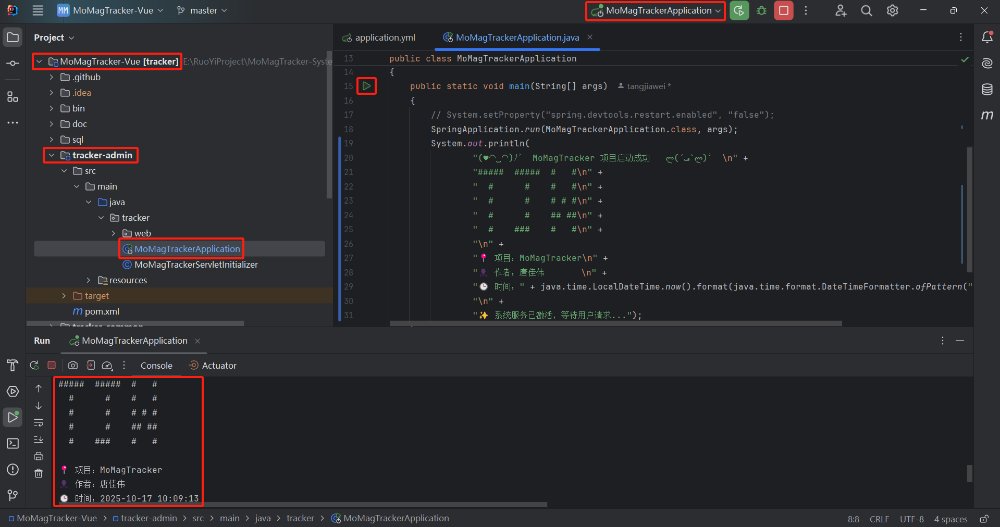

### 1.3 启动项目前端（VSCode）

进入到 `E:\RuoYiProject\MoMagTracker-System\MoMagTracker-Vue3`

```shell
# 终端启动服务
npm run dev
```

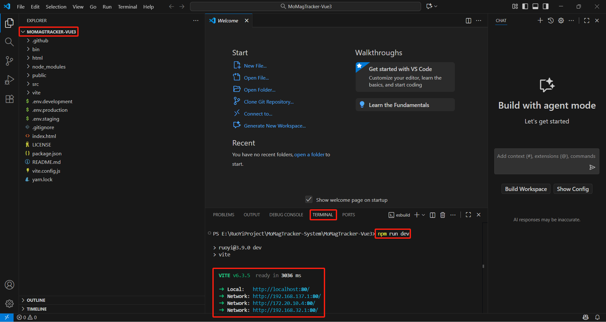

## 2 系统功能开发（SMS 短信功能）

### 2.1 后端（MoMagTracker-Vue 模块 Idea）

#### 2.1.1 tracker-admin 模块

##### 1 增加生成验证码类

在 `E:\RuoYiProject\MoMagTracker-System\MoMagTracker-Vue\tracker-admin\src\main\java\tracker\web\controller\system` 文件夹中，创建 `SysGenerateEmail.java` 文件，并输入如下代码

```java
package tracker.web.controller.system;

import tracker.common.constant.Constants;
import tracker.common.core.domain.AjaxResult;
import tracker.common.core.redis.RedisCache;
import tracker.common.utils.StringUtils;
import tracker.common.utils.uuid.IdUtils;
import tracker.system.service.SysIEmailService;
import io.swagger.annotations.Api;
import io.swagger.annotations.ApiOperation;
import org.slf4j.Logger;
import org.slf4j.LoggerFactory;
import org.springframework.beans.factory.annotation.Autowired;
import org.springframework.web.bind.annotation.*;

import java.util.HashMap;
import java.util.Map;
import java.util.concurrent.TimeUnit;

@Api(tags = "邮箱验证码接口")
@RestController
@RequestMapping("/email")
public class SysGenerateEmail {
    private static final Logger logger = LoggerFactory.getLogger(SysGenerateEmail.class);

    @Autowired
    private RedisCache redisCache;

    @Autowired
    private SysIEmailService emailService;

    @ApiOperation("生成邮箱验证码")
    @PostMapping("/code")
    public AjaxResult generateEmailCode(@RequestBody Map<String, String> requestBody) {
        logger.info("收到邮箱验证码请求，参数: {}", requestBody);
        try {
            String email = requestBody.get("email");

            // 参数验证
            if (StringUtils.isEmpty(email)) {
                return AjaxResult.error("邮箱地址不能为空");
            }

            // 邮箱格式验证
            if (!email.matches("^[A-Za-z0-9+_.-]+@(.+)$")) {
                return AjaxResult.error("邮箱格式不正确");
            }

            // 生成验证码和 uuid
            String uuid = IdUtils.simpleUUID();
            String verifyKey = Constants.EMAIL_CAPTCHA_CODE_KEY + uuid;

            // 生成 6 位数字验证码
            int code = (int) (Math.random() * 900000) + 100000;

            // 构建验证码信息
            Map<String, Object> emailInfo = new HashMap<>();
            emailInfo.put("email", email);
            emailInfo.put("code", String.valueOf(code));
            emailInfo.put("createTime", System.currentTimeMillis());

            // 存储到 Redis，设置 3 分钟过期
            redisCache.setCacheObject(verifyKey, emailInfo, Constants.EMAIL_EXPIRATION, TimeUnit.MINUTES);

            // 发送邮件
            boolean sendResult = emailService.sendVerificationCode(email, String.valueOf(code));

            if (sendResult) {
                logger.info("为邮箱 {} 发送验证码成功：{}, UUID: {}", email, code, uuid);

                AjaxResult ajax = AjaxResult.success("验证码发送成功");
                ajax.put("uuid", uuid);
                return ajax;
            } else {
                logger.error("为邮箱 {} 发送验证码失败", email);
                return AjaxResult.error("验证码发送失败，请稍后重试");
            }

        } catch (Exception e) {
            logger.error("生成邮箱验证码失败", e);
            return AjaxResult.error("验证码发送失败，请稍后重试");
        }
    }
}
```

- 结果

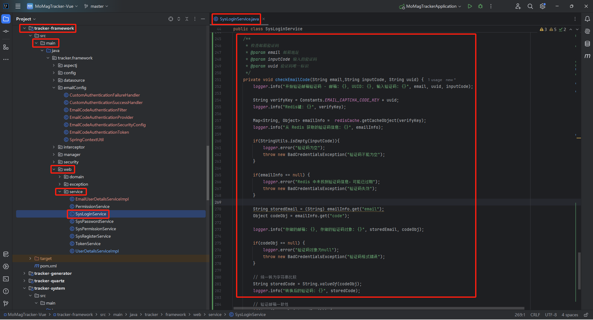

##### 2 添加手机号登录映射 

在 ` E:\RuoYiProject\MoMagTracker-System\MoMagTracker-Vue\tracker-admin\src\main\java\tracker\web\controller\system\SysLoginController.java` 文件中添加下述代码

```java
package tracker.web.controller.system;

import java.util.Date;
import java.util.List;
import java.util.Set;

import io.swagger.annotations.ApiOperation;
import org.slf4j.Logger;
import org.slf4j.LoggerFactory;
import org.springframework.beans.factory.annotation.Autowired;
import org.springframework.web.bind.annotation.GetMapping;
import org.springframework.web.bind.annotation.PostMapping;
import org.springframework.web.bind.annotation.RequestBody;
import org.springframework.web.bind.annotation.RestController;
import tracker.common.constant.Constants;
import tracker.common.core.domain.AjaxResult;
import tracker.common.core.domain.entity.SysMenu;
import tracker.common.core.domain.entity.SysUser;
import tracker.common.core.domain.model.LoginBody;
import tracker.common.core.domain.model.LoginUser;
import tracker.common.core.text.Convert;
import tracker.common.utils.DateUtils;
import tracker.common.utils.SecurityUtils;
import tracker.common.utils.StringUtils;
import tracker.framework.web.service.SysLoginService;
import tracker.framework.web.service.SysPermissionService;
import tracker.framework.web.service.TokenService;
import tracker.system.service.ISysConfigService;
import tracker.system.service.ISysMenuService;

/**
 * 登录验证
 * 
 * @author tangjiawei
 */
@RestController
public class SysLoginController
{
    private static final Logger logger = LoggerFactory.getLogger(SysLoginController.class);

    @Autowired
    private SysLoginService loginService;

    @Autowired
    private ISysMenuService menuService;

    @Autowired
    private SysPermissionService permissionService;

    @Autowired
    private TokenService tokenService;

    @Autowired
    private ISysConfigService configService;

    /**
     * 登录方法
     * 
     * @param loginBody 登录信息
     * @return 结果
     */
    @PostMapping("/login")
    public AjaxResult login(@RequestBody LoginBody loginBody)
    {
        AjaxResult ajax = AjaxResult.success();
        // 生成令牌
        String token = loginService.login(loginBody.getUsername(), loginBody.getPassword(), loginBody.getCode(),
                loginBody.getUuid());
        ajax.put(Constants.TOKEN, token);
        return ajax;
    }

    /**
     * 邮箱登录方法
     *
     * @param loginBody 登录信息（包含邮箱、邮箱验证码、uuid）
     * @return 结果
     */
    @ApiOperation("邮箱登录")
    @PostMapping("/email/login")
    public AjaxResult emailLogin(@RequestBody LoginBody loginBody) {
        logger.info("收到邮箱登录请求 - 邮箱: {}, 验证码: {}, UUID: {}",
                loginBody.getEmail(),
                loginBody.getEmailCode(),
                loginBody.getUuid());

        try {
            String email = loginBody.getEmail();
            String emailCode = loginBody.getEmailCode();
            String uuid = loginBody.getUuid();

            // 参数验证
            if (StringUtils.isEmpty(email) || StringUtils.isEmpty(emailCode) || StringUtils.isEmpty(uuid)) {
                logger.error("参数不完整 - 邮箱: {}, 验证码: {}, UUID: {}", email, emailCode, uuid);
                return AjaxResult.error("参数不完整");
            }

            // 邮箱格式验证
            if (!email.matches("^[A-Za-z0-9+_.-]+@(.+)$")) {
                return AjaxResult.error("邮箱格式不正确");
            }

            // 调用登录服务
            AjaxResult ajax = loginService.emailLogin(email, emailCode, uuid);
            return ajax;

        } catch (Exception e) {
            logger.error("邮箱登录失败", e);
            return AjaxResult.error("登录失败，请稍后重试");
        }
    }

    /**
     * 获取用户信息
     * 
     * @return 用户信息
     */
    @GetMapping("getInfo")
    public AjaxResult getInfo()
    {
        LoginUser loginUser = SecurityUtils.getLoginUser();
        SysUser user = loginUser.getUser();
        // 角色集合
        Set<String> roles = permissionService.getRolePermission(user);
        // 权限集合
        Set<String> permissions = permissionService.getMenuPermission(user);
        if (!loginUser.getPermissions().equals(permissions))
        {
            loginUser.setPermissions(permissions);
            tokenService.refreshToken(loginUser);
        }
        AjaxResult ajax = AjaxResult.success();
        ajax.put("user", user);
        ajax.put("roles", roles);
        ajax.put("permissions", permissions);
        ajax.put("isDefaultModifyPwd", initPasswordIsModify(user.getPwdUpdateDate()));
        ajax.put("isPasswordExpired", passwordIsExpiration(user.getPwdUpdateDate()));
        return ajax;
    }

    /**
     * 获取路由信息
     * 
     * @return 路由信息
     */
    @GetMapping("getRouters")
    public AjaxResult getRouters()
    {
        Long userId = SecurityUtils.getUserId();
        logger.info("🔄 [后端] 获取路由信息，用户ID: {}", userId);

        List<SysMenu> menus = menuService.selectMenuTreeByUserId(userId);
        logger.info("✅ [后端] selectMenuTreeByUserId 返回的菜单数量: {}", (menus != null ? menus.size() : 0));
        return AjaxResult.success(menuService.buildMenus(menus));
    }
    
    // 检查初始密码是否提醒修改
    public boolean initPasswordIsModify(Date pwdUpdateDate)
    {
        Integer initPasswordModify = Convert.toInt(configService.selectConfigByKey("sys.account.initPasswordModify"));
        return initPasswordModify != null && initPasswordModify == 1 && pwdUpdateDate == null;
    }

    // 检查密码是否过期
    public boolean passwordIsExpiration(Date pwdUpdateDate)
    {
        Integer passwordValidateDays = Convert.toInt(configService.selectConfigByKey("sys.account.passwordValidateDays"));
        if (passwordValidateDays != null && passwordValidateDays > 0)
        {
            if (StringUtils.isNull(pwdUpdateDate))
            {
                // 如果从未修改过初始密码，直接提醒过期
                return true;
            }
            Date nowDate = DateUtils.getNowDate();
            return DateUtils.differentDaysByMillisecond(nowDate, pwdUpdateDate) > passwordValidateDays;
        }
        return false;
    }
}
```

- 结果


##### 3 网易邮箱配置

在 `E:\RuoYiProject\MoMagTracker-System\MoMagTracker-Vue\tracker-admin\src\main\resources\application.yml` 文件中添加下述代码

```java
# Spring配置
spring:
  # 邮件配置 - 新增网易邮箱配置
  mail:
    host: smtp.163.com  # 邮箱服务器
    port: 465           # SSL端口
    username: 15948660043@163.com  # 发件人邮箱
    password: LVxYK34uNZTgMfUM  # SMTP授权码
    default-encoding: UTF-8
    protocol: smtp
    properties:
      mail:
        smtp:
          auth: true
          starttls:
            enable: false  # 不使用 TLS
          ssl:
            enable: true   # 使用 SSL 加密
          connectiontimeout: 5000
          timeout: 5000
          writetimeout: 5000
```

- 结果

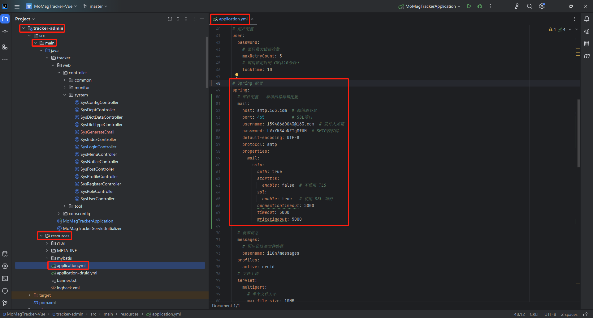

##### 4 继承父类 pom.xml

在 `E:\RuoYiProject\MoMagTracker-System\MoMagTracker-Vue\tracker-admin\pom.xml` 文件中加入下述代码（**父类地址：E:\RuoYiProject\MoMagTracker-System\MoMagTracker-Vue\pom.xml**）

```java
        <!-- 系统模块 - 新增 -->
        <dependency>
            <groupId>tracker</groupId>
            <artifactId>tracker-system</artifactId>
            <version>3.9.0</version>
        </dependency>
```

- 结果

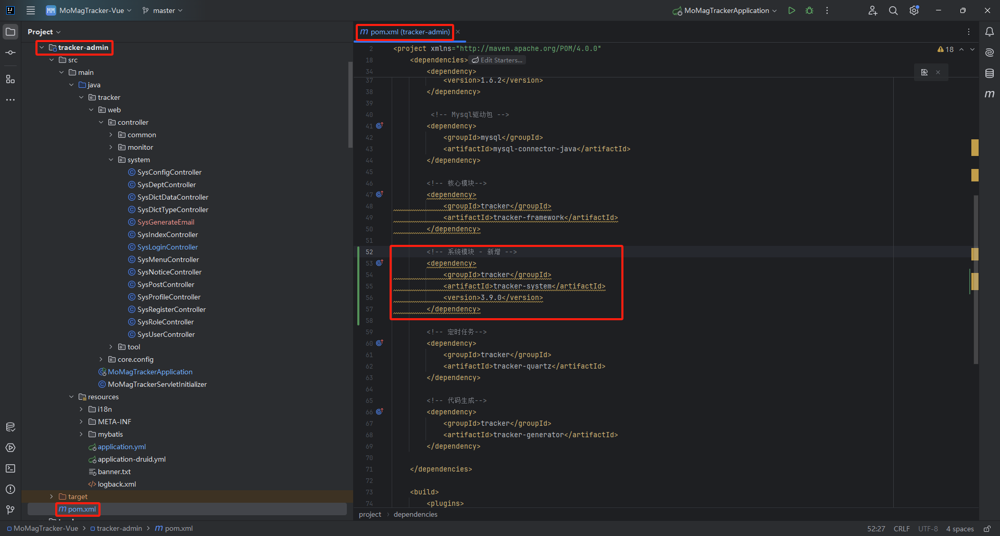

#### 2.1.2 tracker-common 模块

##### 1 增加手机号及短信验证码字段

在 `E:\RuoYiProject\MoMagTracker-System\MoMagTracker-Vue\tracker-common\src\main\java\tracker\common\core\domain\model\LoginBody.java` 文件中添加下述代码

```java
package tracker.common.core.domain.model;
import org.slf4j.Logger;
import org.slf4j.LoggerFactory;


/**
 * 用户登录对象
 * 
 * @author tangjiawei
 */
public class LoginBody
{
    private static final Logger logger = LoggerFactory.getLogger(LoginBody.class);

    /**
     * 用户名
     */
    private String username;

    /**
     * 用户密码
     */
    private String password;

    /**
     * 验证码
     */
    private String code;

    /**
     * 唯一标识
     */
    private String uuid;

    /**
     * 邮箱地址
     */
    private String email;

    /**
     * 邮箱验证码
     */
    private String emailCode;

    public String getUsername()
    {
        return username;
    }

    public void setUsername(String username)
    {
        this.username = username;
    }

    public String getPassword()
    {
        return password;
    }

    public void setPassword(String password)
    {
        this.password = password;
    }

    public String getCode()
    {
        return code;
    }

    public void setCode(String code)
    {
        this.code = code;
    }

    public String getUuid()
    {
        return uuid;
    }

    public void setUuid(String uuid)
    {
        this.uuid = uuid;
    }

    public String getEmail() {
        logger.info("🔧 getEmail 被调用，参数: {}", email);
        return email;
    }

    public void setEmail(String email) {
        logger.info("🔧 setEmail 被调用，参数: {}", email);
        this.email = email;
    }

    public String getEmailCode() {
        logger.info("🔧 getEmailCode 被调用，返回值: {}", emailCode);
        return emailCode;
    }

    public void setEmailCode(String emailCode) {
        logger.info("🔧 setEmailCode 被调用，参数: {}", emailCode);
        this.emailCode = emailCode;
    }
}
```

- 结果

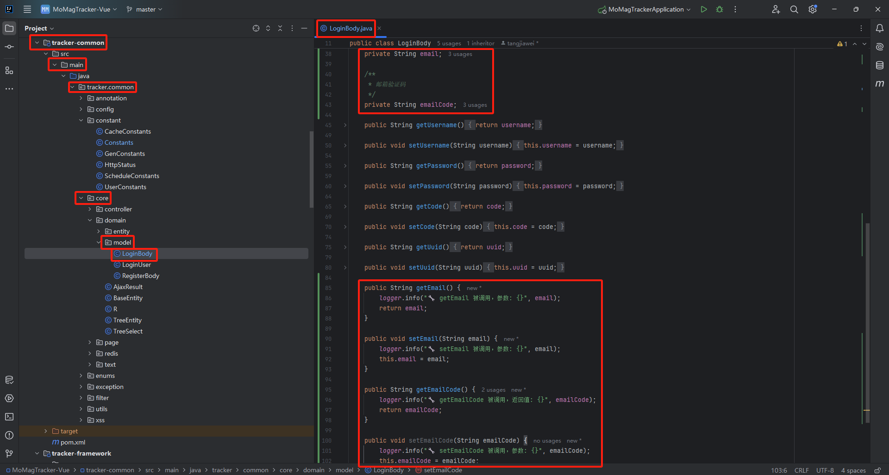

##### 2 添加相关常量

在 `E:\RuoYiProject\MoMagTracker-System\MoMagTracker-Vue\tracker-common\src\main\java\tracker\common\constant\Constants.java` 文件中添加如下代码

```java
    /**
     * 验证码 redis key
     */
    public static final String CAPTCHA_CODE_KEY = "captcha_codes:";

    /**
     * 邮箱验证码 redis key
     */
    public static final String EMAIL_CAPTCHA_CODE_KEY = "email_captcha_codes:";

    /**
     * 邮箱验证码有效期（分钟）
     */
    public static final Integer EMAIL_EXPIRATION = 1;
```

- 结果

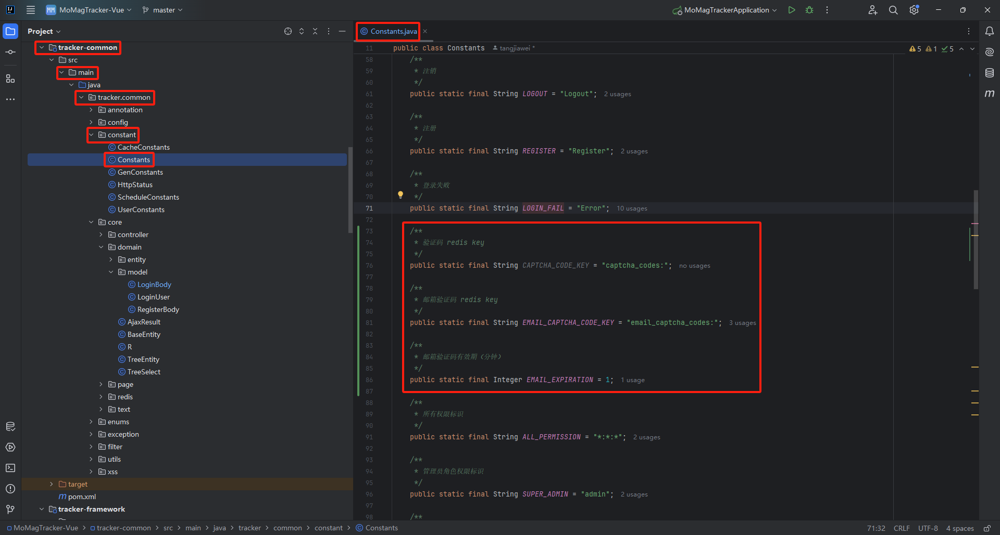

#### 2.1.3 tracker-framework 模块

##### 1 添加手机号登录验证方法

在 `E:\RuoYiProject\MoMagTracker-System\MoMagTracker-Vue\tracker-framework\src\main\java\tracker\framework\web\service\SysLoginService.java` 文件中输入下述代码

```java
package tracker.framework.web.service;

import org.slf4j.Logger;
import org.slf4j.LoggerFactory;
import javax.annotation.Resource;
import org.springframework.beans.factory.annotation.Autowired;
import org.springframework.security.authentication.AuthenticationManager;
import org.springframework.security.authentication.BadCredentialsException;
import org.springframework.security.authentication.UsernamePasswordAuthenticationToken;
import org.springframework.security.core.Authentication;
import org.springframework.stereotype.Component;
import tracker.common.constant.CacheConstants;
import tracker.common.constant.Constants;
import tracker.common.constant.UserConstants;
import tracker.common.core.domain.AjaxResult;
import tracker.common.core.domain.entity.SysUser;
import tracker.common.core.domain.model.LoginUser;
import tracker.common.core.redis.RedisCache;
import tracker.common.exception.ServiceException;
import tracker.common.exception.user.BlackListException;
import tracker.common.exception.user.CaptchaException;
import tracker.common.exception.user.CaptchaExpireException;
import tracker.common.exception.user.UserNotExistsException;
import tracker.common.exception.user.UserPasswordNotMatchException;
import tracker.common.utils.DateUtils;
import tracker.common.utils.MessageUtils;
import tracker.common.utils.StringUtils;
import tracker.common.utils.ip.IpUtils;
import tracker.framework.manager.AsyncManager;
import tracker.framework.manager.factory.AsyncFactory;
import tracker.framework.security.context.AuthenticationContextHolder;
import tracker.framework.emailConfig.EmailCodeAuthenticationToken;
import tracker.system.service.ISysConfigService;
import tracker.system.service.ISysUserService;

import java.util.Map;

/**
 * 登录校验方法
 *
 * @author tangjiawei
 */
@Component
public class SysLoginService
{
    private static final Logger logger = LoggerFactory.getLogger(SysLoginService.class);

    @Autowired
    private TokenService tokenService;

    @Resource
    private AuthenticationManager authenticationManager;

    @Autowired
    private RedisCache redisCache;

    @Autowired
    private ISysUserService userService;

    @Autowired
    private ISysConfigService configService;

    /**
     * 登录验证
     *
     * @param username 用户名
     * @param password 密码
     * @param code 验证码
     * @param uuid 唯一标识
     * @return 结果
     */
    public String login(String username, String password, String code, String uuid)
    {
        // 验证码校验
        validateCaptcha(username, code, uuid);
        // 登录前置校验
        loginPreCheck(username, password);
        // 用户验证
        Authentication authentication = null;
        try
        {
            UsernamePasswordAuthenticationToken authenticationToken = new UsernamePasswordAuthenticationToken(username, password);
            AuthenticationContextHolder.setContext(authenticationToken);
            // 该方法会去调用UserDetailsServiceImpl.loadUserByUsername
            authentication = authenticationManager.authenticate(authenticationToken);
        }
        catch (Exception e)
        {
            if (e instanceof BadCredentialsException)
            {
                AsyncManager.me().execute(AsyncFactory.recordLogininfor(username, Constants.LOGIN_FAIL, MessageUtils.message("user.password.not.match")));
                throw new UserPasswordNotMatchException();
            }
            else
            {
                AsyncManager.me().execute(AsyncFactory.recordLogininfor(username, Constants.LOGIN_FAIL, e.getMessage()));
                throw new ServiceException(e.getMessage());
            }
        }
        finally
        {
            AuthenticationContextHolder.clearContext();
        }
        AsyncManager.me().execute(AsyncFactory.recordLogininfor(username, Constants.LOGIN_SUCCESS, MessageUtils.message("user.login.success")));
        LoginUser loginUser = (LoginUser) authentication.getPrincipal();
        recordLoginInfo(loginUser.getUserId());
        // 生成token
        return tokenService.createToken(loginUser);
    }

    /**
     * 校验验证码
     *
     * @param username 用户名
     * @param code 验证码
     * @param uuid 唯一标识
     * @return 结果
     */
    public void validateCaptcha(String username, String code, String uuid)
    {
        boolean captchaEnabled = configService.selectCaptchaEnabled();
        if (captchaEnabled)
        {
            String verifyKey = CacheConstants.CAPTCHA_CODE_KEY + StringUtils.nvl(uuid, "");
            String captcha = redisCache.getCacheObject(verifyKey);
            if (captcha == null)
            {
                AsyncManager.me().execute(AsyncFactory.recordLogininfor(username, Constants.LOGIN_FAIL, MessageUtils.message("user.jcaptcha.expire")));
                throw new CaptchaExpireException();
            }
            redisCache.deleteObject(verifyKey);
            if (!code.equalsIgnoreCase(captcha))
            {
                AsyncManager.me().execute(AsyncFactory.recordLogininfor(username, Constants.LOGIN_FAIL, MessageUtils.message("user.jcaptcha.error")));
                throw new CaptchaException();
            }
        }
    }

    /**
     * 登录前置校验
     * @param username 用户名
     * @param password 用户密码
     */
    public void loginPreCheck(String username, String password)
    {
        // 用户名或密码为空 错误
        if (StringUtils.isEmpty(username) || StringUtils.isEmpty(password))
        {
            AsyncManager.me().execute(AsyncFactory.recordLogininfor(username, Constants.LOGIN_FAIL, MessageUtils.message("not.null")));
            throw new UserNotExistsException();
        }
        // 密码如果不在指定范围内 错误
        if (password.length() < UserConstants.PASSWORD_MIN_LENGTH
                || password.length() > UserConstants.PASSWORD_MAX_LENGTH)
        {
            AsyncManager.me().execute(AsyncFactory.recordLogininfor(username, Constants.LOGIN_FAIL, MessageUtils.message("user.password.not.match")));
            throw new UserPasswordNotMatchException();
        }
        // 用户名不在指定范围内 错误
        if (username.length() < UserConstants.USERNAME_MIN_LENGTH
                || username.length() > UserConstants.USERNAME_MAX_LENGTH)
        {
            AsyncManager.me().execute(AsyncFactory.recordLogininfor(username, Constants.LOGIN_FAIL, MessageUtils.message("user.password.not.match")));
            throw new UserPasswordNotMatchException();
        }
        // IP黑名单校验
        String blackStr = configService.selectConfigByKey("sys.login.blackIPList");
        if (IpUtils.isMatchedIp(blackStr, IpUtils.getIpAddr()))
        {
            AsyncManager.me().execute(AsyncFactory.recordLogininfor(username, Constants.LOGIN_FAIL, MessageUtils.message("login.blocked")));
            throw new BlackListException();
        }
    }

    /**
     * 记录登录信息
     *
     * @param userId 用户ID
     */
    public void recordLoginInfo(Long userId)
    {
        SysUser sysUser = new SysUser();
        sysUser.setUserId(userId);
        sysUser.setLoginIp(IpUtils.getIpAddr());
        sysUser.setLoginDate(DateUtils.getNowDate());
        userService.updateUserProfile(sysUser);
    }

    /**
     * 邮箱登录验证
     *
     * @param email 邮箱地址
     * @param emailCode 邮箱验证码
     * @param uuid 唯一标识
     * @return 结果
     */
    public AjaxResult emailLogin(String email, String emailCode, String uuid)
    {
        logger.info("=== 开始邮箱登录验证 ===");
        logger.info("邮箱: {}, UUID: {}, 验证码: {}", email, uuid, emailCode);

        // 用户验证
        Authentication authentication = null;
        try
        {
            logger.info("1. 检查邮箱验证码...");
            checkEmailCode(email, emailCode, uuid);
            logger.info("2. 邮箱验证码检查通过");

            // 该方法会去调用 UserDetailsServiceImpl.loadUserByUsername
            // 使用 EmailCodeAuthenticationToken 进行认证
            logger.info("3. 创建 EmailCodeAuthenticationToken");
            EmailCodeAuthenticationToken authenticationToken = new EmailCodeAuthenticationToken(email, emailCode, uuid);
            AuthenticationContextHolder.setContext(authenticationToken);

            logger.info("4. 开始身份认证...");
            authentication = authenticationManager.authenticate(authenticationToken);
            logger.info("5. 身份认证成功");

            AsyncManager.me().execute(AsyncFactory.recordLogininfor(email, Constants.LOGIN_SUCCESS, MessageUtils.message("user.login.success")));
            LoginUser loginUser = (LoginUser) authentication.getPrincipal();

            logger.info("6. 生成token");
            String token = tokenService.createToken(loginUser);

            AjaxResult ajax = AjaxResult.success();
            ajax.put(Constants.TOKEN, token);
            logger.info("7. 邮箱登录成功，返回token");

            return ajax;
        }
        catch (Exception e)
        {
            logger.error("邮箱登录失败 - 邮箱: {}, 错误: {}", email, e.getMessage(), e);
            AsyncManager.me().execute(AsyncFactory.recordLogininfor(email, Constants.LOGIN_FAIL, e.getMessage()));
            return AjaxResult.error("登录失败: " + e.getMessage());
        }
        finally
        {
            AuthenticationContextHolder.clearContext();
        }
    }

    /**
     * 检查邮箱验证码
     * @param email 邮箱地址
     * @param inputCode 输入的验证码
     * @param uuid 验证码唯一标识
     */
    private void checkEmailCode(String email,String inputCode, String uuid) {
        logger.info("开始验证邮箱验证码 - 邮箱: {}, UUID: {}, 输入验证码: {}", email, uuid, inputCode);

        String verifyKey = Constants.EMAIL_CAPTCHA_CODE_KEY + uuid;
        logger.info("Redis键: {}", verifyKey);

        Map<String, Object> emailInfo =  redisCache.getCacheObject(verifyKey);
        logger.info("从 Redis 获取的验证码信息: {}", emailInfo);

        if(StringUtils.isEmpty(inputCode)){
            logger.error("验证码为空");
            throw new BadCredentialsException("验证码不能为空");
        }

        if(emailInfo == null) {
            logger.error("Redis 中未找到验证码信息，可能已过期");
            throw new BadCredentialsException("验证码失效");
        }

        String storedEmail = (String) emailInfo.get("email");
        Object codeObj = emailInfo.get("code");

        logger.info("存储的邮箱: {}, 存储的验证码对象: {}", storedEmail, codeObj);

        if(codeObj == null) {
            logger.error("验证码对象为null");
            throw new BadCredentialsException("验证码格式错误");
        }

        // 统一转为字符串比较
        String storedCode = String.valueOf(codeObj);
        logger.info("转换后的验证码: {}", storedCode);

        // 验证邮箱一致性
        if(!email.equals(storedEmail)) {
            logger.error("邮箱不匹配 - 输入: {}, 存储: {}", email, storedEmail);
            throw new BadCredentialsException("邮箱地址不一致");
        }

        // 验证验证码
        if(!storedCode.equals(inputCode)) {
            logger.error("验证码不匹配 - 输入: {}, 存储: {}", inputCode, storedCode);
            throw new BadCredentialsException("验证码错误");
        }

        // 验证通过后删除 Redis 中的验证码
        redisCache.deleteObject(verifyKey);
        logger.info("验证码验证成功，已从Redis删除");
    }
}
```

- 结果


##### 2 增加短信配置

在 `E:\RuoYiProject\MoMagTracker-System\MoMagTracker-Vue\tracker-framework\src\main\java\tracker\framework` 文件夹下创建 `emailConfig` 文件夹，结构如下：

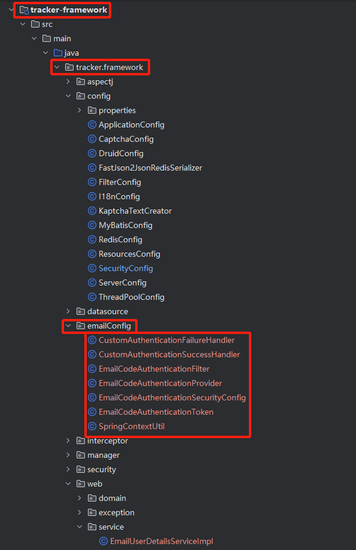

##### 3 增加短信相关文件

在 `E:\RuoYiProject\MoMagTracker-System\MoMagTracker-Vue\tracker-framework\src\main\java\tracker\framework\emailConfig` 文件夹下创建下述文件，并在相应的文件中填入如下代码

###### CustomAuthenticationFailureHandler

```java
package tracker.framework.emailConfig;

import com.fasterxml.jackson.databind.ObjectMapper;
import tracker.common.core.domain.AjaxResult;
import org.slf4j.Logger;
import org.slf4j.LoggerFactory;
import org.springframework.beans.factory.annotation.Autowired;
import org.springframework.http.HttpStatus;
import org.springframework.security.authentication.BadCredentialsException;
import org.springframework.security.authentication.InternalAuthenticationServiceException;
import org.springframework.security.core.AuthenticationException;
import org.springframework.security.web.authentication.AuthenticationFailureHandler;
import org.springframework.stereotype.Component;

import javax.servlet.ServletException;
import javax.servlet.http.HttpServletRequest;
import javax.servlet.http.HttpServletResponse;
import java.io.IOException;

@Component
public class CustomAuthenticationFailureHandler implements AuthenticationFailureHandler {
    @Autowired
    private ObjectMapper objectMapper;

    private Logger logger = LoggerFactory.getLogger(getClass());

    @Override
    public void onAuthenticationFailure(HttpServletRequest request, HttpServletResponse response, AuthenticationException exception) throws IOException, ServletException {
        String errorMessage = getErrorMessage(exception);
        logger.warn("邮箱登录失败: {} - {}", exception.getClass().getSimpleName(), errorMessage);

        response.setStatus(HttpStatus.UNAUTHORIZED.value());
        response.setContentType("application/json;charset=UTF-8");

        AjaxResult ajax = AjaxResult.error(errorMessage);
        response.getWriter().write(objectMapper.writeValueAsString(ajax));
    }

    /**
     * 根据异常类型返回更友好的错误信息
     */
    private String getErrorMessage(AuthenticationException exception) {
        if (exception instanceof BadCredentialsException) {
            return exception.getMessage();
        } else if (exception instanceof InternalAuthenticationServiceException) {
            return "系统内部错误，请稍后重试";
        } else {
            return exception.getMessage() != null ? exception.getMessage() : "登录失败";
        }
    }
}
```

###### CustomAuthenticationSuccessHandler

```java
package tracker.framework.emailConfig;

import com.fasterxml.jackson.databind.ObjectMapper;
import tracker.common.constant.Constants;
import tracker.common.core.domain.AjaxResult;
import tracker.common.core.domain.model.LoginUser;
import tracker.framework.web.service.TokenService;
import org.slf4j.Logger;
import org.slf4j.LoggerFactory;
import org.springframework.beans.factory.annotation.Autowired;
import org.springframework.security.core.Authentication;
import org.springframework.security.web.authentication.AuthenticationSuccessHandler;
import org.springframework.stereotype.Component;

import javax.servlet.ServletException;
import javax.servlet.http.HttpServletRequest;
import javax.servlet.http.HttpServletResponse;
import java.io.IOException;

@Component
public class CustomAuthenticationSuccessHandler implements AuthenticationSuccessHandler {
    @Autowired
    private ObjectMapper objectMapper;
    @Autowired
    TokenService tokenService;

    private Logger logger = LoggerFactory.getLogger(getClass());

    @Override
    public void onAuthenticationSuccess(HttpServletRequest request, HttpServletResponse response, Authentication authentication) throws IOException, ServletException {
        logger.info("邮箱登录成功");

        AjaxResult ajax = AjaxResult.success();
        LoginUser loginUser = (LoginUser) authentication.getPrincipal();
        String token = tokenService.createToken(loginUser);
        ajax.put(Constants.TOKEN, token);

        logger.info("用户 {} 邮箱登录成功，生成token", loginUser.getUsername());

        response.setContentType("application/json;charset=UTF-8");
        response.getWriter().write(objectMapper.writeValueAsString(ajax));
    }
}
```

###### EmailCodeAuthenticationFilter

```shell
package tracker.framework.emailConfig;

import com.fasterxml.jackson.databind.ObjectMapper;
import org.springframework.security.authentication.AuthenticationServiceException;
import org.springframework.security.core.Authentication;
import org.springframework.security.core.AuthenticationException;
import org.springframework.security.web.authentication.AbstractAuthenticationProcessingFilter;
import org.springframework.security.web.util.matcher.AntPathRequestMatcher;
import org.springframework.util.Assert;

import javax.servlet.http.HttpServletRequest;
import javax.servlet.http.HttpServletResponse;
import java.io.BufferedReader;
import java.util.Map;

/**
 * 邮箱登录的鉴权过滤器，模仿 UsernamePasswordAuthenticationFilter 实现
 */
public class EmailCodeAuthenticationFilter extends AbstractAuthenticationProcessingFilter {
    /**
     * 邮箱地址的字段name
     */
    public static final String SPRING_SECURITY_FORM_EMAIL_KEY = "email";

    /**
     * 邮箱验证码的字段name
     */
    public static final String SPRING_SECURITY_FORM_EMAIL_CODE_KEY = "emailCode";

    /**
     * UUID的字段name
     */
    public static final String SPRING_SECURITY_FORM_UUID_KEY = "uuid";

    private String emailParameter = SPRING_SECURITY_FORM_EMAIL_KEY;
    private String emailCodeParameter = SPRING_SECURITY_FORM_EMAIL_CODE_KEY;
    private String uuidParameter = SPRING_SECURITY_FORM_UUID_KEY;

    /**
     * 是否仅 POST 方式
     */
    private boolean postOnly = true;

    public EmailCodeAuthenticationFilter() {
        // 邮箱登录的请求 post 方式的 /email/login
        super(new AntPathRequestMatcher("/email/login", "POST"));
    }

    @Override
    public Authentication attemptAuthentication(HttpServletRequest request, HttpServletResponse response) throws AuthenticationException {
        if (postOnly && !request.getMethod().equals("POST")) {
            throw new AuthenticationServiceException(
                    "Authentication method not supported: " + request.getMethod());
        }

        // 从请求体中读取 JSON 数据
        Map<String, String> requestBody = readRequestBody(request);

        String email = requestBody.get(emailParameter);
        String emailCode = requestBody.get(emailCodeParameter);
        String uuid = requestBody.get(uuidParameter);

        if (email == null) {
            email = "";
        }
        if (emailCode == null) {
            emailCode = "";
        }
        if (uuid == null) {
            uuid = "";
        }

        email = email.trim();

        // 创建包含所有认证信息的 Token
        EmailCodeAuthenticationToken authRequest = new EmailCodeAuthenticationToken(email, emailCode, uuid);

        // Allow subclasses to set the "details" property
        setDetails(request, authRequest);

        return this.getAuthenticationManager().authenticate(authRequest);
    }

    /**
     * 从请求体中读取 JSON 数据
     */
    private Map<String, String> readRequestBody(HttpServletRequest request) {
        StringBuilder stringBuilder = new StringBuilder();
        try {
            BufferedReader reader = request.getReader();
            char[] charBuffer = new char[128];
            int bytesRead;
            while ((bytesRead = reader.read(charBuffer)) != -1) {
                stringBuilder.append(charBuffer, 0, bytesRead);
            }

            if (stringBuilder.length() > 0) {
                ObjectMapper objectMapper = new ObjectMapper();
                return objectMapper.readValue(stringBuilder.toString(), Map.class);
            }
        } catch (Exception e) {
            logger.warn("读取请求体失败: " + e.getMessage());
        }
        return java.util.Collections.emptyMap();
    }

    protected void setDetails(HttpServletRequest request, EmailCodeAuthenticationToken authRequest) {
        authRequest.setDetails(authenticationDetailsSource.buildDetails(request));
    }

    public String getEmailParameter() {
        return emailParameter;
    }

    public void setEmailParameter(String emailParameter) {
        Assert.hasText(emailParameter, "Email parameter must not be empty or null");
        this.emailParameter = emailParameter;
    }

    public String getEmailCodeParameter() {
        return emailCodeParameter;
    }

    public void setEmailCodeParameter(String emailCodeParameter) {
        Assert.hasText(emailCodeParameter, "Email code parameter must not be empty or null");
        this.emailCodeParameter = emailCodeParameter;
    }

    public String getUuidParameter() {
        return uuidParameter;
    }

    public void setUuidParameter(String uuidParameter) {
        Assert.hasText(uuidParameter, "UUID parameter must not be empty or null");
        this.uuidParameter = uuidParameter;
    }

    public void setPostOnly(boolean postOnly) {
        this.postOnly = postOnly;
    }
}
```

###### EmailCodeAuthenticationProvider

```java
package tracker.framework.emailConfig;

import org.slf4j.Logger;
import org.slf4j.LoggerFactory;
import org.springframework.beans.factory.annotation.Autowired;
import org.springframework.security.authentication.AuthenticationProvider;
import org.springframework.security.authentication.BadCredentialsException;
import org.springframework.security.core.Authentication;
import org.springframework.security.core.AuthenticationException;
import org.springframework.security.core.userdetails.UserDetails;
import org.springframework.security.core.userdetails.UsernameNotFoundException;
import org.springframework.stereotype.Component;
import tracker.common.constant.Constants;
import tracker.common.core.redis.RedisCache;
import tracker.common.utils.StringUtils;
import tracker.framework.web.service.EmailUserDetailsServiceImpl;

import java.util.Map;

/**
 * 邮箱登录鉴权 Provider
 */
@Component
public class EmailCodeAuthenticationProvider implements AuthenticationProvider {
    private static final Logger logger = LoggerFactory.getLogger(EmailCodeAuthenticationProvider.class);

    private final EmailUserDetailsServiceImpl userDetailsService;
    private final RedisCache redisCache;

    // 明确指定使用 EmailUserDetailsServiceImpl
    @Autowired
    public EmailCodeAuthenticationProvider(EmailUserDetailsServiceImpl userDetailsService, RedisCache redisCache) {
        this.userDetailsService = userDetailsService;
        this.redisCache = redisCache;
        logger.info("EmailCodeAuthenticationProvider 初始化完成，userDetailsService: {}, redisCache: {}",
                userDetailsService != null ? "已注入" : "未注入",
                redisCache != null ? "已注入" : "未注入");
    }

    @Override
    public Authentication authenticate(Authentication authentication) throws AuthenticationException {
        logger.info("开始邮箱认证流程");

        if (!(authentication instanceof EmailCodeAuthenticationToken)) {
            logger.error("认证类型不匹配，期望: EmailCodeAuthenticationToken, 实际: {}", authentication.getClass());
            return null;
        }

        EmailCodeAuthenticationToken authenticationToken = (EmailCodeAuthenticationToken) authentication;

        String email = (String) authenticationToken.getPrincipal();
        String inputCode = (String) authenticationToken.getCredentials();
        String uuid = (String) authenticationToken.getUuid();

        logger.info("邮箱认证 - 邮箱地址: {}, UUID: {}, 验证码: {}", email, uuid, inputCode);

        try {
            // 验证验证码
            checkEmailCode(email, inputCode, uuid);

            // 使用 EmailUserDetailsServiceImpl 加载用户
            UserDetails userDetails = userDetailsService.loadUserByUsername(email);
            logger.info("成功加载用户信息: {}", userDetails.getUsername());

            // 创建认证成功的 Token
            EmailCodeAuthenticationToken authenticationResult =
                    new EmailCodeAuthenticationToken(userDetails, null, null, userDetails.getAuthorities());

            authenticationResult.setDetails(authenticationToken.getDetails());
            logger.info("邮箱认证成功");

            return authenticationResult;
        } catch (UsernameNotFoundException e) {
            logger.error("用户不存在: {}", email);
            throw new BadCredentialsException("用户不存在");
        } catch (Exception e) {
            logger.error("邮箱认证失败: {}", e.getMessage());
            throw new BadCredentialsException(e.getMessage());
        }
    }

    /**
     * 验证邮箱验证码
     */
    private void checkEmailCode(String email, String inputCode, String uuid) {
        logger.info("开始验证邮箱验证码 - 邮箱: {}, UUID: {}, 输入验证码: {}", email, uuid, inputCode);

        // 检查 redisCache 是否注入成功
        if (redisCache == null) {
            logger.error("redisCache 未正确注入，无法进行验证码验证");
            throw new BadCredentialsException("系统配置错误，请稍后重试");
        }

        // 参数校验
        if (StringUtils.isEmpty(inputCode)) {
            logger.error("验证码为空");
            throw new BadCredentialsException("验证码不能为空");
        }
        if (StringUtils.isEmpty(uuid)) {
            logger.error("UUID为空");
            throw new BadCredentialsException("UUID不能为空");
        }
        if (StringUtils.isEmpty(email)) {
            logger.error("邮箱地址为空");
            throw new BadCredentialsException("邮箱地址不能为空");
        }

        String verifyKey = Constants.EMAIL_CAPTCHA_CODE_KEY + uuid;
        logger.info("Redis键: {}", verifyKey);

        Map<String, Object> emailInfo = redisCache.getCacheObject(verifyKey);
        logger.info("从 Redis 获取的验证码信息: {}", emailInfo);

        if (emailInfo == null) {
            logger.error("Redis 中未找到验证码信息，可能已过期");
            throw new BadCredentialsException("验证码已失效，请重新获取");
        }

        String storedEmail = (String) emailInfo.get("email");
        Object codeObj = emailInfo.get("code");

        logger.info("存储的邮箱: {}, 存储的验证码对象: {}", storedEmail, codeObj);

        if (codeObj == null) {
            logger.error("验证码对象为null");
            throw new BadCredentialsException("验证码格式错误");
        }

        // 统一转为字符串比较
        String storedCode = String.valueOf(codeObj);
        logger.info("转换后的验证码: {}", storedCode);

        // 验证邮箱一致性
        if (!email.equals(storedEmail)) {
            logger.error("邮箱不匹配 - 输入: {}, 存储: {}", email, storedEmail);
            throw new BadCredentialsException("邮箱地址不一致");
        }

        // 验证验证码
        if (!storedCode.equals(inputCode)) {
            logger.error("验证码不匹配 - 输入: {}, 存储: {}", inputCode, storedCode);
            throw new BadCredentialsException("验证码错误");
        }

        // 验证通过后删除 Redis 中的验证码
        redisCache.deleteObject(verifyKey);
        logger.info("验证码验证成功，已从Redis删除");
    }

    @Override
    public boolean supports(Class<?> authentication) {
        boolean supports = EmailCodeAuthenticationToken.class.isAssignableFrom(authentication);
        logger.info("检查是否支持认证类型: {}, 结果: {}", authentication, supports);
        return supports;
    }
}
```

###### EmailCodeAuthenticationSecurityConfig

```java
package tracker.framework.emailConfig;

import tracker.framework.web.service.EmailUserDetailsServiceImpl;
import org.springframework.beans.factory.annotation.Autowired;
import org.springframework.security.authentication.AuthenticationManager;
import org.springframework.security.config.annotation.SecurityConfigurerAdapter;
import org.springframework.security.config.annotation.web.builders.HttpSecurity;
import org.springframework.security.web.DefaultSecurityFilterChain;
import org.springframework.security.web.authentication.UsernamePasswordAuthenticationFilter;
import org.springframework.stereotype.Component;

@Component
public class EmailCodeAuthenticationSecurityConfig extends SecurityConfigurerAdapter<DefaultSecurityFilterChain, HttpSecurity> {

    @Autowired
    private EmailUserDetailsServiceImpl userDetailsService;

    @Autowired
    private CustomAuthenticationSuccessHandler customAuthenticationSuccessHandler;

    @Autowired
    private CustomAuthenticationFailureHandler customAuthenticationFailureHandler;

    @Autowired
    private EmailCodeAuthenticationProvider emailCodeAuthenticationProvider; // 直接注入已经配置好的 Provider

    @Override
    public void configure(HttpSecurity http) throws Exception {
        // 1. 创建并配置邮箱登录过滤器
        EmailCodeAuthenticationFilter emailCodeAuthenticationFilter = new EmailCodeAuthenticationFilter();
        emailCodeAuthenticationFilter.setAuthenticationManager(http.getSharedObject(AuthenticationManager.class));
        emailCodeAuthenticationFilter.setAuthenticationSuccessHandler(customAuthenticationSuccessHandler);
        emailCodeAuthenticationFilter.setAuthenticationFailureHandler(customAuthenticationFailureHandler);

        // 2. 不再创建新的 Provider，使用已经注入的 emailCodeAuthenticationProvider
        // 注意：这里不再设置 userDetailsService，因为已经在构造器中注入了

        // 3. 注册提供者并添加过滤器
        http.authenticationProvider(emailCodeAuthenticationProvider)
                .addFilterAfter(emailCodeAuthenticationFilter, UsernamePasswordAuthenticationFilter.class);
    }
}
```

###### EmailCodeAuthenticationToken

```java
package tracker.framework.emailConfig;

import org.springframework.security.authentication.AbstractAuthenticationToken;
import org.springframework.security.core.GrantedAuthority;
import org.springframework.security.core.SpringSecurityCoreVersion;

import java.util.Collection;

/**
 * 邮箱登录 AuthenticationToken
 */
public class EmailCodeAuthenticationToken extends AbstractAuthenticationToken {

    private static final long serialVersionUID = SpringSecurityCoreVersion.SERIAL_VERSION_UID;

    private final Object principal;  // 邮箱地址
    private final Object credentials; // 验证码
    private final Object uuid;       // UUID

    /**
     * 构建一个没有鉴权的 EmailCodeAuthenticationToken
     */
    public EmailCodeAuthenticationToken(Object principal, Object credentials, Object uuid) {
        super(null);
        this.principal = principal;
        this.credentials = credentials;
        this.uuid = uuid;
        setAuthenticated(false);
    }

    /**
     * 构建拥有鉴权的 EmailCodeAuthenticationToken
     */
    public EmailCodeAuthenticationToken(Object principal, Object credentials, Object uuid,
                                        Collection<? extends GrantedAuthority> authorities) {
        super(authorities);
        this.principal = principal;
        this.credentials = credentials;
        this.uuid = uuid;
        super.setAuthenticated(true);
    }

    @Override
    public Object getCredentials() {
        return this.credentials;
    }

    @Override
    public Object getPrincipal() {
        return this.principal;
    }

    public Object getUuid() {
        return this.uuid;
    }

    @Override
    public void setAuthenticated(boolean isAuthenticated) throws IllegalArgumentException {
        if (isAuthenticated) {
            throw new IllegalArgumentException(
                    "Cannot set this token to trusted - use constructor which takes a GrantedAuthority list instead");
        }
        super.setAuthenticated(false);
    }

    @Override
    public void eraseCredentials() {
        super.eraseCredentials();
    }
}
```

###### SpringContextUtil

```java
package tracker.framework.emailConfig;

import org.springframework.beans.BeansException;
import org.springframework.context.ApplicationContext;
import org.springframework.context.ApplicationContextAware;
import org.springframework.stereotype.Component;

@Component
public class SpringContextUtil implements ApplicationContextAware {
    //     Spring应用上下文环境
    private static ApplicationContext applicationContext;

    /**
     * 实现ApplicationContextAware接口的回调方法，设置上下文环境
     *
     * @param applicationContext
     */
    @Override
    public void setApplicationContext(ApplicationContext applicationContext) {
        SpringContextUtil.applicationContext = applicationContext;
    }

    /**
     * @return ApplicationContext
     */
    public static ApplicationContext getApplicationContext() {
        return applicationContext;
    }

    /**
     * 获取对象
     * 这里重写了bean方法，起主要作用
     * @param name
     * @return Object 一个以所给名字注册的bean的实例
     * @throws BeansException
     */
    public static Object getBean(String name) throws BeansException {
        return applicationContext.getBean(name);
    }
    public static <T> T getBean(Class<T> requiredType) {

        return applicationContext.getBean(requiredType);
    }
}
```

##### 4 增加短信登录实现

在 `E:\RuoYiProject\MoMagTracker-System\MoMagTracker-Vue\tracker-framework\src\main\java\tracker\framework\web\service` 文件夹下新增 `EmailUserDetailsServiceImpl` 文件，并添加下述代码

```java
package tracker.framework.web.service;

import tracker.common.core.domain.entity.SysUser;
import tracker.common.core.domain.model.LoginUser;
import tracker.common.enums.UserStatus;
import tracker.common.exception.base.BaseException;
import tracker.common.utils.StringUtils;
import tracker.system.service.ISysUserService;
import org.slf4j.Logger;
import org.slf4j.LoggerFactory;
import org.springframework.beans.factory.annotation.Autowired;
import org.springframework.security.core.userdetails.UserDetails;
import org.springframework.security.core.userdetails.UserDetailsService;
import org.springframework.security.core.userdetails.UsernameNotFoundException;
import org.springframework.stereotype.Service;

/**
 * 邮箱用户验证处理
 *
 * @author tangjiawei
 */
@Service
public class EmailUserDetailsServiceImpl implements UserDetailsService
{
    private static final Logger logger = LoggerFactory.getLogger(EmailUserDetailsServiceImpl.class);

    @Autowired
    private ISysUserService userService;

    @Autowired
    private SysPermissionService permissionService;

    @Override
    public UserDetails loadUserByUsername(String email) throws UsernameNotFoundException
    {
        logger.info("EmailUserDetailsServiceImpl - 开始通过邮箱加载用户信息: {}", email);

        // 通过邮箱查找用户
        SysUser user = userService.selectUserByEmail(email);
        logger.info("通过邮箱查询到的用户: {}", user);

        if (StringUtils.isNull(user))
        {
            logger.info("登录邮箱：{} 不存在.", email);
            throw new UsernameNotFoundException("登录邮箱：" + email + " 不存在");
        }
        else if (UserStatus.DELETED.getCode().equals(user.getDelFlag()))
        {
            logger.info("登录用户：{} 已被删除.", email);
            throw new BaseException("对不起，您的账号：" + email + " 已被删除");
        }
        else if (UserStatus.DISABLE.getCode().equals(user.getStatus()))
        {
            logger.info("登录用户：{} 已被停用.", email);
            throw new BaseException("对不起，您的账号：" + email + " 已停用");
        }

        logger.info("用户 {} 加载成功", email);
        return createLoginUser(user);
    }

    public UserDetails createLoginUser(SysUser user)
    {
        return new LoginUser(user, permissionService.getMenuPermission(user));
    }
}
```

- 结果

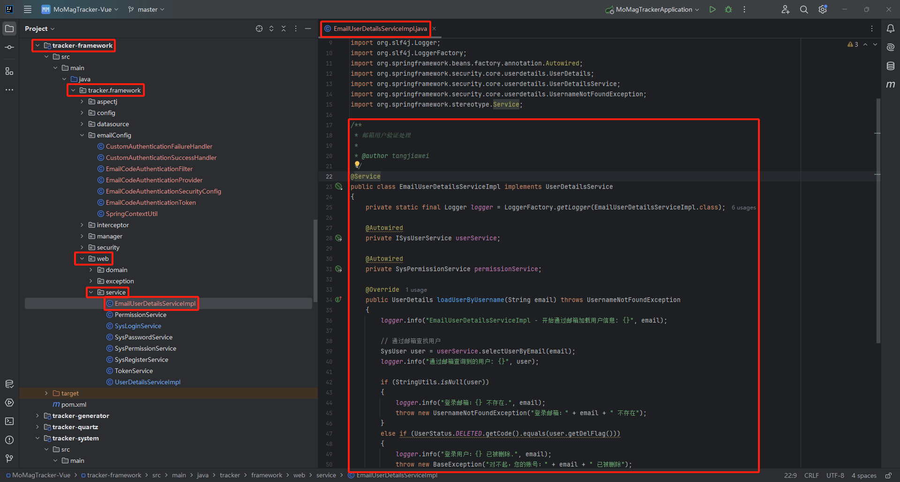

##### 5 增加 @Primary 注解

在 `E:\RuoYiProject\MoMagTracker-System\MoMagTracker-Vue\tracker-framework\src\main\java\tracker\framework\web\service\UserDetailsServiceImpl.java` 文件中加入下述代码

```java
package tracker.framework.web.service;

import org.slf4j.Logger;
import org.slf4j.LoggerFactory;
import org.springframework.beans.factory.annotation.Autowired;
import org.springframework.context.annotation.Primary;
import org.springframework.security.core.userdetails.UserDetails;
import org.springframework.security.core.userdetails.UserDetailsService;
import org.springframework.security.core.userdetails.UsernameNotFoundException;
import org.springframework.stereotype.Service;
import tracker.common.core.domain.entity.SysUser;
import tracker.common.core.domain.model.LoginUser;
import tracker.common.enums.UserStatus;
import tracker.common.exception.base.BaseException;
import tracker.common.utils.StringUtils;
import tracker.system.service.ISysUserService;

/**
 * 用户验证处理
 *
 * @author tangjiawei
 */
@Service
@Primary
public class UserDetailsServiceImpl implements UserDetailsService
{
    private static final Logger log = LoggerFactory.getLogger(UserDetailsServiceImpl.class);

    @Autowired
    private ISysUserService userService;

    @Autowired
    private SysPermissionService permissionService;

    @Override
    public UserDetails loadUserByUsername(String username) throws UsernameNotFoundException
    {
        SysUser user = userService.selectUserByUserName(username);
        if (StringUtils.isNull(user))
        {
            log.info("登录用户：{} 不存在.", username);
            throw new UsernameNotFoundException("登录用户：" + username + " 不存在");
        }
        else if (UserStatus.DELETED.getCode().equals(user.getDelFlag()))
        {
            log.info("登录用户：{} 已被删除.", username);
            throw new BaseException("对不起，您的账号：" + username + " 已被删除");
        }
        else if (UserStatus.DISABLE.getCode().equals(user.getStatus()))
        {
            log.info("登录用户：{} 已被停用.", username);
            throw new BaseException("对不起，您的账号：" + username + " 已停用");
        }

        return createLoginUser(user);
    }

    public UserDetails createLoginUser(SysUser user)
    {
        return new LoginUser(user, permissionService.getMenuPermission(user));
    }
}
```

- 结果

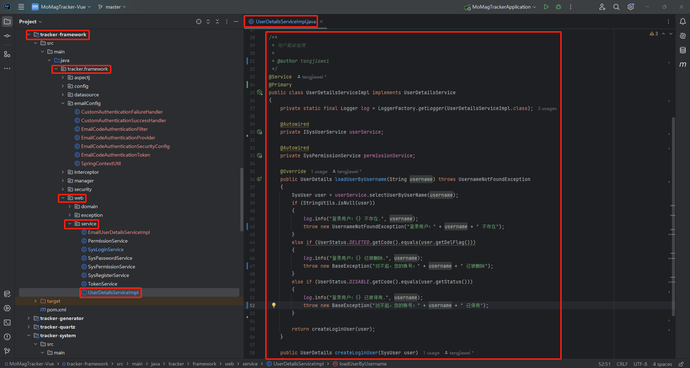

##### 6 添加注入配置及放行映射

在 `E:\RuoYiProject\MoMagTracker-System\MoMagTracker-Vue\tracker-framework\src\main\java\tracker\framework\config\SecurityConfig.java` 文件中加入下述代码

```java
package tracker.framework.config;

import org.springframework.beans.factory.annotation.Autowired;
import org.springframework.beans.factory.annotation.Qualifier;
import org.springframework.context.annotation.Bean;
import org.springframework.context.annotation.Configuration;
import org.springframework.http.HttpMethod;
import org.springframework.security.authentication.AuthenticationManager;
import org.springframework.security.authentication.ProviderManager;
import org.springframework.security.authentication.dao.DaoAuthenticationProvider;
import org.springframework.security.config.annotation.authentication.configuration.AuthenticationConfiguration;
import org.springframework.security.config.annotation.method.configuration.EnableMethodSecurity;
import org.springframework.security.config.annotation.web.builders.HttpSecurity;
import org.springframework.security.config.http.SessionCreationPolicy;
import org.springframework.security.core.userdetails.UserDetailsService;
import org.springframework.security.crypto.bcrypt.BCryptPasswordEncoder;
import org.springframework.security.web.SecurityFilterChain;
import org.springframework.security.web.authentication.UsernamePasswordAuthenticationFilter;
import org.springframework.security.web.authentication.logout.LogoutFilter;
import org.springframework.web.filter.CorsFilter;
import tracker.framework.config.properties.PermitAllUrlProperties;
import tracker.framework.emailConfig.EmailCodeAuthenticationProvider;
import tracker.framework.emailConfig.EmailCodeAuthenticationSecurityConfig;
import tracker.framework.security.filter.JwtAuthenticationTokenFilter;
import tracker.framework.security.handle.AuthenticationEntryPointImpl;
import tracker.framework.security.handle.LogoutSuccessHandlerImpl;

import java.util.Arrays;

/**
 * spring security配置
 * 
 * @author tangjiawei
 */
@EnableMethodSecurity(prePostEnabled = true, securedEnabled = true)
@Configuration
public class SecurityConfig
{
    /**
     * 自定义用户认证逻辑
     */
    @Autowired
    private UserDetailsService userDetailsService;
    
    /**
     * 认证失败处理类
     */
    @Autowired
    private AuthenticationEntryPointImpl unauthorizedHandler;

    /**
     * 退出处理类
     */
    @Autowired
    private LogoutSuccessHandlerImpl logoutSuccessHandler;

    /**
     * token认证过滤器
     */
    @Autowired
    private JwtAuthenticationTokenFilter authenticationTokenFilter;
    
    /**
     * 跨域过滤器
     */
    @Autowired
    private CorsFilter corsFilter;

    /**
     * 允许匿名访问的地址
     */
    @Autowired
    private PermitAllUrlProperties permitAllUrl;

    @Autowired
    private EmailCodeAuthenticationProvider emailCodeAuthenticationProvider;

    @Autowired
    private EmailCodeAuthenticationSecurityConfig emailCodeAuthenticationSecurityConfig;

    /**
     * 身份验证实现
     */
    @Bean
    public AuthenticationManager authenticationManager()
    {
        DaoAuthenticationProvider daoAuthenticationProvider = new DaoAuthenticationProvider();
        daoAuthenticationProvider.setUserDetailsService(userDetailsService);
        daoAuthenticationProvider.setPasswordEncoder(bCryptPasswordEncoder());
        // 创建包含多个认证提供者的 AuthenticationManager
        return new ProviderManager(Arrays.asList(
                daoAuthenticationProvider,
                emailCodeAuthenticationProvider
        ));
    }

    /**
     * anyRequest          |   匹配所有请求路径
     * access              |   SpringEl表达式结果为true时可以访问
     * anonymous           |   匿名可以访问
     * denyAll             |   用户不能访问
     * fullyAuthenticated  |   用户完全认证可以访问（非remember-me下自动登录）
     * hasAnyAuthority     |   如果有参数，参数表示权限，则其中任何一个权限可以访问
     * hasAnyRole          |   如果有参数，参数表示角色，则其中任何一个角色可以访问
     * hasAuthority        |   如果有参数，参数表示权限，则其权限可以访问
     * hasIpAddress        |   如果有参数，参数表示IP地址，如果用户IP和参数匹配，则可以访问
     * hasRole             |   如果有参数，参数表示角色，则其角色可以访问
     * permitAll           |   用户可以任意访问
     * rememberMe          |   允许通过remember-me登录的用户访问
     * authenticated       |   用户登录后可访问
     */
    @Bean
    protected SecurityFilterChain filterChain(HttpSecurity httpSecurity) throws Exception
    {
        return httpSecurity
            // CSRF禁用，因为不使用session
            .csrf(csrf -> csrf.disable())
            // 禁用HTTP响应标头
            .headers((headersCustomizer) -> {
                headersCustomizer.cacheControl(cache -> cache.disable()).frameOptions(options -> options.sameOrigin());
            })
            // 认证失败处理类
            .exceptionHandling(exception -> exception.authenticationEntryPoint(unauthorizedHandler))
            // 基于token，所以不需要session
            .sessionManagement(session -> session.sessionCreationPolicy(SessionCreationPolicy.STATELESS))
            // 注解标记允许匿名访问的url
            .authorizeHttpRequests((requests) -> {
                permitAllUrl.getUrls().forEach(url -> requests.antMatchers(url).permitAll());
                // 对于登录 login 注册 register 验证码 captchaImage 邮箱相关接口 允许匿名访问
                requests.antMatchers("/email/**","/login", "/register", "/captchaImage").permitAll()
                    // 静态资源，可匿名访问
                    .antMatchers(HttpMethod.GET, "/", "/*.html", "/**/*.html", "/**/*.css", "/**/*.js", "/profile/**").permitAll()
                    .antMatchers("/swagger-ui.html", "/swagger-resources/**", "/webjars/**", "/*/api-docs", "/druid/**").permitAll()
                    // 除上面外的所有请求全部需要鉴权认证
                    .anyRequest().authenticated();
            })
            // 添加邮箱登录认证配置
            .apply(emailCodeAuthenticationSecurityConfig)
            .and()
            // 添加Logout filter
            .logout(logout -> logout.logoutUrl("/logout").logoutSuccessHandler(logoutSuccessHandler))
            // 添加JWT filter
            .addFilterBefore(authenticationTokenFilter, UsernamePasswordAuthenticationFilter.class)
            // 添加CORS filter
            .addFilterBefore(corsFilter, JwtAuthenticationTokenFilter.class)
            .addFilterBefore(corsFilter, LogoutFilter.class)
            .build();
    }

    /**
     * 强散列哈希加密实现
     */
    @Bean
    public BCryptPasswordEncoder bCryptPasswordEncoder()
    {
        return new BCryptPasswordEncoder();
    }
}
```

- 结果

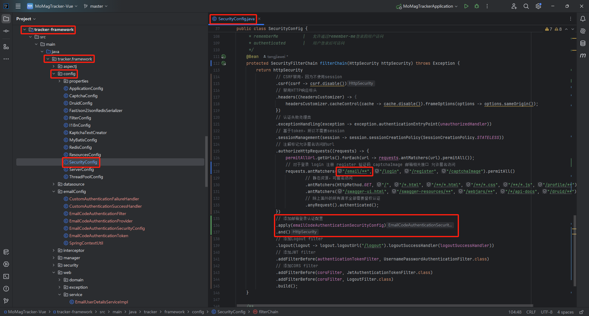

#### 2.1.4 tracker-system 模块

##### 1 添加手机号查询用户接口

在 `E:\RuoYiProject\MoMagTracker-System\MoMagTracker-Vue\tracker-system\src\main\java\tracker\system\service\ISysUserService.java` 文件中加入下述代码

```java
    /**
     * 通过邮箱地址查询用户
     *
     * @param email 邮箱地址
     * @return 用户对象信息
     */
    public SysUser selectUserByEmail(String email);
```

- 结果

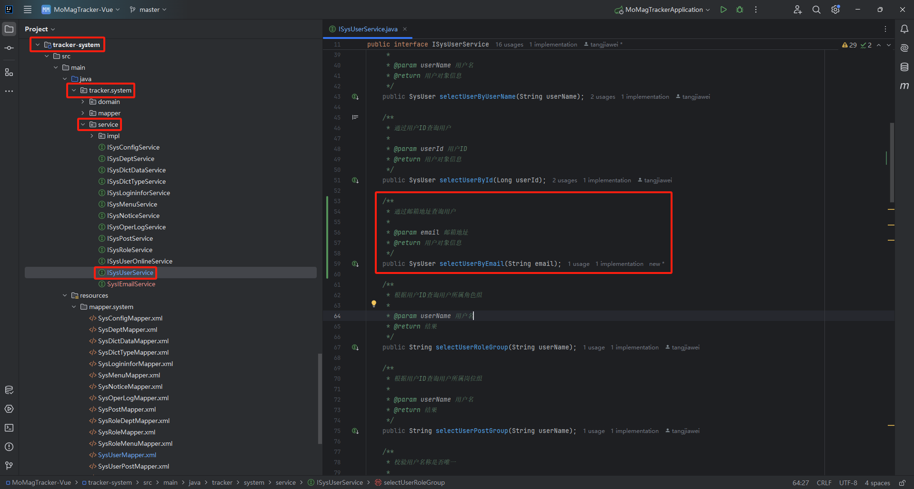

##### 2 添加手机号查询用户接口实现

在 `E:\RuoYiProject\MoMagTracker-System\MoMagTracker-Vue\tracker-system\src\main\java\tracker\system\service\impl\SysUserServiceImpl.java` 文件中加入下述代码

```java
    /**
     * 通过邮箱地址查询用户
     *
     * @param email 邮箱地址
     * @return 用户对象信息
     */
    @Override
    public SysUser selectUserByEmail(String email) {
        return userMapper.selectUserByEmail(email);
    }
```

- 结果

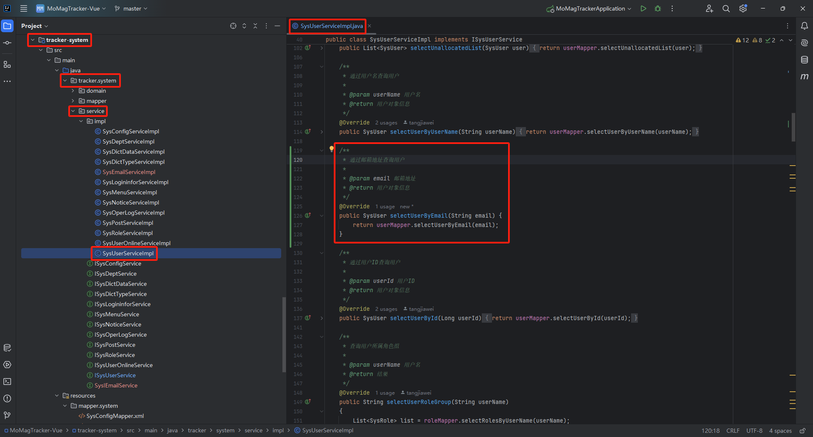

##### 3 添加手机号查询用户 tracker.system

在 `E:\RuoYiProject\MoMagTracker-System\MoMagTracker-Vue\tracker-system\src\main\java\tracker\system\mapper\SysUserMapper.java` 文件中加入下述代码

```java
    /**
     * 通过邮箱地址查询用户
     *
     * @param email 邮箱地址
     * @return 用户对象信息
     */
    public SysUser selectUserByEmail(String email);
```

- 结果

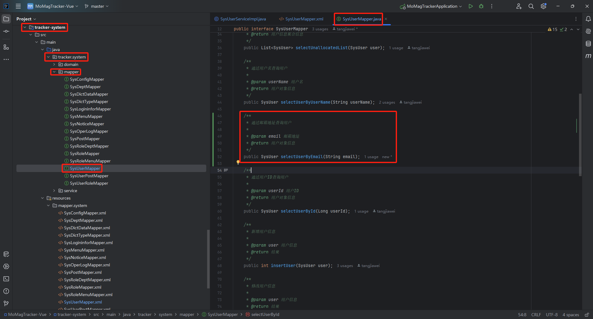

##### 4 添加手机号查询用户 mapper.system

在 `E:\RuoYiProject\MoMagTracker-System\MoMagTracker-Vue\tracker-system\src\main\resources\mapper\system\SysUserMapper.xml` 文件中加入下述代码

```java
	<select id="selectUserByEmail" parameterType="String" resultMap="SysUserResult">
		<include refid="selectUserVo"/>
		where u.email = #{email}
	</select>
```

- 结果

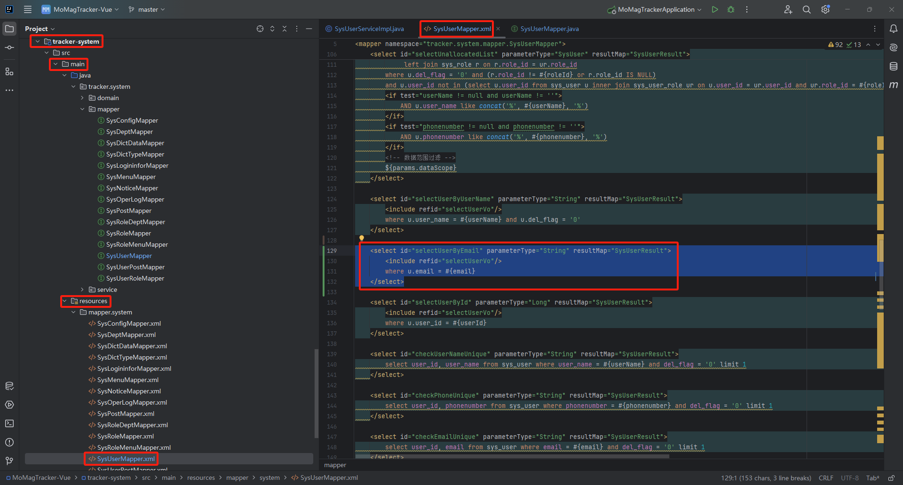

##### 5 SysEmailServiceImpl

在 `E:\RuoYiProject\MoMagTracker-System\MoMagTracker-Vue\tracker-system\src\main\java\tracker\system\service\impl\` 文件夹下新增 `SysEmailServiceImpl.java` 文件并添加下述代码

```java
package tracker.system.service.impl;

import org.springframework.beans.factory.annotation.Autowired;
import org.springframework.beans.factory.annotation.Value;
import org.springframework.mail.SimpleMailMessage;
import org.springframework.mail.javamail.JavaMailSender;
import org.springframework.stereotype.Service;
import tracker.system.service.SysIEmailService;

/**
 * 邮件服务实现类
 */
@Service
public class SysEmailServiceImpl implements SysIEmailService {

    @Autowired
    private JavaMailSender mailSender;

    @Value("${spring.mail.username}")
    private String fromEmail;

    @Value("${app.name:MoMagTracker}")
    private String appName;

    @Override
    public boolean sendVerificationCode(String toEmail, String code) {
        try {
            SimpleMailMessage message = new SimpleMailMessage();
            message.setFrom(fromEmail);
            message.setTo(toEmail);
            message.setSubject(appName + " - 登录验证码");
            message.setText("您的登录验证码是：" + code + "\n验证码有效期为1分钟，请勿泄露给他人。");

            mailSender.send(message);
            return true;
        } catch (Exception e) {
            e.printStackTrace();
            return false;
        }
    }
}
```

- 结果

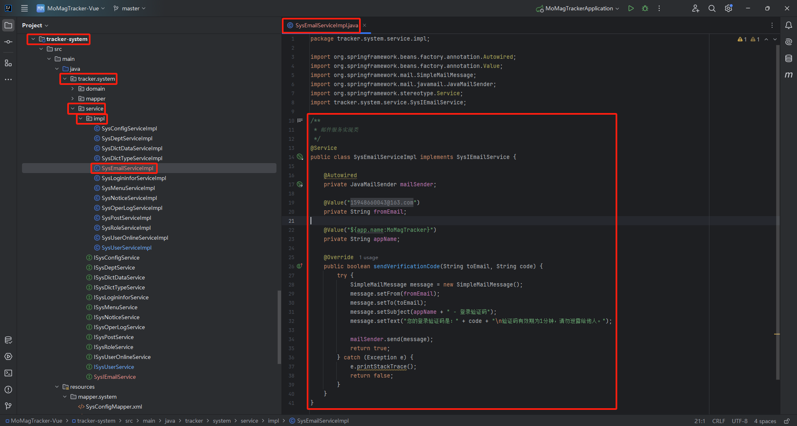

##### 6 SysIEmailService

在 `E:\RuoYiProject\MoMagTracker-System\MoMagTracker-Vue\tracker-system\src\main\java\tracker\system\service\` 文件夹下新增 `SysIEmailService.java` 文件并添加下述代码

```java
package tracker.system.service;

/**
 * 邮件服务接口
 */
public interface SysIEmailService {
    /**
     * 发送验证码邮件
     * @param toEmail 收件人邮箱
     * @param code 验证码
     * @return 发送结果
     */
    boolean sendVerificationCode(String toEmail, String code);
}
```

- 结果

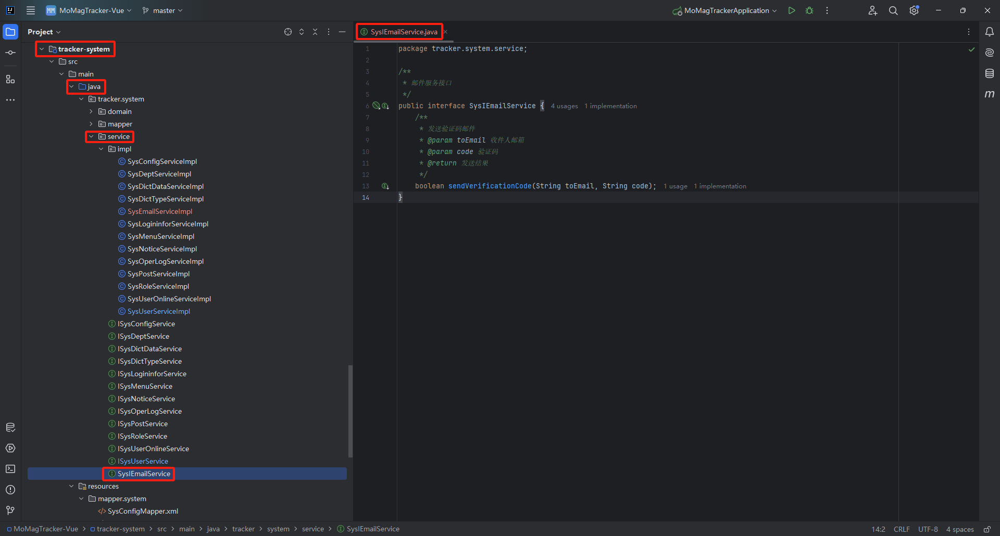

##### 7 继承父类 pom.xml

在 `E:\RuoYiProject\MoMagTracker-System\MoMagTracker-Vue\tracker-system\pom.xml` 文件中加入下述代码（**父类地址：E:\RuoYiProject\MoMagTracker-System\MoMagTracker-Vue\pom.xml**）

```shell
        <!-- 添加邮件依赖 -->
        <dependency>
            <groupId>org.springframework.boot</groupId>
            <artifactId>spring-boot-starter-mail</artifactId>
            <version>2.5.15</version>
        </dependency>
```

##### Q: 如果存在 org.springframework.boot 识别不了的问题

清理并重新下载依赖：在 `IDEA` 中，选择 `File` -> `Invalidate Caches`  -> `Restart` 来清理缓存并重新启动 `IDEA`。这将清除可能存在的缓存问题并重新下载依赖。

- 结果

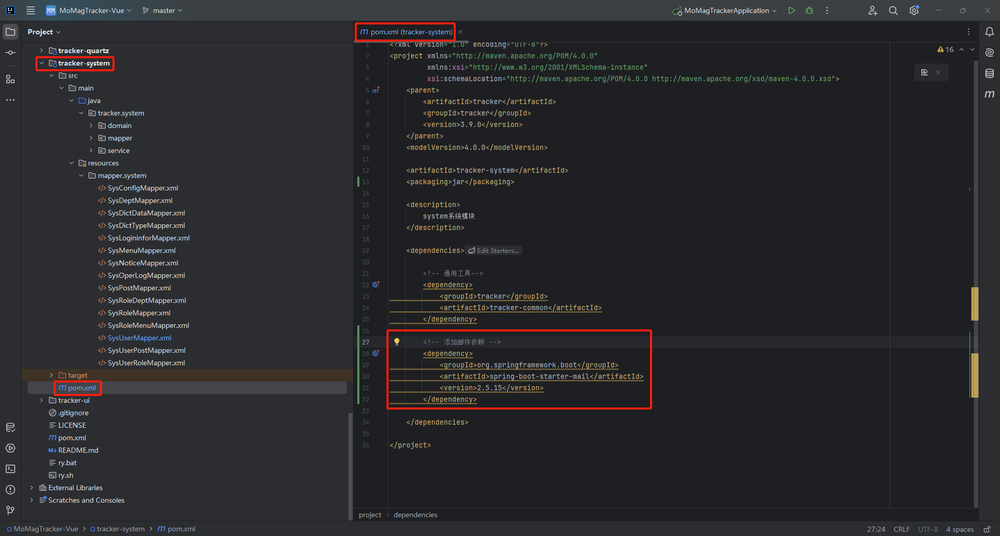

### 2.2 前端（MoMagTracker-VUE3 模块 VsCode）

#### 2.2.1 增加短信登录和发送短信验证码方法

在 `E:\RuoYiProject\MoMagTracker-System\MoMagTracker-Vue3\src\api\login.js` 文件中加入下述代码

```java
import request from '@/utils/request'

// 登录方法
export function login(username, password, code, uuid) {
  const data = {
    username,
    password,
    code,
    uuid
  }
  return request({
    url: '/login',
    headers: {
      isToken: false,
      repeatSubmit: false
    },
    method: 'post',
    data: data
  })
}

// 邮箱登录方法
export function emailLogin(email, emailCode, uuid) {
  console.log('API调用参数:', { email, emailCode, uuid })
  console.log('参数 - email:', email)
  console.log('参数 - emailCode:', emailCode)
  console.log('参数 - uuid:', uuid)

  const data = {
    email,
    emailCode,
    uuid
  }
  return request({
    url: '/email/login',
    method: 'post',
    data: data
  })
}

// 发送邮箱验证码
export function getEmailCode(email) {

  const data = {
    email
  }

  return request({
    url: '/email/code',
    method: 'post',
    data:data
  })
}

// 注册方法
export function register(data) {
  return request({
    url: '/register',
    headers: {
      isToken: false
    },
    method: 'post',
    data: data
  })
}

// 获取用户详细信息
export function getInfo() {
  return request({
    url: '/getInfo',
    method: 'get'
  })
}

// 退出方法
export function logout() {
  return request({
    url: '/logout',
    method: 'post'
  })
}

// 获取验证码
export function getCodeImg() {
  return request({
    url: '/captchaImage',
    headers: {
      isToken: false
    },
    method: 'get',
    timeout: 20000
  })
}
```

- 结果

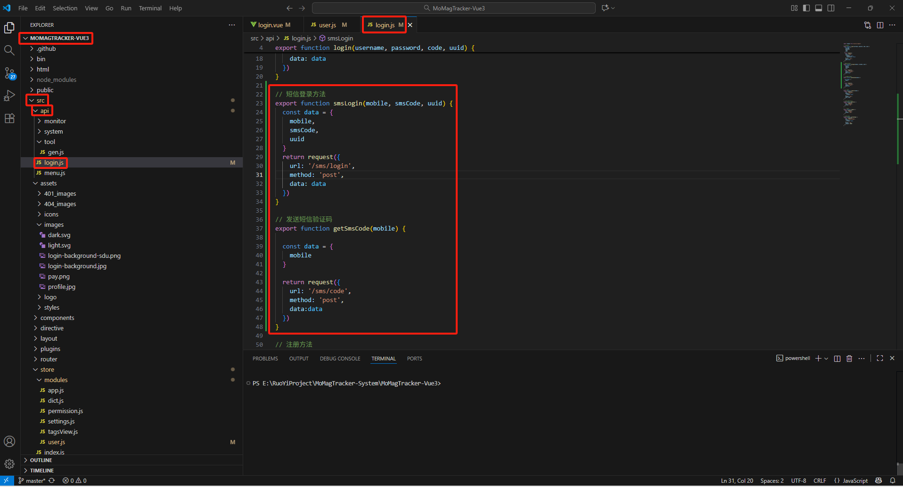

##### 1 API 接口定义流程

**定义认证接口 → 配置请求参数 → 封装请求方法 → 返回Promise对象**

##### 2 接口分类流程

**认证接口 → 验证码接口 → 用户信息接口 → 退出接口**

##### 3 请求配置流程

**设置请求路径 → 配置请求方法 → 定义请求头 → 传递数据参数 → 处理特殊配置**

#### 2.2.2 增加短信登录方法

在 `E:\RuoYiProject\MoMagTracker-System\MoMagTracker-Vue3\src\store\modules\user.js` 文件中加入下述代码

```java
import { defineStore } from 'pinia'
import router from '@/router'
import { ElMessageBox, } from 'element-plus'
import { emailLogin as apiEmailLogin, login, logout, getInfo } from '@/api/login'
import { getToken, setToken, removeToken } from '@/utils/auth'
import { isHttp, isEmpty } from "@/utils/validate"
import defAva from '@/assets/images/readme.jpg'

const useUserStore = defineStore(
  'user',
  {
    state: () => ({
      token: getToken(),
      id: '',
      name: '',
      nickName: '',
      avatar: '',
      roles: [],
      permissions: []
    }),
    actions: {
      // 登录
      login(userInfo) {
        const username = userInfo.username.trim()
        const password = userInfo.password
        const code = userInfo.code
        const uuid = userInfo.uuid
        return new Promise((resolve, reject) => {
          login(username, password, code, uuid).then(res => {
            // 存储 token 到本地
            setToken(res.token)
            this.token = res.token
            // 登录成功后自动获取用户信息
            this.getInfo().then(() => {
              resolve()
            }).catch(error => {
              // 即使获取用户信息失败，也认为登录成功
              console.error('获取用户信息失败:', error)
              resolve()
            })
          }).catch(error => {
            reject(error)
          })
        })
      },
      // 邮箱登录
      emailLogin(userInfo) { 
        const email = userInfo.email.trim()
        const emailCode = userInfo.emailCode
        const uuid = userInfo.uuid
        return new Promise((resolve, reject) => {
          apiEmailLogin(email, emailCode, uuid).then(res => {
            setToken(res.token)
            this.token = res.token 
            // 登录成功后自动获取用户信息
            this.getInfo().then(() => {
              resolve()
            }).catch(error => {
              // 即使获取用户信息失败，也认为登录成功
              console.error('获取用户信息失败:', error)
              resolve()
            })
          }).catch(error => {
            reject(error)
          })
        })
      },
      // 获取用户信息
      getInfo() {
        return new Promise((resolve, reject) => {
          getInfo().then(res => {
            console.log('=== 获取用户信息响应 ===')
            console.log('用户信息:', res.user)
            console.log('角色信息:', res.roles)
            console.log('权限信息:', res.permissions)

            const user = res.user

            // 头像处理逻辑
            let avatar = user.avatar || ""
            if (!isHttp(avatar)) {
              avatar = (isEmpty(avatar)) ? defAva : import.meta.env.VITE_APP_BASE_API + avatar
            }

            // 角色和权限处理
            if (res.roles && res.roles.length > 0) { // 验证返回的roles是否是一个非空数组
              this.roles = res.roles
              this.permissions = res.permissions
              console.log('✅ 设置用户角色:', this.roles)
            } else {
              this.roles = ['ROLE_DEFAULT']
              console.warn('⚠️ 用户没有分配角色，使用默认角色')
            }

            // 设置用户基本信息
            this.id = user.userId
            this.name = user.userName
            this.nickName = user.nickName
            this.avatar = avatar
            console.log('✅ 用户Store状态更新完成')

            /* 初始密码提示 */
            if(res.isDefaultModifyPwd) {
              ElMessageBox.confirm('您的密码还是初始密码，请修改密码！',  '安全提示', {  confirmButtonText: '确定',  cancelButtonText: '取消',  type: 'warning' }).then(() => {
                router.push({ name: 'Profile', params: { activeTab: 'resetPwd' } })
              }).catch(() => {})
            }
            /* 过期密码提示 */
            if(!res.isDefaultModifyPwd && res.isPasswordExpired) {
              ElMessageBox.confirm('您的密码已过期，请尽快修改密码！',  '安全提示', {  confirmButtonText: '确定',  cancelButtonText: '取消',  type: 'warning' }).then(() => {
                router.push({ name: 'Profile', params: { activeTab: 'resetPwd' } })
              }).catch(() => {})
            }
            resolve(res)
          }).catch(error => {
            console.error('❌ 获取用户信息失败:', error)
            reject(error)
          })
        })
      },
      // 退出系统
      logOut() {
        return new Promise((resolve, reject) => {
          logout(this.token).then(() => {
            this.token = ''
            this.roles = []
            this.permissions = []
            // 清除本地token
            removeToken()
            resolve()
          }).catch(error => {
            reject(error)
          })
        })
      }
    }
  })

export default useUserStore
```

- 结果

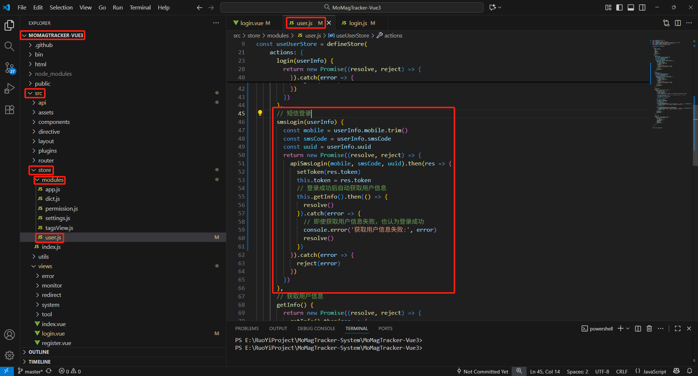

##### 1 登录流程

**调用登录 API → 获取 token → 存储 token → 获取用户信息 → 更新 store 状态**

##### 2 用户信息流程

**调用 getInfo API → 处理头像路径 → 设置角色权限 → 检查密码状态 → 更新所有用户状态**

##### 3 退出流程

**调用退出 API → 清除本地 token → 重置 store 状态**

#### 2.2.3 增加发送短信验证码和短信登录逻辑

在 `E:\RuoYiProject\MoMagTracker-System\MoMagTracker-Vue3\src\views\login.vue` 文件中加入下述代码

```java
<template>
  <div class="login-container">
    <div class="login-wrapper">
      <el-form ref="loginFormRef" :model="loginForm" :rules="loginRules" class="login-form">
        <h3 class="title">{{ title }}</h3>

        <!-- 账号密码登录 -->
        <el-form-item prop="username" v-if="!isEmailLogin">
          <el-input
            v-model="loginForm.username"
            type="text"
            size="large"
            auto-complete="off"
            placeholder="请输入账号"
            class="custom-input"
          >
            <template #prefix><svg-icon icon-class="user" class="el-input__icon input-icon" /></template>
          </el-input>
        </el-form-item>
        
        <el-form-item prop="password" v-if="!isEmailLogin">
          <el-input
            v-model="loginForm.password"
            type="password"
            size="large"
            auto-complete="off"
            placeholder="请输入密码"
            @keyup.enter="handleLogin"
            class="custom-input"
          >
            <template #prefix><svg-icon icon-class="password" class="el-input__icon input-icon" /></template>
          </el-input>
        </el-form-item>
        
        <el-form-item prop="code" v-if="!isEmailLogin" class="code-form-item">
          <el-input
            v-model="loginForm.code"
            size="large"
            auto-complete="off"
            placeholder="验证码"
            @keyup.enter="handleLogin"
            class="code-input"
          >
            <template #prefix><svg-icon icon-class="validCode" class="el-input__icon input-icon" /></template>
          </el-input>
          <div class="login-code">
            
          </div>
        </el-form-item>

        <!-- 邮箱登录 -->
        <el-form-item prop="email" v-if="isEmailLogin">
          <el-input 
            v-model="loginForm.email" 
            type="text" 
            size="large"
            auto-complete="off" 
            placeholder="请输入邮箱地址"
            class="custom-input"
          >
            <template #prefix><svg-icon icon-class="email" class="el-input__icon input-icon" /></template>
          </el-input>
        </el-form-item>

        <el-form-item prop="emailCode" v-if="isEmailLogin" class="code-form-item">
          <el-input
            v-model="loginForm.emailCode"
            size="large"
            auto-complete="off"
            placeholder="邮箱验证码"
            @keyup.enter="handleLogin"
            class="code-input"
          >
            <template #prefix><svg-icon icon-class="validCode" class="el-input__icon input-icon" /></template>
          </el-input>
          <div class="email-code-btn">
            <el-button 
              round 
              @click.prevent="getEmailCode"
              :disabled="computeTime > 0"
              class="email-btn"
            >
              {{ computeTime > 0 ? `已发送(${computeTime}s)` : '获取验证码' }}
            </el-button>
          </div>
        </el-form-item>

        <!-- 底部操作区域 -->
        <div class="form-actions">
          <div class="left-actions">
            <el-checkbox v-model="loginForm.rememberMe" class="remember-me">记住密码</el-checkbox>
          </div>
          <div class="right-actions">
            <el-button
              size="small"
              type="primary"
              link
              @click.prevent="loginMethod"
              class="login-method-btn"
            >
              <span v-if="isEmailLogin">账号密码登录</span>
              <span v-else>邮箱登录</span>
            </el-button>
          </div>
        </div>
        
        <el-form-item class="login-btn-item">
          <el-button
            :loading="loading"
            size="large"
            type="primary"
            @click.prevent="handleLogin"
            class="login-btn"
          >
            <span v-if="!loading">{{ isEmailLogin ? '邮箱登录' : '账号登录' }}</span>
            <span v-else>{{ isEmailLogin ? '邮箱登录中...' : '账号登录中...' }}</span>
          </el-button>
        </el-form-item>
      </el-form>
    </div>
    
    <!-- 底部版权信息 -->
    <div class="login-footer">
      <span>Copyright © 2023-2026 MoMagTracker All Rights Reserved.</span>
    </div>
  </div>
</template>

<script setup>
import { ref, watch, onMounted } from 'vue'
import { useRoute, useRouter } from 'vue-router'
import { getCodeImg, getEmailCode as apiGetEmailCode } from "@/api/login"
import Cookies from "js-cookie"
import { encrypt, decrypt } from "@/utils/jsencrypt"
import useUserStore from '@/store/modules/user'
import usePermissionStore from '@/store/modules/permission'
import { ElMessage } from 'element-plus'

const title = import.meta.env.VITE_APP_TITLE
const userStore = useUserStore()
const permissionStore = usePermissionStore()
const route = useRoute()
const router = useRouter()

// 响应式变量
const loginFormRef = ref()
const codeUrl = ref("")
const computeTime = ref(0)
const timer = ref(null)
const loading = ref(false)
const isEmailLogin = ref(false)
const redirect = ref(undefined)

// 表单数据
const loginForm = ref({
  username: "",
  password: "",
  rememberMe: false,
  code: "",
  uuid: "",
  email: "",
  emailCode: ""
})

// 表单规则
const loginRules = ref({
  username: [
    { required: true, trigger: "blur", message: "用户名不能为空" }
  ],
  email: [
    { required: true, trigger: "blur", message: "邮箱地址不能为空" },
    { type: 'email', message: '请输入正确的邮箱地址', trigger: ['blur', 'change'] }
  ],
  password: [
    { required: true, trigger: "blur", message: "密码不能为空" }
  ],
  code: [{ required: true, trigger: "change", message: "验证码不能为空" }],
  emailCode: [
    { required: true, trigger: "blur", message: "邮箱验证码不能为空" },
    { pattern: /^\d{6}$/, message: "验证码为6位数字" }
  ]
})

// 监听路由变化
watch(route, (newRoute) => {
  redirect.value = newRoute.query && newRoute.query.redirect
  console.log('重定向路径:', redirect.value)
}, { immediate: true })

// 方法
function loginMethod() {
  isEmailLogin.value = !isEmailLogin.value
}

function getEmailCode() {
  if (computeTime.value === 0) {
    loginFormRef.value.validateField('email', (valid) => {
      if (valid) {
        apiGetEmailCode(loginForm.value.email).then(res => {
          if (res.code === 200) {
            ElMessage.success('验证码已发送到您的邮箱')
            loginForm.value.uuid = res.uuid
            computeTime.value = 60
            timer.value = setInterval(() => {
              computeTime.value--
              if (computeTime.value <= 0) {
                clearInterval(timer.value)
              }
            }, 1000)
          }
        }).catch(error => {
          ElMessage.error('获取验证码失败: ' + (error.message || '未知错误'))
        })
      }
    })
  }
}

function getCode() {
  getCodeImg().then(res => {
    codeUrl.value = "data:image/gif;base64," + res.img
    loginForm.value.uuid = res.uuid
  }).catch(error => {
    console.error('获取验证码失败:', error)
  })
}

function getCookie() {
  const username = Cookies.get("username")
  const password = Cookies.get("password")
  const rememberMe = Cookies.get("rememberMe")
  const email = Cookies.get("email")
  loginForm.value = {
    username: username === undefined ? loginForm.value.username : username,
    password: password === undefined ? loginForm.value.password : decrypt(password),
    rememberMe: rememberMe === undefined ? false : Boolean(rememberMe),
    code: loginForm.value.code,
    uuid: loginForm.value.uuid,
    email: email === undefined ? loginForm.value.email : email,
    emailCode: loginForm.value.emailCode
  }
}

async function handleLogin() {
  console.log('=== 开始登录流程 ===')
  console.log('当前登录方式:', isEmailLogin.value ? '邮箱登录' : '账号密码登录')
  // 详细检查表单数据
  console.log('表单数据详情:')
  console.log('  - email:', loginForm.value.email)
  console.log('  - emailCode:', loginForm.value.emailCode)
  console.log('  - uuid:', loginForm.value.uuid)
  console.log('  - emailCode 类型:', typeof loginForm.value.emailCode)
  console.log('  - emailCode 长度:', loginForm.value.emailCode ? loginForm.value.emailCode.length : 0)
  
  loginFormRef.value.validate(async valid => {
    console.log('表单验证结果:', valid ? '通过' : '失败')

    if (valid) {
      console.log('表单验证通过，准备发送登录请求')
      
      if (isEmailLogin.value) {
        console.log('进入邮箱登录分支')
        loading.value = true

        // 确保参数正确传递
        const loginParams = {
          email: loginForm.value.email,
          emailCode: loginForm.value.emailCode,
          uuid: loginForm.value.uuid
        }
        console.log('发送的登录参数:', loginParams)

        if (loginForm.value.rememberMe) {
          Cookies.set("email", loginForm.value.email, { expires: 30 })
          Cookies.set('rememberMe', loginForm.value.rememberMe, { expires: 30 })
        } else {
          Cookies.remove("email")
          Cookies.remove('rememberMe')
        }
        
        try {
          // 执行邮箱登录
          await userStore.emailLogin({
            email: loginForm.value.email,
            emailCode: loginForm.value.emailCode,
            uuid: loginForm.value.uuid
          })
          
          console.log('✅ 邮箱登录成功，准备跳转')
          ElMessage.success('登录成功')

          // 确保用户信息完全加载
          console.log('🔄 确保用户信息完全加载...')
          await userStore.getInfo()
          
          // 生成动态路由
          console.log('🔄 生成动态路由...')
          await permissionStore.generateRoutes(userStore.roles)

          // 等待路由完全加载
          await new Promise(resolve => setTimeout(resolve, 100))

          // 详细检查用户状态
          console.log('登录后用户 Store 状态:', {
            token: userStore.token,
            roles: userStore.roles,
            permissions: userStore.permissions,
            name: userStore.name
          })

          // 检查路由守卫是否会被触发
          const targetPath = redirect.value || '/'
          console.log('准备跳转到:', targetPath)
          
          // 使用 replace 确保路由正确
          await router.replace({ path: redirect.value || "/" })
          console.log('跳转成功')
          
        } catch (error) {
          loading.value = false
          console.error('邮箱登录失败详情:', error)
          console.error('错误响应数据:', error.response?.data)
          console.error('错误状态码:', error.response?.status)
          console.error('错误信息:', error.response?.message)

          // 显示更具体的错误信息
          if (error.response?.data?.message) {
            ElMessage.error('登录失败: ' + error.response.data.message)
          } else {
            ElMessage.error(error.message || '登录失败，请检查邮箱和验证码')
          }
        }
      } else {
        console.log('进入账号密码登录分支')

        loading.value = true
        if (loginForm.value.rememberMe) {
          Cookies.set("username", loginForm.value.username, { expires: 30 })
          Cookies.set("password", encrypt(loginForm.value.password), { expires: 30 })
          Cookies.set("rememberMe", loginForm.value.rememberMe, { expires: 30 })
        } else {
          Cookies.remove("username")
          Cookies.remove("password")
          Cookies.remove("rememberMe")
        }
        
        try {
          // 执行账号密码登录
          await userStore.login(loginForm.value)
          
          console.log('账号密码登录成功，准备跳转')
          ElMessage.success('登录成功')

          // 确保用户信息完全加载
          await userStore.getInfo()
          
          // 生成动态路由
          await permissionStore.generateRoutes(userStore.roles)

          // 等待路由完全加载
          await new Promise(resolve => setTimeout(resolve, 100))

          // 跳转到目标页面
          const targetPath = redirect.value || "/"
          console.log('准备跳转到:', targetPath)
          await router.replace(targetPath)
          console.log('账号密码登录跳转成功')
        } catch (error) {
          loading.value = false
          console.error('账号密码登录失败:', error)
          ElMessage.error(error.message || '登录失败，请检查账号和密码')
          getCode()
        }
      }
    } else {
      console.log('表单验证失败')
      ElMessage.warning('请完善表单信息')
    }
  })
}

// 初始化
onMounted(() => {
  getCode()
  getCookie()
})
</script>

<style lang="scss" scoped>
.login-container {
  display: flex;
  justify-content: center;
  align-items: center;
  min-height: 100vh;
  background-image: url("../assets/images/login-background-sdu.png");
  background-size: cover;
  background-position: center 10%;
  background-repeat: no-repeat;
  background-color: #f0f8ff;
  position: relative;
  padding: 20px;
}

.login-wrapper {
  display: flex;
  justify-content: center;
  align-items: center;
  width: 100%;
  max-width: 440px;
  z-index: 1;
}

.title {
  margin: 0 0 32px 0;
  text-align: center;
  color: #2c3e50;
  font-size: 28px;
  font-weight: 600;
  letter-spacing: 1px;
  text-shadow: 0 2px 4px rgba(255, 255, 255, 0.8);
}

.login-form {
  border-radius: 16px;
  background: rgba(255, 255, 255, 0.92);
  width: 100%;
  padding: 40px 35px 30px;
  box-shadow: 
    0 12px 40px rgba(0, 0, 0, 0.15),
    0 4px 12px rgba(0, 0, 0, 0.08);
  backdrop-filter: blur(8px);
  border: 1px solid rgba(255, 255, 255, 0.3);
  
  :deep(.el-form-item) {
    margin-bottom: 24px;
  }
  
  :deep(.el-input) {
    height: 48px;
    font-size: 15px;
    
    input {
      height: 48px;
      border-radius: 10px;
      border: 1.5px solid #e1e8ed;
      background: #ffffff;
      transition: all 0.3s ease;
      font-size: 15px;
      color: #2c3e50;
      
      &:focus {
        border-color: #3498db;
        background: #fff;
        box-shadow: 0 0 0 3px rgba(52, 152, 219, 0.1);
      }
      
      &::placeholder {
        color: #95a5a6;
        font-size: 14px;
      }
    }
  }
  
  :deep(.input-icon) {
    height: 39px;
    width: 16px;
    margin-left: 4px;
    color: #7f8c8d;
  }
}

.code-form-item {
  display: flex;
  gap: 12px;
  align-items: flex-start;
  
  .code-input {
    flex: 1;
  }
}

.login-code {
  width: 120px;
  height: 48px;
  
  .login-code-img {
    width: 100%;
    height: 100%;
    border-radius: 10px;
    cursor: pointer;
    border: 1.5px solid #e1e8ed;
    transition: all 0.3s ease;
    
    &:hover {
      border-color: #3498db;
      box-shadow: 0 2px 8px rgba(52, 152, 219, 0.2);
    }
  }
}

.email-code-btn {
  width: 120px;
  
  .email-btn {
    width: 100%;
    height: 48px;
    border-radius: 10px;
    font-size: 13px;
    font-weight: 500;
    transition: all 0.3s ease;
    
    &:not(:disabled) {
      background: #3498db;
      border: none;
      color: white;
      
      &:hover {
        background: #2980b9;
        transform: translateY(-1px);
        box-shadow: 0 4px 12px rgba(52, 152, 219, 0.3);
      }
    }
    
    &:disabled {
      background: #bdc3c7;
      color: #7f8c8d;
      border-color: #bdc3c7;
    }
  }
}

.form-actions {
  display: flex;
  justify-content: space-between;
  align-items: center;
  margin: 8px 0 24px;
  
  .left-actions {
    .remember-me {
      :deep(.el-checkbox__label) {
        color: #2c3e50;
        font-size: 14px;
        font-weight: 400;
      }
      
      :deep(.el-checkbox__inner) {
        border-radius: 4px;
        border-color: #bdc3c7;
        
        &:hover {
          border-color: #3498db;
        }
      }
    }
  }
  
  .right-actions {
    .login-method-btn {
      color: #3498db;
      font-size: 14px;
      font-weight: 500;
      padding: 4px 8px;
      transition: all 0.3s ease;
      
      &:hover {
        color: #2980b9;
        transform: translateX(2px);
      }
    }
  }
}

.login-btn-item {
  margin-bottom: 0;
  
  .login-btn {
    width: 100%;
    height: 48px;
    border-radius: 12px;
    background: #3498db;
    border: none;
    font-size: 16px;
    font-weight: 600;
    letter-spacing: 1px;
    transition: all 0.3s ease;
    box-shadow: 0 4px 15px rgba(52, 152, 219, 0.3);
    
    &:hover:not(:disabled) {
      background: #2980b9;
      transform: translateY(-2px);
      box-shadow: 0 6px 20px rgba(52, 152, 219, 0.4);
    }
    
    &:active {
      transform: translateY(0);
    }
  }
}

.login-footer {
  position: fixed;
  bottom: 0;
  left: 0;
  right: 0;
  height: 50px;
  line-height: 50px;
  text-align: center;
  color: rgba(255, 255, 255, 0.9);
  font-size: 13px;
  font-weight: 400;
  letter-spacing: 0.5px;
  background: rgba(44, 62, 80, 0.7);
  backdrop-filter: blur(5px);
  z-index: 1;
  text-shadow: 0 1px 2px rgba(0, 0, 0, 0.3);
}

// 响应式设计
@media (max-width: 480px) {
  .login-container {
    padding: 15px;
  }
  
  .login-form {
    padding: 30px 25px 25px;
  }
  
  .title {
    font-size: 24px;
    margin-bottom: 28px;
  }
  
  .form-actions {
    flex-direction: column;
    gap: 15px;
    align-items: stretch;
    
    .left-actions,
    .right-actions {
      text-align: center;
    }
  }
}
</style>
```

##### 1 登录界面渲染流程

**构建页面结构 → 渲染登录表单 → 处理两种登录模式 → 添加交互元素**

##### 2 用户交互处理流程

**监听用户输入 → 验证表单数据 → 调用相应API → 处理响应结果**

##### 3 状态管理流程

**初始化响应式数据 → 管理登录状态 → 处理加载状态 → 控制界面切换**

##### 4 生命周期流程

**组件挂载初始化 → 获取验证码 → 读取Cookie → 监听路由变化**

##### 5 样式处理流程

**设置基础样式 → 配置响应式布局 → 美化表单元素 → 添加动画效果**

#### 2.2.4 路由配置

##### 1 main.js

在 `E:\RuoYiProject\MoMagTracker-System\MoMagTracker-Vue3\src\main.js` 文件中加入下述代码

```java
import './permission'
```

##### 2 permission.js

在 `E:\RuoYiProject\MoMagTracker-System\MoMagTracker-Vue3\src\permission.js` 文件中加入下述代码

```java
import router from './router'
import { ElMessage } from 'element-plus'
import NProgress from 'nprogress'
import 'nprogress/nprogress.css'
import { getToken } from '@/utils/auth'
import { isHttp, isPathMatch } from '@/utils/validate'
import { isRelogin } from '@/utils/request'
import useUserStore from '@/store/modules/user'
import useSettingsStore from '@/store/modules/settings'
import usePermissionStore from '@/store/modules/permission'

NProgress.configure({ showSpinner: false })

const whiteList = ['/login', '/register']

const isWhiteList = (path) => {
  return whiteList.some(pattern => isPathMatch(pattern, path))
}

// 添加路由加载状态标识
let isRouteLoaded = false

router.beforeEach(async (to, from, next) => {
  NProgress.start()
  console.log('🚦 路由守卫开始 ===', to.path, 'Token:', getToken())
  
  if (getToken()) {
    console.log('✅ 检测到Token')
    to.meta.title && useSettingsStore().setTitle(to.meta.title)
    
    /* has token*/
    if (to.path === '/login') {
      next({ path: '/' })
      NProgress.done()
    } else if (isWhiteList(to.path)) {
      next()
    } else {
      const userStore = useUserStore()
      const permissionStore = usePermissionStore()
      console.log('👤 用户角色信息:', userStore.roles, '长度:', userStore.roles.length)
      
      // 无论用户信息是否存在，都确保路由已加载
      // 页面刷新时 userStore.roles 可能为空，但 isRouteLoaded 为 true，需要重新加载路由
      if (userStore.roles.length === 0 || !isRouteLoaded) {
        console.log('🔄 需要加载用户信息或路由...')
        isRelogin.show = true
        
        try {
          // 确保用户信息已加载
          if (userStore.roles.length === 0) {
            console.log('🔄 获取用户信息...')
            await userStore.getInfo()
            console.log('✅ 获取用户信息成功，角色:', userStore.roles)
          }

          // 确保动态路由已生成
          console.log('🔄 生成动态路由...')
          const accessRoutes = await permissionStore.generateRoutes(userStore.roles)
          console.log('🔄 生成的路由数量:', accessRoutes.length)

          // 添加动态路由（避免重复添加）
          // 页面刷新时需要重新添加路由
          if (!isRouteLoaded) {
            accessRoutes.forEach(route => {
              if (!isHttp(route.path)) {
                console.log('➕ 添加路由:', route.path, route.name)
                router.addRoute(route)
              }
            })
            isRouteLoaded = true
            console.log('✅ 所有路由添加完成')
          }
          
          isRelogin.show = false

          console.log('🔄 路由加载完成，重新导航到:', to.fullPath)
          next({ ...to, replace: true })
        } catch (error) {
          console.error('❌ 路由加载失败:', error)
          isRelogin.show = false
          userStore.logOut().then(() => {
            ElMessage.error('登录状态已过期，请重新登录')
            next({ path: '/login' })
          })
        }
        
      } else {
        console.log('✅ 用户信息和路由都已加载，直接跳转')
        // 确保当前路径可访问
        if (to.matched.length > 0) {
          next()
        } else {
          console.log('🔄 路径未匹配，尝试重新导航')
          next({ ...to, replace: true })
        }
      }
    }
  } else {
    // 没有token
    console.log('❌ 未检测到Token')
    if (isWhiteList(to.path)) {
      // 在免登录白名单，直接进入
      next()
    } else {
      next(`/login?redirect=${to.fullPath}`) // 否则全部重定向到登录页
      NProgress.done()
    }
  }
})

router.afterEach(() => {
  console.log('🏁 路由跳转完成')
  NProgress.done()
})

// 重置路由加载状态（在用户登出时调用）
export const resetRouteLoadStatus = () => {
  isRouteLoaded = false
}
```

##### 3 modules\permission.js

在 `E:\RuoYiProject\MoMagTracker-System\MoMagTracker-Vue3\src\store\modules\permission.js` 文件中加入下述代码

```java
import auth from '@/plugins/auth'
import router, { constantRoutes, dynamicRoutes } from '@/router'
import { getRouters } from '@/api/menu'
import Layout from '@/layout/index'
import ParentView from '@/components/ParentView'
import InnerLink from '@/layout/components/InnerLink'

// 匹配views里面所有的.vue文件
const modules = import.meta.glob('./../../views/**/*.vue')

const usePermissionStore = defineStore(
  'permission',
  {
    state: () => ({
      routes: [],
      addRoutes: [],
      defaultRoutes: [],
      topbarRouters: [],
      sidebarRouters: []
    }),
    actions: {
      setRoutes(routes) {
        this.addRoutes = routes
        this.routes = constantRoutes.concat(routes)
      },
      setDefaultRoutes(routes) {
        this.defaultRoutes = constantRoutes.concat(routes)
      },
      setTopbarRoutes(routes) {
        this.topbarRouters = routes
      },
      setSidebarRouters(routes) {
        this.sidebarRouters = routes
      },
      generateRoutes(roles) {
        return new Promise(resolve => {
          // 获取用户store
          console.log('🔄 [权限Store] 开始生成动态路由')
          console.log('🔄 [权限Store] 传入角色:', roles)
          console.log('🔄 [权限Store] 当前路由状态 - routes:', this.routes.length)
          console.log('🔄 [权限Store] 当前路由状态 - addRoutes:', this.addRoutes.length)

          // 向后端请求路由数据
          getRouters().then(res => {
            console.log('✅ [权限Store] 后端返回的路由数据状态码:', res.code)
            console.log('✅ [权限Store] 后端返回的路由数据:', res.data)

            if (!res.data || res.data.length === 0) {
              console.error('❌ [权限Store] 后端返回的路由数据为空！')
              resolve([])
              return
            }

            // 详细检查每个路由项
            res.data.forEach((route, index) => {
              console.log(`📋 路由 ${index}:`, {
                path: route.path,
                component: route.component,
                name: route.name,
                children: route.children ? route.children.length : 0
              })
            })

            const sdata = JSON.parse(JSON.stringify(res.data))
            const rdata = JSON.parse(JSON.stringify(res.data))
            const defaultData = JSON.parse(JSON.stringify(res.data))

            const sidebarRoutes = filterAsyncRouter(sdata)
            const rewriteRoutes = filterAsyncRouter(rdata, false, true)
            const defaultRoutes = filterAsyncRouter(defaultData)
            const asyncRoutes = filterDynamicRoutes(dynamicRoutes)

            console.log('🔄 过滤后的路由数量:')
            console.log('🔄 - sidebarRoutes:', sidebarRoutes.length)
            console.log('🔄 - rewriteRoutes:', rewriteRoutes.length)
            console.log('🔄 - asyncRoutes:', asyncRoutes.length)

            // 添加动态路由前检查
            asyncRoutes.forEach(route => {
              console.log(`➕ 准备添加动态路由: ${route.path}, 组件:`, route.component)
              router.addRoute(route)
              console.log(`✅ 已添加动态路由: ${route.path}`)
            })

            this.setRoutes(rewriteRoutes)
            this.setSidebarRouters(constantRoutes.concat(sidebarRoutes))
            this.setDefaultRoutes(sidebarRoutes)
            this.setTopbarRoutes(defaultRoutes)

            // 验证路由是否添加成功
            const allRoutes = router.getRoutes()
            console.log('📊 当前所有路由数量:', allRoutes.length)
            allRoutes.forEach(route => {
              console.log(`📍 路由: ${route.path}, 名称: ${route.name || '未命名'}`)
            })

            console.log('✅ 路由生成完成，最终路由:', rewriteRoutes)
            resolve(rewriteRoutes)
          }).catch(error => {
            console.error('❌ [权限Store] 获取路由失败:', error)
            console.error('❌ [权限Store] 错误详情:', error.response || error.message)
            resolve([])
          })
        })
      }
    }
  })

// 遍历后台传来的路由字符串，转换为组件对象
function filterAsyncRouter(asyncRouterMap, lastRouter = false, type = false) {
  return asyncRouterMap.filter(route => {
    if (type && route.children) {
      route.children = filterChildren(route.children)
    }
    if (route.component) {
      // Layout ParentView 组件特殊处理
      if (route.component === 'Layout') {
        route.component = Layout
      } else if (route.component === 'ParentView') {
        route.component = ParentView
      } else if (route.component === 'InnerLink') {
        route.component = InnerLink
      } else {
        route.component = loadView(route.component)
      }
    }
    if (route.children != null && route.children && route.children.length) {
      route.children = filterAsyncRouter(route.children, route, type)
    } else {
      delete route['children']
      delete route['redirect']
    }
    return true
  })
}

function filterChildren(childrenMap, lastRouter = false) {
  var children = []
  childrenMap.forEach(el => {
    el.path = lastRouter ? lastRouter.path + '/' + el.path : el.path
    if (el.children && el.children.length && el.component === 'ParentView') {
      children = children.concat(filterChildren(el.children, el))
    } else {
      children.push(el)
    }
  })
  return children
}

// 动态路由遍历，验证是否具备权限
export function filterDynamicRoutes(routes) {
  const res = []
  routes.forEach(route => {
    if (route.permissions) {
      if (auth.hasPermiOr(route.permissions)) {
        res.push(route)
      }
    } else if (route.roles) {
      if (auth.hasRoleOr(route.roles)) {
        res.push(route)
      }
    }
  })
  return res
}

export const loadView = (view) => {
  let res
  console.log(`🔄 加载视图组件: ${view}`)
  
  for (const path in modules) {
    const dir = path.split('views/')[1].split('.vue')[0]
    console.log(`🔍 检查路径: ${path}, 目录: ${dir}`)
    
    if (dir === view) {
      res = () => modules[path]()
      console.log(`✅ 找到组件: ${view} -> ${path}`)
      break
    }
  }
  
  if (!res) {
    console.error(`❌ 未找到组件: ${view}`)
    // 返回一个默认的404组件或者空组件
    return () => import('@/views/error/404.vue')
  }
  
  return res
}

export default usePermissionStore
```

### 2.3 数据库（Idea 连接 MySQL 数据库）

打开侧边栏的 `Database`，并输入自己数据库的账号和密码，下载对应的 `MySQL` 驱动，测试链接是否成功。

```shell
user：root
password：tang2001
```

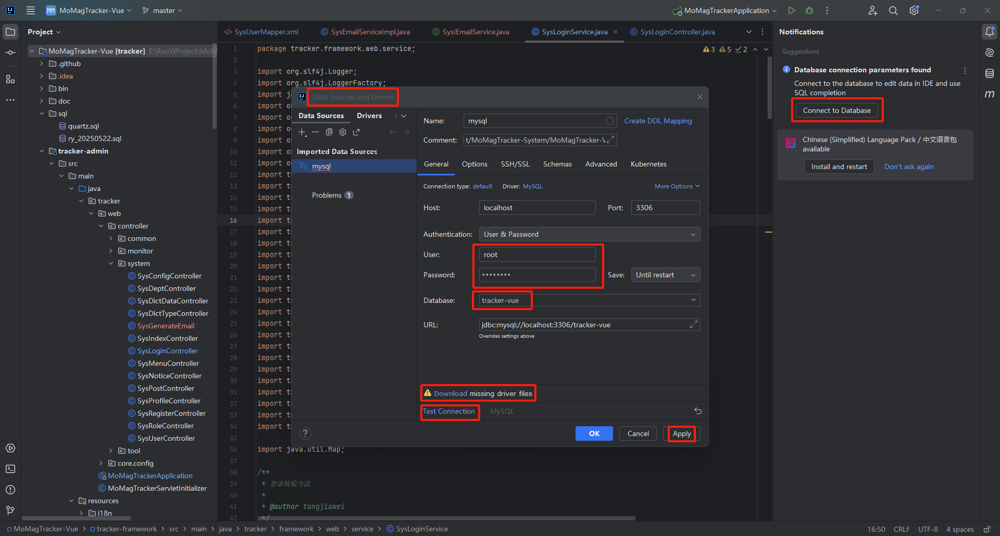

### 2.4 结果展示

#### 2.4.1 账号密码登录页面

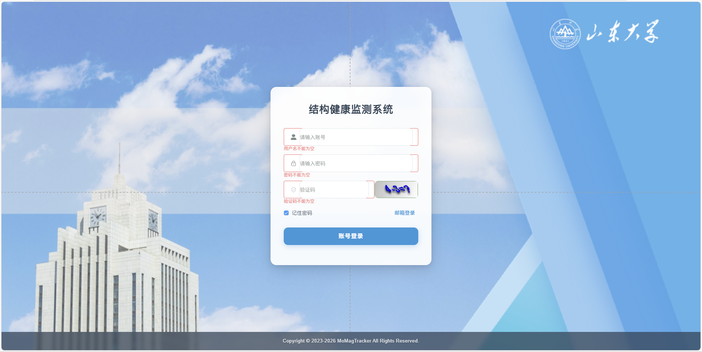

#### 2.4.2 邮箱登录页面

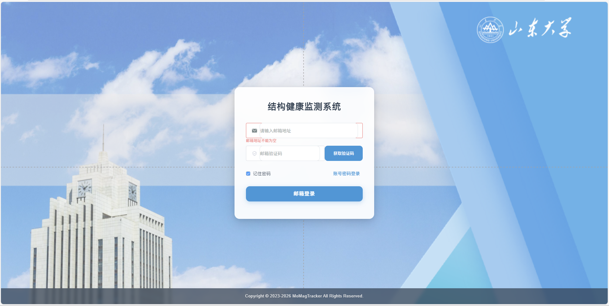

### 2.4 推送至远程仓库

```shell
ls -a

git status

git add .

git status

git commit -m "第二次提交，修改总体概括 README.md 文件，在原来的账号密码登录功能之外新增邮箱登录功能"

git push -u origin master
```

- 结果

```shell
17354@LAPTOP-3CJQNHQH MINGW64 /e/RuoYiProject/MoMagTracker-System (master)
$ ls -a
./  ../  .git/  MoMagTracker-Vue/  MoMagTracker-Vue3/  README.assets/  README.md

17354@LAPTOP-3CJQNHQH MINGW64 /e/RuoYiProject/MoMagTracker-System (master)
$ git status
On branch master
Your branch is up to date with 'origin/master'.

Changes not staged for commit:
  (use "git add <file>..." to update what will be committed)
  (use "git restore <file>..." to discard changes in working directory)
        modified:   MoMagTracker-Vue/tracker-admin/pom.xml
        modified:   MoMagTracker-Vue/tracker-admin/src/main/java/tracker/MoMagTrackerApplication.java
        modified:   MoMagTracker-Vue/tracker-admin/src/main/java/tracker/web/controller/system/SysLoginController.java
        modified:   MoMagTracker-Vue/tracker-admin/src/main/resources/application.yml
        modified:   MoMagTracker-Vue/tracker-common/src/main/java/tracker/common/constant/Constants.java
        modified:   MoMagTracker-Vue/tracker-common/src/main/java/tracker/common/core/domain/model/LoginBody.java
        modified:   MoMagTracker-Vue/tracker-common/src/main/java/tracker/common/utils/SecurityUtils.java
        modified:   MoMagTracker-Vue/tracker-framework/src/main/java/tracker/framework/config/SecurityConfig.java
        modified:   MoMagTracker-Vue/tracker-framework/src/main/java/tracker/framework/web/service/SysLoginService.java
        modified:   MoMagTracker-Vue/tracker-framework/src/main/java/tracker/framework/web/service/UserDetailsServiceImpl.java
        modified:   MoMagTracker-Vue/tracker-system/pom.xml
        modified:   MoMagTracker-Vue/tracker-system/src/main/java/tracker/system/mapper/SysUserMapper.java
        modified:   MoMagTracker-Vue/tracker-system/src/main/java/tracker/system/service/ISysUserService.java
        modified:   MoMagTracker-Vue/tracker-system/src/main/java/tracker/system/service/impl/SysUserServiceImpl.java
        modified:   MoMagTracker-Vue/tracker-system/src/main/resources/mapper/system/SysUserMapper.xml
        modified:   MoMagTracker-Vue/tracker-ui/src/api/login.js
        modified:   MoMagTracker-Vue/tracker-ui/src/store/modules/user.js
        modified:   MoMagTracker-Vue/tracker-ui/src/views/login.vue
        modified:   MoMagTracker-Vue3/src/api/login.js
        modified:   MoMagTracker-Vue3/src/main.js
        modified:   MoMagTracker-Vue3/src/permission.js
        modified:   MoMagTracker-Vue3/src/store/modules/permission.js
        modified:   MoMagTracker-Vue3/src/store/modules/user.js
        modified:   MoMagTracker-Vue3/src/views/login.vue
        modified:   README.md

Untracked files:
  (use "git add <file>..." to include in what will be committed)
        MoMagTracker-Vue/tracker-admin/src/main/java/tracker/web/controller/system/SysGenerateEmail.java
        MoMagTracker-Vue/tracker-framework/src/main/java/tracker/framework/emailConfig/
        MoMagTracker-Vue/tracker-framework/src/main/java/tracker/framework/web/service/EmailUserDetailsServiceImpl.java
        MoMagTracker-Vue/tracker-system/src/main/java/tracker/system/service/SysIEmailService.java
        MoMagTracker-Vue/tracker-system/src/main/java/tracker/system/service/impl/SysEmailServiceImpl.java
        MoMagTracker-Vue/tracker-ui/src/assets/images/login-background-sdu.png
        MoMagTracker-Vue3/src/assets/images/readme.jpg
        README.assets/

no changes added to commit (use "git add" and/or "git commit -a")

17354@LAPTOP-3CJQNHQH MINGW64 /e/RuoYiProject/MoMagTracker-System (master)
$ git add .

17354@LAPTOP-3CJQNHQH MINGW64 /e/RuoYiProject/MoMagTracker-System (master)
$ git status
On branch master
Your branch is up to date with 'origin/master'.

Changes to be committed:
  (use "git restore --staged <file>..." to unstage)
        modified:   MoMagTracker-Vue/tracker-admin/pom.xml
        modified:   MoMagTracker-Vue/tracker-admin/src/main/java/tracker/MoMagTrackerApplication.java
        new file:   MoMagTracker-Vue/tracker-admin/src/main/java/tracker/web/controller/system/SysGenerateEmail.java
        modified:   MoMagTracker-Vue/tracker-admin/src/main/java/tracker/web/controller/system/SysLoginController.java
        modified:   MoMagTracker-Vue/tracker-admin/src/main/resources/application.yml
        modified:   MoMagTracker-Vue/tracker-common/src/main/java/tracker/common/constant/Constants.java
        modified:   MoMagTracker-Vue/tracker-common/src/main/java/tracker/common/core/domain/model/LoginBody.java
        modified:   MoMagTracker-Vue/tracker-common/src/main/java/tracker/common/utils/SecurityUtils.java
        modified:   MoMagTracker-Vue/tracker-framework/src/main/java/tracker/framework/config/SecurityConfig.java
        new file:   MoMagTracker-Vue/tracker-framework/src/main/java/tracker/framework/emailConfig/CustomAuthenticationFailureHandler.java
        new file:   MoMagTracker-Vue/tracker-framework/src/main/java/tracker/framework/emailConfig/CustomAuthenticationSuccessHandler.java
        new file:   MoMagTracker-Vue/tracker-framework/src/main/java/tracker/framework/emailConfig/EmailCodeAuthenticationFilter.java
        new file:   MoMagTracker-Vue/tracker-framework/src/main/java/tracker/framework/emailConfig/EmailCodeAuthenticationProvider.java
        new file:   MoMagTracker-Vue/tracker-framework/src/main/java/tracker/framework/emailConfig/EmailCodeAuthenticationSecurityConfig.java
        new file:   MoMagTracker-Vue/tracker-framework/src/main/java/tracker/framework/emailConfig/EmailCodeAuthenticationToken.java
        new file:   MoMagTracker-Vue/tracker-framework/src/main/java/tracker/framework/emailConfig/SpringContextUtil.java
        new file:   MoMagTracker-Vue/tracker-framework/src/main/java/tracker/framework/web/service/EmailUserDetailsServiceImpl.java
        modified:   MoMagTracker-Vue/tracker-framework/src/main/java/tracker/framework/web/service/SysLoginService.java
        modified:   MoMagTracker-Vue/tracker-framework/src/main/java/tracker/framework/web/service/UserDetailsServiceImpl.java
        modified:   MoMagTracker-Vue/tracker-system/pom.xml
        modified:   MoMagTracker-Vue/tracker-system/src/main/java/tracker/system/mapper/SysUserMapper.java
        modified:   MoMagTracker-Vue/tracker-system/src/main/java/tracker/system/service/ISysUserService.java
        new file:   MoMagTracker-Vue/tracker-system/src/main/java/tracker/system/service/SysIEmailService.java
        new file:   MoMagTracker-Vue/tracker-system/src/main/java/tracker/system/service/impl/SysEmailServiceImpl.java
        modified:   MoMagTracker-Vue/tracker-system/src/main/java/tracker/system/service/impl/SysUserServiceImpl.java
        modified:   MoMagTracker-Vue/tracker-system/src/main/resources/mapper/system/SysUserMapper.xml
        modified:   MoMagTracker-Vue/tracker-ui/src/api/login.js
        new file:   MoMagTracker-Vue/tracker-ui/src/assets/images/login-background-sdu.png
        modified:   MoMagTracker-Vue/tracker-ui/src/store/modules/user.js
        modified:   MoMagTracker-Vue/tracker-ui/src/views/login.vue
        modified:   MoMagTracker-Vue3/src/api/login.js
        new file:   MoMagTracker-Vue3/src/assets/images/readme.jpg
        modified:   MoMagTracker-Vue3/src/main.js
        modified:   MoMagTracker-Vue3/src/permission.js
        modified:   MoMagTracker-Vue3/src/store/modules/permission.js
        modified:   MoMagTracker-Vue3/src/store/modules/user.js
        modified:   MoMagTracker-Vue3/src/views/login.vue
        new file:   README.assets/image-20251017101236143.png
        new file:   README.assets/image-20251017101430289.png
        new file:   README.assets/image-20251021083538445.png
        new file:   README.assets/image-20251021083953338.png
        new file:   README.assets/image-20251027084544359.png
        new file:   README.assets/image-20251027092745320.png
        new file:   README.assets/image-20251027092852936.png
        new file:   README.assets/image-20251027093224515.png
        new file:   README.assets/image-20251027093518022.png
        new file:   README.assets/image-20251027093849808.png
        new file:   README.assets/image-20251027094308158.png
        new file:   README.assets/image-20251027094717649.png
        new file:   README.assets/image-20251027094914257.png
        new file:   README.assets/image-20251027095104232.png
        new file:   README.assets/image-20251027095433044.png
        new file:   README.assets/image-20251027095706479.png
        new file:   README.assets/image-20251027095918506.png
        new file:   README.assets/image-20251027100027052.png
        new file:   README.assets/image-20251027100159611.png
        new file:   README.assets/image-20251027100256444.png
        new file:   README.assets/image-20251027100829654.png
        modified:   README.md

17354@LAPTOP-3CJQNHQH MINGW64 /e/RuoYiProject/MoMagTracker-System (master)
$ git commit -m "第二次提交，修改总体概括 README.md 文件，在原来的账号密码登录功能之外新增邮箱登录功能"
[master c729ef1] 第二次提交，修改总体概括 README.md 文件，在原来的账号密码登录功能之外新增邮箱登录功能
 59 files changed, 7236 insertions(+), 290 deletions(-)
 create mode 100644 MoMagTracker-Vue/tracker-admin/src/main/java/tracker/web/controller/system/SysGenerateEmail.java
 create mode 100644 MoMagTracker-Vue/tracker-framework/src/main/java/tracker/framework/emailConfig/CustomAuthenticationFailureHandler.java
 create mode 100644 MoMagTracker-Vue/tracker-framework/src/main/java/tracker/framework/emailConfig/CustomAuthenticationSuccessHandler.java
 create mode 100644 MoMagTracker-Vue/tracker-framework/src/main/java/tracker/framework/emailConfig/EmailCodeAuthenticationFilter.java
 create mode 100644 MoMagTracker-Vue/tracker-framework/src/main/java/tracker/framework/emailConfig/EmailCodeAuthenticationProvider.java
 create mode 100644 MoMagTracker-Vue/tracker-framework/src/main/java/tracker/framework/emailConfig/EmailCodeAuthenticationSecurityConfig.java
 create mode 100644 MoMagTracker-Vue/tracker-framework/src/main/java/tracker/framework/emailConfig/EmailCodeAuthenticationToken.java
 create mode 100644 MoMagTracker-Vue/tracker-framework/src/main/java/tracker/framework/emailConfig/SpringContextUtil.java
 create mode 100644 MoMagTracker-Vue/tracker-framework/src/main/java/tracker/framework/web/service/EmailUserDetailsServiceImpl.java
 create mode 100644 MoMagTracker-Vue/tracker-system/src/main/java/tracker/system/service/SysIEmailService.java
 create mode 100644 MoMagTracker-Vue/tracker-system/src/main/java/tracker/system/service/impl/SysEmailServiceImpl.java
 create mode 100644 MoMagTracker-Vue/tracker-ui/src/assets/images/login-background-sdu.png
 create mode 100644 MoMagTracker-Vue3/src/assets/images/readme.jpg
 create mode 100644 README.assets/image-20251017101236143.png
 create mode 100644 README.assets/image-20251017101430289.png
 create mode 100644 README.assets/image-20251021083538445.png
 create mode 100644 README.assets/image-20251021083953338.png
 create mode 100644 README.assets/image-20251027084544359.png
 create mode 100644 README.assets/image-20251027092745320.png
 create mode 100644 README.assets/image-20251027092852936.png
 create mode 100644 README.assets/image-20251027093224515.png
 create mode 100644 README.assets/image-20251027093518022.png
 create mode 100644 README.assets/image-20251027093849808.png
 create mode 100644 README.assets/image-20251027094308158.png
 create mode 100644 README.assets/image-20251027094717649.png
 create mode 100644 README.assets/image-20251027094914257.png
 create mode 100644 README.assets/image-20251027095104232.png
 create mode 100644 README.assets/image-20251027095433044.png
 create mode 100644 README.assets/image-20251027095706479.png
 create mode 100644 README.assets/image-20251027095918506.png
 create mode 100644 README.assets/image-20251027100027052.png
 create mode 100644 README.assets/image-20251027100159611.png
 create mode 100644 README.assets/image-20251027100256444.png
 create mode 100644 README.assets/image-20251027100829654.png

17354@LAPTOP-3CJQNHQH MINGW64 /e/RuoYiProject/MoMagTracker-System (master)
$ git push -u origin master
Enumerating objects: 189, done.
Counting objects: 100% (189/189), done.
Delta compression using up to 8 threads
Compressing objects: 100% (104/104), done.
Writing objects: 100% (119/119), 3.63 MiB | 1.68 MiB/s, done.
Total 119 (delta 49), reused 0 (delta 0), pack-reused 0 (from 0)
remote: Resolving deltas: 100% (49/49), completed with 46 local objects.
To 17354395073_github_account:Tang17354395073/MoMagTracker-System.git
   91a45cf..c729ef1  master -> master
branch 'master' set up to track 'origin/master'.
```

## 2.3 系统功能开发（前端页面）

```java
账号：admin
密码：admin123
    
账号：conner
密码：admin123
```

### 2.3.1 首页开发（views/index.vue）

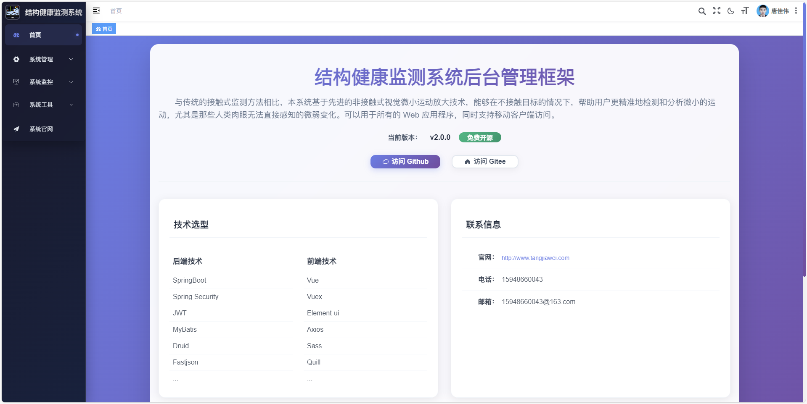

```java
<template>
  <div class="app-container home">
    <div class="main-card">
      <!-- 主标题区域 -->
      <div class="header-section">
        <h1 class="main-title">结构健康监测系统后台管理框架</h1>
        <p class="description">
          与传统的接触式监测方法相比，本系统基于先进的非接触式视觉微小运动放大技术，能够在不接触目标的情况下，帮助用户更精准地检测和分析微小的运动，尤其是那些人类肉眼无法直接感知的微弱变化。可以用于所有的 Web 应用程序，同时支持移动客户端访问。
        </p>
        <div class="version-info">
          <span class="version-label">当前版本：</span>
          <span class="version-value">v{{ version }}</span>
          <el-tag type="success" class="free-tag">免费开源</el-tag>
        </div>
        <div class="action-buttons">
          <el-button
            type="primary"
            icon="Cloudy"
            class="custom-btn primary-btn"
            @click="goTarget('https://github.com/Tang17354395073/MoMagTracker-System')"
          >
            访问 Github
          </el-button>
          <el-button
            icon="HomeFilled"
            class="custom-btn secondary-btn"
            @click="goTarget('http://ruoyi.vip')"
          >
            访问 Gitee
          </el-button>
        </div>
      </div>

      <!-- 内容区域 -->
      <div class="content-section">
        <!-- 技术选型 -->
        <div class="content-block tech-block">
          <h3 class="block-title">
            <i class="el-icon-cpu"></i>
            技术选型
          </h3>
          <div class="tech-content">
            <div class="tech-column">
              <h4 class="tech-category">
                <i class="el-icon-monitor"></i>
                后端技术
              </h4>
              <ul class="tech-list">
                <li><i class="el-icon-check"></i> SpringBoot</li>
                <li><i class="el-icon-check"></i> Spring Security</li>
                <li><i class="el-icon-check"></i> JWT</li>
                <li><i class="el-icon-check"></i> MyBatis</li>
                <li><i class="el-icon-check"></i> Druid</li>
                <li><i class="el-icon-check"></i> Fastjson</li>
                <li><i class="el-icon-more"></i> ...</li>
              </ul>
            </div>
            <div class="tech-column">
              <h4 class="tech-category">
                <i class="el-icon-data-line"></i>
                前端技术
              </h4>
              <ul class="tech-list">
                <li><i class="el-icon-check"></i> Vue</li>
                <li><i class="el-icon-check"></i> Vuex</li>
                <li><i class="el-icon-check"></i> Element-ui</li>
                <li><i class="el-icon-check"></i> Axios</li>
                <li><i class="el-icon-check"></i> Sass</li>
                <li><i class="el-icon-check"></i> Quill</li>
                <li><i class="el-icon-more"></i> ...</li>
              </ul>
            </div>
          </div>
        </div>

        <!-- 联系信息 -->
        <div class="content-block contact-block">
          <h3 class="block-title">
            <i class="el-icon-phone-outline"></i>
            联系信息
          </h3>
          <div class="contact-content">
            <div class="contact-item">
              <i class="el-icon-s-promotion contact-icon"></i>
              <div class="contact-details">
                <span class="contact-label">官网：</span>
                <el-link 
                  href="http://www.ruoyi.vip" 
                  target="_blank"
                  class="contact-link"
                >
                  http://www.tangjiawei.com
                </el-link>
              </div>
            </div>
            <div class="contact-item">
              <i class="el-icon-chat-dot-round contact-icon"></i>
              <div class="contact-details">
                <span class="contact-label">电话：</span>
                <span class="contact-text">15948660043</span>
              </div>
            </div>
            <div class="contact-item">
              <i class="el-icon-message contact-icon"></i>
              <div class="contact-details">
                <span class="contact-label">邮箱：</span>
                <span class="contact-text">15948660043@163.com</span>
              </div>
            </div>
          </div>
        </div>

        <!-- 更新日志 -->
        <div class="content-block update-block">
          <h3 class="block-title">
            <i class="el-icon-notebook-2"></i>
            更新日志
          </h3>
          <div class="update-content">
            <el-collapse accordion class="custom-collapse">
              <el-collapse-item name="2.0.0" class="collapse-item">
                <template #title>
                  <div class="collapse-title">
                    <span class="version-tag">v2.0.0</span>
                    <span class="version-date">2025-10-27</span>
                  </div>
                </template>
                <div class="update-details">
                  <ol class="update-list">
                    <li>优化菜单搜索查询页</li>
                  </ol>
                </div>
              </el-collapse-item>
              <el-collapse-item name="1.0.0" class="collapse-item">
                <template #title>
                  <div class="collapse-title">
                    <span class="version-tag">v1.0.0</span>
                    <span class="version-date">2025-03-05</span>
                  </div>
                </template>
                <div class="update-details">
                  <ol class="update-list">
                    <li>结构健康监测系统正式发布</li>
                  </ol>
                </div>
              </el-collapse-item>
            </el-collapse>
          </div>
        </div>

        <!-- 捐赠支持 -->
        <div class="content-block donation-block">
          <h3 class="block-title">
            <i class="el-icon-coffee-cup"></i>
            捐赠支持
          </h3>
          <div class="donation-content">
            <div class="donation-container">
              <div class="donation-item">
                <div class="donation-title">
                  <i class="el-icon-alipay"></i>
                  支付宝扫一扫付款
                </div>
                <div class="donation-image-wrapper">
                  
                </div>
              </div>
              
              <div class="divider"></div>
              
              <div class="donation-item">
                <div class="donation-title">
                  <i class="el-icon-wechat"></i>
                  微信扫一扫转账
                </div>
                <div class="donation-image-wrapper">
                  
                </div>
              </div>
            </div>
            <div class="donation-footer">
              <i class="el-icon-chat-line-round"></i>
              你可以请作者喝杯咖啡表示鼓励
            </div>
          </div>
        </div>
      </div>
    </div>
  </div>
</template>

<script setup name="Index">
const version = ref('2.0.0')

function goTarget(url) {
  window.open(url, '__blank')
}
</script>

<style scoped lang="scss">
.home {
  font-family: "Inter", "Helvetica Neue", Helvetica, "PingFang SC", "Hiragino Sans GB", "Microsoft YaHei", Arial, sans-serif;
  color: #2c3e50;
  background: linear-gradient(135deg, #667eea 0%, #764ba2 100%);
  min-height: 100vh;
  padding: 0px;
  display: flex;
  align-items: center;
  justify-content: center;

  .main-card {
    background: rgba(255, 255, 255, 0.95);
    border-radius: 20px;
    box-shadow: 0 20px 60px rgba(0, 0, 0, 0.15);
    backdrop-filter: blur(20px);
    width: 100%;
    max-width: 1400px;
    padding: 20px;
    margin: 20px;

    // 头部区域
    .header-section {
      text-align: center;
      margin-bottom: 40px;
      padding-bottom: 30px;
      border-bottom: 2px solid #f1f5f9;

      .main-title {
        font-size: 2.8rem;
        font-weight: 800;
        background: linear-gradient(135deg, #667eea 0%, #764ba2 100%);
        -webkit-background-clip: text;
        -webkit-text-fill-color: transparent;
        margin-bottom: 20px;
        line-height: 1.2;
        letter-spacing: -0.5px;
      }

      .description {
        font-size: 1.2rem;
        line-height: 1.6;
        color: #64748b;
        margin-bottom: 25px;
        text-align: left;
        max-width: 100%;
        margin-left: 0;
        margin-right: 0;
        text-indent: 2em;
      }

      .version-info {
        display: flex;
        align-items: center;
        justify-content: center;
        gap: 20px;
        margin-bottom: 30px;
        flex-wrap: wrap;

        .version-label {
          font-weight: 600;
          color: #475569;
        }

        .version-value {
          font-weight: 700;
          color: #1e293b;
          font-size: 1.1rem;
        }

        .free-tag {
          font-weight: 600;
          padding: 8px 20px;
          border-radius: 25px;
          font-size: 0.95rem;
          background: linear-gradient(135deg, #10b981 0%, #059669 100%);
          border: none;
          color: white;
        }
      }

      .action-buttons {
        display: flex;
        gap: 15px;
        justify-content: center;
        flex-wrap: wrap;

        .custom-btn {
          padding: 14px 28px;
          border-radius: 12px;
          font-weight: 600;
          font-size: 1rem;
          transition: all 0.3s ease;
          border: none;
          min-width: 140px;

          &.primary-btn {
            background: linear-gradient(135deg, #667eea 0%, #764ba2 100%);
            color: white;
            box-shadow: 0 4px 15px rgba(102, 126, 234, 0.3);

            &:hover {
              transform: translateY(-3px);
              box-shadow: 0 12px 30px rgba(102, 126, 234, 0.4);
            }
          }

          &.secondary-btn {
            background: white;
            border: 2px solid #e2e8f0;
            color: #475569;
            box-shadow: 0 4px 15px rgba(0, 0, 0, 0.05);

            &:hover {
              transform: translateY(-3px);
              box-shadow: 0 12px 30px rgba(0, 0, 0, 0.1);
              border-color: #667eea;
              color: #667eea;
            }
          }
        }
      }
    }

    // 内容区域
    .content-section {
      display: grid;
      grid-template-columns: repeat(2, 1fr);
      gap: 30px;

      .content-block {
        background: white;
        border-radius: 16px;
        padding: 25px;
        box-shadow: 0 4px 20px rgba(0, 0, 0, 0.08);
        border: 1px solid #f1f5f9;
        transition: all 0.3s ease;

        &:hover {
          transform: translateY(-5px);
          box-shadow: 0 8px 30px rgba(0, 0, 0, 0.12);
        }

        .block-title {
          display: flex;
          align-items: center;
          gap: 10px;
          font-size: 1.3rem;
          font-weight: 700;
          color: #1e293b;
          margin-bottom: 20px;
          padding-bottom: 15px;
          border-bottom: 2px solid #f1f5f9;

          i {
            color: #667eea;
            font-size: 1.4rem;
          }
        }
      }

      // 技术选型区块
      .tech-block {
        .tech-content {
          display: grid;
          grid-template-columns: 1fr 1fr;
          gap: 25px;

          .tech-column {
            .tech-category {
              display: flex;
              align-items: center;
              gap: 8px;
              font-size: 1.1rem;
              font-weight: 600;
              color: #374151;
              margin-bottom: 15px;

              i {
                color: #667eea;
              }
            }

            .tech-list {
              list-style: none;
              padding: 0;
              margin: 0;

              li {
                display: flex;
                align-items: center;
                gap: 8px;
                padding: 10px 0;
                color: #4b5563;
                font-weight: 500;
                transition: all 0.3s ease;
                border-bottom: 1px solid #f8fafc;

                &:last-child {
                  border-bottom: none;
                }

                &:hover {
                  color: #667eea;
                  transform: translateX(5px);
                }

                i {
                  color: #10b981;

                  &.el-icon-more {
                    color: #9ca3af;
                  }
                }
              }
            }
          }
        }
      }

      // 联系信息区块
      .contact-block {
        .contact-content {
          .contact-item {
            display: flex;
            align-items: center;
            gap: 15px;
            padding: 15px 0;
            border-bottom: 1px solid #f8fafc;

            &:last-child {
              border-bottom: none;
            }

            .contact-icon {
              color: #667eea;
              font-size: 1.3rem;
              width: 24px;
              text-align: center;
            }

            .contact-details {
              flex: 1;

              .contact-label {
                font-weight: 600;
                color: #374151;
                margin-right: 8px;
              }

              .contact-link {
                color: #667eea;
                text-decoration: none;
                font-weight: 500;

                &:hover {
                  text-decoration: underline;
                }
              }

              .contact-text {
                color: #4b5563;
                font-weight: 500;
              }
            }
          }
        }
      }

      // 更新日志区块
      .update-block {
        .update-content {
          .custom-collapse {
            border: none;

            .collapse-item {
              margin-bottom: 12px;
              border: 1px solid #e2e8f0;
              border-radius: 12px;
              overflow: hidden;

              &:last-child {
                margin-bottom: 0;
              }

              :deep(.el-collapse-item__header) {
                background: #f8fafc;
                border: none;
                padding: 18px 20px;
                font-weight: 600;

                .collapse-title {
                  display: flex;
                  align-items: center;
                  gap: 15px;

                  .version-tag {
                    background: linear-gradient(135deg, #667eea 0%, #764ba2 100%);
                    color: white;
                    padding: 6px 14px;
                    border-radius: 20px;
                    font-size: 0.9rem;
                    font-weight: 600;
                  }

                  .version-date {
                    color: #6b7280;
                    font-weight: 500;
                  }
                }
              }

              :deep(.el-collapse-item__wrap) {
                border: none;
                background: white;

                .update-details {
                  padding: 20px;

                  .update-list {
                    margin: 0;
                    padding-left: 20px;

                    li {
                      padding: 8px 0;
                      color: #4b5563;
                      line-height: 1.5;
                      font-weight: 500;
                    }
                  }
                }
              }
            }
          }
        }
      }

      // 捐赠支持区块
      .donation-block {
        .donation-content {
          .donation-container {
            display: flex;
            align-items: center;
            justify-content: space-between;
            margin-bottom: 20px;

            .donation-item {
              flex: 1;
              text-align: center;
              display: flex;
              flex-direction: column;
              align-items: center;

              .donation-title {
                display: flex;
                align-items: center;
                gap: 8px;
                font-weight: 600;
                margin-bottom: 15px;
                color: #1e293b;
                font-size: 0.95rem;

                i {
                  font-size: 1.3rem;

                  &.el-icon-alipay {
                    color: #1677ff;
                  }

                  &.el-icon-wechat {
                    color: #07c160;
                  }
                }
              }

              .donation-image-wrapper {
                width: 130px;
                height: 130px;
                padding: 8px;
                border: 2px solid #e2e8f0;
                border-radius: 12px;
                background: white;
                transition: all 0.3s ease;

                &:hover {
                  border-color: #667eea;
                  transform: scale(1.05);
                }
              }

              .donation-image {
                width: 100%;
                height: 100%;
                object-fit: contain;
                border-radius: 8px;
              }
            }

            .divider {
              width: 1px;
              height: 140px;
              background: linear-gradient(to bottom, transparent, #e2e8f0, transparent);
              margin: 0 20px;
            }
          }

          .donation-footer {
            text-align: center;
            padding: 15px;
            background: #f8fafc;
            border-radius: 12px;
            color: #6b7280;
            font-weight: 500;

            i {
              margin-right: 8px;
              color: #667eea;
            }
          }
        }
      }
    }
  }

  // 响应式设计
  @media (max-width: 1024px) {
    .main-card {
      padding: 30px;
      margin: 15px;

      .content-section {
        grid-template-columns: 1fr;
        gap: 25px;
      }
    }
  }

  @media (max-width: 768px) {
    .home {
      padding: 15px;
    }

    .main-card {
      padding: 25px 20px;

      .header-section {
        .main-title {
          font-size: 2.2rem;
        }

        .description {
          font-size: 1.1rem;
        }

        .version-info {
          flex-direction: column;
          gap: 15px;
        }

        .action-buttons {
          flex-direction: column;
          align-items: center;

          .custom-btn {
            width: 100%;
            max-width: 250px;
          }
        }
      }

      .content-section {
        .tech-block .tech-content {
          grid-template-columns: 1fr;
          gap: 20px;
        }

        .donation-block .donation-content .donation-container {
          flex-direction: column;

          .divider {
            width: 80%;
            height: 1px;
            margin: 20px 0;
          }

          .donation-item {
            margin-bottom: 20px;
          }
        }
      }
    }
  }

  @media (max-width: 480px) {
    .main-card {
      padding: 20px 15px;

      .header-section .main-title {
        font-size: 1.8rem;
      }

      .content-section {
        .content-block {
          padding: 20px;
        }

        .donation-block .donation-content .donation-container .donation-item .donation-image-wrapper {
          width: 110px;
          height: 110px;
        }
      }
    }
  }
}
</style>
```

### 2.3.2 侧边栏开发

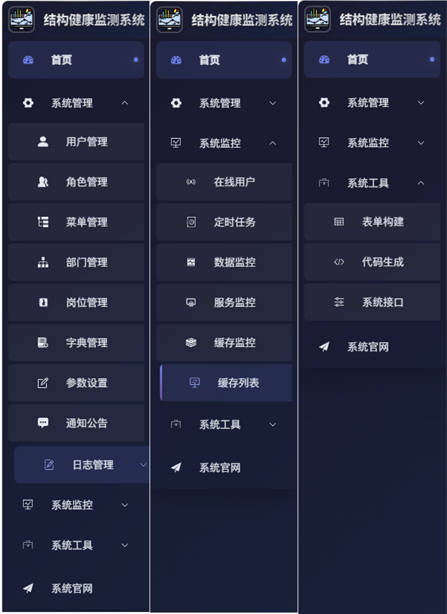

#### 2.3.2.1 修改侧边栏样式变量（src/assets/styles/variables.module.scss）

```java
// base color
$blue: #324157;
$light-blue: #333c46;
$red: #C03639;
$pink: #E65D6E;
$green: #30B08F;
$tiffany: #4AB7BD;
$yellow: #FEC171;
$panGreen: #30B08F;

// 科技感主题变量
$menuText: #e2e8f0;
$menuActiveText: #667eea;
$menuBg: linear-gradient(135deg, #1a1a2e 0%, #16213e 100%);
$menuHover: rgba(102, 126, 234, 0.1);

// 浅色主题theme-light
$menuLightBg: #ffffff;
$menuLightHover: #f0f1f5;
$menuLightText: #303133;
$menuLightActiveText: #409EFF;

// 基础变量
$base-sidebar-width: 200px;
$sideBarWidth: 200px;

// 菜单科技感变量
$base-menu-color: #e2e8f0;
$base-menu-color-active: #667eea;
$base-menu-background: linear-gradient(135deg, #1a1a2e 0%, #16213e 100%);
$base-sub-menu-background: rgba(255, 255, 255, 0.05);
$base-sub-menu-hover: rgba(102, 126, 234, 0.15);

// 组件变量 - 调整为科技感配色
$--color-primary: #667eea;
$--color-success: #10b981;
$--color-warning: #F59E0B;
$--color-danger: #EF4444;
$--color-info: #6B7280;

// 科技感阴影和边框
$sidebar-shadow: 0 8px 32px rgba(0, 0, 0, 0.3);
$menu-border-radius: 8px;

:export {
  menuText: $menuText;
  menuActiveText: $menuActiveText;
  menuBg: $menuBg;
  menuHover: $menuHover;
  menuLightBg: $menuLightBg;
  menuLightHover: $menuLightHover;
  menuLightText: $menuLightText;
  menuLightActiveText: $menuLightActiveText;
  sideBarWidth: $sideBarWidth;
  // 导出基础颜色
  blue: $blue;
  lightBlue: $light-blue;
  red: $red;
  pink: $pink;
  green: $green;
  tiffany: $tiffany;
  yellow: $yellow;
  panGreen: $panGreen;
  // 导出组件颜色
  colorPrimary: $--color-primary;
  colorSuccess: $--color-success;
  colorWarning: $--color-warning;
  colorDanger: $--color-danger;
  colorInfo: $--color-info;
}

// CSS变量定义
:root {
  /* 亮色模式变量 */
  --sidebar-bg: #{$menuBg};
  --sidebar-text: #{$menuText};
  --menu-hover: #{$menuHover};
  --menu-active-text: #{$menuActiveText};
  
  --navbar-bg: #ffffff;
  --navbar-text: #303133;
  
  /* splitpanes default-theme 变量 */
  --splitpanes-default-bg: #ffffff;

}

// 暗黑模式变量 - 增强科技感
html.dark {
  /* 默认通用 */
  --el-bg-color: #0f172a;
  --el-bg-color-overlay: #1e293b;
  --el-text-color-primary: #f1f5f9;
  --el-text-color-regular: #cbd5e1;
  --el-border-color: #334155;
  --el-border-color-light: #334155;

  /* 侧边栏 */
  --sidebar-bg: linear-gradient(135deg, #0f172a 0%, #1e1b4b 100%);
  --sidebar-text: #e2e8f0;
  --menu-hover: rgba(102, 126, 234, 0.15);
  --menu-active-text: #{$menuActiveText};

  /* 顶部导航栏 */
  --navbar-bg: #0f172a;
  --navbar-text: #f1f5f9;
  --navbar-hover: #1e293b;

  /* 标签栏 */
  --tags-bg: #0f172a;
  --tags-item-bg: #1e293b;
  --tags-item-border: #334155;
  --tags-item-text: #cbd5e1;
  --tags-item-hover: #334155;
  --tags-close-hover: #64748b;

  /* splitpanes 组件暗黑模式变量 */
  --splitpanes-bg: #0f172a;
  --splitpanes-border: #334155;
  --splitpanes-splitter-bg: #1e293b;
  --splitpanes-splitter-hover-bg: #334155;

  /* blockquote 暗黑模式变量 */
  --blockquote-bg: #1e293b;
  --blockquote-border: #334155;
  --blockquote-text: #cbd5e1;
  
  /* Cron 时间表达式 模式变量 */
  --cron-border: #334155;

  /* splitpanes default-theme 暗黑模式变量 */
  --splitpanes-default-bg: #0f172a;

  /* 侧边栏菜单覆盖 */
   .sidebar-container {
    .el-menu-item, .menu-title {
      color: var(--el-text-color-regular);
    }
    & .theme-dark .nest-menu .el-sub-menu>.el-sub-menu__title,
    & .theme-dark .el-sub-menu .el-menu-item {
      background-color: var(--el-bg-color) !important;
    }
  }

  /* 顶部栏栏菜单覆盖 */
  .el-menu--horizontal {
    .el-menu-item {
      &:not(.is-disabled) {
        &:hover,
        &:focus {
          background-color: var(--navbar-hover) !important;
        }
      }
    }
  }

  /* 分割窗格覆盖 */
  .splitpanes {
    background-color: var(--splitpanes-bg);

    .splitpanes__pane {
      background-color: var(--splitpanes-bg);
      border-color: var(--splitpanes-border);
    }

    .splitpanes__splitter {
      background-color: var(--splitpanes-splitter-bg);
      border-color: var(--splitpanes-border);

      &:hover {
        background-color: var(--splitpanes-splitter-hover-bg);
      }

      &:before,
      &:after {
        background-color: var(--splitpanes-border);
      }
    }
  }

  /* 表格样式覆盖 */
  .el-table {
    --el-table-header-bg-color: var(--el-bg-color-overlay) !important;
    --el-table-header-text-color: var(--el-text-color-regular) !important;
    --el-table-border-color: var(--el-border-color-light) !important;
    --el-table-row-hover-bg-color: var(--el-bg-color-overlay) !important;

    .el-table__header-wrapper, .el-table__fixed-header-wrapper {
      th {
        background-color: var(--el-bg-color-overlay, #f8f8f9) !important;
        color: var(--el-text-color-regular, #515a6e);
      }
    }
  }

  /* 树组件高亮样式覆盖 */
  .el-tree {
    .el-tree-node.is-current > .el-tree-node__content {
      background-color: var(--el-bg-color-overlay) !important;
      color: var(--el-color-primary);
    }

    .el-tree-node__content:hover {
      background-color: var(--el-bg-color-overlay);
    }
  }
  
  /* 下拉菜单样式覆盖 */
  .el-dropdown-menu__item:not(.is-disabled):focus, .el-dropdown-menu__item:not(.is-disabled):hover{
    background-color: var(--navbar-hover) !important;
  }

  /* blockquote样式覆盖 */
  blockquote {
    background-color: var(--blockquote-bg) !important;
    border-left-color: var(--blockquote-border) !important;
    color: var(--blockquote-text) !important;
  }
  
  /* 时间表达式标题样式覆盖 */
  .popup-result .title {
    background: var(--cron-border);
  }
}
```

#### 2.3.2.2  重写侧边栏样式（src/assets/styles/sidebar.scss）

```java
@use 'sass:color';
@use './variables.module.scss' as vars;

#app {

  .main-container {
    min-height: 100%;
    transition: margin-left .28s;
    margin-left: vars.$base-sidebar-width;
    position: relative;
  }

  .sidebarHide {
    margin-left: 0!important;
  }

  .sidebar-container {
    transition: width 0.28s;
    width: vars.$base-sidebar-width !important;
    height: 100%;
    position: fixed;
    font-size: 0px;
    top: 0;
    bottom: 0;
    left: 0;
    z-index: 1001;
    overflow: hidden;
    background: vars.$base-menu-background;
    box-shadow: vars.$sidebar-shadow;
    border-right: 1px solid rgba(255, 255, 255, 0.1);
    backdrop-filter: blur(10px);

    // reset element-ui css
    .horizontal-collapse-transition {
      transition: 0s width ease-in-out, 0s padding-left ease-in-out, 0s padding-right ease-in-out;
    }

    .scrollbar-wrapper {
      overflow-x: hidden !important;
    }

    .el-scrollbar__bar.is-vertical {
      right: 0px;
    }

    .el-scrollbar {
      height: 100%;
    }

    &.has-logo {
      .el-scrollbar {
        height: calc(100% - 50px);
      }
    }

    .is-horizontal {
      display: none;
    }

    a {
      display: inline-block;
      width: 100%;
      overflow: hidden;
    }

    .svg-icon {
      margin-right: 16px;
    }

    .el-menu {
      border: none;
      height: 100%;
      width: 100% !important;
      background: transparent !important;
    }

    .el-menu-item, .menu-title {
      overflow: hidden !important;
      text-overflow: ellipsis !important;
      white-space: nowrap !important;
      color: vars.$base-menu-color;
      height: 50px;
      line-height: 50px;
      margin: 4px 8px;
      border-radius: vars.$menu-border-radius;
      transition: all 0.3s ease;
      position: relative;
      
      // 科技感悬停效果
      &:hover {
        background-color: vars.$menuHover !important;
        color: color.adjust(vars.$menuActiveText, $lightness: 10%);
        transform: translateX(5px);
        
        &::before {
          content: '';
          position: absolute;
          left: 0;
          top: 0;
          height: 100%;
          width: 3px;
          background: linear-gradient(to bottom, #667eea, #764ba2);
          border-radius: 2px;
        }
      }
      
      // 激活状态
      &.is-active {
        background-color: vars.$base-sub-menu-hover !important;
        color: vars.$menuActiveText;
        font-weight: 600;
        
        &::after {
          content: '';
          position: absolute;
          right: 8px;
          top: 50%;
          transform: translateY(-50%);
          width: 6px;
          height: 6px;
          background: vars.$menuActiveText;
          border-radius: 50%;
          box-shadow: 0 0 10px rgba(102, 126, 234, 0.6);
        }
      }
      
      i {
        color: inherit;
        margin-right: 8px;
        font-size: 16px;
      }
    }

    .el-menu-item .el-menu-tooltip__trigger {
      display: inline-block !important;
    }

    // 子菜单样式
    .el-sub-menu {
      margin: 4px 8px;
      border-radius: vars.$menu-border-radius;
      
      .el-sub-menu__title {
        color: vars.$base-menu-color;
        height: 50px;
        line-height: 50px;
        border-radius: vars.$menu-border-radius;
        transition: all 0.3s ease;
        
        &:hover {
          background-color: vars.$menuHover !important;
          color: color.adjust(vars.$menuActiveText, $lightness: 10%);
        }
        
        i {
          color: inherit;
        }
      }
      
      // 子菜单项
      .el-menu-item {
        background: vars.$base-sub-menu-background !important;
        margin: 2px 0;
        border-radius: 6px;
        
        &.is-active {
          background: rgba(102, 126, 234, 0.2) !important;
        }
      }
    }

    // menu hover
    .sub-menu-title-noDropdown,
    .el-sub-menu__title {
      &:hover {
        background-color: vars.$menuHover !important;
      }
    }

    & .theme-dark .is-active > .el-sub-menu__title {
      color: vars.$base-menu-color-active !important;
    }

    & .nest-menu .el-sub-menu>.el-sub-menu__title,
    & .el-sub-menu .el-menu-item {
      min-width: vars.$base-sidebar-width !important;

      &:hover {
        background-color: vars.$menuHover !important;
      }
    }

    & .theme-dark .nest-menu .el-sub-menu>.el-sub-menu__title,
    & .theme-dark .el-sub-menu .el-menu-item {
      background-color: vars.$base-sub-menu-background;

      &:hover {
        background-color: vars.$base-sub-menu-hover !important;
      }
    }
  }

  .hideSidebar {
    .sidebar-container {
      width: 54px !important;
    }

    .main-container {
      margin-left: 54px;
    }

    .sub-menu-title-noDropdown {
      padding: 0 !important;
      position: relative;

      .el-tooltip {
        padding: 0 !important;

        .svg-icon {
          margin-left: 20px;
        }
      }
    }

    .el-sub-menu {
      overflow: hidden;

      &>.el-sub-menu__title {
        padding: 0 !important;

        .svg-icon {
          margin-left: 20px;
        }

      }
    }

    .el-menu--collapse {
      .el-sub-menu {
        &>.el-sub-menu__title {
          &>span {
            height: 0;
            width: 0;
            overflow: hidden;
            visibility: hidden;
            display: inline-block;
          }
          &>i {
            height: 0;
            width: 0;
            overflow: hidden;
            visibility: hidden;
            display: inline-block;
          }
        }
      }
    }
  }

  .el-menu--collapse .el-menu .el-sub-menu {
    min-width: vars.$base-sidebar-width !important;
  }

  // mobile responsive
  .mobile {
    .main-container {
      margin-left: 0px;
    }

    .sidebar-container {
      transition: transform .28s;
      width: vars.$base-sidebar-width !important;
    }

    &.hideSidebar {
      .sidebar-container {
        pointer-events: none;
        transition-duration: 0.3s;
        transform: translate3d(-(vars.$base-sidebar-width), 0, 0);
      }
    }
  }

  .withoutAnimation {

    .main-container,
    .sidebar-container {
      transition: none;
    }
  }
}

// when menu collapsed
.el-menu--vertical {
  &>.el-menu {
    .svg-icon {
      margin-right: 16px;
    }
  }

  .nest-menu .el-sub-menu>.el-sub-menu__title,
  .el-menu-item {
    &:hover {
      background-color: vars.$menuHover !important;
    }
  }

  // the scroll bar appears when the sub-menu is too long
  >.el-menu--popup {
    max-height: 100vh;
    overflow-y: auto;
    background: vars.$base-menu-background !important;
    border: 1px solid rgba(255, 255, 255, 0.1);
    box-shadow: 0 8px 32px rgba(0, 0, 0, 0.3);
    border-radius: 8px;

    &::-webkit-scrollbar-track-piece {
      background: rgba(255, 255, 255, 0.1);
    }

    &::-webkit-scrollbar {
      width: 6px;
    }

    &::-webkit-scrollbar-thumb {
      background: linear-gradient(135deg, #667eea 0%, #764ba2 100%);
      border-radius: 20px;
    }
  }
}

// 科技感滚动条样式
.sidebar-container {
  .el-scrollbar__thumb {
    background: linear-gradient(135deg, #667eea 0%, #764ba2 100%) !important;
    border-radius: 3px !important;
    
    &:hover {
      background: linear-gradient(135deg, #764ba2 0%, #667eea 100%) !important;
    }
  }
  
  .el-scrollbar__bar.is-vertical {
    width: 6px !important;
  }
}
```

#### 2.3.2.3 更新全局样式（src/assets/styles/ruoyi.scss）

```java
/* 科技感全局样式增强 */
.el-menu--vertical {
  // 垂直菜单的科技感样式
  background: linear-gradient(135deg, #1a1a2e 0%, #16213e 100%) !important;
  border: 1px solid rgba(255, 255, 255, 0.1);
  box-shadow: 0 8px 32px rgba(0, 0, 0, 0.3);
  border-radius: 8px;
  overflow: hidden;
  backdrop-filter: blur(10px);
  
  .el-menu-item {
    color: #e2e8f0;
    transition: all 0.3s ease;
    
    &:hover {
      background: rgba(102, 126, 234, 0.1) !important;
      color: #667eea;
      transform: translateX(3px);
    }
    
    &.is-active {
      background: rgba(102, 126, 234, 0.15) !important;
      color: #667eea;
    }
  }
}

/* 科技感滚动条 */
::-webkit-scrollbar {
  width: 8px;
  height: 8px;
}

::-webkit-scrollbar-track {
  background: rgba(0, 0, 0, 0.1);
  border-radius: 4px;
}

::-webkit-scrollbar-thumb {
  background: linear-gradient(135deg, #667eea 0%, #764ba2 100%);
  border-radius: 4px;
}

::-webkit-scrollbar-thumb:hover {
  background: linear-gradient(135deg, #764ba2 0%, #667eea 100%);
}
```

#### 2.3.2.4 修改 Logo 组件（src/layout/components/Sidebar/Logo.vue）

```java
<template>
  <div class="sidebar-logo-container" :class="{ 'collapse': collapse }">
    <transition name="sidebarLogoFade">
      <router-link v-if="collapse" key="collapse" class="sidebar-logo-link" to="/">
        
        <h1 v-else class="sidebar-title">
          <div class="logo-dot">{{ title }}</div>
        </h1>
      </router-link>
      <router-link v-else key="expand" class="sidebar-logo-link" to="/">
        
        <h1 class="sidebar-title">
          <span class="tech-text">{{ title }}</span>
        </h1>
      </router-link>
    </transition>
  </div>
</template>

<script setup>
import logo from '@/assets/logo/logo.png'
import useSettingsStore from '@/store/modules/settings'
import variables from '@/assets/styles/variables.module.scss'

defineProps({
  collapse: {
    type: Boolean,
    required: true
  }
})

const title = import.meta.env.VITE_APP_TITLE
const settingsStore = useSettingsStore()
const sideTheme = computed(() => settingsStore.sideTheme)

// 获取Logo背景色
const getLogoBackground = computed(() => {
  if (settingsStore.isDark) {
    return 'var(--sidebar-bg)'
  }
  return sideTheme.value === 'theme-dark' ? variables.menuBg : variables.menuLightBg
})

// 获取Logo文字颜色
const getLogoTextColor = computed(() => {
  if (settingsStore.isDark) {
    return 'var(--sidebar-text)'
  }
  return sideTheme.value === 'theme-dark' ? '#fff' : variables.menuLightText
})
</script>

<style lang="scss" scoped>
.sidebarLogoFade-enter-active {
  transition: opacity 1.5s;
}

.sidebarLogoFade-enter,
.sidebarLogoFade-leave-to {
  opacity: 0;
}

.sidebar-logo-container {
  position: relative;
  width: 100%;
  height: 50px;
  line-height: 50px;
  background: v-bind(getLogoBackground);
  text-align: center;
  overflow: hidden;

  // 添加Logo区域的发光效果
  &::before {
    content: '';
    position: absolute;
    top: 0;
    left: 0;
    right: 0;
    height: 1px;
    background: linear-gradient(90deg, transparent, rgba(255, 255, 255, 0.4), transparent);
  }

  & .sidebar-logo-link {
    height: 100%;
    width: 100%;
    display: flex;
    align-items: center;
    justify-content: center;
    text-decoration: none;
    position: relative;

    & .sidebar-logo {
      width: 36px;
      height: 36px;
      vertical-align: middle;
      margin-right: 12px;
      border-radius: 8px;
      box-shadow: 0 4px 12px rgba(0, 0, 0, 0.15);
      border: 2px solid rgba(255, 255, 255, 0.2);
      transition: all 0.3s ease;
    }

    & .logo-placeholder {
      width: 32px;
      height: 32px;
      display: flex;
      align-items: center;
      justify-content: center;
      
      .logo-dot {
        width: 8px;
        height: 8px;
        background: #ffd89b;
        border-radius: 50%;
        box-shadow: 0 0 10px #ffd89b;
        animation: pulse 2s ease-in-out infinite;
      }
    }

    & .sidebar-title {
      display: inline-block;
      margin: 0;
      color: v-bind(getLogoTextColor);
      font-weight: 600;
      line-height: 50px;
      font-size: 14px;
      font-family: Avenir, Helvetica Neue, Arial, Helvetica, sans-serif;
      vertical-align: middle;

      .tech-text {
        background: linear-gradient(135deg, #ffffff 0%, rgba(255, 255, 255, 0.9) 50%, rgba(255, 255, 255, 0.8) 100%);
        -webkit-background-clip: text;
        -webkit-text-fill-color: transparent;
        background-clip: text;
        font-weight: 800;
        font-size: 17.5px;
        letter-spacing: -0.5px;
        text-shadow: 0 2px 4px rgba(0, 0, 0, 0.1);
        display: block;
      }
    }
  }

  &:hover {
    .sidebar-logo {
      transform: scale(1.1) rotate(5deg);
      box-shadow: 0 6px 20px rgba(255, 216, 155, 0.4);
    }
  }

  &.collapse {
    .sidebar-logo {
      margin-right: 0px;
    }

    .sidebar-title {
      .tech-text {
        font-size: 14px;
      }
    }
  }
}

@keyframes pulse {
  0% {
    transform: scale(1);
    box-shadow: 0 0 10px #ffd89b;
  }
  50% {
    transform: scale(1.2);
    box-shadow: 0 0 20px #ffd89b, 0 0 30px rgba(255, 216, 155, 0.5);
  }
  100% {
    transform: scale(1);
    box-shadow: 0 0 10px #ffd89b;
  }
}
</style>
```

### 2.3.3 个人中心开发（src/views/system/user/profile/index.vue）

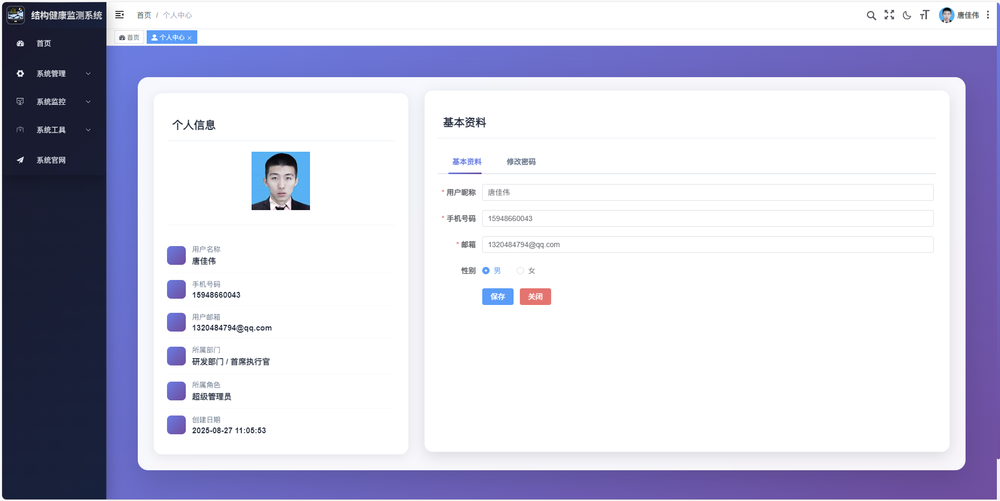

在 `E:\RuoYiProject\MoMagTracker-System\MoMagTracker-Vue3\src\views\system\user\profile\index.vue` 文件中填入下述代码

```java
<template>
  <div class="profile-home">
    <div class="main-card">
      <el-row :gutter="30">
        <!-- 左侧个人信息 -->
        <el-col :span="8" :xs="24">
          <div class="content-block profile-block">
            <h3 class="block-title">
              <i class="el-icon-user-solid"></i>
              个人信息
            </h3>
            <div class="profile-content">
              <div class="avatar-section">
                <userAvatar />
              </div>
              <div class="info-list">
                <div class="info-item">
                  <div class="info-icon">
                    <i class="el-icon-user"></i>
                  </div>
                  <div class="info-content">
                    <span class="info-label">用户名称</span>
                    <span class="info-value">{{ state.user.nickName || '--' }}</span>
                  </div>
                </div>
                <div class="info-item">
                  <div class="info-icon">
                    <i class="el-icon-phone"></i>
                  </div>
                  <div class="info-content">
                    <span class="info-label">手机号码</span>
                    <span class="info-value">{{ state.user.phonenumber || '--' }}</span>
                  </div>
                </div>
                <div class="info-item">
                  <div class="info-icon">
                    <i class="el-icon-message"></i>
                  </div>
                  <div class="info-content">
                    <span class="info-label">用户邮箱</span>
                    <span class="info-value">{{ state.user.email || '--' }}</span>
                  </div>
                </div>
                <div class="info-item">
                  <div class="info-icon">
                    <i class="el-icon-office-building"></i>
                  </div>
                  <div class="info-content">
                    <span class="info-label">所属部门</span>
                    <span class="info-value">
                      {{ state.user.dept?.deptName || '--' }} / {{ state.postGroup || '--' }}
                    </span>
                  </div>
                </div>
                <div class="info-item">
                  <div class="info-icon">
                    <i class="el-icon-s-custom"></i>
                  </div>
                  <div class="info-content">
                    <span class="info-label">所属角色</span>
                    <span class="info-value">{{ state.roleGroup || '--' }}</span>
                  </div>
                </div>
                <div class="info-item">
                  <div class="info-icon">
                    <i class="el-icon-time"></i>
                  </div>
                  <div class="info-content">
                    <span class="info-label">创建日期</span>
                    <span class="info-value">{{ state.user.createTime || '--' }}</span>
                  </div>
                </div>
              </div>
            </div>
          </div>
        </el-col>

        <!-- 右侧基本资料 -->
        <el-col :span="16" :xs="24">
          <div class="content-block management-block">
            <h3 class="block-title">
              <i class="el-icon-setting"></i>
              基本资料
            </h3>
            <div class="management-content">
              <el-tabs v-model="selectedTab" class="custom-tabs">
                <el-tab-pane name="userinfo">
                  <template #label>
                    <span class="tab-label">
                      <i class="el-icon-edit"></i>
                      基本资料
                    </span>
                  </template>
                  <userInfo :user="state.user" />
                </el-tab-pane>
                <el-tab-pane name="resetPwd">
                  <template #label>
                    <span class="tab-label">
                      <i class="el-icon-lock"></i>
                      修改密码
                    </span>
                  </template>
                  <resetPwd />
                </el-tab-pane>
              </el-tabs>
            </div>
          </div>
        </el-col>
      </el-row>
    </div>
  </div>
</template>

<script setup name="Profile">
import userAvatar from "./userAvatar"
import userInfo from "./userInfo"
import resetPwd from "./resetPwd"
import { getUserProfile } from "@/api/system/user"

const route = useRoute()
const selectedTab = ref("userinfo")
const state = reactive({
  user: {},
  roleGroup: {},
  postGroup: {}
})

function getUser() {
  getUserProfile().then(response => {
    state.user = response.data
    state.roleGroup = response.roleGroup
    state.postGroup = response.postGroup
  })
}

onMounted(() => {
  const activeTab = route.params && route.params.activeTab
  if (activeTab) {
    selectedTab.value = activeTab
  }
  getUser()
})
</script>

<style scoped lang="scss">
.profile-home {
  font-family: "Inter", "Helvetica Neue", Helvetica, "PingFang SC", "Hiragino Sans GB", "Microsoft YaHei", Arial, sans-serif;
  color: #2c3e50;
  background: linear-gradient(135deg, #667eea 0%, #764ba2 100%);
  min-height: 100vh;
  padding: 0px;
  display: flex;
  align-items: flex-start;
  justify-content: center;

  .main-card {
    background: rgba(255, 255, 255, 0.95);
    border-radius: 20px;
    box-shadow: 0 20px 60px rgba(0, 0, 0, 0.15);
    backdrop-filter: blur(20px);
    width: 100%;
    max-width: 1400px;
    padding: 30px;
    margin: 20px;

    .content-block {
      background: white;
      border-radius: 16px;
      padding: 25px;
      box-shadow: 0 4px 20px rgba(0, 0, 0, 0.08);
      border: 1px solid #f1f5f9;
      transition: all 0.3s ease;
      height: 100%;

      &:hover {
        transform: translateY(-5px);
        box-shadow: 0 8px 30px rgba(0, 0, 0, 0.12);
      }

      .block-title {
        display: flex;
        align-items: center;
        gap: 10px;
        font-size: 1.3rem;
        font-weight: 700;
        color: #1e293b;
        margin-bottom: 20px;
        padding-bottom: 15px;
        border-bottom: 2px solid #f1f5f9;

        i {
          color: #667eea;
          font-size: 1.4rem;
        }
      }
    }

    // 个人信息区块
    .profile-block {
      .profile-content {
        .avatar-section {
          text-align: center;
          margin-bottom: 25px;
          padding-bottom: 20px;
          border-bottom: 1px solid #f1f5f9;
        }

        .info-list {
          .info-item {
            display: flex;
            align-items: center;
            gap: 12px;
            padding: 12px 0;
            border-bottom: 1px solid #f8fafc;
            transition: all 0.3s ease;

            &:last-child {
              border-bottom: none;
            }

            &:hover {
              transform: translateX(5px);
              
              .info-icon {
                transform: scale(1.1);
              }
            }

            .info-icon {
              width: 36px;
              height: 36px;
              display: flex;
              align-items: center;
              justify-content: center;
              background: linear-gradient(135deg, #667eea 0%, #764ba2 100%);
              border-radius: 8px;
              color: white;
              font-size: 1.1rem;
              transition: all 0.3s ease;
            }

            .info-content {
              flex: 1;
              display: flex;
              flex-direction: column;

              .info-label {
                font-size: 0.85rem;
                color: #64748b;
                margin-bottom: 2px;
                font-weight: 500;
              }

              .info-value {
                font-size: 0.95rem;
                color: #1e293b;
                font-weight: 600;
              }
            }
          }
        }
      }
    }

    // 资料管理区块
    .management-block {
      .management-content {
        :deep(.custom-tabs) {
          .el-tabs__header {
            margin-bottom: 20px;

            .el-tabs__nav-wrap::after {
              background-color: #e2e8f0;
            }

            .el-tabs__active-bar {
              background: linear-gradient(135deg, #667eea 0%, #764ba2 100%);
              height: 3px;
              border-radius: 2px;
            }

            .el-tabs__item {
              font-weight: 600;
              color: #64748b;
              padding: 0 20px;
              height: 48px;
              display: flex;
              align-items: center;

              &.is-active {
                color: #667eea;
              }

              .tab-label {
                display: flex;
                align-items: center;
                gap: 8px;

                i {
                  font-size: 1.1rem;
                }
              }

              &:hover {
                color: #667eea;
              }
            }
          }

          .el-tabs__content {
            padding: 0 5px;
          }
        }
      }
    }
  }

  // 响应式设计
  @media (max-width: 1024px) {
    .main-card {
      padding: 25px;
      margin: 15px;
    }
  }

  @media (max-width: 768px) {
    .profile-home {
      padding: 15px;
    }

    .main-card {
      padding: 20px;

      .content-block {
        margin-bottom: 20px;
        
        .profile-content {
          .info-list {
            .info-item {
              padding: 15px 0;
            }
          }
        }
      }
    }
  }

  @media (max-width: 480px) {
    .profile-home {
      padding: 10px;
    }

    .main-card {
      padding: 15px;
      margin: 10px;

      .content-block {
        padding: 20px;
      }
    }
  }
}
</style>
```

### 2.3.4 系统管理开发（src/views/system）

#### 2.3.4.1 用户管理（user/index.vue）

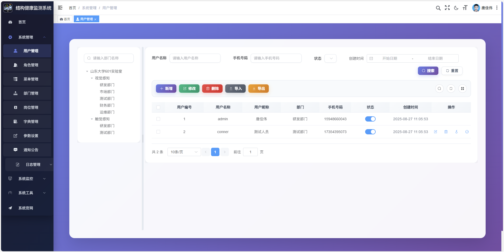

在 `E:\RuoYiProject\MoMagTracker-System\MoMagTracker-Vue3\src\views\system\user\index.vue` 文件中加入下面代码

```java 
<template>
  <div class="user-management">
    <div class="main-card">
      <splitpanes :horizontal="appStore.device === 'mobile'" class="default-theme">
        <!--部门数据-->
        <pane size="16">
          <div class="content-block dept-block">
            <div class="dept-content">
              <div class="search-container">
                <el-input 
                  v-model="deptName" 
                  placeholder="请输入部门名称" 
                  clearable 
                  prefix-icon="Search" 
                  class="tech-input"
                />
              </div>
              <div class="tree-container">
                <el-tree 
                  :data="deptOptions" 
                  :props="{ label: 'label', children: 'children' }" 
                  :expand-on-click-node="false" 
                  :filter-node-method="filterNode" 
                  ref="deptTreeRef" 
                  node-key="id" 
                  highlight-current 
                  default-expand-all 
                  @node-click="handleNodeClick" 
                  class="tech-tree"
                />
              </div>
            </div>
          </div>
        </pane>
        
        <!--用户数据-->
        <pane size="84">
          <div class="content-block user-block">   
            <!-- 搜索区域 -->
            <div class="search-section">
              <el-form :model="queryParams" ref="queryRef" :inline="true" v-show="showSearch" class="search-form">
                <el-form-item label="用户名称" prop="userName">
                  <el-input 
                    v-model="queryParams.userName" 
                    placeholder="请输入用户名称" 
                    clearable 
                    class="tech-input"
                    @keyup.enter="handleQuery" 
                  />
                </el-form-item>
                <el-form-item label="手机号码" prop="phonenumber">
                  <el-input 
                    v-model="queryParams.phonenumber" 
                    placeholder="请输入手机号码" 
                    clearable 
                    class="tech-input"
                    @keyup.enter="handleQuery" 
                  />
                </el-form-item>
                <el-form-item label="状态" prop="status">
                  <el-select 
                    v-model="queryParams.status" 
                    placeholder="用户状态" 
                    clearable 
                    class="tech-select"
                  >
                    <el-option 
                      v-for="dict in sys_normal_disable" 
                      :key="dict.value" 
                      :label="dict.label" 
                      :value="dict.value" 
                    />
                  </el-select>
                </el-form-item>
                <el-form-item label="创建时间" class="date-range">
                  <el-date-picker 
                    v-model="dateRange" 
                    value-format="YYYY-MM-DD" 
                    type="daterange" 
                    range-separator="-" 
                    start-placeholder="开始日期" 
                    end-placeholder="结束日期"
                    class="tech-date-picker"
                  ></el-date-picker>
                </el-form-item>
                <el-form-item class="search-actions">
                  <el-button type="primary" icon="Search" @click="handleQuery" class="tech-btn primary">搜索</el-button>
                  <el-button icon="Refresh" @click="resetQuery" class="tech-btn secondary">重置</el-button>
                </el-form-item>
              </el-form>
            </div>

            <!-- 操作按钮 -->
            <div class="action-section">
              <el-row :gutter="10">
                <el-col :span="1.5">
                  <el-button type="primary" plain icon="Plus" @click="handleAdd" v-hasPermi="['system:user:add']" class="tech-btn primary">新增</el-button>
                </el-col>
                <el-col :span="1.5">
                  <el-button type="success" plain icon="Edit" :disabled="single" @click="handleUpdate" v-hasPermi="['system:user:edit']" class="tech-btn success">修改</el-button>
                </el-col>
                <el-col :span="1.5">
                  <el-button type="danger" plain icon="Delete" :disabled="multiple" @click="handleDelete" v-hasPermi="['system:user:remove']" class="tech-btn danger">删除</el-button>
                </el-col>
                <el-col :span="1.5">
                  <el-button type="info" plain icon="Upload" @click="handleImport" v-hasPermi="['system:user:import']" class="tech-btn info">导入</el-button>
                </el-col>
                <el-col :span="1.5">
                  <el-button type="warning" plain icon="Download" @click="handleExport" v-hasPermi="['system:user:export']" class="tech-btn warning">导出</el-button>
                </el-col>
                <right-toolbar v-model:showSearch="showSearch" @queryTable="getList" :columns="columns" class="right-toolbar"></right-toolbar>
              </el-row>
            </div>

            <!-- 用户表格 -->
            <div class="table-section">
              <el-table 
                v-loading="loading" 
                :data="userList" 
                @selection-change="handleSelectionChange"
                class="tech-table"
              >
                <el-table-column type="selection" width="50" align="center" />
                <el-table-column label="用户编号" align="center" key="userId" prop="userId" v-if="columns.userId.visible" />
                <el-table-column label="用户名称" align="center" key="userName" prop="userName" v-if="columns.userName.visible" :show-overflow-tooltip="true" />
                <el-table-column label="用户昵称" align="center" key="nickName" prop="nickName" v-if="columns.nickName.visible" :show-overflow-tooltip="true" />
                <el-table-column label="部门" align="center" key="deptName" prop="dept.deptName" v-if="columns.deptName.visible" :show-overflow-tooltip="true" />
                <el-table-column label="手机号码" align="center" key="phonenumber" prop="phonenumber" v-if="columns.phonenumber.visible" width="120" />
                <el-table-column label="状态" align="center" key="status" v-if="columns.status.visible">
                  <template #default="scope">
                    <el-switch
                      v-model="scope.row.status"
                      active-value="0"
                      inactive-value="1"
                      @change="handleStatusChange(scope.row)"
                      class="tech-switch"
                    ></el-switch>
                  </template>
                </el-table-column>
                <el-table-column label="创建时间" align="center" prop="createTime" v-if="columns.createTime.visible" width="160">
                  <template #default="scope">
                    <span class="time-text">{{ parseTime(scope.row.createTime) }}</span>
                  </template>
                </el-table-column>
                <el-table-column label="操作" align="center" width="150" class-name="small-padding fixed-width">
                  <template #default="scope">
                    <div class="action-buttons">
                      <el-tooltip content="修改" placement="top" v-if="scope.row.userId !== 1">
                        <el-button link type="primary" icon="Edit" @click="handleUpdate(scope.row)" v-hasPermi="['system:user:edit']" class="action-btn edit"></el-button>
                      </el-tooltip>
                      <el-tooltip content="删除" placement="top" v-if="scope.row.userId !== 1">
                        <el-button link type="primary" icon="Delete" @click="handleDelete(scope.row)" v-hasPermi="['system:user:remove']" class="action-btn delete"></el-button>
                      </el-tooltip>
                      <el-tooltip content="重置密码" placement="top" v-if="scope.row.userId !== 1">
                        <el-button link type="primary" icon="Key" @click="handleResetPwd(scope.row)" v-hasPermi="['system:user:resetPwd']" class="action-btn reset"></el-button>
                      </el-tooltip>
                      <el-tooltip content="分配角色" placement="top" v-if="scope.row.userId !== 1">
                        <el-button link type="primary" icon="CircleCheck" @click="handleAuthRole(scope.row)" v-hasPermi="['system:user:edit']" class="action-btn role"></el-button>
                      </el-tooltip>
                    </div>
                  </template>
                </el-table-column>
              </el-table>
              
              <!-- 分页 -->
              <div class="pagination-section">
                <pagination 
                  v-show="total > 0" 
                  :total="total" 
                  v-model:page="queryParams.pageNum" 
                  v-model:limit="queryParams.pageSize" 
                  @pagination="getList" 
                  class="tech-pagination"
                />
              </div>
            </div>
          </div>
        </pane>
      </splitpanes>
    </div>

    <!-- 添加或修改用户配置对话框 -->
    <el-dialog :title="title" v-model="open" width="600px" append-to-body class="tech-dialog">
      <el-form :model="form" :rules="rules" ref="userRef" label-width="80px" class="tech-form">
        <el-row :gutter="20">
          <el-col :span="12">
            <el-form-item label="用户昵称" prop="nickName">
              <el-input v-model="form.nickName" placeholder="请输入用户昵称" maxlength="30" class="tech-input" />
            </el-form-item>
          </el-col>
          <el-col :span="12">
            <el-form-item label="归属部门" prop="deptId">
              <el-tree-select 
                v-model="form.deptId" 
                :data="enabledDeptOptions" 
                :props="{ value: 'id', label: 'label', children: 'children' }" 
                value-key="id" 
                placeholder="请选择归属部门" 
                clearable 
                check-strictly 
                class="tech-tree-select"
              />
            </el-form-item>
          </el-col>
        </el-row>
        <el-row :gutter="20">
          <el-col :span="12">
            <el-form-item label="手机号码" prop="phonenumber">
              <el-input v-model="form.phonenumber" placeholder="请输入手机号码" maxlength="11" class="tech-input" />
            </el-form-item>
          </el-col>
          <el-col :span="12">
            <el-form-item label="邮箱" prop="email">
              <el-input v-model="form.email" placeholder="请输入邮箱" maxlength="50" class="tech-input" />
            </el-form-item>
          </el-col>
        </el-row>
        <el-row :gutter="20">
          <el-col :span="12">
            <el-form-item v-if="form.userId == undefined" label="用户名称" prop="userName">
              <el-input v-model="form.userName" placeholder="请输入用户名称" maxlength="30" class="tech-input" />
            </el-form-item>
          </el-col>
          <el-col :span="12">
            <el-form-item v-if="form.userId == undefined" label="用户密码" prop="password">
              <el-input v-model="form.password" placeholder="请输入用户密码" type="password" maxlength="20" show-password class="tech-input" />
            </el-form-item>
          </el-col>
        </el-row>
        <el-row :gutter="20">
          <el-col :span="12">
            <el-form-item label="用户性别">
              <el-select v-model="form.sex" placeholder="请选择" class="tech-select">
                <el-option v-for="dict in sys_user_sex" :key="dict.value" :label="dict.label" :value="dict.value"></el-option>
              </el-select>
            </el-form-item>
          </el-col>
          <el-col :span="12">
            <el-form-item label="状态">
              <el-radio-group v-model="form.status" class="tech-radio-group">
                <el-radio v-for="dict in sys_normal_disable" :key="dict.value" :value="dict.value" class="tech-radio">{{ dict.label }}</el-radio>
              </el-radio-group>
            </el-form-item>
          </el-col>
        </el-row>
        <el-row :gutter="20">
          <el-col :span="12">
            <el-form-item label="岗位">
              <el-select v-model="form.postIds" multiple placeholder="请选择" class="tech-select">
                <el-option v-for="item in postOptions" :key="item.postId" :label="item.postName" :value="item.postId" :disabled="item.status == 1"></el-option>
              </el-select>
            </el-form-item>
          </el-col>
          <el-col :span="12">
            <el-form-item label="角色">
              <el-select v-model="form.roleIds" multiple placeholder="请选择" class="tech-select">
                <el-option v-for="item in roleOptions" :key="item.roleId" :label="item.roleName" :value="item.roleId" :disabled="item.status == 1"></el-option>
              </el-select>
            </el-form-item>
          </el-col>
        </el-row>
        <el-row>
          <el-col :span="24">
            <el-form-item label="备注">
              <el-input v-model="form.remark" type="textarea" placeholder="请输入内容" class="tech-textarea"></el-input>
            </el-form-item>
          </el-col>
        </el-row>
      </el-form>
      <template #footer>
        <div class="dialog-footer">
          <el-button type="primary" @click="submitForm" class="tech-btn primary">确 定</el-button>
          <el-button @click="cancel" class="tech-btn secondary">取 消</el-button>
        </div>
      </template>
    </el-dialog>

    <!-- 用户导入对话框 -->
    <el-dialog :title="upload.title" v-model="upload.open" width="400px" append-to-body class="tech-dialog">
      <el-upload 
        ref="uploadRef" 
        :limit="1" 
        accept=".xlsx, .xls" 
        :headers="upload.headers" 
        :action="upload.url + '?updateSupport=' + upload.updateSupport" 
        :disabled="upload.isUploading" 
        :on-progress="handleFileUploadProgress" 
        :on-success="handleFileSuccess" 
        :auto-upload="false" 
        drag
        class="tech-upload"
      >
        <el-icon class="el-icon--upload"><upload-filled /></el-icon>
        <div class="el-upload__text">将文件拖到此处，或<em>点击上传</em></div>
        <template #tip>
          <div class="el-upload__tip text-center">
            <div class="el-upload__tip">
              <el-checkbox v-model="upload.updateSupport" class="tech-checkbox" />是否更新已经存在的用户数据
            </div>
            <span>仅允许导入xls、xlsx格式文件。</span>
            <el-link type="primary" :underline="false" style="font-size: 12px; vertical-align: baseline" @click="importTemplate" class="tech-link">下载模板</el-link>
          </div>
        </template>
      </el-upload>
      <template #footer>
        <div class="dialog-footer">
          <el-button type="primary" @click="submitFileForm" class="tech-btn primary">确 定</el-button>
          <el-button @click="upload.open = false" class="tech-btn secondary">取 消</el-button>
        </div>
      </template>
    </el-dialog>
  </div>
</template>

<script setup name="User">
import { getToken } from "@/utils/auth"
import useAppStore from '@/store/modules/app'
import { changeUserStatus, listUser, resetUserPwd, delUser, getUser, updateUser, addUser, deptTreeSelect } from "@/api/system/user"
import { Splitpanes, Pane } from "splitpanes"
import "splitpanes/dist/splitpanes.css"

const router = useRouter()
const appStore = useAppStore()
const { proxy } = getCurrentInstance()
const { sys_normal_disable, sys_user_sex } = proxy.useDict("sys_normal_disable", "sys_user_sex")

const userList = ref([])
const open = ref(false)
const loading = ref(true)
const showSearch = ref(true)
const ids = ref([])
const single = ref(true)
const multiple = ref(true)
const total = ref(0)
const title = ref("")
const dateRange = ref([])
const deptName = ref("")
const deptOptions = ref(undefined)
const enabledDeptOptions = ref(undefined)
const initPassword = ref(undefined)
const postOptions = ref([])
const roleOptions = ref([])
/*** 用户导入参数 */
const upload = reactive({
  // 是否显示弹出层（用户导入）
  open: false,
  // 弹出层标题（用户导入）
  title: "",
  // 是否禁用上传
  isUploading: false,
  // 是否更新已经存在的用户数据
  updateSupport: 0,
  // 设置上传的请求头部
  headers: { Authorization: "Bearer " + getToken() },
  // 上传的地址
  url: import.meta.env.VITE_APP_BASE_API + "/system/user/importData"
})
// 列显隐信息
const columns = ref({
  userId: { label: '用户编号', visible: true },
  userName: { label: '用户名称', visible: true },
  nickName: { label: '用户昵称', visible: true },
  deptName: { label: '部门', visible: true },
  phonenumber: { label: '手机号码', visible: true },
  status: { label: '状态', visible: true },
  createTime: { label: '创建时间', visible: true }
})

const data = reactive({
  form: {},
  queryParams: {
    pageNum: 1,
    pageSize: 10,
    userName: undefined,
    phonenumber: undefined,
    status: undefined,
    deptId: undefined
  },
  rules: {
    userName: [{ required: true, message: "用户名称不能为空", trigger: "blur" }, { min: 2, max: 20, message: "用户名称长度必须介于 2 和 20 之间", trigger: "blur" }],
    nickName: [{ required: true, message: "用户昵称不能为空", trigger: "blur" }],
    password: [{ required: true, message: "用户密码不能为空", trigger: "blur" }, { min: 5, max: 20, message: "用户密码长度必须介于 5 和 20 之间", trigger: "blur" }, { pattern: /^[^<>"'|\\]+$/, message: "不能包含非法字符：< > \" ' \\\ |", trigger: "blur" }],
    email: [{ type: "email", message: "请输入正确的邮箱地址", trigger: ["blur", "change"] }],
    phonenumber: [{ pattern: /^1[3|4|5|6|7|8|9][0-9]\d{8}$/, message: "请输入正确的手机号码", trigger: "blur" }]
  }
})

const { queryParams, form, rules } = toRefs(data)

/** 通过条件过滤节点  */
const filterNode = (value, data) => {
  if (!value) return true
  return data.label.indexOf(value) !== -1
}

/** 根据名称筛选部门树 */
watch(deptName, val => {
  proxy.$refs["deptTreeRef"].filter(val)
})

/** 查询用户列表 */
function getList() {
  loading.value = true
  listUser(proxy.addDateRange(queryParams.value, dateRange.value)).then(res => {
    loading.value = false
    userList.value = res.rows
    total.value = res.total
  })
}

/** 查询部门下拉树结构 */
function getDeptTree() {
  deptTreeSelect().then(response => {
    deptOptions.value = response.data
    enabledDeptOptions.value = filterDisabledDept(JSON.parse(JSON.stringify(response.data)))
  })
}

/** 过滤禁用的部门 */
function filterDisabledDept(deptList) {
  return deptList.filter(dept => {
    if (dept.disabled) {
      return false
    }
    if (dept.children && dept.children.length) {
      dept.children = filterDisabledDept(dept.children)
    }
    return true
  })
}

/** 节点单击事件 */
function handleNodeClick(data) {
  queryParams.value.deptId = data.id
  handleQuery()
}

/** 搜索按钮操作 */
function handleQuery() {
  queryParams.value.pageNum = 1
  getList()
}

/** 重置按钮操作 */
function resetQuery() {
  dateRange.value = []
  proxy.resetForm("queryRef")
  queryParams.value.deptId = undefined
  proxy.$refs.deptTreeRef.setCurrentKey(null)
  handleQuery()
}

/** 删除按钮操作 */
function handleDelete(row) {
  const userIds = row.userId || ids.value
  proxy.$modal.confirm('是否确认删除用户编号为"' + userIds + '"的数据项？').then(function () {
    return delUser(userIds)
  }).then(() => {
    getList()
    proxy.$modal.msgSuccess("删除成功")
  }).catch(() => {})
}

/** 导出按钮操作 */
function handleExport() {
  proxy.download("system/user/export", {
    ...queryParams.value,
  },`user_${new Date().getTime()}.xlsx`)
}

/** 用户状态修改  */
function handleStatusChange(row) {
  let text = row.status === "0" ? "启用" : "停用"
  proxy.$modal.confirm('确认要"' + text + '""' + row.userName + '"用户吗?').then(function () {
    return changeUserStatus(row.userId, row.status)
  }).then(() => {
    proxy.$modal.msgSuccess(text + "成功")
  }).catch(function () {
    row.status = row.status === "0" ? "1" : "0"
  })
}

/** 更多操作 */
function handleCommand(command, row) {
  switch (command) {
    case "handleResetPwd":
      handleResetPwd(row)
      break
    case "handleAuthRole":
      handleAuthRole(row)
      break
    default:
      break
  }
}

/** 跳转角色分配 */
function handleAuthRole(row) {
  const userId = row.userId
  router.push("/system/user-auth/role/" + userId)
}

/** 重置密码按钮操作 */
function handleResetPwd(row) {
  proxy.$prompt('请输入"' + row.userName + '"的新密码', "提示", {
    confirmButtonText: "确定",
    cancelButtonText: "取消",
    closeOnClickModal: false,
    inputPattern: /^.{5,20}$/,
    inputErrorMessage: "用户密码长度必须介于 5 和 20 之间",
    inputValidator: (value) => {
      if (/<|>|"|'|\||\\/.test(value)) {
        return "不能包含非法字符：< > \" ' \\\ |"
      }
    },
  }).then(({ value }) => {
    resetUserPwd(row.userId, value).then(response => {
      proxy.$modal.msgSuccess("修改成功，新密码是：" + value)
    })
  }).catch(() => {})
}

/** 选择条数  */
function handleSelectionChange(selection) {
  ids.value = selection.map(item => item.userId)
  single.value = selection.length != 1
  multiple.value = !selection.length
}

/** 导入按钮操作 */
function handleImport() {
  upload.title = "用户导入"
  upload.open = true
}

/** 下载模板操作 */
function importTemplate() {
  proxy.download("system/user/importTemplate", {
  }, `user_template_${new Date().getTime()}.xlsx`)
}

/**文件上传中处理 */
const handleFileUploadProgress = (event, file, fileList) => {
  upload.isUploading = true
}

/** 文件上传成功处理 */
const handleFileSuccess = (response, file, fileList) => {
  upload.open = false
  upload.isUploading = false
  proxy.$refs["uploadRef"].handleRemove(file)
  proxy.$alert("<div style='overflow: auto;overflow-x: hidden;max-height: 70vh;padding: 10px 20px 0;'>" + response.msg + "</div>", "导入结果", { dangerouslyUseHTMLString: true })
  getList()
}

/** 提交上传文件 */
function submitFileForm() {
  proxy.$refs["uploadRef"].submit()
}

/** 重置操作表单 */
function reset() {
  form.value = {
    userId: undefined,
    deptId: undefined,
    userName: undefined,
    nickName: undefined,
    password: undefined,
    phonenumber: undefined,
    email: undefined,
    sex: undefined,
    status: "0",
    remark: undefined,
    postIds: [],
    roleIds: []
  }
  proxy.resetForm("userRef")
}

/** 取消按钮 */
function cancel() {
  open.value = false
  reset()
}

/** 新增按钮操作 */
function handleAdd() {
  reset()
  getUser().then(response => {
    postOptions.value = response.posts
    roleOptions.value = response.roles
    open.value = true
    title.value = "添加用户"
    form.value.password = initPassword.value
  })
}

/** 修改按钮操作 */
function handleUpdate(row) {
  reset()
  const userId = row.userId || ids.value
  getUser(userId).then(response => {
    form.value = response.data
    postOptions.value = response.posts
    roleOptions.value = response.roles
    form.value.postIds = response.postIds
    form.value.roleIds = response.roleIds
    open.value = true
    title.value = "修改用户"
    form.password = ""
  })
}

/** 提交按钮 */
function submitForm() {
  proxy.$refs["userRef"].validate(valid => {
    if (valid) {
      if (form.value.userId != undefined) {
        updateUser(form.value).then(response => {
          proxy.$modal.msgSuccess("修改成功")
          open.value = false
          getList()
        })
      } else {
        addUser(form.value).then(response => {
          proxy.$modal.msgSuccess("新增成功")
          open.value = false
          getList()
        })
      }
    }
  })
}

onMounted(() => {
  getDeptTree()
  getList()
  proxy.getConfigKey("sys.user.initPassword").then(response => {
    initPassword.value = response.msg
  })
})
</script>

<style scoped lang="scss">
.user-management {
  font-family: "Inter", "Helvetica Neue", Helvetica, "PingFang SC", "Hiragino Sans GB", "Microsoft YaHei", Arial, sans-serif;
  color: #2c3e50;
  background: linear-gradient(135deg, #667eea 0%, #764ba2 100%);
  min-height: 100vh;
  padding: 40px;
  display: flex;
  align-items: flex-start;
  justify-content: center;

  .main-card {
    background: rgba(255, 255, 255, 0.95);
    border-radius: 20px;
    box-shadow: 0 20px 60px rgba(0, 0, 0, 0.15);
    backdrop-filter: blur(20px);
    width: 100%;
    max-width: 1600px;
    padding: 30px;
    margin: 20px;
    min-height: auto;
    height: auto; 

    :deep(.splitpanes) {
      min-height: 700px;

      .splitpanes__pane {
        background: transparent;
      }
      
      .splitpanes__splitter {
        background: #e2e8f0;
        border-radius: 4px;
        margin: 0 5px;
        
        &:hover {
          background: #667eea;
        }
      }
    }

    .content-block {
      background: white;
      border-radius: 16px;
      padding: 25px;
      box-shadow: 0 4px 20px rgba(0, 0, 0, 0.08);
      border: 1px solid #f1f5f9;
      transition: all 0.3s ease;
      height: 100%;

      &:hover {
        transform: translateY(-3px);
        box-shadow: 0 8px 30px rgba(0, 0, 0, 0.12);
      }

      .block-title {
        display: flex;
        align-items: center;
        gap: 10px;
        font-size: 1.3rem;
        font-weight: 700;
        color: #1e293b;
        margin-bottom: 20px;
        padding-bottom: 15px;
        border-bottom: 2px solid #f1f5f9;

        i {
          color: #667eea;
          font-size: 1.4rem;
        }
      }
    }

    // 部门区块样式
    .dept-block {
      .dept-content {
        .search-container {
          margin-bottom: 20px;
        }

        .tree-container {
          max-height: 600px;
          overflow-y: auto;
        }
      }
    }

    // 用户管理区块样式
    .user-block {
      .search-section {
        margin-bottom: 20px;
        
        .search-form {
          display: flex;
          flex-wrap: wrap;
          gap: 15px;
          align-items: flex-end;

          .el-form-item {
            margin-bottom: 0;
          }

          .date-range {
            min-width: 240px;
          }

          .search-actions {
            margin-left: auto;
          }
        }
      }

      .action-section {
        margin-bottom: 20px;
        padding: 15px;
        background: #f8fafc;
        border-radius: 12px;
        border: 1px solid #e2e8f0;

        .right-toolbar {
          margin-left: auto;
        }
      }

      .table-section {
        .pagination-section {
          margin-top: 20px;
          padding-top: 15px;
          border-top: 1px solid #e2e8f0;
        }
      }
    }
  }

  // 科技感组件样式
  .tech-input {
    :deep(.el-input__wrapper) {
      border-radius: 8px;
      border: 1px solid #e2e8f0;
      transition: all 0.3s ease;
      box-shadow: 0 1px 3px rgba(0, 0, 0, 0.05);
      
      &:hover {
        border-color: #667eea;
        box-shadow: 0 2px 8px rgba(102, 126, 234, 0.1);
      }
      
      &.is-focus {
        border-color: #667eea;
        box-shadow: 0 0 0 2px rgba(102, 126, 234, 0.1);
      }
    }
  }

  .tech-select {
    :deep(.el-select__wrapper) {
      border-radius: 8px;
      border: 1px solid #e2e8f0;
      transition: all 0.3s ease;
      box-shadow: 0 1px 3px rgba(0, 0, 0, 0.05);
      
      &:hover {
        border-color: #667eea;
      }
    }
  }

  .tech-date-picker {
    :deep(.el-input__wrapper) {
      border-radius: 8px;
      border: 1px solid #e2e8f0;
      transition: all 0.3s ease;
      
      &:hover {
        border-color: #667eea;
      }
    }
  }

  .tech-btn {
    border-radius: 8px;
    font-weight: 600;
    transition: all 0.3s ease;
    border: none;
    
    &.primary {
      background: linear-gradient(135deg, #667eea 0%, #764ba2 100%);
      color: white;
      box-shadow: 0 4px 15px rgba(102, 126, 234, 0.3);

      &:hover {
        transform: translateY(-2px);
        box-shadow: 0 8px 25px rgba(102, 126, 234, 0.4);
      }
    }

    &.secondary {
      background: white;
      border: 1px solid #e2e8f0;
      color: #475569;
      box-shadow: 0 2px 6px rgba(0, 0, 0, 0.05);

      &:hover {
        transform: translateY(-2px);
        border-color: #667eea;
        color: #667eea;
        box-shadow: 0 4px 12px rgba(0, 0, 0, 0.1);
      }
    }

    &.success {
      background: linear-gradient(135deg, #10b981 0%, #059669 100%);
      color: white;
      box-shadow: 0 4px 15px rgba(16, 185, 129, 0.3);

      &:hover {
        transform: translateY(-2px);
        box-shadow: 0 8px 25px rgba(16, 185, 129, 0.4);
      }
    }

    &.danger {
      background: linear-gradient(135deg, #ef4444 0%, #dc2626 100%);
      color: white;
      box-shadow: 0 4px 15px rgba(239, 68, 68, 0.3);

      &:hover {
        transform: translateY(-2px);
        box-shadow: 0 8px 25px rgba(239, 68, 68, 0.4);
      }
    }

    &.warning {
      background: linear-gradient(135deg, #f59e0b 0%, #d97706 100%);
      color: white;
      box-shadow: 0 4px 15px rgba(245, 158, 11, 0.3);

      &:hover {
        transform: translateY(-2px);
        box-shadow: 0 8px 25px rgba(245, 158, 11, 0.4);
      }
    }

    &.info {
      background: linear-gradient(135deg, #6b7280 0%, #4b5563 100%);
      color: white;
      box-shadow: 0 4px 15px rgba(107, 114, 128, 0.3);

      &:hover {
        transform: translateY(-2px);
        box-shadow: 0 8px 25px rgba(107, 114, 128, 0.4);
      }
    }
  }

  .tech-table {
    :deep(.el-table__header) {
      th {
        background: linear-gradient(135deg, #f8fafc 0%, #f1f5f9 100%);
        color: #374151;
        font-weight: 600;
      }
    }

    :deep(.el-table__row) {
      transition: all 0.3s ease;
      
      &:hover {
        transform: translateY(-1px);
        box-shadow: 0 2px 8px rgba(0, 0, 0, 0.1);
      }
    }
  }

  .tech-switch {
    :deep(.el-switch__core) {
      border-radius: 12px;
    }
  }

  .action-buttons {
    display: flex;
    justify-content: center;
    gap: 8px;

    .action-btn {
      width: 32px;
      height: 32px;
      border-radius: 6px;
      display: flex;
      align-items: center;
      justify-content: center;
      transition: all 0.3s ease;

      &:hover {
        transform: scale(1.1);
        background: #f1f5f9;
      }
    }
  }

  .time-text {
    color: #6b7280;
    font-size: 0.9rem;
  }

  .tech-dialog {
    :deep(.el-dialog) {
      border-radius: 16px;
      box-shadow: 0 20px 60px rgba(0, 0, 0, 0.2);
      
      .el-dialog__header {
        border-bottom: 1px solid #e2e8f0;
        margin-right: 0;
        
        .el-dialog__title {
          font-weight: 700;
          color: #1e293b;
        }
      }
      
      .el-dialog__body {
        padding: 20px;
      }
    }
  }

  .tech-form {
    .el-form-item {
      margin-bottom: 20px;
    }
    
    .el-form-item__label {
      font-weight: 600;
      color: #374151;
    }
  }

  .tech-tree-select {
    :deep(.el-select__wrapper) {
      border-radius: 8px;
    }
  }

  .tech-radio-group {
    :deep(.el-radio) {
      margin-right: 20px;
    }
  }

  .tech-textarea {
    :deep(.el-textarea__inner) {
      border-radius: 8px;
      border: 1px solid #e2e8f0;
      transition: all 0.3s ease;
      
      &:focus {
        border-color: #667eea;
        box-shadow: 0 0 0 2px rgba(102, 126, 234, 0.1);
      }
    }
  }

  .tech-upload {
    :deep(.el-upload-dragger) {
      border-radius: 12px;
      border: 2px dashed #e2e8f0;
      transition: all 0.3s ease;
      
      &:hover {
        border-color: #667eea;
      }
    }
  }

  .tech-checkbox {
    :deep(.el-checkbox__input.is-checked .el-checkbox__inner) {
      background: linear-gradient(135deg, #667eea 0%, #764ba2 100%);
      border-color: #667eea;
    }
  }

  .tech-link {
    color: #667eea;
    font-weight: 500;
  }

  .tech-pagination {
    :deep(.el-pagination) {
      .btn-prev, .btn-next, .number, .more {
        border-radius: 6px;
        margin: 0 2px;
      }
      
      .number.active {
        background: linear-gradient(135deg, #667eea 0%, #764ba2 100%);
        color: white;
        border: none;
      }
    }
  }
}

// 响应式设计
@media (max-width: 1024px) {
  .user-management {
    .main-card {
      padding: 25px;
      margin: 15px;
    }
  }
}

@media (max-width: 768px) {
  .user-management {
    padding: 15px;

    .main-card {
      padding: 20px;

      .content-block {
        padding: 20px;
      }

      .user-block {
        .search-section {
          .search-form {
            flex-direction: column;
            align-items: stretch;
            
            .search-actions {
              margin-left: 0;
              text-align: center;
            }
          }
        }
      }
    }
  }
}

@media (max-width: 480px) {
  .user-management {
    padding: 10px;

    .main-card {
      padding: 15px;
      margin: 10px;

      .content-block {
        padding: 15px;
      }
    }
  }
}
</style>
```

#### 2.3.4.2 角色管理（/role/index.vue）

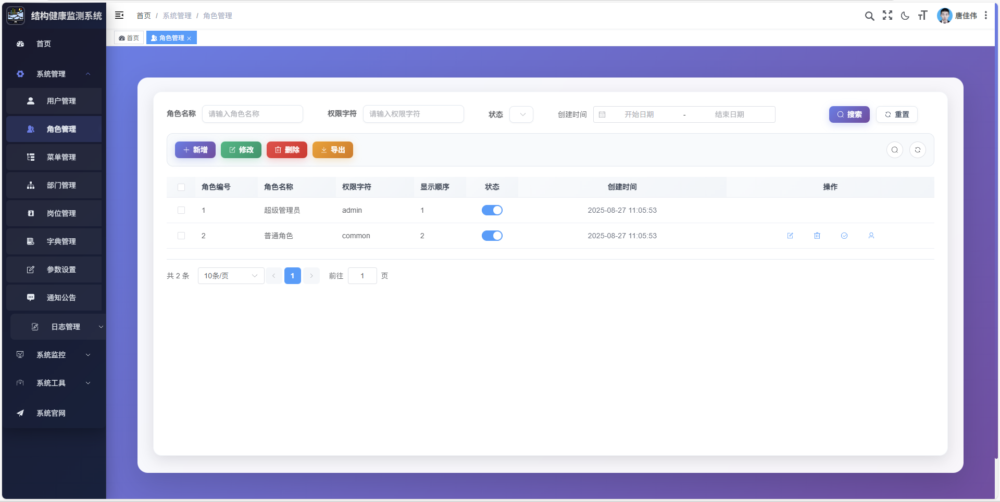

在 `E:\RuoYiProject\MoMagTracker-System\MoMagTracker-Vue3\src\views\system\role\index.vue` 文件中加入下述代码

```java
<template>
   <div class="role-management">
      <div class="main-card">
         <div class="content-block">
            <!-- 搜索区域 -->
            <div class="search-section">
               <el-form :model="queryParams" ref="queryRef" v-show="showSearch" :inline="true" class="search-form">
                  <el-form-item label="角色名称" prop="roleName">
                     <el-input
                        v-model="queryParams.roleName"
                        placeholder="请输入角色名称"
                        clearable
                        class="tech-input"
                        @keyup.enter="handleQuery"
                     />
                  </el-form-item>
                  <el-form-item label="权限字符" prop="roleKey">
                     <el-input
                        v-model="queryParams.roleKey"
                        placeholder="请输入权限字符"
                        clearable
                        class="tech-input"
                        @keyup.enter="handleQuery"
                     />
                  </el-form-item>
                  <el-form-item label="状态" prop="status">
                     <el-select
                        v-model="queryParams.status"
                        placeholder="角色状态"
                        clearable
                        class="tech-select"
                     >
                        <el-option
                           v-for="dict in sys_normal_disable"
                           :key="dict.value"
                           :label="dict.label"
                           :value="dict.value"
                        />
                     </el-select>
                  </el-form-item>
                  <el-form-item label="创建时间" class="date-range">
                     <el-date-picker
                        v-model="dateRange"
                        value-format="YYYY-MM-DD"
                        type="daterange"
                        range-separator="-"
                        start-placeholder="开始日期"
                        end-placeholder="结束日期"
                        class="tech-date-picker"
                     ></el-date-picker>
                  </el-form-item>
                  <el-form-item class="search-actions">
                     <el-button type="primary" icon="Search" @click="handleQuery" class="tech-btn primary">搜索</el-button>
                     <el-button icon="Refresh" @click="resetQuery" class="tech-btn secondary">重置</el-button>
                  </el-form-item>
               </el-form>
            </div>

            <!-- 操作按钮区域 -->
            <div class="action-section">
               <el-row :gutter="10">
                  <el-col :span="1.5">
                     <el-button
                        type="primary"
                        plain
                        icon="Plus"
                        @click="handleAdd"
                        v-hasPermi="['system:role:add']"
                        class="tech-btn primary"
                     >新增</el-button>
                  </el-col>
                  <el-col :span="1.5">
                     <el-button
                        type="success"
                        plain
                        icon="Edit"
                        :disabled="single"
                        @click="handleUpdate"
                        v-hasPermi="['system:role:edit']"
                        class="tech-btn success"
                     >修改</el-button>
                  </el-col>
                  <el-col :span="1.5">
                     <el-button
                        type="danger"
                        plain
                        icon="Delete"
                        :disabled="multiple"
                        @click="handleDelete"
                        v-hasPermi="['system:role:remove']"
                        class="tech-btn danger"
                     >删除</el-button>
                  </el-col>
                  <el-col :span="1.5">
                     <el-button
                        type="warning"
                        plain
                        icon="Download"
                        @click="handleExport"
                        v-hasPermi="['system:role:export']"
                        class="tech-btn warning"
                     >导出</el-button>
                  </el-col>
                  <right-toolbar v-model:showSearch="showSearch" @queryTable="getList" class="right-toolbar"></right-toolbar>
               </el-row>
            </div>

            <!-- 表格区域 -->
            <div class="table-section">
               <el-table v-loading="loading" :data="roleList" @selection-change="handleSelectionChange" class="tech-table">
                  <el-table-column type="selection" width="55" align="center" />
                  <el-table-column label="角色编号" prop="roleId" width="120" />
                  <el-table-column label="角色名称" prop="roleName" :show-overflow-tooltip="true" width="150" />
                  <el-table-column label="权限字符" prop="roleKey" :show-overflow-tooltip="true" width="150" />
                  <el-table-column label="显示顺序" prop="roleSort" width="100" />
                  <el-table-column label="状态" align="center" width="100">
                     <template #default="scope">
                        <el-switch
                           v-model="scope.row.status"
                           active-value="0"
                           inactive-value="1"
                           @change="handleStatusChange(scope.row)"
                           class="tech-switch"
                        ></el-switch>
                     </template>
                  </el-table-column>
                  <el-table-column label="创建时间" align="center" prop="createTime">
                     <template #default="scope">
                        <span class="time-text">{{ parseTime(scope.row.createTime) }}</span>
                     </template>
                  </el-table-column>
                  <el-table-column label="操作" align="center" class-name="small-padding fixed-width">
                     <template #default="scope">
                       <div class="action-buttons">
                         <el-tooltip content="修改" placement="top" v-if="scope.row.roleId !== 1">
                           <el-button link type="primary" icon="Edit" @click="handleUpdate(scope.row)" v-hasPermi="['system:role:edit']" class="action-btn edit"></el-button>
                         </el-tooltip>
                         <el-tooltip content="删除" placement="top" v-if="scope.row.roleId !== 1">
                           <el-button link type="primary" icon="Delete" @click="handleDelete(scope.row)" v-hasPermi="['system:role:remove']" class="action-btn delete"></el-button>
                         </el-tooltip>
                         <el-tooltip content="数据权限" placement="top" v-if="scope.row.roleId !== 1">
                           <el-button link type="primary" icon="CircleCheck" @click="handleDataScope(scope.row)" v-hasPermi="['system:role:edit']" class="action-btn data"></el-button>
                         </el-tooltip>
                         <el-tooltip content="分配用户" placement="top" v-if="scope.row.roleId !== 1">
                           <el-button link type="primary" icon="User" @click="handleAuthUser(scope.row)" v-hasPermi="['system:role:edit']" class="action-btn user"></el-button>
                         </el-tooltip>
                       </div>
                     </template>
                  </el-table-column>
               </el-table>

               <!-- 分页 -->
               <div class="pagination-section">
                  <pagination
                     v-show="total > 0"
                     :total="total"
                     v-model:page="queryParams.pageNum"
                     v-model:limit="queryParams.pageSize"
                     @pagination="getList"
                     class="tech-pagination"
                  />
               </div>
            </div>
         </div>
      </div>

      <!-- 添加或修改角色配置对话框 -->
      <el-dialog :title="title" v-model="open" width="500px" append-to-body class="tech-dialog">
         <el-form ref="roleRef" :model="form" :rules="rules" label-width="100px" class="tech-form">
            <el-form-item label="角色名称" prop="roleName">
               <el-input v-model="form.roleName" placeholder="请输入角色名称" class="tech-input" />
            </el-form-item>
            <el-form-item prop="roleKey">
               <template #label>
                  <span class="label-with-tooltip">
                     <el-tooltip content="控制器中定义的权限字符，如：@PreAuthorize(`@ss.hasRole('admin')`)" placement="top">
                        <el-icon><question-filled /></el-icon>
                     </el-tooltip>
                     权限字符
                  </span>
               </template>
               <el-input v-model="form.roleKey" placeholder="请输入权限字符" class="tech-input" />
            </el-form-item>
            <el-form-item label="角色顺序" prop="roleSort">
               <el-input-number v-model="form.roleSort" controls-position="right" :min="0" class="tech-input-number" />
            </el-form-item>
            <el-form-item label="状态">
               <el-radio-group v-model="form.status" class="tech-radio-group">
                  <el-radio
                     v-for="dict in sys_normal_disable"
                     :key="dict.value"
                     :value="dict.value"
                     class="tech-radio"
                  >{{ dict.label }}</el-radio>
               </el-radio-group>
            </el-form-item>
            <el-form-item label="菜单权限">
               <div class="checkbox-group">
                  <el-checkbox v-model="menuExpand" @change="handleCheckedTreeExpand($event, 'menu')" class="tech-checkbox">展开/折叠</el-checkbox>
                  <el-checkbox v-model="menuNodeAll" @change="handleCheckedTreeNodeAll($event, 'menu')" class="tech-checkbox">全选/全不选</el-checkbox>
                  <el-checkbox v-model="form.menuCheckStrictly" @change="handleCheckedTreeConnect($event, 'menu')" class="tech-checkbox">父子联动</el-checkbox>
               </div>
               <el-tree
                  class="tech-tree tree-border"
                  :data="menuOptions"
                  show-checkbox
                  ref="menuRef"
                  node-key="id"
                  :check-strictly="!form.menuCheckStrictly"
                  empty-text="加载中，请稍候"
                  :props="{ label: 'label', children: 'children' }"
               ></el-tree>
            </el-form-item>
            <el-form-item label="备注">
               <el-input v-model="form.remark" type="textarea" placeholder="请输入内容" class="tech-textarea"></el-input>
            </el-form-item>
         </el-form>
         <template #footer>
            <div class="dialog-footer">
               <el-button type="primary" @click="submitForm" class="tech-btn primary">确 定</el-button>
               <el-button @click="cancel" class="tech-btn secondary">取 消</el-button>
            </div>
         </template>
      </el-dialog>

      <!-- 分配角色数据权限对话框 -->
      <el-dialog :title="title" v-model="openDataScope" width="500px" append-to-body class="tech-dialog">
         <el-form :model="form" label-width="80px" class="tech-form">
            <el-form-item label="角色名称">
               <el-input v-model="form.roleName" :disabled="true" class="tech-input" />
            </el-form-item>
            <el-form-item label="权限字符">
               <el-input v-model="form.roleKey" :disabled="true" class="tech-input" />
            </el-form-item>
            <el-form-item label="权限范围">
               <el-select v-model="form.dataScope" @change="dataScopeSelectChange" class="tech-select">
                  <el-option
                     v-for="item in dataScopeOptions"
                     :key="item.value"
                     :label="item.label"
                     :value="item.value"
                  ></el-option>
               </el-select>
            </el-form-item>
            <el-form-item label="数据权限" v-show="form.dataScope == 2">
               <div class="checkbox-group">
                  <el-checkbox v-model="deptExpand" @change="handleCheckedTreeExpand($event, 'dept')" class="tech-checkbox">展开/折叠</el-checkbox>
                  <el-checkbox v-model="deptNodeAll" @change="handleCheckedTreeNodeAll($event, 'dept')" class="tech-checkbox">全选/全不选</el-checkbox>
                  <el-checkbox v-model="form.deptCheckStrictly" @change="handleCheckedTreeConnect($event, 'dept')" class="tech-checkbox">父子联动</el-checkbox>
               </div>
               <el-tree
                  class="tech-tree tree-border"
                  :data="deptOptions"
                  show-checkbox
                  default-expand-all
                  ref="deptRef"
                  node-key="id"
                  :check-strictly="!form.deptCheckStrictly"
                  empty-text="加载中，请稍候"
                  :props="{ label: 'label', children: 'children' }"
               ></el-tree>
            </el-form-item>
         </el-form>
         <template #footer>
            <div class="dialog-footer">
               <el-button type="primary" @click="submitDataScope" class="tech-btn primary">确 定</el-button>
               <el-button @click="cancelDataScope" class="tech-btn secondary">取 消</el-button>
            </div>
         </template>
      </el-dialog>
   </div>
</template>

<script setup name="Role">
import { addRole, changeRoleStatus, dataScope, delRole, getRole, listRole, updateRole, deptTreeSelect } from "@/api/system/role"
import { roleMenuTreeselect, treeselect as menuTreeselect } from "@/api/system/menu"

const router = useRouter()
const { proxy } = getCurrentInstance()
const { sys_normal_disable } = proxy.useDict("sys_normal_disable")

const roleList = ref([])
const open = ref(false)
const loading = ref(true)
const showSearch = ref(true)
const ids = ref([])
const single = ref(true)
const multiple = ref(true)
const total = ref(0)
const title = ref("")
const dateRange = ref([])
const menuOptions = ref([])
const menuExpand = ref(false)
const menuNodeAll = ref(false)
const deptExpand = ref(true)
const deptNodeAll = ref(false)
const deptOptions = ref([])
const openDataScope = ref(false)
const menuRef = ref(null)
const deptRef = ref(null)

/** 数据范围选项*/
const dataScopeOptions = ref([
  { value: "1", label: "全部数据权限" },
  { value: "2", label: "自定数据权限" },
  { value: "3", label: "本部门数据权限" },
  { value: "4", label: "本部门及以下数据权限" },
  { value: "5", label: "仅本人数据权限" }
])

const data = reactive({
  form: {},
  queryParams: {
    pageNum: 1,
    pageSize: 10,
    roleName: undefined,
    roleKey: undefined,
    status: undefined
  },
  rules: {
    roleName: [{ required: true, message: "角色名称不能为空", trigger: "blur" }],
    roleKey: [{ required: true, message: "权限字符不能为空", trigger: "blur" }],
    roleSort: [{ required: true, message: "角色顺序不能为空", trigger: "blur" }]
  },
})

const { queryParams, form, rules } = toRefs(data)

/** 查询角色列表 */
function getList() {
  loading.value = true
  listRole(proxy.addDateRange(queryParams.value, dateRange.value)).then(response => {
    roleList.value = response.rows
    total.value = response.total
    loading.value = false
  })
}

/** 搜索按钮操作 */
function handleQuery() {
  queryParams.value.pageNum = 1
  getList()
}

/** 重置按钮操作 */
function resetQuery() {
  dateRange.value = []
  proxy.resetForm("queryRef")
  handleQuery()
}

/** 删除按钮操作 */
function handleDelete(row) {
  const roleIds = row.roleId || ids.value
  proxy.$modal.confirm('是否确认删除角色编号为"' + roleIds + '"的数据项?').then(function () {
    return delRole(roleIds)
  }).then(() => {
    getList()
    proxy.$modal.msgSuccess("删除成功")
  }).catch(() => {})
}

/** 导出按钮操作 */
function handleExport() {
  proxy.download("system/role/export", {
    ...queryParams.value,
  }, `role_${new Date().getTime()}.xlsx`)
}

/** 多选框选中数据 */
function handleSelectionChange(selection) {
  ids.value = selection.map(item => item.roleId)
  single.value = selection.length != 1
  multiple.value = !selection.length
}

/** 角色状态修改 */
function handleStatusChange(row) {
  let text = row.status === "0" ? "启用" : "停用"
  proxy.$modal.confirm('确认要"' + text + '""' + row.roleName + '"角色吗?').then(function () {
    return changeRoleStatus(row.roleId, row.status)
  }).then(() => {
    proxy.$modal.msgSuccess(text + "成功")
  }).catch(function () {
    row.status = row.status === "0" ? "1" : "0"
  })
}

/** 更多操作 */
function handleCommand(command, row) {
  switch (command) {
    case "handleDataScope":
      handleDataScope(row)
      break
    case "handleAuthUser":
      handleAuthUser(row)
      break
    default:
      break
  }
}

/** 分配用户 */
function handleAuthUser(row) {
  router.push("/system/role-auth/user/" + row.roleId)
}

/** 查询菜单树结构 */
function getMenuTreeselect() {
  menuTreeselect().then(response => {
    menuOptions.value = response.data
  })
}

/** 所有部门节点数据 */
function getDeptAllCheckedKeys() {
  // 目前被选中的部门节点
  let checkedKeys = deptRef.value.getCheckedKeys()
  // 半选中的部门节点
  let halfCheckedKeys = deptRef.value.getHalfCheckedKeys()
  checkedKeys.unshift.apply(checkedKeys, halfCheckedKeys)
  return checkedKeys
}

/** 重置新增的表单以及其他数据  */
function reset() {
  if (menuRef.value != undefined) {
    menuRef.value.setCheckedKeys([])
  }
  menuExpand.value = false
  menuNodeAll.value = false
  deptExpand.value = true
  deptNodeAll.value = false
  form.value = {
    roleId: undefined,
    roleName: undefined,
    roleKey: undefined,
    roleSort: 0,
    status: "0",
    menuIds: [],
    deptIds: [],
    menuCheckStrictly: true,
    deptCheckStrictly: true,
    remark: undefined
  }
  proxy.resetForm("roleRef")
}

/** 添加角色 */
function handleAdd() {
  reset()
  getMenuTreeselect()
  open.value = true
  title.value = "添加角色"
}

/** 修改角色 */
function handleUpdate(row) {
  reset()
  const roleId = row.roleId || ids.value
  const roleMenu = getRoleMenuTreeselect(roleId)
  getRole(roleId).then(response => {
    form.value = response.data
    form.value.roleSort = Number(form.value.roleSort)
    open.value = true
    nextTick(() => {
      roleMenu.then((res) => {
        let checkedKeys = res.checkedKeys
        checkedKeys.forEach((v) => {
          nextTick(() => {
            menuRef.value.setChecked(v, true, false)
          })
        })
      })
    })
  })
  title.value = "修改角色"
}

/** 根据角色ID查询菜单树结构 */
function getRoleMenuTreeselect(roleId) {
  return roleMenuTreeselect(roleId).then(response => {
    menuOptions.value = response.menus
    return response
  })
}

/** 根据角色ID查询部门树结构 */
function getDeptTree(roleId) {
  return deptTreeSelect(roleId).then(response => {
    deptOptions.value = response.depts
    return response
  })
}

/** 树权限（展开/折叠）*/
function handleCheckedTreeExpand(value, type) {
  if (type == "menu") {
    let treeList = menuOptions.value
    for (let i = 0; i < treeList.length; i++) {
      menuRef.value.store.nodesMap[treeList[i].id].expanded = value
    }
  } else if (type == "dept") {
    let treeList = deptOptions.value
    for (let i = 0; i < treeList.length; i++) {
      deptRef.value.store.nodesMap[treeList[i].id].expanded = value
    }
  }
}

/** 树权限（全选/全不选） */
function handleCheckedTreeNodeAll(value, type) {
  if (type == "menu") {
    menuRef.value.setCheckedNodes(value ? menuOptions.value : [])
  } else if (type == "dept") {
    deptRef.value.setCheckedNodes(value ? deptOptions.value : [])
  }
}

/** 树权限（父子联动） */
function handleCheckedTreeConnect(value, type) {
  if (type == "menu") {
    form.value.menuCheckStrictly = value ? true : false
  } else if (type == "dept") {
    form.value.deptCheckStrictly = value ? true : false
  }
}

/** 所有菜单节点数据 */
function getMenuAllCheckedKeys() {
  // 目前被选中的菜单节点
  let checkedKeys = menuRef.value.getCheckedKeys()
  // 半选中的菜单节点
  let halfCheckedKeys = menuRef.value.getHalfCheckedKeys()
  checkedKeys.unshift.apply(checkedKeys, halfCheckedKeys)
  return checkedKeys
}

/** 提交按钮 */
function submitForm() {
  proxy.$refs["roleRef"].validate(valid => {
    if (valid) {
      if (form.value.roleId != undefined) {
        form.value.menuIds = getMenuAllCheckedKeys()
        updateRole(form.value).then(response => {
          proxy.$modal.msgSuccess("修改成功")
          open.value = false
          getList()
        })
      } else {
        form.value.menuIds = getMenuAllCheckedKeys()
        addRole(form.value).then(response => {
          proxy.$modal.msgSuccess("新增成功")
          open.value = false
          getList()
        })
      }
    }
  })
}

/** 取消按钮 */
function cancel() {
  open.value = false
  reset()
}

/** 选择角色权限范围触发 */
function dataScopeSelectChange(value) {
  if (value !== "2") {
    deptRef.value.setCheckedKeys([])
  }
}

/** 分配数据权限操作 */
function handleDataScope(row) {
  reset()
  const deptTreeSelect = getDeptTree(row.roleId)
  getRole(row.roleId).then(response => {
    form.value = response.data
    openDataScope.value = true
    nextTick(() => {
      deptTreeSelect.then(res => {
        nextTick(() => {
          if (deptRef.value) {
            deptRef.value.setCheckedKeys(res.checkedKeys)
          }
        })
      })
    })
  })
  title.value = "分配数据权限"
}

/** 提交按钮（数据权限） */
function submitDataScope() {
  if (form.value.roleId != undefined) {
    form.value.deptIds = getDeptAllCheckedKeys()
    dataScope(form.value).then(response => {
      proxy.$modal.msgSuccess("修改成功")
      openDataScope.value = false
      getList()
    })
  }
}

/** 取消按钮（数据权限）*/
function cancelDataScope() {
  openDataScope.value = false
  reset()
}

getList()
</script>

<style scoped lang="scss">
.role-management {
  font-family: "Inter", "Helvetica Neue", Helvetica, "PingFang SC", "Hiragino Sans GB", "Microsoft YaHei", Arial, sans-serif;
  color: #2c3e50;
  background: linear-gradient(135deg, #667eea 0%, #764ba2 100%);
  min-height: 100vh;
  padding: 40px;
  display: flex;
  align-items: flex-start;
  justify-content: center;

  .main-card {
    background: rgba(255, 255, 255, 0.95);
    border-radius: 20px;
    box-shadow: 0 20px 60px rgba(0, 0, 0, 0.15);
    backdrop-filter: blur(20px);
    width: 100%;
    max-width: 1600px;
    padding: 30px;
    margin: 20px;
    min-height: auto;
    height: auto;

    .content-block {
      background: white;
      border-radius: 16px;
      padding: 25px;
      box-shadow: 0 4px 20px rgba(0, 0, 0, 0.08);
      border: 1px solid #f1f5f9;
      transition: all 0.3s ease;
      min-height: 700px;
      height: auto;

      &:hover {
        transform: translateY(-3px);
        box-shadow: 0 8px 30px rgba(0, 0, 0, 0.12);
      }

      // 搜索区域
      .search-section {
        margin-bottom: 20px;
        
        .search-form {
          display: flex;
          flex-wrap: wrap;
          gap: 15px;
          align-items: flex-end;

          .el-form-item {
            margin-bottom: 0;
          }

          .date-range {
            min-width: 240px;
          }

          .search-actions {
            margin-left: auto;
          }
        }
      }

      // 操作按钮区域
      .action-section {
        margin-bottom: 20px;
        padding: 15px;
        background: #f8fafc;
        border-radius: 12px;
        border: 1px solid #e2e8f0;

        .right-toolbar {
          margin-left: auto;
        }
      }

      // 表格区域
      .table-section {
        .pagination-section {
          margin-top: 20px;
          padding-top: 15px;
          border-top: 1px solid #e2e8f0;
        }
      }
    }
  }

  // 科技感组件样式
  .tech-input {
    :deep(.el-input__wrapper) {
      border-radius: 8px;
      border: 1px solid #e2e8f0;
      transition: all 0.3s ease;
      box-shadow: 0 1px 3px rgba(0, 0, 0, 0.05);
      
      &:hover {
        border-color: #667eea;
        box-shadow: 0 2px 8px rgba(102, 126, 234, 0.1);
      }
      
      &.is-focus {
        border-color: #667eea;
        box-shadow: 0 0 0 2px rgba(102, 126, 234, 0.1);
      }
    }
  }

  .tech-select {
    :deep(.el-select__wrapper) {
      border-radius: 8px;
      border: 1px solid #e2e8f0;
      transition: all 0.3s ease;
      box-shadow: 0 1px 3px rgba(0, 0, 0, 0.05);
      
      &:hover {
        border-color: #667eea;
      }
    }
  }

  .tech-date-picker {
    :deep(.el-input__wrapper) {
      border-radius: 8px;
      border: 1px solid #e2e8f0;
      transition: all 0.3s ease;
      
      &:hover {
        border-color: #667eea;
      }
    }
  }

  .tech-btn {
    border-radius: 8px;
    font-weight: 600;
    transition: all 0.3s ease;
    border: none;
    
    &.primary {
      background: linear-gradient(135deg, #667eea 0%, #764ba2 100%);
      color: white;
      box-shadow: 0 4px 15px rgba(102, 126, 234, 0.3);

      &:hover {
        transform: translateY(-2px);
        box-shadow: 0 8px 25px rgba(102, 126, 234, 0.4);
      }
    }

    &.secondary {
      background: white;
      border: 1px solid #e2e8f0;
      color: #475569;
      box-shadow: 0 2px 6px rgba(0, 0, 0, 0.05);

      &:hover {
        transform: translateY(-2px);
        border-color: #667eea;
        color: #667eea;
        box-shadow: 0 4px 12px rgba(0, 0, 0, 0.1);
      }
    }

    &.success {
      background: linear-gradient(135deg, #10b981 0%, #059669 100%);
      color: white;
      box-shadow: 0 4px 15px rgba(16, 185, 129, 0.3);

      &:hover {
        transform: translateY(-2px);
        box-shadow: 0 8px 25px rgba(16, 185, 129, 0.4);
      }
    }

    &.danger {
      background: linear-gradient(135deg, #ef4444 0%, #dc2626 100%);
      color: white;
      box-shadow: 0 4px 15px rgba(239, 68, 68, 0.3);

      &:hover {
        transform: translateY(-2px);
        box-shadow: 0 8px 25px rgba(239, 68, 68, 0.4);
      }
    }

    &.warning {
      background: linear-gradient(135deg, #f59e0b 0%, #d97706 100%);
      color: white;
      box-shadow: 0 4px 15px rgba(245, 158, 11, 0.3);

      &:hover {
        transform: translateY(-2px);
        box-shadow: 0 8px 25px rgba(245, 158, 11, 0.4);
      }
    }
  }

  .tech-table {
    :deep(.el-table__header) {
      th {
        background: linear-gradient(135deg, #f8fafc 0%, #f1f5f9 100%);
        color: #374151;
        font-weight: 600;
      }
    }

    :deep(.el-table__row) {
      transition: all 0.3s ease;
      
      &:hover {
        transform: translateY(-1px);
        box-shadow: 0 2px 8px rgba(0, 0, 0, 0.1);
      }
    }
  }

  .tech-switch {
    :deep(.el-switch__core) {
      border-radius: 12px;
    }
  }

  .action-buttons {
    display: flex;
    justify-content: center;
    gap: 8px;

    .action-btn {
      width: 32px;
      height: 32px;
      border-radius: 6px;
      display: flex;
      align-items: center;
      justify-content: center;
      transition: all 0.3s ease;

      &:hover {
        transform: scale(1.1);
        background: #f1f5f9;
      }
    }
  }

  .time-text {
    color: #6b7280;
    font-size: 0.9rem;
  }

  .tech-dialog {
    :deep(.el-dialog) {
      border-radius: 16px;
      box-shadow: 0 20px 60px rgba(0, 0, 0, 0.2);
      
      .el-dialog__header {
        border-bottom: 1px solid #e2e8f0;
        margin-right: 0;
        
        .el-dialog__title {
          font-weight: 700;
          color: #1e293b;
        }
      }
      
      .el-dialog__body {
        padding: 20px;
      }
    }
  }

  .tech-form {
    .el-form-item {
      margin-bottom: 20px;
    }
    
    .el-form-item__label {
      font-weight: 600;
      color: #374151;
    }

    .label-with-tooltip {
      display: flex;
      align-items: center;
      gap: 4px;
    }

    .checkbox-group {
      display: flex;
      gap: 15px;
      margin-bottom: 10px;
      flex-wrap: wrap;
    }
  }

  .tech-input-number {
    :deep(.el-input-number__decrease),
    :deep(.el-input-number__increase) {
      background: #f8fafc;
      border-radius: 6px;
    }
  }

  .tech-radio-group {
    :deep(.el-radio) {
      margin-right: 20px;
    }
  }

  .tech-checkbox {
    :deep(.el-checkbox__input.is-checked .el-checkbox__inner) {
      background: linear-gradient(135deg, #667eea 0%, #764ba2 100%);
      border-color: #667eea;
    }
  }

  .tech-tree {
    :deep(.el-tree-node__content) {
      height: 36px;
      transition: all 0.3s ease;
      
      &:hover {
        background: #f8fafc;
      }
    }
    
    :deep(.el-checkbox) {
      margin-right: 8px;
    }
  }

  .tech-textarea {
    :deep(.el-textarea__inner) {
      border-radius: 8px;
      border: 1px solid #e2e8f0;
      transition: all 0.3s ease;
      
      &:focus {
        border-color: #667eea;
        box-shadow: 0 0 0 2px rgba(102, 126, 234, 0.1);
      }
    }
  }

  .tech-pagination {
    :deep(.el-pagination) {
      .btn-prev, .btn-next, .number, .more {
        border-radius: 6px;
        margin: 0 2px;
      }
      
      .number.active {
        background: linear-gradient(135deg, #667eea 0%, #764ba2 100%);
        color: white;
        border: none;
      }
    }
  }
}

// 响应式设计
@media (max-width: 1024px) {
  .role-management {
    .main-card {
      padding: 25px;
      margin: 15px;
    }
  }
}

@media (max-width: 768px) {
  .role-management {
    padding: 15px;

    .main-card {
      padding: 20px;

      .content-block {
        padding: 20px;
        min-height: 400px;

        .search-section {
          .search-form {
            flex-direction: column;
            align-items: stretch;
            
            .search-actions {
              margin-left: 0;
              text-align: center;
            }
          }
        }

        .action-section {
          .el-col {
            margin-bottom: 10px;
          }
        }
      }
    }
  }
}

@media (max-width: 480px) {
  .role-management {
    padding: 10px;

    .main-card {
      padding: 15px;
      margin: 10px;

      .content-block {
        padding: 15px;
        min-height: 350px;
      }
    }
  }
}
</style>
```

#### 2.3.4.3 菜单管理（/menu/index.vue）

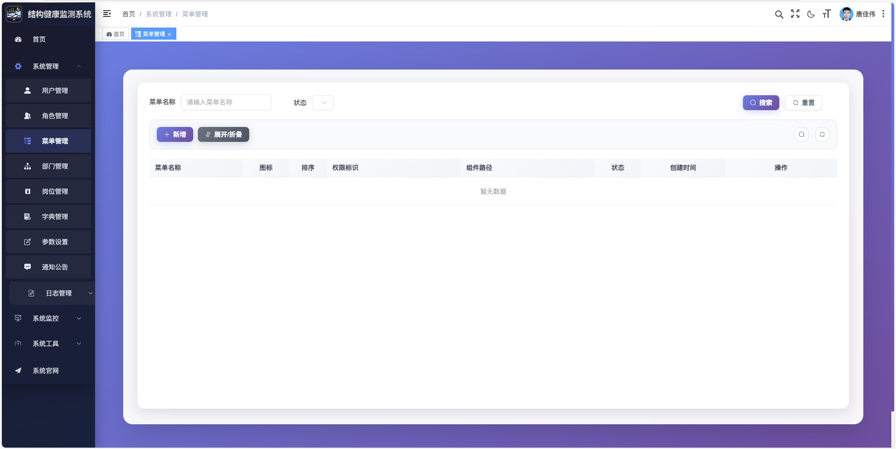

在 `E:\RuoYiProject\MoMagTracker-System\MoMagTracker-Vue3\src\views\system\menu\index.vue` 加入下述代码

```java
<template>
   <div class="menu-management">
      <div class="main-card">
         <div class="content-block">
            <!-- 搜索区域 -->
            <div class="search-section">
               <el-form :model="queryParams" ref="queryRef" v-show="showSearch" :inline="true" class="search-form">
                  <el-form-item label="菜单名称" prop="menuName">
                     <el-input
                        v-model="queryParams.menuName"
                        placeholder="请输入菜单名称"
                        clearable
                        class="tech-input"
                        @keyup.enter="handleQuery"
                     />
                  </el-form-item>
                  <el-form-item label="状态" prop="status">
                     <el-select 
                        v-model="queryParams.status" 
                        placeholder="菜单状态" 
                        clearable 
                        class="tech-select"
                     >
                        <el-option
                           v-for="dict in sys_normal_disable"
                           :key="dict.value"
                           :label="dict.label"
                           :value="dict.value"
                        />
                     </el-select>
                  </el-form-item>
                  <el-form-item class="search-actions">
                     <el-button type="primary" icon="Search" @click="handleQuery" class="tech-btn primary">搜索</el-button>
                     <el-button icon="Refresh" @click="resetQuery" class="tech-btn secondary">重置</el-button>
                  </el-form-item>
               </el-form>
            </div>

            <!-- 操作按钮区域 -->
            <div class="action-section">
               <el-row :gutter="10">
                  <el-col :span="1.5">
                     <el-button
                        type="primary"
                        plain
                        icon="Plus"
                        @click="handleAdd"
                        v-hasPermi="['system:menu:add']"
                        class="tech-btn primary"
                     >新增</el-button>
                  </el-col>
                  <el-col :span="1.5">
                     <el-button 
                        type="info"
                        plain
                        icon="Sort"
                        @click="toggleExpandAll"
                        class="tech-btn info"
                     >展开/折叠</el-button>
                  </el-col>
                  <right-toolbar v-model:showSearch="showSearch" @queryTable="getList" class="right-toolbar"></right-toolbar>
               </el-row>
            </div>

            <!-- 表格区域 -->
            <div class="table-section">
               <el-table
                  v-if="refreshTable"
                  v-loading="loading"
                  :data="menuList"
                  row-key="menuId"
                  :default-expand-all="isExpandAll"
                  :tree-props="{ children: 'children', hasChildren: 'hasChildren' }"
                  class="tech-table"
               >
                  <el-table-column prop="menuName" label="菜单名称" :show-overflow-tooltip="true" width="200"></el-table-column>
                  <el-table-column prop="icon" label="图标" align="center" width="100">
                     <template #default="scope">
                        <div class="icon-display">
                           <svg-icon :icon-class="scope.row.icon" />
                        </div>
                     </template>
                  </el-table-column>
                  <el-table-column prop="orderNum" label="排序" width="80" align="center"></el-table-column>
                  <el-table-column prop="perms" label="权限标识" :show-overflow-tooltip="true"></el-table-column>
                  <el-table-column prop="component" label="组件路径" :show-overflow-tooltip="true"></el-table-column>
                  <el-table-column prop="status" label="状态" width="100" align="center">
                     <template #default="scope">
                        <dict-tag :options="sys_normal_disable" :value="scope.row.status" class="status-tag" />
                     </template>
                  </el-table-column>
                  <el-table-column label="创建时间" align="center" width="180" prop="createTime">
                     <template #default="scope">
                        <span class="time-text">{{ parseTime(scope.row.createTime) }}</span>
                     </template>
                  </el-table-column>
                  <el-table-column label="操作" align="center" width="240" class-name="small-padding fixed-width">
                     <template #default="scope">
                        <div class="action-buttons">
                           <el-tooltip content="修改" placement="top">
                              <el-button link type="primary" icon="Edit" @click="handleUpdate(scope.row)" v-hasPermi="['system:menu:edit']" class="action-btn edit"></el-button>
                           </el-tooltip>
                           <el-tooltip content="新增" placement="top">
                              <el-button link type="primary" icon="Plus" @click="handleAdd(scope.row)" v-hasPermi="['system:menu:add']" class="action-btn add"></el-button>
                           </el-tooltip>
                           <el-tooltip content="删除" placement="top">
                              <el-button link type="primary" icon="Delete" @click="handleDelete(scope.row)" v-hasPermi="['system:menu:remove']" class="action-btn delete"></el-button>
                           </el-tooltip>
                        </div>
                     </template>
                  </el-table-column>
               </el-table>
            </div>
         </div>
      </div>

      <!-- 添加或修改菜单对话框 -->
      <el-dialog :title="title" v-model="open" width="680px" append-to-body class="tech-dialog">
         <el-form ref="menuRef" :model="form" :rules="rules" label-width="100px" class="tech-form">
            <el-row :gutter="20">
               <el-col :span="24">
                  <el-form-item label="上级菜单">
                     <el-tree-select
                        v-model="form.parentId"
                        :data="menuOptions"
                        :props="{ value: 'menuId', label: 'menuName', children: 'children' }"
                        value-key="menuId"
                        placeholder="选择上级菜单"
                        check-strictly
                        class="tech-tree-select"
                     />
                  </el-form-item>
               </el-col>
               <el-col :span="24">
                  <el-form-item label="菜单类型" prop="menuType">
                     <el-radio-group v-model="form.menuType" class="tech-radio-group">
                        <el-radio value="M" class="tech-radio">目录</el-radio>
                        <el-radio value="C" class="tech-radio">菜单</el-radio>
                        <el-radio value="F" class="tech-radio">按钮</el-radio>
                     </el-radio-group>
                  </el-form-item>
               </el-col>
               <el-col :span="12" v-if="form.menuType != 'F'">
                  <el-form-item label="菜单图标" prop="icon">
                     <el-popover
                        placement="bottom-start"
                        :width="540"
                        trigger="click"
                        class="icon-popover"
                     >
                        <template #reference>
                           <el-input v-model="form.icon" placeholder="点击选择图标" @blur="showSelectIcon" readonly class="tech-input icon-input">
                              <template #prefix>
                                 <svg-icon
                                    v-if="form.icon"
                                    :icon-class="form.icon"
                                    class="el-input__icon"
                                    style="height: 32px;width: 16px;"
                                 />
                                 <el-icon v-else style="height: 32px;width: 16px;"><search /></el-icon>
                              </template>
                           </el-input>
                        </template>
                        <icon-select ref="iconSelectRef" @selected="selected" :active-icon="form.icon" />
                     </el-popover>
                  </el-form-item>
               </el-col>
               <el-col :span="12">
                  <el-form-item label="显示排序" prop="orderNum">
                     <el-input-number v-model="form.orderNum" controls-position="right" :min="0" class="tech-input-number" />
                  </el-form-item>
               </el-col>
               <el-col :span="12">
                  <el-form-item label="菜单名称" prop="menuName">
                     <el-input v-model="form.menuName" placeholder="请输入菜单名称" class="tech-input" />
                  </el-form-item>
               </el-col>
               <el-col :span="12" v-if="form.menuType == 'C'">
                  <el-form-item prop="routeName">
                     <template #label>
                        <span class="label-with-tooltip">
                           <el-tooltip content="默认不填则和路由地址相同：如地址为：`user`，则名称为`User`（注意：因为router会删除名称相同路由，为避免名字的冲突，特殊情况下请自定义，保证唯一性）" placement="top">
                              <el-icon><question-filled /></el-icon>
                           </el-tooltip>
                           路由名称
                        </span>
                     </template>
                     <el-input v-model="form.routeName" placeholder="请输入路由名称" class="tech-input" />
                  </el-form-item>
               </el-col>
               <el-col :span="12" v-if="form.menuType != 'F'">
                  <el-form-item>
                     <template #label>
                        <span class="label-with-tooltip">
                           <el-tooltip content="选择是外链则路由地址需要以`http(s)://`开头" placement="top">
                              <el-icon><question-filled /></el-icon>
                           </el-tooltip>是否外链
                        </span>
                     </template>
                     <el-radio-group v-model="form.isFrame" class="tech-radio-group">
                        <el-radio value="0" class="tech-radio">是</el-radio>
                        <el-radio value="1" class="tech-radio">否</el-radio>
                     </el-radio-group>
                  </el-form-item>
               </el-col>
               <el-col :span="12" v-if="form.menuType != 'F'">
                  <el-form-item prop="path">
                     <template #label>
                        <span class="label-with-tooltip">
                           <el-tooltip content="访问的路由地址，如：`user`，如外网地址需内链访问则以`http(s)://`开头" placement="top">
                              <el-icon><question-filled /></el-icon>
                           </el-tooltip>
                           路由地址
                        </span>
                     </template>
                     <el-input v-model="form.path" placeholder="请输入路由地址" class="tech-input" />
                  </el-form-item>
               </el-col>
               <el-col :span="12" v-if="form.menuType == 'C'">
                  <el-form-item prop="component">
                     <template #label>
                        <span class="label-with-tooltip">
                           <el-tooltip content="访问的组件路径，如：`system/user/index`，默认在`views`目录下" placement="top">
                              <el-icon><question-filled /></el-icon>
                           </el-tooltip>
                           组件路径
                        </span>
                     </template>
                     <el-input v-model="form.component" placeholder="请输入组件路径" class="tech-input" />
                  </el-form-item>
               </el-col>
               <el-col :span="12" v-if="form.menuType != 'M'">
                  <el-form-item>
                     <el-input v-model="form.perms" placeholder="请输入权限标识" maxlength="100" class="tech-input" />
                     <template #label>
                        <span class="label-with-tooltip">
                           <el-tooltip content="控制器中定义的权限字符，如：@PreAuthorize(`@ss.hasPermi('system:user:list')`)" placement="top">
                              <el-icon><question-filled /></el-icon>
                           </el-tooltip>
                           权限字符
                        </span>
                     </template>
                  </el-form-item>
               </el-col>
               <el-col :span="12" v-if="form.menuType == 'C'">
                  <el-form-item>
                     <el-input v-model="form.query" placeholder="请输入路由参数" maxlength="255" class="tech-input" />
                     <template #label>
                        <span class="label-with-tooltip">
                           <el-tooltip content='访问路由的默认传递参数，如：`{"id": 1, "name": "ry"}`' placement="top">
                              <el-icon><question-filled /></el-icon>
                           </el-tooltip>
                           路由参数
                        </span>
                     </template>
                  </el-form-item>
               </el-col>
               <el-col :span="12" v-if="form.menuType == 'C'">
                  <el-form-item>
                     <template #label>
                        <span class="label-with-tooltip">
                           <el-tooltip content="选择是则会被`keep-alive`缓存，需要匹配组件的`name`和地址保持一致" placement="top">
                              <el-icon><question-filled /></el-icon>
                           </el-tooltip>
                           是否缓存
                        </span>
                     </template>
                     <el-radio-group v-model="form.isCache" class="tech-radio-group">
                        <el-radio value="0" class="tech-radio">缓存</el-radio>
                        <el-radio value="1" class="tech-radio">不缓存</el-radio>
                     </el-radio-group>
                  </el-form-item>
               </el-col>
               <el-col :span="12" v-if="form.menuType != 'F'">
                  <el-form-item>
                     <template #label>
                        <span class="label-with-tooltip">
                           <el-tooltip content="选择隐藏则路由将不会出现在侧边栏，但仍然可以访问" placement="top">
                              <el-icon><question-filled /></el-icon>
                           </el-tooltip>
                           显示状态
                        </span>
                     </template>
                     <el-radio-group v-model="form.visible" class="tech-radio-group">
                        <el-radio
                           v-for="dict in sys_show_hide"
                           :key="dict.value"
                           :value="dict.value"
                           class="tech-radio"
                        >{{ dict.label }}</el-radio>
                     </el-radio-group>
                  </el-form-item>
               </el-col>
               <el-col :span="12">
                  <el-form-item>
                     <template #label>
                        <span class="label-with-tooltip">
                           <el-tooltip content="选择停用则路由将不会出现在侧边栏，也不能被访问" placement="top">
                              <el-icon><question-filled /></el-icon>
                           </el-tooltip>
                           菜单状态
                        </span>
                     </template>
                     <el-radio-group v-model="form.status" class="tech-radio-group">
                        <el-radio
                           v-for="dict in sys_normal_disable"
                           :key="dict.value"
                           :value="dict.value"
                           class="tech-radio"
                        >{{ dict.label }}</el-radio>
                     </el-radio-group>
                  </el-form-item>
               </el-col>
            </el-row>
         </el-form>
         <template #footer>
            <div class="dialog-footer">
               <el-button type="primary" @click="submitForm" class="tech-btn primary">确 定</el-button>
               <el-button @click="cancel" class="tech-btn secondary">取 消</el-button>
            </div>
         </template>
      </el-dialog>
   </div>
</template>

<script setup name="Menu">
import { addMenu, delMenu, getMenu, listMenu, updateMenu } from "@/api/system/menu"
import SvgIcon from "@/components/SvgIcon"
import IconSelect from "@/components/IconSelect"

const { proxy } = getCurrentInstance()
const { sys_show_hide, sys_normal_disable } = proxy.useDict("sys_show_hide", "sys_normal_disable")

const menuList = ref([])
const open = ref(false)
const loading = ref(true)
const showSearch = ref(true)
const title = ref("")
const menuOptions = ref([])
const isExpandAll = ref(false)
const refreshTable = ref(true)
const iconSelectRef = ref(null)

const data = reactive({
  form: {},
  queryParams: {
    menuName: undefined,
    visible: undefined
  },
  rules: {
    menuName: [{ required: true, message: "菜单名称不能为空", trigger: "blur" }],
    orderNum: [{ required: true, message: "菜单顺序不能为空", trigger: "blur" }],
    path: [{ required: true, message: "路由地址不能为空", trigger: "blur" }]
  },
})

const { queryParams, form, rules } = toRefs(data)

/** 查询菜单列表 */
function getList() {
  loading.value = true
  listMenu(queryParams.value).then(response => {
    menuList.value = proxy.handleTree(response.data, "menuId")
    loading.value = false
  })
}

/** 查询菜单下拉树结构 */
function getTreeselect() {
  menuOptions.value = []
  listMenu().then(response => {
    const menu = { menuId: 0, menuName: "主类目", children: [] }
    menu.children = proxy.handleTree(response.data, "menuId")
    menuOptions.value.push(menu)
  })
}

/** 取消按钮 */
function cancel() {
  open.value = false
  reset()
}

/** 表单重置 */
function reset() {
  form.value = {
    menuId: undefined,
    parentId: 0,
    menuName: undefined,
    icon: undefined,
    menuType: "M",
    orderNum: undefined,
    isFrame: "1",
    isCache: "0",
    visible: "0",
    status: "0"
  }
  proxy.resetForm("menuRef")
}

/** 展示下拉图标 */
function showSelectIcon() {
  iconSelectRef.value.reset()
}

/** 选择图标 */
function selected(name) {
  form.value.icon = name
}

/** 搜索按钮操作 */
function handleQuery() {
  getList()
}

/** 重置按钮操作 */
function resetQuery() {
  proxy.resetForm("queryRef")
  handleQuery()
}

/** 新增按钮操作 */
function handleAdd(row) {
  reset()
  getTreeselect()
  if (row != null && row.menuId) {
    form.value.parentId = row.menuId
  } else {
    form.value.parentId = 0
  }
  open.value = true
  title.value = "添加菜单"
}

/** 展开/折叠操作 */
function toggleExpandAll() {
  refreshTable.value = false
  isExpandAll.value = !isExpandAll.value
  nextTick(() => {
    refreshTable.value = true
  })
}

/** 修改按钮操作 */
async function handleUpdate(row) {
  reset()
  await getTreeselect()
  getMenu(row.menuId).then(response => {
    form.value = response.data
    open.value = true
    title.value = "修改菜单"
  })
}

/** 提交按钮 */
function submitForm() {
  proxy.$refs["menuRef"].validate(valid => {
    if (valid) {
      if (form.value.menuId != undefined) {
        updateMenu(form.value).then(response => {
          proxy.$modal.msgSuccess("修改成功")
          open.value = false
          getList()
        })
      } else {
        addMenu(form.value).then(response => {
          proxy.$modal.msgSuccess("新增成功")
          open.value = false
          getList()
        })
      }
    }
  })
}

/** 删除按钮操作 */
function handleDelete(row) {
  proxy.$modal.confirm('是否确认删除名称为"' + row.menuName + '"的数据项?').then(function() {
    return delMenu(row.menuId)
  }).then(() => {
    getList()
    proxy.$modal.msgSuccess("删除成功")
  }).catch(() => {})
}

getList()
</script>

<style scoped lang="scss">
.menu-management {
  font-family: "Inter", "Helvetica Neue", Helvetica, "PingFang SC", "Hiragino Sans GB", "Microsoft YaHei", Arial, sans-serif;
  color: #2c3e50;
  background: linear-gradient(135deg, #667eea 0%, #764ba2 100%);
  min-height: 100vh;
  padding: 40px;
  display: flex;
  align-items: flex-start;
  justify-content: center;

  .main-card {
    background: rgba(255, 255, 255, 0.95);
    border-radius: 20px;
    box-shadow: 0 20px 60px rgba(0, 0, 0, 0.15);
    backdrop-filter: blur(20px);
    width: 100%;
    max-width: 1600px;
    padding: 30px;
    margin: 20px;
    min-height: auto;
    height: auto;

    .content-block {
      background: white;
      border-radius: 16px;
      padding: 25px;
      box-shadow: 0 4px 20px rgba(0, 0, 0, 0.08);
      border: 1px solid #f1f5f9;
      transition: all 0.3s ease;
      min-height: 700px;
      height: auto;

      &:hover {
        transform: translateY(-3px);
        box-shadow: 0 8px 30px rgba(0, 0, 0, 0.12);
      }

      // 搜索区域
      .search-section {
        margin-bottom: 20px;
        
        .search-form {
          display: flex;
          flex-wrap: wrap;
          gap: 15px;
          align-items: flex-end;

          .el-form-item {
            margin-bottom: 0;
          }

          .search-actions {
            margin-left: auto;
          }
        }
      }

      // 操作按钮区域
      .action-section {
        margin-bottom: 20px;
        padding: 15px;
        background: #f8fafc;
        border-radius: 12px;
        border: 1px solid #e2e8f0;

        .right-toolbar {
          margin-left: auto;
        }
      }

      // 表格区域
      .table-section {
        .icon-display {
          display: flex;
          justify-content: center;
          align-items: center;
          height: 24px;
          
          .svg-icon {
            font-size: 18px;
            color: #667eea;
          }
        }

        .status-tag {
          :deep(.el-tag) {
            border-radius: 6px;
            font-weight: 500;
          }
        }
      }
    }
  }

  // 科技感组件样式
  .tech-input {
    :deep(.el-input__wrapper) {
      border-radius: 8px;
      border: 1px solid #e2e8f0;
      transition: all 0.3s ease;
      box-shadow: 0 1px 3px rgba(0, 0, 0, 0.05);
      
      &:hover {
        border-color: #667eea;
        box-shadow: 0 2px 8px rgba(102, 126, 234, 0.1);
      }
      
      &.is-focus {
        border-color: #667eea;
        box-shadow: 0 0 0 2px rgba(102, 126, 234, 0.1);
      }
    }

    &.icon-input {
      :deep(.el-input__inner) {
        cursor: pointer;
      }
    }
  }

  .tech-select {
    :deep(.el-select__wrapper) {
      border-radius: 8px;
      border: 1px solid #e2e8f0;
      transition: all 0.3s ease;
      box-shadow: 0 1px 3px rgba(0, 0, 0, 0.05);
      
      &:hover {
        border-color: #667eea;
      }
    }
  }

  .tech-tree-select {
    :deep(.el-select__wrapper) {
      border-radius: 8px;
      border: 1px solid #e2e8f0;
      transition: all 0.3s ease;
      
      &:hover {
        border-color: #667eea;
      }
    }
  }

  .tech-btn {
    border-radius: 8px;
    font-weight: 600;
    transition: all 0.3s ease;
    border: none;
    
    &.primary {
      background: linear-gradient(135deg, #667eea 0%, #764ba2 100%);
      color: white;
      box-shadow: 0 4px 15px rgba(102, 126, 234, 0.3);

      &:hover {
        transform: translateY(-2px);
        box-shadow: 0 8px 25px rgba(102, 126, 234, 0.4);
      }
    }

    &.secondary {
      background: white;
      border: 1px solid #e2e8f0;
      color: #475569;
      box-shadow: 0 2px 6px rgba(0, 0, 0, 0.05);

      &:hover {
        transform: translateY(-2px);
        border-color: #667eea;
        color: #667eea;
        box-shadow: 0 4px 12px rgba(0, 0, 0, 0.1);
      }
    }

    &.info {
      background: linear-gradient(135deg, #6b7280 0%, #4b5563 100%);
      color: white;
      box-shadow: 0 4px 15px rgba(107, 114, 128, 0.3);

      &:hover {
        transform: translateY(-2px);
        box-shadow: 0 8px 25px rgba(107, 114, 128, 0.4);
      }
    }
  }

  .tech-table {
    :deep(.el-table__header) {
      th {
        background: linear-gradient(135deg, #f8fafc 0%, #f1f5f9 100%);
        color: #374151;
        font-weight: 600;
      }
    }

    :deep(.el-table__row) {
      transition: all 0.3s ease;
      
      &:hover {
        transform: translateY(-1px);
        box-shadow: 0 2px 8px rgba(0, 0, 0, 0.1);
      }
    }

    :deep(.el-table__indent) {
      padding-left: 8px;
    }

    :deep(.el-table__expand-icon) {
      color: #667eea;
      font-weight: bold;
      
      &.el-table__expand-icon--expanded {
        transform: rotate(90deg);
      }
    }
  }

  .action-buttons {
    display: flex;
    justify-content: center;
    gap: 8px;

    .action-btn {
      width: 32px;
      height: 32px;
      border-radius: 6px;
      display: flex;
      align-items: center;
      justify-content: center;
      transition: all 0.3s ease;

      &:hover {
        transform: scale(1.1);
        background: #f1f5f9;
      }
    }
  }

  .time-text {
    color: #6b7280;
    font-size: 0.9rem;
  }

  .tech-dialog {
    :deep(.el-dialog) {
      border-radius: 16px;
      box-shadow: 0 20px 60px rgba(0, 0, 0, 0.2);
      
      .el-dialog__header {
        border-bottom: 1px solid #e2e8f0;
        margin-right: 0;
        
        .el-dialog__title {
          font-weight: 700;
          color: #1e293b;
        }
      }
      
      .el-dialog__body {
        padding: 20px;
      }
    }
  }

  .tech-form {
    .el-form-item {
      margin-bottom: 20px;
    }
    
    .el-form-item__label {
      font-weight: 600;
      color: #374151;
    }

    .label-with-tooltip {
      display: flex;
      align-items: center;
      gap: 4px;
    }

    .el-row {
      margin-bottom: -10px;
    }
  }

  .tech-input-number {
    :deep(.el-input-number__decrease),
    :deep(.el-input-number__increase) {
      background: #f8fafc;
      border-radius: 6px;
    }
  }

  .tech-radio-group {
    :deep(.el-radio) {
      margin-right: 20px;
    }
  }

  .tech-radio {
    :deep(.el-radio__input.is-checked .el-radio__inner) {
      background: linear-gradient(135deg, #667eea 0%, #764ba2 100%);
      border-color: #667eea;
    }
    
    :deep(.el-radio__label) {
      color: #374151;
      font-weight: 500;
    }
  }

  .icon-popover {
    :deep(.el-popover) {
      border-radius: 12px;
      box-shadow: 0 10px 40px rgba(0, 0, 0, 0.15);
    }
  }
}

// 响应式设计
@media (max-width: 1024px) {
  .menu-management {
    .main-card {
      padding: 25px;
      margin: 15px;
    }
  }
}

@media (max-width: 768px) {
  .menu-management {
    padding: 15px;

    .main-card {
      padding: 20px;

      .content-block {
        padding: 20px;
        min-height: 400px;

        .search-section {
          .search-form {
            flex-direction: column;
            align-items: stretch;
            
            .search-actions {
              margin-left: 0;
              text-align: center;
            }
          }
        }

        .action-section {
          .el-col {
            margin-bottom: 10px;
          }
        }
      }
    }

    .tech-dialog {
      :deep(.el-dialog) {
        width: 95% !important;
        margin: 20px auto;
      }
    }
  }
}

@media (max-width: 480px) {
  .menu-management {
    padding: 10px;

    .main-card {
      padding: 15px;
      margin: 10px;

      .content-block {
        padding: 15px;
        min-height: 350px;
      }
    }
  }
}
</style>
```

#### 2.3.4.4 部门管理（/dept/index.vue）

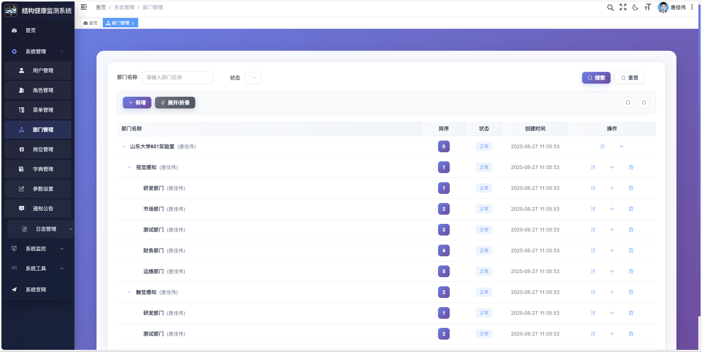

在 `E:\RuoYiProject\MoMagTracker-System\MoMagTracker-Vue3\src\views\system\dept\index.vue` 文件中加入下述代码

```java
<template>
   <div class="dept-management">
      <div class="main-card">
         <div class="content-block">
            <!-- 搜索区域 -->
            <div class="search-section">
               <el-form :model="queryParams" ref="queryRef" v-show="showSearch" :inline="true" class="search-form">
                  <el-form-item label="部门名称" prop="deptName">
                     <el-input
                        v-model="queryParams.deptName"
                        placeholder="请输入部门名称"
                        clearable
                        class="tech-input"
                        @keyup.enter="handleQuery"
                     />
                  </el-form-item>
                  <el-form-item label="状态" prop="status">
                     <el-select 
                        v-model="queryParams.status" 
                        placeholder="部门状态" 
                        clearable 
                        class="tech-select"
                     >
                        <el-option
                           v-for="dict in sys_normal_disable"
                           :key="dict.value"
                           :label="dict.label"
                           :value="dict.value"
                        />
                     </el-select>
                  </el-form-item>
                  <el-form-item class="search-actions">
                     <el-button type="primary" icon="Search" @click="handleQuery" class="tech-btn primary">搜索</el-button>
                     <el-button icon="Refresh" @click="resetQuery" class="tech-btn secondary">重置</el-button>
                  </el-form-item>
               </el-form>
            </div>

            <!-- 操作按钮区域 -->
            <div class="action-section">
               <el-row :gutter="10">
                  <el-col :span="1.5">
                     <el-button
                        type="primary"
                        plain
                        icon="Plus"
                        @click="handleAdd"
                        v-hasPermi="['system:dept:add']"
                        class="tech-btn primary"
                     >新增</el-button>
                  </el-col>
                  <el-col :span="1.5">
                     <el-button
                        type="info"
                        plain
                        icon="Sort"
                        @click="toggleExpandAll"
                        class="tech-btn info"
                     >展开/折叠</el-button>
                  </el-col>
                  <right-toolbar v-model:showSearch="showSearch" @queryTable="getList" class="right-toolbar"></right-toolbar>
               </el-row>
            </div>

            <!-- 表格区域 -->
            <div class="table-section">
               <el-table
                  v-if="refreshTable"
                  v-loading="loading"
                  :data="deptList"
                  row-key="deptId"
                  :default-expand-all="isExpandAll"
                  :tree-props="{ children: 'children', hasChildren: 'hasChildren' }"
                  class="tech-table tree-table"
               >
                  <el-table-column prop="deptName" label="部门名称" min-width="260">
                     <template #default="scope">
                        <div class="dept-name-cell">
                           <span class="dept-name">{{ scope.row.deptName }}</span>
                           <span v-if="scope.row.leader" class="dept-leader">({{ scope.row.leader }})</span>
                        </div>
                     </template>
                  </el-table-column>
                  <el-table-column prop="orderNum" label="排序" width="120" align="center">
                     <template #default="scope">
                        <span class="order-badge">{{ scope.row.orderNum }}</span>
                     </template>
                  </el-table-column>
                  <el-table-column prop="status" label="状态" width="100" align="center">
                     <template #default="scope">
                        <dict-tag :options="sys_normal_disable" :value="scope.row.status" class="status-tag" />
                     </template>
                  </el-table-column>
                  <el-table-column label="创建时间" align="center" width="180" prop="createTime">
                     <template #default="scope">
                        <span class="time-text">{{ parseTime(scope.row.createTime) }}</span>
                     </template>
                  </el-table-column>
                  <el-table-column label="操作" align="center" class-name="small-padding fixed-width" width="240">
                     <template #default="scope">
                        <div class="action-buttons">
                           <el-tooltip content="修改" placement="top">
                              <el-button link type="primary" icon="Edit" @click="handleUpdate(scope.row)" v-hasPermi="['system:dept:edit']" class="action-btn edit"></el-button>
                           </el-tooltip>
                           <el-tooltip content="新增" placement="top">
                              <el-button link type="primary" icon="Plus" @click="handleAdd(scope.row)" v-hasPermi="['system:dept:add']" class="action-btn add"></el-button>
                           </el-tooltip>
                           <el-tooltip content="删除" placement="top" v-if="scope.row.parentId != 0">
                              <el-button link type="primary" icon="Delete" @click="handleDelete(scope.row)" v-hasPermi="['system:dept:remove']" class="action-btn delete"></el-button>
                           </el-tooltip>
                        </div>
                     </template>
                  </el-table-column>
               </el-table>
            </div>
         </div>
      </div>

      <!-- 添加或修改部门对话框 -->
      <el-dialog :title="title" v-model="open" width="600px" append-to-body class="tech-dialog">
         <el-form ref="deptRef" :model="form" :rules="rules" label-width="100px" class="tech-form">
            <el-row :gutter="20">
               <el-col :span="24" v-if="form.parentId !== 0">
                  <el-form-item label="上级部门" prop="parentId">
                     <el-tree-select
                        v-model="form.parentId"
                        :data="deptOptions"
                        :props="{ value: 'deptId', label: 'deptName', children: 'children' }"
                        value-key="deptId"
                        placeholder="选择上级部门"
                        check-strictly
                        class="tech-tree-select"
                     />
                  </el-form-item>
               </el-col>
               <el-col :span="12">
                  <el-form-item label="部门名称" prop="deptName">
                     <el-input v-model="form.deptName" placeholder="请输入部门名称" class="tech-input" />
                  </el-form-item>
               </el-col>
               <el-col :span="12">
                  <el-form-item label="显示排序" prop="orderNum">
                     <el-input-number v-model="form.orderNum" controls-position="right" :min="0" class="tech-input-number" />
                  </el-form-item>
               </el-col>
               <el-col :span="12">
                  <el-form-item label="负责人" prop="leader">
                     <el-input v-model="form.leader" placeholder="请输入负责人" maxlength="20" class="tech-input" />
                  </el-form-item>
               </el-col>
               <el-col :span="12">
                  <el-form-item label="联系电话" prop="phone">
                     <el-input v-model="form.phone" placeholder="请输入联系电话" maxlength="11" class="tech-input" />
                  </el-form-item>
               </el-col>
               <el-col :span="12">
                  <el-form-item label="邮箱" prop="email">
                     <el-input v-model="form.email" placeholder="请输入邮箱" maxlength="50" class="tech-input" />
                  </el-form-item>
               </el-col>
               <el-col :span="12">
                  <el-form-item label="部门状态">
                     <el-radio-group v-model="form.status" class="tech-radio-group">
                        <el-radio
                           v-for="dict in sys_normal_disable"
                           :key="dict.value"
                           :value="dict.value"
                           class="tech-radio"
                        >{{ dict.label }}</el-radio>
                     </el-radio-group>
                  </el-form-item>
               </el-col>
            </el-row>
         </el-form>
         <template #footer>
            <div class="dialog-footer">
               <el-button type="primary" @click="submitForm" class="tech-btn primary">确 定</el-button>
               <el-button @click="cancel" class="tech-btn secondary">取 消</el-button>
            </div>
         </template>
      </el-dialog>
   </div>
</template>

<script setup name="Dept">
import { listDept, getDept, delDept, addDept, updateDept, listDeptExcludeChild } from "@/api/system/dept"

const { proxy } = getCurrentInstance()
const { sys_normal_disable } = proxy.useDict("sys_normal_disable")

const deptList = ref([])
const open = ref(false)
const loading = ref(true)
const showSearch = ref(true)
const title = ref("")
const deptOptions = ref([])
const isExpandAll = ref(true)
const refreshTable = ref(true)

const data = reactive({
  form: {},
  queryParams: {
    deptName: undefined,
    status: undefined
  },
  rules: {
    parentId: [{ required: true, message: "上级部门不能为空", trigger: "blur" }],
    deptName: [{ required: true, message: "部门名称不能为空", trigger: "blur" }],
    orderNum: [{ required: true, message: "显示排序不能为空", trigger: "blur" }],
    email: [{ type: "email", message: "请输入正确的邮箱地址", trigger: ["blur", "change"] }],
    phone: [{ pattern: /^1[3|4|5|6|7|8|9][0-9]\d{8}$/, message: "请输入正确的手机号码", trigger: "blur" }]
  },
})

const { queryParams, form, rules } = toRefs(data)

/** 查询部门列表 */
function getList() {
  loading.value = true
  listDept(queryParams.value).then(response => {
    deptList.value = proxy.handleTree(response.data, "deptId")
    loading.value = false
  })
}

/** 取消按钮 */
function cancel() {
  open.value = false
  reset()
}

/** 表单重置 */
function reset() {
  form.value = {
    deptId: undefined,
    parentId: undefined,
    deptName: undefined,
    orderNum: 0,
    leader: undefined,
    phone: undefined,
    email: undefined,
    status: "0"
  }
  proxy.resetForm("deptRef")
}

/** 搜索按钮操作 */
function handleQuery() {
  getList()
}

/** 重置按钮操作 */
function resetQuery() {
  proxy.resetForm("queryRef")
  handleQuery()
}

/** 新增按钮操作 */
function handleAdd(row) {
  reset()
  listDept().then(response => {
    deptOptions.value = proxy.handleTree(response.data, "deptId")
  })
  if (row != undefined) {
    form.value.parentId = row.deptId
  }
  open.value = true
  title.value = "添加部门"
}

/** 展开/折叠操作 */
function toggleExpandAll() {
  refreshTable.value = false
  isExpandAll.value = !isExpandAll.value
  nextTick(() => {
    refreshTable.value = true
  })
}

/** 修改按钮操作 */
function handleUpdate(row) {
  reset()
  listDeptExcludeChild(row.deptId).then(response => {
    deptOptions.value = proxy.handleTree(response.data, "deptId")
  })
  getDept(row.deptId).then(response => {
    form.value = response.data
    open.value = true
    title.value = "修改部门"
  })
}

/** 提交按钮 */
function submitForm() {
  proxy.$refs["deptRef"].validate(valid => {
    if (valid) {
      if (form.value.deptId != undefined) {
        updateDept(form.value).then(response => {
          proxy.$modal.msgSuccess("修改成功")
          open.value = false
          getList()
        })
      } else {
        addDept(form.value).then(response => {
          proxy.$modal.msgSuccess("新增成功")
          open.value = false
          getList()
        })
      }
    }
  })
}

/** 删除按钮操作 */
function handleDelete(row) {
  proxy.$modal.confirm('是否确认删除名称为"' + row.deptName + '"的数据项?').then(function() {
    return delDept(row.deptId)
  }).then(() => {
    getList()
    proxy.$modal.msgSuccess("删除成功")
  }).catch(() => {})
}

getList()
</script>

<style scoped lang="scss">
.dept-management {
  font-family: "Inter", "Helvetica Neue", Helvetica, "PingFang SC", "Hiragino Sans GB", "Microsoft YaHei", Arial, sans-serif;
  color: #2c3e50;
  background: linear-gradient(135deg, #667eea 0%, #764ba2 100%);
  min-height: 100vh;
  padding: 40px;
  display: flex;
  align-items: flex-start;
  justify-content: center;

  .main-card {
    background: rgba(255, 255, 255, 0.95);
    border-radius: 20px;
    box-shadow: 0 20px 60px rgba(0, 0, 0, 0.15);
    backdrop-filter: blur(20px);
    width: 100%;
    max-width: 1600px;
    padding: 30px;
    margin: 20px;
    min-height: auto;
    height: auto;

    .content-block {
      background: white;
      border-radius: 16px;
      padding: 25px;
      box-shadow: 0 4px 20px rgba(0, 0, 0, 0.08);
      border: 1px solid #f1f5f9;
      transition: all 0.3s ease;
      min-height: 700px;
      height: auto;

      &:hover {
        transform: translateY(-3px);
        box-shadow: 0 8px 30px rgba(0, 0, 0, 0.12);
      }

      // 搜索区域
      .search-section {
        margin-bottom: 20px;
        
        .search-form {
          display: flex;
          flex-wrap: wrap;
          gap: 15px;
          align-items: flex-end;

          .el-form-item {
            margin-bottom: 0;
          }

          .search-actions {
            margin-left: auto;
          }
        }
      }

      // 操作按钮区域
      .action-section {
        margin-bottom: 20px;
        padding: 15px;
        background: #f8fafc;
        border-radius: 12px;
        border: 1px solid #e2e8f0;

        .right-toolbar {
          margin-left: auto;
        }
      }

      // 表格区域
      .table-section {
        .dept-name-cell {
          display: flex;
          align-items: center;
          gap: 8px;
          
          .dept-name {
            font-weight: 600;
            color: #1e293b;
          }
          
          .dept-leader {
            color: #64748b;
            font-size: 0.85rem;
          }
        }

        .order-badge {
          display: inline-flex;
          align-items: center;
          justify-content: center;
          width: 32px;
          height: 32px;
          background: linear-gradient(135deg, #667eea 0%, #764ba2 100%);
          color: white;
          border-radius: 8px;
          font-weight: 600;
          font-size: 0.9rem;
        }

        .status-tag {
          :deep(.el-tag) {
            border-radius: 6px;
            font-weight: 500;
          }
        }
      }
    }
  }

  // 科技感组件样式
  .tech-input {
    :deep(.el-input__wrapper) {
      border-radius: 8px;
      border: 1px solid #e2e8f0;
      transition: all 0.3s ease;
      box-shadow: 0 1px 3px rgba(0, 0, 0, 0.05);
      
      &:hover {
        border-color: #667eea;
        box-shadow: 0 2px 8px rgba(102, 126, 234, 0.1);
      }
      
      &.is-focus {
        border-color: #667eea;
        box-shadow: 0 0 0 2px rgba(102, 126, 234, 0.1);
      }
    }
  }

  .tech-select {
    :deep(.el-select__wrapper) {
      border-radius: 8px;
      border: 1px solid #e2e8f0;
      transition: all 0.3s ease;
      box-shadow: 0 1px 3px rgba(0, 0, 0, 0.05);
      
      &:hover {
        border-color: #667eea;
      }
    }
  }

  .tech-tree-select {
    :deep(.el-select__wrapper) {
      border-radius: 8px;
      border: 1px solid #e2e8f0;
      transition: all 0.3s ease;
      
      &:hover {
        border-color: #667eea;
      }
    }
  }

  .tech-btn {
    border-radius: 8px;
    font-weight: 600;
    transition: all 0.3s ease;
    border: none;
    
    &.primary {
      background: linear-gradient(135deg, #667eea 0%, #764ba2 100%);
      color: white;
      box-shadow: 0 4px 15px rgba(102, 126, 234, 0.3);

      &:hover {
        transform: translateY(-2px);
        box-shadow: 0 8px 25px rgba(102, 126, 234, 0.4);
      }
    }

    &.secondary {
      background: white;
      border: 1px solid #e2e8f0;
      color: #475569;
      box-shadow: 0 2px 6px rgba(0, 0, 0, 0.05);

      &:hover {
        transform: translateY(-2px);
        border-color: #667eea;
        color: #667eea;
        box-shadow: 0 4px 12px rgba(0, 0, 0, 0.1);
      }
    }

    &.info {
      background: linear-gradient(135deg, #6b7280 0%, #4b5563 100%);
      color: white;
      box-shadow: 0 4px 15px rgba(107, 114, 128, 0.3);

      &:hover {
        transform: translateY(-2px);
        box-shadow: 0 8px 25px rgba(107, 114, 128, 0.4);
      }
    }
  }

  .tech-table {
    :deep(.el-table__header) {
      th {
        background: linear-gradient(135deg, #f8fafc 0%, #f1f5f9 100%);
        color: #374151;
        font-weight: 600;
      }
    }

    :deep(.el-table__row) {
      transition: all 0.3s ease;
      
      &:hover {
        transform: translateY(-1px);
        box-shadow: 0 2px 8px rgba(0, 0, 0, 0.1);
      }
    }

    // 树形表格特殊样式
    &.tree-table {
      :deep(.el-table__row) {
        .el-table__cell {
          padding: 12px 0;
        }
        
        // 确保树形结构的缩进正确
        .el-table__expand-icon {
          color: #667eea;
          font-weight: bold;
          margin-right: 4px;
          
          &.el-table__expand-icon--expanded {
            transform: rotate(90deg);
          }
        }
        
        // 确保文字内容也有正确的缩进
        .el-table__cell:first-child {
          .cell {
            display: flex;
            align-items: center;
          }
        }
      }
      
      // 修复树形缩进问题
      :deep(.el-table__indent) {
        padding-left: 0;
      }
      
      // 为每个层级添加不同的缩进
      :deep(.level-0) .el-table__expand-icon {
        margin-left: 8px;
      }
      
      :deep(.level-1) .el-table__expand-icon {
        margin-left: 24px;
      }
      
      :deep(.level-2) .el-table__expand-icon {
        margin-left: 40px;
      }
      
      :deep(.level-3) .el-table__expand-icon {
        margin-left: 56px;
      }
      
      :deep(.level-4) .el-table__expand-icon {
        margin-left: 72px;
      }
      
      // 确保部门名称文本也有正确的缩进
      :deep(.dept-name-cell) {
        padding-left: 8px;
      }
      
      :deep(.level-1) .dept-name-cell {
        padding-left: 24px;
      }
      
      :deep(.level-2) .dept-name-cell {
        padding-left: 40px;
      }
      
      :deep(.level-3) .dept-name-cell {
        padding-left: 56px;
      }
      
      :deep(.level-4) .dept-name-cell {
        padding-left: 72px;
      }
    }
  }

  .action-buttons {
    display: flex;
    justify-content: center;
    gap: 8px;

    .action-btn {
      width: 32px;
      height: 32px;
      border-radius: 6px;
      display: flex;
      align-items: center;
      justify-content: center;
      transition: all 0.3s ease;

      &:hover {
        transform: scale(1.1);
        background: #f1f5f9;
      }
    }
  }

  .time-text {
    color: #6b7280;
    font-size: 0.9rem;
  }

  .tech-dialog {
    :deep(.el-dialog) {
      border-radius: 16px;
      box-shadow: 0 20px 60px rgba(0, 0, 0, 0.2);
      
      .el-dialog__header {
        border-bottom: 1px solid #e2e8f0;
        margin-right: 0;
        
        .el-dialog__title {
          font-weight: 700;
          color: #1e293b;
        }
      }
      
      .el-dialog__body {
        padding: 20px;
      }
    }
  }

  .tech-form {
    .el-form-item {
      margin-bottom: 20px;
    }
    
    .el-form-item__label {
      font-weight: 600;
      color: #374151;
    }

    .el-row {
      margin-bottom: -10px;
    }
  }

  .tech-input-number {
    :deep(.el-input-number__decrease),
    :deep(.el-input-number__increase) {
      background: #f8fafc;
      border-radius: 6px;
    }
  }

  .tech-radio-group {
    :deep(.el-radio) {
      margin-right: 20px;
    }
  }

  .tech-radio {
    :deep(.el-radio__input.is-checked .el-radio__inner) {
      background: linear-gradient(135deg, #667eea 0%, #764ba2 100%);
      border-color: #667eea;
    }
    
    :deep(.el-radio__label) {
      color: #374151;
      font-weight: 500;
    }
  }
}

// 响应式设计
@media (max-width: 1024px) {
  .dept-management {
    .main-card {
      padding: 25px;
      margin: 15px;
    }
  }
}

@media (max-width: 768px) {
  .dept-management {
    padding: 15px;

    .main-card {
      padding: 20px;

      .content-block {
        padding: 20px;
        min-height: 400px;

        .search-section {
          .search-form {
            flex-direction: column;
            align-items: stretch;
            
            .search-actions {
              margin-left: 0;
              text-align: center;
            }
          }
        }

        .action-section {
          .el-col {
            margin-bottom: 10px;
          }
        }
      }
    }

    .tech-dialog {
      :deep(.el-dialog) {
        width: 95% !important;
        margin: 20px auto;
      }
    }
  }
}

@media (max-width: 480px) {
  .dept-management {
    padding: 10px;

    .main-card {
      padding: 15px;
      margin: 10px;

      .content-block {
        padding: 15px;
        min-height: 350px;
      }
    }
  }
}
</style>
```

#### 2.3.4.5 岗位管理（/post/index.vue）

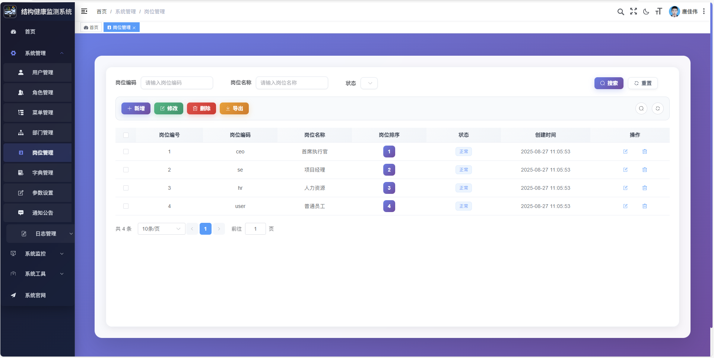

在 `E:\RuoYiProject\MoMagTracker-System\MoMagTracker-Vue3\src\views\system\post\index.vue` 文件中加入下述代码

```java
<template>
   <div class="post-management">
      <div class="main-card">
         <div class="content-block">
            <!-- 搜索区域 -->
            <div class="search-section">
               <el-form :model="queryParams" ref="queryRef" v-show="showSearch" :inline="true" class="search-form">
                  <el-form-item label="岗位编码" prop="postCode">
                     <el-input
                        v-model="queryParams.postCode"
                        placeholder="请输入岗位编码"
                        clearable
                        class="tech-input"
                        @keyup.enter="handleQuery"
                     />
                  </el-form-item>
                  <el-form-item label="岗位名称" prop="postName">
                     <el-input
                        v-model="queryParams.postName"
                        placeholder="请输入岗位名称"
                        clearable
                        class="tech-input"
                        @keyup.enter="handleQuery"
                     />
                  </el-form-item>
                  <el-form-item label="状态" prop="status">
                     <el-select 
                        v-model="queryParams.status" 
                        placeholder="岗位状态" 
                        clearable 
                        class="tech-select"
                     >
                        <el-option
                           v-for="dict in sys_normal_disable"
                           :key="dict.value"
                           :label="dict.label"
                           :value="dict.value"
                        />
                     </el-select>
                  </el-form-item>
                  <el-form-item class="search-actions">
                     <el-button type="primary" icon="Search" @click="handleQuery" class="tech-btn primary">搜索</el-button>
                     <el-button icon="Refresh" @click="resetQuery" class="tech-btn secondary">重置</el-button>
                  </el-form-item>
               </el-form>
            </div>

            <!-- 操作按钮区域 -->
            <div class="action-section">
               <el-row :gutter="10">
                  <el-col :span="1.5">
                     <el-button
                        type="primary"
                        plain
                        icon="Plus"
                        @click="handleAdd"
                        v-hasPermi="['system:post:add']"
                        class="tech-btn primary"
                     >新增</el-button>
                  </el-col>
                  <el-col :span="1.5">
                     <el-button
                        type="success"
                        plain
                        icon="Edit"
                        :disabled="single"
                        @click="handleUpdate"
                        v-hasPermi="['system:post:edit']"
                        class="tech-btn success"
                     >修改</el-button>
                  </el-col>
                  <el-col :span="1.5">
                     <el-button
                        type="danger"
                        plain
                        icon="Delete"
                        :disabled="multiple"
                        @click="handleDelete"
                        v-hasPermi="['system:post:remove']"
                        class="tech-btn danger"
                     >删除</el-button>
                  </el-col>
                  <el-col :span="1.5">
                     <el-button
                        type="warning"
                        plain
                        icon="Download"
                        @click="handleExport"
                        v-hasPermi="['system:post:export']"
                        class="tech-btn warning"
                     >导出</el-button>
                  </el-col>
                  <right-toolbar v-model:showSearch="showSearch" @queryTable="getList" class="right-toolbar"></right-toolbar>
               </el-row>
            </div>

            <!-- 表格区域 -->
            <div class="table-section">
               <el-table 
                  v-loading="loading" 
                  :data="postList" 
                  @selection-change="handleSelectionChange" 
                  class="tech-table"
               >
                  <el-table-column type="selection" width="55" align="center" />
                  <el-table-column label="岗位编号" align="center" prop="postId" width="180" />
                  <el-table-column label="岗位编码" align="center" prop="postCode" width="200" />
                  <el-table-column label="岗位名称" align="center" prop="postName" width="200" />
                  <el-table-column label="岗位排序" align="center" prop="postSort" width="200">
                     <template #default="scope">
                        <span class="order-badge">{{ scope.row.postSort }}</span>
                     </template>
                  </el-table-column>
                  <el-table-column label="状态" align="center" prop="status" width="200">
                     <template #default="scope">
                        <dict-tag :options="sys_normal_disable" :value="scope.row.status" class="status-tag" />
                     </template>
                  </el-table-column>
                  <el-table-column label="创建时间" align="center" width="240" prop="createTime">
                     <template #default="scope">
                        <span class="time-text">{{ parseTime(scope.row.createTime) }}</span>
                     </template>
                  </el-table-column>
                  <el-table-column label="操作" align="center" class-name="small-padding fixed-width" width="240">
                     <template #default="scope">
                        <div class="action-buttons">
                           <el-tooltip content="修改" placement="top">
                              <el-button link type="primary" icon="Edit" @click="handleUpdate(scope.row)" v-hasPermi="['system:post:edit']" class="action-btn edit"></el-button>
                           </el-tooltip>
                           <el-tooltip content="删除" placement="top">
                              <el-button link type="primary" icon="Delete" @click="handleDelete(scope.row)" v-hasPermi="['system:post:remove']" class="action-btn delete"></el-button>
                           </el-tooltip>
                        </div>
                     </template>
                  </el-table-column>
               </el-table>

               <!-- 分页 -->
               <pagination
                  v-show="total > 0"
                  :total="total"
                  v-model:page="queryParams.pageNum"
                  v-model:limit="queryParams.pageSize"
                  @pagination="getList"
                  class="tech-pagination"
               />
            </div>
         </div>
      </div>

      <!-- 添加或修改岗位对话框 -->
      <el-dialog :title="title" v-model="open" width="500px" append-to-body class="tech-dialog">
         <el-form ref="postRef" :model="form" :rules="rules" label-width="100px" class="tech-form">
            <el-form-item label="岗位名称" prop="postName">
               <el-input v-model="form.postName" placeholder="请输入岗位名称" class="tech-input" />
            </el-form-item>
            <el-form-item label="岗位编码" prop="postCode">
               <el-input v-model="form.postCode" placeholder="请输入编码名称" class="tech-input" />
            </el-form-item>
            <el-form-item label="岗位顺序" prop="postSort">
               <el-input-number v-model="form.postSort" controls-position="right" :min="0" class="tech-input-number" />
            </el-form-item>
            <el-form-item label="岗位状态" prop="status">
               <el-radio-group v-model="form.status" class="tech-radio-group">
                  <el-radio
                     v-for="dict in sys_normal_disable"
                     :key="dict.value"
                     :value="dict.value"
                     class="tech-radio"
                  >{{ dict.label }}</el-radio>
               </el-radio-group>
            </el-form-item>
            <el-form-item label="备注" prop="remark">
               <el-input v-model="form.remark" type="textarea" placeholder="请输入内容" class="tech-textarea" />
            </el-form-item>
         </el-form>
         <template #footer>
            <div class="dialog-footer">
               <el-button type="primary" @click="submitForm" class="tech-btn primary">确 定</el-button>
               <el-button @click="cancel" class="tech-btn secondary">取 消</el-button>
            </div>
         </template>
      </el-dialog>
   </div>
</template>

<script setup name="Post">
import { listPost, addPost, delPost, getPost, updatePost } from "@/api/system/post"

const { proxy } = getCurrentInstance()
const { sys_normal_disable } = proxy.useDict("sys_normal_disable")

const postList = ref([])
const open = ref(false)
const loading = ref(true)
const showSearch = ref(true)
const ids = ref([])
const single = ref(true)
const multiple = ref(true)
const total = ref(0)
const title = ref("")

const data = reactive({
  form: {},
  queryParams: {
    pageNum: 1,
    pageSize: 10,
    postCode: undefined,
    postName: undefined,
    status: undefined
  },
  rules: {
    postName: [{ required: true, message: "岗位名称不能为空", trigger: "blur" }],
    postCode: [{ required: true, message: "岗位编码不能为空", trigger: "blur" }],
    postSort: [{ required: true, message: "岗位顺序不能为空", trigger: "blur" }],
  }
})

const { queryParams, form, rules } = toRefs(data)

/** 查询岗位列表 */
function getList() {
  loading.value = true
  listPost(queryParams.value).then(response => {
    postList.value = response.rows
    total.value = response.total
    loading.value = false
  })
}

/** 取消按钮 */
function cancel() {
  open.value = false
  reset()
}

/** 表单重置 */
function reset() {
  form.value = {
    postId: undefined,
    postCode: undefined,
    postName: undefined,
    postSort: 0,
    status: "0",
    remark: undefined
  }
  proxy.resetForm("postRef")
}

/** 搜索按钮操作 */
function handleQuery() {
  queryParams.value.pageNum = 1
  getList()
}

/** 重置按钮操作 */
function resetQuery() {
  proxy.resetForm("queryRef")
  handleQuery()
}

/** 多选框选中数据 */
function handleSelectionChange(selection) {
  ids.value = selection.map(item => item.postId)
  single.value = selection.length != 1
  multiple.value = !selection.length
}

/** 新增按钮操作 */
function handleAdd() {
  reset()
  open.value = true
  title.value = "添加岗位"
}

/** 修改按钮操作 */
function handleUpdate(row) {
  reset()
  const postId = row.postId || ids.value
  getPost(postId).then(response => {
    form.value = response.data
    open.value = true
    title.value = "修改岗位"
  })
}

/** 提交按钮 */
function submitForm() {
  proxy.$refs["postRef"].validate(valid => {
    if (valid) {
      if (form.value.postId != undefined) {
        updatePost(form.value).then(response => {
          proxy.$modal.msgSuccess("修改成功")
          open.value = false
          getList()
        })
      } else {
        addPost(form.value).then(response => {
          proxy.$modal.msgSuccess("新增成功")
          open.value = false
          getList()
        })
      }
    }
  })
}

/** 删除按钮操作 */
function handleDelete(row) {
  const postIds = row.postId || ids.value
  proxy.$modal.confirm('是否确认删除岗位编号为"' + postIds + '"的数据项？').then(function() {
    return delPost(postIds)
  }).then(() => {
    getList()
    proxy.$modal.msgSuccess("删除成功")
  }).catch(() => {})
}

/** 导出按钮操作 */
function handleExport() {
  proxy.download("system/post/export", {
    ...queryParams.value
  }, `post_${new Date().getTime()}.xlsx`)
}

getList()
</script>

<style scoped lang="scss">
.post-management {
  font-family: "Inter", "Helvetica Neue", Helvetica, "PingFang SC", "Hiragino Sans GB", "Microsoft YaHei", Arial, sans-serif;
  color: #2c3e50;
  background: linear-gradient(135deg, #667eea 0%, #764ba2 100%);
  min-height: 100vh;
  padding: 40px;
  display: flex;
  align-items: flex-start;
  justify-content: center;

  .main-card {
    background: rgba(255, 255, 255, 0.95);
    border-radius: 20px;
    box-shadow: 0 20px 60px rgba(0, 0, 0, 0.15);
    backdrop-filter: blur(20px);
    width: 100%;
    max-width: 1600px;
    padding: 30px;
    margin: 20px;
    min-height: auto;
    height: auto;

    .content-block {
      background: white;
      border-radius: 16px;
      padding: 25px;
      box-shadow: 0 4px 20px rgba(0, 0, 0, 0.08);
      border: 1px solid #f1f5f9;
      transition: all 0.3s ease;
      min-height: 700px;
      height: auto;

      &:hover {
        transform: translateY(-3px);
        box-shadow: 0 8px 30px rgba(0, 0, 0, 0.12);
      }

      // 搜索区域
      .search-section {
        margin-bottom: 20px;
        
        .search-form {
          display: flex;
          flex-wrap: wrap;
          gap: 15px;
          align-items: flex-end;

          .el-form-item {
            margin-bottom: 0;
          }

          .search-actions {
            margin-left: auto;
          }
        }
      }

      // 操作按钮区域
      .action-section {
        margin-bottom: 20px;
        padding: 15px;
        background: #f8fafc;
        border-radius: 12px;
        border: 1px solid #e2e8f0;

        .right-toolbar {
          margin-left: auto;
        }
      }

      // 表格区域
      .table-section {
        .order-badge {
          display: inline-flex;
          align-items: center;
          justify-content: center;
          width: 32px;
          height: 32px;
          background: linear-gradient(135deg, #667eea 0%, #764ba2 100%);
          color: white;
          border-radius: 8px;
          font-weight: 600;
          font-size: 0.9rem;
        }

        .status-tag {
          :deep(.el-tag) {
            border-radius: 6px;
            font-weight: 500;
          }
        }
      }
    }
  }

  // 科技感组件样式
  .tech-input {
    :deep(.el-input__wrapper) {
      border-radius: 8px;
      border: 1px solid #e2e8f0;
      transition: all 0.3s ease;
      box-shadow: 0 1px 3px rgba(0, 0, 0, 0.05);
      
      &:hover {
        border-color: #667eea;
        box-shadow: 0 2px 8px rgba(102, 126, 234, 0.1);
      }
      
      &.is-focus {
        border-color: #667eea;
        box-shadow: 0 0 0 2px rgba(102, 126, 234, 0.1);
      }
    }
  }

  .tech-select {
    :deep(.el-select__wrapper) {
      border-radius: 8px;
      border: 1px solid #e2e8f0;
      transition: all 0.3s ease;
      box-shadow: 0 1px 3px rgba(0, 0, 0, 0.05);
      
      &:hover {
        border-color: #667eea;
      }
    }
  }

  .tech-btn {
    border-radius: 8px;
    font-weight: 600;
    transition: all 0.3s ease;
    border: none;
    
    &.primary {
      background: linear-gradient(135deg, #667eea 0%, #764ba2 100%);
      color: white;
      box-shadow: 0 4px 15px rgba(102, 126, 234, 0.3);

      &:hover {
        transform: translateY(-2px);
        box-shadow: 0 8px 25px rgba(102, 126, 234, 0.4);
      }
    }

    &.secondary {
      background: white;
      border: 1px solid #e2e8f0;
      color: #475569;
      box-shadow: 0 2px 6px rgba(0, 0, 0, 0.05);

      &:hover {
        transform: translateY(-2px);
        border-color: #667eea;
        color: #667eea;
        box-shadow: 0 4px 12px rgba(0, 0, 0, 0.1);
      }
    }

    &.success {
      background: linear-gradient(135deg, #10b981 0%, #059669 100%);
      color: white;
      box-shadow: 0 4px 15px rgba(16, 185, 129, 0.3);

      &:hover {
        transform: translateY(-2px);
        box-shadow: 0 8px 25px rgba(16, 185, 129, 0.4);
      }
    }

    &.danger {
      background: linear-gradient(135deg, #ef4444 0%, #dc2626 100%);
      color: white;
      box-shadow: 0 4px 15px rgba(239, 68, 68, 0.3);

      &:hover {
        transform: translateY(-2px);
        box-shadow: 0 8px 25px rgba(239, 68, 68, 0.4);
      }
    }

    &.warning {
      background: linear-gradient(135deg, #f59e0b 0%, #d97706 100%);
      color: white;
      box-shadow: 0 4px 15px rgba(245, 158, 11, 0.3);

      &:hover {
        transform: translateY(-2px);
        box-shadow: 0 8px 25px rgba(245, 158, 11, 0.4);
      }
    }
  }

  .tech-table {
    :deep(.el-table__header) {
      th {
        background: linear-gradient(135deg, #f8fafc 0%, #f1f5f9 100%);
        color: #374151;
        font-weight: 600;
      }
    }

    :deep(.el-table__row) {
      transition: all 0.3s ease;
      
      &:hover {
        transform: translateY(-1px);
        box-shadow: 0 2px 8px rgba(0, 0, 0, 0.1);
      }
    }
  }

  .action-buttons {
    display: flex;
    justify-content: center;
    gap: 8px;

    .action-btn {
      width: 32px;
      height: 32px;
      border-radius: 6px;
      display: flex;
      align-items: center;
      justify-content: center;
      transition: all 0.3s ease;

      &:hover {
        transform: scale(1.1);
        background: #f1f5f9;
      }
    }
  }

  .time-text {
    color: #6b7280;
    font-size: 0.9rem;
  }

  .tech-dialog {
    :deep(.el-dialog) {
      border-radius: 16px;
      box-shadow: 0 20px 60px rgba(0, 0, 0, 0.2);
      
      .el-dialog__header {
        border-bottom: 1px solid #e2e8f0;
        margin-right: 0;
        
        .el-dialog__title {
          font-weight: 700;
          color: #1e293b;
        }
      }
      
      .el-dialog__body {
        padding: 20px;
      }
    }
  }

  .tech-form {
    .el-form-item {
      margin-bottom: 20px;
    }
    
    .el-form-item__label {
      font-weight: 600;
      color: #374151;
    }
  }

  .tech-input-number {
    :deep(.el-input-number__decrease),
    :deep(.el-input-number__increase) {
      background: #f8fafc;
      border-radius: 6px;
    }
  }

  .tech-radio-group {
    :deep(.el-radio) {
      margin-right: 20px;
    }
  }

  .tech-radio {
    :deep(.el-radio__input.is-checked .el-radio__inner) {
      background: linear-gradient(135deg, #667eea 0%, #764ba2 100%);
      border-color: #667eea;
    }
    
    :deep(.el-radio__label) {
      color: #374151;
      font-weight: 500;
    }
  }

  .tech-textarea {
    :deep(.el-textarea__inner) {
      border-radius: 8px;
      border: 1px solid #e2e8f0;
      transition: all 0.3s ease;
      
      &:focus {
        border-color: #667eea;
        box-shadow: 0 0 0 2px rgba(102, 126, 234, 0.1);
      }
    }
  }

  .tech-pagination {
    margin-top: 20px;
    
    :deep(.el-pagination) {
      .btn-prev, .btn-next, .number, .more {
        border-radius: 6px;
        margin: 0 2px;
      }
      
      .number.active {
        background: linear-gradient(135deg, #667eea 0%, #764ba2 100%);
        color: white;
        border: none;
      }
    }
  }
}

// 响应式设计
@media (max-width: 1024px) {
  .post-management {
    .main-card {
      padding: 25px;
      margin: 15px;
    }
  }
}

@media (max-width: 768px) {
  .post-management {
    padding: 15px;

    .main-card {
      padding: 20px;

      .content-block {
        padding: 20px;
        min-height: 400px;

        .search-section {
          .search-form {
            flex-direction: column;
            align-items: stretch;
            
            .search-actions {
              margin-left: 0;
              text-align: center;
            }
          }
        }

        .action-section {
          .el-col {
            margin-bottom: 10px;
          }
        }
      }
    }
  }
}

@media (max-width: 480px) {
  .post-management {
    padding: 10px;

    .main-card {
      padding: 15px;
      margin: 10px;

      .content-block {
        padding: 15px;
        min-height: 350px;
      }
    }
  }
}
</style>
```

#### 2.3.4.6 字典管理（/dict/index.vue）

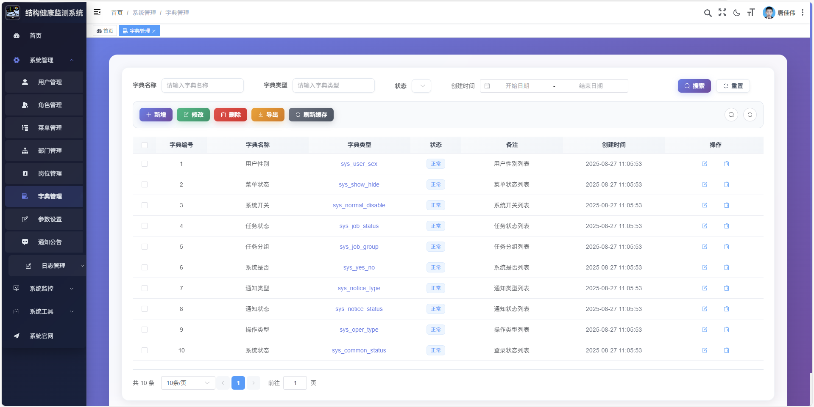

在 `E:\RuoYiProject\MoMagTracker-System\MoMagTracker-Vue3\src\views\system\dict\index.vue` 文件中加入下述代码

```java
<template>
   <div class="dict-management">
      <div class="main-card">
         <div class="content-block">
            <!-- 搜索区域 -->
            <div class="search-section">
               <el-form :model="queryParams" ref="queryRef" v-show="showSearch" :inline="true" class="search-form">
                  <el-form-item label="字典名称" prop="dictName">
                     <el-input
                        v-model="queryParams.dictName"
                        placeholder="请输入字典名称"
                        clearable
                        class="tech-input"
                        @keyup.enter="handleQuery"
                     />
                  </el-form-item>
                  <el-form-item label="字典类型" prop="dictType">
                     <el-input
                        v-model="queryParams.dictType"
                        placeholder="请输入字典类型"
                        clearable
                        class="tech-input"
                        @keyup.enter="handleQuery"
                     />
                  </el-form-item>
                  <el-form-item label="状态" prop="status">
                     <el-select
                        v-model="queryParams.status"
                        placeholder="字典状态"
                        clearable
                        class="tech-select"
                     >
                        <el-option
                           v-for="dict in sys_normal_disable"
                           :key="dict.value"
                           :label="dict.label"
                           :value="dict.value"
                        />
                     </el-select>
                  </el-form-item>
                  <el-form-item label="创建时间" class="date-range">
                     <el-date-picker
                        v-model="dateRange"
                        value-format="YYYY-MM-DD"
                        type="daterange"
                        range-separator="-"
                        start-placeholder="开始日期"
                        end-placeholder="结束日期"
                        class="tech-date-picker"
                     ></el-date-picker>
                  </el-form-item>
                  <el-form-item class="search-actions">
                     <el-button type="primary" icon="Search" @click="handleQuery" class="tech-btn primary">搜索</el-button>
                     <el-button icon="Refresh" @click="resetQuery" class="tech-btn secondary">重置</el-button>
                  </el-form-item>
               </el-form>
            </div>

            <!-- 操作按钮区域 -->
            <div class="action-section">
               <el-row :gutter="10">
                  <el-col :span="1.5">
                     <el-button
                        type="primary"
                        plain
                        icon="Plus"
                        @click="handleAdd"
                        v-hasPermi="['system:dict:add']"
                        class="tech-btn primary"
                     >新增</el-button>
                  </el-col>
                  <el-col :span="1.5">
                     <el-button
                        type="success"
                        plain
                        icon="Edit"
                        :disabled="single"
                        @click="handleUpdate"
                        v-hasPermi="['system:dict:edit']"
                        class="tech-btn success"
                     >修改</el-button>
                  </el-col>
                  <el-col :span="1.5">
                     <el-button
                        type="danger"
                        plain
                        icon="Delete"
                        :disabled="multiple"
                        @click="handleDelete"
                        v-hasPermi="['system:dict:remove']"
                        class="tech-btn danger"
                     >删除</el-button>
                  </el-col>
                  <el-col :span="1.5">
                     <el-button
                        type="warning"
                        plain
                        icon="Download"
                        @click="handleExport"
                        v-hasPermi="['system:dict:export']"
                        class="tech-btn warning"
                     >导出</el-button>
                  </el-col>
                  <el-col :span="1.5">
                     <el-button
                        type="info"
                        plain
                        icon="Refresh"
                        @click="handleRefreshCache"
                        v-hasPermi="['system:dict:remove']"
                        class="tech-btn info"
                     >刷新缓存</el-button>
                  </el-col>
                  <right-toolbar v-model:showSearch="showSearch" @queryTable="getList" class="right-toolbar"></right-toolbar>
               </el-row>
            </div>

            <!-- 表格区域 -->
            <div class="table-section">
               <el-table v-loading="loading" :data="typeList" @selection-change="handleSelectionChange" class="tech-table">
                  <el-table-column type="selection" width="55" align="center" />
                  <el-table-column label="字典编号" align="center" prop="dictId" width="120" />
                  <el-table-column label="字典名称" align="center" prop="dictName" :show-overflow-tooltip="true" width="240"/>
                  <el-table-column label="字典类型" align="center" :show-overflow-tooltip="true" width="240">
                     <template #default="scope">
                        <router-link :to="'/system/dict-data/index/' + scope.row.dictId" class="link-type">
                           <span class="dict-type-link">{{ scope.row.dictType }}</span>
                        </router-link>
                     </template>
                  </el-table-column>
                  <el-table-column label="状态" align="center" prop="status" width="120">
                     <template #default="scope">
                        <dict-tag :options="sys_normal_disable" :value="scope.row.status" class="status-tag" />
                     </template>
                  </el-table-column>
                  <el-table-column label="备注" align="center" prop="remark" :show-overflow-tooltip="true" width="240" />
                  <el-table-column label="创建时间" align="center" prop="createTime" width="240">
                     <template #default="scope">
                        <span class="time-text">{{ parseTime(scope.row.createTime) }}</span>
                     </template>
                  </el-table-column>
                  <el-table-column label="操作" align="center" width="240" class-name="small-padding fixed-width">
                     <template #default="scope">
                        <div class="action-buttons">
                           <el-tooltip content="修改" placement="top">
                              <el-button link type="primary" icon="Edit" @click="handleUpdate(scope.row)" v-hasPermi="['system:dict:edit']" class="action-btn edit"></el-button>
                           </el-tooltip>
                           <el-tooltip content="删除" placement="top">
                              <el-button link type="primary" icon="Delete" @click="handleDelete(scope.row)" v-hasPermi="['system:dict:remove']" class="action-btn delete"></el-button>
                           </el-tooltip>
                        </div>
                     </template>
                  </el-table-column>
               </el-table>

               <!-- 分页 -->
               <div class="pagination-section">
                  <pagination
                     v-show="total > 0"
                     :total="total"
                     v-model:page="queryParams.pageNum"
                     v-model:limit="queryParams.pageSize"
                     @pagination="getList"
                     class="tech-pagination"
                  />
               </div>
            </div>
         </div>
      </div>

      <!-- 添加或修改参数配置对话框 -->
      <el-dialog :title="title" v-model="open" width="500px" append-to-body class="tech-dialog">
         <el-form ref="dictRef" :model="form" :rules="rules" label-width="100px" class="tech-form">
            <el-form-item label="字典名称" prop="dictName">
               <el-input v-model="form.dictName" placeholder="请输入字典名称" class="tech-input" />
            </el-form-item>
            <el-form-item label="字典类型" prop="dictType">
               <el-input v-model="form.dictType" placeholder="请输入字典类型" class="tech-input" />
            </el-form-item>
            <el-form-item label="状态" prop="status">
               <el-radio-group v-model="form.status" class="tech-radio-group">
                  <el-radio
                     v-for="dict in sys_normal_disable"
                     :key="dict.value"
                     :value="dict.value"
                     class="tech-radio"
                  >{{ dict.label }}</el-radio>
               </el-radio-group>
            </el-form-item>
            <el-form-item label="备注" prop="remark">
               <el-input v-model="form.remark" type="textarea" placeholder="请输入内容" class="tech-textarea"></el-input>
            </el-form-item>
         </el-form>
         <template #footer>
            <div class="dialog-footer">
               <el-button type="primary" @click="submitForm" class="tech-btn primary">确 定</el-button>
               <el-button @click="cancel" class="tech-btn secondary">取 消</el-button>
            </div>
         </template>
      </el-dialog>
   </div>
</template>

<script setup name="Dict">
import useDictStore from '@/store/modules/dict'
import { listType, getType, delType, addType, updateType, refreshCache } from "@/api/system/dict/type"

const { proxy } = getCurrentInstance()
const { sys_normal_disable } = proxy.useDict("sys_normal_disable")

const typeList = ref([])
const open = ref(false)
const loading = ref(true)
const showSearch = ref(true)
const ids = ref([])
const single = ref(true)
const multiple = ref(true)
const total = ref(0)
const title = ref("")
const dateRange = ref([])

const data = reactive({
  form: {},
  queryParams: {
    pageNum: 1,
    pageSize: 10,
    dictName: undefined,
    dictType: undefined,
    status: undefined
  },
  rules: {
    dictName: [{ required: true, message: "字典名称不能为空", trigger: "blur" }],
    dictType: [{ required: true, message: "字典类型不能为空", trigger: "blur" }]
  },
})

const { queryParams, form, rules } = toRefs(data)

/** 查询字典类型列表 */
function getList() {
  loading.value = true
  listType(proxy.addDateRange(queryParams.value, dateRange.value)).then(response => {
    typeList.value = response.rows
    total.value = response.total
    loading.value = false
  })
}

/** 取消按钮 */
function cancel() {
  open.value = false
  reset()
}

/** 表单重置 */
function reset() {
  form.value = {
    dictId: undefined,
    dictName: undefined,
    dictType: undefined,
    status: "0",
    remark: undefined
  }
  proxy.resetForm("dictRef")
}

/** 搜索按钮操作 */
function handleQuery() {
  queryParams.value.pageNum = 1
  getList()
}

/** 重置按钮操作 */
function resetQuery() {
  dateRange.value = []
  proxy.resetForm("queryRef")
  handleQuery()
}

/** 新增按钮操作 */
function handleAdd() {
  reset()
  open.value = true
  title.value = "添加字典类型"
}

/** 多选框选中数据 */
function handleSelectionChange(selection) {
  ids.value = selection.map(item => item.dictId)
  single.value = selection.length != 1
  multiple.value = !selection.length
}

/** 修改按钮操作 */
function handleUpdate(row) {
  reset()
  const dictId = row.dictId || ids.value
  getType(dictId).then(response => {
    form.value = response.data
    open.value = true
    title.value = "修改字典类型"
  })
}

/** 提交按钮 */
function submitForm() {
  proxy.$refs["dictRef"].validate(valid => {
    if (valid) {
      if (form.value.dictId != undefined) {
        updateType(form.value).then(response => {
          proxy.$modal.msgSuccess("修改成功")
          open.value = false
          getList()
        })
      } else {
        addType(form.value).then(response => {
          proxy.$modal.msgSuccess("新增成功")
          open.value = false
          getList()
        })
      }
    }
  })
}

/** 删除按钮操作 */
function handleDelete(row) {
  const dictIds = row.dictId || ids.value
  proxy.$modal.confirm('是否确认删除字典编号为"' + dictIds + '"的数据项？').then(function() {
    return delType(dictIds)
  }).then(() => {
    getList()
    proxy.$modal.msgSuccess("删除成功")
  }).catch(() => {})
}

/** 导出按钮操作 */
function handleExport() {
  proxy.download("system/dict/type/export", {
    ...queryParams.value
  }, `dict_${new Date().getTime()}.xlsx`)
}

/** 刷新缓存按钮操作 */
function handleRefreshCache() {
  refreshCache().then(() => {
    proxy.$modal.msgSuccess("刷新成功")
    useDictStore().cleanDict()
  })
}

getList()
</script>

<style scoped lang="scss">
.dict-management {
  font-family: "Inter", "Helvetica Neue", Helvetica, "PingFang SC", "Hiragino Sans GB", "Microsoft YaHei", Arial, sans-serif;
  color: #2c3e50;
  background: linear-gradient(135deg, #667eea 0%, #764ba2 100%);
  min-height: 100vh;
  padding: 20px;
  display: flex;
  align-items: flex-start;
  justify-content: center;

  .main-card {
    background: rgba(255, 255, 255, 0.95);
    border-radius: 20px;
    box-shadow: 0 20px 60px rgba(0, 0, 0, 0.15);
    backdrop-filter: blur(20px);
    width: 100%;
    max-width: 1600px;
    padding: 30px;
    margin: 20px;
    min-height: auto;
    height: auto;

    .content-block {
      background: white;
      border-radius: 16px;
      padding: 25px;
      box-shadow: 0 4px 20px rgba(0, 0, 0, 0.08);
      border: 1px solid #f1f5f9;
      transition: all 0.3s ease;
      min-height: 700px;
      height: auto;

      &:hover {
        transform: translateY(-3px);
        box-shadow: 0 8px 30px rgba(0, 0, 0, 0.12);
      }

      // 搜索区域
      .search-section {
        margin-bottom: 20px;
        
        .search-form {
          display: flex;
          flex-wrap: wrap;
          gap: 15px;
          align-items: flex-end;

          .el-form-item {
            margin-bottom: 0;
          }

          .date-range {
            min-width: 240px;
          }

          .search-actions {
            margin-left: auto;
          }
        }
      }

      // 操作按钮区域
      .action-section {
        margin-bottom: 20px;
        padding: 15px;
        background: #f8fafc;
        border-radius: 12px;
        border: 1px solid #e2e8f0;

        .right-toolbar {
          margin-left: auto;
        }
      }

      // 表格区域
      .table-section {
        .pagination-section {
          margin-top: 20px;
          padding-top: 15px;
          border-top: 1px solid #e2e8f0;
        }

        .dict-type-link {
          color: #667eea;
          font-weight: 500;
          text-decoration: none;
          transition: all 0.3s ease;
          
          &:hover {
            color: #764ba2;
            text-decoration: underline;
          }
        }

        .status-tag {
          :deep(.el-tag) {
            border-radius: 6px;
            font-weight: 500;
          }
        }
      }
    }
  }

  // 科技感组件样式
  .tech-input {
    :deep(.el-input__wrapper) {
      border-radius: 8px;
      border: 1px solid #e2e8f0;
      transition: all 0.3s ease;
      box-shadow: 0 1px 3px rgba(0, 0, 0, 0.05);
      
      &:hover {
        border-color: #667eea;
        box-shadow: 0 2px 8px rgba(102, 126, 234, 0.1);
      }
      
      &.is-focus {
        border-color: #667eea;
        box-shadow: 0 0 0 2px rgba(102, 126, 234, 0.1);
      }
    }
  }

  .tech-select {
    :deep(.el-select__wrapper) {
      border-radius: 8px;
      border: 1px solid #e2e8f0;
      transition: all 0.3s ease;
      box-shadow: 0 1px 3px rgba(0, 0, 0, 0.05);
      
      &:hover {
        border-color: #667eea;
      }
    }
  }

  .tech-date-picker {
    :deep(.el-input__wrapper) {
      border-radius: 8px;
      border: 1px solid #e2e8f0;
      transition: all 0.3s ease;
      
      &:hover {
        border-color: #667eea;
      }
    }
  }

  .tech-btn {
    border-radius: 8px;
    font-weight: 600;
    transition: all 0.3s ease;
    border: none;
    
    &.primary {
      background: linear-gradient(135deg, #667eea 0%, #764ba2 100%);
      color: white;
      box-shadow: 0 4px 15px rgba(102, 126, 234, 0.3);

      &:hover {
        transform: translateY(-2px);
        box-shadow: 0 8px 25px rgba(102, 126, 234, 0.4);
      }
    }

    &.secondary {
      background: white;
      border: 1px solid #e2e8f0;
      color: #475569;
      box-shadow: 0 2px 6px rgba(0, 0, 0, 0.05);

      &:hover {
        transform: translateY(-2px);
        border-color: #667eea;
        color: #667eea;
        box-shadow: 0 4px 12px rgba(0, 0, 0, 0.1);
      }
    }

    &.success {
      background: linear-gradient(135deg, #10b981 0%, #059669 100%);
      color: white;
      box-shadow: 0 4px 15px rgba(16, 185, 129, 0.3);

      &:hover {
        transform: translateY(-2px);
        box-shadow: 0 8px 25px rgba(16, 185, 129, 0.4);
      }
    }

    &.danger {
      background: linear-gradient(135deg, #ef4444 0%, #dc2626 100%);
      color: white;
      box-shadow: 0 4px 15px rgba(239, 68, 68, 0.3);

      &:hover {
        transform: translateY(-2px);
        box-shadow: 0 8px 25px rgba(239, 68, 68, 0.4);
      }
    }

    &.warning {
      background: linear-gradient(135deg, #f59e0b 0%, #d97706 100%);
      color: white;
      box-shadow: 0 4px 15px rgba(245, 158, 11, 0.3);

      &:hover {
        transform: translateY(-2px);
        box-shadow: 0 8px 25px rgba(245, 158, 11, 0.4);
      }
    }

    &.info {
      background: linear-gradient(135deg, #6b7280 0%, #4b5563 100%);
      color: white;
      box-shadow: 0 4px 15px rgba(107, 114, 128, 0.3);

      &:hover {
        transform: translateY(-2px);
        box-shadow: 0 8px 25px rgba(107, 114, 128, 0.4);
      }
    }
  }

  .tech-table {
    :deep(.el-table__header) {
      th {
        background: linear-gradient(135deg, #f8fafc 0%, #f1f5f9 100%);
        color: #374151;
        font-weight: 600;
      }
    }

    :deep(.el-table__row) {
      transition: all 0.3s ease;
      
      &:hover {
        transform: translateY(-1px);
        box-shadow: 0 2px 8px rgba(0, 0, 0, 0.1);
      }
    }
  }

  .action-buttons {
    display: flex;
    justify-content: center;
    gap: 8px;

    .action-btn {
      width: 32px;
      height: 32px;
      border-radius: 6px;
      display: flex;
      align-items: center;
      justify-content: center;
      transition: all 0.3s ease;

      &:hover {
        transform: scale(1.1);
        background: #f1f5f9;
      }
    }
  }

  .time-text {
    color: #6b7280;
    font-size: 0.9rem;
  }

  .tech-dialog {
    :deep(.el-dialog) {
      border-radius: 16px;
      box-shadow: 0 20px 60px rgba(0, 0, 0, 0.2);
      
      .el-dialog__header {
        border-bottom: 1px solid #e2e8f0;
        margin-right: 0;
        
        .el-dialog__title {
          font-weight: 700;
          color: #1e293b;
        }
      }
      
      .el-dialog__body {
        padding: 20px;
      }
    }
  }

  .tech-form {
    .el-form-item {
      margin-bottom: 20px;
    }
    
    .el-form-item__label {
      font-weight: 600;
      color: #374151;
    }
  }

  .tech-radio-group {
    :deep(.el-radio) {
      margin-right: 20px;
    }
  }

  .tech-radio {
    :deep(.el-radio__input.is-checked .el-radio__inner) {
      background: linear-gradient(135deg, #667eea 0%, #764ba2 100%);
      border-color: #667eea;
    }
    
    :deep(.el-radio__label) {
      color: #374151;
      font-weight: 500;
    }
  }

  .tech-textarea {
    :deep(.el-textarea__inner) {
      border-radius: 8px;
      border: 1px solid #e2e8f0;
      transition: all 0.3s ease;
      
      &:focus {
        border-color: #667eea;
        box-shadow: 0 0 0 2px rgba(102, 126, 234, 0.1);
      }
    }
  }

  .tech-pagination {
    :deep(.el-pagination) {
      .btn-prev, .btn-next, .number, .more {
        border-radius: 6px;
        margin: 0 2px;
      }
      
      .number.active {
        background: linear-gradient(135deg, #667eea 0%, #764ba2 100%);
        color: white;
        border: none;
      }
    }
  }
}

// 响应式设计
@media (max-width: 1024px) {
  .dict-management {
    .main-card {
      padding: 25px;
      margin: 15px;
    }
  }
}

@media (max-width: 768px) {
  .dict-management {
    padding: 15px;

    .main-card {
      padding: 20px;

      .content-block {
        padding: 20px;
        min-height: 400px;

        .search-section {
          .search-form {
            flex-direction: column;
            align-items: stretch;
            
            .search-actions {
              margin-left: 0;
              text-align: center;
            }
          }
        }

        .action-section {
          .el-col {
            margin-bottom: 10px;
          }
        }
      }
    }
  }
}

@media (max-width: 480px) {
  .dict-management {
    padding: 10px;

    .main-card {
      padding: 15px;
      margin: 10px;

      .content-block {
        padding: 15px;
        min-height: 350px;
      }
    }
  }
}
</style>
```

#### 2.3.4.7 参数设置（/config/index.vue）

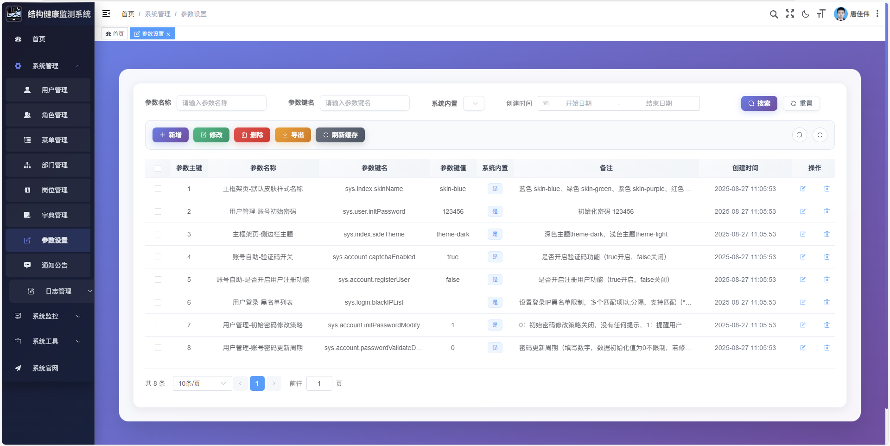

在 `E:\RuoYiProject\MoMagTracker-System\MoMagTracker-Vue3\src\views\system\config\index.vue` 文件中加入下述代码

```java
<template>
   <div class="config-management">
      <div class="main-card">
         <div class="content-block">
            <!-- 搜索区域 -->
            <div class="search-section">
               <el-form :model="queryParams" ref="queryRef" v-show="showSearch" :inline="true" class="search-form">
                  <el-form-item label="参数名称" prop="configName">
                     <el-input
                        v-model="queryParams.configName"
                        placeholder="请输入参数名称"
                        clearable
                        class="tech-input"
                        @keyup.enter="handleQuery"
                     />
                  </el-form-item>
                  <el-form-item label="参数键名" prop="configKey">
                     <el-input
                        v-model="queryParams.configKey"
                        placeholder="请输入参数键名"
                        clearable
                        class="tech-input"
                        @keyup.enter="handleQuery"
                     />
                  </el-form-item>
                  <el-form-item label="系统内置" prop="configType">
                     <el-select 
                        v-model="queryParams.configType" 
                        placeholder="系统内置" 
                        clearable 
                        class="tech-select"
                     >
                        <el-option
                           v-for="dict in sys_yes_no"
                           :key="dict.value"
                           :label="dict.label"
                           :value="dict.value"
                        />
                     </el-select>
                  </el-form-item>
                  <el-form-item label="创建时间" class="date-range">
                     <el-date-picker
                        v-model="dateRange"
                        value-format="YYYY-MM-DD"
                        type="daterange"
                        range-separator="-"
                        start-placeholder="开始日期"
                        end-placeholder="结束日期"
                        class="tech-date-picker"
                     ></el-date-picker>
                  </el-form-item>
                  <el-form-item class="search-actions">
                     <el-button type="primary" icon="Search" @click="handleQuery" class="tech-btn primary">搜索</el-button>
                     <el-button icon="Refresh" @click="resetQuery" class="tech-btn secondary">重置</el-button>
                  </el-form-item>
               </el-form>
            </div>

            <!-- 操作按钮区域 -->
            <div class="action-section">
               <el-row :gutter="10">
                  <el-col :span="1.5">
                     <el-button
                        type="primary"
                        plain
                        icon="Plus"
                        @click="handleAdd"
                        v-hasPermi="['system:config:add']"
                        class="tech-btn primary"
                     >新增</el-button>
                  </el-col>
                  <el-col :span="1.5">
                     <el-button
                        type="success"
                        plain
                        icon="Edit"
                        :disabled="single"
                        @click="handleUpdate"
                        v-hasPermi="['system:config:edit']"
                        class="tech-btn success"
                     >修改</el-button>
                  </el-col>
                  <el-col :span="1.5">
                     <el-button
                        type="danger"
                        plain
                        icon="Delete"
                        :disabled="multiple"
                        @click="handleDelete"
                        v-hasPermi="['system:config:remove']"
                        class="tech-btn danger"
                     >删除</el-button>
                  </el-col>
                  <el-col :span="1.5">
                     <el-button
                        type="warning"
                        plain
                        icon="Download"
                        @click="handleExport"
                        v-hasPermi="['system:config:export']"
                        class="tech-btn warning"
                     >导出</el-button>
                  </el-col>
                  <el-col :span="1.5">
                     <el-button
                        type="info"
                        plain
                        icon="Refresh"
                        @click="handleRefreshCache"
                        v-hasPermi="['system:config:remove']"
                        class="tech-btn info"
                     >刷新缓存</el-button>
                  </el-col>
                  <right-toolbar v-model:showSearch="showSearch" @queryTable="getList" class="right-toolbar"></right-toolbar>
               </el-row>
            </div>

            <!-- 表格区域 -->
            <div class="table-section">
               <el-table v-loading="loading" :data="configList" @selection-change="handleSelectionChange" class="tech-table">
                  <el-table-column type="selection" width="55" align="center" />
                  <el-table-column label="参数主键" align="center" prop="configId" width="80" />
                  <el-table-column label="参数名称" align="center" prop="configName" :show-overflow-tooltip="true" width="240" />
                  <el-table-column label="参数键名" align="center" prop="configKey" :show-overflow-tooltip="true" width="240" />
                  <el-table-column label="参数键值" align="center" prop="configValue" :show-overflow-tooltip="true" width="100" />
                  <el-table-column label="系统内置" align="center" prop="configType" width="80">
                     <template #default="scope">
                        <dict-tag :options="sys_yes_no" :value="scope.row.configType" class="status-tag" />
                     </template>
                  </el-table-column>
                  <el-table-column label="备注" align="center" prop="remark" :show-overflow-tooltip="true" width="400" />
                  <el-table-column label="创建时间" align="center" prop="createTime" width="200">
                     <template #default="scope">
                        <span class="time-text">{{ parseTime(scope.row.createTime) }}</span>
                     </template>
                  </el-table-column>
                  <el-table-column label="操作" align="center" width="100" class-name="small-padding fixed-width">
                     <template #default="scope">
                        <div class="action-buttons">
                           <el-tooltip content="修改" placement="top">
                              <el-button link type="primary" icon="Edit" @click="handleUpdate(scope.row)" v-hasPermi="['system:config:edit']" class="action-btn edit"></el-button>
                           </el-tooltip>
                           <el-tooltip content="删除" placement="top">
                              <el-button link type="primary" icon="Delete" @click="handleDelete(scope.row)" v-hasPermi="['system:config:remove']" class="action-btn delete"></el-button>
                           </el-tooltip>
                        </div>
                     </template>
                  </el-table-column>
               </el-table>

               <!-- 分页 -->
               <div class="pagination-section">
                  <pagination
                     v-show="total > 0"
                     :total="total"
                     v-model:page="queryParams.pageNum"
                     v-model:limit="queryParams.pageSize"
                     @pagination="getList"
                     class="tech-pagination"
                  />
               </div>
            </div>
         </div>
      </div>

      <!-- 添加或修改参数配置对话框 -->
      <el-dialog :title="title" v-model="open" width="500px" append-to-body class="tech-dialog">
         <el-form ref="configRef" :model="form" :rules="rules" label-width="100px" class="tech-form">
            <el-form-item label="参数名称" prop="configName">
               <el-input v-model="form.configName" placeholder="请输入参数名称" class="tech-input" />
            </el-form-item>
            <el-form-item label="参数键名" prop="configKey">
               <el-input v-model="form.configKey" placeholder="请输入参数键名" class="tech-input" />
            </el-form-item>
            <el-form-item label="参数键值" prop="configValue">
               <el-input v-model="form.configValue" type="textarea" placeholder="请输入参数键值" class="tech-textarea" />
            </el-form-item>
            <el-form-item label="系统内置" prop="configType">
               <el-radio-group v-model="form.configType" class="tech-radio-group">
                  <el-radio
                     v-for="dict in sys_yes_no"
                     :key="dict.value"
                     :value="dict.value"
                     class="tech-radio"
                  >{{ dict.label }}</el-radio>
               </el-radio-group>
            </el-form-item>
            <el-form-item label="备注" prop="remark">
               <el-input v-model="form.remark" type="textarea" placeholder="请输入内容" class="tech-textarea" />
            </el-form-item>
         </el-form>
         <template #footer>
            <div class="dialog-footer">
               <el-button type="primary" @click="submitForm" class="tech-btn primary">确 定</el-button>
               <el-button @click="cancel" class="tech-btn secondary">取 消</el-button>
            </div>
         </template>
      </el-dialog>
   </div>
</template>

<script setup name="Config">
import { listConfig, getConfig, delConfig, addConfig, updateConfig, refreshCache } from "@/api/system/config"

const { proxy } = getCurrentInstance()
const { sys_yes_no } = proxy.useDict("sys_yes_no")

const configList = ref([])
const open = ref(false)
const loading = ref(true)
const showSearch = ref(true)
const ids = ref([])
const single = ref(true)
const multiple = ref(true)
const total = ref(0)
const title = ref("")
const dateRange = ref([])

const data = reactive({
  form: {},
  queryParams: {
    pageNum: 1,
    pageSize: 10,
    configName: undefined,
    configKey: undefined,
    configType: undefined
  },
  rules: {
    configName: [{ required: true, message: "参数名称不能为空", trigger: "blur" }],
    configKey: [{ required: true, message: "参数键名不能为空", trigger: "blur" }],
    configValue: [{ required: true, message: "参数键值不能为空", trigger: "blur" }]
  }
})

const { queryParams, form, rules } = toRefs(data)

/** 查询参数列表 */
function getList() {
  loading.value = true
  listConfig(proxy.addDateRange(queryParams.value, dateRange.value)).then(response => {
    configList.value = response.rows
    total.value = response.total
    loading.value = false
  })
}

/** 取消按钮 */
function cancel() {
  open.value = false
  reset()
}

/** 表单重置 */
function reset() {
  form.value = {
    configId: undefined,
    configName: undefined,
    configKey: undefined,
    configValue: undefined,
    configType: "Y",
    remark: undefined
  }
  proxy.resetForm("configRef")
}

/** 搜索按钮操作 */
function handleQuery() {
  queryParams.value.pageNum = 1
  getList()
}

/** 重置按钮操作 */
function resetQuery() {
  dateRange.value = []
  proxy.resetForm("queryRef")
  handleQuery()
}

/** 多选框选中数据 */
function handleSelectionChange(selection) {
  ids.value = selection.map(item => item.configId)
  single.value = selection.length != 1
  multiple.value = !selection.length
}

/** 新增按钮操作 */
function handleAdd() {
  reset()
  open.value = true
  title.value = "添加参数"
}

/** 修改按钮操作 */
function handleUpdate(row) {
  reset()
  const configId = row.configId || ids.value
  getConfig(configId).then(response => {
    form.value = response.data
    open.value = true
    title.value = "修改参数"
  })
}

/** 提交按钮 */
function submitForm() {
  proxy.$refs["configRef"].validate(valid => {
    if (valid) {
      if (form.value.configId != undefined) {
        updateConfig(form.value).then(response => {
          proxy.$modal.msgSuccess("修改成功")
          open.value = false
          getList()
        })
      } else {
        addConfig(form.value).then(response => {
          proxy.$modal.msgSuccess("新增成功")
          open.value = false
          getList()
        })
      }
    }
  })
}

/** 删除按钮操作 */
function handleDelete(row) {
  const configIds = row.configId || ids.value
  proxy.$modal.confirm('是否确认删除参数编号为"' + configIds + '"的数据项？').then(function () {
    return delConfig(configIds)
  }).then(() => {
    getList()
    proxy.$modal.msgSuccess("删除成功")
  }).catch(() => {})
}

/** 导出按钮操作 */
function handleExport() {
  proxy.download("system/config/export", {
    ...queryParams.value
  }, `config_${new Date().getTime()}.xlsx`)
}

/** 刷新缓存按钮操作 */
function handleRefreshCache() {
  refreshCache().then(() => {
    proxy.$modal.msgSuccess("刷新缓存成功")
  })
}

getList()
</script>

<style scoped lang="scss">
.config-management {
  font-family: "Inter", "Helvetica Neue", Helvetica, "PingFang SC", "Hiragino Sans GB", "Microsoft YaHei", Arial, sans-serif;
  color: #2c3e50;
  background: linear-gradient(135deg, #667eea 0%, #764ba2 100%);
  min-height: 100vh;
  padding: 40px;
  display: flex;
  align-items: flex-start;
  justify-content: center;

  .main-card {
    background: rgba(255, 255, 255, 0.95);
    border-radius: 20px;
    box-shadow: 0 20px 60px rgba(0, 0, 0, 0.15);
    backdrop-filter: blur(20px);
    width: 100%;
    max-width: 1600px;
    padding: 30px;
    margin: 20px;
    min-height: auto;
    height: auto;

    .content-block {
      background: white;
      border-radius: 16px;
      padding: 25px;
      box-shadow: 0 4px 20px rgba(0, 0, 0, 0.08);
      border: 1px solid #f1f5f9;
      transition: all 0.3s ease;
      min-height: 700px;
      height: auto;

      &:hover {
        transform: translateY(-3px);
        box-shadow: 0 8px 30px rgba(0, 0, 0, 0.12);
      }

      // 搜索区域
      .search-section {
        margin-bottom: 20px;
        
        .search-form {
          display: flex;
          flex-wrap: wrap;
          gap: 15px;
          align-items: flex-end;

          .el-form-item {
            margin-bottom: 0;
          }

          .date-range {
            min-width: 240px;
          }

          .search-actions {
            margin-left: auto;
          }
        }
      }

      // 操作按钮区域
      .action-section {
        margin-bottom: 20px;
        padding: 15px;
        background: #f8fafc;
        border-radius: 12px;
        border: 1px solid #e2e8f0;

        .right-toolbar {
          margin-left: auto;
        }
      }

      // 表格区域
      .table-section {
        .pagination-section {
          margin-top: 20px;
          padding-top: 15px;
          border-top: 1px solid #e2e8f0;
        }

        .status-tag {
          :deep(.el-tag) {
            border-radius: 6px;
            font-weight: 500;
          }
        }
      }
    }
  }

  // 科技感组件样式
  .tech-input {
    :deep(.el-input__wrapper) {
      border-radius: 8px;
      border: 1px solid #e2e8f0;
      transition: all 0.3s ease;
      box-shadow: 0 1px 3px rgba(0, 0, 0, 0.05);
      
      &:hover {
        border-color: #667eea;
        box-shadow: 0 2px 8px rgba(102, 126, 234, 0.1);
      }
      
      &.is-focus {
        border-color: #667eea;
        box-shadow: 0 0 0 2px rgba(102, 126, 234, 0.1);
      }
    }
  }

  .tech-select {
    :deep(.el-select__wrapper) {
      border-radius: 8px;
      border: 1px solid #e2e8f0;
      transition: all 0.3s ease;
      box-shadow: 0 1px 3px rgba(0, 0, 0, 0.05);
      
      &:hover {
        border-color: #667eea;
      }
    }
  }

  .tech-date-picker {
    :deep(.el-input__wrapper) {
      border-radius: 8px;
      border: 1px solid #e2e8f0;
      transition: all 0.3s ease;
      
      &:hover {
        border-color: #667eea;
      }
    }
  }

  .tech-btn {
    border-radius: 8px;
    font-weight: 600;
    transition: all 0.3s ease;
    border: none;
    
    &.primary {
      background: linear-gradient(135deg, #667eea 0%, #764ba2 100%);
      color: white;
      box-shadow: 0 4px 15px rgba(102, 126, 234, 0.3);

      &:hover {
        transform: translateY(-2px);
        box-shadow: 0 8px 25px rgba(102, 126, 234, 0.4);
      }
    }

    &.secondary {
      background: white;
      border: 1px solid #e2e8f0;
      color: #475569;
      box-shadow: 0 2px 6px rgba(0, 0, 0, 0.05);

      &:hover {
        transform: translateY(-2px);
        border-color: #667eea;
        color: #667eea;
        box-shadow: 0 4px 12px rgba(0, 0, 0, 0.1);
      }
    }

    &.success {
      background: linear-gradient(135deg, #10b981 0%, #059669 100%);
      color: white;
      box-shadow: 0 4px 15px rgba(16, 185, 129, 0.3);

      &:hover {
        transform: translateY(-2px);
        box-shadow: 0 8px 25px rgba(16, 185, 129, 0.4);
      }
    }

    &.danger {
      background: linear-gradient(135deg, #ef4444 0%, #dc2626 100%);
      color: white;
      box-shadow: 0 4px 15px rgba(239, 68, 68, 0.3);

      &:hover {
        transform: translateY(-2px);
        box-shadow: 0 8px 25px rgba(239, 68, 68, 0.4);
      }
    }

    &.warning {
      background: linear-gradient(135deg, #f59e0b 0%, #d97706 100%);
      color: white;
      box-shadow: 0 4px 15px rgba(245, 158, 11, 0.3);

      &:hover {
        transform: translateY(-2px);
        box-shadow: 0 8px 25px rgba(245, 158, 11, 0.4);
      }
    }

    &.info {
      background: linear-gradient(135deg, #6b7280 0%, #4b5563 100%);
      color: white;
      box-shadow: 0 4px 15px rgba(107, 114, 128, 0.3);

      &:hover {
        transform: translateY(-2px);
        box-shadow: 0 8px 25px rgba(107, 114, 128, 0.4);
      }
    }
  }

  .tech-table {
    :deep(.el-table__header) {
      th {
        background: linear-gradient(135deg, #f8fafc 0%, #f1f5f9 100%);
        color: #374151;
        font-weight: 600;
      }
    }

    :deep(.el-table__row) {
      transition: all 0.3s ease;
      
      &:hover {
        transform: translateY(-1px);
        box-shadow: 0 2px 8px rgba(0, 0, 0, 0.1);
      }
    }
  }

  .action-buttons {
    display: flex;
    justify-content: center;
    gap: 8px;

    .action-btn {
      width: 32px;
      height: 32px;
      border-radius: 6px;
      display: flex;
      align-items: center;
      justify-content: center;
      transition: all 0.3s ease;

      &:hover {
        transform: scale(1.1);
        background: #f1f5f9;
      }
    }
  }

  .time-text {
    color: #6b7280;
    font-size: 0.9rem;
  }

  .tech-dialog {
    :deep(.el-dialog) {
      border-radius: 16px;
      box-shadow: 0 20px 60px rgba(0, 0, 0, 0.2);
      
      .el-dialog__header {
        border-bottom: 1px solid #e2e8f0;
        margin-right: 0;
        
        .el-dialog__title {
          font-weight: 700;
          color: #1e293b;
        }
      }
      
      .el-dialog__body {
        padding: 20px;
      }
    }
  }

  .tech-form {
    .el-form-item {
      margin-bottom: 20px;
    }
    
    .el-form-item__label {
      font-weight: 600;
      color: #374151;
    }
  }

  .tech-radio-group {
    :deep(.el-radio) {
      margin-right: 20px;
    }
  }

  .tech-radio {
    :deep(.el-radio__input.is-checked .el-radio__inner) {
      background: linear-gradient(135deg, #667eea 0%, #764ba2 100%);
      border-color: #667eea;
    }
    
    :deep(.el-radio__label) {
      color: #374151;
      font-weight: 500;
    }
  }

  .tech-textarea {
    :deep(.el-textarea__inner) {
      border-radius: 8px;
      border: 1px solid #e2e8f0;
      transition: all 0.3s ease;
      min-height: 80px;
      
      &:focus {
        border-color: #667eea;
        box-shadow: 0 0 0 2px rgba(102, 126, 234, 0.1);
      }
    }
  }

  .tech-pagination {
    :deep(.el-pagination) {
      .btn-prev, .btn-next, .number, .more {
        border-radius: 6px;
        margin: 0 2px;
      }
      
      .number.active {
        background: linear-gradient(135deg, #667eea 0%, #764ba2 100%);
        color: white;
        border: none;
      }
    }
  }
}

// 响应式设计
@media (max-width: 1024px) {
  .config-management {
    .main-card {
      padding: 25px;
      margin: 15px;
    }
  }
}

@media (max-width: 768px) {
  .config-management {
    padding: 15px;

    .main-card {
      padding: 20px;

      .content-block {
        padding: 20px;
        min-height: 400px;

        .search-section {
          .search-form {
            flex-direction: column;
            align-items: stretch;
            
            .search-actions {
              margin-left: 0;
              text-align: center;
            }
          }
        }

        .action-section {
          .el-col {
            margin-bottom: 10px;
          }
        }
      }
    }
  }
}

@media (max-width: 480px) {
  .config-management {
    padding: 10px;

    .main-card {
      padding: 15px;
      margin: 10px;

      .content-block {
        padding: 15px;
        min-height: 350px;
      }
    }
  }
}
</style>
```

#### 2.3.4.8 通知公告（/notice/index.vue）

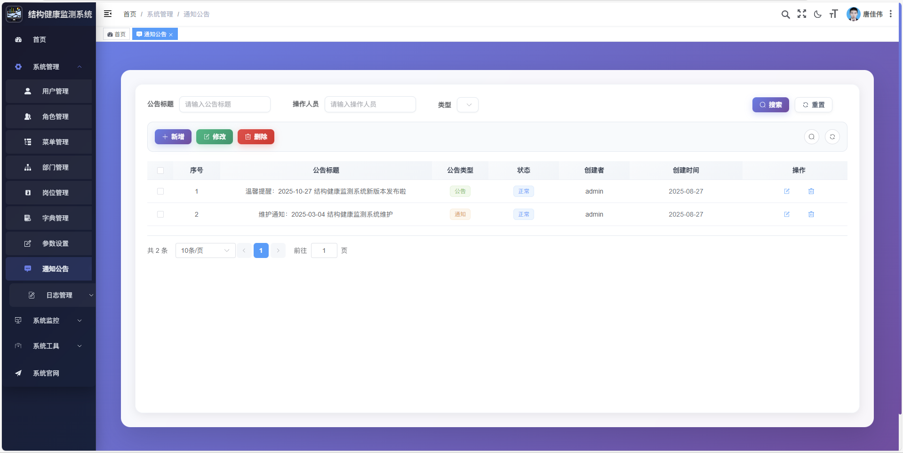

在 `E:\RuoYiProject\MoMagTracker-System\MoMagTracker-Vue3\src\views\system\notice\index.vue` 文件中加入下述代码

```java
<template>
   <div class="notice-management">
      <div class="main-card">
         <div class="content-block">
            <!-- 搜索区域 -->
            <div class="search-section">
               <el-form :model="queryParams" ref="queryRef" v-show="showSearch" :inline="true" class="search-form">
                  <el-form-item label="公告标题" prop="noticeTitle">
                     <el-input
                        v-model="queryParams.noticeTitle"
                        placeholder="请输入公告标题"
                        clearable
                        class="tech-input"
                        @keyup.enter="handleQuery"
                     />
                  </el-form-item>
                  <el-form-item label="操作人员" prop="createBy">
                     <el-input
                        v-model="queryParams.createBy"
                        placeholder="请输入操作人员"
                        clearable
                        class="tech-input"
                        @keyup.enter="handleQuery"
                     />
                  </el-form-item>
                  <el-form-item label="类型" prop="noticeType">
                     <el-select 
                        v-model="queryParams.noticeType" 
                        placeholder="公告类型" 
                        clearable 
                        class="tech-select"
                     >
                        <el-option
                           v-for="dict in sys_notice_type"
                           :key="dict.value"
                           :label="dict.label"
                           :value="dict.value"
                        />
                     </el-select>
                  </el-form-item>
                  <el-form-item class="search-actions">
                     <el-button type="primary" icon="Search" @click="handleQuery" class="tech-btn primary">搜索</el-button>
                     <el-button icon="Refresh" @click="resetQuery" class="tech-btn secondary">重置</el-button>
                  </el-form-item>
               </el-form>
            </div>

            <!-- 操作按钮区域 -->
            <div class="action-section">
               <el-row :gutter="10">
                  <el-col :span="1.5">
                     <el-button
                        type="primary"
                        plain
                        icon="Plus"
                        @click="handleAdd"
                        v-hasPermi="['system:notice:add']"
                        class="tech-btn primary"
                     >新增</el-button>
                  </el-col>
                  <el-col :span="1.5">
                     <el-button
                        type="success"
                        plain
                        icon="Edit"
                        :disabled="single"
                        @click="handleUpdate"
                        v-hasPermi="['system:notice:edit']"
                        class="tech-btn success"
                     >修改</el-button>
                  </el-col>
                  <el-col :span="1.5">
                     <el-button
                        type="danger"
                        plain
                        icon="Delete"
                        :disabled="multiple"
                        @click="handleDelete"
                        v-hasPermi="['system:notice:remove']"
                        class="tech-btn danger"
                     >删除</el-button>
                  </el-col>
                  <right-toolbar v-model:showSearch="showSearch" @queryTable="getList" class="right-toolbar"></right-toolbar>
               </el-row>
            </div>

            <!-- 表格区域 -->
            <div class="table-section">
               <el-table v-loading="loading" :data="noticeList" @selection-change="handleSelectionChange" class="tech-table">
                  <el-table-column type="selection" width="55" align="center" />
                  <el-table-column label="序号" align="center" prop="noticeId" width="100" />
                  <el-table-column
                     label="公告标题"
                     align="center"
                     prop="noticeTitle"
                     :show-overflow-tooltip="true"
                     width="450"
                  />
                  <el-table-column label="公告类型" align="center" prop="noticeType" width="120">
                     <template #default="scope">
                        <dict-tag :options="sys_notice_type" :value="scope.row.noticeType" class="status-tag" />
                     </template>
                  </el-table-column>
                  <el-table-column label="状态" align="center" prop="status" width="150">
                     <template #default="scope">
                        <dict-tag :options="sys_notice_status" :value="scope.row.status" class="status-tag" />
                     </template>
                  </el-table-column>
                  <el-table-column label="创建者" align="center" prop="createBy" width="150" />
                  <el-table-column label="创建时间" align="center" prop="createTime" width="240">
                     <template #default="scope">
                        <span class="time-text">{{ parseTime(scope.row.createTime, '{y}-{m}-{d}') }}</span>
                     </template>
                  </el-table-column>
                  <el-table-column label="操作" align="center" width="240" class-name="small-padding fixed-width">
                     <template #default="scope">
                        <div class="action-buttons">
                           <el-tooltip content="修改" placement="top">
                              <el-button link type="primary" icon="Edit" @click="handleUpdate(scope.row)" v-hasPermi="['system:notice:edit']" class="action-btn edit"></el-button>
                           </el-tooltip>
                           <el-tooltip content="删除" placement="top">
                              <el-button link type="primary" icon="Delete" @click="handleDelete(scope.row)" v-hasPermi="['system:notice:remove']" class="action-btn delete"></el-button>
                           </el-tooltip>
                        </div>
                     </template>
                  </el-table-column>
               </el-table>

               <!-- 分页 -->
               <div class="pagination-section">
                  <pagination
                     v-show="total > 0"
                     :total="total"
                     v-model:page="queryParams.pageNum"
                     v-model:limit="queryParams.pageSize"
                     @pagination="getList"
                     class="tech-pagination"
                  />
               </div>
            </div>
         </div>
      </div>

      <!-- 添加或修改公告对话框 -->
      <el-dialog :title="title" v-model="open" width="780px" append-to-body class="tech-dialog">
         <el-form ref="noticeRef" :model="form" :rules="rules" label-width="100px" class="tech-form">
            <el-row :gutter="20">
               <el-col :span="12">
                  <el-form-item label="公告标题" prop="noticeTitle">
                     <el-input v-model="form.noticeTitle" placeholder="请输入公告标题" class="tech-input" />
                  </el-form-item>
               </el-col>
               <el-col :span="12">
                  <el-form-item label="公告类型" prop="noticeType">
                     <el-select v-model="form.noticeType" placeholder="请选择" class="tech-select">
                        <el-option
                           v-for="dict in sys_notice_type"
                           :key="dict.value"
                           :label="dict.label"
                           :value="dict.value"
                        ></el-option>
                     </el-select>
                  </el-form-item>
               </el-col>
               <el-col :span="24">
                  <el-form-item label="状态" class="status-radio">
                     <el-radio-group v-model="form.status" class="tech-radio-group">
                        <el-radio
                           v-for="dict in sys_notice_status"
                           :key="dict.value"
                           :value="dict.value"
                           class="tech-radio"
                        >{{ dict.label }}</el-radio>
                     </el-radio-group>
                  </el-form-item>
               </el-col>
               <el-col :span="24">
                  <el-form-item label="内容" class="editor-item">
                    <editor v-model="form.noticeContent" :min-height="192" class="tech-editor"/>
                  </el-form-item>
               </el-col>
            </el-row>
         </el-form>
         <template #footer>
            <div class="dialog-footer">
               <el-button type="primary" @click="submitForm" class="tech-btn primary">确 定</el-button>
               <el-button @click="cancel" class="tech-btn secondary">取 消</el-button>
            </div>
         </template>
      </el-dialog>
   </div>
</template>

<script setup name="Notice">
import { listNotice, getNotice, delNotice, addNotice, updateNotice } from "@/api/system/notice"

const { proxy } = getCurrentInstance()
const { sys_notice_status, sys_notice_type } = proxy.useDict("sys_notice_status", "sys_notice_type")

const noticeList = ref([])
const open = ref(false)
const loading = ref(true)
const showSearch = ref(true)
const ids = ref([])
const single = ref(true)
const multiple = ref(true)
const total = ref(0)
const title = ref("")

const data = reactive({
  form: {},
  queryParams: {
    pageNum: 1,
    pageSize: 10,
    noticeTitle: undefined,
    createBy: undefined,
    status: undefined
  },
  rules: {
    noticeTitle: [{ required: true, message: "公告标题不能为空", trigger: "blur" }],
    noticeType: [{ required: true, message: "公告类型不能为空", trigger: "change" }]
  },
})

const { queryParams, form, rules } = toRefs(data)

/** 查询公告列表 */
function getList() {
  loading.value = true
  listNotice(queryParams.value).then(response => {
    noticeList.value = response.rows
    total.value = response.total
    loading.value = false
  })
}

/** 取消按钮 */
function cancel() {
  open.value = false
  reset()
}

/** 表单重置 */
function reset() {
  form.value = {
    noticeId: undefined,
    noticeTitle: undefined,
    noticeType: undefined,
    noticeContent: undefined,
    status: "0"
  }
  proxy.resetForm("noticeRef")
}

/** 搜索按钮操作 */
function handleQuery() {
  queryParams.value.pageNum = 1
  getList()
}

/** 重置按钮操作 */
function resetQuery() {
  proxy.resetForm("queryRef")
  handleQuery()
}

/** 多选框选中数据 */
function handleSelectionChange(selection) {
  ids.value = selection.map(item => item.noticeId)
  single.value = selection.length != 1
  multiple.value = !selection.length
}

/** 新增按钮操作 */
function handleAdd() {
  reset()
  open.value = true
  title.value = "添加公告"
}

/**修改按钮操作 */
function handleUpdate(row) {
  reset()
  const noticeId = row.noticeId || ids.value
  getNotice(noticeId).then(response => {
    form.value = response.data
    open.value = true
    title.value = "修改公告"
  })
}

/** 提交按钮 */
function submitForm() {
  proxy.$refs["noticeRef"].validate(valid => {
    if (valid) {
      if (form.value.noticeId != undefined) {
        updateNotice(form.value).then(response => {
          proxy.$modal.msgSuccess("修改成功")
          open.value = false
          getList()
        })
      } else {
        addNotice(form.value).then(response => {
          proxy.$modal.msgSuccess("新增成功")
          open.value = false
          getList()
        })
      }
    }
  })
}

/** 删除按钮操作 */
function handleDelete(row) {
  const noticeIds = row.noticeId || ids.value
  proxy.$modal.confirm('是否确认删除公告编号为"' + noticeIds + '"的数据项？').then(function() {
    return delNotice(noticeIds)
  }).then(() => {
    getList()
    proxy.$modal.msgSuccess("删除成功")
  }).catch(() => {})
}

getList()
</script>

<style scoped lang="scss">
.notice-management {
  font-family: "Inter", "Helvetica Neue", Helvetica, "PingFang SC", "Hiragino Sans GB", "Microsoft YaHei", Arial, sans-serif;
  color: #2c3e50;
  background: linear-gradient(135deg, #667eea 0%, #764ba2 100%);
  min-height: 100vh;
  padding: 40px;
  display: flex;
  align-items: flex-start;
  justify-content: center;

  .main-card {
    background: rgba(255, 255, 255, 0.95);
    border-radius: 20px;
    box-shadow: 0 20px 60px rgba(0, 0, 0, 0.15);
    backdrop-filter: blur(20px);
    width: 100%;
    max-width: 1600px;
    padding: 30px;
    margin: 20px;
    min-height: auto;
    height: auto;

    .content-block {
      background: white;
      border-radius: 16px;
      padding: 25px;
      box-shadow: 0 4px 20px rgba(0, 0, 0, 0.08);
      border: 1px solid #f1f5f9;
      transition: all 0.3s ease;
      min-height: 700px;
      height: auto;

      &:hover {
        transform: translateY(-3px);
        box-shadow: 0 8px 30px rgba(0, 0, 0, 0.12);
      }

      // 搜索区域
      .search-section {
        margin-bottom: 20px;
        
        .search-form {
          display: flex;
          flex-wrap: wrap;
          gap: 15px;
          align-items: flex-end;

          .el-form-item {
            margin-bottom: 0;
          }

          .search-actions {
            margin-left: auto;
          }
        }
      }

      // 操作按钮区域
      .action-section {
        margin-bottom: 20px;
        padding: 15px;
        background: #f8fafc;
        border-radius: 12px;
        border: 1px solid #e2e8f0;

        .right-toolbar {
          margin-left: auto;
        }
      }

      // 表格区域
      .table-section {
        .pagination-section {
          margin-top: 20px;
          padding-top: 15px;
          border-top: 1px solid #e2e8f0;
        }

        .status-tag {
          :deep(.el-tag) {
            border-radius: 6px;
            font-weight: 500;
          }
        }
      }
    }
  }

  // 科技感组件样式
  .tech-input {
    :deep(.el-input__wrapper) {
      border-radius: 8px;
      border: 1px solid #e2e8f0;
      transition: all 0.3s ease;
      box-shadow: 0 1px 3px rgba(0, 0, 0, 0.05);
      
      &:hover {
        border-color: #667eea;
        box-shadow: 0 2px 8px rgba(102, 126, 234, 0.1);
      }
      
      &.is-focus {
        border-color: #667eea;
        box-shadow: 0 0 0 2px rgba(102, 126, 234, 0.1);
      }
    }
  }

  .tech-select {
    :deep(.el-select__wrapper) {
      border-radius: 8px;
      border: 1px solid #e2e8f0;
      transition: all 0.3s ease;
      box-shadow: 0 1px 3px rgba(0, 0, 0, 0.05);
      
      &:hover {
        border-color: #667eea;
      }
    }
  }

  .tech-btn {
    border-radius: 8px;
    font-weight: 600;
    transition: all 0.3s ease;
    border: none;
    
    &.primary {
      background: linear-gradient(135deg, #667eea 0%, #764ba2 100%);
      color: white;
      box-shadow: 0 4px 15px rgba(102, 126, 234, 0.3);

      &:hover {
        transform: translateY(-2px);
        box-shadow: 0 8px 25px rgba(102, 126, 234, 0.4);
      }
    }

    &.secondary {
      background: white;
      border: 1px solid #e2e8f0;
      color: #475569;
      box-shadow: 0 2px 6px rgba(0, 0, 0, 0.05);

      &:hover {
        transform: translateY(-2px);
        border-color: #667eea;
        color: #667eea;
        box-shadow: 0 4px 12px rgba(0, 0, 0, 0.1);
      }
    }

    &.success {
      background: linear-gradient(135deg, #10b981 0%, #059669 100%);
      color: white;
      box-shadow: 0 4px 15px rgba(16, 185, 129, 0.3);

      &:hover {
        transform: translateY(-2px);
        box-shadow: 0 8px 25px rgba(16, 185, 129, 0.4);
      }
    }

    &.danger {
      background: linear-gradient(135deg, #ef4444 0%, #dc2626 100%);
      color: white;
      box-shadow: 0 4px 15px rgba(239, 68, 68, 0.3);

      &:hover {
        transform: translateY(-2px);
        box-shadow: 0 8px 25px rgba(239, 68, 68, 0.4);
      }
    }

    &.warning {
      background: linear-gradient(135deg, #f59e0b 0%, #d97706 100%);
      color: white;
      box-shadow: 0 4px 15px rgba(245, 158, 11, 0.3);

      &:hover {
        transform: translateY(-2px);
        box-shadow: 0 8px 25px rgba(245, 158, 11, 0.4);
      }
    }

    &.info {
      background: linear-gradient(135deg, #6b7280 0%, #4b5563 100%);
      color: white;
      box-shadow: 0 4px 15px rgba(107, 114, 128, 0.3);

      &:hover {
        transform: translateY(-2px);
        box-shadow: 0 8px 25px rgba(107, 114, 128, 0.4);
      }
    }
  }

  .tech-table {
    :deep(.el-table__header) {
      th {
        background: linear-gradient(135deg, #f8fafc 0%, #f1f5f9 100%);
        color: #374151;
        font-weight: 600;
      }
    }

    :deep(.el-table__row) {
      transition: all 0.3s ease;
      
      &:hover {
        transform: translateY(-1px);
        box-shadow: 0 2px 8px rgba(0, 0, 0, 0.1);
      }
    }
  }

  .action-buttons {
    display: flex;
    justify-content: center;
    gap: 8px;

    .action-btn {
      width: 32px;
      height: 32px;
      border-radius: 6px;
      display: flex;
      align-items: center;
      justify-content: center;
      transition: all 0.3s ease;

      &:hover {
        transform: scale(1.1);
        background: #f1f5f9;
      }
    }
  }

  .time-text {
    color: #6b7280;
    font-size: 0.9rem;
  }

  .tech-dialog {
    :deep(.el-dialog) {
      border-radius: 16px;
      box-shadow: 0 20px 60px rgba(0, 0, 0, 0.2);
      
      .el-dialog__header {
        border-bottom: 1px solid #e2e8f0;
        margin-right: 0;
        
        .el-dialog__title {
          font-weight: 700;
          color: #1e293b;
        }
      }
      
      .el-dialog__body {
        padding: 20px;
      }
    }
  }

  .tech-form {
    .el-form-item {
      margin-bottom: 20px;
    }
    
    .el-form-item__label {
      font-weight: 600;
      color: #374151;
    }

    .status-radio {
      margin-bottom: 10px;
    }

    .editor-item {
      :deep(.w-e-text-container) {
        border-radius: 8px;
        border: 1px solid #e2e8f0;
        
        &:focus-within {
          border-color: #667eea;
          box-shadow: 0 0 0 2px rgba(102, 126, 234, 0.1);
        }
      }
    }
  }

  .tech-radio-group {
    :deep(.el-radio) {
      margin-right: 20px;
    }
  }

  .tech-radio {
    :deep(.el-radio__input.is-checked .el-radio__inner) {
      background: linear-gradient(135deg, #667eea 0%, #764ba2 100%);
      border-color: #667eea;
    }
    
    :deep(.el-radio__label) {
      color: #374151;
      font-weight: 500;
    }
  }

  .tech-pagination {
    :deep(.el-pagination) {
      .btn-prev, .btn-next, .number, .more {
        border-radius: 6px;
        margin: 0 2px;
      }
      
      .number.active {
        background: linear-gradient(135deg, #667eea 0%, #764ba2 100%);
        color: white;
        border: none;
      }
    }
  }
}

// 响应式设计
@media (max-width: 1024px) {
  .notice-management {
    .main-card {
      padding: 25px;
      margin: 15px;
    }
  }
}

@media (max-width: 768px) {
  .notice-management {
    padding: 15px;

    .main-card {
      padding: 20px;

      .content-block {
        padding: 20px;
        min-height: 400px;

        .search-section {
          .search-form {
            flex-direction: column;
            align-items: stretch;
            
            .search-actions {
              margin-left: 0;
              text-align: center;
            }
          }
        }

        .action-section {
          .el-col {
            margin-bottom: 10px;
          }
        }
      }
    }

    .tech-dialog {
      width: 95% !important;
      margin: 10px auto;
    }
  }
}

@media (max-width: 480px) {
  .notice-management {
    padding: 10px;

    .main-card {
      padding: 15px;
      margin: 10px;

      .content-block {
        padding: 15px;
        min-height: 350px;
      }
    }

    .tech-form {
      .el-row {
        .el-col {
          width: 100%;
          margin-bottom: 15px;
        }
      }
    }
  }
}
</style>
```

#### 2.3.4.9 日志管理（src/views/monitor）

##### 1 操作日志（/operlog/index.vue）

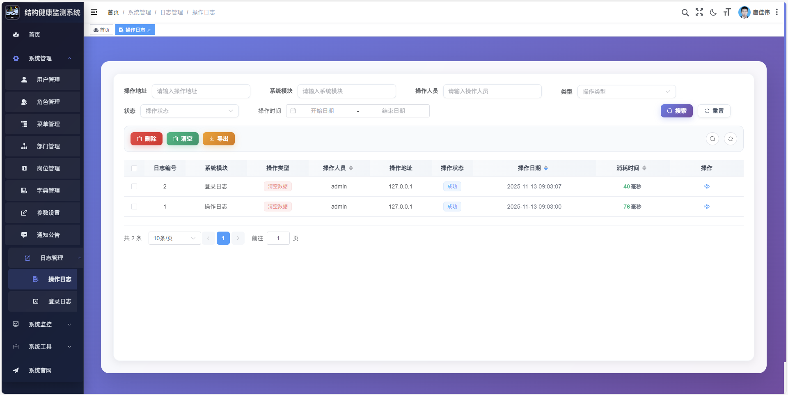

在 `E:\RuoYiProject\MoMagTracker-System\MoMagTracker-Vue3\src\views\monitor\operlog\index.vue` 文件中加入下述代码

```java
<template>
   <div class="operlog-management">
      <div class="main-card">
         <div class="content-block">
            <!-- 搜索区域 -->
            <div class="search-section">
               <el-form :model="queryParams" ref="queryRef" v-show="showSearch" :inline="true" class="search-form">
                  <el-form-item label="操作地址" prop="operIp">
                     <el-input
                        v-model="queryParams.operIp"
                        placeholder="请输入操作地址"
                        clearable
                        class="tech-input"
                        @keyup.enter="handleQuery"
                     />
                  </el-form-item>
                  <el-form-item label="系统模块" prop="title">
                     <el-input
                        v-model="queryParams.title"
                        placeholder="请输入系统模块"
                        clearable
                        class="tech-input"
                        @keyup.enter="handleQuery"
                     />
                  </el-form-item>
                  <el-form-item label="操作人员" prop="operName">
                     <el-input
                        v-model="queryParams.operName"
                        placeholder="请输入操作人员"
                        clearable
                        class="tech-input"
                        @keyup.enter="handleQuery"
                     />
                  </el-form-item>
                  <el-form-item label="类型" prop="businessType">
                     <el-select
                        v-model="queryParams.businessType"
                        placeholder="操作类型"
                        clearable
                        class="tech-select"
                     >
                        <el-option
                           v-for="dict in sys_oper_type"
                           :key="dict.value"
                           :label="dict.label"
                           :value="dict.value"
                        />
                     </el-select>
                  </el-form-item>
                  <el-form-item label="状态" prop="status">
                     <el-select
                        v-model="queryParams.status"
                        placeholder="操作状态"
                        clearable
                        class="tech-select"
                     >
                        <el-option
                           v-for="dict in sys_common_status"
                           :key="dict.value"
                           :label="dict.label"
                           :value="dict.value"
                        />
                     </el-select>
                  </el-form-item>
                  <el-form-item label="操作时间" class="date-range">
                     <el-date-picker
                        v-model="dateRange"
                        value-format="YYYY-MM-DD HH:mm:ss"
                        type="daterange"
                        range-separator="-"
                        start-placeholder="开始日期"
                        end-placeholder="结束日期"
                        :default-time="[new Date(2000, 1, 1, 0, 0, 0), new Date(2000, 1, 1, 23, 59, 59)]"
                        class="tech-date-picker"
                     ></el-date-picker>
                  </el-form-item>
                  <el-form-item class="search-actions">
                     <el-button type="primary" icon="Search" @click="handleQuery" class="tech-btn primary">搜索</el-button>
                     <el-button icon="Refresh" @click="resetQuery" class="tech-btn secondary">重置</el-button>
                  </el-form-item>
               </el-form>
            </div>

            <!-- 操作按钮区域 -->
            <div class="action-section">
               <el-row :gutter="10">
                  <el-col :span="1.5">
                     <el-button
                        type="danger"
                        plain
                        icon="Delete"
                        :disabled="multiple"
                        @click="handleDelete"
                        v-hasPermi="['monitor:operlog:remove']"
                        class="tech-btn danger"
                     >删除</el-button>
                  </el-col>
                  <el-col :span="1.5">
                     <el-button
                        type="danger"
                        plain
                        icon="Delete"
                        @click="handleClean"
                        v-hasPermi="['monitor:operlog:remove']"
                        class="tech-btn success"
                     >清空</el-button>
                  </el-col>
                  <el-col :span="1.5">
                     <el-button
                        type="warning"
                        plain
                        icon="Download"
                        @click="handleExport"
                        v-hasPermi="['monitor:operlog:export']"
                        class="tech-btn warning"
                     >导出</el-button>
                  </el-col>
                  <right-toolbar v-model:showSearch="showSearch" @queryTable="getList" class="right-toolbar"></right-toolbar>
               </el-row>
            </div>

            <!-- 表格区域 -->
            <div class="table-section">
               <el-table ref="operlogRef" v-loading="loading" :data="operlogList" @selection-change="handleSelectionChange" :default-sort="defaultSort" @sort-change="handleSortChange" class="tech-table">
                  <el-table-column type="selection" width="50" align="center" />
                  <el-table-column label="日志编号" align="center" prop="operId" width="100" />
                  <el-table-column label="系统模块" align="center" prop="title" :show-overflow-tooltip="true" width="150" />
                  <el-table-column label="操作类型" align="center" prop="businessType" width="150">
                     <template #default="scope">
                        <dict-tag :options="sys_oper_type" :value="scope.row.businessType" class="status-tag" />
                     </template>
                  </el-table-column>
                  <el-table-column label="操作人员" align="center" width="150" prop="operName" :show-overflow-tooltip="true" sortable="custom" :sort-orders="['descending', 'ascending']" />
                  <el-table-column label="操作地址" align="center" prop="operIp" width="150" :show-overflow-tooltip="true" />
                  <el-table-column label="操作状态" align="center" prop="status" width="100">
                     <template #default="scope">
                        <dict-tag :options="sys_common_status" :value="scope.row.status" class="status-tag" />
                     </template>
                  </el-table-column>
                  <el-table-column label="操作日期" align="center" prop="operTime" width="300" sortable="custom" :sort-orders="['descending', 'ascending']">
                     <template #default="scope">
                        <span class="time-text">{{ parseTime(scope.row.operTime) }}</span>
                     </template>
                  </el-table-column>
                  <el-table-column label="消耗时间" align="center" prop="costTime" width="180" :show-overflow-tooltip="true" sortable="custom" :sort-orders="['descending', 'ascending']">
                     <template #default="scope">
                        <span class="cost-time">{{ scope.row.costTime }}<span class="unit">毫秒</span></span>
                     </template>
                  </el-table-column>
                  <el-table-column label="操作" align="center" width="180" class-name="small-padding fixed-width">
                     <template #default="scope">
                        <div class="action-buttons">
                           <el-tooltip content="详细" placement="top">
                              <el-button link type="primary" icon="View" @click="handleView(scope.row, scope.index)" v-hasPermi="['monitor:operlog:query']" class="action-btn view"></el-button>
                           </el-tooltip>
                        </div>
                     </template>
                  </el-table-column>
               </el-table>

               <!-- 分页 -->
               <div class="pagination-section">
                  <pagination
                     v-show="total > 0"
                     :total="total"
                     v-model:page="queryParams.pageNum"
                     v-model:limit="queryParams.pageSize"
                     @pagination="getList"
                     class="tech-pagination"
                  />
               </div>
            </div>
         </div>
      </div>

      <!-- 操作日志详细 -->
      <el-dialog title="操作日志详细" v-model="open" width="800px" append-to-body class="tech-dialog">
         <el-form :model="form" label-width="100px" class="detail-form">
            <el-row :gutter="20">
               <el-col :span="12">
                  <el-form-item label="操作模块：" class="detail-item">
                     <div class="detail-value">{{ form.title }} / {{ typeFormat(form) }}</div>
                  </el-form-item>
                  <el-form-item label="登录信息：" class="detail-item">
                     <div class="detail-value">{{ form.operName }} / {{ form.operIp }} / {{ form.operLocation }}</div>
                  </el-form-item>
               </el-col>
               <el-col :span="12">
                  <el-form-item label="请求地址：" class="detail-item">
                     <div class="detail-value url-text">{{ form.operUrl }}</div>
                  </el-form-item>
                  <el-form-item label="请求方式：" class="detail-item">
                     <div class="detail-value method-tag">{{ form.requestMethod }}</div>
                  </el-form-item>
               </el-col>
               <el-col :span="24">
                  <el-form-item label="操作方法：" class="detail-item">
                     <div class="detail-value method-text">{{ form.method }}</div>
                  </el-form-item>
               </el-col>
               <el-col :span="24">
                  <el-form-item label="请求参数：" class="detail-item">
                     <div class="detail-value param-text">{{ form.operParam }}</div>
                  </el-form-item>
               </el-col>
               <el-col :span="24">
                  <el-form-item label="返回参数：" class="detail-item">
                     <div class="detail-value result-text">{{ form.jsonResult }}</div>
                  </el-form-item>
               </el-col>
               <el-col :span="8">
                  <el-form-item label="操作状态：" class="detail-item">
                     <div class="detail-value">
                        <el-tag v-if="form.status === 0" type="success" class="status-tag">正常</el-tag>
                        <el-tag v-else-if="form.status === 1" type="danger" class="status-tag">失败</el-tag>
                     </div>
                  </el-form-item>
               </el-col>
               <el-col :span="8">
                  <el-form-item label="消耗时间：" class="detail-item">
                     <div class="detail-value cost-text">{{ form.costTime }}<span class="unit">毫秒</span></div>
                  </el-form-item>
               </el-col>
               <el-col :span="8">
                  <el-form-item label="操作时间：" class="detail-item">
                     <div class="detail-value time-text">{{ parseTime(form.operTime) }}</div>
                  </el-form-item>
               </el-col>
               <el-col :span="24" v-if="form.status === 1">
                  <el-form-item label="异常信息：" class="detail-item">
                     <div class="detail-value error-text">{{ form.errorMsg }}</div>
                  </el-form-item>
               </el-col>
            </el-row>
         </el-form>
         <template #footer>
            <div class="dialog-footer">
               <el-button @click="open = false" class="tech-btn secondary">关 闭</el-button>
            </div>
         </template>
      </el-dialog>
   </div>
</template>

<script setup name="Operlog">
import { list, delOperlog, cleanOperlog } from "@/api/monitor/operlog"

const { proxy } = getCurrentInstance()
const { sys_oper_type, sys_common_status } = proxy.useDict("sys_oper_type", "sys_common_status")

const operlogList = ref([])
const open = ref(false)
const loading = ref(true)
const showSearch = ref(true)
const ids = ref([])
const single = ref(true)
const multiple = ref(true)
const total = ref(0)
const title = ref("")
const dateRange = ref([])
const defaultSort = ref({ prop: "operTime", order: "descending" })

const data = reactive({
  form: {},
  queryParams: {
    pageNum: 1,
    pageSize: 10,
    operIp: undefined,
    title: undefined,
    operName: undefined,
    businessType: undefined,
    status: undefined
  }
})

const { queryParams, form } = toRefs(data)

/** 查询登录日志 */
function getList() {
  loading.value = true
  list(proxy.addDateRange(queryParams.value, dateRange.value)).then(response => {
    operlogList.value = response.rows
    total.value = response.total
    loading.value = false
  })
}

/** 操作日志类型字典翻译 */
function typeFormat(row, column) {
  return proxy.selectDictLabel(sys_oper_type.value, row.businessType)
}

/** 搜索按钮操作 */
function handleQuery() {
  queryParams.value.pageNum = 1
  getList()
}

/** 重置按钮操作 */
function resetQuery() {
  dateRange.value = []
  proxy.resetForm("queryRef")
  queryParams.value.pageNum = 1
  proxy.$refs["operlogRef"].sort(defaultSort.value.prop, defaultSort.value.order)
}

/** 多选框选中数据 */
function handleSelectionChange(selection) {
  ids.value = selection.map(item => item.operId)
  multiple.value = !selection.length
}

/** 排序触发事件 */
function handleSortChange(column, prop, order) {
  queryParams.value.orderByColumn = column.prop
  queryParams.value.isAsc = column.order
  getList()
}

/** 详细按钮操作 */
function handleView(row) {
  open.value = true
  form.value = row
}

/** 删除按钮操作 */
function handleDelete(row) {
  const operIds = row.operId || ids.value
  proxy.$modal.confirm('是否确认删除日志编号为"' + operIds + '"的数据项?').then(function () {
    return delOperlog(operIds)
  }).then(() => {
    getList()
    proxy.$modal.msgSuccess("删除成功")
  }).catch(() => {})
}

/** 清空按钮操作 */
function handleClean() {
  proxy.$modal.confirm("是否确认清空所有操作日志数据项?").then(function () {
    return cleanOperlog()
  }).then(() => {
    getList()
    proxy.$modal.msgSuccess("清空成功")
  }).catch(() => {})
}

/** 导出按钮操作 */
function handleExport() {
  proxy.download("monitor/operlog/export",{
    ...queryParams.value,
  }, `config_${new Date().getTime()}.xlsx`)
}

getList()
</script>

<style scoped lang="scss">
.operlog-management {
  font-family: "Inter", "Helvetica Neue", Helvetica, "PingFang SC", "Hiragino Sans GB", "Microsoft YaHei", Arial, sans-serif;
  color: #2c3e50;
  background: linear-gradient(135deg, #667eea 0%, #764ba2 100%);
  min-height: 100vh;
  padding: 40px;
  display: flex;
  align-items: flex-start;
  justify-content: center;

  .main-card {
    background: rgba(255, 255, 255, 0.95);
    border-radius: 20px;
    box-shadow: 0 20px 60px rgba(0, 0, 0, 0.15);
    backdrop-filter: blur(20px);
    width: 100%;
    max-width: 1800px;
    padding: 30px;
    margin: 20px;
    min-height: auto;
    height: auto;

    .content-block {
      background: white;
      border-radius: 16px;
      padding: 25px;
      box-shadow: 0 4px 20px rgba(0, 0, 0, 0.08);
      border: 1px solid #f1f5f9;
      transition: all 0.3s ease;
      min-height: 700px;
      height: auto;

      &:hover {
        transform: translateY(-3px);
        box-shadow: 0 8px 30px rgba(0, 0, 0, 0.12);
      }

      // 搜索区域
      .search-section {
        margin-bottom: 20px;
        
        .search-form {
          display: flex;
          flex-wrap: wrap;
          gap: 15px;
          align-items: flex-end;

          .el-form-item {
            margin-bottom: 0;
          }

          .date-range {
            min-width: 320px;
          }

          .search-actions {
            margin-left: auto;
          }
        }
      }

      // 操作按钮区域
      .action-section {
        margin-bottom: 20px;
        padding: 15px;
        background: #f8fafc;
        border-radius: 12px;
        border: 1px solid #e2e8f0;

        .right-toolbar {
          margin-left: auto;
        }
      }

      // 表格区域
      .table-section {
        .pagination-section {
          margin-top: 20px;
          padding-top: 15px;
          border-top: 1px solid #e2e8f0;
        }

        .status-tag {
          :deep(.el-tag) {
            border-radius: 6px;
            font-weight: 500;
          }
        }

        .cost-time {
          color: #10b981;
          font-weight: 600;
          font-size: 0.9rem;
          
          .unit {
            color: #6b7280;
            font-size: 0.8rem;
            margin-left: 2px;
          }
        }
      }
    }
  }

  // 科技感组件样式
  .tech-input {
    width: 240px;

    :deep(.el-input__wrapper) {
      border-radius: 8px;
      border: 1px solid #e2e8f0;
      transition: all 0.3s ease;
      box-shadow: 0 1px 3px rgba(0, 0, 0, 0.05);
      
      &:hover {
        border-color: #667eea;
        box-shadow: 0 2px 8px rgba(102, 126, 234, 0.1);
      }
      
      &.is-focus {
        border-color: #667eea;
        box-shadow: 0 0 0 2px rgba(102, 126, 234, 0.1);
      }
    }
  }

  .tech-select {
    width: 240px;

    :deep(.el-select__wrapper) {
      border-radius: 8px;
      border: 1px solid #e2e8f0;
      transition: all 0.3s ease;
      box-shadow: 0 1px 3px rgba(0, 0, 0, 0.05);
      
      &:hover {
        border-color: #667eea;
      }
    }
  }

  .tech-date-picker {
    :deep(.el-input__wrapper) {
      border-radius: 8px;
      border: 1px solid #e2e8f0;
      transition: all 0.3s ease;
      
      &:hover {
        border-color: #667eea;
      }
    }
  }

  .tech-btn {
    border-radius: 8px;
    font-weight: 600;
    transition: all 0.3s ease;
    border: none;
    
    &.primary {
      background: linear-gradient(135deg, #667eea 0%, #764ba2 100%);
      color: white;
      box-shadow: 0 4px 15px rgba(102, 126, 234, 0.3);

      &:hover {
        transform: translateY(-2px);
        box-shadow: 0 8px 25px rgba(102, 126, 234, 0.4);
      }
    }

    &.secondary {
      background: white;
      border: 1px solid #e2e8f0;
      color: #475569;
      box-shadow: 0 2px 6px rgba(0, 0, 0, 0.05);

      &:hover {
        transform: translateY(-2px);
        border-color: #667eea;
        color: #667eea;
        box-shadow: 0 4px 12px rgba(0, 0, 0, 0.1);
      }
    }

    &.success {
      background: linear-gradient(135deg, #10b981 0%, #059669 100%);
      color: white;
      box-shadow: 0 4px 15px rgba(16, 185, 129, 0.3);

      &:hover {
        transform: translateY(-2px);
        box-shadow: 0 8px 25px rgba(16, 185, 129, 0.4);
      }
    }

    &.danger {
      background: linear-gradient(135deg, #ef4444 0%, #dc2626 100%);
      color: white;
      box-shadow: 0 4px 15px rgba(239, 68, 68, 0.3);

      &:hover {
        transform: translateY(-2px);
        box-shadow: 0 8px 25px rgba(239, 68, 68, 0.4);
      }
    }

    &.warning {
      background: linear-gradient(135deg, #f59e0b 0%, #d97706 100%);
      color: white;
      box-shadow: 0 4px 15px rgba(245, 158, 11, 0.3);

      &:hover {
        transform: translateY(-2px);
        box-shadow: 0 8px 25px rgba(245, 158, 11, 0.4);
      }
    }

    &.info {
      background: linear-gradient(135deg, #6b7280 0%, #4b5563 100%);
      color: white;
      box-shadow: 0 4px 15px rgba(107, 114, 128, 0.3);

      &:hover {
        transform: translateY(-2px);
        box-shadow: 0 8px 25px rgba(107, 114, 128, 0.4);
      }
    }
  }

  .tech-table {
    :deep(.el-table__header) {
      th {
        background: linear-gradient(135deg, #f8fafc 0%, #f1f5f9 100%);
        color: #374151;
        font-weight: 600;
      }
    }

    :deep(.el-table__row) {
      transition: all 0.3s ease;
      
      &:hover {
        transform: translateY(-1px);
        box-shadow: 0 2px 8px rgba(0, 0, 0, 0.1);
      }
    }
  }

  .action-buttons {
    display: flex;
    justify-content: center;
    gap: 8px;

    .action-btn {
      width: 32px;
      height: 32px;
      border-radius: 6px;
      display: flex;
      align-items: center;
      justify-content: center;
      transition: all 0.3s ease;

      &:hover {
        transform: scale(1.1);
        background: #f1f5f9;
      }
    }
  }

  .time-text {
    color: #6b7280;
    font-size: 0.9rem;
  }

  .tech-dialog {
    :deep(.el-dialog) {
      border-radius: 16px;
      box-shadow: 0 20px 60px rgba(0, 0, 0, 0.2);
      
      .el-dialog__header {
        border-bottom: 1px solid #e2e8f0;
        margin-right: 0;
        
        .el-dialog__title {
          font-weight: 700;
          color: #1e293b;
        }
      }
      
      .el-dialog__body {
        padding: 20px;
      }
    }

    .detail-form {
      .detail-item {
        margin-bottom: 16px;
        
        :deep(.el-form-item__label) {
          font-weight: 600;
          color: #374151;
          font-size: 0.9rem;
        }
      }

      .detail-value {
        padding: 8px 12px;
        background: #f8fafc;
        border-radius: 6px;
        border: 1px solid #e2e8f0;
        font-size: 0.9rem;
        word-break: break-all;
      }

      .url-text {
        color: #667eea;
        font-family: 'Monaco', 'Consolas', monospace;
      }

      .method-tag {
        display: inline-block;
        padding: 4px 8px;
        background: linear-gradient(135deg, #10b981 0%, #059669 100%);
        color: white;
        border-radius: 4px;
        font-weight: 600;
        font-size: 0.8rem;
      }

      .method-text {
        font-family: 'Monaco', 'Consolas', monospace;
        color: #374151;
      }

      .param-text, .result-text, .error-text {
        font-family: 'Monaco', 'Consolas', monospace;
        color: #6b7280;
        max-height: 120px;
        overflow-y: auto;
      }

      .error-text {
        color: #ef4444;
        background: #fef2f2;
        border-color: #fecaca;
      }

      .cost-text {
        color: #10b981;
        font-weight: 600;
        
        .unit {
          color: #6b7280;
          font-size: 0.8rem;
          margin-left: 2px;
        }
      }

      .status-tag {
        :deep(.el-tag) {
          border-radius: 6px;
          font-weight: 500;
          min-width: 50px;
          text-align: center;
        }
      }
    }
  }

  .tech-pagination {
    :deep(.el-pagination) {
      .btn-prev, .btn-next, .number, .more {
        border-radius: 6px;
        margin: 0 2px;
      }
      
      .number.active {
        background: linear-gradient(135deg, #667eea 0%, #764ba2 100%);
        color: white;
        border: none;
      }
    }
  }
}

// 响应式设计
@media (max-width: 1024px) {
  .operlog-management {
    .main-card {
      padding: 25px;
      margin: 15px;
    }
  }
}

@media (max-width: 768px) {
  .operlog-management {
    padding: 15px;

    .main-card {
      padding: 20px;

      .content-block {
        padding: 20px;
        min-height: 400px;

        .search-section {
          .search-form {
            flex-direction: column;
            align-items: stretch;
            
            .search-actions {
              margin-left: 0;
              text-align: center;
            }

            .tech-input, .tech-select {
              width: 100%;
            }

            .date-range {
              min-width: auto;
              width: 100%;
            }
          }
        }

        .action-section {
          .el-col {
            margin-bottom: 10px;
          }
        }
      }
    }

    .tech-dialog {
      width: 95% !important;
      margin: 10px auto;
    }
  }
}

@media (max-width: 480px) {
  .operlog-management {
    padding: 10px;

    .main-card {
      padding: 15px;
      margin: 10px;

      .content-block {
        padding: 15px;
        min-height: 350px;
      }
    }

    .detail-form {
      .el-row {
        .el-col {
          width: 100%;
          margin-bottom: 15px;
        }
      }
    }
  }
}
</style>
```

##### 2 登录日志（/logininfor/index.vue）

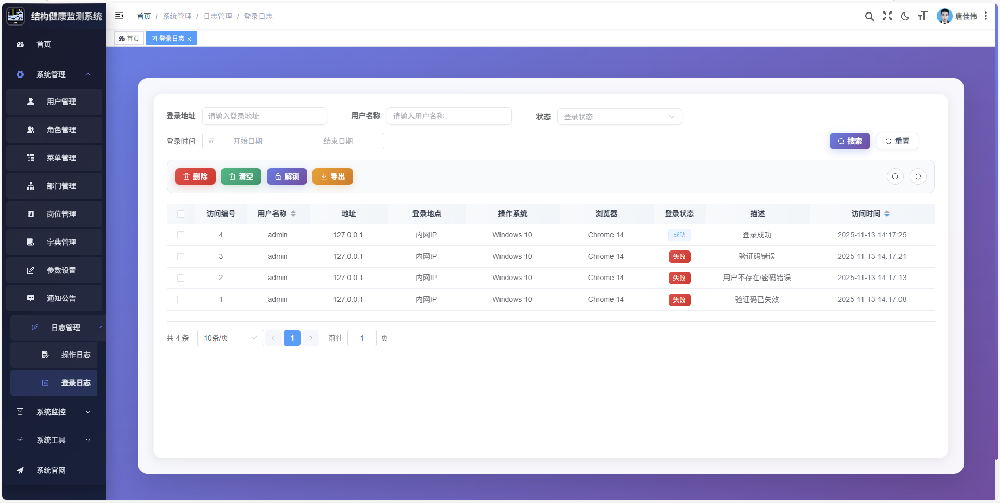

在 `E:\RuoYiProject\MoMagTracker-System\MoMagTracker-Vue3\src\views\monitor\logininfor\index.vue` 文件中加入下述代码

```java
<template>
   <div class="loginlog-management">
      <div class="main-card">
         <div class="content-block">
            <!-- 搜索区域 -->
            <div class="search-section">
               <el-form :model="queryParams" ref="queryRef" v-show="showSearch" :inline="true" class="search-form">
                  <el-form-item label="登录地址" prop="ipaddr">
                     <el-input
                        v-model="queryParams.ipaddr"
                        placeholder="请输入登录地址"
                        clearable
                        class="tech-input"
                        @keyup.enter="handleQuery"
                     />
                  </el-form-item>
                  <el-form-item label="用户名称" prop="userName">
                     <el-input
                        v-model="queryParams.userName"
                        placeholder="请输入用户名称"
                        clearable
                        class="tech-input"
                        @keyup.enter="handleQuery"
                     />
                  </el-form-item>
                  <el-form-item label="状态" prop="status">
                     <el-select
                        v-model="queryParams.status"
                        placeholder="登录状态"
                        clearable
                        class="tech-select"
                     >
                        <el-option
                           v-for="dict in sys_common_status"
                           :key="dict.value"
                           :label="dict.label"
                           :value="dict.value"
                        />
                     </el-select>
                  </el-form-item>
                  <el-form-item label="登录时间" class="date-range">
                     <el-date-picker
                        v-model="dateRange"
                        value-format="YYYY-MM-DD HH:mm:ss"
                        type="daterange"
                        range-separator="-"
                        start-placeholder="开始日期"
                        end-placeholder="结束日期"
                        :default-time="[new Date(2000, 1, 1, 0, 0, 0), new Date(2000, 1, 1, 23, 59, 59)]"
                        class="tech-date-picker"
                     ></el-date-picker>
                  </el-form-item>
                  <el-form-item class="search-actions">
                     <el-button type="primary" icon="Search" @click="handleQuery" class="tech-btn primary">搜索</el-button>
                     <el-button icon="Refresh" @click="resetQuery" class="tech-btn secondary">重置</el-button>
                  </el-form-item>
               </el-form>
            </div>

            <!-- 操作按钮区域 -->
            <div class="action-section">
               <el-row :gutter="10">
                  <el-col :span="1.5">
                     <el-button
                        type="danger"
                        plain
                        icon="Delete"
                        :disabled="multiple"
                        @click="handleDelete"
                        v-hasPermi="['monitor:logininfor:remove']"
                        class="tech-btn danger"
                     >删除</el-button>
                  </el-col>
                  <el-col :span="1.5">
                     <el-button
                        type="danger"
                        plain
                        icon="Delete"
                        @click="handleClean"
                        v-hasPermi="['monitor:logininfor:remove']"
                        class="tech-btn danger"
                     >清空</el-button>
                  </el-col>
                  <el-col :span="1.5">
                     <el-button
                        type="primary"
                        plain
                        icon="Unlock"
                        :disabled="single"
                        @click="handleUnlock"
                        v-hasPermi="['monitor:logininfor:unlock']"
                        class="tech-btn primary"
                     >解锁</el-button>
                  </el-col>
                  <el-col :span="1.5">
                     <el-button
                        type="warning"
                        plain
                        icon="Download"
                        @click="handleExport"
                        v-hasPermi="['monitor:logininfor:export']"
                        class="tech-btn warning"
                     >导出</el-button>
                  </el-col>
                  <right-toolbar v-model:showSearch="showSearch" @queryTable="getList" class="right-toolbar"></right-toolbar>
               </el-row>
            </div>

            <!-- 表格区域 -->
            <div class="table-section">
               <el-table ref="logininforRef" v-loading="loading" :data="logininforList" @selection-change="handleSelectionChange" :default-sort="defaultSort" @sort-change="handleSortChange" class="tech-table">
                  <el-table-column type="selection" width="55" align="center" />
                  <el-table-column label="访问编号" align="center" prop="infoId" width="100" />
                  <el-table-column label="用户名称" align="center" prop="userName" :show-overflow-tooltip="true" sortable="custom" :sort-orders="['descending', 'ascending']" width="120" />
                  <el-table-column label="地址" align="center" prop="ipaddr" :show-overflow-tooltip="true" width="150" />
                  <el-table-column label="登录地点" align="center" prop="loginLocation" :show-overflow-tooltip="true" width="150" />
                  <el-table-column label="操作系统" align="center" prop="os" :show-overflow-tooltip="true" width="180" />
                  <el-table-column label="浏览器" align="center" prop="browser" :show-overflow-tooltip="true" width="180" />
                  <el-table-column label="登录状态" align="center" prop="status" width="100">
                     <template #default="scope">
                        <dict-tag :options="sys_common_status" :value="scope.row.status" class="status-tag" />
                     </template>
                  </el-table-column>
                  <el-table-column label="描述" align="center" prop="msg" :show-overflow-tooltip="true" width="200" />
                  <el-table-column label="访问时间" align="center" prop="loginTime" sortable="custom" :sort-orders="['descending', 'ascending']" width="240">
                     <template #default="scope">
                        <span class="time-text">{{ parseTime(scope.row.loginTime) }}</span>
                     </template>
                  </el-table-column>
               </el-table>

               <!-- 分页 -->
               <div class="pagination-section">
                  <pagination
                     v-show="total > 0"
                     :total="total"
                     v-model:page="queryParams.pageNum"
                     v-model:limit="queryParams.pageSize"
                     @pagination="getList"
                     class="tech-pagination"
                  />
               </div>
            </div>
         </div>
      </div>
   </div>
</template>

<script setup name="Logininfor">
import { list, delLogininfor, cleanLogininfor, unlockLogininfor } from "@/api/monitor/logininfor"

const { proxy } = getCurrentInstance()
const { sys_common_status } = proxy.useDict("sys_common_status")

const logininforList = ref([])
const loading = ref(true)
const showSearch = ref(true)
const ids = ref([])
const single = ref(true)
const multiple = ref(true)
const selectName = ref("")
const total = ref(0)
const dateRange = ref([])
const defaultSort = ref({ prop: "loginTime", order: "descending" })

// 查询参数
const queryParams = ref({
  pageNum: 1,
  pageSize: 10,
  ipaddr: undefined,
  userName: undefined,
  status: undefined,
  orderByColumn: undefined,
  isAsc: undefined
})

/** 查询登录日志列表 */
function getList() {
  loading.value = true
  list(proxy.addDateRange(queryParams.value, dateRange.value)).then(response => {
    logininforList.value = response.rows
    total.value = response.total
    loading.value = false
  })
}

/** 搜索按钮操作 */
function handleQuery() {
  queryParams.value.pageNum = 1
  getList()
}

/** 重置按钮操作 */
function resetQuery() {
  dateRange.value = []
  proxy.resetForm("queryRef")
  queryParams.value.pageNum = 1
  proxy.$refs["logininforRef"].sort(defaultSort.value.prop, defaultSort.value.order)
}

/** 多选框选中数据 */
function handleSelectionChange(selection) {
  ids.value = selection.map(item => item.infoId)
  multiple.value = !selection.length
  single.value = selection.length != 1
  selectName.value = selection.map(item => item.userName)
}

/** 排序触发事件 */
function handleSortChange(column, prop, order) {
  queryParams.value.orderByColumn = column.prop
  queryParams.value.isAsc = column.order
  getList()
}

/** 删除按钮操作 */
function handleDelete(row) {
  const infoIds = row.infoId || ids.value
  proxy.$modal.confirm('是否确认删除访问编号为"' + infoIds + '"的数据项?').then(function () {
    return delLogininfor(infoIds)
  }).then(() => {
    getList()
    proxy.$modal.msgSuccess("删除成功")
  }).catch(() => {})
}

/** 清空按钮操作 */
function handleClean() {
  proxy.$modal.confirm("是否确认清空所有登录日志数据项?").then(function () {
    return cleanLogininfor()
  }).then(() => {
    getList()
    proxy.$modal.msgSuccess("清空成功")
  }).catch(() => {})
}

/** 解锁按钮操作 */
function handleUnlock() {
  const username = selectName.value
  proxy.$modal.confirm('是否确认解锁用户"' + username + '"数据项?').then(function () {
    return unlockLogininfor(username)
  }).then(() => {
    proxy.$modal.msgSuccess("用户" + username + "解锁成功")
  }).catch(() => {})
}

/** 导出按钮操作 */
function handleExport() {
  proxy.download("monitor/logininfor/export", {
    ...queryParams.value,
  }, `logininfor_${new Date().getTime()}.xlsx`)
}

getList()
</script>

<style scoped lang="scss">
.loginlog-management {
  font-family: "Inter", "Helvetica Neue", Helvetica, "PingFang SC", "Hiragino Sans GB", "Microsoft YaHei", Arial, sans-serif;
  color: #2c3e50;
  background: linear-gradient(135deg, #667eea 0%, #764ba2 100%);
  min-height: 100vh;
  padding: 40px;
  display: flex;
  align-items: flex-start;
  justify-content: center;

  .main-card {
    background: rgba(255, 255, 255, 0.95);
    border-radius: 20px;
    box-shadow: 0 20px 60px rgba(0, 0, 0, 0.15);
    backdrop-filter: blur(20px);
    width: 100%;
    max-width: 2000px;
    padding: 30px;
    margin: 20px;
    min-height: auto;
    height: auto;

    .content-block {
      background: white;
      border-radius: 16px;
      padding: 25px;
      box-shadow: 0 4px 20px rgba(0, 0, 0, 0.08);
      border: 1px solid #f1f5f9;
      transition: all 0.3s ease;
      min-height: 700px;
      height: auto;

      &:hover {
        transform: translateY(-3px);
        box-shadow: 0 8px 30px rgba(0, 0, 0, 0.12);
      }

      // 搜索区域
      .search-section {
        margin-bottom: 20px;
        
        .search-form {
          display: flex;
          flex-wrap: wrap;
          gap: 15px;
          align-items: flex-end;

          .el-form-item {
            margin-bottom: 0;
          }

          .date-range {
            min-width: 320px;
          }

          .search-actions {
            margin-left: auto;
          }
        }
      }

      // 操作按钮区域
      .action-section {
        margin-bottom: 20px;
        padding: 15px;
        background: #f8fafc;
        border-radius: 12px;
        border: 1px solid #e2e8f0;

        .right-toolbar {
          margin-left: auto;
        }
      }

      // 表格区域
      .table-section {
        .pagination-section {
          margin-top: 20px;
          padding-top: 15px;
          border-top: 1px solid #e2e8f0;
        }

        .status-tag {
          :deep(.el-tag) {
            border-radius: 6px;
            font-weight: 500;
          }
        }
      }
    }
  }

  // 科技感组件样式
  .tech-input {
    width: 240px;

    :deep(.el-input__wrapper) {
      border-radius: 8px;
      border: 1px solid #e2e8f0;
      transition: all 0.3s ease;
      box-shadow: 0 1px 3px rgba(0, 0, 0, 0.05);
      
      &:hover {
        border-color: #667eea;
        box-shadow: 0 2px 8px rgba(102, 126, 234, 0.1);
      }
      
      &.is-focus {
        border-color: #667eea;
        box-shadow: 0 0 0 2px rgba(102, 126, 234, 0.1);
      }
    }
  }

  .tech-select {
    width: 240px;

    :deep(.el-select__wrapper) {
      border-radius: 8px;
      border: 1px solid #e2e8f0;
      transition: all 0.3s ease;
      box-shadow: 0 1px 3px rgba(0, 0, 0, 0.05);
      
      &:hover {
        border-color: #667eea;
      }
    }
  }

  .tech-date-picker {
    :deep(.el-input__wrapper) {
      border-radius: 8px;
      border: 1px solid #e2e8f0;
      transition: all 0.3s ease;
      
      &:hover {
        border-color: #667eea;
      }
    }
  }

  .tech-btn {
    border-radius: 8px;
    font-weight: 600;
    transition: all 0.3s ease;
    border: none;
    
    &.primary {
      background: linear-gradient(135deg, #667eea 0%, #764ba2 100%);
      color: white;
      box-shadow: 0 4px 15px rgba(102, 126, 234, 0.3);

      &:hover {
        transform: translateY(-2px);
        box-shadow: 0 8px 25px rgba(102, 126, 234, 0.4);
      }
    }

    &.secondary {
      background: white;
      border: 1px solid #e2e8f0;
      color: #475569;
      box-shadow: 0 2px 6px rgba(0, 0, 0, 0.05);

      &:hover {
        transform: translateY(-2px);
        border-color: #667eea;
        color: #667eea;
        box-shadow: 0 4px 12px rgba(0, 0, 0, 0.1);
      }
    }

    &.success {
      background: linear-gradient(135deg, #10b981 0%, #059669 100%);
      color: white;
      box-shadow: 0 4px 15px rgba(16, 185, 129, 0.3);

      &:hover {
        transform: translateY(-2px);
        box-shadow: 0 8px 25px rgba(16, 185, 129, 0.4);
      }
    }

    &.danger {
      background: linear-gradient(135deg, #ef4444 0%, #dc2626 100%);
      color: white;
      box-shadow: 0 4px 15px rgba(239, 68, 68, 0.3);

      &:hover {
        transform: translateY(-2px);
        box-shadow: 0 8px 25px rgba(239, 68, 68, 0.4);
      }
    }

    &.warning {
      background: linear-gradient(135deg, #f59e0b 0%, #d97706 100%);
      color: white;
      box-shadow: 0 4px 15px rgba(245, 158, 11, 0.3);

      &:hover {
        transform: translateY(-2px);
        box-shadow: 0 8px 25px rgba(245, 158, 11, 0.4);
      }
    }

    &.info {
      background: linear-gradient(135deg, #6b7280 0%, #4b5563 100%);
      color: white;
      box-shadow: 0 4px 15px rgba(107, 114, 128, 0.3);

      &:hover {
        transform: translateY(-2px);
        box-shadow: 0 8px 25px rgba(107, 114, 128, 0.4);
      }
    }
  }

  .tech-table {
    :deep(.el-table__header) {
      th {
        background: linear-gradient(135deg, #f8fafc 0%, #f1f5f9 100%);
        color: #374151;
        font-weight: 600;
      }
    }

    :deep(.el-table__row) {
      transition: all 0.3s ease;
      
      &:hover {
        transform: translateY(-1px);
        box-shadow: 0 2px 8px rgba(0, 0, 0, 0.1);
      }
    }
  }

  .time-text {
    color: #6b7280;
    font-size: 0.9rem;
  }

  .tech-pagination {
    :deep(.el-pagination) {
      .btn-prev, .btn-next, .number, .more {
        border-radius: 6px;
        margin: 0 2px;
      }
      
      .number.active {
        background: linear-gradient(135deg, #667eea 0%, #764ba2 100%);
        color: white;
        border: none;
      }
    }
  }
}

// 响应式设计
@media (max-width: 1024px) {
  .loginlog-management {
    .main-card {
      padding: 25px;
      margin: 15px;
    }
  }
}

@media (max-width: 768px) {
  .loginlog-management {
    padding: 15px;

    .main-card {
      padding: 20px;

      .content-block {
        padding: 20px;
        min-height: 400px;

        .search-section {
          .search-form {
            flex-direction: column;
            align-items: stretch;
            
            .search-actions {
              margin-left: 0;
              text-align: center;
            }

            .tech-input, .tech-select {
              width: 100%;
            }

            .date-range {
              min-width: auto;
              width: 100%;
            }
          }
        }

        .action-section {
          .el-col {
            margin-bottom: 10px;
          }
        }
      }
    }
  }
}

@media (max-width: 480px) {
  .loginlog-management {
    padding: 10px;

    .main-card {
      padding: 15px;
      margin: 10px;

      .content-block {
        padding: 15px;
        min-height: 350px;
      }
    }
  }
}

// 特殊状态样式
.status-tag {
  :deep(.el-tag) {
    &.el-tag--success {
      background: linear-gradient(135deg, #10b981 0%, #059669 100%);
      border: none;
      color: white;
    }
    
    &.el-tag--danger {
      background: linear-gradient(135deg, #ef4444 0%, #dc2626 100%);
      border: none;
      color: white;
    }
    
    &.el-tag--info {
      background: linear-gradient(135deg, #6b7280 0%, #4b5563 100%);
      border: none;
      color: white;
    }
  }
}

// 浏览器和操作系统信息样式优化
.tech-table {
  :deep(.el-table__body) {
    .browser-info, .os-info {
      font-family: 'Monaco', 'Consolas', monospace;
      font-size: 0.85rem;
      color: #4b5563;
    }
  }
}
</style>
```

### 2.3.5 系统监控开发（src/views/monitor）

#### 2.3.5.1 在线用户（/online/index.vue）

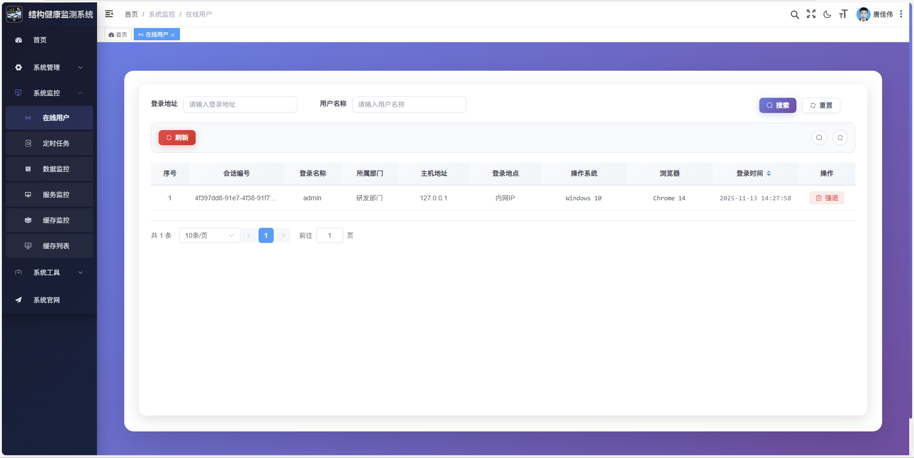

在 `E:\RuoYiProject\MoMagTracker-System\MoMagTracker-Vue3\src\views\monitor\online\index.vue` 文件中填入下述代码

```java
<template>
   <div class="onlinelog-management">
      <div class="main-card">
         <div class="content-block">
            <!-- 搜索区域 -->
            <div class="search-section">
               <el-form :model="queryParams" ref="queryRef" v-show="showSearch" :inline="true" class="search-form">
                  <el-form-item label="登录地址" prop="ipaddr">
                     <el-input
                        v-model="queryParams.ipaddr"
                        placeholder="请输入登录地址"
                        clearable
                        class="tech-input"
                        @keyup.enter="handleQuery"
                     />
                  </el-form-item>
                  <el-form-item label="用户名称" prop="userName">
                     <el-input
                        v-model="queryParams.userName"
                        placeholder="请输入用户名称"
                        clearable
                        class="tech-input"
                        @keyup.enter="handleQuery"
                     />
                  </el-form-item>
                  <el-form-item class="search-actions">
                     <el-button type="primary" icon="Search" @click="handleQuery" class="tech-btn primary">搜索</el-button>
                     <el-button icon="Refresh" @click="resetQuery" class="tech-btn secondary">重置</el-button>
                  </el-form-item>
               </el-form>
            </div>

            <!-- 操作按钮区域 -->
            <div class="action-section">
               <el-row :gutter="10">
                  <el-col :span="1.5">
                     <el-button
                        type="danger"
                        plain
                        icon="Refresh"
                        @click="handleRefresh"
                        class="tech-btn danger"
                     >刷新</el-button>
                  </el-col>
                  <right-toolbar v-model:showSearch="showSearch" @queryTable="getList" class="right-toolbar"></right-toolbar>
               </el-row>
            </div>

            <!-- 表格区域 -->
            <div class="table-section">
               <el-table 
                  ref="onlineRef" 
                  v-loading="loading" 
                  :data="onlineList" 
                  style="width: 100%;"
                  class="tech-table"
                  :default-sort="{ prop: 'loginTime', order: 'descending' }"
               >
                  <el-table-column label="序号" width="80" type="index" align="center" class-name="index-column">
                     <template #default="scope">
                        <span class="index-text">{{ (pageNum - 1) * pageSize + scope.$index + 1 }}</span>
                     </template>
                  </el-table-column>
                  <el-table-column label="会话编号" align="center" prop="tokenId" :show-overflow-tooltip="true" min-width="200" />
                  <el-table-column label="登录名称" align="center" prop="userName" :show-overflow-tooltip="true" width="120" />
                  <el-table-column label="所属部门" align="center" prop="deptName" :show-overflow-tooltip="true" width="120" />
                  <el-table-column label="主机地址" align="center" prop="ipaddr" :show-overflow-tooltip="true" width="150" />
                  <el-table-column label="登录地点" align="center" prop="loginLocation" :show-overflow-tooltip="true" width="150" />
                  <el-table-column label="操作系统" align="center" prop="os" :show-overflow-tooltip="true" width="180" class-name="os-info" />
                  <el-table-column label="浏览器" align="center" prop="browser" :show-overflow-tooltip="true" width="180" class-name="browser-info" />
                  <el-table-column label="登录时间" align="center" prop="loginTime" width="180" sortable>
                     <template #default="scope">
                        <span class="time-text">{{ parseTime(scope.row.loginTime) }}</span>
                     </template>
                  </el-table-column>
                  <el-table-column label="操作" align="center" class-name="small-padding fixed-width" width="120">
                     <template #default="scope">
                        <el-button 
                           link 
                           type="danger" 
                           icon="Delete" 
                           @click="handleForceLogout(scope.row)" 
                           v-hasPermi="['monitor:online:forceLogout']"
                           class="action-btn danger"
                        >强退</el-button>
                     </template>
                  </el-table-column>
               </el-table>

               <!-- 分页 -->
               <div class="pagination-section">
                  <pagination 
                     v-show="total > 0" 
                     :total="total" 
                     v-model:page="pageNum" 
                     v-model:limit="pageSize" 
                     class="tech-pagination"
                  />
               </div>
            </div>
         </div>
      </div>
   </div>
</template>

<script setup name="Online">
import { forceLogout, list as initData } from "@/api/monitor/online"

const { proxy } = getCurrentInstance()

const onlineList = ref([])
const loading = ref(true)
const showSearch = ref(true)
const total = ref(0)
const pageNum = ref(1)
const pageSize = ref(10)

const queryParams = ref({
  ipaddr: undefined,
  userName: undefined
})

/** 查询在线用户列表 */
function getList() {
  loading.value = true
  initData(queryParams.value).then(response => {
    onlineList.value = response.rows
    total.value = response.total
    loading.value = false
  })
}

/** 搜索按钮操作 */
function handleQuery() {
  pageNum.value = 1
  getList()
}

/** 重置按钮操作 */
function resetQuery() {
  proxy.resetForm("queryRef")
  handleQuery()
}

/** 刷新按钮操作 */
function handleRefresh() {
  getList()
  proxy.$modal.msgSuccess("刷新成功")
}

/** 强退按钮操作 */
function handleForceLogout(row) {
  proxy.$modal.confirm('是否确认强退名称为"' + row.userName + '"的用户?').then(function () {
    return forceLogout(row.tokenId)
  }).then(() => {
    getList()
    proxy.$modal.msgSuccess("强退成功")
  }).catch(() => {})
}

getList()
</script>

<style scoped lang="scss">
.onlinelog-management {
  font-family: "Inter", "Helvetica Neue", Helvetica, "PingFang SC", "Hiragino Sans GB", "Microsoft YaHei", Arial, sans-serif;
  color: #2c3e50;
  background: linear-gradient(135deg, #667eea 0%, #764ba2 100%);
  min-height: 100vh;
  padding: 40px;
  display: flex;
  align-items: flex-start;
  justify-content: center;

  .main-card {
    background: rgba(255, 255, 255, 0.95);
    border-radius: 20px;
    box-shadow: 0 20px 60px rgba(0, 0, 0, 0.15);
    backdrop-filter: blur(20px);
    width: 100%;
    max-width: 2000px;
    padding: 30px;
    margin: 20px;
    min-height: auto;
    height: auto;

    .content-block {
      background: white;
      border-radius: 16px;
      padding: 25px;
      box-shadow: 0 4px 20px rgba(0, 0, 0, 0.08);
      border: 1px solid #f1f5f9;
      transition: all 0.3s ease;
      min-height: 700px;
      height: auto;

      &:hover {
        transform: translateY(-3px);
        box-shadow: 0 8px 30px rgba(0, 0, 0, 0.12);
      }

      // 搜索区域
      .search-section {
        margin-bottom: 20px;
        
        .search-form {
          display: flex;
          flex-wrap: wrap;
          gap: 15px;
          align-items: flex-end;

          .el-form-item {
            margin-bottom: 0;
          }

          .search-actions {
            margin-left: auto;
          }
        }
      }

      // 操作按钮区域
      .action-section {
        margin-bottom: 20px;
        padding: 15px;
        background: #f8fafc;
        border-radius: 12px;
        border: 1px solid #e2e8f0;

        .right-toolbar {
          margin-left: auto;
        }
      }

      // 表格区域
      .table-section {
        .pagination-section {
          margin-top: 20px;
          padding-top: 15px;
          border-top: 1px solid #e2e8f0;
        }

        .index-column {
          .index-text {
            font-weight: 600;
            color: #667eea;
            background: linear-gradient(135deg, #667eea 0%, #764ba2 100%);
            -webkit-background-clip: text;
            -webkit-text-fill-color: transparent;
            background-clip: text;
          }
        }

        .action-btn {
          border-radius: 6px;
          padding: 6px 12px;
          font-weight: 500;
          transition: all 0.3s ease;
          
          &.danger {
            background: linear-gradient(135deg, rgba(239, 68, 68, 0.1) 0%, rgba(220, 38, 38, 0.1) 100%);
            color: #ef4444;
            
            &:hover {
              background: linear-gradient(135deg, #ef4444 0%, #dc2626 100%);
              color: white;
              transform: translateY(-1px);
              box-shadow: 0 4px 12px rgba(239, 68, 68, 0.3);
            }
          }
        }
      }
    }
  }

  // 科技感组件样式
  .tech-input {
    width: 240px;

    :deep(.el-input__wrapper) {
      border-radius: 8px;
      border: 1px solid #e2e8f0;
      transition: all 0.3s ease;
      box-shadow: 0 1px 3px rgba(0, 0, 0, 0.05);
      
      &:hover {
        border-color: #667eea;
        box-shadow: 0 2px 8px rgba(102, 126, 234, 0.1);
      }
      
      &.is-focus {
        border-color: #667eea;
        box-shadow: 0 0 0 2px rgba(102, 126, 234, 0.1);
      }
    }
  }

  .tech-select {
    width: 240px;

    :deep(.el-select__wrapper) {
      border-radius: 8px;
      border: 1px solid #e2e8f0;
      transition: all 0.3s ease;
      box-shadow: 0 1px 3px rgba(0, 0, 0, 0.05);
      
      &:hover {
        border-color: #667eea;
      }
    }
  }

  .tech-date-picker {
    :deep(.el-input__wrapper) {
      border-radius: 8px;
      border: 1px solid #e2e8f0;
      transition: all 0.3s ease;
      
      &:hover {
        border-color: #667eea;
      }
    }
  }

  .tech-btn {
    border-radius: 8px;
    font-weight: 600;
    transition: all 0.3s ease;
    border: none;
    
    &.primary {
      background: linear-gradient(135deg, #667eea 0%, #764ba2 100%);
      color: white;
      box-shadow: 0 4px 15px rgba(102, 126, 234, 0.3);

      &:hover {
        transform: translateY(-2px);
        box-shadow: 0 8px 25px rgba(102, 126, 234, 0.4);
      }
    }

    &.secondary {
      background: white;
      border: 1px solid #e2e8f0;
      color: #475569;
      box-shadow: 0 2px 6px rgba(0, 0, 0, 0.05);

      &:hover {
        transform: translateY(-2px);
        border-color: #667eea;
        color: #667eea;
        box-shadow: 0 4px 12px rgba(0, 0, 0, 0.1);
      }
    }

    &.success {
      background: linear-gradient(135deg, #10b981 0%, #059669 100%);
      color: white;
      box-shadow: 0 4px 15px rgba(16, 185, 129, 0.3);

      &:hover {
        transform: translateY(-2px);
        box-shadow: 0 8px 25px rgba(16, 185, 129, 0.4);
      }
    }

    &.danger {
      background: linear-gradient(135deg, #ef4444 0%, #dc2626 100%);
      color: white;
      box-shadow: 0 4px 15px rgba(239, 68, 68, 0.3);

      &:hover {
        transform: translateY(-2px);
        box-shadow: 0 8px 25px rgba(239, 68, 68, 0.4);
      }
    }

    &.warning {
      background: linear-gradient(135deg, #f59e0b 0%, #d97706 100%);
      color: white;
      box-shadow: 0 4px 15px rgba(245, 158, 11, 0.3);

      &:hover {
        transform: translateY(-2px);
        box-shadow: 0 8px 25px rgba(245, 158, 11, 0.4);
      }
    }

    &.info {
      background: linear-gradient(135deg, #6b7280 0%, #4b5563 100%);
      color: white;
      box-shadow: 0 4px 15px rgba(107, 114, 128, 0.3);

      &:hover {
        transform: translateY(-2px);
        box-shadow: 0 8px 25px rgba(107, 114, 128, 0.4);
      }
    }
  }

  .tech-table {
    :deep(.el-table__header) {
      th {
        background: linear-gradient(135deg, #f8fafc 0%, #f1f5f9 100%);
        color: #374151;
        font-weight: 600;
        border-bottom: 2px solid #e2e8f0;
      }
    }

    :deep(.el-table__row) {
      transition: all 0.3s ease;
      
      &:hover {
        transform: translateY(-1px);
        box-shadow: 0 2px 8px rgba(0, 0, 0, 0.1);
        background: #f8fafc;
      }
    }

    :deep(.el-table__cell) {
      padding: 12px 0;
    }
  }

  .time-text {
    color: #6b7280;
    font-size: 0.9rem;
    font-family: 'Monaco', 'Consolas', monospace;
  }

  .tech-pagination {
    :deep(.el-pagination) {
      .btn-prev, .btn-next, .number, .more {
        border-radius: 6px;
        margin: 0 2px;
        transition: all 0.3s ease;
      }
      
      .number.active {
        background: linear-gradient(135deg, #667eea 0%, #764ba2 100%);
        color: white;
        border: none;
        box-shadow: 0 2px 8px rgba(102, 126, 234, 0.3);
      }

      .number:not(.active):hover {
        color: #667eea;
        border-color: #667eea;
      }
    }
  }
}

// 响应式设计
@media (max-width: 1024px) {
  .onlinelog-management {
    .main-card {
      padding: 25px;
      margin: 15px;
    }
  }
}

@media (max-width: 768px) {
  .onlinelog-management {
    padding: 15px;

    .main-card {
      padding: 20px;

      .content-block {
        padding: 20px;
        min-height: 400px;

        .search-section {
          .search-form {
            flex-direction: column;
            align-items: stretch;
            
            .search-actions {
              margin-left: 0;
              text-align: center;
            }

            .tech-input, .tech-select {
              width: 100%;
            }
          }
        }

        .action-section {
          .el-col {
            margin-bottom: 10px;
          }
        }

        .table-section {
          overflow-x: auto;
        }
      }
    }
  }
}

@media (max-width: 480px) {
  .onlinelog-management {
    padding: 10px;

    .main-card {
      padding: 15px;
      margin: 10px;

      .content-block {
        padding: 15px;
        min-height: 350px;
      }
    }
  }
}

// 浏览器和操作系统信息样式优化
.tech-table {
  :deep(.el-table__body) {
    .browser-info, .os-info {
      font-family: 'Monaco', 'Consolas', monospace;
      font-size: 0.85rem;
      color: #4b5563;
    }
  }
}

// 在线用户状态指示器
.online-status {
  display: inline-block;
  width: 8px;
  height: 8px;
  border-radius: 50%;
  background: linear-gradient(135deg, #10b981 0%, #059669 100%);
  margin-right: 6px;
  animation: pulse 2s infinite;
}

@keyframes pulse {
  0% {
    transform: scale(0.95);
    box-shadow: 0 0 0 0 rgba(16, 185, 129, 0.7);
  }
  
  70% {
    transform: scale(1);
    box-shadow: 0 0 0 6px rgba(16, 185, 129, 0);
  }
  
  100% {
    transform: scale(0.95);
    box-shadow: 0 0 0 0 rgba(16, 185, 129, 0);
  }
}

// 特殊状态样式
.status-tag {
  :deep(.el-tag) {
    &.el-tag--success {
      background: linear-gradient(135deg, #10b981 0%, #059669 100%);
      border: none;
      color: white;
    }
    
    &.el-tag--danger {
      background: linear-gradient(135deg, #ef4444 0%, #dc2626 100%);
      border: none;
      color: white;
    }
    
    &.el-tag--info {
      background: linear-gradient(135deg, #6b7280 0%, #4b5563 100%);
      border: none;
      color: white;
    }
  }
}

// 加载动画优化
:deep(.el-loading-mask) {
  background: rgba(255, 255, 255, 0.8);
  backdrop-filter: blur(10px);
  
  .el-loading-spinner {
    .path {
      stroke: linear-gradient(135deg, #667eea 0%, #764ba2 100%);
    }
  }
}

// 表格行细节优化
.tech-table {
  :deep(.el-table__row) {
    &.current-row {
      background: linear-gradient(135deg, rgba(102, 126, 234, 0.05) 0%, rgba(118, 75, 162, 0.05) 100%);
      border-left: 3px solid #667eea;
    }
  }
}

// 表单标签样式优化
:deep(.el-form-item__label) {
  font-weight: 600;
  color: #374151;
  margin-bottom: 4px;
}

// 卡片标题区域
.card-header {
  display: flex;
  justify-content: between;
  align-items: center;
  margin-bottom: 20px;
  padding-bottom: 15px;
  border-bottom: 1px solid #e2e8f0;
  
  .title {
    font-size: 1.5rem;
    font-weight: 700;
    background: linear-gradient(135deg, #667eea 0%, #764ba2 100%);
    -webkit-background-clip: text;
    -webkit-text-fill-color: transparent;
    background-clip: text;
  }
}

// 统计信息卡片
.stats-cards {
  display: grid;
  grid-template-columns: repeat(auto-fit, minmax(200px, 1fr));
  gap: 16px;
  margin-bottom: 20px;
  
  .stat-card {
    background: white;
    border-radius: 12px;
    padding: 20px;
    box-shadow: 0 4px 12px rgba(0, 0, 0, 0.05);
    border: 1px solid #f1f5f9;
    transition: all 0.3s ease;
    
    &:hover {
      transform: translateY(-2px);
      box-shadow: 0 8px 25px rgba(0, 0, 0, 0.1);
    }
    
    .stat-value {
      font-size: 2rem;
      font-weight: 700;
      background: linear-gradient(135deg, #667eea 0%, #764ba2 100%);
      -webkit-background-clip: text;
      -webkit-text-fill-color: transparent;
      background-clip: text;
      margin-bottom: 8px;
    }
    
    .stat-label {
      color: #6b7280;
      font-size: 0.9rem;
      font-weight: 500;
    }
  }
}

// 空状态样式
.empty-state {
  text-align: center;
  padding: 60px 20px;
  
  .empty-icon {
    font-size: 4rem;
    color: #d1d5db;
    margin-bottom: 16px;
  }
  
  .empty-text {
    color: #6b7280;
    font-size: 1.1rem;
    margin-bottom: 16px;
  }
}

// 操作按钮组样式
.action-group {
  display: flex;
  gap: 8px;
  align-items: center;
  
  .action-btn {
    transition: all 0.3s ease;
    
    &.small {
      padding: 6px 12px;
      font-size: 0.85rem;
    }
    
    &.icon-only {
      width: 32px;
      height: 32px;
      padding: 0;
      display: flex;
      align-items: center;
      justify-content: center;
    }
  }
}

// 标签样式优化
:deep(.el-tag) {
  border-radius: 6px;
  font-weight: 500;
  border: none;
  
  &.el-tag--success {
    background: linear-gradient(135deg, #10b981 0%, #059669 100%);
    color: white;
  }
  
  &.el-tag--warning {
    background: linear-gradient(135deg, #f59e0b 0%, #d97706 100%);
    color: white;
  }
  
  &.el-tag--danger {
    background: linear-gradient(135deg, #ef4444 0%, #dc2626 100%);
    color: white;
  }
  
  &.el-tag--info {
    background: linear-gradient(135deg, #6b7280 0%, #4b5563 100%);
    color: white;
  }
}

// 对话框样式优化
:deep(.el-dialog) {
  border-radius: 16px;
  box-shadow: 0 20px 60px rgba(0, 0, 0, 0.2);
  
  .el-dialog__header {
    background: linear-gradient(135deg, #f8fafc 0%, #f1f5f9 100%);
    border-radius: 16px 16px 0 0;
    padding: 20px;
    margin: 0;
    
    .el-dialog__title {
      font-weight: 600;
      color: #374151;
    }
  }
  
  .el-dialog__body {
    padding: 20px;
  }
  
  .el-dialog__footer {
    background: #f8fafc;
    border-radius: 0 0 16px 16px;
    padding: 20px;
    margin: 0;
  }
}

// 消息提示样式优化
:deep(.el-message) {
  border-radius: 12px;
  box-shadow: 0 10px 30px rgba(0, 0, 0, 0.15);
  border: none;
  
  &.el-message--success {
    background: linear-gradient(135deg, #10b981 0%, #059669 100%);
    color: white;
  }
  
  &.el-message--warning {
    background: linear-gradient(135deg, #f59e0b 0%, #d97706 100%);
    color: white;
  }
  
  &.el-message--error {
    background: linear-gradient(135deg, #ef4444 0%, #dc2626 100%);
    color: white;
  }
  
  &.el-message--info {
    background: linear-gradient(135deg, #6b7280 0%, #4b5563 100%);
    color: white;
  }
}

// 确认框样式优化
:deep(.el-message-box) {
  border-radius: 16px;
  box-shadow: 0 20px 60px rgba(0, 0, 0, 0.2);
  border: none;
  
  .el-message-box__header {
    background: linear-gradient(135deg, #f8fafc 0%, #f1f5f9 100%);
    border-radius: 16px 16px 0 0;
    padding: 20px;
    
    .el-message-box__title {
      font-weight: 600;
      color: #374151;
    }
  }
  
  .el-message-box__content {
    padding: 20px;
  }
  
  .el-message-box__btns {
    background: #f8fafc;
    border-radius: 0 0 16px 16px;
    padding: 20px;
    margin: 0;
  }
}

// 滚动条样式优化
:deep(::-webkit-scrollbar) {
  width: 6px;
  height: 6px;
}

:deep(::-webkit-scrollbar-track) {
  background: #f1f5f9;
  border-radius: 3px;
}

:deep(::-webkit-scrollbar-thumb) {
  background: linear-gradient(135deg, #667eea 0%, #764ba2 100%);
  border-radius: 3px;
}

:deep(::-webkit-scrollbar-thumb:hover) {
  background: linear-gradient(135deg, #5a6fd8 0%, #6a4190 100%);
}

// 表格滚动条样式
.tech-table {
  :deep(.el-table__body-wrapper::-webkit-scrollbar) {
    height: 8px;
  }
  
  :deep(.el-table__body-wrapper::-webkit-scrollbar-track) {
    background: #f1f5f9;
  }
  
  :deep(.el-table__body-wrapper::-webkit-scrollbar-thumb) {
    background: linear-gradient(135deg, #667eea 0%, #764ba2 100%);
    border-radius: 4px;
  }
}

// 输入框聚焦效果增强
.tech-input {
  :deep(.el-input__wrapper) {
    transition: all 0.3s cubic-bezier(0.4, 0, 0.2, 1);
    
    &.is-focus {
      transform: translateY(-1px);
      box-shadow: 0 4px 12px rgba(102, 126, 234, 0.2);
    }
  }
}

// 按钮点击效果
.tech-btn {
  &:active {
    transform: translateY(0) !important;
  }
}

// 表格行进入动画
@keyframes fadeInUp {
  from {
    opacity: 0;
    transform: translateY(20px);
  }
  to {
    opacity: 1;
    transform: translateY(0);
  }
}

.tech-table {
  :deep(.el-table__row) {
    animation: fadeInUp 0.5s ease forwards;
    
    @for $i from 1 through 20 {
      &:nth-child(#{$i}) {
        animation-delay: #{$i * 0.05}s;
      }
    }
  }
}

// 响应式表格列隐藏
@media (max-width: 1200px) {
  .tech-table {
    :deep(.el-table__body) {
      .el-table__row {
        .el-table__cell:nth-child(6),
        .el-table__cell:nth-child(7) {
          .cell {
            max-width: 120px;
            overflow: hidden;
            text-overflow: ellipsis;
            white-space: nowrap;
          }
        }
      }
    }
  }
}

@media (max-width: 992px) {
  .tech-table {
    :deep(.el-table__body) {
      .el-table__row {
        .el-table__cell:nth-child(4),
        .el-table__cell:nth-child(5) {
          .cell {
            max-width: 100px;
            overflow: hidden;
            text-overflow: ellipsis;
            white-space: nowrap;
          }
        }
      }
    }
  }
}

// 打印样式优化
@media print {
  .onlinelog-management {
    background: white !important;
    padding: 0 !important;
    
    .main-card {
      box-shadow: none !important;
      background: white !important;
      margin: 0 !important;
      padding: 0 !important;
      
      .content-block {
        box-shadow: none !important;
        border: 1px solid #ddd !important;
      }
    }
    
    .search-section,
    .action-section {
      display: none !important;
    }
  }
}

// 高对比度模式支持
@media (prefers-contrast: high) {
  .onlinelog-management {
    .main-card {
      background: white;
      border: 2px solid #000;
      
      .content-block {
        border: 1px solid #000;
      }
    }
    
    .tech-btn {
      border: 1px solid #000;
    }
  }
}

// 减少动画模式支持
@media (prefers-reduced-motion: reduce) {
  .onlinelog-management {
    * {
      animation-duration: 0.01ms !important;
      animation-iteration-count: 1 !important;
      transition-duration: 0.01ms !important;
    }
  }
}

// 暗色模式支持
@media (prefers-color-scheme: dark) {
  .onlinelog-management {
    background: linear-gradient(135deg, #1e1b2e 0%, #2d1b69 100%);
    color: #e2e8f0;
    
    .main-card {
      background: rgba(30, 30, 30, 0.95);
      
      .content-block {
        background: #1f2937;
        border-color: #374151;
        color: #e2e8f0;
      }
    }
    
    .action-section {
      background: #374151;
      border-color: #4b5563;
    }
    
    .tech-table {
      :deep(.el-table__header) {
        th {
          background: linear-gradient(135deg, #374151 0%, #4b5563 100%);
          color: #e2e8f0;
          border-color: #6b7280;
        }
      }
      
      :deep(.el-table__row:hover) {
        background: #374151;
      }
    }
  }
}

// 焦点指示器可访问性优化
.tech-btn:focus-visible,
.tech-input :deep(.el-input__wrapper:focus-visible),
.tech-select :deep(.el-select__wrapper:focus-visible) {
  outline: 2px solid #667eea;
  outline-offset: 2px;
}

// 选择文本样式
::selection {
  background: rgba(102, 126, 234, 0.3);
  color: inherit;
}

// 占位符样式优化
:deep(::placeholder) {
  color: #9ca3af;
  opacity: 1;
}

// 禁用状态样式优化
:deep(.is-disabled) {
  opacity: 0.6;
  cursor: not-allowed;
}

// 最后一行样式优化
.tech-table {
  :deep(.el-table__row:last-child) {
    border-bottom: none;
  }
}

// 表格斑马纹样式
.tech-table.striped {
  :deep(.el-table__row--striped) {
    background: linear-gradient(135deg, rgba(248, 250, 252, 0.5) 0%, rgba(241, 245, 249, 0.5) 100%);
    
    &:hover {
      background: linear-gradient(135deg, rgba(248, 250, 252, 0.8) 0%, rgba(241, 245, 249, 0.8) 100%);
    }
  }
}

// 工具提示样式优化
:deep(.el-tooltip__popper) {
  border-radius: 8px;
  box-shadow: 0 10px 25px rgba(0, 0, 0, 0.15);
  border: none;
  
  &.is-dark {
    background: linear-gradient(135deg, #374151 0%, #4b5563 100%);
  }
}

// 下拉菜单样式优化
:deep(.el-dropdown-menu) {
  border-radius: 12px;
  box-shadow: 0 10px 25px rgba(0, 0, 0, 0.15);
  border: none;
  padding: 8px 0;
  
  .el-dropdown-menu__item {
    padding: 8px 16px;
    transition: all 0.3s ease;
    
    &:hover {
      background: linear-gradient(135deg, #667eea 0%, #764ba2 100%);
      color: white;
    }
  }
}

// 徽章样式优化
:deep(.el-badge) {
  .el-badge__content {
    background: linear-gradient(135deg, #ef4444 0%, #dc2626 100%);
    border: none;
    font-weight: 600;
  }
}

// 步骤条样式优化
:deep(.el-steps) {
  .el-step__head {
    .el-step__icon {
      background: linear-gradient(135deg, #667eea 0%, #764ba2 100%);
      border: none;
      color: white;
    }
    
    &.is-process {
      .el-step__icon {
        background: linear-gradient(135deg, #667eea 0%, #764ba2 100%);
      }
    }
    
    &.is-success {
      .el-step__icon {
        background: linear-gradient(135deg, #10b981 0%, #059669 100%);
      }
    }
    
    &.is-wait {
      .el-step__icon {
        background: #d1d5db;
      }
    }
  }
}

// 时间线样式优化
:deep(.el-timeline) {
  .el-timeline-item {
    .el-timeline-item__node {
      background: linear-gradient(135deg, #667eea 0%, #764ba2 100%);
      border: none;
    }
    
    .el-timeline-item__tail {
      border-color: #e2e8f0;
    }
  }
}

// 骨架屏样式优化
:deep(.el-skeleton) {
  .el-skeleton__item {
    background: linear-gradient(90deg, #f1f5f9 25%, #e2e8f0 50%, #f1f5f9 75%);
    background-size: 400% 100%;
    animation: el-skeleton-loading 1.4s ease infinite;
  }
}

@keyframes el-skeleton-loading {
  0% {
    background-position: 100% 50%;
  }
  100% {
    background-position: 0 50%;
  }
}

// 图片预览样式优化
:deep(.el-image-viewer) {
  .el-image-viewer__wrapper {
    background: rgba(0, 0, 0, 0.8);
    backdrop-filter: blur(10px);
  }
  
  .el-image-viewer__btn {
    background: rgba(255, 255, 255, 0.2);
    backdrop-filter: blur(10px);
    border: none;
    color: white;
    
    &:hover {
      background: rgba(255, 255, 255, 0.3);
    }
  }
}

// 回到顶部样式优化
:deep(.el-backtop) {
  background: linear-gradient(135deg, #667eea 0%, #764ba2 100%);
  border: none;
  box-shadow: 0 4px 12px rgba(102, 126, 234, 0.3);
  
  &:hover {
    background: linear-gradient(135deg, #5a6fd8 0%, #6a4190 100%);
    box-shadow: 0 6px 20px rgba(102, 126, 234, 0.4);
  }
}

// 无限滚动样式优化
:deep(.el-scrollbar) {
  .el-scrollbar__bar {
    .el-scrollbar__thumb {
      background: linear-gradient(135deg, #667eea 0%, #764ba2 100%);
    }
  }
}

// 级联选择器样式优化
:deep(.el-cascader) {
  .el-cascader__dropdown {
    border-radius: 12px;
    box-shadow: 0 10px 25px rgba(0, 0, 0, 0.15);
    border: none;
  }
}

// 颜色选择器样式优化
:deep(.el-color-picker) {
  .el-color-picker__trigger {
    border-radius: 8px;
    border: 1px solid #e2e8f0;
    transition: all 0.3s ease;
    
    &:hover {
      border-color: #667eea;
    }
  }
}

// 评分组件样式优化
:deep(.el-rate) {
  .el-rate__icon {
    font-size: 16px;
    
    .el-rate__decimal {
      color: #fbbf24;
    }
  }
}

// 滑块组件样式优化
:deep(.el-slider) {
  .el-slider__runway {
    background: #e2e8f0;
    
    .el-slider__bar {
      background: linear-gradient(135deg, #667eea 0%, #764ba2 100%);
    }
    
    .el-slider__button {
      border: none;
      background: linear-gradient(135deg, #667eea 0%, #764ba2 100%);
      box-shadow: 0 2px 6px rgba(102, 126, 234, 0.3);
    }
  }
}

// 开关组件样式优化
:deep(.el-switch) {
  .el-switch__core {
    border: none;
    background: #d1d5db;
    
    .el-switch__action {
      background: white;
      box-shadow: 0 2px 4px rgba(0, 0, 0, 0.1);
    }
  }
  
  &.is-checked {
    .el-switch__core {
      background: linear-gradient(135deg, #667eea 0%, #764ba2 100%);
    }
  }
}

// 上传组件样式优化
:deep(.el-upload) {
  .el-upload-dragger {
    border: 2px dashed #e2e8f0;
    border-radius: 12px;
    transition: all 0.3s ease;
    
    &:hover {
      border-color: #667eea;
      background: rgba(102, 126, 234, 0.05);
    }
  }
}

// 树形组件样式优化
:deep(.el-tree) {
  .el-tree-node {
    .el-tree-node__content {
      border-radius: 6px;
      transition: all 0.3s ease;
      
      &:hover {
        background: rgba(102, 126, 234, 0.1);
      }
      
      &.is-current {
        background: linear-gradient(135deg, rgba(102, 126, 234, 0.2) 0%, rgba(118, 75, 162, 0.2) 100%);
        color: #667eea;
        font-weight: 600;
      }
    }
  }
}

// 日历组件样式优化
:deep(.el-calendar) {
  border-radius: 12px;
  box-shadow: 0 4px 12px rgba(0, 0, 0, 0.05);
  border: 1px solid #f1f5f9;
  
  .el-calendar__header {
    background: linear-gradient(135deg, #f8fafc 0%, #f1f5f9 100%);
    border-radius: 12px 12px 0 0;
    padding: 16px;
    margin: 0;
  }
  
  .el-calendar__body {
    padding: 16px;
  }
  
  .el-calendar-day {
    border-radius: 6px;
    transition: all 0.3s ease;
    
    &:hover {
      background: rgba(102, 126, 234, 0.1);
    }
    
    &.is-selected {
      background: linear-gradient(135deg, #667eea 0%, #764ba2 100%);
      color: white;
    }
  }
}

// 最终优化：性能考虑
@media (prefers-reduced-transparency: reduce) {
  .onlinelog-management {
    .main-card {
      backdrop-filter: none;
      background: white;
    }
  }
}

// 打印模式下的进一步优化
@media print {
  .onlinelog-management {
    * {
      color: black !important;
      background: white !important;
    }
    
    .tech-table {
      :deep(.el-table__header) {
        th {
          background: #f1f5f9 !important;
          color: black !important;
        }
      }
    }
  }
}

// 最终样式收尾
.onlinelog-management {
  // 优化字体渲染
  -webkit-font-smoothing: antialiased;
  -moz-osx-font-smoothing: grayscale;

  // 确保所有过渡动画平滑
  * {
    box-sizing: border-box;
  }
  
  // 确保在高DPI设备上清晰显示
  @media (-webkit-min-device-pixel-ratio: 2), (min-resolution: 192dpi) {
    .main-card {
      border: 0.5px solid rgba(0, 0, 0, 0.1);
    }
  }
}

// 确保所有交互元素都有合适的光标
.tech-btn,
.action-btn,
:deep(.el-table__row),
:deep(.el-pagination .number),
:deep(.el-pagination .btn-prev),
:deep(.el-pagination .btn-next) {
  cursor: pointer;
}

:deep(.el-table__row) {
  &.el-table__row--striped {
    cursor: pointer;
  }
}

// 禁用状态的光标
:deep(.is-disabled) {
  cursor: not-allowed !important;
}
</style>
```

#### 2.3.5.2 定时任务（/job/index.vue）

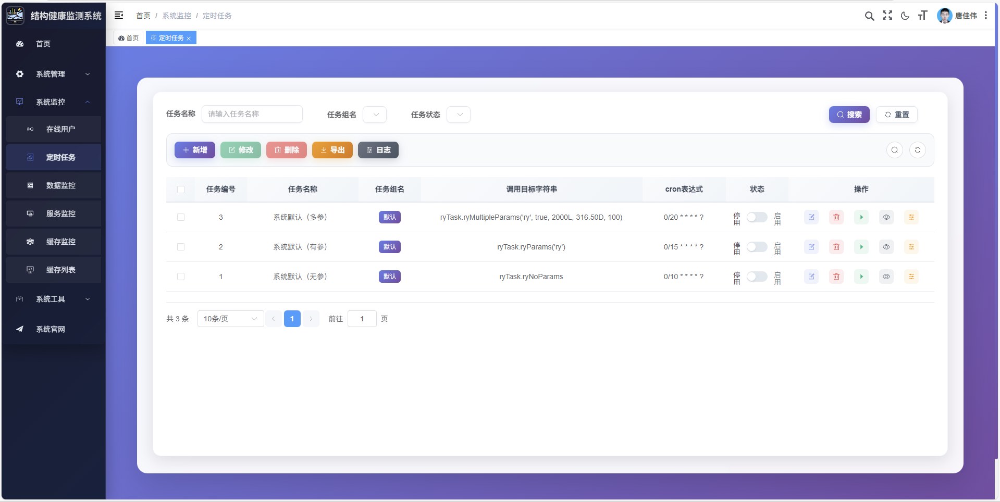

在 `E:\RuoYiProject\MoMagTracker-System\MoMagTracker-Vue3\src\views\monitor\job\index.vue` 文件中填入下述代码

```java
<template>
   <div class="job-management">
      <div class="main-card">
         <div class="content-block">
            <!-- 搜索区域 -->
            <div class="search-section">
               <el-form :model="queryParams" ref="queryRef" v-show="showSearch" :inline="true" class="search-form">
                  <el-form-item label="任务名称" prop="jobName">
                     <el-input
                        v-model="queryParams.jobName"
                        placeholder="请输入任务名称"
                        clearable
                        class="tech-input"
                        @keyup.enter="handleQuery"
                     />
                  </el-form-item>
                  <el-form-item label="任务组名" prop="jobGroup">
                     <el-select v-model="queryParams.jobGroup" placeholder="请选择任务组名" clearable class="tech-select">
                        <el-option
                           v-for="dict in sys_job_group"
                           :key="dict.value"
                           :label="dict.label"
                           :value="dict.value"
                        />
                     </el-select>
                  </el-form-item>
                  <el-form-item label="任务状态" prop="status">
                     <el-select v-model="queryParams.status" placeholder="请选择任务状态" clearable class="tech-select">
                        <el-option
                           v-for="dict in sys_job_status"
                           :key="dict.value"
                           :label="dict.label"
                           :value="dict.value"
                        />
                     </el-select>
                  </el-form-item>
                  <el-form-item class="search-actions">
                     <el-button type="primary" icon="Search" @click="handleQuery" class="tech-btn primary">搜索</el-button>
                     <el-button icon="Refresh" @click="resetQuery" class="tech-btn secondary">重置</el-button>
                  </el-form-item>
               </el-form>
            </div>

            <!-- 操作按钮区域 -->
            <div class="action-section">
               <el-row :gutter="10">
                  <el-col :span="1.5">
                     <el-button
                        type="primary"
                        plain
                        icon="Plus"
                        @click="handleAdd"
                        v-hasPermi="['monitor:job:add']"
                        class="tech-btn primary"
                     >新增</el-button>
                  </el-col>
                  <el-col :span="1.5">
                     <el-button
                        type="success"
                        plain
                        icon="Edit"
                        :disabled="single"
                        @click="handleUpdate"
                        v-hasPermi="['monitor:job:edit']"
                        class="tech-btn success"
                     >修改</el-button>
                  </el-col>
                  <el-col :span="1.5">
                     <el-button
                        type="danger"
                        plain
                        icon="Delete"
                        :disabled="multiple"
                        @click="handleDelete"
                        v-hasPermi="['monitor:job:remove']"
                        class="tech-btn danger"
                     >删除</el-button>
                  </el-col>
                  <el-col :span="1.5">
                     <el-button
                        type="warning"
                        plain
                        icon="Download"
                        @click="handleExport"
                        v-hasPermi="['monitor:job:export']"
                        class="tech-btn warning"
                     >导出</el-button>
                  </el-col>
                  <el-col :span="1.5">
                     <el-button
                        type="info"
                        plain
                        icon="Operation"
                        @click="handleJobLog"
                        v-hasPermi="['monitor:job:query']"
                        class="tech-btn info"
                     >日志</el-button>
                  </el-col>
                  <right-toolbar v-model:showSearch="showSearch" @queryTable="getList" class="right-toolbar"></right-toolbar>
               </el-row>
            </div>

            <!-- 表格区域 -->
            <div class="table-section">
               <el-table 
                  ref="jobTableRef"
                  v-loading="loading" 
                  :data="jobList" 
                  @selection-change="handleSelectionChange"
                  class="tech-table"
                  :default-sort="{ prop: 'jobId', order: 'descending' }"
               >
                  <el-table-column type="selection" width="55" align="center" />
                  <el-table-column label="任务编号" width="100" align="center" prop="jobId" class-name="id-column" />
                  <el-table-column label="任务名称" align="center" prop="jobName" :show-overflow-tooltip="true" min-width="100" />
                  <el-table-column label="任务组名" align="center" prop="jobGroup" width="120">
                     <template #default="scope">
                        <dict-tag :options="sys_job_group" :value="scope.row.jobGroup" class="group-tag" />
                     </template>
                  </el-table-column>
                  <el-table-column label="调用目标字符串" align="center" prop="invokeTarget" :show-overflow-tooltip="true" min-width="200" class-name="target-column" />
                  <el-table-column label="cron表达式" align="center" prop="cronExpression" :show-overflow-tooltip="true" width="160" class-name="cron-column" />
                  <el-table-column label="状态" align="center" width="120">
                     <template #default="scope">
                        <div class="status-switch">
                           <el-switch
                              v-model="scope.row.status"
                              active-value="0"
                              inactive-value="1"
                              active-text="启用"
                              inactive-text="停用"
                              @change="handleStatusChange(scope.row)"
                              class="tech-switch"
                           ></el-switch>
                        </div>
                     </template>
                  </el-table-column>
                  <el-table-column label="操作" align="center" width="280" class-name="small-padding fixed-width">
                     <template #default="scope">
                        <div class="action-buttons">
                           <el-tooltip content="修改" placement="top">
                              <el-button link type="primary" icon="Edit" @click="handleUpdate(scope.row)" v-hasPermi="['monitor:job:edit']" class="action-btn primary"></el-button>
                           </el-tooltip>
                           <el-tooltip content="删除" placement="top">
                              <el-button link type="danger" icon="Delete" @click="handleDelete(scope.row)" v-hasPermi="['monitor:job:remove']" class="action-btn danger"></el-button>
                           </el-tooltip>
                           <el-tooltip content="执行一次" placement="top">
                              <el-button link type="success" icon="CaretRight" @click="handleRun(scope.row)" v-hasPermi="['monitor:job:changeStatus']" class="action-btn success"></el-button>
                           </el-tooltip>
                           <el-tooltip content="任务详细" placement="top">
                              <el-button link type="info" icon="View" @click="handleView(scope.row)" v-hasPermi="['monitor:job:query']" class="action-btn info"></el-button>
                           </el-tooltip>
                           <el-tooltip content="调度日志" placement="top">
                              <el-button link type="warning" icon="Operation" @click="handleJobLog(scope.row)" v-hasPermi="['monitor:job:query']" class="action-btn warning"></el-button>
                           </el-tooltip>
                        </div>
                     </template>
                  </el-table-column>
               </el-table>

               <!-- 分页 -->
               <div class="pagination-section">
                  <pagination
                     v-show="total > 0"
                     :total="total"
                     v-model:page="queryParams.pageNum"
                     v-model:limit="queryParams.pageSize"
                     @pagination="getList"
                     class="tech-pagination"
                  />
               </div>
            </div>
         </div>
      </div>

      <!-- 添加或修改定时任务对话框 -->
      <el-dialog :title="title" v-model="open" width="820px" append-to-body class="tech-dialog">
         <el-form ref="jobRef" :model="form" :rules="rules" label-width="120px" class="tech-form">
            <el-row :gutter="20">
               <el-col :span="12">
                  <el-form-item label="任务名称" prop="jobName">
                     <el-input v-model="form.jobName" placeholder="请输入任务名称" class="tech-input" />
                  </el-form-item>
               </el-col>
               <el-col :span="12">
                  <el-form-item label="任务分组" prop="jobGroup">
                     <el-select v-model="form.jobGroup" placeholder="请选择" class="tech-select">
                        <el-option
                           v-for="dict in sys_job_group"
                           :key="dict.value"
                           :label="dict.label"
                           :value="dict.value"
                        ></el-option>
                     </el-select>
                  </el-form-item>
               </el-col>
               <el-col :span="24">
                  <el-form-item prop="invokeTarget">
                     <template #label>
                        <span class="form-label">
                           调用方法
                           <el-tooltip placement="top" class="tech-tooltip">
                              <template #content>
                                 <div class="tooltip-content">
                                    <p><strong>Bean调用示例：</strong>ryTask.ryParams('ry')</p>
                                    <p><strong>Class类调用示例：</strong>com.ruoyi.quartz.task.RyTask.ryParams('ry')</p>
                                    <p><strong>参数说明：</strong>支持字符串，布尔类型，长整型，浮点型，整型</p>
                                 </div>
                              </template>
                              <el-icon class="help-icon"><question-filled /></el-icon>
                           </el-tooltip>
                        </span>
                     </template>
                     <el-input v-model="form.invokeTarget" placeholder="请输入调用目标字符串" class="tech-input" />
                  </el-form-item>
               </el-col>
               <el-col :span="24">
                  <el-form-item label="cron表达式" prop="cronExpression">
                     <el-input v-model="form.cronExpression" placeholder="请输入cron执行表达式" class="tech-input">
                        <template #append>
                           <el-button type="primary" @click="handleShowCron" class="cron-btn">
                              生成表达式
                              <i class="el-icon-time el-icon--right"></i>
                           </el-button>
                        </template>
                     </el-input>
                  </el-form-item>
               </el-col>
               <el-col :span="24" v-if="form.jobId !== undefined">
                  <el-form-item label="状态">
                     <el-radio-group v-model="form.status" class="tech-radio-group">
                        <el-radio
                           v-for="dict in sys_job_status"
                           :key="dict.value"
                           :label="dict.value"
                           class="tech-radio"
                        >{{ dict.label }}</el-radio>
                     </el-radio-group>
                  </el-form-item>
               </el-col>
               <el-col :span="12">
                  <el-form-item label="执行策略" prop="misfirePolicy">
                     <el-radio-group v-model="form.misfirePolicy" class="tech-radio-group">
                        <el-radio-button value="1" class="tech-radio-button">立即执行</el-radio-button>
                        <el-radio-button value="2" class="tech-radio-button">执行一次</el-radio-button>
                        <el-radio-button value="3" class="tech-radio-button">放弃执行</el-radio-button>
                     </el-radio-group>
                  </el-form-item>
               </el-col>
               <el-col :span="12">
                  <el-form-item label="是否并发" prop="concurrent">
                     <el-radio-group v-model="form.concurrent" class="tech-radio-group">
                        <el-radio-button value="0" class="tech-radio-button">允许</el-radio-button>
                        <el-radio-button value="1" class="tech-radio-button">禁止</el-radio-button>
                     </el-radio-group>
                  </el-form-item>
               </el-col>
            </el-row>
         </el-form>
         <template #footer>
            <div class="dialog-footer">
               <el-button type="primary" @click="submitForm" class="tech-btn primary">确 定</el-button>
               <el-button @click="cancel" class="tech-btn secondary">取 消</el-button>
            </div>
         </template>
      </el-dialog>

     <el-dialog title="Cron表达式生成器" v-model="openCron" append-to-body destroy-on-close class="tech-dialog cron-dialog">
       <crontab ref="crontabRef" @hide="openCron=false" @fill="crontabFill" :expression="expression"></crontab>
     </el-dialog>

      <!-- 任务日志详细 -->
      <el-dialog title="任务详细" v-model="openView" width="700px" append-to-body class="tech-dialog view-dialog">
         <el-form :model="form" label-width="120px" class="tech-form">
            <el-row :gutter="20">
               <el-col :span="12">
                  <el-form-item label="任务编号：">
                     <span class="detail-value">{{ form.jobId }}</span>
                  </el-form-item>
                  <el-form-item label="任务名称：">
                     <span class="detail-value">{{ form.jobName }}</span>
                  </el-form-item>
               </el-col>
               <el-col :span="12">
                  <el-form-item label="任务分组：">
                     <span class="detail-value">{{ jobGroupFormat(form) }}</span>
                  </el-form-item>
                  <el-form-item label="创建时间：">
                     <span class="detail-value">{{ form.createTime }}</span>
                  </el-form-item>
               </el-col>
               <el-col :span="12">
                  <el-form-item label="cron表达式：">
                     <span class="detail-value cron-value">{{ form.cronExpression }}</span>
                  </el-form-item>
               </el-col>
               <el-col :span="12">
                  <el-form-item label="下次执行时间：">
                     <span class="detail-value time-value">{{ parseTime(form.nextValidTime) }}</span>
                  </el-form-item>
               </el-col>
               <el-col :span="24">
                  <el-form-item label="调用目标方法：">
                     <span class="detail-value target-value">{{ form.invokeTarget }}</span>
                  </el-form-item>
               </el-col>
               <el-col :span="12">
                  <el-form-item label="任务状态：">
                     <div v-if="form.status == 0" class="status-badge success">正常</div>
                     <div v-else-if="form.status == 1" class="status-badge danger">暂停</div>
                  </el-form-item>
               </el-col>
               <el-col :span="12">
                  <el-form-item label="是否并发：">
                     <div v-if="form.concurrent == 0" class="status-badge success">允许</div>
                     <div v-else-if="form.concurrent == 1" class="status-badge warning">禁止</div>
                  </el-form-item>
               </el-col>
               <el-col :span="12">
                  <el-form-item label="执行策略：">
                     <div v-if="form.misfirePolicy == 0" class="status-badge info">默认策略</div>
                     <div v-else-if="form.misfirePolicy == 1" class="status-badge success">立即执行</div>
                     <div v-else-if="form.misfirePolicy == 2" class="status-badge warning">执行一次</div>
                     <div v-else-if="form.misfirePolicy == 3" class="status-badge danger">放弃执行</div>
                  </el-form-item>
               </el-col>
            </el-row>
         </el-form>
         <template #footer>
            <div class="dialog-footer">
               <el-button @click="openView = false" class="tech-btn secondary">关 闭</el-button>
            </div>
         </template>
      </el-dialog>
   </div>
</template>

<script setup name="Job">
import Crontab from '@/components/Crontab'
import { listJob, getJob, delJob, addJob, updateJob, runJob, changeJobStatus } from "@/api/monitor/job"

const router = useRouter()
const { proxy } = getCurrentInstance()
const { sys_job_group, sys_job_status } = proxy.useDict("sys_job_group", "sys_job_status")

const jobList = ref([])
const open = ref(false)
const loading = ref(true)
const showSearch = ref(true)
const ids = ref([])
const single = ref(true)
const multiple = ref(true)
const total = ref(0)
const title = ref("")
const openView = ref(false)
const openCron = ref(false)
const expression = ref("")

const data = reactive({
  form: {},
  queryParams: {
    pageNum: 1,
    pageSize: 10,
    jobName: undefined,
    jobGroup: undefined,
    status: undefined
  },
  rules: {
    jobName: [{ required: true, message: "任务名称不能为空", trigger: "blur" }],
    invokeTarget: [{ required: true, message: "调用目标字符串不能为空", trigger: "blur" }],
    cronExpression: [{ required: true, message: "cron执行表达式不能为空", trigger: "change" }]
  }
})

const { queryParams, form, rules } = toRefs(data)

/** 查询定时任务列表 */
function getList() {
  loading.value = true
  listJob(queryParams.value).then(response => {
    jobList.value = response.rows
    total.value = response.total
    loading.value = false
  })
}

/** 任务组名字典翻译 */
function jobGroupFormat(row, column) {
  return proxy.selectDictLabel(sys_job_group.value, row.jobGroup)
}

/** 取消按钮 */
function cancel() {
  open.value = false
  reset()
}

/** 表单重置 */
function reset() {
  form.value = {
    jobId: undefined,
    jobName: undefined,
    jobGroup: undefined,
    invokeTarget: undefined,
    cronExpression: undefined,
    misfirePolicy: 1,
    concurrent: 1,
    status: "0"
  }
  proxy.resetForm("jobRef")
}

/** 搜索按钮操作 */
function handleQuery() {
  queryParams.value.pageNum = 1
  getList()
}

/** 重置按钮操作 */
function resetQuery() {
  proxy.resetForm("queryRef")
  handleQuery()
}

// 多选框选中数据
function handleSelectionChange(selection) {
  ids.value = selection.map(item => item.jobId)
  single.value = selection.length != 1
  multiple.value = !selection.length
}

// 更多操作触发
function handleCommand(command, row) {
  switch (command) {
    case "handleRun":
      handleRun(row)
      break
    case "handleView":
      handleView(row)
      break
    case "handleJobLog":
      handleJobLog(row)
      break
    default:
      break
  }
}

// 任务状态修改
function handleStatusChange(row) {
  let text = row.status === "0" ? "启用" : "停用"
  proxy.$modal.confirm('确认要"' + text + '""' + row.jobName + '"任务吗?').then(function () {
    return changeJobStatus(row.jobId, row.status)
  }).then(() => {
    proxy.$modal.msgSuccess(text + "成功")
  }).catch(function () {
    row.status = row.status === "0" ? "1" : "0"
  })
}

/* 立即执行一次 */
function handleRun(row) {
  proxy.$modal.confirm('确认要立即执行一次"' + row.jobName + '"任务吗?').then(function () {
    return runJob(row.jobId, row.jobGroup)
  }).then(() => {
    proxy.$modal.msgSuccess("执行成功")})
  .catch(() => {})
}

/** 任务详细信息 */
function handleView(row) {
  getJob(row.jobId).then(response => {
    form.value = response.data
    openView.value = true
  })
}

/** cron表达式按钮操作 */
function handleShowCron() {
  expression.value = form.value.cronExpression
  openCron.value = true
}

/** 确定后回传值 */
function crontabFill(value) {
  form.value.cronExpression = value
}

/** 任务日志列表查询 */
function handleJobLog(row) {
  const jobId = row.jobId || 0
  router.push('/monitor/job-log/index/' + jobId)
}

/** 新增按钮操作 */
function handleAdd() {
  reset()
  open.value = true
  title.value = "添加任务"
}

/** 修改按钮操作 */
function handleUpdate(row) {
  reset()
  const jobId = row.jobId || ids.value
  getJob(jobId).then(response => {
    form.value = response.data
    open.value = true
    title.value = "修改任务"
  })
}

/** 提交按钮 */
function submitForm() {
  proxy.$refs["jobRef"].validate(valid => {
    if (valid) {
      if (form.value.jobId != undefined) {
        updateJob(form.value).then(response => {
          proxy.$modal.msgSuccess("修改成功")
          open.value = false
          getList()
        })
      } else {
        addJob(form.value).then(response => {
          proxy.$modal.msgSuccess("新增成功")
          open.value = false
          getList()
        })
      }
    }
  })
}

/** 删除按钮操作 */
function handleDelete(row) {
  const jobIds = row.jobId || ids.value
  proxy.$modal.confirm('是否确认删除定时任务编号为"' + jobIds + '"的数据项?').then(function () {
    return delJob(jobIds)
  }).then(() => {
    getList()
    proxy.$modal.msgSuccess("删除成功")
  }).catch(() => {})
}

/** 导出按钮操作 */
function handleExport() {
  proxy.download("monitor/job/export", {
    ...queryParams.value,
  }, `job_${new Date().getTime()}.xlsx`)
}

getList()
</script>

<style scoped lang="scss">
.job-management {
  font-family: "Inter", "Helvetica Neue", Helvetica, "PingFang SC", "Hiragino Sans GB", "Microsoft YaHei", Arial, sans-serif;
  color: #2c3e50;
  background: linear-gradient(135deg, #667eea 0%, #764ba2 100%);
  min-height: 100vh;
  padding: 40px;
  display: flex;
  align-items: flex-start;
  justify-content: center;

  .main-card {
    background: rgba(255, 255, 255, 0.95);
    border-radius: 20px;
    box-shadow: 0 20px 60px rgba(0, 0, 0, 0.15);
    backdrop-filter: blur(20px);
    width: 100%;
    max-width: 2000px;
    padding: 30px;
    margin: 20px;
    min-height: auto;
    height: auto;

    .content-block {
      background: white;
      border-radius: 16px;
      padding: 25px;
      box-shadow: 0 4px 20px rgba(0, 0, 0, 0.08);
      border: 1px solid #f1f5f9;
      transition: all 0.3s ease;
      min-height: 700px;
      height: auto;

      &:hover {
        transform: translateY(-3px);
        box-shadow: 0 8px 30px rgba(0, 0, 0, 0.12);
      }

      // 搜索区域
      .search-section {
        margin-bottom: 20px;
        
        .search-form {
          display: flex;
          flex-wrap: wrap;
          gap: 15px;
          align-items: flex-end;

          .el-form-item {
            margin-bottom: 0;
          }

          .search-actions {
            margin-left: auto;
          }
        }
      }

      // 操作按钮区域
      .action-section {
        margin-bottom: 20px;
        padding: 15px;
        background: #f8fafc;
        border-radius: 12px;
        border: 1px solid #e2e8f0;

        .right-toolbar {
          margin-left: auto;
        }
      }

      // 表格区域
      .table-section {
        .pagination-section {
          margin-top: 20px;
          padding-top: 15px;
          border-top: 1px solid #e2e8f0;
        }

        .status-switch {
          display: flex;
          justify-content: center;
          align-items: center;
        }

        .action-buttons {
          display: flex;
          justify-content: center;
          gap: 8px;
        }

        .id-column {
          .cell {
            font-weight: 600;
            color: #667eea;
          }
        }

        .target-column, .cron-column {
          .cell {
            font-family: 'Monaco', 'Consolas', monospace;
            font-size: 0.85rem;
          }
        }
      }
    }
  }

  // 科技感组件样式
  .tech-input {
    width: 100%;

    :deep(.el-input__wrapper) {
      border-radius: 8px;
      border: 1px solid #e2e8f0;
      transition: all 0.3s ease;
      box-shadow: 0 1px 3px rgba(0, 0, 0, 0.05);
      
      &:hover {
        border-color: #667eea;
        box-shadow: 0 2px 8px rgba(102, 126, 234, 0.1);
      }
      
      &.is-focus {
        border-color: #667eea;
        box-shadow: 0 0 0 2px rgba(102, 126, 234, 0.1);
      }
    }
  }

  .tech-select {
    width: 100%;

    :deep(.el-select__wrapper) {
      border-radius: 8px;
      border: 1px solid #e2e8f0;
      transition: all 0.3s ease;
      box-shadow: 0 1px 3px rgba(0, 0, 0, 0.05);
      
      &:hover {
        border-color: #667eea;
      }
    }
  }

  .tech-switch {
    :deep(.el-switch__core) {
      border-radius: 12px;
      border: none;
      background: #e2e8f0;
      transition: all 0.3s ease;

      .el-switch__action {
        background: white;
        box-shadow: 0 2px 4px rgba(0, 0, 0, 0.1);
        transition: all 0.3s ease;
      }
    }

    :deep(.el-switch.is-checked .el-switch__core) {
      background: linear-gradient(135deg, #10b981 0%, #059669 100%);
    }

    :deep(.el-switch__label) {
      color: #6b7280;
      font-weight: 500;
      
      &.is-active {
        color: #374151;
      }
    }
  }

  .tech-btn {
    border-radius: 8px;
    font-weight: 600;
    transition: all 0.3s ease;
    border: none;
    
    &.primary {
      background: linear-gradient(135deg, #667eea 0%, #764ba2 100%);
      color: white;
      box-shadow: 0 4px 15px rgba(102, 126, 234, 0.3);

      &:hover {
        transform: translateY(-2px);
        box-shadow: 0 8px 25px rgba(102, 126, 234, 0.4);
      }
    }

    &.secondary {
      background: white;
      border: 1px solid #e2e8f0;
      color: #475569;
      box-shadow: 0 2px 6px rgba(0, 0, 0, 0.05);

      &:hover {
        transform: translateY(-2px);
        border-color: #667eea;
        color: #667eea;
        box-shadow: 0 4px 12px rgba(0, 0, 0, 0.1);
      }
    }

    &.success {
      background: linear-gradient(135deg, #10b981 0%, #059669 100%);
      color: white;
      box-shadow: 0 4px 15px rgba(16, 185, 129, 0.3);

      &:hover {
        transform: translateY(-2px);
        box-shadow: 0 8px 25px rgba(16, 185, 129, 0.4);
      }
    }

    &.danger {
      background: linear-gradient(135deg, #ef4444 0%, #dc2626 100%);
      color: white;
      box-shadow: 0 4px 15px rgba(239, 68, 68, 0.3);

      &:hover {
        transform: translateY(-2px);
        box-shadow: 0 8px 25px rgba(239, 68, 68, 0.4);
      }
    }

    &.warning {
      background: linear-gradient(135deg, #f59e0b 0%, #d97706 100%);
      color: white;
      box-shadow: 0 4px 15px rgba(245, 158, 11, 0.3);

      &:hover {
        transform: translateY(-2px);
        box-shadow: 0 8px 25px rgba(245, 158, 11, 0.4);
      }
    }

    &.info {
      background: linear-gradient(135deg, #6b7280 0%, #4b5563 100%);
      color: white;
      box-shadow: 0 4px 15px rgba(107, 114, 128, 0.3);

      &:hover {
        transform: translateY(-2px);
        box-shadow: 0 8px 25px rgba(107, 114, 128, 0.4);
      }
    }
  }

  .action-btn {
    border-radius: 6px;
    padding: 6px;
    font-weight: 500;
    transition: all 0.3s ease;
    
    &.primary {
      background: rgba(102, 126, 234, 0.1);
      color: #667eea;
      
      &:hover {
        background: #667eea;
        color: white;
        transform: translateY(-1px);
        box-shadow: 0 4px 12px rgba(102, 126, 234, 0.3);
      }
    }

    &.success {
      background: rgba(16, 185, 129, 0.1);
      color: #10b981;
      
      &:hover {
        background: #10b981;
        color: white;
        transform: translateY(-1px);
        box-shadow: 0 4px 12px rgba(16, 185, 129, 0.3);
      }
    }

    &.danger {
      background: rgba(239, 68, 68, 0.1);
      color: #ef4444;
      
      &:hover {
        background: #ef4444;
        color: white;
        transform: translateY(-1px);
        box-shadow: 0 4px 12px rgba(239, 68, 68, 0.3);
      }
    }

    &.warning {
      background: rgba(245, 158, 11, 0.1);
      color: #f59e0b;
      
      &:hover {
        background: #f59e0b;
        color: white;
        transform: translateY(-1px);
        box-shadow: 0 4px 12px rgba(245, 158, 11, 0.3);
      }
    }

    &.info {
      background: rgba(107, 114, 128, 0.1);
      color: #6b7280;
      
      &:hover {
        background: #6b7280;
        color: white;
        transform: translateY(-1px);
        box-shadow: 0 4px 12px rgba(107, 114, 128, 0.3);
      }
    }
  }

  .tech-table {
    :deep(.el-table__header) {
      th {
        background: linear-gradient(135deg, #f8fafc 0%, #f1f5f9 100%);
        color: #374151;
        font-weight: 600;
        border-bottom: 2px solid #e2e8f0;
      }
    }

    :deep(.el-table__row) {
      transition: all 0.3s ease;
      
      &:hover {
        transform: translateY(-1px);
        box-shadow: 0 2px 8px rgba(0, 0, 0, 0.1);
        background: #f8fafc;
      }
    }

    :deep(.el-table__cell) {
      padding: 12px 0;
    }
  }

  .tech-pagination {
    :deep(.el-pagination) {
      .btn-prev, .btn-next, .number, .more {
        border-radius: 6px;
        margin: 0 2px;
        transition: all 0.3s ease;
      }
      
      .number.active {
        background: linear-gradient(135deg, #667eea 0%, #764ba2 100%);
        color: white;
        border: none;
        box-shadow: 0 2px 8px rgba(102, 126, 234, 0.3);
      }

      .number:not(.active):hover {
        color: #667eea;
        border-color: #667eea;
      }
    }
  }

  // 对话框样式
  .tech-dialog {
    :deep(.el-dialog) {
      border-radius: 16px;
      box-shadow: 0 25px 50px rgba(0, 0, 0, 0.2);
      background: white;
      
      .el-dialog__header {
        background: linear-gradient(135deg, #f8fafc 0%, #f1f5f9 100%);
        border-radius: 16px 16px 0 0;
        padding: 20px;
        margin: 0;
        
        .el-dialog__title {
          font-weight: 700;
          background: linear-gradient(135deg, #667eea 0%, #764ba2 100%);
          -webkit-background-clip: text;
          -webkit-text-fill-color: transparent;
          background-clip: text;
          font-size: 1.25rem;
        }
      }
      
      .el-dialog__body {
        padding: 25px;
      }
      
      .el-dialog__footer {
        background: #f8fafc;
        border-radius: 0 0 16px 16px;
        padding: 20px;
        margin: 0;
      }
    }

    &.cron-dialog {
      :deep(.el-dialog) {
        width: 800px;
        max-width: 90vw;
      }
    }

    &.view-dialog {
      .detail-value {
        font-weight: 500;
        color: #374151;
        
        &.cron-value {
          font-family: 'Monaco', 'Consolas', monospace;
          color: #667eea;
          background: rgba(102, 126, 234, 0.1);
          padding: 4px 8px;
          border-radius: 4px;
        }
        
        &.time-value {
          color: #10b981;
          font-weight: 600;
        }
        
        &.target-value {
          font-family: 'Monaco', 'Consolas', monospace;
          background: #f8fafc;
          padding: 8px 12px;
          border-radius: 6px;
          border: 1px solid #e2e8f0;
          display: block;
          word-break: break-all;
        }
      }
      
      .status-badge {
        display: inline-block;
        padding: 4px 12px;
        border-radius: 20px;
        font-size: 0.85rem;
        font-weight: 600;
        color: white;
        
        &.success {
          background: linear-gradient(135deg, #10b981 0%, #059669 100%);
        }
        
        &.danger {
          background: linear-gradient(135deg, #ef4444 0%, #dc2626 100%);
        }
        
        &.warning {
          background: linear-gradient(135deg, #f59e0b 0%, #d97706 100%);
        }
        
        &.info {
          background: linear-gradient(135deg, #6b7280 0%, #4b5563 100%);
        }
      }
    }
  }

  .tech-form {
    .form-label {
      display: flex;
      align-items: center;
      gap: 6px;
      font-weight: 600;
      color: #374151;
    }
    
    .help-icon {
      color: #6b7280;
      cursor: pointer;
      transition: color 0.3s ease;
      
      &:hover {
        color: #667eea;
      }
    }
    
    .cron-btn {
      border-radius: 0 6px 6px 0;
      background: linear-gradient(135deg, #667eea 0%, #764ba2 100%);
      border: none;
      color: white;
      font-weight: 600;
      
      &:hover {
        background: linear-gradient(135deg, #5a6fd8 0%, #6a4190 100%);
      }
    }
  }

  .tech-radio-group {
    :deep(.el-radio) {
      margin-right: 20px;
      
      .el-radio__label {
        color: #374151;
        font-weight: 500;
      }
      
      .el-radio__input.is-checked + .el-radio__label {
        color: #667eea;
      }
    }
    
    :deep(.el-radio-button) {
      .el-radio-button__inner {
        border-radius: 6px;
        margin: 0 4px;
        border: 1px solid #e2e8f0;
        background: white;
        color: #6b7280;
        transition: all 0.3s ease;
        
        &:hover {
          color: #667eea;
          border-color: #667eea;
        }
      }
      
      .el-radio-button__orig-radio:checked + .el-radio-button__inner {
        background: linear-gradient(135deg, #667eea 0%, #764ba2 100%);
        border-color: #667eea;
        color: white;
        box-shadow: 0 2px 6px rgba(102, 126, 234, 0.3);
      }
    }
  }

  .group-tag {
    :deep(.el-tag) {
      border-radius: 6px;
      font-weight: 500;
      border: none;
      
      &.el-tag--primary {
        background: linear-gradient(135deg, #667eea 0%, #764ba2 100%);
        color: white;
      }
      
      &.el-tag--success {
        background: linear-gradient(135deg, #10b981 0%, #059669 100%);
        color: white;
      }
      
      &.el-tag--warning {
        background: linear-gradient(135deg, #f59e0b 0%, #d97706 100%);
        color: white;
      }
      
      &.el-tag--danger {
        background: linear-gradient(135deg, #ef4444 0%, #dc2626 100%);
        color: white;
      }
      
      &.el-tag--info {
        background: linear-gradient(135deg, #6b7280 0%, #4b5563 100%);
        color: white;
      }
    }
  }

  .tech-tooltip {
    .tooltip-content {
      p {
        margin: 4px 0;
        line-height: 1.4;
        
        strong {
          color: #667eea;
        }
      }
    }
  }
}

// 响应式设计
@media (max-width: 1024px) {
  .job-management {
    .main-card {
      padding: 25px;
      margin: 15px;
    }
  }
}

@media (max-width: 768px) {
  .job-management {
    padding: 15px;

    .main-card {
      padding: 20px;

      .content-block {
        padding: 20px;
        min-height: 400px;

        .search-section {
          .search-form {
            flex-direction: column;
            align-items: stretch;
            
            .search-actions {
              margin-left: 0;
              text-align: center;
            }

            .tech-input, .tech-select {
              width: 100%;
            }
          }
        }

        .action-section {
          .el-col {
            margin-bottom: 10px;
          }
        }

        .table-section {
          overflow-x: auto;
          
          .action-buttons {
            flex-wrap: wrap;
            gap: 4px;
          }
        }
      }
    }
  }
}

@media (max-width: 480px) {
  .job-management {
    padding: 10px;

    .main-card {
      padding: 15px;
      margin: 10px;

      .content-block {
        padding: 15px;
        min-height: 350px;
      }
    }
  }
}

// 动画效果
@keyframes fadeInUp {
  from {
    opacity: 0;
    transform: translateY(20px);
  }
  to {
    opacity: 1;
    transform: translateY(0);
  }
}

.tech-table {
  :deep(.el-table__row) {
    animation: fadeInUp 0.5s ease forwards;
    
    @for $i from 1 through 20 {
      &:nth-child(#{$i}) {
        animation-delay: #{$i * 0.05}s;
      }
    }
  }
}

// 特殊状态样式
.status-tag {
  :deep(.el-tag) {
    &.el-tag--success {
      background: linear-gradient(135deg, #10b981 0%, #059669 100%);
      border: none;
      color: white;
    }
    
    &.el-tag--danger {
      background: linear-gradient(135deg, #ef4444 0%, #dc2626 100%);
      border: none;
      color: white;
    }
    
    &.el-tag--info {
      background: linear-gradient(135deg, #6b7280 0%, #4b5563 100%);
      border: none;
      color: white;
    }
  }
}

// 加载动画优化
:deep(.el-loading-mask) {
  background: rgba(255, 255, 255, 0.8);
  backdrop-filter: blur(10px);
  
  .el-loading-spinner {
    .path {
      stroke: linear-gradient(135deg, #667eea 0%, #764ba2 100%);
    }
  }
}

// 滚动条样式优化
:deep(::-webkit-scrollbar) {
  width: 6px;
  height: 6px;
}

:deep(::-webkit-scrollbar-track) {
  background: #f1f5f9;
  border-radius: 3px;
}

:deep(::-webkit-scrollbar-thumb) {
  background: linear-gradient(135deg, #667eea 0%, #764ba2 100%);
  border-radius: 3px;
}

:deep(::-webkit-scrollbar-thumb:hover) {
  background: linear-gradient(135deg, #5a6fd8 0%, #6a4190 100%);
}

// 表格滚动条样式
.tech-table {
  :deep(.el-table__body-wrapper::-webkit-scrollbar) {
    height: 8px;
  }
  
  :deep(.el-table__body-wrapper::-webkit-scrollbar-track) {
    background: #f1f5f9;
  }
  
  :deep(.el-table__body-wrapper::-webkit-scrollbar-thumb) {
    background: linear-gradient(135deg, #667eea 0%, #764ba2 100%);
    border-radius: 4px;
  }
}

// 工具提示样式优化
:deep(.el-tooltip__popper) {
  border-radius: 8px;
  box-shadow: 0 10px 25px rgba(0, 0, 0, 0.15);
  border: none;
  
  &.is-dark {
    background: linear-gradient(135deg, #374151 0%, #4b5563 100%);
  }
}

// 最终优化确保所有交互元素都有合适的光标
.tech-btn,
.action-btn,
:deep(.el-table__row),
:deep(.el-pagination .number),
:deep(.el-pagination .btn-prev),
:deep(.el-pagination .btn-next),
:deep(.el-radio),
:deep(.el-radio-button) {
  cursor: pointer;
}

:deep(.is-disabled) {
  cursor: not-allowed !important;
  opacity: 0.6;
}

// 确保在高DPI设备上清晰显示
@media (-webkit-min-device-pixel-ratio: 2), (min-resolution: 192dpi) {
  .job-management {
    .main-card {
      border: 0.5px solid rgba(0, 0, 0, 0.1);
    }
  }
}

// 打印样式优化
@media print {
  .job-management {
    background: white !important;
    padding: 0 !important;
    
    .main-card {
      box-shadow: none !important;
      background: white !important;
      margin: 0 !important;
      padding: 0 !important;
      
      .content-block {
        box-shadow: none !important;
        border: 1px solid #ddd !important;
      }
    }
    
    .search-section,
    .action-section {
      display: none !important;
    }
  }
}

// 暗色模式支持
@media (prefers-color-scheme: dark) {
  .job-management {
    background: linear-gradient(135deg, #1e1b2e 0%, #2d1b69 100%);
    color: #e2e8f0;
    
    .main-card {
      background: rgba(30, 30, 30, 0.95);
      
      .content-block {
        background: #1f2937;
        border-color: #374151;
        color: #e2e8f0;
      }
    }
    
    .action-section {
      background: #374151;
      border-color: #4b5563;
    }
    
    .tech-table {
      :deep(.el-table__header) {
        th {
          background: linear-gradient(135deg, #374151 0%, #4b5563 100%);
          color: #e2e8f0;
          border-color: #6b7280;
        }
      }
      
      :deep(.el-table__row:hover) {
        background: #374151;
      }
    }
  }
}

// 最终样式收尾
.job-management {
  // 优化字体渲染
  -webkit-font-smoothing: antialiased;
  -moz-osx-font-smoothing: grayscale;
  
  // 确保所有过渡动画平滑
  * {
    box-sizing: border-box;
  }
}
</style>
```

#### 2.3.5.3 数据监控（/druid/index.vue）

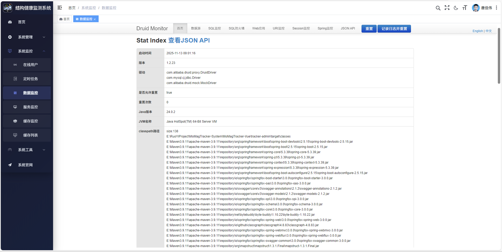

在 `E:\RuoYiProject\MoMagTracker-System\MoMagTracker-Vue3\src\views\monitor\druid\index.vue` 文件弹出的输入框填入下账号和密码

```java
                # 控制台管理用户名和密码
                login-username: admin
                login-password: admin123
```

#### 2.3.5.4 服务监控（/server/index.vue）

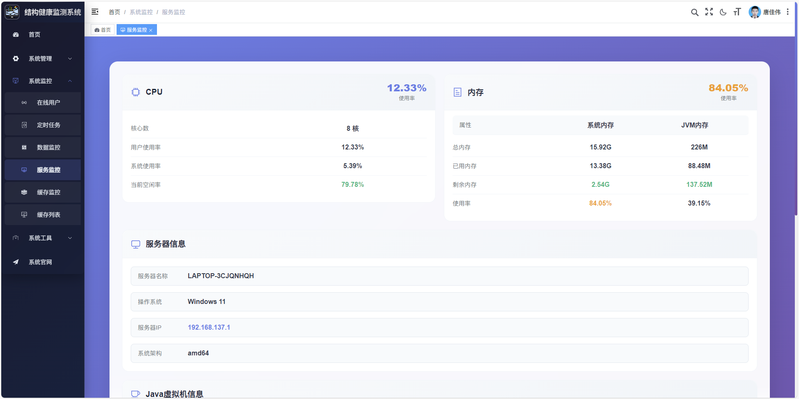

在 `E:\RuoYiProject\MoMagTracker-System\MoMagTracker-Vue3\src\views\monitor\server\index.vue` 文件中填入下述代码

```java
<template>
  <div class="server-monitor">
    <div class="main-card">
      <div class="content-block">
        <el-row :gutter="20">
          <!-- CPU信息卡片 -->
          <el-col :xs="24" :sm="12" :lg="12" class="card-box">
            <el-card class="tech-card cpu-card" shadow="hover">
              <template #header>
                <div class="card-header">
                  <Cpu class="card-icon" />
                  <span class="card-title">CPU</span>
                  <div class="card-usage" v-if="server.cpu">
                    <div class="usage-percent">{{ server.cpu.used }}%</div>
                    <div class="usage-label">使用率</div>
                  </div>
                </div>
              </template>
              <div class="info-table">
                <div class="info-row" v-if="server.cpu">
                  <div class="info-label">核心数</div>
                  <div class="info-value">{{ server.cpu.cpuNum }} 核</div>
                </div>
                <div class="info-row" v-if="server.cpu">
                  <div class="info-label">用户使用率</div>
                  <div class="info-value">{{ server.cpu.used }}%</div>
                </div>
                <div class="info-row" v-if="server.cpu">
                  <div class="info-label">系统使用率</div>
                  <div class="info-value">{{ server.cpu.sys }}%</div>
                </div>
                <div class="info-row" v-if="server.cpu">
                  <div class="info-label">当前空闲率</div>
                  <div class="info-value success-text">{{ server.cpu.free }}%</div>
                </div>
              </div>
            </el-card>
          </el-col>

          <!-- 内存信息卡片 -->
          <el-col :xs="24" :sm="12" :lg="12" class="card-box">
            <el-card class="tech-card memory-card" shadow="hover">
              <template #header>
                <div class="card-header">
                  <Tickets class="card-icon" />
                  <span class="card-title">内存</span>
                  <div class="card-usage" v-if="server.mem">
                    <div class="usage-percent" :class="{'warning-text': server.mem.usage > 80, 'danger-text': server.mem.usage > 90}">
                      {{ server.mem.usage }}%
                    </div>
                    <div class="usage-label">使用率</div>
                  </div>
                </div>
              </template>
              <div class="info-table">
                <div class="info-row header-row">
                  <div class="info-label">属性</div>
                  <div class="info-value">系统内存</div>
                  <div class="info-value">JVM内存</div>
                </div>
                <div class="info-row" v-if="server.mem && server.jvm">
                  <div class="info-label">总内存</div>
                  <div class="info-value">{{ server.mem.total }}G</div>
                  <div class="info-value">{{ server.jvm.total }}M</div>
                </div>
                <div class="info-row" v-if="server.mem && server.jvm">
                  <div class="info-label">已用内存</div>
                  <div class="info-value">{{ server.mem.used }}G</div>
                  <div class="info-value">{{ server.jvm.used }}M</div>
                </div>
                <div class="info-row" v-if="server.mem && server.jvm">
                  <div class="info-label">剩余内存</div>
                  <div class="info-value success-text">{{ server.mem.free }}G</div>
                  <div class="info-value success-text">{{ server.jvm.free }}M</div>
                </div>
                <div class="info-row" v-if="server.mem && server.jvm">
                  <div class="info-label">使用率</div>
                  <div class="info-value" :class="{'warning-text': server.mem.usage > 80, 'danger-text': server.mem.usage > 90}">
                    {{ server.mem.usage }}%
                  </div>
                  <div class="info-value" :class="{'warning-text': server.jvm.usage > 80, 'danger-text': server.jvm.usage > 90}">
                    {{ server.jvm.usage }}%
                  </div>
                </div>
              </div>
            </el-card>
          </el-col>

          <!-- 服务器信息卡片 -->
          <el-col :xs="24" class="card-box">
            <el-card class="tech-card server-card" shadow="hover">
              <template #header>
                <div class="card-header">
                  <Monitor class="card-icon" />
                  <span class="card-title">服务器信息</span>
                </div>
              </template>
              <div class="info-grid">
                <div class="info-item" v-if="server.sys">
                  <div class="info-label">服务器名称</div>
                  <div class="info-value">{{ server.sys.computerName }}</div>
                </div>
                <div class="info-item" v-if="server.sys">
                  <div class="info-label">操作系统</div>
                  <div class="info-value">{{ server.sys.osName }}</div>
                </div>
                <div class="info-item" v-if="server.sys">
                  <div class="info-label">服务器IP</div>
                  <div class="info-value ip-address">{{ server.sys.computerIp }}</div>
                </div>
                <div class="info-item" v-if="server.sys">
                  <div class="info-label">系统架构</div>
                  <div class="info-value">{{ server.sys.osArch }}</div>
                </div>
              </div>
            </el-card>
          </el-col>

          <!-- Java虚拟机信息卡片 -->
          <el-col :xs="24" class="card-box">
            <el-card class="tech-card jvm-card" shadow="hover">
              <template #header>
                <div class="card-header">
                  <CoffeeCup class="card-icon" />
                  <span class="card-title">Java虚拟机信息</span>
                </div>
              </template>
              <div class="info-grid two-columns">
                <div class="info-item" v-if="server.jvm">
                  <div class="info-label">Java名称</div>
                  <div class="info-value">{{ server.jvm.name }}</div>
                </div>
                <div class="info-item" v-if="server.jvm">
                  <div class="info-label">Java版本</div>
                  <div class="info-value">{{ server.jvm.version }}</div>
                </div>
                <div class="info-item" v-if="server.jvm">
                  <div class="info-label">启动时间</div>
                  <div class="info-value">{{ server.jvm.startTime }}</div>
                </div>
                <div class="info-item" v-if="server.jvm">
                  <div class="info-label">运行时长</div>
                  <div class="info-value">{{ server.jvm.runTime }}</div>
                </div>
                <div class="info-item full-width" v-if="server.jvm">
                  <div class="info-label">安装路径</div>
                  <div class="info-value path-text">{{ server.jvm.home }}</div>
                </div>
                <div class="info-item full-width" v-if="server.sys">
                  <div class="info-label">项目路径</div>
                  <div class="info-value path-text">{{ server.sys.userDir }}</div>
                </div>
                <div class="info-item full-width" v-if="server.jvm">
                  <div class="info-label">运行参数</div>
                  <div class="info-value args-text">{{ server.jvm.inputArgs }}</div>
                </div>
              </div>
            </el-card>
          </el-col>

          <!-- 磁盘状态卡片 -->
          <el-col :xs="24" class="card-box">
            <el-card class="tech-card disk-card" shadow="hover">
              <template #header>
                <div class="card-header">
                  <MessageBox class="card-icon" />
                  <span class="card-title">磁盘状态</span>
                </div>
              </template>
              <div class="disk-table">
                <div class="table-header">
                  <div class="table-cell">盘符路径</div>
                  <div class="table-cell">文件系统</div>
                  <div class="table-cell">盘符类型</div>
                  <div class="table-cell">总大小</div>
                  <div class="table-cell">可用大小</div>
                  <div class="table-cell">已用大小</div>
                  <div class="table-cell">使用率</div>
                </div>
                <div class="table-body" v-if="server.sysFiles">
                  <div class="table-row" v-for="(sysFile, index) in server.sysFiles" :key="index">
                    <div class="table-cell path-cell">{{ sysFile.dirName }}</div>
                    <div class="table-cell">{{ sysFile.sysTypeName }}</div>
                    <div class="table-cell">{{ sysFile.typeName }}</div>
                    <div class="table-cell">{{ sysFile.total }}</div>
                    <div class="table-cell success-text">{{ sysFile.free }}</div>
                    <div class="table-cell">{{ sysFile.used }}</div>
                    <div class="table-cell">
                      <div class="usage-display" :class="{'warning-text': sysFile.usage > 80, 'danger-text': sysFile.usage > 90}">
                        {{ sysFile.usage }}%
                        <div class="usage-bar">
                          <div class="usage-fill" :style="{width: sysFile.usage + '%'}" :class="{'warning-fill': sysFile.usage > 80, 'danger-fill': sysFile.usage > 90}"></div>
                        </div>
                      </div>
                    </div>
                  </div>
                </div>
              </div>
            </el-card>
          </el-col>
        </el-row>
      </div>
    </div>
  </div>
</template>

<script setup>
import { getServer } from '@/api/monitor/server'

const server = ref([])
const { proxy } = getCurrentInstance()

function getList() {
  proxy.$modal.loading("正在加载服务监控数据，请稍候！")
  getServer().then(response => {
    server.value = response.data
    proxy.$modal.closeLoading()
  })
}

getList()
</script>

<style scoped lang="scss">
.server-monitor {
  font-family: "Inter", "Helvetica Neue", Helvetica, "PingFang SC", "Hiragino Sans GB", "Microsoft YaHei", Arial, sans-serif;
  color: #2c3e50;
  background: linear-gradient(135deg, #667eea 0%, #764ba2 100%);
  min-height: 100vh;
  padding: 40px;
  display: flex;
  align-items: flex-start;
  justify-content: center;

  .main-card {
    background: rgba(255, 255, 255, 0.95);
    border-radius: 20px;
    box-shadow: 0 20px 60px rgba(0, 0, 0, 0.15);
    backdrop-filter: blur(20px);
    width: 100%;
    max-width: 2000px;
    padding: 30px;
    margin: 20px;
    min-height: auto;
    height: auto;

    .content-block {
      background: transparent;
      border-radius: 0;
      padding: 0;
      box-shadow: none;
      border: none;
      min-height: auto;

      &:hover {
        transform: none;
        box-shadow: none;
      }
    }
  }

  .card-box {
    margin-bottom: 20px;
  }

  .tech-card {
    border-radius: 16px;
    border: 1px solid #f1f5f9;
    transition: all 0.3s ease;
    background: white;

    &:hover {
      transform: translateY(-5px);
      box-shadow: 0 12px 40px rgba(0, 0, 0, 0.15);
    }

    :deep(.el-card__header) {
      border-bottom: 1px solid #f1f5f9;
      padding: 20px;
      background: linear-gradient(135deg, #f8fafc 0%, #f1f5f9 100%);
      border-radius: 16px 16px 0 0;
    }

    .card-header {
      display: flex;
      align-items: center;
      justify-content: space-between;

      .card-icon {
        width: 24px;
        height: 24px;
        color: #667eea;
        margin-right: 12px;
      }

      .card-title {
        font-size: 1.2rem;
        font-weight: 700;
        color: #1e293b;
        flex: 1;
      }

      .card-usage {
        text-align: center;
        .usage-percent {
          font-size: 1.5rem;
          font-weight: 800;
          color: #667eea;
          line-height: 1;
        }
        .usage-label {
          font-size: 0.8rem;
          color: #6b7280;
          margin-top: 4px;
        }
      }
    }

    :deep(.el-card__body) {
      padding: 20px;
    }
  }

  // CPU卡片特殊样式
  .cpu-card {
    .card-header {
      .card-usage .usage-percent {
        color: #667eea;
      }
    }
  }

  // 内存卡片特殊样式
  .memory-card {
    .card-header {
      .card-usage .usage-percent {
        color: #10b981;
        &.warning-text { color: #f59e0b; }
        &.danger-text { color: #ef4444; }
      }
    }
  }

  .info-table {
    .info-row {
      display: flex;
      align-items: center;
      padding: 12px 0;
      border-bottom: 1px solid #f1f5f9;

      &:last-child {
        border-bottom: none;
      }

      &.header-row {
        background: #f8fafc;
        margin: -8px 0 8px;
        padding: 12px 16px;
        border-radius: 8px;
        font-weight: 600;
        color: #374151;
      }

      .info-label {
        flex: 1;
        color: #6b7280;
        font-weight: 500;
        font-size: 0.9rem;
      }

      .info-value {
        flex: 1;
        color: #374151;
        font-weight: 600;
        text-align: center;
      }
    }
  }

  .info-grid {
    display: grid;
    gap: 16px;

    &.two-columns {
      grid-template-columns: 1fr 1fr;
    }

    .info-item {
      display: flex;
      align-items: center;
      padding: 12px 16px;
      background: #f8fafc;
      border-radius: 8px;
      border: 1px solid #e2e8f0;
      transition: all 0.3s ease;

      &:hover {
        background: #f1f5f9;
        transform: translateX(4px);
      }

      &.full-width {
        grid-column: 1 / -1;
      }

      .info-label {
        flex: 0 0 120px;
        color: #6b7280;
        font-weight: 500;
        font-size: 0.9rem;
      }

      .info-value {
        flex: 1;
        color: #374151;
        font-weight: 600;
        word-break: break-all;

        &.path-text, &.args-text {
          font-family: 'Monaco', 'Consolas', monospace;
          font-size: 0.85rem;
          color: #4b5563;
        }

        &.ip-address {
          color: #667eea;
          font-weight: 700;
        }
      }
    }
  }

  .disk-table {
    .table-header {
      display: grid;
      grid-template-columns: 1.5fr 1fr 1fr 1fr 1fr 1fr 1fr;
      gap: 12px;
      padding: 16px;
      background: linear-gradient(135deg, #f8fafc 0%, #f1f5f9 100%);
      border-radius: 8px;
      margin-bottom: 12px;
      font-weight: 600;
      color: #374151;
      font-size: 0.9rem;
    }

    .table-body {
      .table-row {
        display: grid;
        grid-template-columns: 1.5fr 1fr 1fr 1fr 1fr 1fr 1fr;
        gap: 12px;
        padding: 16px;
        border-bottom: 1px solid #f1f5f9;
        transition: all 0.3s ease;

        &:hover {
          background: #f8fafc;
          border-radius: 8px;
        }

        &:last-child {
          border-bottom: none;
        }

        .table-cell {
          display: flex;
          align-items: center;
          color: #374151;
          font-weight: 500;
          font-size: 0.9rem;

          &.path-cell {
            font-family: 'Monaco', 'Consolas', monospace;
            color: #667eea;
          }

          .usage-display {
            display: flex;
            flex-direction: column;
            align-items: center;
            gap: 4px;

            .usage-bar {
              width: 60px;
              height: 6px;
              background: #e2e8f0;
              border-radius: 3px;
              overflow: hidden;

              .usage-fill {
                height: 100%;
                background: linear-gradient(135deg, #10b981 0%, #059669 100%);
                border-radius: 3px;
                transition: all 0.3s ease;

                &.warning-fill {
                  background: linear-gradient(135deg, #f59e0b 0%, #d97706 100%);
                }

                &.danger-fill {
                  background: linear-gradient(135deg, #ef4444 0%, #dc2626 100%);
                }
              }
            }
          }
        }
      }
    }
  }

  // 文本颜色工具类
  .success-text {
    color: #10b981 !important;
    font-weight: 600;
  }

  .warning-text {
    color: #f59e0b !important;
    font-weight: 600;
  }

  .danger-text {
    color: #ef4444 !important;
    font-weight: 600;
  }
}

// 响应式设计
@media (max-width: 1200px) {
  .server-monitor {
    .info-grid.two-columns {
      grid-template-columns: 1fr;
    }

    .disk-table {
      .table-header,
      .table-body .table-row {
        grid-template-columns: 1.5fr 1fr 1fr 1fr 1fr 1fr;
        
        .table-cell:nth-child(3) {
          display: none;
        }
      }
    }
  }
}

@media (max-width: 768px) {
  .server-monitor {
    padding: 15px;

    .main-card {
      padding: 20px;
      margin: 15px;

      .content-block {
        padding: 0;
      }
    }

    .card-header {
      flex-direction: column;
      align-items: flex-start;
      gap: 12px;

      .card-usage {
        align-self: flex-end;
      }
    }

    .info-table .info-row {
      flex-direction: column;
      align-items: flex-start;
      gap: 8px;

      .info-value {
        text-align: left;
        width: 100%;
      }
    }

    .disk-table {
      .table-header,
      .table-body .table-row {
        grid-template-columns: 1fr 1fr 1fr;
        
        .table-cell:nth-child(n+4) {
          display: none;
        }
      }
    }
  }
}

@media (max-width: 480px) {
  .server-monitor {
    padding: 10px;

    .main-card {
      padding: 15px;
      margin: 10px;
    }

    .info-grid .info-item {
      flex-direction: column;
      align-items: flex-start;
      gap: 8px;

      .info-label {
        flex: none;
      }
    }

    .disk-table {
      .table-header,
      .table-body .table-row {
        grid-template-columns: 1fr 1fr;
        
        .table-cell:nth-child(n+3) {
          display: none;
        }
      }
    }
  }
}
</style>
```

#### 2.3.5.5 缓存监控（/cache/index.vue）

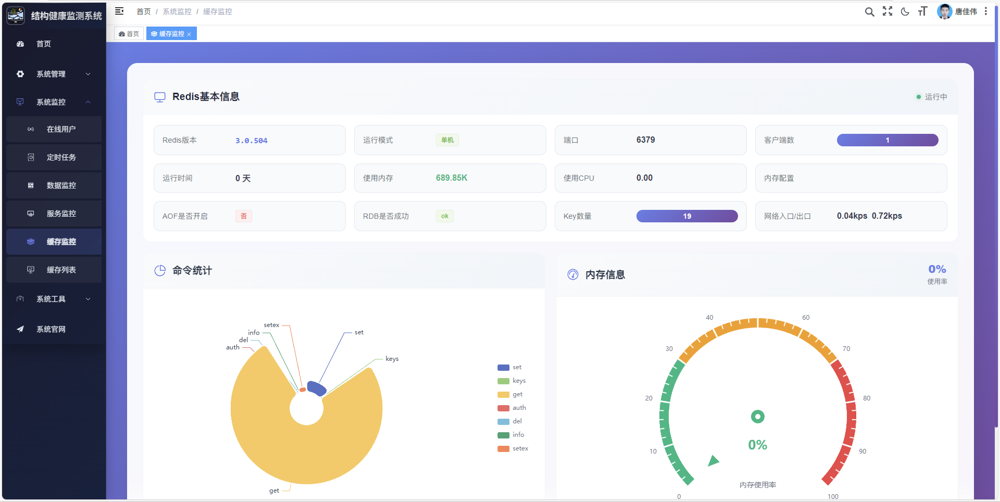

在 `E:\RuoYiProject\MoMagTracker-System\MoMagTracker-Vue3\src\views\monitor\cache\index.vue` 文件中填入下述代码

```java
<template>
  <div class="cache-monitor">
    <div class="main-card">
      <div class="content-block">
        <el-row :gutter="20">
          <!-- 基本信息卡片 -->
          <el-col :xs="24" class="card-box">
            <el-card class="tech-card info-card" shadow="hover">
              <template #header>
                <div class="card-header">
                  <Monitor class="card-icon" />
                  <span class="card-title">Redis基本信息</span>
                  <div class="card-status" v-if="cache.info">
                    <div class="status-indicator" :class="{'status-online': cache.info.connected_clients > 0}"></div>
                    <div class="status-text">{{ cache.info.connected_clients > 0 ? '运行中' : '离线' }}</div>
                  </div>
                </div>
              </template>
              <div class="info-grid three-columns">
                <div class="info-item">
                  <div class="info-label">Redis版本</div>
                  <div class="info-value version-text">{{ cache.info?.redis_version }}</div>
                </div>
                <div class="info-item">
                  <div class="info-label">运行模式</div>
                  <div class="info-value">
                    <el-tag :type="cache.info?.redis_mode === 'standalone' ? 'success' : 'warning'" class="mode-tag">
                      {{ cache.info?.redis_mode == "standalone" ? "单机" : "集群" }}
                    </el-tag>
                  </div>
                </div>
                <div class="info-item">
                  <div class="info-label">端口</div>
                  <div class="info-value">{{ cache.info?.tcp_port }}</div>
                </div>
                <div class="info-item">
                  <div class="info-label">客户端数</div>
                  <div class="info-value client-count">{{ cache.info?.connected_clients }}</div>
                </div>
                <div class="info-item">
                  <div class="info-label">运行时间</div>
                  <div class="info-value">{{ cache.info?.uptime_in_days }} 天</div>
                </div>
                <div class="info-item">
                  <div class="info-label">使用内存</div>
                  <div class="info-value memory-usage">{{ cache.info?.used_memory_human }}</div>
                </div>
                <div class="info-item">
                  <div class="info-label">使用CPU</div>
                  <div class="info-value">{{ cache.info ? parseFloat(cache.info.used_cpu_user_children).toFixed(2) : '0.00' }}</div>
                </div>
                <div class="info-item">
                  <div class="info-label">内存配置</div>
                  <div class="info-value">{{ cache.info?.maxmemory_human }}</div>
                </div>
                <div class="info-item">
                  <div class="info-label">AOF是否开启</div>
                  <div class="info-value">
                    <el-tag :type="cache.info?.aof_enabled == '0' ? 'danger' : 'success'" class="feature-tag">
                      {{ cache.info?.aof_enabled == "0" ? "否" : "是" }}
                    </el-tag>
                  </div>
                </div>
                <div class="info-item">
                  <div class="info-label">RDB是否成功</div>
                  <div class="info-value">
                    <el-tag :type="cache.info?.rdb_last_bgsave_status === 'ok' ? 'success' : 'danger'" class="feature-tag">
                      {{ cache.info?.rdb_last_bgsave_status }}
                    </el-tag>
                  </div>
                </div>
                <div class="info-item">
                  <div class="info-label">Key数量</div>
                  <div class="info-value key-count">{{ cache.dbSize }}</div>
                </div>
                <div class="info-item">
                  <div class="info-label">网络入口/出口</div>
                  <div class="info-value network-traffic">
                    <div class="traffic-in">{{ cache.info?.instantaneous_input_kbps }}kps</div>
                    <div class="traffic-out">{{ cache.info?.instantaneous_output_kbps }}kps</div>
                  </div>
                </div>
              </div>
            </el-card>
          </el-col>

          <!-- 命令统计卡片 -->
          <el-col :xs="24" :sm="12" :lg="12" class="card-box">
            <el-card class="tech-card command-card" shadow="hover">
              <template #header>
                <div class="card-header">
                  <PieChart class="card-icon" />
                  <span class="card-title">命令统计</span>
                </div>
              </template>
              <div class="chart-container">
                <div ref="commandstats" class="chart" style="height: 420px" />
              </div>
            </el-card>
          </el-col>

          <!-- 内存信息卡片 -->
          <el-col :xs="24" :sm="12" :lg="12" class="card-box">
            <el-card class="tech-card memory-card" shadow="hover">
              <template #header>
                <div class="card-header">
                  <Odometer class="card-icon" />
                  <span class="card-title">内存信息</span>
                  <div class="memory-indicator" v-if="cache.info">
                    <div class="memory-percent">{{ getMemoryUsagePercent() }}%</div>
                    <div class="memory-label">使用率</div>
                  </div>
                </div>
              </template>
              <div class="chart-container">
                <div ref="usedmemory" class="chart" style="height: 420px" />
              </div>
            </el-card>
          </el-col>
        </el-row>
      </div>
    </div>
  </div>
</template>

<script setup name="Cache">
import { getCache } from '@/api/monitor/cache'
import * as echarts from 'echarts'

const cache = ref([])
const commandstats = ref(null)
const usedmemory = ref(null)
const { proxy } = getCurrentInstance()

// 计算内存使用百分比
function getMemoryUsagePercent() {
  if (!cache.value.info?.used_memory_human || !cache.value.info?.maxmemory_human) return 0
  
  const used = parseMemorySize(cache.value.info.used_memory_human)
  const max = parseMemorySize(cache.value.info.maxmemory_human)
  
  if (max === 0) return 0
  return Math.round((used / max) * 100)
}

// 解析内存大小字符串为字节数
function parseMemorySize(sizeStr) {
  if (!sizeStr) return 0
  
  const units = {
    'K': 1024,
    'M': 1024 * 1024,
    'G': 1024 * 1024 * 1024,
    'T': 1024 * 1024 * 1024 * 1024
  }
  
  const match = sizeStr.match(/^([\d.]+)([KMGTP]?)/i)
  if (!match) return 0
  
  const value = parseFloat(match[1])
  const unit = match[2].toUpperCase()
  
  return value * (units[unit] || 1)
}

function getList() {
  proxy.$modal.loading("正在加载缓存监控数据，请稍候！")
  getCache().then(response => {
    proxy.$modal.closeLoading()
    cache.value = response.data

    // 命令统计图表
    const commandstatsIntance = echarts.init(commandstats.value, "macarons")
    commandstatsIntance.setOption({
      tooltip: {
        trigger: "item",
        formatter: "{a} <br/>{b} : {c} ({d}%)",
        backgroundColor: 'rgba(255, 255, 255, 0.95)',
        borderColor: '#e2e8f0',
        textStyle: {
          color: '#374151'
        }
      },
      legend: {
        orient: 'vertical',
        right: 10,
        top: 'center',
        textStyle: {
          color: '#6b7280'
        }
      },
      series: [
        {
          name: "命令",
          type: "pie",
          roseType: "radius",
          radius: ['15%', '70%'],
          center: ['40%', '50%'],
          data: response.data.commandStats,
          animationEasing: "cubicInOut",
          animationDuration: 1000,
          itemStyle: {
            borderRadius: 8,
            borderColor: '#fff',
            borderWidth: 2
          },
          label: {
            color: '#374151',
            fontWeight: '500'
          },
          emphasis: {
            itemStyle: {
              shadowBlur: 10,
              shadowOffsetX: 0,
              shadowColor: 'rgba(0, 0, 0, 0.5)'
            }
          }
        }
      ]
    })

    // 内存信息图表
    const memoryPercent = getMemoryUsagePercent()
    const usedmemoryInstance = echarts.init(usedmemory.value, "macarons")
    usedmemoryInstance.setOption({
      tooltip: {
        formatter: '{b} <br/>{a} : ' + cache.value.info.used_memory_human,
        backgroundColor: 'rgba(255, 255, 255, 0.95)',
        borderColor: '#e2e8f0',
        textStyle: {
          color: '#374151'
        }
      },
      series: [
        {
          name: "内存消耗",
          type: "gauge",
          radius: '90%',
          min: 0,
          max: 100,
          progress: {
            show: true,
            width: 18,
            itemStyle: {
              color: getMemoryColor(memoryPercent)
            }
          },
          axisLine: {
            lineStyle: {
              width: 18,
              color: [
                [0.3, '#10b981'],
                [0.7, '#f59e0b'],
                [1, '#ef4444']
              ]
            }
          },
          axisTick: {
            distance: -18,
            length: 8,
            lineStyle: {
              color: '#fff',
              width: 2
            }
          },
          splitLine: {
            distance: -18,
            length: 18,
            lineStyle: {
              color: '#fff',
              width: 3
            }
          },
          axisLabel: {
            distance: -30,
            color: '#6b7280',
            fontSize: 12
          },
          anchor: {
            show: true,
            showAbove: true,
            size: 18,
            itemStyle: {
              borderWidth: 8,
              borderColor: getMemoryColor(memoryPercent)
            }
          },
          pointer: {
            icon: 'path://M12.8,0.7l12,40.1H0.7L12.8,0.7z',
            length: '12%',
            width: 20,
            offsetCenter: [0, '-60%'],
            itemStyle: {
              color: getMemoryColor(memoryPercent)
            }
          },
          detail: {
            valueAnimation: true,
            formatter: '{value}%',
            color: getMemoryColor(memoryPercent),
            fontSize: 24,
            fontWeight: 'bold',
            offsetCenter: [0, '30%']
          },
          title: {
            offsetCenter: [0, '70%'],
            color: '#6b7280',
            fontSize: 14
          },
          data: [
            {
              value: memoryPercent,
              name: '内存使用率'
            }
          ]
        }
      ]
    })

    // 窗口大小变化时重绘图表
    window.addEventListener("resize", () => {
      commandstatsIntance.resize()
      usedmemoryInstance.resize()
    })
  })
}

// 根据内存使用率获取颜色
function getMemoryColor(percent) {
  if (percent < 50) return '#10b981'
  if (percent < 80) return '#f59e0b'
  return '#ef4444'
}

getList()
</script>

<style scoped lang="scss">
.cache-monitor {
  font-family: "Inter", "Helvetica Neue", Helvetica, "PingFang SC", "Hiragino Sans GB", "Microsoft YaHei", Arial, sans-serif;
  color: #2c3e50;
  background: linear-gradient(135deg, #667eea 0%, #764ba2 100%);
  min-height: 100vh;
  padding: 20px;
  display: flex;
  align-items: flex-start;
  justify-content: center;

  .main-card {
    background: rgba(255, 255, 255, 0.95);
    border-radius: 20px;
    box-shadow: 0 20px 60px rgba(0, 0, 0, 0.15);
    backdrop-filter: blur(20px);
    width: 100%;
    max-width: 2000px;
    padding: 30px;
    margin: 20px;
    min-height: auto;
    height: auto;

    .content-block {
      background: transparent;
      border-radius: 0;
      padding: 0;
      box-shadow: none;
      border: none;
      min-height: auto;

      &:hover {
        transform: none;
        box-shadow: none;
      }
    }
  }

  .card-box {
    margin-bottom: 20px;
  }

  .tech-card {
    border-radius: 16px;
    border: 1px solid #f1f5f9;
    transition: all 0.3s ease;
    background: white;

    &:hover {
      transform: translateY(-5px);
      box-shadow: 0 12px 40px rgba(0, 0, 0, 0.15);
    }

    :deep(.el-card__header) {
      border-bottom: 1px solid #f1f5f9;
      padding: 20px;
      background: linear-gradient(135deg, #f8fafc 0%, #f1f5f9 100%);
      border-radius: 16px 16px 0 0;
    }

    .card-header {
      display: flex;
      align-items: center;
      justify-content: space-between;

      .card-icon {
        width: 24px;
        height: 24px;
        color: #667eea;
        margin-right: 12px;
      }

      .card-title {
        font-size: 1.2rem;
        font-weight: 700;
        color: #1e293b;
        flex: 1;
      }

      .card-status {
        display: flex;
        align-items: center;
        gap: 8px;

        .status-indicator {
          width: 8px;
          height: 8px;
          border-radius: 50%;
          background: #ef4444;

          &.status-online {
            background: #10b981;
            box-shadow: 0 0 8px rgba(16, 185, 129, 0.6);
          }
        }

        .status-text {
          font-size: 0.9rem;
          color: #6b7280;
          font-weight: 500;
        }
      }

      .memory-indicator {
        text-align: center;
        .memory-percent {
          font-size: 1.3rem;
          font-weight: 800;
          color: #667eea;
          line-height: 1;
        }
        .memory-label {
          font-size: 0.8rem;
          color: #6b7280;
          margin-top: 4px;
        }
      }
    }

    :deep(.el-card__body) {
      padding: 20px;
    }
  }

  .info-grid {
    display: grid;
    gap: 16px;

    &.three-columns {
      grid-template-columns: repeat(auto-fit, minmax(300px, 1fr));
    }

    .info-item {
      display: flex;
      align-items: center;
      padding: 16px;
      background: #f8fafc;
      border-radius: 12px;
      border: 1px solid #e2e8f0;
      transition: all 0.3s ease;

      &:hover {
        background: #f1f5f9;
        transform: translateX(4px);
        box-shadow: 0 4px 12px rgba(0, 0, 0, 0.05);
      }

      .info-label {
        flex: 0 0 140px;
        color: #6b7280;
        font-weight: 500;
        font-size: 0.9rem;
      }

      .info-value {
        flex: 1;
        color: #374151;
        font-weight: 600;
        display: flex;
        align-items: center;
        gap: 8px;

        &.version-text {
          color: #667eea;
          font-family: 'Monaco', 'Consolas', monospace;
        }

        &.memory-usage {
          color: #10b981;
          font-weight: 700;
        }

        &.client-count, &.key-count {
          background: linear-gradient(135deg, #667eea 0%, #764ba2 100%);
          color: white;
          padding: 4px 12px;
          border-radius: 20px;
          font-size: 0.9rem;
          display: inline-flex;
          justify-content: center;
          min-width: 40px;
        }

        .network-traffic {
          display: flex;
          flex-direction: column;
          gap: 4px;

          .traffic-in {
            color: #10b981;
            font-weight: 600;
          }

          .traffic-out {
            color: #f59e0b;
            font-weight: 600;
          }
        }
      }
    }
  }

  .mode-tag, .feature-tag {
    :deep(.el-tag) {
      border-radius: 6px;
      font-weight: 600;
      border: none;
      min-width: 50px;
      text-align: center;
    }
  }

  .chart-container {
    .chart {
      width: 100%;
      border-radius: 8px;
    }
  }
}

// 响应式设计
@media (max-width: 1200px) {
  .cache-monitor {
    .info-grid.three-columns {
      grid-template-columns: repeat(auto-fit, minmax(250px, 1fr));
    }
  }
}

@media (max-width: 768px) {
  .cache-monitor {
    padding: 15px;

    .main-card {
      padding: 20px;
      margin: 15px;

      .content-block {
        padding: 0;
      }
    }

    .card-header {
      flex-direction: column;
      align-items: flex-start;
      gap: 12px;

      .card-status, .memory-indicator {
        align-self: flex-end;
      }
    }

    .info-grid.three-columns {
      grid-template-columns: 1fr;
    }

    .info-item {
      flex-direction: column;
      align-items: flex-start;
      gap: 8px;

      .info-label {
        flex: none;
      }

      .info-value {
        width: 100%;
        justify-content: flex-start;
      }
    }
  }
}

@media (max-width: 480px) {
  .cache-monitor {
    padding: 10px;

    .main-card {
      padding: 15px;
      margin: 10px;
    }

    .chart-container .chart {
      height: 300px !important;
    }
  }
}

// ECharts 主题优化
:deep(.macarons) {
  .echarts-tooltip {
    background: rgba(255, 255, 255, 0.95) !important;
    border: 1px solid #e2e8f0 !important;
    border-radius: 8px !important;
    box-shadow: 0 4px 20px rgba(0, 0, 0, 0.1) !important;
  }
}
</style>
```

#### 2.3.5.6 缓存列表（/cache/list.vue）

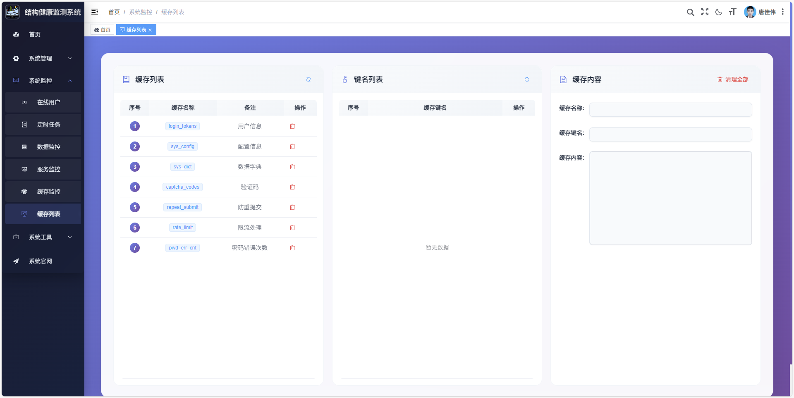

在 `E:\RuoYiProject\MoMagTracker-System\MoMagTracker-Vue3\src\views\monitor\cache\list.vue` 文件中填入下述代码

```java
<template>
  <div class="cache-management">
    <div class="main-card">
      <div class="content-block">
        <el-row :gutter="20">
          <!-- 缓存列表 -->
          <el-col :xs="24" :md="8" class="card-box">
            <el-card class="tech-card cache-list-card" shadow="hover">
              <template #header>
                <div class="card-header">
                  <Collection class="card-icon" />
                  <span class="card-title">缓存列表</span>
                  <div class="card-actions">
                    <el-tooltip content="刷新缓存列表" placement="top">
                      <el-button
                        link
                        type="primary"
                        icon="Refresh"
                        @click="refreshCacheNames()"
                        class="refresh-btn"
                      ></el-button>
                    </el-tooltip>
                  </div>
                </div>
              </template>
              <div class="table-container">
                <el-table
                  v-loading="loading"
                  :data="cacheNames"
                  :height="tableHeight"
                  highlight-current-row
                  @row-click="getCacheKeys"
                  class="tech-table"
                >
                  <el-table-column
                    label="序号"
                    width="70"
                    type="index"
                    align="center"
                  >
                    <template #default="scope">
                      <div class="index-badge">{{ scope.$index + 1 }}</div>
                    </template>
                  </el-table-column>

                  <el-table-column
                    label="缓存名称"
                    align="center"
                    prop="cacheName"
                    :show-overflow-tooltip="true"
                    :formatter="nameFormatter"
                  >
                    <template #default="scope">
                      <div class="cache-name">
                        <el-tag size="small" class="cache-tag">
                          {{ nameFormatter(scope.row) }}
                        </el-tag>
                      </div>
                    </template>
                  </el-table-column>

                  <el-table-column
                    label="备注"
                    align="center"
                    prop="remark"
                    :show-overflow-tooltip="true"
                  >
                    <template #default="scope">
                      <div class="remark-text">{{ scope.row.remark || '-' }}</div>
                    </template>
                  </el-table-column>
                  
                  <el-table-column
                    label="操作"
                    width="80"
                    align="center"
                    class-name="small-padding fixed-width"
                  >
                    <template #default="scope">
                      <el-tooltip content="清理缓存" placement="top">
                        <el-button
                          link
                          type="danger"
                          icon="Delete"
                          @click.stop="handleClearCacheName(scope.row)"
                          class="action-btn delete"
                        ></el-button>
                      </el-tooltip>
                    </template>
                  </el-table-column>
                </el-table>
              </div>
            </el-card>
          </el-col>

          <!-- 键名列表 -->
          <el-col :xs="24" :md="8" class="card-box">
            <el-card class="tech-card keys-card" shadow="hover">
              <template #header>
                <div class="card-header">
                  <Key class="card-icon" />
                  <span class="card-title">键名列表</span>
                  <div class="card-actions">
                    <el-tooltip content="刷新键名列表" placement="top">
                      <el-button
                        link
                        type="primary"
                        icon="Refresh"
                        @click="refreshCacheKeys()"
                        class="refresh-btn"
                      ></el-button>
                    </el-tooltip>
                  </div>
                </div>
              </template>
              <div class="table-container">
                <el-table
                  v-loading="subLoading"
                  :data="cacheKeys"
                  :height="tableHeight"
                  highlight-current-row
                  @row-click="handleCacheValue"
                  class="tech-table"
                >
                  <el-table-column
                    label="序号"
                    width="70"
                    type="index"
                    align="center"
                  >
                    <template #default="scope">
                      <div class="index-badge">{{ scope.$index + 1 }}</div>
                    </template>
                  </el-table-column>
                  
                  <el-table-column
                    label="缓存键名"
                    align="center"
                    :show-overflow-tooltip="true"
                    :formatter="keyFormatter"
                  >
                    <template #default="scope">
                      <div class="key-name">
                        <el-tag size="small" type="info" class="key-tag">
                          {{ keyFormatter(scope.row) }}
                        </el-tag>
                      </div>
                    </template>
                  </el-table-column>
                  
                  <el-table-column
                    label="操作"
                    width="80"
                    align="center"
                    class-name="small-padding fixed-width"
                  >
                    <template #default="scope">
                      <el-tooltip content="删除键名" placement="top">
                        <el-button
                          link
                          type="danger"
                          icon="Delete"
                          @click.stop="handleClearCacheKey(scope.row)"
                          class="action-btn delete"
                        ></el-button>
                      </el-tooltip>
                    </template>
                  </el-table-column>
                </el-table>
              </div>
            </el-card>
          </el-col>

          <!-- 缓存内容 -->
          <el-col :xs="24" :md="8" class="card-box">
            <el-card class="tech-card content-card" shadow="hover">
              <template #header>
                <div class="card-header">
                  <Document class="card-icon" />
                  <span class="card-title">缓存内容</span>
                  <div class="card-actions">
                    <el-tooltip content="清理全部缓存" placement="top">
                      <el-button
                        link
                        type="danger"
                        icon="Delete"
                        @click="handleClearCacheAll()"
                        class="clear-all-btn"
                      >
                        清理全部
                      </el-button>
                    </el-tooltip>
                  </div>
                </div>
              </template>
              <div class="cache-content">
                <el-form :model="cacheForm" class="tech-form">
                  <el-row :gutter="20">
                    <el-col :span="24">
                      <el-form-item label="缓存名称:" class="form-item">
                        <el-input 
                          v-model="cacheForm.cacheName" 
                          :readonly="true" 
                          class="tech-input readonly"
                        />
                      </el-form-item>
                    </el-col>
                    <el-col :span="24">
                      <el-form-item label="缓存键名:" class="form-item">
                        <el-input 
                          v-model="cacheForm.cacheKey" 
                          :readonly="true" 
                          class="tech-input readonly"
                        />
                      </el-form-item>
                    </el-col>
                    <el-col :span="24">
                      <el-form-item label="缓存内容:" class="form-item">
                        <el-input
                          v-model="cacheForm.cacheValue"
                          type="textarea"
                          :rows="10"
                          :readonly="true"
                          class="tech-textarea readonly"
                          resize="none"
                        />
                      </el-form-item>
                    </el-col>
                  </el-row>
                </el-form>
              </div>
            </el-card>
          </el-col>
        </el-row>
      </div>
    </div>
  </div>
</template>

<script setup name="CacheList">
import { listCacheName, listCacheKey, getCacheValue, clearCacheName, clearCacheKey, clearCacheAll } from "@/api/monitor/cache"

const { proxy } = getCurrentInstance()

const cacheNames = ref([])
const cacheKeys = ref([])
const cacheForm = ref({})
const loading = ref(true)
const subLoading = ref(false)
const nowCacheName = ref("")
const tableHeight = ref(window.innerHeight - 200)

/** 查询缓存名称列表 */
function getCacheNames() {
  loading.value = true
  listCacheName().then(response => {
    cacheNames.value = response.data
    loading.value = false
  })
}

/** 刷新缓存名称列表 */
function refreshCacheNames() {
  getCacheNames()
  proxy.$modal.msgSuccess("刷新缓存列表成功")
}

/** 清理指定名称缓存 */
function handleClearCacheName(row) {
  proxy.$modal.confirm(`是否确认清理缓存名称 "${row.cacheName}"？`).then(function () {
    return clearCacheName(row.cacheName)
  }).then(() => {
    proxy.$modal.msgSuccess("清理缓存名称[" + row.cacheName + "]成功")
    getCacheKeys()
  }).catch(() => {})
}

/** 查询缓存键名列表 */
function getCacheKeys(row) {
  const cacheName = row !== undefined ? row.cacheName : nowCacheName.value
  if (cacheName === "") {
    return
  }
  subLoading.value = true
  listCacheKey(cacheName).then(response => {
    cacheKeys.value = response.data
    subLoading.value = false
    nowCacheName.value = cacheName
  })
}

/** 刷新缓存键名列表 */
function refreshCacheKeys() {
  getCacheKeys()
  proxy.$modal.msgSuccess("刷新键名列表成功")
}

/** 清理指定键名缓存 */
function handleClearCacheKey(cacheKey) {
  proxy.$modal.confirm(`是否确认删除缓存键名 "${cacheKey}"？`).then(function () {
    return clearCacheKey(cacheKey)
  }).then(() => {
    proxy.$modal.msgSuccess("清理缓存键名[" + cacheKey + "]成功")
    getCacheKeys()
  }).catch(() => {})
}

/** 列表前缀去除 */
function nameFormatter(row) {
  return row.cacheName.replace(":", "")
}

/** 键名前缀去除 */
function keyFormatter(cacheKey) {
  return cacheKey.replace(nowCacheName.value, "")
}

/** 查询缓存内容详细 */
function handleCacheValue(cacheKey) {
  getCacheValue(nowCacheName.value, cacheKey).then(response => {
    cacheForm.value = response.data
  })
}

/** 清理全部缓存 */
function handleClearCacheAll() {
  proxy.$modal.confirm("是否确认清理全部缓存？此操作不可恢复！").then(function () {
    return clearCacheAll()
  }).then(() => {
    proxy.$modal.msgSuccess("清理全部缓存成功")
    getCacheNames()
    cacheKeys.value = []
    cacheForm.value = {}
  }).catch(() => {})
}

getCacheNames()
</script>

<style scoped lang="scss">
.cache-management {
  font-family: "Inter", "Helvetica Neue", Helvetica, "PingFang SC", "Hiragino Sans GB", "Microsoft YaHei", Arial, sans-serif;
  color: #2c3e50;
  background: linear-gradient(135deg, #667eea 0%, #764ba2 100%);
  min-height: 100vh;
  padding: 20px;
  display: flex;
  align-items: flex-start;
  justify-content: center;

  .main-card {
    background: rgba(255, 255, 255, 0.95);
    border-radius: 20px;
    box-shadow: 0 20px 60px rgba(0, 0, 0, 0.15);
    backdrop-filter: blur(20px);
    width: 100%;
    max-width: 2200px;
    padding: 30px;
    margin: 20px;
    min-height: auto;
    height: auto;

    .content-block {
      background: transparent;
      border-radius: 0;
      padding: 0;
      box-shadow: none;
      border: none;
      min-height: auto;

      &:hover {
        transform: none;
        box-shadow: none;
      }
    }
  }

  .card-box {
    margin-bottom: 0;
  }

  .tech-card {
    border-radius: 16px;
    border: 1px solid #f1f5f9;
    transition: all 0.3s ease;
    background: white;
    height: calc(100vh - 180px);
    display: flex;
    flex-direction: column;

    &:hover {
      transform: translateY(-5px);
      box-shadow: 0 12px 40px rgba(0, 0, 0, 0.15);
    }

    :deep(.el-card__header) {
      border-bottom: 1px solid #f1f5f9;
      padding: 20px;
      background: linear-gradient(135deg, #f8fafc 0%, #f1f5f9 100%);
      border-radius: 16px 16px 0 0;
      flex-shrink: 0;
    }

    .card-header {
      display: flex;
      align-items: center;
      justify-content: space-between;

      .card-icon {
        width: 20px;
        height: 20px;
        color: #667eea;
        margin-right: 12px;
      }

      .card-title {
        font-size: 1.1rem;
        font-weight: 700;
        color: #1e293b;
        flex: 1;
      }

      .card-actions {
        display: flex;
        align-items: center;
        gap: 8px;

        .refresh-btn, .clear-all-btn {
          padding: 4px 8px;
          border-radius: 6px;
          transition: all 0.3s ease;
          font-weight: 500;

          &:hover {
            background: #f1f5f9;
            transform: scale(1.05);
          }
        }

        .clear-all-btn {
          color: #ef4444;
          
          &:hover {
            color: #dc2626;
            background: #fef2f2;
          }
        }
      }
    }

    :deep(.el-card__body) {
      padding: 0;
      flex: 1;
      display: flex;
      flex-direction: column;
    }
  }

  .table-container {
    flex: 1;
    padding: 16px;
    display: flex;
    flex-direction: column;
  }

  .tech-table {
    flex: 1;
    border-radius: 8px;
    overflow: hidden;

    :deep(.el-table__header) {
      th {
        background: linear-gradient(135deg, #f8fafc 0%, #f1f5f9 100%);
        color: #374151;
        font-weight: 600;
        border-bottom: 1px solid #e2e8f0;
      }
    }

    :deep(.el-table__body) {
      tr {
        transition: all 0.3s ease;
        
        &:hover {
          transform: translateX(2px);
          box-shadow: 0 2px 8px rgba(0, 0, 0, 0.1);
        }

        &.current-row {
          background: linear-gradient(135deg, #667eea15 0%, #764ba215 100%);
        }
      }
    }

    .index-badge {
      display: inline-flex;
      align-items: center;
      justify-content: center;
      width: 24px;
      height: 24px;
      background: linear-gradient(135deg, #667eea 0%, #764ba2 100%);
      color: white;
      border-radius: 50%;
      font-size: 0.8rem;
      font-weight: 600;
    }

    .cache-name, .key-name {
      display: flex;
      justify-content: center;
    }

    .cache-tag, .key-tag {
      :deep(.el-tag) {
        border: none;
        border-radius: 6px;
        font-weight: 500;
        max-width: 120px;
        overflow: hidden;
        text-overflow: ellipsis;
        white-space: nowrap;
      }
    }

    .cache-tag {
      :deep(.el-tag) {
        background: linear-gradient(135deg, #667eea 0%, #764ba2 100%);
        color: white;
      }
    }

    .key-tag {
      :deep(.el-tag) {
        background: linear-gradient(135deg, #10b981 0%, #059669 100%);
        color: white;
      }
    }

    .remark-text {
      color: #6b7280;
      font-size: 0.9rem;
    }

    .action-btn {
      width: 32px;
      height: 32px;
      border-radius: 6px;
      display: flex;
      align-items: center;
      justify-content: center;
      transition: all 0.3s ease;

      &:hover {
        transform: scale(1.1);
        background: #fef2f2;
      }

      &.delete {
        color: #ef4444;
      }
    }
  }

  .cache-content {
    flex: 1;
    padding: 20px;
    display: flex;
    flex-direction: column;
  }

  .tech-form {
    flex: 1;
    display: flex;
    flex-direction: column;

    .form-item {
      margin-bottom: 20px;

      :deep(.el-form-item__label) {
        font-weight: 600;
        color: #374151;
        margin-bottom: 8px;
      }
    }
  }

  .tech-input, .tech-textarea {
    :deep(.el-input__wrapper) {
      border-radius: 8px;
      border: 1px solid #e2e8f0;
      transition: all 0.3s ease;
      box-shadow: 0 1px 3px rgba(0, 0, 0, 0.05);
      background: #f8fafc;
      
      &:hover {
        border-color: #667eea;
        box-shadow: 0 2px 8px rgba(102, 126, 234, 0.1);
      }
    }

    &.readonly {
      :deep(.el-input__wrapper) {
        background: #f8fafc;
        border-color: #e2e8f0;
        
        .el-input__inner {
          color: #6b7280;
          cursor: not-allowed;
        }
      }
    }
  }

  .tech-textarea {
    :deep(.el-textarea__inner) {
      border-radius: 8px;
      border: 1px solid #e2e8f0;
      background: #f8fafc;
      font-family: 'Monaco', 'Consolas', monospace;
      font-size: 0.9rem;
      color: #374151;
      resize: vertical;
      
      &:focus {
        border-color: #667eea;
        box-shadow: 0 0 0 2px rgba(102, 126, 234, 0.1);
      }
    }

    &.readonly {
      :deep(.el-textarea__inner) {
        background: #f8fafc;
        border-color: #e2e8f0;
        color: #6b7280;
        cursor: not-allowed;
        resize: none;
      }
    }
  }
}

// 响应式设计
@media (max-width: 1200px) {
  .cache-management {
    .main-card {
      padding: 25px;
      margin: 15px;
    }

    .tech-card {
      height: calc(100vh - 160px);
    }
  }
}

@media (max-width: 768px) {
  .cache-management {
    padding: 15px;

    .main-card {
      padding: 20px;
      margin: 15px;
    }

    .tech-card {
      height: auto;
      min-height: 500px;
      margin-bottom: 20px;
    }

    .card-header {
      flex-direction: column;
      align-items: flex-start;
      gap: 12px;

      .card-actions {
        align-self: flex-end;
      }
    }
  }
}

@media (max-width: 480px) {
  .cache-management {
    padding: 10px;

    .main-card {
      padding: 15px;
      margin: 10px;
    }

    .table-container {
      padding: 12px;
    }

    .cache-content {
      padding: 15px;
    }
  }
}

// 加载动画优化
:deep(.el-loading-mask) {
  background-color: rgba(255, 255, 255, 0.8);
  backdrop-filter: blur(4px);
  
  .el-loading-spinner {
    .path {
      stroke: #667eea;
    }
  }
}
</style>
```

### 2.3.6 系统工具开发（src/views/tool）

#### 2.3.6.1 表单构建（/build/index.vue 和 /build/RightPanel.vue）

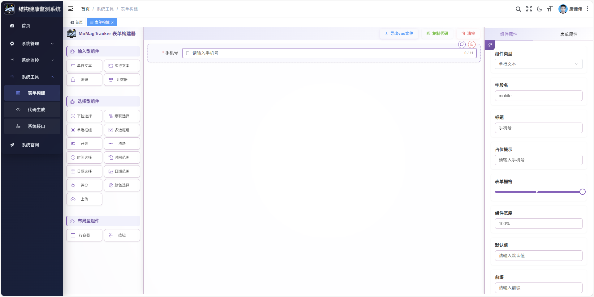

在 `E:\RuoYiProject\MoMagTracker-System\MoMagTracker-Vue3\src\views\tool\build\index.vue` 和 `E:\RuoYiProject\MoMagTracker-System\MoMagTracker-Vue3\src\views\tool\build\RightPanel.vue` 文件中分别加入下述代码

```java
<template>
  <div class="container">
    <div class="left-board">
      <div class="logo-wrapper">
        <div class="logo">
           MoMagTracker 表单构建器
        </div>
      </div>
      <el-scrollbar class="left-scrollbar">
        <div class="components-list">
          <div class="components-title">
            <svg-icon icon-class="component" />输入型组件
          </div>
          <draggable class="components-draggable" :list="inputComponents"
            :group="{ name: 'componentsGroup', pull: 'clone', put: false }" :clone="cloneComponent"
            draggable=".components-item" :sort="false" @end="onEnd" item-key="label">
            <template #item="{ element, index }">
              <div :key="index" class="components-item" @click="addComponent(element)">
                <div class="components-body">
                  <svg-icon :icon-class="element.tagIcon" />
                  <span class="component-text">{{ element.label }}</span>
                </div>
              </div>
            </template>
          </draggable>
          <div class="components-title">
            <svg-icon icon-class="component" />选择型组件
          </div>
          <draggable class="components-draggable" :list="selectComponents"
            :group="{ name: 'componentsGroup', pull: 'clone', put: false }" :clone="cloneComponent"
            draggable=".components-item" :sort="false" @end="onEnd" item-key="label">
            <template #item="{ element, index }">
              <div :key="index" class="components-item" @click="addComponent(element)">
                <div class="components-body">
                  <svg-icon :icon-class="element.tagIcon" />
                  <span class="component-text">{{ element.label }}</span>
                </div>
              </div>
            </template>
          </draggable>
          <div class="components-title">
            <svg-icon icon-class="component" /> 布局型组件
          </div>
          <draggable class="components-draggable" :list="layoutComponents"
            :group="{ name: 'componentsGroup', pull: 'clone', put: false }" :clone="cloneComponent"
            draggable=".components-item" :sort="false" @end="onEnd" item-key="label">
            <template #item="{ element, index }">
              <div :key="index" class="components-item" @click="addComponent(element)">
                <div class="components-body">
                  <svg-icon :icon-class="element.tagIcon" />
                  <span class="component-text">{{ element.label }}</span>
                </div>
              </div>
            </template>
          </draggable>
        </div>
      </el-scrollbar>
    </div>
    <div class="center-board">
      <div class="action-bar">
        <el-button icon="Download" type="primary" text @click="download" class="tech-btn-primary">
          导出vue文件
        </el-button>
        <el-button icon="DocumentCopy" type="success" text @click="copy" class="tech-btn-secondary copy-btn-main">
          复制代码
        </el-button>
        <el-button icon="Delete" text @click="empty" type="danger" class="tech-btn-danger delete-btn">
          清空
        </el-button>
      </div>
      <el-scrollbar class="center-scrollbar">
        <el-row class="center-board-row" :gutter="formConf.gutter">
          <el-form :size="formConf.size" :label-position="formConf.labelPosition" :disabled="formConf.disabled"
            :label-width="formConf.labelWidth + 'px'">
            <draggable class="drawing-board" :list="drawingList" :animation="340" group="componentsGroup"
              item-key="label">
              <template #item="{ element, index }">
                <draggable-item :key="element.renderKey" :drawing-list="drawingList" :element="element" :index="index"
                  :active-id="activeId" :form-conf="formConf" @activeItem="activeFormItem" @copyItem="drawingItemCopy"
                  @deleteItem="drawingItemDelete" />
              </template>
            </draggable>
            <div v-show="!drawingList.length" class="empty-info">
              从左侧拖入或点选组件进行表单设计
            </div>
          </el-form>
        </el-row>
      </el-scrollbar>
    </div>
    <right-panel :active-data="activeData" :form-conf="formConf" :show-field="!!drawingList.length"
      @tag-change="tagChange" />

    <code-type-dialog v-model="dialogVisible" title="选择生成类型" :showFileName="showFileName" @confirm="generate" />
    <input id="copyNode" type="hidden" />
  </div>
</template>

<script setup>
import draggable from "vuedraggable/dist/vuedraggable.common"
import ClipboardJS from 'clipboard'
import beautifier from 'js-beautify'
import logo from '@/assets/logo/logo.png'
import { inputComponents, selectComponents, layoutComponents, formConf as formConfData } from '@/utils/generator/config'
import { beautifierConf } from '@/utils/index'
import drawingDefalut from '@/utils/generator/drawingDefalut'
import { makeUpHtml, vueTemplate, vueScript, cssStyle } from '@/utils/generator/html'
import { makeUpJs } from '@/utils/generator/js'
import { makeUpCss } from '@/utils/generator/css'
import Download from '@/plugins/download'
import { ElNotification } from 'element-plus'
import DraggableItem from './DraggableItem'
import RightPanel from './RightPanel'
import CodeTypeDialog from './CodeTypeDialog'
import { onMounted, watch } from 'vue'

const drawingList = ref(drawingDefalut)
const { proxy } = getCurrentInstance()
const dialogVisible = ref(false)
const showFileName = ref(false)
const operationType = ref('')
const idGlobal = ref(100)
const activeData = ref(drawingDefalut[0])
const activeId = ref(drawingDefalut[0].formId)
const generateConf = ref(null)
const formData = ref({})
const formConf = ref(formConfData)
let oldActiveId
let tempActiveData

function activeFormItem(element) {
  activeData.value = element
  activeId.value = element.formId
}
function copy() {
  dialogVisible.value = true
  showFileName.value = false
  operationType.value = 'copy'
}
function download() {
  dialogVisible.value = true
  showFileName.value = true
  operationType.value = 'download'
}
function empty() {
  proxy.$modal.confirm('确定要清空所有组件吗？', '提示', { type: 'warning' }).then(() => {
      idGlobal.value = 100
      drawingList.value = []
    }
  )
}

function onEnd(obj, a) {
  if (obj.from !== obj.to) {
    activeData.value = tempActiveData
    activeId.value = idGlobal.value
  }
}

function addComponent(item) {
  const clone = cloneComponent(item)
  drawingList.value.push(clone)
  activeFormItem(clone)
}

function cloneComponent(origin) {
  const clone = JSON.parse(JSON.stringify(origin))
  clone.formId = ++idGlobal.value
  clone.renderKey = +new Date() // 改变renderKey后可以实现强制更新组件
  if (!clone.layout) clone.layout = 'colFormItem'
  if (clone.layout === 'colFormItem') {
    clone.vModel = `field${idGlobal.value}`
    clone.span = formConf.value.span // 仅在 colFormItem 中设置 span
    // 修正：当 placeholder 不存在时设置为 label，否则追加 label
    if (clone.placeholder === undefined) {
      clone.placeholder = clone.label
    } else {
      clone.placeholder += clone.label
    }
    tempActiveData = clone
  } else if (clone.layout === 'rowFormItem') {
    delete clone.label
    delete clone.span // 修正：rowFormItem 不需要 span 属性
    clone.componentName = `row${idGlobal.value}`
    clone.gutter = formConf.value.gutter
    tempActiveData = clone
  }
  return tempActiveData
}

function drawingItemCopy(item, parent) {
  let clone = JSON.parse(JSON.stringify(item))
  clone = createIdAndKey(clone)
  parent.push(clone)
  activeFormItem(clone)
}


function createIdAndKey(item) {
  item.formId = ++idGlobal.value
  item.renderKey = +new Date()
  if (item.layout === 'colFormItem') {
    item.vModel = `field${idGlobal.value}`
  } else if (item.layout === 'rowFormItem') {
    item.componentName = `row${idGlobal.value}`
  }
  if (Array.isArray(item.children)) {
    item.children = item.children.map(childItem => createIdAndKey(childItem))
  }
  return item
}

function drawingItemDelete(index, parent) {
  parent.splice(index, 1)
  nextTick(() => {
    const len = drawingList.value.length
    if (len) {
      activeFormItem(drawingList.value[len - 1])
    }
  })
}

function tagChange(newTag) {
  newTag = cloneComponent(newTag)
  newTag.vModel = activeData.value.vModel
  newTag.formId = activeId.value
  newTag.span = activeData.value.span
  delete activeData.value.tag
  delete activeData.value.tagIcon
  delete activeData.value.document
  Object.keys(newTag).forEach(key => {
    if (activeData.value[key] !== undefined
      && typeof activeData.value[key] === typeof newTag[key]) {
      newTag[key] = activeData.value[key]
    }
  })
  activeData.value = newTag
  updateDrawingList(newTag, drawingList.value)
}


function updateDrawingList(newTag, list) {
  const index = list.findIndex(item => item.formId === activeId.value)
  if (index > -1) {
    list.splice(index, 1, newTag)
  } else {
    list.forEach(item => {
      if (Array.isArray(item.children)) updateDrawingList(newTag, item.children)
    })
  }
}
function generate(data) {
  generateConf.value = data
  nextTick(() => {
    switch (operationType.value) {
      case 'copy':
        execCopy(data)
        break
      case 'download':
        execDownload(data)
        break
      default:
        break
    }
  })
}

function execDownload(data) {
  const codeStr = generateCode()
  const blob = new Blob([codeStr], { type: 'text/plain;charset=utf-8' })
  Download.saveAs(blob, data.fileName)
}

function execCopy(data) {
  document.getElementById('copyNode').click()
}
function AssembleFormData() {
  formData.value = { fields: JSON.parse(JSON.stringify(drawingList.value)), ...formConf.value }
}
function generateCode() {
  const { type } = generateConf.value
  AssembleFormData()
  const script = vueScript(makeUpJs(formData.value, type))
  const html = vueTemplate(makeUpHtml(formData.value, type))
  const css = cssStyle(makeUpCss(formData.value))
  return beautifier.html(html + script + css, beautifierConf.html)
}
watch(() => activeData.value.label, (val, oldVal) => {
  if (
    activeData.value.placeholder === undefined
    || !activeData.value.tag
    || oldActiveId !== activeId.value
  ) {
    return
  }
  activeData.value.placeholder = activeData.value.placeholder.replace(oldVal, '') + val
})
watch(activeId, (val) => {
  oldActiveId = val
}, { immediate: true })

onMounted(() => {
  const clipboard = new ClipboardJS('#copyNode', {
    text: trigger => {
      const codeStr = generateCode()
      ElNotification({ title: '成功', message: '代码已复制到剪切板，可粘贴。', type: 'success' })
      return codeStr
    }
  })
  clipboard.on('error', e => {
    proxy.$modal.msgError('代码复制失败')
  })
})
</script>

<style lang='scss'>
@use "sass:color";
$primaryColor: #8B5FBF; // 主色调淡紫色
$lightPurple: #E6E6FA; // 更淡的紫色
$darkPurple: #6A4C9C; // 深紫色用于强调
$textDark: #333333; // 深色文字
$textLight: #666666; // 浅色文字
$borderColor: #D8BFD8; // 边框颜色
$white: #FFFFFF; // 白色
$lightGray: #F5F5F5; // 浅灰色背景
$successColor: #10b981;
$dangerColor: #ef4444;
$warningColor: #f59e0b;

.container {
  position: relative;
  width: 100%;
  background: radial-gradient(circle at center, $white 0%, $lightPurple 70%, color.adjust($primaryColor, $lightness: 20%) 100%);
  height: calc(100vh - 50px - 40px);
  overflow: hidden;
  font-family: "Inter", "Helvetica Neue", Helvetica, "PingFang SC", "Hiragino Sans GB", "Microsoft YaHei", Arial, sans-serif;
  color: $textDark;

  .left-board {
    width: 260px;
    position: absolute;
    left: 0;
    top: 0;
    height: calc(100vh - 50px - 40px);
    background: rgba($white, 0.95);
    backdrop-filter: blur(10px);
    border-right: 1px solid $borderColor;
    box-shadow: 2px 0 8px rgba(0, 0, 0, 0.1);

    .logo-wrapper {
      position: relative;
      height: 42px;
      border-bottom: 1px solid $borderColor;
      box-sizing: border-box;
      background: linear-gradient(135deg, $lightPurple 0%, $white 100%);

      .logo {
        position: absolute;
        left: 12px;
        top: 6px;
        line-height: 30px;
        color: $darkPurple;
        font-weight: 600;
        font-size: 15px;
        white-space: nowrap;
        display: flex;
        align-items: center;
        gap: 8px;

        >img {
          width: 30px;
          height: 30px;
          vertical-align: top;
          border-radius: 6px;
        }
      }
    }

    .left-scrollbar {
      .el-scrollbar__wrap {
        box-sizing: border-box;
        overflow-x: hidden !important;
        margin-bottom: 0 !important;

        .components-list {
          padding: 8px;
          box-sizing: border-box;
          height: 100%;

          .components-title {
            font-size: 14px;
            color: $darkPurple;
            margin: 12px 2px 8px 2px;
            padding: 8px 10px;
            background: rgba($lightPurple, 0.5);
            border-radius: 6px;
            border-left: 3px solid $primaryColor;
            font-weight: 600;
            display: flex;
            align-items: center;
            justify-content: flex-start;
            gap: 8px;
            line-height: 1.2;
            text-align: left;

            .svg-icon {
              color: $primaryColor;
              font-size: 16px;
              flex-shrink: 0;
              line-height: 1;
            }
          }

          .components-draggable {
            padding-bottom: 20px;

            .components-item {
              display: inline-block;
              width: 48%;
              margin: 1%;
              transition: transform 0.2s ease !important;

              .components-body {
                display: flex;
                align-items: center;
                padding: 12px 8px;
                background: $white;
                font-size: 12px;
                cursor: move;
                border: 1px solid $borderColor;
                border-radius: 8px;
                transition: all 0.3s ease;
                color: $textDark;
                box-shadow: 0 2px 4px rgba(0, 0, 0, 0.05);
                line-height: 1;
                min-height: 40px;
                width: 100%;
                box-sizing: border-box;
                position: relative;

                .svg-icon {
                  color: $primaryColor;
                  font-size: 16px;
                  flex-shrink: 0;
                  line-height: 1;
                  width: 16px;
                  position: absolute;
                  left: 13px;
                  top: 50%;
                  transform: translateY(-50%);
                }

                .component-text {
                  flex: 1;
                  text-align: center;
                  white-space: nowrap;
                  overflow: hidden;
                  text-overflow: ellipsis;
                  padding: 0 10px;
                }

                &:hover {
                  border: 1px solid $primaryColor;
                  background: rgba($lightPurple, 0.3);
                  transform: translateY(-2px);
                  box-shadow: 0 4px 12px rgba(139, 95, 191, 0.2);
                }
              }
            }
          }
        }
      }
    }
  }

  .center-board {
    height: calc(100vh - 50px - 40px);
    width: auto;
    margin: 0 350px 0 260px;
    box-sizing: border-box;
    background: rgba($white, 0.95);
    backdrop-filter: blur(10px);
    box-shadow: 0 0 20px rgba(0, 0, 0, 0.1);

    .action-bar {
      position: relative;
      height: 42px;
      padding: 0 15px;
      box-sizing: border-box;
      border-bottom: 1px solid $borderColor;
      border-top: none;
      border-left: none;
      display: flex;
      align-items: center;
      justify-content: flex-end;
      background: linear-gradient(135deg, $lightPurple 0%, $white 100%);
    }

    .center-scrollbar {
      height: calc(100vh - 50px - 40px - 42px);
      overflow: hidden;
      border-left: 1px solid $borderColor;
      border-right: 1px solid $borderColor;
      box-sizing: border-box;

      .el-scrollbar__view {
        overflow-x: hidden;
      }

      .center-board-row {
        padding: 12px 12px 15px 12px;
        box-sizing: border-box;

        &>.el-form {
          height: calc(100vh - 50px - 40px - 69px);
          flex: 1;

          .drawing-board {
            height: 100%;
            position: relative;

            .components-body {
              padding: 0;
              margin: 0;
              font-size: 0;
            }

            .sortable-ghost {
              position: relative;
              display: block;
              overflow: hidden;

              &::before {
                content: " ";
                position: absolute;
                left: 0;
                right: 0;
                top: 0;
                height: 3px;
                background: $primaryColor;
                z-index: 2;
              }
            }

            .components-item.sortable-ghost {
              width: 100%;
              height: 60px;
              background: rgba($lightPurple, 0.3);
            }

            .active-from-item {
              &>.el-form-item {
                background: rgba($lightPurple, 0.2);
                border-radius: 8px;
                border: 1px dashed $primaryColor;
              }

              &>.drawing-item-copy,
              &>.drawing-item-delete {
                display: initial;
              }

              &>.component-name {
                color: $primaryColor;
              }

              .el-input__wrapper {
                box-shadow: 0 0 0 1px $primaryColor inset;
              }
            }

            .el-form-item {
              margin-bottom: 15px;
              background: $white;
              border-radius: 6px;
              padding: 8px;
              border: 1px solid transparent;
              transition: all 0.3s ease;
              box-shadow: 0 1px 3px rgba(0, 0, 0, 0.05);

              &:hover {
                border-color: $borderColor;
              }
            }
          }

          .drawing-item {
            position: relative;
            cursor: move;

            &.unfocus-bordered:not(.activeFromItem)>div:first-child {
              border: 1px dashed $borderColor;
            }

            .el-form-item {
              padding: 12px 10px;
            }
          }

          .drawing-row-item {
            position: relative;
            cursor: move;
            box-sizing: border-box;
            border: 1px dashed $borderColor;
            border-radius: 6px;
            padding: 0 2px;
            margin-bottom: 15px;
            background: $white;

            .drawing-row-item {
              margin-bottom: 2px;
            }

            .el-col {
              margin-top: 22px;
            }

            .el-form-item {
              margin-bottom: 0;
            }

            .drag-wrapper {
              min-height: 80px;
              flex: 1;
              display: flex;
              flex-wrap: wrap;
            }

            &.active-from-item {
              border: 1px dashed $primaryColor;
              background: rgba($lightPurple, 0.1);
            }

            .component-name {
              position: absolute;
              top: 0;
              left: 0;
              font-size: 12px;
              color: $textDark;
              display: inline-block;
              padding: 0 6px;
              background: rgba($lightPurple, 0.3);
              border-radius: 0 0 6px 0;
            }
          }

          .drawing-item,
          .drawing-row-item {
            &:hover {
              &>.el-form-item {
                background: rgba($lightPurple, 0.1);
                border-radius: 6px;
              }

              &>.drawing-item-copy,
              &>.drawing-item-delete {
                display: initial;
              }
            }

            &>.drawing-item-copy,
            &>.drawing-item-delete {
              display: none;
              position: absolute;
              top: -10px;
              width: 24px;
              height: 24px;
              line-height: 24px;
              text-align: center;
              border-radius: 50%;
              font-size: 12px;
              border: 1px solid;
              cursor: pointer;
              z-index: 1;
              transition: all 0.3s ease;
            }

            &>.drawing-item-copy {
              right: 56px;
              border-color: $primaryColor;
              color: $primaryColor;
              background: $white;

              &:hover {
                background: $primaryColor;
                color: #fff;
                transform: scale(1.1);
              }
            }

            &>.drawing-item-delete {
              right: 24px;
              border-color: $dangerColor;
              color: $dangerColor;
              background: $white;

              &:hover {
                background: $dangerColor;
                color: #fff;
                transform: scale(1.1);
              }
            }
          }

          .empty-info {
            position: absolute;
            top: 46%;
            left: 0;
            right: 0;
            text-align: center;
            font-size: 16px;
            color: $textLight;
            letter-spacing: 2px;
          }
        }
      }
    }
  }
}

// 科技感按钮样式
.tech-btn-primary,
.tech-btn-secondary,
.tech-btn-danger {
  border-radius: 6px;
  font-weight: 600;
  transition: all 0.3s ease;
  border: none;
  font-size: 13px;
  backdrop-filter: blur(10px);
}

.tech-btn-primary {
  background: rgba($lightPurple, 0.7);
  color: $darkPurple;
  border: 1px solid rgba($primaryColor, 0.3);
  box-shadow: 0 2px 8px rgba(139, 95, 191, 0.15);

  &:hover {
    transform: translateY(-1px);
    background: rgba($lightPurple, 0.9);
    box-shadow: 0 4px 15px rgba(139, 95, 191, 0.25);
    color: $darkPurple;
  }

  &:active {
    transform: translateY(0);
    background: rgba($primaryColor, 0.1);
  }
}

.tech-btn-secondary {
  background: rgba($white, 0.8);
  border: 1px solid rgba($borderColor, 0.6);
  color: $textDark;
  box-shadow: 0 1px 4px rgba(0, 0, 0, 0.05);

  &:hover {
    transform: translateY(-1px);
    border-color: rgba($primaryColor, 0.4);
    background: rgba($white, 0.95);
    color: $primaryColor;
    box-shadow: 0 2px 8px rgba(0, 0, 0, 0.08);
  }
}

.tech-btn-danger {
  background: rgba(239, 68, 68, 0.1);
  color: #dc2626;
  border: 1px solid rgba(239, 68, 68, 0.3);
  box-shadow: 0 2px 8px rgba(239, 68, 68, 0.1);

  &:hover {
    transform: translateY(-1px);
    background: rgba(239, 68, 68, 0.15);
    box-shadow: 0 4px 15px rgba(239, 68, 68, 0.2);
    color: #dc2626;
  }

  &:active {
    transform: translateY(0);
    background: rgba(239, 68, 68, 0.2);
  }
}

// 美化滚动条
.el-scrollbar {
  .el-scrollbar__bar {
    &.is-vertical {
      width: 6px;
    }
    
    .el-scrollbar__thumb {
      background: rgba(139, 95, 191, 0.3);
      border-radius: 3px;
      
      &:hover {
        background: rgba(139, 95, 191, 0.5);
      }
    }
  }
}

// 美化表单元素
.el-form-item {
  .el-form-item__label {
    color: $textDark;
    font-weight: 500;
  }
}

// 美化输入框
.el-input {
  .el-input__wrapper {
    background: $white;
    border: 1px solid $borderColor;
    border-radius: 6px;
    box-shadow: none;
    
    &:hover {
      border-color: $primaryColor;
    }
    
    &.is-focus {
      border-color: $primaryColor;
      box-shadow: 0 0 0 1px $primaryColor;
    }
  }
  
  .el-input__inner {
    color: $textDark;
    
    &::placeholder {
      color: $textLight;
    }
  }
}
</style>
```

```shell
<template>
  <div class="right-board">
    <el-tabs v-model="currentTab" stretch class="center-tabs">
      <el-tab-pane label="组件属性" name="field" />
      <el-tab-pane label="表单属性" name="form" />
    </el-tabs>
    <div class="field-box">
      <a class="document-link" target="_blank" :href="documentLink" title="查看组件文档">
        <el-icon>
          <Link />
        </el-icon>
      </a>
      <el-scrollbar class="right-scrollbar">
        <!-- 组件属性 -->
        <el-form v-show="currentTab === 'field' && showField" size="default" label-width="90px" label-position="top"
          style="">
          <el-form-item v-if="activeData.changeTag" label="组件类型">
            <el-select v-model="activeData.tagIcon" placeholder="请选择组件类型" :style="{ width: '100%' }" @change="tagChange">
              <el-option-group v-for="group in tagList" :key="group.label" :label="group.label">
                <el-option v-for="item in group.options" :key="item.label" :label="item.label" :value="item.tagIcon">
                  <svg-icon class="node-icon" :icon-class="item.tagIcon" style="margin-right: 10px;" />
                  <span> {{ item.label }}</span>
                </el-option>
              </el-option-group>
            </el-select>
          </el-form-item>
          <el-form-item v-if="activeData.vModel !== undefined" label="字段名">
            <el-input v-model="activeData.vModel" placeholder="请输入字段名（v-model）" />
          </el-form-item>
          <el-form-item v-if="activeData.componentName !== undefined" label="组件名">
            {{ activeData.componentName }}
          </el-form-item>
          <el-form-item v-if="activeData.label !== undefined" label="标题">
            <el-input v-model="activeData.label" placeholder="请输入标题" />
          </el-form-item>
          <el-form-item v-if="activeData.placeholder !== undefined" label="占位提示">
            <el-input v-model="activeData.placeholder" placeholder="请输入占位提示" />
          </el-form-item>
          <el-form-item v-if="activeData['start-placeholder'] !== undefined" label="开始占位">
            <el-input v-model="activeData['start-placeholder']" placeholder="请输入占位提示" />
          </el-form-item>
          <el-form-item v-if="activeData['end-placeholder'] !== undefined" label="结束占位">
            <el-input v-model="activeData['end-placeholder']" placeholder="请输入占位提示" />
          </el-form-item>
          <el-form-item v-if="activeData.span !== undefined" label="表单栅格">
            <el-slider v-model="activeData.span" :max="24" :min="1" :marks="{ 12: '' }" @change="spanChange" />
          </el-form-item>
          <el-form-item v-if="activeData.layout === 'rowFormItem'" label="栅格间隔">
            <el-input-number v-model="activeData.gutter" :min="0" placeholder="栅格间隔" />
          </el-form-item>

          <el-form-item v-if="activeData.justify !== undefined" label="水平排列">
            <el-select v-model="activeData.justify" placeholder="请选择水平排列" :style="{ width: '100%' }">
              <el-option v-for="(item, index) in justifyOptions" :key="index" :label="item.label" :value="item.value" />
            </el-select>
          </el-form-item>
          <el-form-item v-if="activeData.align !== undefined" label="垂直排列">
            <el-radio-group v-model="activeData.align">
              <el-radio-button label="top" />
              <el-radio-button label="middle" />
              <el-radio-button label="bottom" />
            </el-radio-group>
          </el-form-item>
          <el-form-item v-if="activeData.labelWidth !== undefined" label="标签宽度">
            <el-input v-model.number="activeData.labelWidth" type="number" placeholder="请输入标签宽度" />
          </el-form-item>
          <el-form-item v-if="activeData.style && activeData.style.width !== undefined" label="组件宽度">
            <el-input v-model="activeData.style.width" placeholder="请输入组件宽度" clearable />
          </el-form-item>
          <el-form-item v-if="activeData.vModel !== undefined" label="默认值">
            <el-input :value="setDefaultValue(activeData.defaultValue)" placeholder="请输入默认值"
              @input="onDefaultValueInput" />
          </el-form-item>
          <el-form-item v-if="activeData.tag === 'el-checkbox-group'" label="至少应选">
            <el-input-number :value="activeData.min" :min="0" placeholder="至少应选"
              @input="$set(activeData, 'min', $event ? $event : undefined)" />
          </el-form-item>
          <el-form-item v-if="activeData.tag === 'el-checkbox-group'" label="最多可选">
            <el-input-number :value="activeData.max" :min="0" placeholder="最多可选"
              @input="$set(activeData, 'max', $event ? $event : undefined)" />
          </el-form-item>
          <el-form-item v-if="activeData.prepend !== undefined" label="前缀">
            <el-input v-model="activeData.prepend" placeholder="请输入前缀" />
          </el-form-item>
          <el-form-item v-if="activeData.append !== undefined" label="后缀">
            <el-input v-model="activeData.append" placeholder="请输入后缀" />
          </el-form-item>
          <el-form-item v-if="activeData['prefix-icon'] !== undefined" label="前图标">
            <el-input v-model="activeData['prefix-icon']" placeholder="请输入前图标名称">
              <template #append>
                <el-button icon="Pointer" @click="openIconsDialog('prefix-icon')">
                  选择
                </el-button>
              </template>
            </el-input>
          </el-form-item>
          <el-form-item v-if="activeData['suffix-icon'] !== undefined" label="后图标">
            <el-input v-model="activeData['suffix-icon']" placeholder="请输入后图标名称">
              <template #append>
                <el-button icon="Pointer" @click="openIconsDialog('suffix-icon')">
                  选择
                </el-button>
              </template>
            </el-input>
          </el-form-item>
          <el-form-item v-if="activeData.tag === 'el-cascader'" label="选项分隔符">
            <el-input v-model="activeData.separator" placeholder="请输入选项分隔符" />
          </el-form-item>
          <el-form-item v-if="activeData.autosize !== undefined" label="最小行数">
            <el-input-number v-model="activeData.autosize.minRows" :min="1" placeholder="最小行数" />
          </el-form-item>
          <el-form-item v-if="activeData.autosize !== undefined" label="最大行数">
            <el-input-number v-model="activeData.autosize.maxRows" :min="1" placeholder="最大行数" />
          </el-form-item>
          <el-form-item v-if="activeData.min !== undefined" label="最小值">
            <el-input-number v-model="activeData.min" placeholder="最小值" />
          </el-form-item>
          <el-form-item v-if="activeData.max !== undefined" label="最大值">
            <el-input-number v-model="activeData.max" placeholder="最大值" />
          </el-form-item>
          <el-form-item v-if="activeData.step !== undefined" label="步长">
            <el-input-number v-model="activeData.step" placeholder="步数" />
          </el-form-item>
          <el-form-item v-if="activeData.tag === 'el-input-number'" label="精度">
            <el-input-number v-model="activeData.precision" :min="0" placeholder="精度" />
          </el-form-item>
          <el-form-item v-if="activeData.tag === 'el-input-number'" label="按钮位置">
            <el-radio-group v-model="activeData['controls-position']">
              <el-radio-button label="">
                默认
              </el-radio-button>
              <el-radio-button label="right">
                右侧
              </el-radio-button>
            </el-radio-group>
          </el-form-item>
          <el-form-item v-if="activeData.maxlength !== undefined" label="最多输入">
            <el-input v-model="activeData.maxlength" placeholder="请输入字符长度">
              <template slot="append">
                个字符
              </template>
            </el-input>
          </el-form-item>
          <el-form-item v-if="activeData['active-text'] !== undefined" label="开启提示">
            <el-input v-model="activeData['active-text']" placeholder="请输入开启提示" />
          </el-form-item>
          <el-form-item v-if="activeData['inactive-text'] !== undefined" label="关闭提示">
            <el-input v-model="activeData['inactive-text']" placeholder="请输入关闭提示" />
          </el-form-item>
          <el-form-item v-if="activeData['active-value'] !== undefined" label="开启值">
            <el-input :value="setDefaultValue(activeData['active-value'])" placeholder="请输入开启值"
              @input="onSwitchValueInput($event, 'active-value')" />
          </el-form-item>
          <el-form-item v-if="activeData['inactive-value'] !== undefined" label="关闭值">
            <el-input :value="setDefaultValue(activeData['inactive-value'])" placeholder="请输入关闭值"
              @input="onSwitchValueInput($event, 'inactive-value')" />
          </el-form-item>
          <el-form-item v-if="activeData.type !== undefined && 'el-date-picker' === activeData.tag" label="时间类型">
            <el-select v-model="activeData.type" placeholder="请选择时间类型" :style="{ width: '100%' }"
              @change="dateTypeChange">
              <el-option v-for="(item, index) in dateOptions" :key="index" :label="item.label" :value="item.value" />
            </el-select>
          </el-form-item>
          <el-form-item v-if="activeData.name !== undefined" label="文件字段名">
            <el-input v-model="activeData.name" placeholder="请输入上传文件字段名" />
          </el-form-item>
          <el-form-item v-if="activeData.accept !== undefined" label="文件类型">
            <el-select v-model="activeData.accept" placeholder="请选择文件类型" :style="{ width: '100%' }" clearable>
              <el-option label="图片" value="image/*" />
              <el-option label="视频" value="video/*" />
              <el-option label="音频" value="audio/*" />
              <el-option label="excel" value=".xls,.xlsx" />
              <el-option label="word" value=".doc,.docx" />
              <el-option label="pdf" value=".pdf" />
              <el-option label="txt" value=".txt" />
            </el-select>
          </el-form-item>
          <el-form-item v-if="activeData.fileSize !== undefined" label="文件大小">
            <el-input v-model.number="activeData.fileSize" placeholder="请输入文件大小">
              <el-select slot="append" v-model="activeData.sizeUnit" :style="{ width: '66px' }">
                <el-option label="KB" value="KB" />
                <el-option label="MB" value="MB" />
                <el-option label="GB" value="GB" />
              </el-select>
            </el-input>
          </el-form-item>
          <el-form-item v-if="activeData.action !== undefined" label="上传地址">
            <el-input v-model="activeData.action" placeholder="请输入上传地址" clearable />
          </el-form-item>
          <el-form-item v-if="activeData['list-type'] !== undefined" label="列表类型">
            <el-radio-group v-model="activeData['list-type']" size="small">
              <el-radio-button label="text">
                text
              </el-radio-button>
              <el-radio-button label="picture">
                picture
              </el-radio-button>
              <el-radio-button label="picture-card">
                picture-card
              </el-radio-button>
            </el-radio-group>
          </el-form-item>
          <el-form-item v-if="activeData.buttonText !== undefined" v-show="'picture-card' !== activeData['list-type']"
            label="按钮文字">
            <el-input v-model="activeData.buttonText" placeholder="请输入按钮文字" />
          </el-form-item>
          <el-form-item v-if="activeData['range-separator'] !== undefined" label="分隔符">
            <el-input v-model="activeData['range-separator']" placeholder="请输入分隔符" />
          </el-form-item>
          <el-form-item v-if="activeData['picker-options'] !== undefined" label="时间段">
            <el-input v-model="activeData['picker-options'].selectableRange" placeholder="请输入时间段" />
          </el-form-item>
          <el-form-item v-if="activeData.format !== undefined" label="时间格式">
            <el-input :value="activeData.format" placeholder="请输入时间格式" @input="setTimeValue($event)" />
          </el-form-item>
          <template v-if="['el-checkbox-group', 'el-radio-group', 'el-select'].indexOf(activeData.tag) > -1">
            <el-divider>选项</el-divider>
            <draggable :list="activeData.options" :animation="340" group="selectItem" handle=".option-drag"
              item-key="label">
              <template #item="{ element, index }">
                <div :key="index" class="select-item">
                  <div class="select-line-icon option-drag">
                    <i class="el-icon-s-operation" />
                  </div>
                  <el-input v-model="element.label" placeholder="选项名" size="small" />
                  <el-input placeholder="选项值" size="small" :value="element.value"
                    @input="setOptionValue(element, $event)" />
                  <div class="close-btn select-line-icon" @click="activeData.options.splice(index, 1)">
                    <el-icon>
                      <Remove />
                    </el-icon>
                  </div>
                </div>
              </template>
            </draggable>
            <div>
              <el-button icon="CirclePlus" style="margin-left: 8px; margin-top: 10px;" text bg type="primary"
                @click="addSelectItem">
                添加选项
              </el-button>
            </div>
            <el-divider />
          </template>

          <template v-if="['el-cascader'].indexOf(activeData.tag) > -1">
            <el-divider>选项</el-divider>
            <el-form-item label="数据类型">
              <el-radio-group v-model="activeData.dataType" size="small">
                <el-radio-button label="dynamic">
                  动态数据
                </el-radio-button>
                <el-radio-button label="static">
                  静态数据
                </el-radio-button>
              </el-radio-group>
            </el-form-item>

            <template v-if="activeData.dataType === 'dynamic'">
              <el-form-item label="标签键名">
                <el-input v-model="activeData.labelKey" placeholder="请输入标签键名" />
              </el-form-item>
              <el-form-item label="值键名">
                <el-input v-model="activeData.valueKey" placeholder="请输入值键名" />
              </el-form-item>
              <el-form-item label="子级键名">
                <el-input v-model="activeData.childrenKey" placeholder="请输入子级键名" />
              </el-form-item>
            </template>

            <el-tree v-if="activeData.dataType === 'static'" draggable :data="activeData.options" node-key="id"
              :expand-on-click-node="false" :render-content="renderContent" />
            <div v-if="activeData.dataType === 'static'">
              <el-button icon="CirclePlus" style="margin-left: 0; margin-top: 10px;" type="primary" text bg
                @click="addTreeItem">
                添加父级
              </el-button>
            </div>
            <el-divider />
          </template>

          <el-form-item v-if="activeData.optionType !== undefined" label="选项样式">
            <el-radio-group v-model="activeData.optionType">
              <el-radio-button label="default">
                默认
              </el-radio-button>
              <el-radio-button label="button">
                按钮
              </el-radio-button>
            </el-radio-group>
          </el-form-item>
          <el-form-item v-if="activeData['active-color'] !== undefined" label="开启颜色">
            <el-color-picker v-model="activeData['active-color']" />
          </el-form-item>
          <el-form-item v-if="activeData['inactive-color'] !== undefined" label="关闭颜色">
            <el-color-picker v-model="activeData['inactive-color']" />
          </el-form-item>

          <el-form-item v-if="activeData['allow-half'] !== undefined" label="允许半选">
            <el-switch v-model="activeData['allow-half']" />
          </el-form-item>
          <el-form-item v-if="activeData['show-text'] !== undefined" label="辅助文字">
            <el-switch v-model="activeData['show-text']" @change="rateTextChange" />
          </el-form-item>
          <el-form-item v-if="activeData['show-score'] !== undefined" label="显示分数">
            <el-switch v-model="activeData['show-score']" @change="rateScoreChange" />
          </el-form-item>
          <el-form-item v-if="activeData['show-stops'] !== undefined" label="显示间断点">
            <el-switch v-model="activeData['show-stops']" />
          </el-form-item>
          <el-form-item v-if="activeData.range !== undefined" label="范围选择">
            <el-switch v-model="activeData.range" @change="rangeChange" />
          </el-form-item>
          <el-form-item v-if="activeData.border !== undefined && activeData.optionType === 'default'" label="是否带边框">
            <el-switch v-model="activeData.border" />
          </el-form-item>
          <el-form-item v-if="activeData.tag === 'el-color-picker'" label="颜色格式">
            <el-select v-model="activeData['color-format']" placeholder="请选择颜色格式" :style="{ width: '100%' }"
              @change="colorFormatChange">
              <el-option v-for="(item, index) in colorFormatOptions" :key="index" :label="item.label"
                :value="item.value" />
            </el-select>
          </el-form-item>
          <el-form-item v-if="activeData.size !== undefined &&
            (activeData.optionType === 'button' ||
              activeData.border ||
              activeData.tag === 'el-color-picker')" label="选项尺寸">
            <el-radio-group v-model="activeData.size">
              <el-radio-button label="large">
                较大
              </el-radio-button>
              <el-radio-button label="default">
                默认
              </el-radio-button>
              <el-radio-button label="small">
                较小
              </el-radio-button>
            </el-radio-group>
          </el-form-item>
          <el-form-item v-if="activeData['show-word-limit'] !== undefined" label="输入统计">
            <el-switch v-model="activeData['show-word-limit']" />
          </el-form-item>
          <el-form-item v-if="activeData.tag === 'el-input-number'" label="严格步数">
            <el-switch v-model="activeData['step-strictly']" />
          </el-form-item>
          <el-form-item v-if="activeData.tag === 'el-cascader'" label="是否多选">
            <el-switch v-model="activeData.props.props.multiple" />
          </el-form-item>
          <el-form-item v-if="activeData.tag === 'el-cascader'" label="展示全路径">
            <el-switch v-model="activeData['show-all-levels']" />
          </el-form-item>
          <el-form-item v-if="activeData.tag === 'el-cascader'" label="可否筛选">
            <el-switch v-model="activeData.filterable" />
          </el-form-item>
          <el-form-item v-if="activeData.clearable !== undefined" label="能否清空">
            <el-switch v-model="activeData.clearable" />
          </el-form-item>
          <el-form-item v-if="activeData.showTip !== undefined" label="显示提示">
            <el-switch v-model="activeData.showTip" />
          </el-form-item>
          <el-form-item v-if="activeData.multiple !== undefined" label="多选文件">
            <el-switch v-model="activeData.multiple" />
          </el-form-item>
          <el-form-item v-if="activeData['auto-upload'] !== undefined" label="自动上传">
            <el-switch v-model="activeData['auto-upload']" />
          </el-form-item>
          <el-form-item v-if="activeData.readonly !== undefined" label="是否只读">
            <el-switch v-model="activeData.readonly" />
          </el-form-item>
          <el-form-item v-if="activeData.disabled !== undefined" label="是否禁用">
            <el-switch v-model="activeData.disabled" />
          </el-form-item>
          <el-form-item v-if="activeData.tag === 'el-select'" label="是否可搜索">
            <el-switch v-model="activeData.filterable" />
          </el-form-item>
          <el-form-item v-if="activeData.tag === 'el-select'" label="是否多选">
            <el-switch v-model="activeData.multiple" @change="multipleChange" />
          </el-form-item>
          <el-form-item v-if="activeData.required !== undefined" label="是否必填">
            <el-switch v-model="activeData.required" />
          </el-form-item>

          <template v-if="activeData.layoutTree">
            <el-divider>布局结构树</el-divider>
            <el-tree :data="[activeData]" :props="layoutTreeProps" node-key="renderKey" default-expand-all draggable>
              <template #default="{ node, data }">
                <span class="node-label">
                  <svg-icon class="node-icon" :icon-class="data.tagIcon" style="margin-right: 5px;" />
                  {{ node.label }}
                </span>
              </template>
            </el-tree>
          </template>

          <template v-if="activeData.layout === 'colFormItem'">
            <el-divider>正则校验</el-divider>
            <div v-for="(item, index) in activeData.regList" :key="index" class="reg-item">
              <span class="close-btn" @click="activeData.regList.splice(index, 1)">
                <el-icon>
                  <Close />
                </el-icon>
              </span>
              <el-form-item label="表达式">
                <el-input v-model="item.pattern" placeholder="请输入正则" />
              </el-form-item>
              <el-form-item label="错误提示" style="margin-bottom:0">
                <el-input v-model="item.message" placeholder="请输入错误提示" />
              </el-form-item>
            </div>
            <div>
              <el-button icon="CirclePlus" style="margin-left: 0; margin-top: 10px;" type="primary" text bg
                @click="addReg">
                添加规则
              </el-button>
            </div>
          </template>
        </el-form>
        <!-- 表单属性 -->
        <el-form v-show="currentTab === 'form'" label-width="90px" label-position="top">
          <el-form-item label="表单名">
            <el-input v-model="formConf.formRef" placeholder="请输入表单名（ref）" />
          </el-form-item>
          <el-form-item label="表单模型">
            <el-input v-model="formConf.formModel" placeholder="请输入数据模型" />
          </el-form-item>
          <el-form-item label="校验模型">
            <el-input v-model="formConf.formRules" placeholder="请输入校验模型" />
          </el-form-item>
          <el-form-item label="表单尺寸">
            <el-radio-group v-model="formConf.size">
              <el-radio-button label="large" value="较大" />
              <el-radio-button label="default" value="默认" />
              <el-radio-button label="small" value="较小" />
            </el-radio-group>
          </el-form-item>
          <el-form-item label="标签对齐">
            <el-radio-group v-model="formConf.labelPosition">
              <el-radio-button label="left" value="左对齐" />
              <el-radio-button label="right" value="右对齐" />
              <el-radio-button label="top" value="顶部对齐" />
            </el-radio-group>
          </el-form-item>
          <el-form-item label="标签宽度">
            <el-input-number v-model="formConf.labelWidth" placeholder="标签宽度" />
          </el-form-item>
          <el-form-item label="栅格间隔">
            <el-input-number v-model="formConf.gutter" :min="0" placeholder="栅格间隔" />
          </el-form-item>
          <el-form-item label="禁用表单">
            <el-switch v-model="formConf.disabled" />
          </el-form-item>
          <el-form-item label="表单按钮">
            <el-switch v-model="formConf.formBtns" />
          </el-form-item>
          <el-form-item label="显示未选中组件边框">
            <el-switch v-model="formConf.unFocusedComponentBorder" />
          </el-form-item>
        </el-form>
      </el-scrollbar>
    </div>
    <icons-dialog v-model="iconsVisible" :current="activeData[currentIconModel]" @select="setIcon" />
    <treeNode-dialog v-model="dialogVisible" @commit="addNode" />

  </div>
</template>

<script setup>
import draggable from "vuedraggable/dist/vuedraggable.common"
import { isNumberStr } from '@/utils/index'
import IconsDialog from './IconsDialog'
import TreeNodeDialog from './TreeNodeDialog'
import { inputComponents, selectComponents } from '@/utils/generator/config'

const { proxy } = getCurrentInstance()
const dateTimeFormat = {
  date: 'YYYY-MM-DD',
  week: 'YYYY 第 ww 周',
  month: 'YYYY-MM',
  year: 'YYYY',
  datetime: 'YYYY-MM-DD HH:mm:ss',
  daterange: 'YYYY-MM-DD',
  monthrange: 'YYYY-MM',
  datetimerange: 'YYYY-MM-DD HH:mm:ss'
}
const props = defineProps({
  showField: Boolean,
  activeData: Object,
  formConf: Object
})

const data = reactive({
  currentTab: 'field',
  currentNode: null,
  dialogVisible: false,
  iconsVisible: false,
  currentIconModel: null,
  dateTypeOptions: [
    {
      label: '日(date)',
      value: 'date'
    },
    {
      label: '周(week)',
      value: 'week'
    },
    {
      label: '月(month)',
      value: 'month'
    },
    {
      label: '年(year)',
      value: 'year'
    },
    {
      label: '日期时间(datetime)',
      value: 'datetime'
    }
  ],
  dateRangeTypeOptions: [
    {
      label: '日期范围(daterange)',
      value: 'daterange'
    },
    {
      label: '月范围(monthrange)',
      value: 'monthrange'
    },
    {
      label: '日期时间范围(datetimerange)',
      value: 'datetimerange'
    }
  ],
  colorFormatOptions: [
    {
      label: 'hex',
      value: 'hex'
    },
    {
      label: 'rgb',
      value: 'rgb'
    },
    {
      label: 'rgba',
      value: 'rgba'
    },
    {
      label: 'hsv',
      value: 'hsv'
    },
    {
      label: 'hsl',
      value: 'hsl'
    }
  ],
  justifyOptions: [
    {
      label: 'start',
      value: 'start'
    },
    {
      label: 'end',
      value: 'end'
    },
    {
      label: 'center',
      value: 'center'
    },
    {
      label: 'space-around',
      value: 'space-around'
    },
    {
      label: 'space-between',
      value: 'space-between'
    }
  ],
  layoutTreeProps: {
    label(data, node) {
      return data.componentName || `${data.label}: ${data.vModel}`
    }
  }
})

const { currentTab, currentNode, dialogVisible, iconsVisible, currentIconModel, dateTypeOptions, dateRangeTypeOptions, colorFormatOptions, justifyOptions, layoutTreeProps } = toRefs(data)

const documentLink = computed(() => props.activeData.document || 'https://element-plus.org/zh-CN/guide/installation')

const dateOptions = computed(() => {
  if (props.activeData.type !== undefined && props.activeData.tag === 'el-date-picker') {
    if (props.activeData['start-placeholder'] === undefined) {
      return dateTypeOptions.value
    }
    return dateRangeTypeOptions.value
  }
  return []
})

const tagList = ref([
  {
    label: '输入型组件',
    options: inputComponents
  },
  {
    label: '选择型组件',
    options: selectComponents
  }
])

const emit = defineEmits(['tag-change'])

function addReg() {
  props.activeData.regList.push({
    pattern: '',
    message: ''
  })
}
function addSelectItem() {
  props.activeData.options.push({
    label: '',
    value: ''
  })
}

function addTreeItem() {
  ++proxy.idGlobal
  dialogVisible.value = true
  currentNode.value = props.activeData.options
}

function renderContent(h, { node, data, store }) {
  return h('div', {
    class: "custom-tree-node"
  }, [
    h('span', node.label),
    h('span', {
      class: "node-operation"
    }, [
      h(resolveComponent('el-link'), {
        type: "primary",
        icon: "Plus",
        underline: false,
        onClick: () => {
          append(data)

        }
      }),
      h(resolveComponent('el-link'), {
        type: "danger",
        icon: "Delete",
        underline: false,
        style: "margin-left: 5px;",
        onClick: () => {
          remove(node, data)
        }
      })
    ])
  ])
}
function append(data) {
  if (!data.children) {
    data.children = []
  }
  dialogVisible.value = true
  currentNode.value = data.children
}
function remove(node, data) {
  const { parent } = node
  const children = parent.data.children || parent.data
  const index = children.findIndex(d => d.id === data.id)
  children.splice(index, 1)
}
function addNode(data) {
  currentNode.value.push(data)
}

function setOptionValue(item, val) {
  item.value = isNumberStr(val) ? +val : val
}
function setDefaultValue(val) {
  if (Array.isArray(val)) {
    return val.join(',')
  }
  if (['string', 'number'].indexOf(val) > -1) {
    return val
  }
  if (typeof val === 'boolean') {
    return `${val}`
  }
  return val
}

function onDefaultValueInput(str) {
  if (Array.isArray(props.activeData.defaultValue)) {
    // 数组
    props.activeData.defaultValue = str.split(',').map(val => (isNumberStr(val) ? +val : val))
  } else if (['true', 'false'].indexOf(str) > -1) {
    // 布尔
    props.activeData.defaultValue = JSON.parse(str)
  } else {
    // 字符串和数字
    props.activeData.defaultValue = isNumberStr(str) ? +str : str
  }
}

function onSwitchValueInput(val, name) {
  if (['true', 'false'].indexOf(val) > -1) {
    props.activeData[name] = JSON.parse(val)
  } else {
    props.activeData[name] = isNumberStr(val) ? +val : val
  }
}

function setTimeValue(val, type) {
  const valueFormat = type === 'week' ? dateTimeFormat.date : val
  props.activeData.defaultValue = null
  props.activeData['value-format'] = valueFormat
  props.activeData.format = val
}

function spanChange(val) {
  props.formConf.span = val
}

function multipleChange(val) {
  props.activeData.defaultValue = val ? [] : ''
}

function dateTypeChange(val) {
  setTimeValue(dateTimeFormat[val], val)
}

function rangeChange(val) {
  props.activeData.defaultValue = val ? [props.activeData.min, props.activeData.max] : props.activeData.min
}

function rateTextChange(val) {
  if (val) props.activeData['show-score'] = false
}

function rateScoreChange(val) {
  if (val) props.activeData['show-text'] = false
}

function colorFormatChange(val) {
  props.activeData.defaultValue = null
  props.activeData['show-alpha'] = val.indexOf('a') > -1
  props.activeData.renderKey = +new Date() // 更新renderKey,重新渲染该组件
}

function openIconsDialog(model) {
  iconsVisible.value = true
  currentIconModel.value = model
}

function setIcon(val) {
  props.activeData[currentIconModel.value] = val
}

function tagChange(tagIcon) {
  let target = inputComponents.find(item => item.tagIcon === tagIcon)
  if (!target) target = selectComponents.find(item => item.tagIcon === tagIcon)
  emit('tag-change', target)
}
</script>

<style lang="scss" scoped>
// 定义颜色变量
$primaryColor: #8B5FBF;
$lightPurple: #E6E6FA;
$darkPurple: #6A4C9C;
$textDark: #333333;
$textLight: #666666;
$borderColor: #D8BFD8;
$white: #FFFFFF;
$lightGray: #F5F5F5;

.right-board {
  width: 350px;
  position: absolute;
  right: 0;
  top: 0;
  padding-top: 3px;
  background: rgba($white, 0.95);
  backdrop-filter: blur(10px);
  border-left: 1px solid $borderColor;
  box-shadow: -2px 0 8px rgba(0, 0, 0, 0.1);
  height: calc(100vh - 50px - 40px);

  &:deep() {
    .el-tabs__header {
      margin: 0;
      background: linear-gradient(135deg, $lightPurple 0%, $white 100%);
    }

    .el-tabs__nav-wrap::after {
      background-color: $borderColor;
    }

    .el-tabs__item {
      color: $textDark;
      font-weight: 500;
      
      &.is-active {
        color: $primaryColor;
      }
      
      &:hover {
        color: $darkPurple;
      }
    }

    .el-tabs__active-bar {
      background-color: $primaryColor;
    }

    .el-input-group__append .el-button {
      display: inline-flex;
    }
  }

  .field-box {
    position: relative;
    height: calc(100vh - 50px - 40px - 42px);
    box-sizing: border-box;
    overflow: hidden;
  }

  .el-scrollbar {
    height: 100%;

    &:deep() {
      .el-scrollbar__view {
        padding: 20px;
        background: $white;
      }

      .el-scrollbar__bar {
        &.is-vertical {
          width: 6px;
        }
        
        .el-scrollbar__thumb {
          background: rgba(139, 95, 191, 0.3);
          border-radius: 3px;
          
          &:hover {
            background: rgba(139, 95, 191, 0.5);
          }
        }
      }
    }
  }
}

// 表单样式
:deep(.el-form) {
  .el-form-item {
    margin-bottom: 16px;
    background: $white;
    border-radius: 6px;
    padding: 12px;
    border: 1px solid transparent;
    transition: all 0.3s ease;
    box-shadow: 0 1px 3px rgba(0, 0, 0, 0.05);

    &:hover {
      border-color: $borderColor;
    }

    .el-form-item__label {
      color: $textDark;
      font-weight: 600;
      margin-bottom: 6px;
    }
  }

  .el-divider {
    border-color: $borderColor;
    
    .el-divider__text {
      background: $white;
      color: $darkPurple;
      font-weight: 600;
    }
  }
}

// 输入框样式
:deep(.el-input) {
  .el-input__wrapper {
    background: $white;
    border: 1px solid $borderColor;
    border-radius: 6px;
    box-shadow: none;
    
    &:hover {
      border-color: $primaryColor;
    }
    
    &.is-focus {
      border-color: $primaryColor;
      box-shadow: 0 0 0 1px $primaryColor;
    }
  }
  
  .el-input__inner {
    color: $textDark;
    
    &::placeholder {
      color: $textLight;
    }
  }
}

// 按钮样式
:deep(.el-button) {
  border-radius: 6px;
  font-weight: 600;
  transition: all 0.3s ease;

  &.is-text {
    background: transparent;
    border: 1px solid $borderColor;
    color: $textDark;

    &:hover {
      border-color: $primaryColor;
      color: $primaryColor;
      transform: translateY(-1px);
    }
  }
}

.reg-item {
  padding: 12px;
  background: rgba($lightPurple, 0.3);
  position: relative;
  border-radius: 6px;
  margin-bottom: 8px;
  border: 1px solid $borderColor;

  .close-btn {
    position: absolute;
    right: -6px;
    top: -6px;
    display: flex;
    align-items: center;
    justify-content: center;
    width: 20px;
    height: 20px;
    line-height: 20px;
    background: #ef4444;
    border-radius: 50%;
    color: $white;
    z-index: 1;
    cursor: pointer;
    font-size: 12px;
    transition: all 0.3s ease;

    &:hover {
      transform: scale(1.1);
      background: #dc2626;
    }
  }
}

.select-item {
  display: flex;
  border: 1px dashed $borderColor;
  border-radius: 6px;
  padding: 8px;
  margin-bottom: 8px;
  background: $white;
  align-items: center;
  box-sizing: border-box;
  transition: all 0.3s ease;

  & .close-btn {
    cursor: pointer;
    color: #ef4444;
    transition: all 0.3s ease;

    &:hover {
      transform: scale(1.1);
      color: #dc2626;
    }
  }

  & .el-input + .el-input {
    margin-left: 8px;
  }
}

.select-item + .select-item {
  margin-top: 4px;
}

.select-item.sortable-chosen {
  border: 1px dashed $primaryColor;
  background: rgba($lightPurple, 0.1);
}

.select-line-icon {
  line-height: 32px;
  font-size: 16px;
  padding: 0 8px;
  color: $textLight;
}

.option-drag {
  cursor: move;
  color: $primaryColor;
}

.time-range {
  .el-date-editor {
    width: 227px;
  }

  :deep() {
    .el-icon-time {
      display: none;
    }
  }
}

.document-link {
  position: absolute;
  display: flex;
  width: 32px;
  height: 32px;
  top: 0;
  left: 0;
  cursor: pointer;
  background: linear-gradient(135deg, $primaryColor 0%, $darkPurple 100%);
  z-index: 1;
  border-radius: 0 0 8px 0;
  justify-content: center;
  align-items: center;
  color: $white;
  font-size: 18px;
  transition: all 0.3s ease;

  &:hover {
    transform: scale(1.05);
    box-shadow: 0 2px 8px rgba(139, 95, 191, 0.3);
  }
}

.node-label {
  font-size: 14px;
  color: $textDark;
}

.node-icon {
  color: $primaryColor;
}

.custom-tree-node {
  flex: 1;
  display: flex;
  align-items: center;
  justify-content: space-between;
  font-size: 14px;
  padding-right: 8px;
  color: $textDark;
}

// 美化滑块
:deep(.el-slider) {
  .el-slider__runway {
    background: $borderColor;
  }
  
  .el-slider__bar {
    background: $primaryColor;
  }
  
  .el-slider__button {
    border: 2px solid $primaryColor;
    background: $white;
  }
}

// 美化开关
:deep(.el-switch) {
  &.is-checked {
    .el-switch__core {
      background: $primaryColor;
      border-color: $primaryColor;
    }
  }
}

// 美化单选/复选框
:deep(.el-radio-group),
:deep(.el-checkbox-group) {
  .el-radio-button,
  .el-checkbox-button {
    .el-radio-button__inner,
    .el-checkbox-button__inner {
      border: 1px solid $borderColor;
      color: $textDark;
      
      &:hover {
        border-color: $primaryColor;
        color: $primaryColor;
      }
    }
    
    &.is-active {
      .el-radio-button__inner,
      .el-checkbox-button__inner {
        background: $primaryColor;
        border-color: $primaryColor;
        color: $white;
      }
    }
  }
}

// 美化数字输入框
:deep(.el-input-number) {
  .el-input-number__decrease,
  .el-input-number__increase {
    background: $lightGray;
    border: 1px solid $borderColor;
    color: $textDark;
    
    &:hover {
      border-color: $primaryColor;
      color: $primaryColor;
    }
  }
}
</style>
```

#### 2.3.6.2 代码生成（/gen/index.vue）

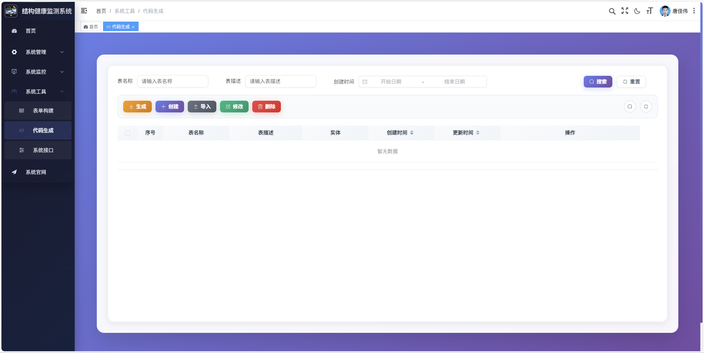

在 `E:\RuoYiProject\MoMagTracker-System\MoMagTracker-Vue3\src\views\tool\gen\index.vue` 文件中加入下述代码

```java
<template>
  <div class="gen-management">
    <div class="main-card">
      <div class="content-block">
        <!-- 搜索区域 -->
        <div class="search-section">
          <el-form :model="queryParams" ref="queryRef" v-show="showSearch" :inline="true" class="search-form">
            <el-form-item label="表名称" prop="tableName">
              <el-input
                v-model="queryParams.tableName"
                placeholder="请输入表名称"
                clearable
                class="tech-input"
                @keyup.enter="handleQuery"
              />
            </el-form-item>
            <el-form-item label="表描述" prop="tableComment">
              <el-input
                v-model="queryParams.tableComment"
                placeholder="请输入表描述"
                clearable
                class="tech-input"
                @keyup.enter="handleQuery"
              />
            </el-form-item>
            <el-form-item label="创建时间" class="date-range">
              <el-date-picker
                v-model="dateRange"
                value-format="YYYY-MM-DD"
                type="daterange"
                range-separator="-"
                start-placeholder="开始日期"
                end-placeholder="结束日期"
                class="tech-date-picker"
              ></el-date-picker>
            </el-form-item>
            <el-form-item class="search-actions">
              <el-button type="primary" icon="Search" @click="handleQuery" class="tech-btn primary">搜索</el-button>
              <el-button icon="Refresh" @click="resetQuery" class="tech-btn secondary">重置</el-button>
            </el-form-item>
          </el-form>
        </div>

        <!-- 操作按钮区域 -->
        <div class="action-section">
          <el-row :gutter="10">
            <el-col :span="1.5">
              <el-button
                type="primary"
                plain
                icon="Download"
                :disabled="multiple"
                @click="handleGenTable"
                v-hasPermi="['tool:gen:code']"
                class="tech-btn warning"
              >生成</el-button>
            </el-col>
            <el-col :span="1.5">
              <el-button
                type="primary"
                plain
                icon="Plus"
                @click="openCreateTable"
                v-hasRole="['admin']"
                class="tech-btn primary"
              >创建</el-button>
            </el-col>
            <el-col :span="1.5">
              <el-button
                type="info"
                plain
                icon="Upload"
                @click="openImportTable"
                v-hasPermi="['tool:gen:import']"
                class="tech-btn info"
              >导入</el-button>
            </el-col>
            <el-col :span="1.5">
              <el-button
                type="success"
                plain
                icon="Edit"
                :disabled="single"
                @click="handleEditTable"
                v-hasPermi="['tool:gen:edit']"
                class="tech-btn success"
              >修改</el-button>
            </el-col>
            <el-col :span="1.5">
              <el-button
                type="danger"
                plain
                icon="Delete"
                :disabled="multiple"
                @click="handleDelete"
                v-hasPermi="['tool:gen:remove']"
                class="tech-btn danger"
              >删除</el-button>
            </el-col>
            <right-toolbar v-model:showSearch="showSearch" @queryTable="getList" class="right-toolbar"></right-toolbar>
          </el-row>
        </div>

        <!-- 表格区域 -->
        <div class="table-section">
          <el-table ref="genRef" v-loading="loading" :data="tableList" @selection-change="handleSelectionChange" :default-sort="defaultSort" @sort-change="handleSortChange" class="tech-table">
            <el-table-column type="selection" align="center" width="55"></el-table-column>
            <el-table-column label="序号" type="index" width="70" align="center">
              <template #default="scope">
                <div class="index-badge">{{(queryParams.pageNum - 1) * queryParams.pageSize + scope.$index + 1}}</div>
              </template>
            </el-table-column>
            <el-table-column label="表名称" align="center" prop="tableName" :show-overflow-tooltip="true" width="180" />
            <el-table-column label="表描述" align="center" prop="tableComment" :show-overflow-tooltip="true" width="200" />
            <el-table-column label="实体" align="center" prop="className" :show-overflow-tooltip="true" width="180" />
            <el-table-column label="创建时间" align="center" prop="createTime" width="180" sortable="custom" :sort-orders="['descending', 'ascending']">
              <template #default="scope">
                <span class="time-text">{{ scope.row.createTime }}</span>
              </template>
            </el-table-column>
            <el-table-column label="更新时间" align="center" prop="updateTime" width="180" sortable="custom" :sort-orders="['descending', 'ascending']">
              <template #default="scope">
                <span class="time-text">{{ scope.row.updateTime }}</span>
              </template>
            </el-table-column>
            <el-table-column label="操作" align="center" width="380" class-name="small-padding fixed-width">
              <template #default="scope">
                <div class="action-buttons">
                  <el-tooltip content="预览" placement="top">
                    <el-button link type="primary" icon="View" @click="handlePreview(scope.row)" v-hasPermi="['tool:gen:preview']" class="action-btn preview"></el-button>
                  </el-tooltip>
                  <el-tooltip content="编辑" placement="top">
                    <el-button link type="primary" icon="Edit" @click="handleEditTable(scope.row)" v-hasPermi="['tool:gen:edit']" class="action-btn edit"></el-button>
                  </el-tooltip>
                  <el-tooltip content="删除" placement="top">
                    <el-button link type="primary" icon="Delete" @click="handleDelete(scope.row)" v-hasPermi="['tool:gen:remove']" class="action-btn delete"></el-button>
                  </el-tooltip>
                  <el-tooltip content="同步" placement="top">
                    <el-button link type="primary" icon="Refresh" @click="handleSynchDb(scope.row)" v-hasPermi="['tool:gen:edit']" class="action-btn sync"></el-button>
                  </el-tooltip>
                  <el-tooltip content="生成代码" placement="top">
                    <el-button link type="primary" icon="Download" @click="handleGenTable(scope.row)" v-hasPermi="['tool:gen:code']" class="action-btn download"></el-button>
                  </el-tooltip>
                </div>
              </template>
            </el-table-column>
          </el-table>

          <!-- 分页 -->
          <div class="pagination-section">
            <pagination
              v-show="total>0"
              :total="total"
              v-model:page="queryParams.pageNum"
              v-model:limit="queryParams.pageSize"
              @pagination="getList"
              class="tech-pagination"
            />
          </div>
        </div>
      </div>
    </div>

    <!-- 预览界面 -->
    <el-dialog :title="preview.title" v-model="preview.open" width="80%" top="5vh" append-to-body class="tech-dialog preview-dialog scrollbar">
      <el-tabs v-model="preview.activeName" class="preview-tabs">
        <el-tab-pane
          v-for="(value, key) in preview.data"
          :label="key.substring(key.lastIndexOf('/')+1,key.indexOf('.vm'))"
          :name="key.substring(key.lastIndexOf('/')+1,key.indexOf('.vm'))"
          :key="value"
        >
          <div class="code-header">
            <el-tag type="info" class="file-tag">{{ key.substring(key.lastIndexOf('/')+1,key.indexOf('.vm')) }}</el-tag>
            <el-link :underline="false" icon="DocumentCopy" v-copyText="value" v-copyText:callback="copyTextSuccess" class="copy-btn">
              &nbsp;复制代码
            </el-link>
          </div>
          <div class="code-container">
            <pre class="code-content">{{ value }}</pre>
          </div>
        </el-tab-pane>
      </el-tabs>
    </el-dialog>

    <import-table ref="importRef" @ok="handleQuery" />
    <create-table ref="createRef" @ok="handleQuery" />
  </div>
</template>

<script setup name="Gen">
import { listTable, previewTable, delTable, genCode, synchDb } from "@/api/tool/gen"
import router from "@/router"
import importTable from "./importTable"
import createTable from "./createTable"

const route = useRoute()
const { proxy } = getCurrentInstance()

const tableList = ref([])
const loading = ref(true)
const showSearch = ref(true)
const ids = ref([])
const single = ref(true)
const multiple = ref(true)
const total = ref(0)
const tableNames = ref([])
const dateRange = ref([])
const uniqueId = ref("")
const defaultSort = ref({ prop: "createTime", order: "descending" })

const data = reactive({
  queryParams: {
    pageNum: 1,
    pageSize: 10,
    tableName: undefined,
    tableComment: undefined,
    orderByColumn: defaultSort.value.prop,
    isAsc: defaultSort.value.order
  },
  preview: {
    open: false,
    title: "代码预览",
    data: {},
    activeName: "domain.java"
  }
})

const { queryParams, preview } = toRefs(data)

onActivated(() => {
  const time = route.query.t
  if (time != null && time != uniqueId.value) {
    uniqueId.value = time
    queryParams.value.pageNum = Number(route.query.pageNum)
    dateRange.value = []
    proxy.resetForm("queryForm")
    getList()
  }
})

/** 查询表集合 */
function getList() {
  loading.value = true
  listTable(proxy.addDateRange(queryParams.value, dateRange.value)).then(response => {
    tableList.value = response.rows
    total.value = response.total
    loading.value = false
  })
}

/** 搜索按钮操作 */
function handleQuery() {
  queryParams.value.pageNum = 1
  getList()
}

/** 生成代码操作 */
function handleGenTable(row) {
  const tbNames = row.tableName || tableNames.value
  if (tbNames == "") {
    proxy.$modal.msgError("请选择要生成的数据")
    return
  }
  if (row.genType === "1") {
    genCode(row.tableName).then(response => {
      proxy.$modal.msgSuccess("成功生成到自定义路径：" + row.genPath)
    })
  } else {
    proxy.$download.zip("/tool/gen/batchGenCode?tables=" + tbNames, "ruoyi.zip")
  }
}

/** 同步数据库操作 */
function handleSynchDb(row) {
  const tableName = row.tableName
  proxy.$modal.confirm('确认要强制同步"' + tableName + '"表结构吗？').then(function () {
    return synchDb(tableName)
  }).then(() => {
    proxy.$modal.msgSuccess("同步成功")
  }).catch(() => {})
}

/** 打开导入表弹窗 */
function openImportTable() {
  proxy.$refs["importRef"].show()
}

/** 打开创建表弹窗 */
function openCreateTable() {
  proxy.$refs["createRef"].show()
}

/** 重置按钮操作 */
function resetQuery() {
  dateRange.value = []
  proxy.resetForm("queryRef")
  queryParams.value.pageNum = 1
  proxy.$refs["genRef"].sort(defaultSort.value.prop, defaultSort.value.order)
}

/** 预览按钮 */
function handlePreview(row) {
  previewTable(row.tableId).then(response => {
    preview.value.data = response.data
    preview.value.open = true
    preview.value.activeName = "domain.java"
  })
}

/** 复制代码成功 */
function copyTextSuccess() {
  proxy.$modal.msgSuccess("复制成功")
}

// 多选框选中数据
function handleSelectionChange(selection) {
  ids.value = selection.map(item => item.tableId)
  tableNames.value = selection.map(item => item.tableName)
  single.value = selection.length != 1
  multiple.value = !selection.length
}

/** 排序触发事件 */
function handleSortChange(column, prop, order) {
  queryParams.value.orderByColumn = column.prop
  queryParams.value.isAsc = column.order
  getList()
}

/** 修改按钮操作 */
function handleEditTable(row) {
  const tableId = row.tableId || ids.value[0]
  const tableName = row.tableName || tableNames.value[0]
  const params = { pageNum: queryParams.value.pageNum }
  proxy.$tab.openPage("修改[" + tableName + "]生成配置", '/tool/gen-edit/index/' + tableId, params)
}

/** 删除按钮操作 */
function handleDelete(row) {
  const tableIds = row.tableId || ids.value
  proxy.$modal.confirm('是否确认删除表编号为"' + tableIds + '"的数据项？').then(function () {
    return delTable(tableIds)
  }).then(() => {
    getList()
    proxy.$modal.msgSuccess("删除成功")
  }).catch(() => {})
}

getList()
</script>

<style scoped lang="scss">
.gen-management {
  font-family: "Inter", "Helvetica Neue", Helvetica, "PingFang SC", "Hiragino Sans GB", "Microsoft YaHei", Arial, sans-serif;
  color: #2c3e50;
  background: linear-gradient(135deg, #667eea 0%, #764ba2 100%);
  min-height: 100vh;
  padding: 40px;
  display: flex;
  align-items: flex-start;
  justify-content: center;

  .main-card {
    background: rgba(255, 255, 255, 0.95);
    border-radius: 20px;
    box-shadow: 0 20px 60px rgba(0, 0, 0, 0.15);
    backdrop-filter: blur(20px);
    width: 100%;
    max-width: 1800px;
    padding: 30px;
    margin: 20px;
    min-height: auto;
    height: auto;

    .content-block {
      background: white;
      border-radius: 16px;
      padding: 25px;
      box-shadow: 0 4px 20px rgba(0, 0, 0, 0.08);
      border: 1px solid #f1f5f9;
      transition: all 0.3s ease;
      min-height: 700px;
      height: auto;

      &:hover {
        transform: translateY(-3px);
        box-shadow: 0 8px 30px rgba(0, 0, 0, 0.12);
      }

      // 搜索区域
      .search-section {
        margin-bottom: 20px;
        
        .search-form {
          display: flex;
          flex-wrap: wrap;
          gap: 15px;
          align-items: flex-end;

          .el-form-item {
            margin-bottom: 0;
          }

          .date-range {
            min-width: 240px;
          }

          .search-actions {
            margin-left: auto;
          }
        }
      }

      // 操作按钮区域
      .action-section {
        margin-bottom: 20px;
        padding: 15px;
        background: #f8fafc;
        border-radius: 12px;
        border: 1px solid #e2e8f0;

        .right-toolbar {
          margin-left: auto;
        }
      }

      // 表格区域
      .table-section {
        .pagination-section {
          margin-top: 20px;
          padding-top: 15px;
          border-top: 1px solid #e2e8f0;
        }
      }
    }
  }

  // 科技感组件样式
  .tech-input {
    :deep(.el-input__wrapper) {
      border-radius: 8px;
      border: 1px solid #e2e8f0;
      transition: all 0.3s ease;
      box-shadow: 0 1px 3px rgba(0, 0, 0, 0.05);
      
      &:hover {
        border-color: #667eea;
        box-shadow: 0 2px 8px rgba(102, 126, 234, 0.1);
      }
      
      &.is-focus {
        border-color: #667eea;
        box-shadow: 0 0 0 2px rgba(102, 126, 234, 0.1);
      }
    }
  }

  .tech-date-picker {
    :deep(.el-input__wrapper) {
      border-radius: 8px;
      border: 1px solid #e2e8f0;
      transition: all 0.3s ease;
      
      &:hover {
        border-color: #667eea;
      }
    }
  }

  .tech-btn {
    border-radius: 8px;
    font-weight: 600;
    transition: all 0.3s ease;
    border: none;
    
    &.primary {
      background: linear-gradient(135deg, #667eea 0%, #764ba2 100%);
      color: white;
      box-shadow: 0 4px 15px rgba(102, 126, 234, 0.3);

      &:hover {
        transform: translateY(-2px);
        box-shadow: 0 8px 25px rgba(102, 126, 234, 0.4);
      }
    }

    &.secondary {
      background: white;
      border: 1px solid #e2e8f0;
      color: #475569;
      box-shadow: 0 2px 6px rgba(0, 0, 0, 0.05);

      &:hover {
        transform: translateY(-2px);
        border-color: #667eea;
        color: #667eea;
        box-shadow: 0 4px 12px rgba(0, 0, 0, 0.1);
      }
    }

    &.success {
      background: linear-gradient(135deg, #10b981 0%, #059669 100%);
      color: white;
      box-shadow: 0 4px 15px rgba(16, 185, 129, 0.3);

      &:hover {
        transform: translateY(-2px);
        box-shadow: 0 8px 25px rgba(16, 185, 129, 0.4);
      }
    }

    &.danger {
      background: linear-gradient(135deg, #ef4444 0%, #dc2626 100%);
      color: white;
      box-shadow: 0 4px 15px rgba(239, 68, 68, 0.3);

      &:hover {
        transform: translateY(-2px);
        box-shadow: 0 8px 25px rgba(239, 68, 68, 0.4);
      }
    }

    &.warning {
      background: linear-gradient(135deg, #f59e0b 0%, #d97706 100%);
      color: white;
      box-shadow: 0 4px 15px rgba(245, 158, 11, 0.3);

      &:hover {
        transform: translateY(-2px);
        box-shadow: 0 8px 25px rgba(245, 158, 11, 0.4);
      }
    }

    &.info {
      background: linear-gradient(135deg, #6b7280 0%, #4b5563 100%);
      color: white;
      box-shadow: 0 4px 15px rgba(107, 114, 128, 0.3);

      &:hover {
        transform: translateY(-2px);
        box-shadow: 0 8px 25px rgba(107, 114, 128, 0.4);
      }
    }
  }

  .tech-table {
    :deep(.el-table__header) {
      th {
        background: linear-gradient(135deg, #f8fafc 0%, #f1f5f9 100%);
        color: #374151;
        font-weight: 600;
      }
    }

    :deep(.el-table__row) {
      transition: all 0.3s ease;
      
      &:hover {
        transform: translateY(-1px);
        box-shadow: 0 2px 8px rgba(0, 0, 0, 0.1);
      }
    }

    .index-badge {
      display: inline-flex;
      align-items: center;
      justify-content: center;
      width: 28px;
      height: 28px;
      background: linear-gradient(135deg, #667eea 0%, #764ba2 100%);
      color: white;
      border-radius: 50%;
      font-size: 0.8rem;
      font-weight: 600;
    }

    .time-text {
      color: #6b7280;
      font-size: 0.9rem;
    }
  }

  .action-buttons {
    display: flex;
    justify-content: center;
    gap: 8px;

    .action-btn {
      width: 32px;
      height: 32px;
      border-radius: 6px;
      display: flex;
      align-items: center;
      justify-content: center;
      transition: all 0.3s ease;

      &:hover {
        transform: scale(1.1);
        background: #f1f5f9;
      }
    }
  }

  .tech-pagination {
    :deep(.el-pagination) {
      .btn-prev, .btn-next, .number, .more {
        border-radius: 6px;
        margin: 0 2px;
      }
      
      .number.active {
        background: linear-gradient(135deg, #667eea 0%, #764ba2 100%);
        color: white;
        border: none;
      }
    }
  }

  // 预览对话框样式
  .preview-dialog {
    :deep(.el-dialog__body) {
      padding: 0;
    }

    .preview-tabs {
      :deep(.el-tabs__header) {
        margin: 0;
        padding: 0 20px;
        background: #f8fafc;
        border-bottom: 1px solid #e2e8f0;
      }

      :deep(.el-tabs__content) {
        padding: 0;
      }

      .code-header {
        display: flex;
        align-items: center;
        justify-content: space-between;
        padding: 16px 20px;
        background: #f8fafc;
        border-bottom: 1px solid #e2e8f0;

        .file-tag {
          border-radius: 6px;
          font-weight: 600;
          border: none;
        }

        .copy-btn {
          color: #667eea;
          font-weight: 500;
          transition: all 0.3s ease;

          &:hover {
            color: #764ba2;
            transform: translateY(-1px);
          }
        }
      }

      .code-container {
        background: #1e293b;
        border-radius: 0 0 8px 8px;
        overflow: hidden;

        .code-content {
          color: #e2e8f0;
          font-family: 'Monaco', 'Consolas', 'Courier New', monospace;
          font-size: 0.9rem;
          line-height: 1.5;
          margin: 0;
          padding: 20px;
          overflow-x: auto;
          white-space: pre-wrap;
          word-wrap: break-word;
        }
      }
    }
  }

  .tech-dialog {
    :deep(.el-dialog) {
      border-radius: 16px;
      box-shadow: 0 20px 60px rgba(0, 0, 0, 0.2);
      
      .el-dialog__header {
        border-bottom: 1px solid #e2e8f0;
        margin-right: 0;
        
        .el-dialog__title {
          font-weight: 700;
          color: #1e293b;
        }
      }
    }
  }
}

// 响应式设计
@media (max-width: 1024px) {
  .gen-management {
    .main-card {
      padding: 25px;
      margin: 15px;
    }
  }
}

@media (max-width: 768px) {
  .gen-management {
    padding: 15px;

    .main-card {
      padding: 20px;

      .content-block {
        padding: 20px;
        min-height: 400px;

        .search-section {
          .search-form {
            flex-direction: column;
            align-items: stretch;
            
            .search-actions {
              margin-left: 0;
              text-align: center;
            }
          }
        }

        .action-section {
          .el-col {
            margin-bottom: 10px;
          }
        }
      }
    }

    .preview-dialog {
      width: 95% !important;
      margin: 10px auto;
    }
  }
}

@media (max-width: 480px) {
  .gen-management {
    padding: 10px;

    .main-card {
      padding: 15px;
      margin: 10px;

      .content-block {
        padding: 15px;
        min-height: 350px;
      }
    }

    .action-buttons {
      gap: 4px;

      .action-btn {
        width: 28px;
        height: 28px;
      }
    }
  }
}
</style>
```

#### 2.3.6.3 系统接口（/swagger/index.vue）

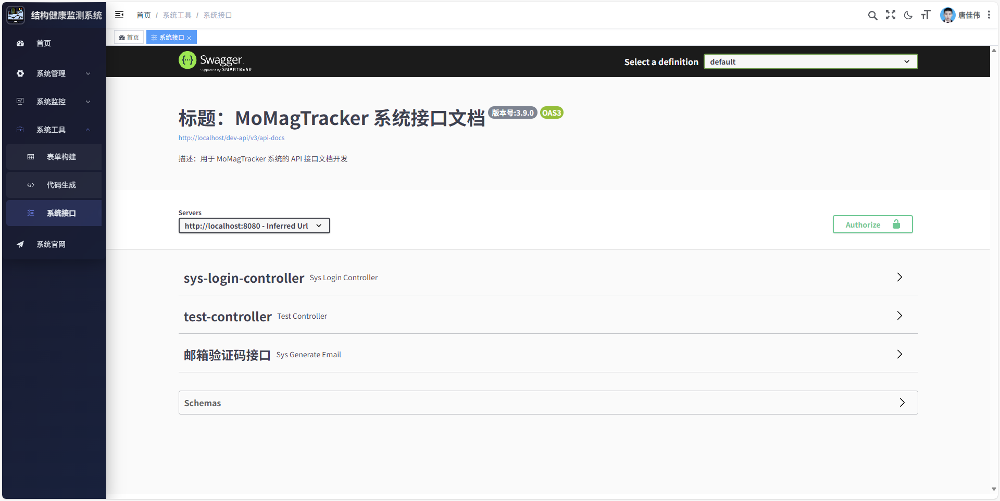

在 `E:\RuoYiProject\MoMagTracker-System\MoMagTracker-Vue\tracker-admin\src\main\java\tracker\web\core\config\SwaggerConfig.java` 文件中修改下述内容

```java
package tracker.web.core.config;

import java.util.ArrayList;
import java.util.List;
import org.springframework.beans.factory.annotation.Autowired;
import org.springframework.beans.factory.annotation.Value;
import org.springframework.context.annotation.Bean;
import org.springframework.context.annotation.Configuration;
import tracker.common.config.RuoYiConfig;
import io.swagger.annotations.ApiOperation;
import io.swagger.models.auth.In;
import springfox.documentation.builders.ApiInfoBuilder;
import springfox.documentation.builders.PathSelectors;
import springfox.documentation.builders.RequestHandlerSelectors;
import springfox.documentation.service.ApiInfo;
import springfox.documentation.service.ApiKey;
import springfox.documentation.service.AuthorizationScope;
import springfox.documentation.service.Contact;
import springfox.documentation.service.SecurityReference;
import springfox.documentation.service.SecurityScheme;
import springfox.documentation.spi.DocumentationType;
import springfox.documentation.spi.service.contexts.SecurityContext;
import springfox.documentation.spring.web.plugins.Docket;

/**
 * Swagger2的接口配置
 * 
 * @author tangjiawei
 */
@Configuration
public class SwaggerConfig
{
    /** 系统基础配置 */
    @Autowired
    private RuoYiConfig ruoyiConfig;

    /** 是否开启swagger */
    @Value("${swagger.enabled}")
    private boolean enabled;

    /** 设置请求的统一前缀 */
    @Value("${swagger.pathMapping}")
    private String pathMapping;

    /**
     * 创建API
     */
    @Bean
    public Docket createRestApi()
    {
        return new Docket(DocumentationType.OAS_30)
                // 是否启用Swagger
                .enable(enabled)
                // 用来创建该API的基本信息，展示在文档的页面中（自定义展示的信息）
                .apiInfo(apiInfo())
                // 设置哪些接口暴露给Swagger展示
                .select()
                // 扫描所有有注解的api，用这种方式更灵活
                .apis(RequestHandlerSelectors.withMethodAnnotation(ApiOperation.class))
                // 扫描指定包中的swagger注解
                // .apis(RequestHandlerSelectors.basePackage("tracker.project.tool.swagger"))
                // 扫描所有 .apis(RequestHandlerSelectors.any())
                .paths(PathSelectors.any())
                .build()
                /* 设置安全模式，swagger可以设置访问token */
                .securitySchemes(securitySchemes())
                .securityContexts(securityContexts())
                .pathMapping(pathMapping);
    }

    /**
     * 安全模式，这里指定token通过Authorization头请求头传递
     */
    private List<SecurityScheme> securitySchemes()
    {
        List<SecurityScheme> apiKeyList = new ArrayList<SecurityScheme>();
        apiKeyList.add(new ApiKey("Authorization", "Authorization", In.HEADER.toValue()));
        return apiKeyList;
    }

    /**
     * 安全上下文
     */
    private List<SecurityContext> securityContexts()
    {
        List<SecurityContext> securityContexts = new ArrayList<>();
        securityContexts.add(
                SecurityContext.builder()
                        .securityReferences(defaultAuth())
                        .operationSelector(o -> o.requestMappingPattern().matches("/.*"))
                        .build());
        return securityContexts;
    }

    /**
     * 默认的安全上引用
     */
    private List<SecurityReference> defaultAuth()
    {
        AuthorizationScope authorizationScope = new AuthorizationScope("global", "accessEverything");
        AuthorizationScope[] authorizationScopes = new AuthorizationScope[1];
        authorizationScopes[0] = authorizationScope;
        List<SecurityReference> securityReferences = new ArrayList<>();
        securityReferences.add(new SecurityReference("Authorization", authorizationScopes));
        return securityReferences;
    }

    /**
     * 添加摘要信息
     */
    private ApiInfo apiInfo()
    {
        // 用ApiInfoBuilder进行定制
        return new ApiInfoBuilder()
                // 设置标题
                .title("标题：MoMagTracker 系统接口文档")
                // 描述
                .description("描述：用于 MoMagTracker 系统的 API 接口文档开发")
                // 作者信息
                .contact(new Contact(ruoyiConfig.getName(), null, null))
                // 版本
                .version("版本号:" + ruoyiConfig.getVersion())
                .build();
    }
}
```

###### 1 修改 SysLoginController 英文显示问题

文件 `E:\RuoYiProject\MoMagTracker-System\MoMagTracker-Vue\tracker-admin\src\main\java\tracker\web\controller\system\SysLoginController.java`

```shell
@Api(tags = "系统登录接口")  // 添加中文标签
@RestController
public class SysLoginController
```

###### 2 修改 TestController 英文显示问题

文件 `E:\RuoYiProject\MoMagTracker-System\MoMagTracker-Vue\tracker-admin\src\main\java\tracker\web\controller\tool\TestController.java`

```shell
@Api(tags = "用户信息管理接口")  // 添加中文标签
@RestController
@RequestMapping("/test/user")
```

- 结果

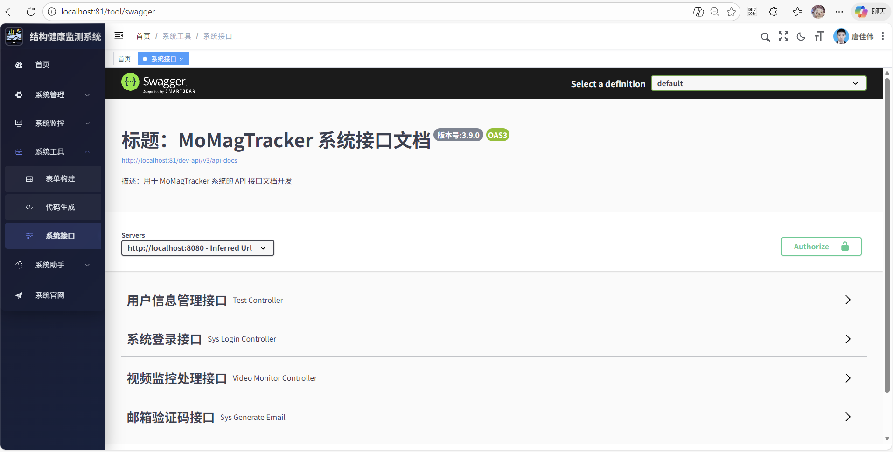

### 2.3.7 推送至远程仓库

```shell
ls -a

git status

git add .

git status

git commit -m "第三次提交，修改 README.md 文件，开发系统整体的首页样式和侧边栏样式，以及新增个人中心、系统管理、系统监控和系统工具功能页面"

git push -u origin master
```

- 结果

```shell
17354@LAPTOP-3CJQNHQH MINGW64 /e/RuoYiProject/MoMagTracker-System (master)
$ ls -a
./   .git/              MoMagTracker-Vue3/  README.md
../  MoMagTracker-Vue/  README.assets/

17354@LAPTOP-3CJQNHQH MINGW64 /e/RuoYiProject/MoMagTracker-System (master)
$ git status
On branch master
Your branch is up to date with 'origin/master'.

Changes to be committed:
  (use "git restore --staged <file>..." to unstage)
        modified:   MoMagTracker-Vue/tracker-common/src/main/java/tracker/common/config/RuoYiConfig.java

Changes not staged for commit:
  (use "git add <file>..." to update what will be committed)
  (use "git restore <file>..." to discard changes in working directory)
        modified:   MoMagTracker-Vue/tracker-admin/src/main/java/tracker/web/core/config/SwaggerConfig.java
        modified:   MoMagTracker-Vue/tracker-admin/src/main/resources/application-druid.yml
        modified:   MoMagTracker-Vue/tracker-common/src/main/java/tracker/common/config/RuoYiConfig.java
        modified:   MoMagTracker-Vue/tracker-framework/src/main/java/tracker/framework/config/SecurityConfig.java
        modified:   MoMagTracker-Vue/tracker-framework/src/main/java/tracker/framework/web/service/SysLoginService.java
        modified:   MoMagTracker-Vue/tracker-framework/src/main/java/tracker/framework/web/service/UserDetailsServiceImpl.java
        modified:   MoMagTracker-Vue3/src/api/login.js
        modified:   MoMagTracker-Vue3/src/assets/styles/ruoyi.scss
        modified:   MoMagTracker-Vue3/src/assets/styles/sidebar.scss
        modified:   MoMagTracker-Vue3/src/assets/styles/variables.module.scss
        modified:   MoMagTracker-Vue3/src/layout/components/Sidebar/Logo.vue
        modified:   MoMagTracker-Vue3/src/store/modules/user.js
        modified:   MoMagTracker-Vue3/src/views/index.vue
        modified:   MoMagTracker-Vue3/src/views/login.vue
        modified:   MoMagTracker-Vue3/src/views/monitor/cache/index.vue
        modified:   MoMagTracker-Vue3/src/views/monitor/cache/list.vue
        modified:   MoMagTracker-Vue3/src/views/monitor/job/index.vue
        modified:   MoMagTracker-Vue3/src/views/monitor/logininfor/index.vue
        modified:   MoMagTracker-Vue3/src/views/monitor/online/index.vue
        modified:   MoMagTracker-Vue3/src/views/monitor/operlog/index.vue
        modified:   MoMagTracker-Vue3/src/views/monitor/server/index.vue
        modified:   MoMagTracker-Vue3/src/views/system/config/index.vue
        modified:   MoMagTracker-Vue3/src/views/system/dept/index.vue
        modified:   MoMagTracker-Vue3/src/views/system/dict/index.vue
        modified:   MoMagTracker-Vue3/src/views/system/menu/index.vue
        modified:   MoMagTracker-Vue3/src/views/system/notice/index.vue
        modified:   MoMagTracker-Vue3/src/views/system/post/index.vue
        modified:   MoMagTracker-Vue3/src/views/system/role/index.vue
        modified:   MoMagTracker-Vue3/src/views/system/user/index.vue
        modified:   MoMagTracker-Vue3/src/views/system/user/profile/index.vue
        modified:   MoMagTracker-Vue3/src/views/tool/build/RightPanel.vue
        modified:   MoMagTracker-Vue3/src/views/tool/build/index.vue
        modified:   MoMagTracker-Vue3/src/views/tool/gen/index.vue

Untracked files:
  (use "git add <file>..." to include in what will be committed)
        MoMagTracker-Vue3/src/assets/images/alipay.jpg
        MoMagTracker-Vue3/src/assets/images/wechat.jpg

17354@LAPTOP-3CJQNHQH MINGW64 /e/RuoYiProject/MoMagTracker-System (master)
$ git add .

17354@LAPTOP-3CJQNHQH MINGW64 /e/RuoYiProject/MoMagTracker-System (master)
$ git status
On branch master
Your branch is up to date with 'origin/master'.

Changes to be committed:
  (use "git restore --staged <file>..." to unstage)
        modified:   MoMagTracker-Vue/tracker-admin/src/main/java/tracker/web/core/config/SwaggerConfig.java
        modified:   MoMagTracker-Vue/tracker-admin/src/main/resources/application-druid.yml
        modified:   MoMagTracker-Vue/tracker-common/src/main/java/tracker/common/config/RuoYiConfig.java
        modified:   MoMagTracker-Vue/tracker-framework/src/main/java/tracker/framework/config/SecurityConfig.java
        modified:   MoMagTracker-Vue/tracker-framework/src/main/java/tracker/framework/web/service/SysLoginService.java
        modified:   MoMagTracker-Vue/tracker-framework/src/main/java/tracker/framework/web/service/UserDetailsServiceImpl.java
        modified:   MoMagTracker-Vue3/src/api/login.js
        new file:   MoMagTracker-Vue3/src/assets/images/alipay.jpg
        new file:   MoMagTracker-Vue3/src/assets/images/wechat.jpg
        modified:   MoMagTracker-Vue3/src/assets/styles/ruoyi.scss
        modified:   MoMagTracker-Vue3/src/assets/styles/sidebar.scss
        modified:   MoMagTracker-Vue3/src/assets/styles/variables.module.scss
        modified:   MoMagTracker-Vue3/src/layout/components/Sidebar/Logo.vue
        modified:   MoMagTracker-Vue3/src/store/modules/user.js
        modified:   MoMagTracker-Vue3/src/views/index.vue
        modified:   MoMagTracker-Vue3/src/views/login.vue
        modified:   MoMagTracker-Vue3/src/views/monitor/cache/index.vue
        modified:   MoMagTracker-Vue3/src/views/monitor/cache/list.vue
        modified:   MoMagTracker-Vue3/src/views/monitor/job/index.vue
        modified:   MoMagTracker-Vue3/src/views/monitor/logininfor/index.vue
        modified:   MoMagTracker-Vue3/src/views/monitor/online/index.vue
        modified:   MoMagTracker-Vue3/src/views/monitor/operlog/index.vue
        modified:   MoMagTracker-Vue3/src/views/monitor/server/index.vue
        modified:   MoMagTracker-Vue3/src/views/system/config/index.vue
        modified:   MoMagTracker-Vue3/src/views/system/dept/index.vue
        modified:   MoMagTracker-Vue3/src/views/system/dict/index.vue
        modified:   MoMagTracker-Vue3/src/views/system/menu/index.vue
        modified:   MoMagTracker-Vue3/src/views/system/notice/index.vue
        modified:   MoMagTracker-Vue3/src/views/system/post/index.vue
        modified:   MoMagTracker-Vue3/src/views/system/role/index.vue
        modified:   MoMagTracker-Vue3/src/views/system/user/index.vue
        modified:   MoMagTracker-Vue3/src/views/system/user/profile/index.vue
        modified:   MoMagTracker-Vue3/src/views/tool/build/RightPanel.vue
        modified:   MoMagTracker-Vue3/src/views/tool/build/index.vue
        modified:   MoMagTracker-Vue3/src/views/tool/gen/index.vue
        new file:   README.assets/image-20251113141626420.png
        new file:   README.assets/image-20251113141652552.png
        new file:   README.assets/image-20251113141816232.png
        new file:   README.assets/image-20251113142319083.png
        new file:   README.assets/image-20251113142426954.png
        new file:   README.assets/image-20251113142503265.png
        new file:   README.assets/image-20251113142521186.png
        new file:   README.assets/image-20251113142539727.png
        new file:   README.assets/image-20251113142614639.png
        new file:   README.assets/image-20251113142636748.png
        new file:   README.assets/image-20251113142658188.png
        new file:   README.assets/image-20251113142717831.png
        new file:   README.assets/image-20251113142752213.png
        new file:   README.assets/image-20251113142831146.png
        new file:   README.assets/image-20251113142850605.png
        new file:   README.assets/image-20251113142913637.png
        new file:   README.assets/image-20251113142933588.png
        new file:   README.assets/image-20251113143344758.png
        new file:   README.assets/image-20251113143412598.png
        new file:   README.assets/image-20251113143626889.png
        new file:   README.assets/image-20251113143649942.png
        new file:   README.assets/image-20251113143725305.png
        new file:   README.assets/image-20251113143747513.png
        new file:   README.assets/image-20251113143810478.png
        modified:   README.md

17354@LAPTOP-3CJQNHQH MINGW64 /e/RuoYiProject/MoMagTracker-System (master)
$ git commit -m "第三次提交，修改 README.md 文件，开发系统整体的首页样式和侧边栏样式，以及新增个人中心、系统管理、系统监控和系统工具功能页面"
[master a826a4f] 第三次提交，修改 README.md 文件，开发系统整体的首页样式和侧边栏样式，以及新增个人中心、系统管理、系统监控和系统工具功能页面
 60 files changed, 30831 insertions(+), 3679 deletions(-)
 create mode 100644 MoMagTracker-Vue3/src/assets/images/alipay.jpg
 create mode 100644 MoMagTracker-Vue3/src/assets/images/wechat.jpg
 create mode 100644 README.assets/image-20251113141626420.png
 create mode 100644 README.assets/image-20251113141652552.png
 create mode 100644 README.assets/image-20251113141816232.png
 create mode 100644 README.assets/image-20251113142319083.png
 create mode 100644 README.assets/image-20251113142426954.png
 create mode 100644 README.assets/image-20251113142503265.png
 create mode 100644 README.assets/image-20251113142521186.png
 create mode 100644 README.assets/image-20251113142539727.png
 create mode 100644 README.assets/image-20251113142614639.png
 create mode 100644 README.assets/image-20251113142636748.png
 create mode 100644 README.assets/image-20251113142658188.png
 create mode 100644 README.assets/image-20251113142717831.png
 create mode 100644 README.assets/image-20251113142752213.png
 create mode 100644 README.assets/image-20251113142831146.png
 create mode 100644 README.assets/image-20251113142850605.png
 create mode 100644 README.assets/image-20251113142913637.png
 create mode 100644 README.assets/image-20251113142933588.png
 create mode 100644 README.assets/image-20251113143344758.png
 create mode 100644 README.assets/image-20251113143412598.png
 create mode 100644 README.assets/image-20251113143626889.png
 create mode 100644 README.assets/image-20251113143649942.png
 create mode 100644 README.assets/image-20251113143725305.png
 create mode 100644 README.assets/image-20251113143747513.png
 create mode 100644 README.assets/image-20251113143810478.png

17354@LAPTOP-3CJQNHQH MINGW64 /e/RuoYiProject/MoMagTracker-System (master)
$ git push -u origin master
Enumerating objects: 211, done.
Counting objects: 100% (211/211), done.
Delta compression using up to 8 threads
Compressing objects: 100% (100/100), done.
Writing objects: 100% (121/121), 7.97 MiB | 2.18 MiB/s, done.
Total 121 (delta 45), reused 0 (delta 0), pack-reused 0 (from 0)
remote: Resolving deltas: 100% (45/45), completed with 33 local objects.
To 17354395073_github_account:Tang17354395073/MoMagTracker-System.git
   c729ef1..a826a4f  master -> master
branch 'master' set up to track 'origin/master'.
```

## 3 子系统功能开发（Dify）

`Dify` 登录地址：`http://localhost:18080/apps`

前后端登录地址：`http://localhost:81/index`

### 3.1 DockerDesktop 基础环境配置

##### 3.1.1  Hyper-V 虚拟化环境

- 打开 `控制面板 - 程序 - 程序与功能 - 启用或关闭 Windows 功能` 

```python
# 快捷键
再次按下 Win + R 键，输入 OptionalFeatures 并回车。
```

- 启动 Hyper-V

##### Q：如果没有发现 Hyper-V，解决办法如下：

- 在 `Win11` 搜索框，`PowerShell` 中输入 `systeminfo` 命令

```python
C:\Users\17354>systeminfo

主机名:             LAPTOP-3CJQNHQH
OS 名称:            Microsoft Windows 11 家庭中文版
OS 版本:            10.0.26100 暂缺 Build 26100
OS 制造商:          Microsoft Corporation
OS 配置:            独立工作站
OS 构建类型:        Multiprocessor Free
注册的所有人:       17354395073@163.com
注册的组织:
产品 ID:            00326-60000-00000-AA285
初始安装日期:       2024/12/7, 14:10:48
系统启动时间:       2025/7/3, 8:11:27
系统制造商:         LENOVO
系统型号:           81Q5
系统类型:           x64-based PC
处理器:             安装了 1 个处理器。
                    [01]: Intel64 Family 6 Model 158 Stepping 10 GenuineIntel ~2400 Mhz
BIOS 版本:          LENOVO BHCN26WW, 2019/5/5
Windows 目录:       C:\WINDOWS
系统目录:           C:\WINDOWS\system32
启动设备:           \Device\HarddiskVolume1
系统区域设置:       zh-cn;中文(中国)
输入法区域设置:     zh-cn;中文(中国)
时区:               (UTC+08:00) 北京，重庆，香港特别行政区，乌鲁木齐
物理内存总量:       16,304 MB
可用的物理内存:     5,286 MB
虚拟内存: 最大值:   30,128 MB
虚拟内存: 可用:     15,950 MB
虚拟内存: 使用中:   14,178 MB
页面文件位置:       C:\pagefile.sys
域:                 WORKGROUP
登录服务器:         \\LAPTOP-3CJQNHQH
修补程序:           安装了 3 个修补程序。
                    [01]: KB5054979
                    [02]: KB5060842
                    [03]: KB5059502
网卡:               安装了 5 个 NIC。
                    [01]: Sangfor aTrust VNIC
                        连接名:      本地连接
                        启用 DHCP:   否
                        IP 地址
                          [01]: 2.0.0.1
                          [02]: fe80::e8a9:97d4:5acb:ef8
                    [02]: Intel(R) Wireless-AC 9560 160MHz
                        连接名:      WLAN
                        启用 DHCP:   是
                        DHCP 服务器: 172.20.10.1
                        IP 地址
                          [01]: 172.20.10.4
                          [02]: fe80::6335:ddbb:4ed0:41b7
                          [03]: 240e:446:50:878f:107b:4af2:4314:5ccf
                          [04]: 240e:446:50:878f:d62:41f8:2cfd:5c64
                    [03]: Realtek PCIe GbE Family Controller
                        连接名:      以太网
                        状态:        媒体连接已中断
                    [04]: Bluetooth Device (Personal Area Network)
                        连接名:      蓝牙网络连接
                        状态:        媒体连接已中断
                    [05]: Microsoft Wi-Fi Direct Virtual Adapter
                        连接名:      本地连接* 2
                        启用 DHCP:   否
                        IP 地址
                          [01]: 192.168.137.1
                          [02]: fe80::3dd6:e77c:773a:81bb
基于虚拟化的安全性: 状态： 未启用
                    App Control for Business policy: 强制
                    App Control for Business user mode policy: 关
                    已启用安全功能:
Hyper-V 要求:       虚拟机监视器模式扩展: 是
                    固件中已启用虚拟化: 是
                    二级地址转换: 是
                    数据执行保护可用: 是
```

能够看到出现了很多处理器的信息，最末尾有个 `Hyper-V` 要求，如果四个全为 “是”，则表示支持 `Hyper-V` 功能。

- 桌面新建一个记事本文件，复制下面的代码粘贴到记事本文件，保存后将它的后缀改成 `cmd` 或 `bat`，右键选择以管理员身份运行。代码执行结束后，重启电脑就可以了。

```python
pushd "%~dp0"

dir /b %SystemRoot%\servicing\Packages\*Hyper-V*.mum >hyper-v.txt

for /f %%i in ('findstr /i . hyper-v.txt 2^>nul') do dism /online /norestart /add-package:"%SystemRoot%\servicing\Packages\%%i"

del hyper-v.txt

Dism /online /enable-feature /featurename:Microsoft-Hyper-V-All /LimitAccess /ALL
```

- 运行结果如下（运行预计 `10-20` 分钟）

```python
C:\Windows\System32>pushd "C:\Users\17354\Desktop\"

C:\Users\17354\Desktop>dir /b C:\WINDOWS\servicing\Packages\*Hyper-V*.mum  1>hyper-v.txt

C:\Users\17354\Desktop>for /F %i in ('findstr /i . hyper-v.txt 2>nul') do dism /online /norestart /add-package:"C:\WINDOWS\servicing\Packages\%i"

C:\Users\17354\Desktop>dism /online /norestart /add-package:"C:\WINDOWS\servicing\Packages\Microsoft-Hyper-V-ClientEdition-Package~31bf3856ad364e35~amd64~en-US~10.0.26100.1591.mum"

部署映像服务和管理工具
版本: 10.0.26100.1150

映像版本: 10.0.26100.4349

正在处理 1 (共 1) - 正在添加程序包 Microsoft-Hyper-V-ClientEdition-Package~31bf3856ad364e35~amd64~en-US~10.0.26100.1591
[==========================100.0%==========================]
操作成功完成。

C:\Users\17354\Desktop>dism /online /norestart /add-package:"C:\WINDOWS\servicing\Packages\Microsoft-Hyper-V-ClientEdition-Package~31bf3856ad364e35~amd64~en-US~10.0.26100.4343.mum"

部署映像服务和管理工具
版本: 10.0.26100.1150

映像版本: 10.0.26100.4349

正在处理 1 (共 1) - 正在添加程序包 Microsoft-Hyper-V-ClientEdition-Package~31bf3856ad364e35~amd64~en-US~10.0.26100.4343
[==========================100.0%==========================]
操作成功完成。

C:\Users\17354\Desktop>dism /online /norestart /add-package:"C:\WINDOWS\servicing\Packages\Microsoft-Hyper-V-ClientEdition-Package~31bf3856ad364e35~amd64~zh-CN~10.0.26100.1591.mum"

部署映像服务和管理工具
版本: 10.0.26100.1150

映像版本: 10.0.26100.4349

正在处理 1 (共 1) - 正在添加程序包 Microsoft-Hyper-V-ClientEdition-Package~31bf3856ad364e35~amd64~zh-CN~10.0.26100.1591
[==========================100.0%==========================]
操作成功完成。

C:\Users\17354\Desktop>dism /online /norestart /add-package:"C:\WINDOWS\servicing\Packages\Microsoft-Hyper-V-ClientEdition-Package~31bf3856ad364e35~amd64~zh-CN~10.0.26100.4343.mum"

部署映像服务和管理工具
版本: 10.0.26100.1150

映像版本: 10.0.26100.4349

正在处理 1 (共 1) - 正在添加程序包 Microsoft-Hyper-V-ClientEdition-Package~31bf3856ad364e35~amd64~zh-CN~10.0.26100.4343
[==========================100.0%==========================]
操作成功完成。

C:\Users\17354\Desktop>dism /online /norestart /add-package:"C:\WINDOWS\servicing\Packages\Microsoft-Hyper-V-ClientEdition-Package~31bf3856ad364e35~amd64~~10.0.26100.1742.mum"

部署映像服务和管理工具
版本: 10.0.26100.1150

映像版本: 10.0.26100.4349

正在处理 1 (共 1) - 正在添加程序包 Microsoft-Hyper-V-ClientEdition-Package~31bf3856ad364e35~amd64~~10.0.26100.1742
[==========================100.0%==========================]

正在处理 1 (共 1) - 正在添加程序包 Microsoft-Hyper-V-Services-Package~31bf3856ad364e35~amd64~~10.0.26100.1742
[==========================100.0%==========================]
操作成功完成。

..........................................................................................................

C:\Users\17354\Desktop>dism /online /norestart /add-package:"C:\WINDOWS\servicing\Packages\Microsoft-Hyper-V-Services-Package~31bf3856ad364e35~amd64~~10.0.26100.4343.mum"

部署映像服务和管理工具
版本: 10.0.26100.1150

映像版本: 10.0.26100.4349

正在处理 1 (共 1) - 正在添加程序包 Microsoft-Hyper-V-Services-Package~31bf3856ad364e35~amd64~~10.0.26100.4343
[==========================100.0%==========================]
操作成功完成。

C:\Users\17354\Desktop>del hyper-v.txt

C:\Users\17354\Desktop>Dism /online /enable-feature /featurename:Microsoft-Hyper-V-All /LimitAccess /ALL

部署映像服务和管理工具
版本: 10.0.26100.1150

映像版本: 10.0.26100.4349

启用一个或多个功能
[==========================100.0%==========================]
操作成功完成。
重新启动 Windows 以完成该操作。
是否立即重新启动计算机? (Y/N)
```

- 重启后开启 `Hyper-V` 服务结果如下

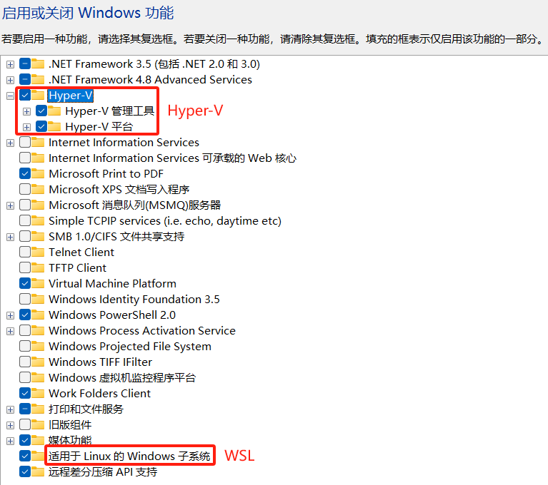

##### 3.1.2 配置 WSL（Windows Subsystem for Linux, 适用于 Linux 的 Windows 子系统） 优化使用性能

###### 1 安装 WSL

- 列出可用的分发

```python
C:\Windows\System32>wsl.exe --list --online
以下是可安装的有效分发的列表。
使用“wsl.exe --install <Distro>”安装。

NAME                            FRIENDLY NAME
AlmaLinux-8                     AlmaLinux OS 8
AlmaLinux-9                     AlmaLinux OS 9
AlmaLinux-Kitten-10             AlmaLinux OS Kitten 10
AlmaLinux-10                    AlmaLinux OS 10
Debian                          Debian GNU/Linux
FedoraLinux-42                  Fedora Linux 42
SUSE-Linux-Enterprise-15-SP6    SUSE Linux Enterprise 15 SP6
SUSE-Linux-Enterprise-15-SP7    SUSE Linux Enterprise 15 SP7
Ubuntu                          Ubuntu
Ubuntu-24.04                    Ubuntu 24.04 LTS
archlinux                       Arch Linux
kali-linux                      Kali Linux Rolling
openSUSE-Tumbleweed             openSUSE Tumbleweed
openSUSE-Leap-15.6              openSUSE Leap 15.6
Ubuntu-18.04                    Ubuntu 18.04 LTS
Ubuntu-20.04                    Ubuntu 20.04 LTS
Ubuntu-22.04                    Ubuntu 22.04 LTS
OracleLinux_7_9                 Oracle Linux 7.9
OracleLinux_8_7                 Oracle Linux 8.7
OracleLinux_9_1                 Oracle Linux 9.1
```

- 安装命令

```python
PowerShell 中输入 wsl --install --web-download 命令
```

```python
C:\Windows\System32>wsl --install --web-download
正在安装 Windows 可选组件: VirtualMachinePlatform

部署映像服务和管理工具
版本: 10.0.26100.1150

映像版本: 10.0.26100.4349

启用一个或多个功能
[==========================100.0%==========================]
操作成功完成。
请求的操作成功。直到重新启动系统前更改将不会生效。
```

- 检查版本状态，下载最新版本的 Linux 内核更新包

```python
C:\Windows\System32>wsl.exe --update
正在检查更新。
已安装最新版本的适用于 Linux 的 Windows 子系统。
```

###### Q：如果出现安装失败？

```python
# 失败情况
C:\Windows\System32>wsl --install --web-download
正在下载: 适用于 Linux 的 Windows 子系统 2.5.9
与服务器的连接被重置       25.1%                           ]
```

```python
点击链接 https://github.com/microsoft/WSL/releases
```

- 下载最新版 WSL 离线脚本安装

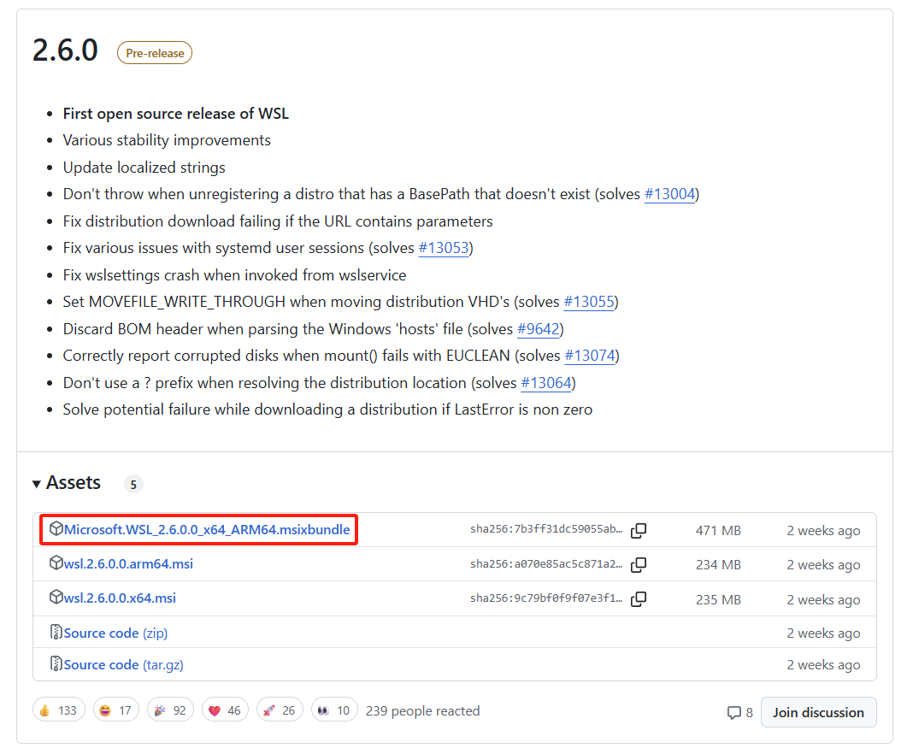

- 安装界面

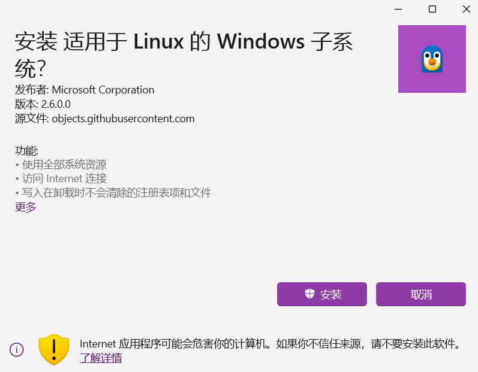

安装后继续执行 `wsl --install --web-download` 操作，并通过 `wsl.exe --update` 检查是否下载完毕

###### 2 启动 WSL

````python
dism.exe /online /enable-feature /featurename:VirtualMachinePlatform /all /norestart
````

```python
C:\Windows\System32>dism.exe /online /enable-feature /featurename:VirtualMachinePlatform /all /norestart

部署映像服务和管理工具
版本: 10.0.26100.1150

映像版本: 10.0.26100.4349

启用一个或多个功能
[==========================100.0%==========================]
操作成功完成。
```

###### 3 设置 WSL2 为默认版本

重新以管理员身份打开 Powershell 并运行以下命令

```python
wsl --set-default-version 2
```

```python
C:\Windows\System32>wsl --set-default-version 2
有关与 WSL 2 关键区别的信息，请访问 https://aka.ms/wsl2

操作成功完成。
```

### 3.2 DockerDesktop 的下载与安装

#### 1 下载

```python
网址 https://docs.docker.com/get-started/get-docker/ 中点击 Docker Desktop for Windows
```

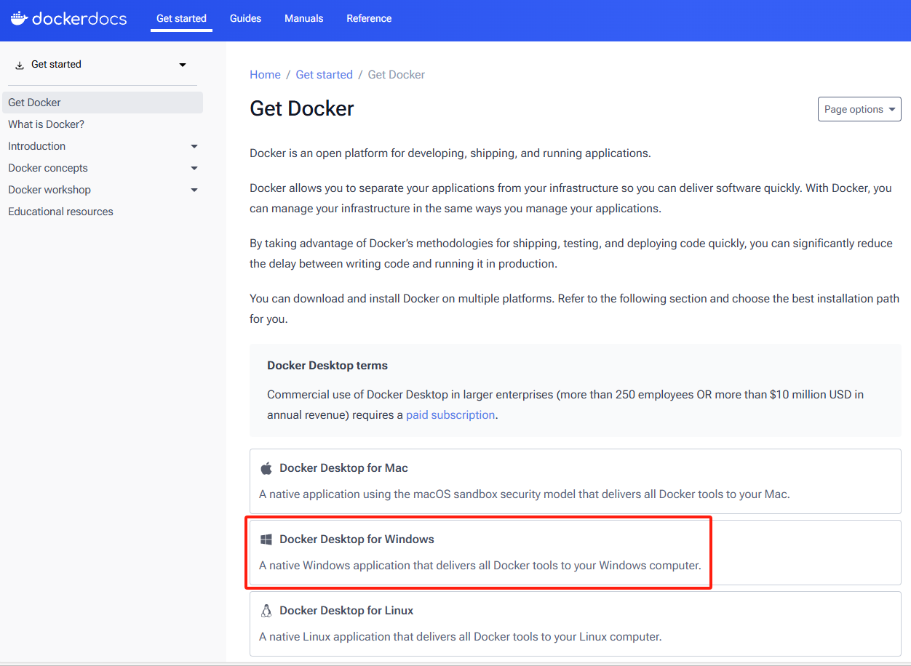

```python
点击 Docker Desktop for Windows -x86 64
```

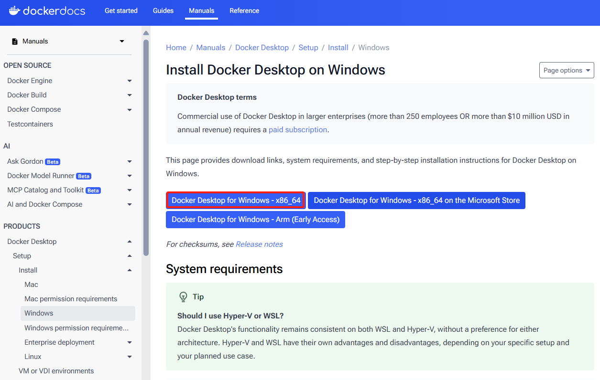

下载后执行以下步骤：

- 下载完成后，双击 `DockerDesktopInsta1ler.exe` 运行安装程序。默认情况下，``Docker Desktop` 安装在 `C:\Program Files\Docker\Docker`
- 按照安装向导的提示进行安装即可
- 安装完成后，系统会提示 `Close and log out` 重启计算机 

- 验证安装成功需要打开 `cmd` 输入 `docker --version` 查看 `Docker` 版本

```python
C:\Users\17354>docker --version
Docker version 28.2.2, build e6534b4
```

#### 2 配置 Docker 镜像源及存储位置

- 在 `Docker Desktop` 中设置 `Docker` 下载的镜像源，加快下载速度

```python
"registry-mirrors":[
    "https://docker.m.daocloud.io",
    "https://docker.rainbond.cc",
    "https://docker.1mirror.top"
]
```

- 打开 `Docker` 的设置，找到 `Docker Engine`，在末尾添加上述代码

```python
{
  "builder": {
    "gc": {
      "defaultKeepStorage": "20GB",
      "enabled": true
    }
  },
  "experimental": false,
  "registry-mirrors": [
    "https://docker.m.daocloud.io",
    "https://docker.rainbond.cc",
    "https://docker.1mirror.top"
  ]
}
```

#### 3 设置 Docker 下载 image 后存放的位置

默认为 `C:\Users\17354\VAppData\Local\Doder\ws1` 路径，可以改为磁盘空间充足的路径。

- 打开 `Docker` 的设置，找到 `Resources`

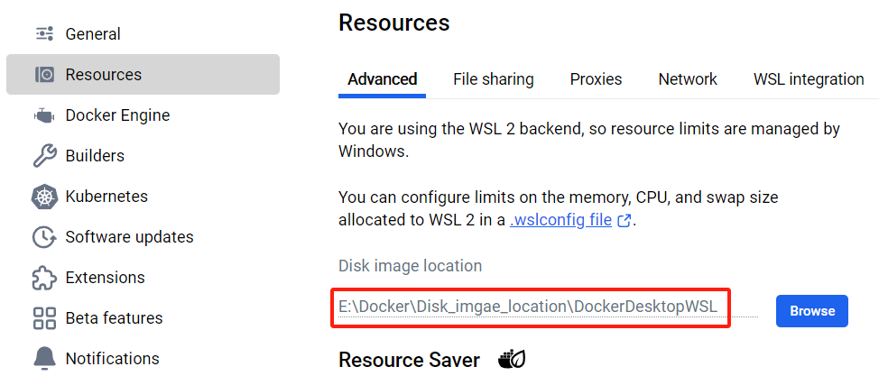

### 3.3 Dify

`Dify` 是一款创新的智能生活助手应用，旨在为您提供便捷、高效的服务。通过人工智能技术，`Dify` 可以实现语音助手、智能家居控制、日程管理等功能，助您轻松应对生活琐事，享受智慧生活。简约的界面设计，让操作更加便捷；丰富的应用场景，满足您多样化的需求。`Dify`，让生活更简单!

#### 3.3.1 源码下载

```python
https://github.com/langgenius/dify
```

#### 3.3.2 配置 Docker

进入到下载完的 `dify\docker` 目录，将 `.env.example` 复制并粘贴一份文件，并改名为 `.env`。

#### 3.3.3 创建 Dify 运行需要的容器

```python
在 dify\docker 目录下打开终端 cmd 中输入：docker compose up -d
```

- 加载中页面

```python
PS E:\inSpur\LLaMA\dify\docker> docker compose up -d
[+] Running 34/81
 - ssrf_proxy [⠀⠀⠀] Pulling                                           								250.2s
 - worker [⣿⣿⣿⣿⣿⣿⣿⠀⣿⣿⠀⠀] Pulling                                    							  250.2s
 - sandbox [⠀⠀⠀⠀⠀⠀⠀⠀⠀⠀] Pulling                                       								250.2s
 ✔ nginx Pulled                                                        								 197.2s
 - db [⠀⠀⠀⠀⠀⠀⠀⠀⠀⠀⠀] Pulling                                           								250.2s
 - api Pulling                                                         								 250.2s
 - plugin_daemon [⠀⠀⠀⠀⠀] Pulling                                       								 250.2s
 ✔ weaviate Pulled                                                     								 146.1s
 - redis [⠀⠀⠀⠀⠀⠀] Pulling                                              								 250.2s
 - web [⣿⣦⣿⣿⣿⣿⣿⣿⣿⣿⣿⣿⣿] 158.2MB / 175.5MB Pulling 												  250.2s
```

- 加载完页面

```python
PS E:\inSpur\LLaMA\dify\docker> docker compose up -d
[+] Running 81/81
 ✔ ssrf_proxy Pulled                                                                                  280.2s
 ✔ worker Pulled                                                                                      842.0s
 ✔ sandbox Pulled                                                                                     367.6s
 ✔ nginx Pulled                                                                                       197.2s
 ✔ db Pulled                                                                                          649.6s
 ✔ api Pulled                                                                                         842.0s
 ✔ plugin_daemon Pulled                                                                               593.4s
 ✔ weaviate Pulled                                                                                    146.1s
 ✔ redis Pulled                                                                                       284.1s
 ✔ web Pulled                                                                                         693.8s
```

```python
PS E:\inSpur\LLaMA\dify\docker> docker compose up -d
[+] Running 10/10
 ✔ Container docker-redis-1          Running                                                            0.0s
 ✔ Container docker-weaviate-1       Running                                                            0.0s
 ✔ Container docker-db-1             Healthy                                                            0.5s
 ✔ Container docker-web-1            Running                                                            0.0s
 ✔ Container docker-ssrf_proxy-1     Running                                                            0.0s
 ✔ Container docker-sandbox-1        Running                                                            0.0s
 ✔ Container docker-worker-1         Running                                                            0.0s
 ✔ Container docker-api-1            Running                                                            0.0s
 ✔ Container docker-plugin_daemon-1  Running                                                            0.0s
 ✔ Container docker-nginx-1          Running                                                            0.0s
```

#### 3.3.4 验证 Docker 是否启动

```python
在 dify\docker 目录下打开终端 cmd 中输入：docker ps
```

```python
PS E:\inSpur\LLaMA\dify\docker> docker ps
CONTAINER ID   IMAGE                                       COMMAND                   CREATED         STATUS                   PORTS                                                                          NAMES
daf8fd073e29   nginx:latest                                "sh -c 'cp /docker-e…"   5 minutes ago   Up 4 minutes             0.0.0.0:80->80/tcp, [::]:80->80/tcp, 0.0.0.0:443->443/tcp, [::]:443->443/tcp   docker-nginx-1
ee7624342976   langgenius/dify-api:1.5.1               e    "/bin/bash /entrypoi…"   5 minutes ago   Up 4 minutes             5001/tcp                                                                       docker-api-1
aab51ffcd37e   langgenius/dify-api:1.5.1                   "/bin/bash /entrypoi…"   5 minutes ago   Up 4 minutes             5001/tcp                                                                       docker-worker-1
dbe175c2a122   langgenius/dify-plugin-daemon:0.1.3-local   "/bin/bash -c /app/e…"   5 minutes ago   Up 4 minutes             0.0.0.0:5003->5003/tcp, [::]:5003->5003/tcp                                    docker-plugin_daemon-1
a204a1606605   redis:6-alpine                              "docker-entrypoint.s…"   5 minutes ago   Up 5 minutes (healthy)   6379/tcp                                                                       docker-redis-1
c6612618ceaf   postgres:15-alpine                          "docker-entrypoint.s…"   5 minutes ago   Up 5 minutes (healthy)   5432/tcp                                                                       docker-db-1
44731921073a   semitechnologies/weaviate:1.19.0            "/bin/weaviate --hos…"   5 minutes ago   Up 5 minutes                                                                                            docker-weaviate-1
51c7f3a1c9fc   langgenius/dify-web:1.5.1                   "/bin/sh ./entrypoin…"   5 minutes ago   Up 5 minutes             3000/tcp                                                                       docker-web-1
2cebe3306e46   ubuntu/squid:latest                         "sh -c 'cp /docker-e…"   5 minutes ago   Up 5 minutes             3128/tcp                                                                       docker-ssrf_proxy-1
3174fef21b1d   langgenius/dify-sandbox:0.2.12              "/main"                   5 minutes ago   Up 5 minutes (healthy)                                                                                  docker-sandbox-1
```

- ### docker ps 输出列解析

|       列名       |                             说明                             | 示例分析（以第一行为例）                                     |
| :--------------: | :----------------------------------------------------------: | :----------------------------------------------------------- |
| **CONTAINER ID** | 容器的唯一标识（前12位），用于操作容器（如 `docker stop daf8fd073e29`）。 | `daf8fd073e29`                                               |
|    **IMAGE**     |                  容器使用的镜像名称及版本。                  | `nginx:latest`（表示使用最新版的 Nginx 官方镜像）。          |
|   **COMMAND**    |                  容器启动时执行的初始命令。                  | `sh -c 'cp /docker-e…'`（启动时运行 Shell 脚本复制配置文件）。 |
|   **CREATED**    |                 容器创建的时间（相对时间）。                 | `5 minutes ago`（5分钟前创建）。                             |
|    **STATUS**    |             容器当前状态（运行中、健康状态等）。             | `Up 4 minutes`（已运行4分钟，括号内可能显示健康状态，如 `(healthy)`）。 |
|    **PORTS**     |         容器暴露的端口映射（主机端口 -> 容器端口）。         | `0.0.0.0:80->80/tcp`（主机的80端口映射到容器的80端口，`::`表示IPv6）。 |
|    **NAMES**     |     容器的自定义名称（可通过 `--name` 指定或自动生成）。     | `docker-nginx-1`（由 `docker-compose` 自动生成，格式为`项目名-服务名-序号`）。 |

#### 3.3.5 Docker 中运行 Dify 

在浏览器上访问 `http://127.0.0.1`，弹出如下页面。

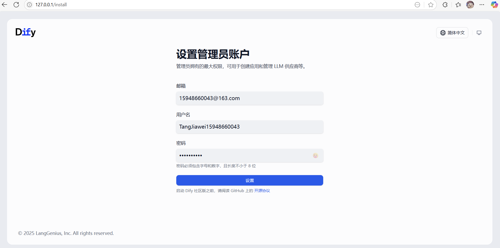

- 登录页面

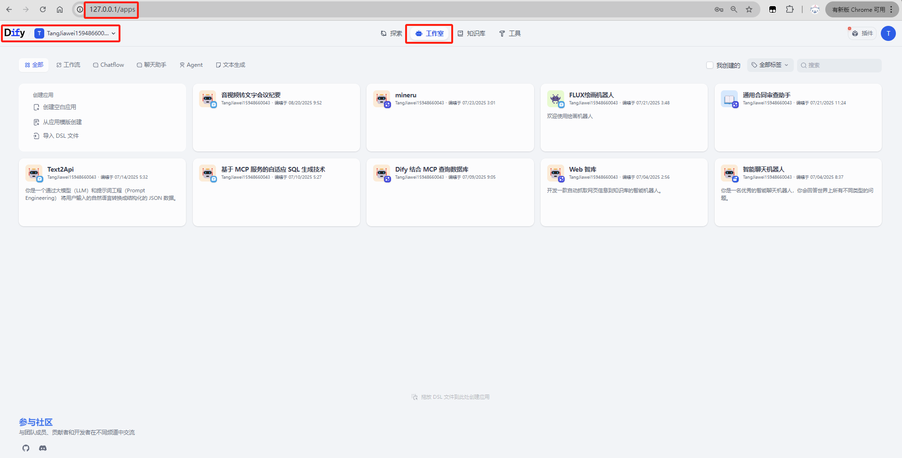

### 3.4 Dify 关联 Ollama 模型

#### 1 下载 Ollama 模型

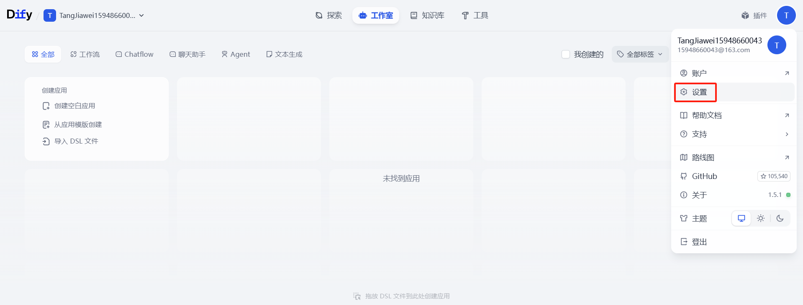

```python
点击 `模型供应商` -> 下载 `Ollama` 模型
```

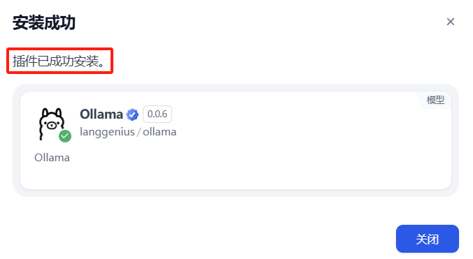

```python
完成安装 Ollama 模型后得到 `待配置模型`
```

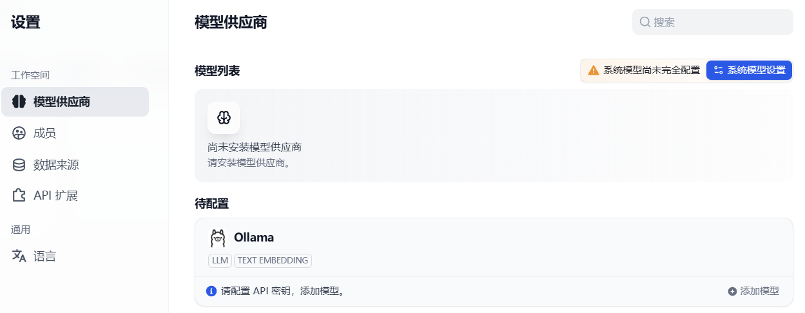

#### 2 设置 docker env 环境变量配置

`Dify`是通过 `Docker` 部署的，`ollama` 运行在本地电脑，要使 `dify` 能够访问 `ollama` 部署的模型服务，需要获取到本地电脑的内网`IP`。

```python
cmd 中输入 ipconfig 命令查看本地 IPv4 地址
```

```python
无线局域网适配器 WLAN:

   连接特定的 DNS 后缀 . . . . . . . :
   IPv6 地址 . . . . . . . . . . . . : 240e:446:50:878f:d62:41f8:2cfd:5c64
   临时 IPv6 地址. . . . . . . . . . : 240e:446:50:878f:b1d7:7b24:4a89:5f01
   本地链接 IPv6 地址. . . . . . . . : fe80::6335:ddbb:4ed0:41b7%14
   IPv4 地址 . . . . . . . . . . . . : 172.20.10.4
   子网掩码  . . . . . . . . . . . . : 255.255.255.240
   默认网关. . . . . . . . . . . . . : fe80::dc45:b8ff:fea2:364%14
                                       172.20.10.1
```

找到 `E:\inSpur\LLaMA\dify\docker` 中的 `.env` 文件，在底部添加下述代码

```python
# 启用自定义模型
CUSTOM_MODEL_ENABLED=true

# 指定 Ollama 的 API 地址（根据部署环境调整 IP）
# host.docker.internal 可以替换为公网地址
# OLLAMA_API_BASE_URL=http://10.206.37.54:11434
OLLAMA_API_BASE_URL=host.docker.internal:11434
```

#### 3 设置加载模型参数

- 模型类型

```python
选择 LLM
```

- 模型名称 

```python
deepseek-r1:1.5b
```

- 基础 `URL`

```python
http://host.docker.internal:11434
```

### 3.5 系统搭载原生 Dify

#### 3.5.1 前端 

##### 1 .env.production 和 .env.development

###### .env.production

```shell
# 页面标题
VITE_APP_TITLE = 结构健康监测系统

# 生产环境配置
VITE_APP_ENV = 'production'

# 若依管理系统/生产环境
VITE_APP_BASE_API = '/prod-api'

# 是否在打包时开启压缩，支持 gzip 和 brotli
VITE_BUILD_COMPRESS = gzip

# 生产环境Dify系统基础URL
VITE_APP_BASE_DIFY = 'http://8.141.94.106:21777'
```

###### .env.development

```shell
# 页面标题
VITE_APP_TITLE = 结构健康监测系统

# 开发环境配置
VITE_APP_ENV = 'development'

# 若依管理系统/开发环境
VITE_APP_BASE_API = '/dev-api'

# 生产环境Dify系统基础URL
VITE_APP_BASE_DIFY = 'http://8.141.94.106:21777'
```

##### 2 iframeMixin.js

创建 `E:\RuoYiProject\MoMagTracker-System\MoMagTracker-Vue3\src\utils\iframeMixin.js` 文件

```shell
import { getAutoToken } from '@/api/intelligentAgentFactory'
import { ElMessage } from 'element-plus'

export default {
  data() {
    return {
      iframeUrl: '',
    }
  },
  methods: {
    /**
     * 从API获取token并将其存储在sessionStorage中。
     * 返回一个在成功时解析token或在失败时拒绝的promise。
     */
    fetchAndStoreToken() {
      console.log('开始获取Dify令牌...')
      return new Promise((resolve, reject) => {
        getAutoToken().then((res) => {
          console.log('Dify令牌响应:', res)
          
          let accessToken, refreshToken;
          
          // 情况1: 若依标准返回格式
          if (res.code === 200 && res.data) {
            console.log('响应格式: 若依标准格式')
            accessToken = res.data.access_token || res.data.accessToken;
            refreshToken = res.data.refresh_token || res.data.refreshToken;
          } 
          // 情况2: 直接返回token对象
          else if (res.data && (res.data.access_token || res.data.accessToken)) {
            console.log('响应格式: 直接token格式')
            accessToken = res.data.access_token || res.data.accessToken;
            refreshToken = res.data.refresh_token || res.data.refreshToken;
          }
          // 情况3: 其他格式
          else if (res.access_token || res.accessToken) {
            console.log('响应格式: 简单对象格式')
            accessToken = res.access_token || res.accessToken;
            refreshToken = res.refresh_token || res.refreshToken;
          }
          
          console.log('解析出的token:', { accessToken, refreshToken })
          
          if (accessToken && refreshToken) {
            const tokens = {
              consoleToken: accessToken,
              difyToken: refreshToken,
            }
            sessionStorage.setItem('consoletoken', tokens.consoleToken)
            sessionStorage.setItem('refreshtoken', tokens.difyToken)
            console.log('Dify令牌已存储到sessionStorage')
            resolve(tokens)
          } else {
            ElMessage({
              message: '获取Dify令牌失败，请检查配置！',
              type: 'error',
            })
            console.error('获取Dify令牌失败，响应数据:', res)
            reject(new Error('Token fetch failed'))
          }
        }).catch(error => {
          console.error('获取Dify令牌失败:', error)
          ElMessage({
            message: '获取Dify令牌失败：' + (error.message || '未知错误'),
            type: 'error',
          })
          reject(error)
        })
      })
    },

    /**
     * 使用存储的token构造完整的iframe URL。
     * @param {string} path - iframe的具体路径 (例如, `/app/123/workflow`).
     * @returns {string|null} - 如果token存在，则返回完整的URL；否则返回null。
     */
    getIframeUrl(path) {
      console.log('开始构建Dify iframe URL...')
      
      // Vue3中使用import.meta.env访问环境变量
      const baseUrl = import.meta.env.VITE_APP_BASE_DIFY
      console.log('Dify基础URL:', baseUrl)
      
      if (!baseUrl) {
        console.error('环境变量VITE_APP_BASE_DIFY未配置')
        ElMessage({
          message: 'Dify系统配置错误，请联系管理员',
          type: 'error',
        })
        return null
      }
      
      const consoleToken = sessionStorage.getItem('consoletoken')
      const difyToken = sessionStorage.getItem('refreshtoken')
      
      console.log('从sessionStorage获取的令牌:', { 
        consoleToken: consoleToken ? '已存在' : '不存在',
        difyToken: difyToken ? '已存在' : '不存在'
      })
      
      if (consoleToken && difyToken) {
        // 构造URL - 注意参数名称要和Dify系统匹配
        const url = `${baseUrl}${path}?console_token=${consoleToken}&refresh_token=${difyToken}&isInternalJump=false`
        console.log('构建的Dify URL:', url)
        return url
      } else {
        console.warn('Dify令牌不存在，无法构建URL')
        ElMessage({
          message: 'Dify令牌失效，请重新登录或联系管理员！',
          type: 'error',
        })
        return null
      }
    },

    /**
     * 用于获取token并立即设置iframeUrl。
     * @param {string} path - iframe的具体路径 (例如, '/apps').
     */
    async initializeIframe(path) {
      console.log('初始化Dify iframe，路径:', path)
      console.log('当前路由:', this.$route)
      
      try {
        await this.fetchAndStoreToken()
        console.log('Dify令牌获取成功，开始构建URL')
        const url = this.getIframeUrl(path)
        if (url) {
          console.log('设置iframeUrl:', url)
          this.iframeUrl = url
        } else {
          console.error('构建Dify URL失败')
        }
      } catch (error) {
        console.error('初始化Dify iframe失败:', error)
      }
    },
  },
}
```


找到文件 `E:\RuoYiProject\MoMagTracker-System\MoMagTracker-Vue3\vite.config.js`，检查 `server` 下的 `proxy`  代理部分，然后端口 `port` 修改为要访问的端口，即要使用 `Nginx` 代理的接口，默认是 `80` 端口。

```shell
import { defineConfig, loadEnv } from 'vite'
import path from 'path'
import createVitePlugins from './vite/plugins'

const baseUrl = 'http://localhost:8080' // 后端接口

// https://vitejs.dev/config/
export default defineConfig(({ mode, command }) => {
  const env = loadEnv(mode, process.cwd())
  const { VITE_APP_ENV } = env
  return {
    // 部署生产环境和开发环境下的URL。
    // 默认情况下，vite 会假设你的应用是被部署在一个域名的根路径上
    // 例如 https://www.ruoyi.vip/。如果应用被部署在一个子路径上，你就需要用这个选项指定这个子路径。例如，如果你的应用被部署在 https://www.ruoyi.vip/admin/，则设置 baseUrl 为 /admin/。
    base: VITE_APP_ENV === 'production' ? '/' : '/',
    plugins: createVitePlugins(env, command === 'build'),
    resolve: {
      // https://cn.vitejs.dev/config/#resolve-alias
      alias: {
        // 设置路径
        '~': path.resolve(__dirname, './'),
        // 设置别名
        '@': path.resolve(__dirname, './src')
      },
      // https://cn.vitejs.dev/config/#resolve-extensions
      extensions: ['.mjs', '.js', '.ts', '.jsx', '.tsx', '.json', '.vue']
    },
    // 打包配置
    build: {
      // https://vite.dev/config/build-options.html
      sourcemap: command === 'build' ? false : 'inline',
      outDir: 'dist',
      assetsDir: 'assets',
      chunkSizeWarningLimit: 2000,
      rollupOptions: {
        output: {
          chunkFileNames: 'static/js/[name]-[hash].js',
          entryFileNames: 'static/js/[name]-[hash].js',
          assetFileNames: 'static/[ext]/[name]-[hash].[ext]'
        }
      }
    },
    // vite 相关配置
    server: {
      port: 80,
      host: true,
      open: true,
      proxy: {
        // https://cn.vitejs.dev/config/#server-proxy
        '/dev-api': {
          target: baseUrl,
          changeOrigin: true,
          rewrite: (p) => p.replace(/^\/dev-api/, '')
        },
         // springdoc proxy
         '^/v3/api-docs/(.*)': {
          target: baseUrl,
          changeOrigin: true,
        }
      }
    },
    css: {
      postcss: {
        plugins: [
          {
            postcssPlugin: 'internal:charset-removal',
            AtRule: {
              charset: (atRule) => {
                if (atRule.name === 'charset') {
                  atRule.remove()
                }
              }
            }
          }
        ]
      }
    }
  }
})
```

##### 3 vite.config.js

修改文件 `E:\RuoYiProject\MoMagTracker-System\MoMagTracker-Vue3\vite.config.js`

```shell
import { defineConfig, loadEnv } from 'vite'
import path from 'path'
import createVitePlugins from './vite/plugins'

const baseUrl = 'http://localhost:8080' // 后端接口

// https://vitejs.dev/config/
export default defineConfig(({ mode, command }) => {
  const env = loadEnv(mode, process.cwd())
  const { VITE_APP_ENV } = env
  
  return {
    // 部署生产环境和开发环境下的URL。
    base: VITE_APP_ENV === 'production' ? '/' : '/',
    plugins: createVitePlugins(env, command === 'build'),
    resolve: {
      // https://cn.vitejs.dev/config/#resolve-alias
      alias: {
        // 设置路径
        '~': path.resolve(__dirname, './'),
        // 设置别名
        '@': path.resolve(__dirname, './src')
      },
      // https://cn.vitejs.dev/config/#resolve-extensions
      extensions: ['.mjs', '.js', '.ts', '.jsx', '.tsx', '.json', '.vue']
    },
    // 打包配置
    build: {
      // https://vite.dev/config/build-options.html
      sourcemap: command === 'build' ? false : 'inline',
      outDir: 'dist',
      assetsDir: 'assets',
      chunkSizeWarningLimit: 2000,
      rollupOptions: {
        output: {
          chunkFileNames: 'static/js/[name]-[hash].js',
          entryFileNames: 'static/js/[name]-[hash].js',
          assetFileNames: 'static/[ext]/[name]-[hash].[ext]'
        }
      }
    },
    // vite 相关配置
    server: {
      port: 81,
      host: true,
      open: true,
      proxy: {
        // https://cn.vitejs.dev/config/#server-proxy
        // 开发环境代理配置
        '/dev-api': {
          target: baseUrl,
          changeOrigin: true,
          rewrite: (p) => p.replace(/^\/dev-api/, '')
        },
        
        // Dify代理配置（开发环境）
        '/dify-api': {
          target: 'http://8.141.94.106:21777',
          changeOrigin: true,
          rewrite: (p) => p.replace(/^\/dify-api/, ''),
          configure: (proxy, options) => {
            // 移除或修改X-Frame-Options头（开发环境）
            proxy.on('proxyRes', (proxyRes, req, res) => {
              // 移除原有的X-Frame-Options头
              delete proxyRes.headers['x-frame-options']
              delete proxyRes.headers['X-Frame-Options']
              
              // 添加允许同源访问的头
              res.setHeader('X-Frame-Options', 'SAMEORIGIN')
              res.setHeader('Content-Security-Policy', "frame-ancestors 'self' http://localhost:*")
            })
          }
        },
        
        // Dify的静态资源代理
        '^/assets/': {
          target: 'http://8.141.94.106:21777',
          changeOrigin: true,
          configure: (proxy, options) => {
            proxy.on('proxyRes', (proxyRes, req, res) => {
              delete proxyRes.headers['x-frame-options']
              delete proxyRes.headers['X-Frame-Options']
            })
          }
        },
        
        // Dify的API路径代理
        '^/api/': {
          target: 'http://8.141.94.106:21777',
          changeOrigin: true,
          configure: (proxy, options) => {
            proxy.on('proxyRes', (proxyRes, req, res) => {
              delete proxyRes.headers['x-frame-options']
              delete proxyRes.headers['X-Frame-Options']
            })
          }
        },
        
        // Dify的控制台API代理
        '^/console/': {
          target: 'http://localhost:80',
          changeOrigin: true,
          configure: (proxy, options) => {
            proxy.on('proxyRes', (proxyRes, req, res) => {
              delete proxyRes.headers['x-frame-options']
              delete proxyRes.headers['X-Frame-Options']
            })
          }
        },
        
        // springdoc proxy
        '^/v3/api-docs/(.*)': {
          target: baseUrl,
          changeOrigin: true,
        }
      }
    },
    css: {
      postcss: {
        plugins: [
          {
            postcssPlugin: 'internal:charset-removal',
            AtRule: {
              charset: (atRule) => {
                if (atRule.name === 'charset') {
                  atRule.remove()
                }
              }
            }
          }
        ]
      }
    }
  }
})
```

- 修改后

```shell
import { defineConfig, loadEnv } from 'vite'
import path from 'path'
import createVitePlugins from './vite/plugins'

const baseUrl = 'http://localhost:8080' // 后端接口

// https://vitejs.dev/config/
export default defineConfig(({ mode, command }) => {
  const env = loadEnv(mode, process.cwd())
  const { VITE_APP_ENV } = env
  
  return {
    // 部署生产环境和开发环境下的URL。
    base: VITE_APP_ENV === 'production' ? '/' : '/',
    plugins: createVitePlugins(env, command === 'build'),
    resolve: {
      // https://cn.vitejs.dev/config/#resolve-alias
      alias: {
        // 设置路径
        '~': path.resolve(__dirname, './'),
        // 设置别名
        '@': path.resolve(__dirname, './src')
      },
      // https://cn.vitejs.dev/config/#resolve-extensions
      extensions: ['.mjs', '.js', '.ts', '.jsx', '.tsx', '.json', '.vue']
    },
    // 打包配置
    build: {
      // https://vite.dev/config/build-options.html
      sourcemap: command === 'build' ? false : 'inline',
      outDir: 'dist',
      assetsDir: 'assets',
      chunkSizeWarningLimit: 2000,
      rollupOptions: {
        output: {
          chunkFileNames: 'static/js/[name]-[hash].js',
          entryFileNames: 'static/js/[name]-[hash].js',
          assetFileNames: 'static/[ext]/[name]-[hash].[ext]'
        }
      }
    },
    // vite 相关配置
    server: {
      port: 81,
      host: true,
      open: true,
      proxy: {
        // https://cn.vitejs.dev/config/#server-proxy
        // 开发环境代理配置
        '/dev-api': {
          target: baseUrl,
          changeOrigin: true,
          rewrite: (p) => p.replace(/^\/dev-api/, '')
        },
        
        // Dify代理配置（开发环境）
        '/dify-api': {
          target: 'http://localhost:80',
          changeOrigin: true,
          rewrite: (p) => p.replace(/^\/dify-api/, ''),
          configure: (proxy, options) => {
            // 移除或修改X-Frame-Options头（开发环境）
            proxy.on('proxyRes', (proxyRes, req, res) => {
              // 移除原有的X-Frame-Options头
              delete proxyRes.headers['x-frame-options']
              delete proxyRes.headers['X-Frame-Options']
              
              // 添加允许同源访问的头
              res.setHeader('X-Frame-Options', 'SAMEORIGIN')
              res.setHeader('Content-Security-Policy', "frame-ancestors 'self' http://localhost:*")
            })
          }
        },
        
        // Dify的静态资源代理
        '^/assets/': {
          target: 'http://localhost:80',
          changeOrigin: true,
          configure: (proxy, options) => {
            proxy.on('proxyRes', (proxyRes, req, res) => {
              delete proxyRes.headers['x-frame-options']
              delete proxyRes.headers['X-Frame-Options']
            })
          }
        },
        
        // Dify的API路径代理
        '^/api/': {
          target: 'http://localhost:80',
          changeOrigin: true,
          configure: (proxy, options) => {
            proxy.on('proxyRes', (proxyRes, req, res) => {
              delete proxyRes.headers['x-frame-options']
              delete proxyRes.headers['X-Frame-Options']
            })
          }
        },
        
        // Dify的控制台API代理
        '^/console/': {
          target: 'http://localhost:80',
          changeOrigin: true,
          configure: (proxy, options) => {
            proxy.on('proxyRes', (proxyRes, req, res) => {
              delete proxyRes.headers['x-frame-options']
              delete proxyRes.headers['X-Frame-Options']
            })
          }
        },
        
        // springdoc proxy
        '^/v3/api-docs/(.*)': {
          target: baseUrl,
          changeOrigin: true,
        }
      }
    },
    css: {
      postcss: {
        plugins: [
          {
            postcssPlugin: 'internal:charset-removal',
            AtRule: {
              charset: (atRule) => {
                if (atRule.name === 'charset') {
                  atRule.remove()
                }
              }
            }
          }
        ]
      }
    }
  }
})
```

##### 4 index.js

文件 `E:\RuoYiProject\MoMagTracker-System\MoMagTracker-Vue3\src\api\intelligentAgentFactory\index.js`

```shell
import request from "@/utils/request";

// 获取Dify访问令牌
export function getAutoToken() {
  return request({
    url: '/dify/getAutoToken',
    method: 'get',
  })
}

// 获取Dify应用列表 - 对应"应用创建"菜单
export function getApps(query) {
  return request({
    url: '/dify/applicationCreation',
    method: 'get',
    params: query || {
      page: 1,
      limit: 30,
      is_created_by_me: false,
      name: ''
    }
  })
}

// 获取Dify数据集 - 对应"数据管理"菜单
export function getDatasets(query) {
  return request({
    url: '/dify/knowledgeManagement',
    method: 'get',
    params: query || {
      page: 1,
      limit: 30
    }
  })
}

// 获取Dify工具列表 - 对应"工具调用"菜单
export function getTools(query) {
  return request({
    url: '/dify/toolInvoker',
    method: 'get',
    params: query || {
      page: 1,
      limit: 30,
      name: ''
    }
  })
}
```

##### 5 intelligentAgentFactory

创建文件夹 `E:\RuoYiProject\MoMagTracker-System\MoMagTracker-Vue3\src\views\intelligentAgentFactory`

###### 应用创建页面 applicationCreation.vue

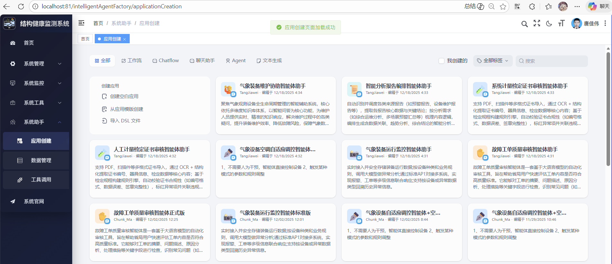

```shell
<template>
  <div class="iframe-container">
    <iframe 
      v-if="iframeUrl" 
      :src="iframeUrl" 
      frameborder="0" 
      allowfullscreen
      @load="onIframeLoad"
      @error="onIframeError"
    ></iframe>
    <div v-else class="loading-container">
      <div class="loading-content">
        <el-icon class="loading-icon"><Loading /></el-icon>
        <div class="loading-text">正在加载Dify应用创建页面...</div>
        <div v-if="errorMessage" class="error-message">
          {{ errorMessage }}
        </div>
      </div>
    </div>
  </div>
</template>

<script>
import iframeMixin from '@/utils/iframeMixin'
import { ElMessage } from 'element-plus'
import { Loading } from '@element-plus/icons-vue'

export default {
  name: 'ApplicationCreation',
  components: {
    Loading
  },
  mixins: [iframeMixin],
  data() {
    return {
      errorMessage: '',
      hasShownSuccessMessage: false,
    }
  },
  created() {
    console.log('ApplicationCreation组件已创建')
    console.log('当前路由路径:', this.$route.path)
    console.log('当前路由参数:', this.$route.params)
    this.initializeIframe('/apps')
  },
  mounted() {
    console.log('ApplicationCreation组件已挂载')
  },
  methods: {
    onIframeLoad() {
      console.log('Dify iframe加载完成')
      if (!this.hasShownSuccessMessage) {
        ElMessage.success('应用创建页面加载成功') // 更新消息文本
      this.hasShownSuccessMessage = true
    }
    },
    onIframeError() {
      console.error('Dify iframe加载失败')
      this.errorMessage = 'Dify页面加载失败，请检查网络连接或联系管理员'
      ElMessage.error('Dify页面加载失败')
    }
  }
}
</script>

<style scoped lang="scss">
.iframe-container {
  width: 100%;
  height: calc(100vh - 50px); /* 减去顶部导航栏高度 */
  margin: 0 auto;
  background: #fff;
  border-radius: 10px;
  box-shadow: 0 4px 24px rgba(0, 0, 0, 0.08);
  scrollbar-width: none;
  -ms-overflow-style: none;
  &::-webkit-scrollbar {
    display: none;
  }

  display: flex;
  flex-direction: column;
  align-items: stretch;
  min-height: 600px;
  position: relative;
}

.iframe-container iframe {
  flex: 1;
  width: 100%;
  min-height: 600px;
  border: none;
}

.loading-container {
  display: flex;
  justify-content: center;
  align-items: center;
  height: 100%;
  background: #f5f7fa;
}

.loading-content {
  text-align: center;
  padding: 40px;
}

.loading-icon {
  font-size: 48px;
  color: #409eff;
  margin-bottom: 16px;
  animation: rotate 2s linear infinite;
}

.loading-text {
  font-size: 16px;
  color: #606266;
  margin-bottom: 8px;
}

.error-message {
  color: #f56c6c;
  font-size: 14px;
  margin-top: 12px;
  padding: 8px 12px;
  background: #fef0f0;
  border-radius: 4px;
  border: 1px solid #fde2e2;
}

@keyframes rotate {
  from {
    transform: rotate(0deg);
  }
  to {
    transform: rotate(360deg);
  }
}
</style>
```

###### 数据管理页面 knowledgeManagement.vue

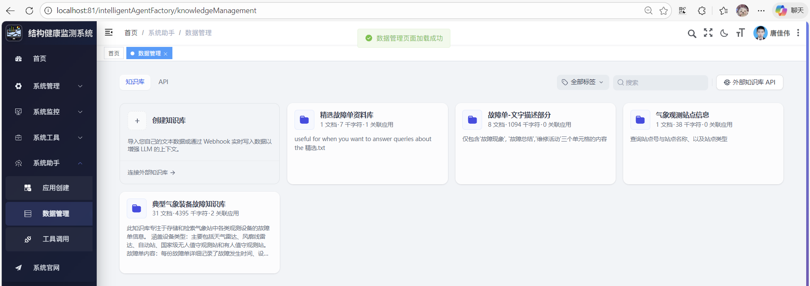

```shell
<template>
  <div class="iframe-container">
    <iframe 
      v-if="iframeUrl" 
      :src="iframeUrl" 
      frameborder="0" 
      allowfullscreen
      @load="onIframeLoad"
      @error="onIframeError"
    ></iframe>
    <div v-else class="loading-container">
      <div class="loading-content">
        <el-icon class="loading-icon"><Loading /></el-icon>
        <div class="loading-text">正在加载Dify数据管理页面...</div>
        <div v-if="errorMessage" class="error-message">
          {{ errorMessage }}
        </div>
      </div>
    </div>
  </div>
</template>

<script>
import iframeMixin from '@/utils/iframeMixin'
import { ElMessage } from 'element-plus'
import { Loading } from '@element-plus/icons-vue'

export default {
  name: 'KnowledgeManagement',
  components: {
    Loading
  },
  mixins: [iframeMixin],
  data() {
    return {
      errorMessage: '',
      hasShownSuccessMessage: false,
    }
  },
  created() {
    console.log('KnowledgeManagement组件已创建')
    console.log('当前路由路径:', this.$route.path)
    console.log('当前路由参数:', this.$route.params)
    this.initializeIframe('/datasets')
  },
  mounted() {
    console.log('KnowledgeManagement组件已挂载')
  },
  methods: {
    onIframeLoad() {
      console.log('Dify数据管理页面iframe加载完成')
      if (!this.hasShownSuccessMessage) {
        ElMessage.success('数据管理页面加载成功') // 更新消息文本
        this.hasShownSuccessMessage = true
      }
    },
    onIframeError() {
      console.error('Dify数据管理页面iframe加载失败')
      this.errorMessage = 'Dify数据管理页面加载失败，请检查网络连接或联系管理员'
      ElMessage.error('Dify数据管理页面加载失败')
    }
  }
}
</script>

<style scoped lang="scss">
.iframe-container {
  width: 100%;
  height: calc(100vh - 50px); /* 减去顶部导航栏高度 */
  margin: 0 auto;
  background: #fff;
  border-radius: 10px;
  box-shadow: 0 4px 24px rgba(0, 0, 0, 0.08);
  scrollbar-width: none;
  -ms-overflow-style: none;
  &::-webkit-scrollbar {
    display: none;
  }

  display: flex;
  flex-direction: column;
  align-items: stretch;
  min-height: 600px;
  position: relative;
}

.iframe-container iframe {
  flex: 1;
  width: 100%;
  min-height: 600px;
  border: none;
}

.loading-container {
  display: flex;
  justify-content: center;
  align-items: center;
  height: 100%;
  background: #f5f7fa;
}

.loading-content {
  text-align: center;
  padding: 40px;
}

.loading-icon {
  font-size: 48px;
  color: #409eff;
  margin-bottom: 16px;
  animation: rotate 2s linear infinite;
}

.loading-text {
  font-size: 16px;
  color: #606266;
  margin-bottom: 8px;
}

.error-message {
  color: #f56c6c;
  font-size: 14px;
  margin-top: 12px;
  padding: 8px 12px;
  background: #fef0f0;
  border-radius: 4px;
  border: 1px solid #fde2e2;
}

@keyframes rotate {
  from {
    transform: rotate(0deg);
  }
  to {
    transform: rotate(360deg);
  }
}
</style>
```

###### 工具调用页面 toolInvoker.vue

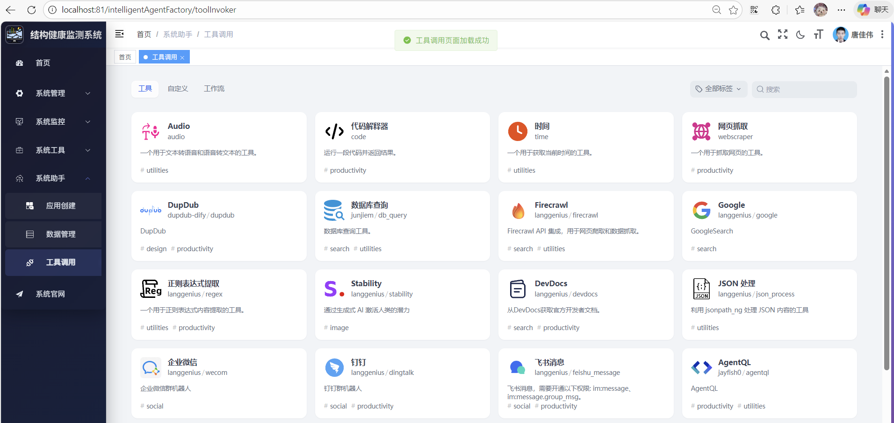

```shell
<template>
  <div class="iframe-container">
    <iframe 
      v-if="iframeUrl" 
      :src="iframeUrl" 
      frameborder="0" 
      allowfullscreen
      @load="onIframeLoad"
      @error="onIframeError"
    ></iframe>
    <div v-else class="loading-container">
      <div class="loading-content">
        <el-icon class="loading-icon"><Loading /></el-icon>
        <div class="loading-text">正在加载Dify工具调用页面...</div>
        <div v-if="errorMessage" class="error-message">
          {{ errorMessage }}
        </div>
      </div>
    </div>
  </div>
</template>

<script>
import iframeMixin from '@/utils/iframeMixin'
import { ElMessage } from 'element-plus'
import { Loading } from '@element-plus/icons-vue'

export default {
  name: 'ToolInvoker',
  components: {
    Loading
  },
  mixins: [iframeMixin],
  data() {
    return {
      errorMessage: '',
      hasShownSuccessMessage: false,
    }
  },
  created() {
    console.log('ToolInvoker组件已创建')
    console.log('当前路由路径:', this.$route.path)
    console.log('当前路由参数:', this.$route.params)
    this.initializeIframe('/tools')
  },
  mounted() {
    console.log('ToolInvoker组件已挂载')
  },
  methods: {
    onIframeLoad() {
      console.log('Dify工具调用页面iframe加载完成')
      if (!this.hasShownSuccessMessage) {
        ElMessage.success('工具调用页面加载成功') // 更新消息文本
        this.hasShownSuccessMessage = true
      }
    },
    onIframeError() {
      console.error('Dify工具调用页面iframe加载失败')
      this.errorMessage = 'Dify工具调用页面加载失败，请检查网络连接或联系管理员'
      ElMessage.error('Dify工具调用页面加载失败')
    }
  }
}
</script>

<style scoped lang="scss">
.iframe-container {
  width: 100%;
  height: calc(100vh - 50px); /* 减去顶部导航栏高度 */
  margin: 0 auto;
  background: #fff;
  border-radius: 10px;
  box-shadow: 0 4px 24px rgba(0, 0, 0, 0.08);
  scrollbar-width: none;
  -ms-overflow-style: none;
  &::-webkit-scrollbar {
    display: none;
  }

  display: flex;
  flex-direction: column;
  align-items: stretch;
  min-height: 600px;
  position: relative;
}

.iframe-container iframe {
  flex: 1;
  width: 100%;
  min-height: 600px;
  border: none;
}

.loading-container {
  display: flex;
  justify-content: center;
  align-items: center;
  height: 100%;
  background: #f5f7fa;
}

.loading-content {
  text-align: center;
  padding: 40px;
}

.loading-icon {
  font-size: 48px;
  color: #409eff;
  margin-bottom: 16px;
  animation: rotate 2s linear infinite;
}

.loading-text {
  font-size: 16px;
  color: #606266;
  margin-bottom: 8px;
}

.error-message {
  color: #f56c6c;
  font-size: 14px;
  margin-top: 12px;
  padding: 8px 12px;
  background: #fef0f0;
  border-radius: 4px;
  border: 1px solid #fde2e2;
}

@keyframes rotate {
  from {
    transform: rotate(0deg);
  }
  to {
    transform: rotate(360deg);
  }
}
</style>
```


#### 3.5.2 后端

##### 1 DifyController.java

创建 `E:\RuoYiProject\MoMagTracker-System\MoMagTracker-Vue\tracker-admin\src\main\java\tracker\web\controller\dify\DifyController.java`

```shell
package tracker.web.controller.dify;

import org.springframework.beans.factory.annotation.Autowired;
import org.springframework.web.bind.annotation.*;
import tracker.common.core.controller.BaseController;
import tracker.common.core.domain.AjaxResult;
import tracker.system.service.IDifyAuthService;

import java.util.HashMap;
import java.util.Map;

/**
 * Dify接口控制器
 */
@RestController
@RequestMapping("/dify")
public class DifyController extends BaseController {

    @Autowired
    private IDifyAuthService difyAuthService;

    /**
     * 获取Dify访问令牌
     */
    @GetMapping("/getAutoToken")
    public AjaxResult getAutoToken() {
        try {
            Map<String, String> token = difyAuthService.getAutoToken();
            return success(token);
        } catch (Exception e) {
            return error("获取Dify令牌失败: " + e.getMessage());
        }
    }

    /**
     * 获取Dify应用列表 - 对应"应用创建"菜单
     * 路由地址改为: /dify/applicationCreation
     */
    @GetMapping("/applicationCreation")
    public AjaxResult getApps(
            @RequestParam(value = "page", defaultValue = "1") int page,
            @RequestParam(value = "limit", defaultValue = "30") int limit,
            @RequestParam(value = "is_created_by_me", defaultValue = "false") boolean isCreatedByMe,
            @RequestParam(value = "name", defaultValue = "") String name) {

        try {
            Map<String, Object> params = new HashMap<>();
            params.put("page", page);
            params.put("limit", limit);
            params.put("is_created_by_me", isCreatedByMe);
            params.put("name", name);

            Map<String, Object> result = difyAuthService.getApps(params);
            return success(result);
        } catch (Exception e) {
            return error("获取Dify应用列表失败: " + e.getMessage());
        }
    }

    /**
     * 获取Dify数据集 - 对应"数据管理"菜单
     * 路由地址改为: /dify/knowledgeManagement
     */
    @GetMapping("/knowledgeManagement")
    public AjaxResult getDatasets(
            @RequestParam(value = "page", defaultValue = "1") int page,
            @RequestParam(value = "limit", defaultValue = "30") int limit) {
        try {
            Map<String, Object> params = new HashMap<>();
            params.put("page", page);
            params.put("limit", limit);

            Map<String, Object> result = difyAuthService.getDatasets(params);
            return success(result);
        } catch (Exception e) {
            return error("获取Dify数据集失败: " + e.getMessage());
        }
    }

    /**
     * 获取Dify工具列表 - 对应"工具调用"菜单
     * 路由地址改为: /dify/toolInvoker
     */
    @GetMapping("/toolInvoker")
    public AjaxResult getTools(
            @RequestParam(value = "page", defaultValue = "1") int page,
            @RequestParam(value = "limit", defaultValue = "30") int limit,
            @RequestParam(value = "name", defaultValue = "") String name) {

        try {
            Map<String, Object> params = new HashMap<>();
            params.put("page", page);
            params.put("limit", limit);
            params.put("name", name);

            Map<String, Object> result = difyAuthService.getTools(params);
            return success(result);
        } catch (Exception e) {
            return error("获取Dify工具列表失败: " + e.getMessage());
        }
    }
}
```

##### 2 RestTemplateConfig.java

创建 `E:\RuoYiProject\MoMagTracker-System\MoMagTracker-Vue\tracker-framework\src\main\java\tracker\framework\config\RestTemplateConfig.java`

```shell
package tracker.framework.config;

import org.springframework.context.annotation.Bean;
import org.springframework.context.annotation.Configuration;
import org.springframework.http.client.SimpleClientHttpRequestFactory;
import org.springframework.web.client.RestTemplate;

@Configuration
public class RestTemplateConfig {

    @Bean
    public RestTemplate restTemplate() {
        SimpleClientHttpRequestFactory factory = new SimpleClientHttpRequestFactory();
        // 设置连接超时时间为30秒（30000毫秒）
        factory.setConnectTimeout(30000);
        // 设置读取超时时间为30秒（30000毫秒）
        factory.setReadTimeout(30000);
        return new RestTemplate(factory);
    }
}
```

##### 3 IDifyAuthService.java

创建 `E:\RuoYiProject\MoMagTracker-System\MoMagTracker-Vue\tracker-system\src\main\java\tracker\system\service\IDifyAuthService.java`

```shell
package tracker.system.service;

import java.util.Map;

/**
 * Dify认证服务接口
 */
public interface IDifyAuthService {
    /**
     * 获取Dify访问令牌
     */
    Map<String, String> getAutoToken();

    /**
     * 获取Dify应用列表 - 对应"应用创建"菜单
     */
    Map<String, Object> getApps(Map<String, Object> params);

    /**
     * 获取Dify数据集 - 对应"数据管理"菜单
     */
    Map<String, Object> getDatasets(Map<String, Object> params);

    /**
     * 获取Dify工具列表 - 对应"工具调用"菜单
     */
    Map<String, Object> getTools(Map<String, Object> params);
}
```

##### 4 DifyAuthServiceImpl

创建 `E:\RuoYiProject\MoMagTracker-System\MoMagTracker-Vue\tracker-system\src\main\java\tracker\system\service\impl\DifyAuthServiceImpl.java`

```shell
package tracker.system.service.impl;

import org.slf4j.Logger;
import org.slf4j.LoggerFactory;
import org.springframework.beans.factory.annotation.Autowired;
import org.springframework.beans.factory.annotation.Value;
import org.springframework.http.*;
import org.springframework.stereotype.Service;
import org.springframework.web.client.RestTemplate;
import tracker.common.utils.StringUtils;
import tracker.system.service.IDifyAuthService;
import tracker.common.core.redis.RedisCache;

import java.util.HashMap;
import java.util.Map;
import java.util.concurrent.TimeUnit;

@Service
public class DifyAuthServiceImpl implements IDifyAuthService {

    private static final Logger log = LoggerFactory.getLogger(DifyAuthServiceImpl.class);

    @Autowired
    private RedisCache redisCache;

    @Autowired
    private RestTemplate restTemplate;

    // Dify配置
    @Value("${dify.api.url:http://8.141.94.106:21777}")
    private String difyApiUrl;

    @Value("${dify.api.key:}")
    private String difyApiKey;

    @Value("${dify.username:admin}")
    private String difyUsername;

    @Value("${dify.password:password}")
    private String difyPassword;

    @Override
    public Map<String, String> getAutoToken() {
        Map<String, String> result = new HashMap<>();
        String cacheKey = "dify:auth:token"; // Redis缓存键

        // 1. 首先尝试从Redis缓存获取有效令牌
        Map<String, String> cachedToken = redisCache.getCacheObject(cacheKey);
        if (cachedToken != null && cachedToken.containsKey("access_token")) {
            log.info("从缓存获取Dify令牌成功");
            return cachedToken;
        }

        log.info("开始获取Dify令牌，API URL: {}", difyApiUrl);

        // 2. 如果配置了API Key，优先使用（但注意API Key可能无法访问/console/api/）
        if (StringUtils.isNotBlank(difyApiKey)) {
            log.warn("使用API Key获取Dify令牌（注意：API Key可能无法访问管理后台）");
            result.put("access_token", difyApiKey);
            result.put("refresh_token", "fixed_refresh_token");
            // 将模拟token存入缓存，有效期55分钟
            redisCache.setCacheObject(cacheKey, result, 55, TimeUnit.MINUTES);
            return result;
        }

        // 3. 核心修改：使用Dify管理账号密码登录，获取真正的JWT令牌
        if (StringUtils.isNotBlank(difyUsername) && StringUtils.isNotBlank(difyPassword)) {
            try {
                log.info("使用用户名密码登录Dify获取令牌: {}", difyUsername);

                // 构建登录请求体
                Map<String, String> loginBody = new HashMap<>();
                loginBody.put("email", difyUsername); // Dify登录接口通常使用`email`字段
                loginBody.put("password", difyPassword);

                HttpHeaders headers = new HttpHeaders();
                headers.setContentType(MediaType.APPLICATION_JSON);

                HttpEntity<Map<String, String>> requestEntity = new HttpEntity<>(loginBody, headers);

                // 调用Dify登录API（常见路径为 /console/api/login）
                String loginUrl = difyApiUrl + "/console/api/login";
                log.info("调用Dify登录接口: {}", loginUrl);

                ResponseEntity<Map> response = restTemplate.postForEntity(
                        loginUrl, requestEntity, Map.class);

                if (response.getStatusCode().is2xxSuccessful() && response.getBody() != null) {
                    Map<String, Object> responseBody = response.getBody();

                    // 解析Dify登录响应，获取JWT令牌
                    // Dify的实际响应格式是嵌套的 {"result":"success","data":{"access_token":"...","refresh_token":"..."}}
                    String resultStatus = (String) responseBody.get("result");

                    if ("success".equals(resultStatus)) {
                        // 从data字段中获取token
                        Map<String, Object> data = (Map<String, Object>) responseBody.get("data");
                        if (data != null) {
                            String accessToken = (String) data.get("access_token");
                            String refreshToken = (String) data.get("refresh_token");

                            if (StringUtils.isNotBlank(accessToken)) {
                                result.put("access_token", accessToken);
                                result.put("refresh_token", refreshToken != null ? refreshToken : "");

                                // 将真实token存入缓存，有效期55分钟（JWT通常1小时过期）
                                redisCache.setCacheObject(cacheKey, result, 55, TimeUnit.MINUTES);
                                log.info("Dify令牌获取成功，已缓存");
                                return result;
                            }
                        }
                    }

                    log.error("Dify登录响应异常，响应体: {}", response.getBody());
                    throw new RuntimeException("Dify登录失败，响应异常");
                }

                log.error("Dify登录HTTP状态码异常: {}", response.getStatusCode());
                throw new RuntimeException("Dify登录失败，HTTP状态码: " + response.getStatusCode());

            } catch (Exception e) {
                log.error("获取Dify令牌失败: ", e);
                throw new RuntimeException("获取Dify令牌失败: " + e.getMessage());
            }
        }

        // 4. 降级方案：返回模拟token（仅用于测试，无法真正访问管理后台）
        log.warn("未配置有效Dify认证信息，返回模拟token（仅用于测试，功能受限）");
        result.put("access_token", "test_access_token_" + System.currentTimeMillis());
        result.put("refresh_token", "test_refresh_token_" + System.currentTimeMillis());
        return result;
    }

    @Override
    public Map<String, Object> getApps(Map<String, Object> params) {
        try {
            log.info("获取Dify应用列表，参数: {}", params);

            // 获取token
            Map<String, String> token = getAutoToken();

            // 构建请求头
            HttpHeaders headers = new HttpHeaders();
            headers.set("Authorization", "Bearer " + token.get("access_token"));

            HttpEntity<String> entity = new HttpEntity<>(headers);

            // 调用Dify应用列表API - 路径保持不变
            String appsUrl = difyApiUrl + "/console/api/apps";

            // 添加查询参数
            StringBuilder urlBuilder = new StringBuilder(appsUrl);
            urlBuilder.append("?page=").append(params.getOrDefault("page", 1))
                    .append("&limit=").append(params.getOrDefault("limit", 30))
                    .append("&is_created_by_me=").append(params.getOrDefault("is_created_by_me", false))
                    .append("&name=").append(params.getOrDefault("name", ""));

            ResponseEntity<Map> response = restTemplate.exchange(
                    urlBuilder.toString(), HttpMethod.GET, entity, Map.class);

            log.info("Dify应用列表获取成功");
            return response.getBody() != null ? response.getBody() : new HashMap<>();

        } catch (Exception e) {
            log.error("获取Dify应用列表失败: ", e);
            Map<String, Object> errorResult = new HashMap<>();
            errorResult.put("error", "获取Dify应用列表失败: " + e.getMessage());
            return errorResult;
        }
    }

    @Override
    public Map<String, Object> getDatasets(Map<String, Object> params) {
        try {
            log.info("获取Dify数据集");

            // 获取token
            Map<String, String> token = getAutoToken();

            // 构建请求头
            HttpHeaders headers = new HttpHeaders();
            headers.set("Authorization", "Bearer " + token.get("access_token"));
            headers.setContentType(MediaType.APPLICATION_JSON);

            HttpEntity<String> entity = new HttpEntity<>(headers);

            // 调用Dify数据集API - 路径保持不变
            String datasetsUrl = difyApiUrl + "/console/api/datasets";
            ResponseEntity<Map> response = restTemplate.exchange(
                    datasetsUrl, HttpMethod.GET, entity, Map.class);

            log.info("Dify数据集获取成功");
            return response.getBody() != null ? response.getBody() : new HashMap<>();

        } catch (Exception e) {
            log.error("获取Dify数据集失败: ", e);
            Map<String, Object> errorResult = new HashMap<>();
            errorResult.put("error", "获取Dify数据集失败: " + e.getMessage());
            return errorResult;
        }
    }

    @Override
    public Map<String, Object> getTools(Map<String, Object> params) {
        try {
            log.info("获取Dify工具列表，参数: {}", params);

            // 获取token
            Map<String, String> token = getAutoToken();

            // 构建请求头
            HttpHeaders headers = new HttpHeaders();
            headers.set("Authorization", "Bearer " + token.get("access_token"));
            headers.setContentType(MediaType.APPLICATION_JSON);

            HttpEntity<String> entity = new HttpEntity<>(headers);

            // 调用Dify工具API - 路径保持不变
            String toolsUrl = difyApiUrl + "/console/api/tools";

            // 添加查询参数（如果Dify工具API支持分页）
            StringBuilder urlBuilder = new StringBuilder(toolsUrl);
            urlBuilder.append("?page=").append(params.getOrDefault("page", 1))
                    .append("&limit=").append(params.getOrDefault("limit", 30));

            // 可以根据需要添加更多查询参数
            if (params.containsKey("name")) {
                urlBuilder.append("&name=").append(params.get("name"));
            }

            ResponseEntity<Map> response = restTemplate.exchange(
                    urlBuilder.toString(), HttpMethod.GET, entity, Map.class);

            log.info("Dify工具列表获取成功");
            return response.getBody() != null ? response.getBody() : new HashMap<>();

        } catch (Exception e) {
            log.error("获取Dify工具列表失败: ", e);
            Map<String, Object> errorResult = new HashMap<>();
            errorResult.put("error", "获取Dify工具列表失败: " + e.getMessage());
            return errorResult;
        }
    }
}
```

#### 3.5.2 系统助手侧边栏图标

文件 `E:\RuoYiProject\MoMagTracker-System\MoMagTracker-Vue3\src\assets\icons\svg` 下创建图标

##### 1 应用创建 applicationCreation.svg

```shell
<?xml version="1.0" standalone="no"?><!DOCTYPE svg PUBLIC "-//W3C//DTD SVG 1.1//EN" "http://www.w3.org/Graphics/SVG/1.1/DTD/svg11.dtd"><svg t="1766039641201" class="icon" viewBox="0 0 1048 1024" version="1.1" xmlns="http://www.w3.org/2000/svg" p-id="36631" xmlns:xlink="http://www.w3.org/1999/xlink" width="262" height="256"><path d="M884.571161 574.878595H986.037073c34.761054 0 62.938537 28.172488 62.938537 62.938537V961.061463c0 34.761054-28.177483 62.938537-62.938537 62.938537h-324.328273c-34.761054 0-62.938537-28.177483-62.938537-62.938537v-23.901658l285.800898-20.100371v-342.180839z" fill="#ffffff" p-id="36632"></path><path d="M899.876215 503.018771h-350.098108c-27.498146 0-50.051122 22.498029-50.051122 49.931239v349.258927c0 27.43321 22.552976 49.931239 50.051122 49.931239h350.098108c27.503141 0 50.051122-22.498029 50.051122-49.931239v-349.258927c0-27.43321-22.54798-49.931239-50.051122-49.931239z m-150.158361 249.391453v74.836917a25.025561 25.025561 0 0 1-50.051122 0V752.41522h-75.14162a24.96562 24.96562 0 0 1 0-49.93124h75.14162V627.637073a25.025561 25.025561 0 1 1 50.051122 0v74.836917h75.141619a24.96562 24.96562 0 1 1 0 49.931239H749.717854z" fill="#ffffff" p-id="36633"></path><path d="M499.726985 0m62.938537 0l324.328273 0q62.938537 0 62.938537 62.938537l0 323.244331q0 62.938537-62.938537 62.938537l-324.328273 0q-62.938537 0-62.938537-62.938537l0-323.244331q0-62.938537 62.938537-62.938537Z" fill="#ffffff" p-id="36634"></path><path d="M389.619512 952.140176H65.291239c-34.761054 0-62.938537-28.177483-62.938537-62.938537v-323.244332c0-34.761054 28.177483-62.938537 62.938537-62.938536H389.619512c34.761054 0 62.938537 28.177483 62.938537 62.938536v323.244332c0 34.761054-28.177483 62.938537-62.938537 62.938537z m0-59.941464a2.997073 2.997073 0 0 0 2.997073-2.997073v-323.244332a2.997073 2.997073 0 0 0-2.997073-2.997073H65.291239a2.997073 2.997073 0 0 0-2.997073 2.997073v323.244332a2.997073 2.997073 0 0 0 2.997073 2.997073H389.619512z" fill="#ffffff" p-id="36635"></path><path d="M452.563044 449.121405m-62.938537 0l-324.328273 0q-62.938537 0-62.938536-62.938537l0-323.244331q0-62.938537 62.938536-62.938537l324.328273 0q62.938537 0 62.938537 62.938537l0 323.244331q0 62.938537-62.938537 62.938537Z" fill="#ffffff" p-id="36636"></path></svg>
```

##### 2 数据管理 knowledgeManagement.svg

```shell
<?xml version="1.0" standalone="no"?><!DOCTYPE svg PUBLIC "-//W3C//DTD SVG 1.1//EN" "http://www.w3.org/Graphics/SVG/1.1/DTD/svg11.dtd"><svg t="1766039723563" class="icon" viewBox="0 0 1024 1024" version="1.1" xmlns="http://www.w3.org/2000/svg" p-id="38546" xmlns:xlink="http://www.w3.org/1999/xlink" width="256" height="256"><path d="M168.228571 888.539429a42.934857 42.934857 0 0 0 43.446858-43.446858 42.934857 42.934857 0 0 0-43.373715-43.373714 42.934857 42.934857 0 0 0-43.446857 43.373714c0 24.356571 19.090286 43.446857 43.446857 43.446858z m-12.580571-43.446858a13.165714 13.165714 0 0 1 12.653714-12.580571 13.165714 13.165714 0 0 1 12.580572 12.580571 13.165714 13.165714 0 0 1-12.580572 12.653715 13.165714 13.165714 0 0 1-12.653714-12.653715z m12.653714-695.881142a42.934857 42.934857 0 0 0-43.446857 43.373714c0 24.283429 19.090286 43.373714 43.446857 43.373714a42.934857 42.934857 0 0 0 43.373715-43.373714 42.934857 42.934857 0 0 0-43.373715-43.373714z m12.580572 43.373714a13.165714 13.165714 0 0 1-12.580572 12.580571 13.165714 13.165714 0 0 1-12.653714-12.580571 13.165714 13.165714 0 0 1 12.653714-12.580572 13.165714 13.165714 0 0 1 12.580572 12.580572zM168.301714 470.308571a42.934857 42.934857 0 0 0-43.446857 43.373715c0 24.283429 19.090286 43.373714 43.446857 43.373714a42.934857 42.934857 0 0 0 43.373715-43.373714 42.934857 42.934857 0 0 0-43.373715-43.373715z m12.580572 43.373715a13.165714 13.165714 0 0 1-12.580572 12.580571 13.165714 13.165714 0 0 1-12.653714-12.580571 13.165714 13.165714 0 0 1 12.653714-12.653715 13.165714 13.165714 0 0 1 12.580572 12.653715z" fill="#ffffff" p-id="38547"></path><path d="M943.396571 1.170286h-863.085714c-43.885714 0-79.725714 35.766857-79.725714 79.725714v862.939429c0 43.958857 35.84 79.725714 79.725714 79.725714h862.939429c43.958857 0 79.725714-35.766857 79.725714-79.725714V80.896a79.725714 79.725714 0 0 0-79.579429-79.725714zM57.490286 689.737143H966.217143v239.689143a40.594286 40.594286 0 0 1-40.521143 40.594285H98.011429a40.594286 40.594286 0 0 1-40.594286-40.594285V689.810286z m0-60.269714V375.661714H966.217143v254.025143H57.490286v-0.146286zM966.217143 315.392H57.490286V91.136c0-20.041143 16.237714-36.278857 36.278857-36.278857h831.926857c22.381714 0 40.521143 18.212571 40.521143 40.594286v219.940571z" fill="#ffffff" p-id="38548"></path></svg>
```

##### 3 工具调用 toolInvoker.svg

```shell
<?xml version="1.0" standalone="no"?><!DOCTYPE svg PUBLIC "-//W3C//DTD SVG 1.1//EN" "http://www.w3.org/Graphics/SVG/1.1/DTD/svg11.dtd"><svg t="1766039801484" class="icon" viewBox="0 0 1024 1024" version="1.1" xmlns="http://www.w3.org/2000/svg" p-id="42359" xmlns:xlink="http://www.w3.org/1999/xlink" width="256" height="256"><path d="M899.072 197.632L1024 72.192 951.808 0l-125.44 124.928a256 256 0 0 0-365.568 0L431.104 153.6 358.4 226.304l73.728 72.704 35.328 35.84-72.704 74.752 72.704 70.144 72.192-70.144 77.312 77.312-72.704 72.192 72.704 72.704 72.192-72.704 35.84 35.328 72.704 71.168 102.4-102.4a256 256 0 0 0 0-366.08z m-83.968 307.2l-17.408 16.896-35.84-35.84-72.704-76.288-74.752-74.752-74.752-72.704-35.84-35.84 16.896-17.408a173.056 173.056 0 0 1 244.736 0l51.2 51.2a173.056 173.056 0 0 1-1.536 243.2zM592.384 724.48L299.52 431.616 226.304 358.4 153.6 431.104 124.928 460.8a259.072 259.072 0 0 0 0 366.08L0 951.808 72.192 1024l125.44-125.44a259.072 259.072 0 0 0 366.08 0l28.672-29.184 73.216-71.68-73.216-73.216z m-88.576 90.112a173.568 173.568 0 0 1-245.248 0l-51.2-51.2a173.568 173.568 0 0 1 0-245.248l16.896-16.896 294.4 294.4z" fill="#ffffff" p-id="42360"></path></svg>
```

##### 4 系统助手 intelligentAgentFactory.svg

```shell
<?xml version="1.0" standalone="no"?><!DOCTYPE svg PUBLIC "-//W3C//DTD SVG 1.1//EN" "http://www.w3.org/Graphics/SVG/1.1/DTD/svg11.dtd"><svg t="1766039370994" class="icon" viewBox="0 0 1024 1024" version="1.1" xmlns="http://www.w3.org/2000/svg" p-id="15467" width="256" height="256" xmlns:xlink="http://www.w3.org/1999/xlink"><path d="M808.720485 803.767298c16.662779 0 32.056914 0.284025 47.337439-0.284025 2.347937 0 5.377533-3.61658 6.646177-6.248542 9.297073-19.200065 24.104224-31.28058 44.932697-35.976453 40.047474-8.918374 76.345822 22.551556 77.6334 59.512628 1.079294 32.587093-20.279359 58.130375-46.01199 65.117381-30.7504 8.350324-65.193121-4.544394-78.485475-40.161083-0.321895-0.852074-0.662724-1.704148-1.249708-3.200011h-67.919758c-15.318395 0-21.642677-6.210672-21.661612-21.510132V659.539588H532.269841v10.603587c0 72.577762 0.170415 145.155523-0.246155 217.75222 0 7.706535 2.878116 11.114831 8.956243 14.087622 41.656946 20.430839 49.230937 79.659443 8.29352 109.519899-21.245043 15.469875-46.201341 16.681714-69.661776 3.048531-20.222554-11.777555-30.90188-29.765782-31.753954-53.907876-1.022489-28.497138 17.041478-54.11616 45.178852-63.204948V659.634263H253.925698v10.527847c0 49.230937 0.132545 98.461873 0 147.69281 0 20.828473-8.217779 25.770502-24.179964 25.013103-21.699482-1.041424-43.550444-0.26509-65.382471-0.26509-8.179909 23.70659-24.104224 38.66522-48.075903 44.251038a64.378917 64.378917 0 0 1-32.549223-124.28918c26.187071-8.009495 60.326832 1.136099 75.739903 32.606028 3.332556 6.797656 7.57399 9.221333 15.14798 8.842634 13.121938-0.681659 26.319616-0.18935 40.009604-0.18935v-142.523562c-21.548002-5.850907-42.906655-10.887611-63.772998-17.476982-23.384695-7.403575-43.682989-20.563384-62.48542-36.411959-32.776443-27.682934-53.604916-62.48542-61.519736-104.142366-7.157421-37.358707-4.582264-74.584869 10.111277-110.371973 22.721971-55.498414 60.838077-94.958903 118.722298-113.988553 2.764506-0.908879 5.831973-5.320728 6.210672-8.388195 6.665111-55.801373 30.295961-102.097389 77.6334-133.756668 35.408404-23.63085 75.171853-30.655726 117.207499-24.198899 10.660391 1.628408 21.188238 4.165695 30.409571 6.021323 14.845021-17.136153 28.402463-35.16225 44.421453-50.783605a230.514394 230.514394 0 0 1 122.603967-63.072404c54.72208-9.884057 107.929361-4.809484 157.917697 20.260424 19.503025 9.808317 37.301902 23.574045 54.5706 37.188292 28.402463 22.419011 48.587148 51.730354 63.621519 84.336382 11.49353 24.880558 20.014269 50.87828 21.926701 78.504409 0.719529 10.433172 5.453273 15.394135 15.432006 19.711309 68.298457 29.557497 112.814585 80.454712 128.13298 153.562653 13.443833 64.132763 0.833139 123.891546-39.498359 176.776933-33.590647 44.042753-78.447604 69.90793-131.976781 81.685485-15.52668 3.408296-15.56455 3.237881-15.56455 18.707756v128.265525z m-296.786808-189.311887c84.544666 0 169.089333 0.18935 253.728674-0.170414a322.235416 322.235416 0 0 0 49.420286-3.88167 157.728347 157.728347 0 0 0 86.059465-43.30429c35.446274-34.310176 53.415566-76.118602 52.866452-126.239483-0.492309-45.879446-17.514852-84.336382-48.681823-116.582645a155.664435 155.664435 0 0 0-77.387245-44.459323c-12.099449-2.821311-17.571657-11.171636-18.234382-23.630849a312.748993 312.748993 0 0 0-3.673385-33.344492q-12.894718-79.337548-75.152919-130.348373c-46.76939-38.456936-100.355371-51.749288-159.52717-43.228549-68.771832 9.921927-118.248923 47.621464-151.479805 107.929361-7.081681 12.856848-18.934976 17.174023-32.511353 11.45566-22.286466-9.334943-44.819087-15.26159-69.623906-11.701815-27.455715 3.938475-51.389524 14.390582-71.062963 33.590647-26.660446 26.035592-39.422619 58.281855-40.047474 95.470147-0.34083 20.828473-6.513632 32.322003-28.061634 34.518461-7.57399 0.757399-14.863956 4.392914-21.869897 7.57399-58.698425 26.9066-96.719856 96.038197-84.620406 164.204109 10.338497 58.37653 52.563492 96.738791 106.698588 112.75778 28.781163 8.520739 58.433335 9.259203 88.047637 9.353878 81.647615 0.208285 163.37097 0.03787 245.11326 0.03787z m-408.67358 234.793699a25.050973 25.050973 0 0 0 24.804818-24.937363 25.713697 25.713697 0 1 0-26.508966 24.937363z m842.776832-25.107778c0-15.034371-10.035537-24.899493-25.050973-25.183518-13.254483-0.246155-25.032038 9.940862-25.069908 25.619022a24.350379 24.350379 0 0 0 24.066354 24.615469h0.946749c15.147981 0.056805 25.107778-9.902992 25.107778-25.050973z m-434.519822 159.546105c15.147981 0 25.391802-9.846187 25.524347-24.615469a25.088843 25.088843 0 0 0-24.615468-25.562217h-0.492309a24.615468 24.615468 0 0 0-25.032038 24.198899v0.53018c-0.170415 15.091176 9.884057 25.410737 24.615468 25.448607z" p-id="15468" fill="#ffffff"></path><path d="M551.432036 472.556704a21.434392 21.434392 0 0 1-3.048531 0.681659c-12.913653 0-28.648618 4.279305-37.869951-1.590538-8.615414-5.472208-11.039091-21.585872-14.807151-33.477037-2.859181-8.956243-7.119551-12.307734-16.757454-11.929035-20.468709 0.795269-40.975287 0.435504-61.462931 0.132545-6.002387 0-9.031983 1.893498-10.887611 7.72547-3.61658 11.360985-7.87695 22.570491-12.364539 33.647452-0.927814 2.310067-3.95741 5.244988-6.115997 5.339663-12.516019 0.511244-25.050973 0.246155-38.93031 0.246155 7.83908-20.411904 15.26159-39.763449 22.721971-58.98245 17.211893-44.932697 34.537396-89.80859 51.446329-134.854896 2.518352-6.702981 5.850907-9.467488 13.008328-9.107724 9.107723 0.530179 18.291186 0.321895 27.417845 0 5.377533-0.15148 8.444999 1.495863 10.584651 6.930202q37.566992 95.242928 75.645228 190.258635c0.435504 1.457993 0.776334 2.934921 1.420123 4.979899z m-100.866615-152.843124l-2.669832 0.132545-26.111331 72.577762h56.236877c-9.372813-24.861623-18.423731-48.795432-27.455714-72.710307zM633.704505 472.878598h-37.775276c-0.208285-3.181076-0.624854-6.475762-0.624854-9.789382 0-60.497247 0.132545-120.994495-0.22722-181.491742 0-8.729024 2.537287-11.9101 11.171636-11.209506 7.214226 0.605919 14.560996-0.397634 21.699482 0.473375 2.556222 0.30296 6.684046 4.03315 6.702981 6.210672 0.321895 64.265307 0.208285 128.54955 0.11361 192.833792a10.925481 10.925481 0 0 1-1.060359 2.972791z" p-id="15469" fill="#ffffff"></path></svg>
```

#### 3.5.3 Dify-Nginx 代理

##### 1 安装 Nginx

下载链接：选择 `Stable version` 版本的 `[ nginx/Windows-1.28.0][pgp]`

```shell
https://nginx.org/en/download.html 
```

##### 2 Nginx 代理配置

###### nginx.conf

找到文件 `"E:\Nginx\nginx-1.28.0\conf\nginx.conf"`，添加代码

```shell
#user  nobody;
worker_processes  1;

#error_log  logs/error.log;
#error_log  logs/error.log  notice;
#error_log  logs/error.log  info;

#pid        logs/nginx.pid;


events {
    worker_connections  1024;
}


http {
    include       mime.types;
    default_type  application/octet-stream;

    #log_format  main  '$remote_addr - $remote_user [$time_local] "$request" '
    #                  '$status $body_bytes_sent "$http_referer" '
    #                  '"$http_user_agent" "$http_x_forwarded_for"';

    #access_log  logs/access.log  main;

    sendfile        on;
    #tcp_nopush     on;

    #keepalive_timeout  0;
    keepalive_timeout  65;

    #gzip  on;

    server {
        listen       80;
        server_name  localhost;

        #charset koi8-r;

        #access_log  logs/host.access.log  main;

        location / {
            root   html;
            index  index.html index.htm;
        }

        #error_page  404              /404.html;

        # redirect server error pages to the static page /50x.html
        #
        error_page   500 502 503 504  /50x.html;
        location = /50x.html {
            root   html;
        }

        # proxy the PHP scripts to Apache listening on 127.0.0.1:80
        #
        #location ~ \.php$ {
        #    proxy_pass   http://127.0.0.1;
        #}

        # pass the PHP scripts to FastCGI server listening on 127.0.0.1:9000
        #
        #location ~ \.php$ {
        #    root           html;
        #    fastcgi_pass   127.0.0.1:9000;
        #    fastcgi_index  index.php;
        #    fastcgi_param  SCRIPT_FILENAME  /scripts$fastcgi_script_name;
        #    include        fastcgi_params;
        #}

        # deny access to .htaccess files, if Apache's document root
        # concurs with nginx's one
        #
        #location ~ /\.ht {
        #    deny  all;
        #}
    }
	
	# 引入 dify-nginx.conf，让它成为独立的 server 块
	include dify-nginx.conf;

    # another virtual host using mix of IP-, name-, and port-based configuration
    #
    #server {
    #    listen       8000;
    #    listen       somename:8080;
    #    server_name  somename  alias  another.alias;

    #    location / {
    #        root   html;
    #        index  index.html index.htm;
    #    }
    #}


    # HTTPS server
    #
    #server {
    #    listen       443 ssl;
    #    server_name  localhost;

    #    ssl_certificate      cert.pem;
    #    ssl_certificate_key  cert.key;

    #    ssl_session_cache    shared:SSL:1m;
    #    ssl_session_timeout  5m;

    #    ssl_ciphers  HIGH:!aNULL:!MD5;
    #    ssl_prefer_server_ciphers  on;

    #    location / {
    #        root   html;
    #        index  index.html index.htm;
    #    }
    #}

}
```

###### dify-nginx.conf

找到文件 `"E:\Nginx\nginx-1.28.0\conf\nginx.conf"`，添加 `dify-nginx.conf` 代理。

```shell
# dify集成代理配置

server {
    # 统一入口：所有流量通过本Nginx的8090端口进入
    listen       8090;
    server_name  localhost;

    # 1. 代理前端 (Vite开发服务器，运行在81端口)
    location / {
        proxy_pass http://localhost:81/;
        proxy_set_header Host $host;
        proxy_set_header X-Real-IP $remote_addr;
        proxy_set_header X-Forwarded-For $proxy_add_x_forwarded_for;
        proxy_set_header X-Forwarded-Proto $scheme;
    }

    # 2. 代理后端API (Spring Boot，运行在8080端口)
    # 匹配Vite配置中 /dev-api 的转发规则
    location /dev-api/ {
        # 注意末尾的斜杠，它会去除 `/dev-api` 前缀
        proxy_pass http://localhost:8080/;
        proxy_set_header Host $host;
        proxy_set_header X-Real-IP $remote_addr;
        proxy_set_header X-Forwarded-For $proxy_add_x_forwarded_for;
        proxy_set_header X-Forwarded-Proto $scheme;
    }

    # 3. 代理Dify服务（解决X-Frame-Options问题的核心）
    # 所有 /dify-api/ 开头的请求转发到Dify（Docker运行在18080端口）
    location /dify-api/ {
        # 代理到Docker内部的Nginx（18080端口）
        proxy_pass http://localhost:18080/;
        proxy_set_header Host $host;
        proxy_set_header X-Real-IP $remote_addr;
        proxy_set_header X-Forwarded-For $proxy_add_x_forwarded_for;
        proxy_set_header X-Forwarded-Proto $scheme;
        proxy_hide_header X-Frame-Options;
    }
    
    # 修改1：去掉 proxy_pass 中的斜杠
    location ~* ^/(_next/|static/|assets/|images/|fonts/|favicon\.ico) {
        proxy_pass http://localhost:80;  # 去掉末尾的斜杠
        proxy_set_header Host $host;
        proxy_set_header X-Real-IP $remote_addr;
        proxy_set_header X-Forwarded-For $proxy_add_x_forwarded_for;
        proxy_set_header X-Forwarded-Proto $scheme;
        proxy_set_header X-Forwarded-Host $host;
        proxy_hide_header X-Frame-Options;
    }
    
    # 修改2：去掉 proxy_pass 中的斜杠
    location ~* ^/?(api|console|datasets|tools|app|files)/ {
        proxy_pass http://localhost:80;  # 去掉末尾的斜杠
        proxy_set_header Host $host;
        proxy_set_header X-Real-IP $remote_addr;
        proxy_set_header X-Forwarded-For $proxy_add_x_forwarded_for;
        proxy_set_header X-Forwarded-Proto $scheme;
        proxy_set_header X-Forwarded-Host $host;
        proxy_hide_header X-Frame-Options;
    }
}
```

##### 3 Nginx 代理测试

```shell
# 1. 停止 Nginx（如果正在运行）
.\nginx -s stop

# 2. 检查是否还有 Nginx 进程残留
taskkill /F /IM nginx.exe 2>$null

# 3. 删除 PID 文件
Remove-Item E:\Nginx\nginx-1.28.0\logs\nginx.pid -Force -ErrorAction SilentlyContinue

# 4. 启动 Nginx
.\nginx

# 5. 验证启动
.\nginx -t
tasklist | findstr nginx

# 6. 重新加载配置（如果需要）
.\nginx -s reload
```

- 结果

```shell
PS E:\Nginx\nginx-1.28.0> .\nginx -t
nginx: the configuration file E:\Nginx\nginx-1.28.0/conf/nginx.conf syntax is ok
nginx: configuration file E:\Nginx\nginx-1.28.0/conf/nginx.conf test is successful

PS E:\Nginx\nginx-1.28.0> tasklist | findstr nginx
nginx.exe                    15544 Console                    1      9,848 K
nginx.exe                    12220 Console                    1     10,116 K
```

##### 4 代理结果

你现在可以通过以下地址访问：

###### 前端应用

- **前端链接**：`http://localhost:8090/`
    - 这会代理到 `http://localhost:81`（你的 Vite 前端）
- **结果图**

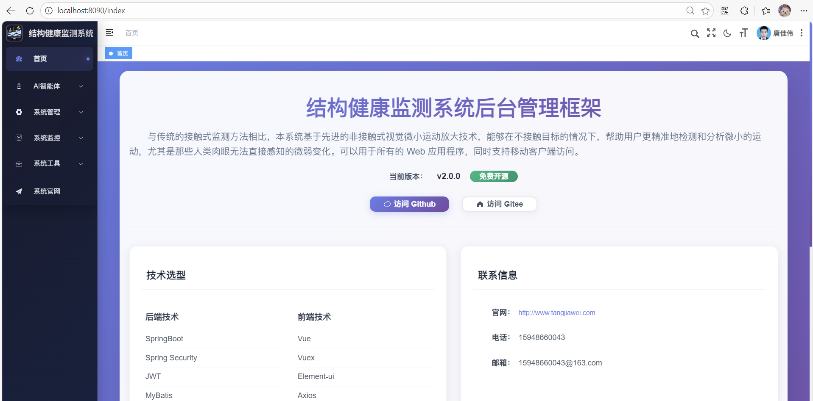

###### 后端 API 

- **后端 API 链接**：`http://localhost:8090/dev-api/`
    - 这会代理到 `http://localhost:8080/`（你的 Spring Boot 后端）
- **结果图**

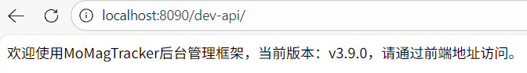

###### Dify 服务

- **Dify 链接**：`http://localhost:8090/dify-api/`
    - 这会代理到 `http://localhost:80/`（Dify 服务）
- **结果图**

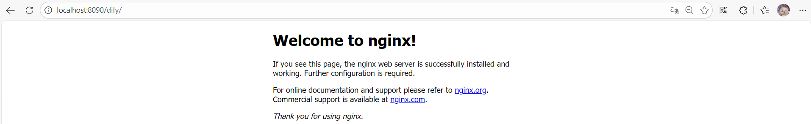

```shell
PS E:\Nginx\nginx-1.28.0> tasklist | findstr nginx
nginx.exe                    15544 Console                    1      9,844 K
nginx.exe                    12220 Console                    1     10,500 K
PS E:\Nginx\nginx-1.28.0> netstat -ano | findstr :8090
  TCP    0.0.0.0:8090           0.0.0.0:0              LISTENING       12220
  TCP    127.0.0.1:8090         127.0.0.1:49461        FIN_WAIT_2      12220
  TCP    127.0.0.1:8090         127.0.0.1:50060        FIN_WAIT_2      12220
  TCP    127.0.0.1:8090         127.0.0.1:50593        FIN_WAIT_2      12220
  TCP    127.0.0.1:8090         127.0.0.1:53963        FIN_WAIT_2      12220
  TCP    127.0.0.1:8090         127.0.0.1:55869        FIN_WAIT_2      12220
  TCP    127.0.0.1:8090         127.0.0.1:58473        FIN_WAIT_2      12220
  TCP    127.0.0.1:49461        127.0.0.1:8090         CLOSE_WAIT      27548
  TCP    127.0.0.1:50060        127.0.0.1:8090         CLOSE_WAIT      27548
  TCP    127.0.0.1:50593        127.0.0.1:8090         CLOSE_WAIT      27548
  TCP    127.0.0.1:53963        127.0.0.1:8090         CLOSE_WAIT      27548
  TCP    127.0.0.1:55869        127.0.0.1:8090         CLOSE_WAIT      27548
  TCP    127.0.0.1:58473        127.0.0.1:8090         CLOSE_WAIT      27548
```

### 3.6 推送至远程仓库

```shell
git status

git add .

git status

git commit -m "第四次提交，修改 README.md 文件，开发系统助手模块，新增应用创建模块、数据管理模块和工具调用模块"

git push -u origin master
```

- 结果

```shell
17354@LAPTOP-3CJQNHQH MINGW64 /e/RuoYiProject/MoMagTracker-System (master)
$ git status
On branch master
Your branch is up to date with 'origin/master'.

Changes not staged for commit:
  (use "git add <file>..." to update what will be committed)
  (use "git restore <file>..." to discard changes in working directory)
        modified:   MoMagTracker-Vue/tracker-admin/src/main/resources/application.yml
        modified:   MoMagTracker-Vue/tracker-system/pom.xml
        modified:   MoMagTracker-Vue/tracker-ui/.env.development
        modified:   MoMagTracker-Vue/tracker-ui/.env.production
        modified:   MoMagTracker-Vue3/.env.development
        modified:   MoMagTracker-Vue3/.env.production
        modified:   MoMagTracker-Vue3/vite.config.js
        modified:   README.md

Untracked files:
  (use "git add <file>..." to include in what will be committed)
        MoMagTracker-Vue/tracker-admin/src/main/java/tracker/web/controller/dify/
        MoMagTracker-Vue/tracker-framework/src/main/java/tracker/framework/config/RestTemplateConfig.java
        MoMagTracker-Vue/tracker-system/src/main/java/tracker/system/service/IDifyAuthService.java
        MoMagTracker-Vue/tracker-system/src/main/java/tracker/system/service/impl/DifyAuthServiceImpl.java
        MoMagTracker-Vue3/src/api/intelligentAgentFactory/
        MoMagTracker-Vue3/src/assets/icons/svg/applicationCreation.svg
        MoMagTracker-Vue3/src/assets/icons/svg/intelligentAgentFactory.svg
        MoMagTracker-Vue3/src/assets/icons/svg/knowledgeManagement.svg
        MoMagTracker-Vue3/src/assets/icons/svg/toolInvoker.svg
        MoMagTracker-Vue3/src/utils/iframeMixin.js
        MoMagTracker-Vue3/src/views/intelligentAgentFactory/
        README.assets/1751507227515.jpg
        README.assets/image-20250703100702397.png
        README.assets/image-20250703103005764.png
        README.assets/image-20250703104237574.png
        README.assets/image-20250703104331547.png
        README.assets/image-20250703114902293.png
        README.assets/image-20250703142055726.png
        README.assets/image-20250703145705947.png
        README.assets/image-20250703150156046.png
        README.assets/image-20250703150400498.png
        README.assets/image-20251212113035905.png
        README.assets/image-20251215092052265.png
        README.assets/image-20251215092114437.png
        README.assets/image-20251215092204498.png
        README.assets/image-20251218162854410.png
        README.assets/image-20251218162920730.png
        README.assets/image-20251218163808324.png

no changes added to commit (use "git add" and/or "git commit -a")

17354@LAPTOP-3CJQNHQH MINGW64 /e/RuoYiProject/MoMagTracker-System (master)
$ git add .
warning: in the working copy of 'MoMagTracker-Vue3/src/api/intelligentAgentFactory/index.js', LF will be replaced by CRLF the next time Git touches it
warning: in the working copy of 'MoMagTracker-Vue3/src/views/intelligentAgentFactory/applicationCreation.vue', LF will be replaced by CRLF the next time Git touches it
warning: in the working copy of 'MoMagTracker-Vue3/src/views/intelligentAgentFactory/knowledgeManagement.vue', LF will be replaced by CRLF the next time Git touches it

17354@LAPTOP-3CJQNHQH MINGW64 /e/RuoYiProject/MoMagTracker-System (master)
$ git status
On branch master
Your branch is up to date with 'origin/master'.

Changes to be committed:
  (use "git restore --staged <file>..." to unstage)
        new file:   MoMagTracker-Vue/tracker-admin/src/main/java/tracker/web/controller/dify/DifyController.java
        modified:   MoMagTracker-Vue/tracker-admin/src/main/resources/application.yml
        new file:   MoMagTracker-Vue/tracker-framework/src/main/java/tracker/framework/config/RestTemplateConfig.java
        modified:   MoMagTracker-Vue/tracker-system/pom.xml
        new file:   MoMagTracker-Vue/tracker-system/src/main/java/tracker/system/service/IDifyAuthService.java
        new file:   MoMagTracker-Vue/tracker-system/src/main/java/tracker/system/service/impl/DifyAuthServiceImpl.java
        modified:   MoMagTracker-Vue/tracker-ui/.env.development
        modified:   MoMagTracker-Vue/tracker-ui/.env.production
        modified:   MoMagTracker-Vue3/.env.development
        modified:   MoMagTracker-Vue3/.env.production
        new file:   MoMagTracker-Vue3/src/api/intelligentAgentFactory/index.js
        new file:   MoMagTracker-Vue3/src/assets/icons/svg/applicationCreation.svg
        new file:   MoMagTracker-Vue3/src/assets/icons/svg/intelligentAgentFactory.svg
        new file:   MoMagTracker-Vue3/src/assets/icons/svg/knowledgeManagement.svg
        new file:   MoMagTracker-Vue3/src/assets/icons/svg/toolInvoker.svg
        new file:   MoMagTracker-Vue3/src/utils/iframeMixin.js
        new file:   MoMagTracker-Vue3/src/views/intelligentAgentFactory/applicationCreation.vue
        new file:   MoMagTracker-Vue3/src/views/intelligentAgentFactory/knowledgeManagement.vue
        new file:   MoMagTracker-Vue3/src/views/intelligentAgentFactory/toolInvoker.vue
        modified:   MoMagTracker-Vue3/vite.config.js
        new file:   README.assets/1751507227515.jpg
        new file:   README.assets/image-20250703100702397.png
        new file:   README.assets/image-20250703103005764.png
        new file:   README.assets/image-20250703104237574.png
        new file:   README.assets/image-20250703104331547.png
        new file:   README.assets/image-20250703114902293.png
        new file:   README.assets/image-20250703142055726.png
        new file:   README.assets/image-20250703145705947.png
        new file:   README.assets/image-20250703150156046.png
        new file:   README.assets/image-20250703150400498.png
        new file:   README.assets/image-20251212113035905.png
        new file:   README.assets/image-20251215092052265.png
        new file:   README.assets/image-20251215092114437.png
        new file:   README.assets/image-20251215092204498.png
        new file:   README.assets/image-20251218162854410.png
        new file:   README.assets/image-20251218162920730.png
        new file:   README.assets/image-20251218163808324.png
        modified:   README.md

17354@LAPTOP-3CJQNHQH MINGW64 /e/RuoYiProject/MoMagTracker-System (master)
$ git commit -m "第四次提交，修改 README.md 文件，开发系统助手模块，新增应用创建模块、数据管理模块和工具调用模块"
[master e2ae73e] 第四次提交，修改 README.md 文件，开发系统助手模块，新增应用创建模块、数据管理模块和工具调用模块
 38 files changed, 3679 insertions(+), 27 deletions(-)
 create mode 100644 MoMagTracker-Vue/tracker-admin/src/main/java/tracker/web/controller/dify/DifyController.java
 create mode 100644 MoMagTracker-Vue/tracker-framework/src/main/java/tracker/framework/config/RestTemplateConfig.java
 create mode 100644 MoMagTracker-Vue/tracker-system/src/main/java/tracker/system/service/IDifyAuthService.java
 create mode 100644 MoMagTracker-Vue/tracker-system/src/main/java/tracker/system/service/impl/DifyAuthServiceImpl.java
 create mode 100644 MoMagTracker-Vue3/src/api/intelligentAgentFactory/index.js
 create mode 100644 MoMagTracker-Vue3/src/assets/icons/svg/applicationCreation.svg
 create mode 100644 MoMagTracker-Vue3/src/assets/icons/svg/intelligentAgentFactory.svg
 create mode 100644 MoMagTracker-Vue3/src/assets/icons/svg/knowledgeManagement.svg
 create mode 100644 MoMagTracker-Vue3/src/assets/icons/svg/toolInvoker.svg
 create mode 100644 MoMagTracker-Vue3/src/utils/iframeMixin.js
 create mode 100644 MoMagTracker-Vue3/src/views/intelligentAgentFactory/applicationCreation.vue
 create mode 100644 MoMagTracker-Vue3/src/views/intelligentAgentFactory/knowledgeManagement.vue
 create mode 100644 MoMagTracker-Vue3/src/views/intelligentAgentFactory/toolInvoker.vue
 create mode 100644 README.assets/1751507227515.jpg
 create mode 100644 README.assets/image-20250703100702397.png
 create mode 100644 README.assets/image-20250703103005764.png
 create mode 100644 README.assets/image-20250703104237574.png
 create mode 100644 README.assets/image-20250703104331547.png
 create mode 100644 README.assets/image-20250703114902293.png
 create mode 100644 README.assets/image-20250703142055726.png
 create mode 100644 README.assets/image-20250703145705947.png
 create mode 100644 README.assets/image-20250703150156046.png
 create mode 100644 README.assets/image-20250703150400498.png
 create mode 100644 README.assets/image-20251212113035905.png
 create mode 100644 README.assets/image-20251215092052265.png
 create mode 100644 README.assets/image-20251215092114437.png
 create mode 100644 README.assets/image-20251215092204498.png
 create mode 100644 README.assets/image-20251218162854410.png
 create mode 100644 README.assets/image-20251218162920730.png
 create mode 100644 README.assets/image-20251218163808324.png

17354@LAPTOP-3CJQNHQH MINGW64 /e/RuoYiProject/MoMagTracker-System (master)
$ git push -u origin master
Enumerating objects: 114, done.
Counting objects: 100% (114/114), done.
Delta compression using up to 8 threads
Compressing objects: 100% (65/65), done.
Writing objects: 100% (77/77), 1.78 MiB | 3.53 MiB/s, done.
Total 77 (delta 28), reused 0 (delta 0), pack-reused 0 (from 0)
remote: Resolving deltas: 100% (28/28), completed with 23 local objects.
To 17354395073_github_account:Tang17354395073/MoMagTracker-System.git
   a826a4f..e2ae73e  master -> master
branch 'master' set up to track 'origin/master'.
```

## 4 子系统功能开发（视频监控）

### 4.1 前端

#### 4.1.1 整体开发框架

```shell
E:\RuoYiProject\MoMagTracker-System\MoMagTracker-Vue3\
├── src/
│   ├── api/
│   │   └── data/
│   │       └── index.js                    # API 接口文件
│   ├── assets/
│   │   └── icons/
│   │       └── svg/
│   │           └── video-source.svg - 视频源选择图标
│   │           └── upload.svg - 上传图标
│   │           └── camera-connect.svg - 连接摄像头图标
│   │           └── camera-disconnect.svg - 断开摄像头图标
│   │           └── start-process.svg - 开始处理图标
│   │           └── loading.svg - 加载中图标
│   │           └── algorithm.svg - 算法设置图标
│   │           └── lagrangian-icon.svg - 拉格朗日算法图标
│   │           └── eulerian-icon.svg - 欧拉算法图标
│   │           └── deeplearning-icon.svg - 深度学习算法图标
│   │           └── check.svg - 选中图标
│   │           └── parameter.svg - 参数设置图标
│   │           └── video-status.svg - 视频状态图标
│   │           └── video-play.svg - 视频播放图标
│   │           └── video-pause.svg - 视频暂停图标
│   │           └── camera.svg - 摄像头图标
│   │           └── file.svg - 文件图标
│   │           └── camera-recording.svg - 录制中摄像头图标
│   │           └── video-preview.svg - 视频预览区图标
│   │           └── record-start.svg - 开始录制图标
│   │           └── record-stop.svg - 停止录制图标
│   │           └── screenshot.svg - 截图图标
│   │           └── camera-placeholder.svg - 摄像头占位图标
│   │           └── progress.svg - 处理进度图标
│   │           └── success.svg - 成功图标
│   │           └── result.svg - 处理结果图标
│   │           └── download.svg - 下载图标
│   │           └── share.svg - 分享图标
│   ├── views/
│   │   └── monitor/
│   │       └── data/
│   │           └── index.vue               # 视频监控主页面
```

#### 4.1.2 API 接口文件

创建文件 `E:\RuoYiProject\MoMagTracker-System\MoMagTracker-Vue3\src\api\data\index.js`

```shell
import request from '@/utils/request'

// 视频处理相关API

/**
 * 处理视频文件
 * @param {FormData} data 表单数据，包含video文件、algorithm算法、amplification放大倍数等
 * @returns Promise
 */
export function processVideo(data) {
  return request({
    url: '/video/process',
    method: 'post',
    data,
    headers: {
      'Content-Type': 'multipart/form-data'
    },
    timeout: 300000 // 5分钟超时，视频处理需要较长时间
  })
}

/**
 * 获取视频处理进度
 * @param {string} taskId 任务ID
 * @returns Promise
 */
export function getProcessProgress(taskId) {
  return request({
    url: `/video/progress/${taskId}`,
    method: 'get'
  })
}

/**
 * 开始实时视频处理
 * @param {Object} data 参数对象
 * @returns Promise
 */
export function startRealtimeProcess(data) {
  return request({
    url: '/video/realtime/start',
    method: 'post',
    data
  })
}

/**
 * 停止实时视频处理
 * @returns Promise
 */
export function stopRealtimeProcess() {
  return request({
    url: '/video/realtime/stop',
    method: 'post'
  })
}

/**
 * 下载处理结果
 * @param {string} taskId 任务ID
 * @returns Promise
 */
export function downloadResult(taskId) {
  return request({
    url: `/video/download/${taskId}`,
    method: 'get',
    responseType: 'blob'
  })
}

/**
 * 获取摄像头列表
 * @returns Promise
 */
export function getCameraList() {
  return request({
    url: '/video/cameras',
    method: 'get'
  })
}

/**
 * 获取处理历史记录
 * @param {Object} params 查询参数
 * @returns Promise
 */
export function getProcessHistory(params) {
  return request({
    url: '/video/history',
    method: 'get',
    params
  })
}

/**
 * 删除处理记录
 * @param {string} taskId 任务ID
 * @returns Promise
 */
export function deleteProcessRecord(taskId) {
  return request({
    url: `/video/history/${taskId}`,
    method: 'delete'
  })
}

/**
 * 批量删除处理记录
 * @param {Array} taskIds 任务ID数组
 * @returns Promise
 */
export function batchDeleteProcessRecord(taskIds) {
  return request({
    url: '/video/history/batch',
    method: 'delete',
    data: taskIds
  })
}

/**
 * 获取视频处理算法列表
 * @returns Promise
 */
export function getAlgorithmList() {
  return request({
    url: '/video/algorithms',
    method: 'get'
  })
}

/**
 * 获取视频信息（分辨率、时长等）
 * @param {FormData} formData 包含视频文件
 * @returns Promise
 */
export function getVideoInfo(formData) {
  return request({
    url: '/video/info',
    method: 'post',
    data: formData,
    headers: {
      'Content-Type': 'multipart/form-data'
    }
  })
}

/**
 * 上传视频切片（用于大文件分片上传）
 * @param {FormData} formData 包含chunk切片文件
 * @returns Promise
 */
export function uploadVideoChunk(formData) {
  return request({
    url: '/video/upload/chunk',
    method: 'post',
    data: formData,
    headers: {
      'Content-Type': 'multipart/form-data'
    }
  })
}

/**
 * 合并视频切片
 * @param {Object} data 包含fileHash文件哈希、fileName文件名等信息
 * @returns Promise
 */
export function mergeVideoChunks(data) {
  return request({
    url: '/video/upload/merge',
    method: 'post',
    data
  })
}

/**
 * 验证视频文件是否已上传
 * @param {string} fileHash 文件哈希
 * @returns Promise
 */
export function verifyVideoFile(fileHash) {
  return request({
    url: `/video/upload/verify/${fileHash}`,
    method: 'get'
  })
}

/**
 * 获取实时处理状态
 * @returns Promise
 */
export function getRealtimeStatus() {
  return request({
    url: '/video/realtime/status',
    method: 'get'
  })
}

/**
 * 获取视频截图
 * @param {string} taskId 任务ID
 * @param {number} timestamp 时间戳（秒）
 * @returns Promise
 */
export function getVideoScreenshot(taskId, timestamp) {
  return request({
    url: `/video/screenshot/${taskId}`,
    method: 'get',
    params: { timestamp },
    responseType: 'blob'
  })
}

/**
 * 保存视频处理配置模板
 * @param {Object} data 配置模板数据
 * @returns Promise
 */
export function saveConfigTemplate(data) {
  return request({
    url: '/video/config/template',
    method: 'post',
    data
  })
}

/**
 * 获取配置模板列表
 * @returns Promise
 */
export function getConfigTemplates() {
  return request({
    url: '/video/config/templates',
    method: 'get'
  })
}

/**
 * 应用配置模板
 * @param {string} templateId 模板ID
 * @returns Promise
 */
export function applyConfigTemplate(templateId) {
  return request({
    url: `/video/config/template/${templateId}`,
    method: 'post'
  })
}

/**
 * 获取系统状态（CPU、内存、磁盘等）
 * @returns Promise
 */
export function getSystemStatus() {
  return request({
    url: '/video/system/status',
    method: 'get'
  })
}

/**
 * 测试算法效果
 * @param {Object} data 测试参数
 * @returns Promise
 */
export function testAlgorithm(data) {
  return request({
    url: '/video/test/algorithm',
    method: 'post',
    data
  })
}

/**
 * 批量处理视频
 * @param {FormData} formData 包含多个视频文件
 * @returns Promise
 */
export function batchProcessVideos(formData) {
  return request({
    url: '/video/batch/process',
    method: 'post',
    data: formData,
    headers: {
      'Content-Type': 'multipart/form-data'
    },
    timeout: 600000 // 10分钟超时
  })
}
```

#### 4.1.3 视频监测主页面

创建文件 `E:\RuoYiProject\MoMagTracker-System\MoMagTracker-Vue3\src\views\monitor\data\index.vue`

```shell
<template>
  <div class="app-container video-monitor">
    <!-- 顶部操作栏 -->
    <div class="top-action-bar">
      <div class="left-actions">
        <!-- 视频源选择 -->
        <div class="video-source-group">
          <div class="section-header">
            <!-- 自定义SVG图标 -->
            <svg-icon icon-class="video-source" class-name="header-icon custom-svg-icon"></svg-icon>
            <span class="section-label">视频源选择</span>
          </div>
          <div class="action-buttons">
            <el-upload
              class="upload-action"
              :show-file-list="false"
              :before-upload="handleVideoUpload"
              accept="video/*"
            >
              <el-button class="source-btn upload-btn">
                <svg-icon icon-class="upload" class-name="btn-svg-icon"></svg-icon>
                上传本地视频
              </el-button>
            </el-upload>
            
            <el-button 
              v-if="!cameraConnected"
              class="source-btn camera-btn"
              @click="connectCamera"
            >
              <svg-icon icon-class="camera-connect" class-name="btn-svg-icon"></svg-icon>
              连接摄像头
            </el-button>
            
            <el-button 
              v-else
              class="source-btn disconnect-btn"
              @click="disconnectCamera"
            >
              <svg-icon icon-class="camera-disconnect" class-name="btn-svg-icon"></svg-icon>
              断开摄像头
            </el-button>
          </div>
        </div>
      </div>
      
      <div class="right-actions">
        <!-- 开始处理按钮 -->
        <el-button 
          class="process-btn"
          :class="{ 'processing': processing }"
          @click="startProcessing"
          :loading="processing"
          :disabled="!videoSrc && !cameraConnected"
          size="large"
        >
          <svg-icon v-if="!processing" icon-class="start-process" class-name="process-svg-icon"></svg-icon>
          <svg-icon v-else icon-class="loading" class-name="process-svg-icon loading-icon"></svg-icon>
          {{ processing ? '处理中...' : '开始处理' }}
        </el-button>
      </div>
    </div>

    <!-- 主内容区 -->
    <div class="main-content">
      <!-- 左侧控制面板 -->
      <div class="control-panel">
        <el-card class="panel-card" shadow="never">
          <!-- 算法设置 -->
          <div class="panel-header-section">
            <div class="panel-header">
              <!-- 自定义SVG图标 -->
              <svg-icon icon-class="algorithm" class-name="header-icon custom-svg-icon"></svg-icon>
              <span class="header-title">算法设置</span>
            </div>
          </div>
          
          <div class="section-block algorithm-section">
            <div class="algorithm-options">
              <div 
                v-for="algo in algorithmOptions" 
                :key="algo.value"
                class="algorithm-item"
                :class="{ 'algorithm-active': algorithm === algo.value }"
                @click="algorithm = algo.value"
              >
                <div class="algorithm-icon" :style="{ background: algo.color }">
                  <svg-icon :icon-class="algo.icon" class-name="algo-svg-icon"></svg-icon>
                </div>
                <div class="algorithm-info">
                  <div class="algorithm-name">{{ algo.label }}</div>
                  <div class="algorithm-desc">{{ algo.desc }}</div>
                </div>
                <div v-if="algorithm === algo.value" class="algorithm-check">
                  <svg-icon icon-class="check" class-name="check-svg-icon"></svg-icon>
                </div>
              </div>
            </div>
          </div>

          <!-- 参数设置 -->
          <div class="panel-header-section">
            <div class="panel-header">
              <!-- 自定义SVG图标 -->
              <svg-icon icon-class="parameter" class-name="header-icon custom-svg-icon"></svg-icon>
              <span class="header-title">参数设置</span>
            </div>
          </div>
          
          <div class="section-block param-section">
            <!-- 参数项保持不变 -->
            <div class="param-item">
              <div class="param-header">
                <span class="param-label">放大倍数</span>
                <div class="param-value-group">
                  <span class="param-value" :style="{ color: getAmplificationColor() }">{{ amplification }}x</span>
                  <span class="param-range">(1-100)</span>
                </div>
              </div>
              <el-slider
                v-model="amplification"
                :min="1"
                :max="100"
                :step="1"
                :show-tooltip="true"
                @change="onAmplificationChange"
              />
            </div>
            
            <div class="param-item">
              <div class="param-header">
                <span class="param-label">上限阈值</span>
                <div class="param-value-group">
                  <span class="param-value" :style="{ color: getUpperThresholdColor() }">{{ upperThreshold.toFixed(1) }}</span>
                  <span class="param-range">(0-1)</span>
                </div>
              </div>
              <el-slider
                v-model="upperThreshold"
                :min="0"
                :max="1"
                :step="0.1"
                :show-tooltip="true"
                @change="onUpperThresholdChange"
              />
            </div>
            
            <div class="param-item">
              <div class="param-header">
                <span class="param-label">下限阈值</span>
                <div class="param-value-group">
                  <span class="param-value" :style="{ color: getLowerThresholdColor() }">{{ lowerThreshold.toFixed(2) }}</span>
                  <span class="param-range">(0-0.1)</span>
                </div>
              </div>
              <el-slider
                v-model="lowerThreshold"
                :min="0"
                :max="0.1"
                :step="0.01"
                :show-tooltip="true"
                @change="onLowerThresholdChange"
              />
            </div>
          </div>

          <!-- 视频状态 -->
          <div class="panel-header-section">
            <div class="panel-header">
              <!-- 自定义SVG图标 -->
              <svg-icon icon-class="video-status" class-name="header-icon custom-svg-icon"></svg-icon>
              <span class="header-title">视频状态</span>
            </div>
          </div>

          <div class="section-block status-section">
            <div class="status-info">
              <div class="status-item">
                <div class="status-icon" :class="getStatusIconClass()">
                  <svg-icon :icon-class="getStatusIcon()" class-name="status-svg-icon"></svg-icon>
                </div>
                <div class="status-content">
                  <div class="status-label">当前源</div>
                  <div class="status-value" :class="getStatusClass()">
                    {{ getVideoStatus() }}
                  </div>
                </div>
              </div>
              
              <div v-if="videoSrc && !cameraConnected" class="status-item">
                <div class="status-icon status-icon-file">
                  <svg-icon icon-class="file" class-name="status-svg-icon"></svg-icon>
                </div>
                <div class="status-content">
                  <div class="status-label">文件大小</div>
                  <div class="status-value">
                    {{ videoFile ? formatFileSize(videoFile.size) : '未知' }}
                  </div>
                </div>
              </div>
              
              <div v-if="cameraConnected" class="status-item">
                <div class="status-icon" :class="{ 'status-icon-recording': isRecording }">
                  <svg-icon v-if="!isRecording" icon-class="camera" class-name="status-svg-icon"></svg-icon>
                  <svg-icon v-else icon-class="camera-recording" class-name="status-svg-icon"></svg-icon>
                </div>
                <div class="status-content">
                  <div class="status-label">录制状态</div>
                  <div class="status-value recording-status" :class="{ 'recording': isRecording }">
                    {{ isRecording ? '录制中' : '待录制' }}
                  </div>
                </div>
              </div>
            </div>
          </div>
        </el-card>
      </div>

      <!-- 右侧视频预览区 -->
      <div class="video-panel">
        <el-card class="panel-card" shadow="never">
          <!-- 视频预览区标题 -->
          <div class="panel-header-section">
            <div class="panel-header">
              <!-- 自定义SVG图标 -->
              <svg-icon icon-class="video-preview" class-name="header-icon custom-svg-icon"></svg-icon>
              <span class="header-title">视频预览区</span>
            </div>
          </div>
          
          <!-- 视频显示区域 -->
          <div class="video-container">
            <div v-if="videoSrc && !cameraConnected" class="video-player">
              <video
                ref="videoElement"
                :src="videoSrc"
                controls
                class="video-element"
              ></video>
            </div>
            
            <div v-else-if="cameraConnected" class="camera-preview">
              <video ref="cameraElement" autoplay class="camera-element"></video>
              <div class="camera-controls">
                <el-button-group>
                  <el-button 
                    class="camera-action-btn"
                    :class="{ 'recording': isRecording }"
                    @click="toggleRecording"
                    size="small"
                  >
                    <svg-icon v-if="!isRecording" icon-class="record-start" class-name="camera-svg-icon"></svg-icon>
                    <svg-icon v-else icon-class="record-stop" class-name="camera-svg-icon"></svg-icon>
                    {{ isRecording ? '停止录制' : '开始录制' }}
                  </el-button>
                  <el-button 
                    class="camera-action-btn" 
                    @click="captureFrame"
                    size="small"
                  >
                    <svg-icon icon-class="screenshot" class-name="camera-svg-icon"></svg-icon>
                    截图
                  </el-button>
                </el-button-group>
              </div>
            </div>
            
            <div v-else class="video-placeholder">
              <div class="placeholder-icon">
                <svg-icon icon-class="camera-placeholder" class-name="placeholder-svg-icon"></svg-icon>
              </div>
              <div class="placeholder-text">
                <p class="placeholder-title">等待视频输入</p>
                <p class="placeholder-hint">请在上方选择视频源</p>
              </div>
            </div>
          </div>

          <!-- 处理进度 -->
          <div v-if="processing" class="progress-section">
            <div class="panel-header-section">
              <div class="panel-header">
                <svg-icon v-if="processingProgress < 100" icon-class="progress" class-name="header-icon custom-svg-icon loading-icon"></svg-icon>
                <svg-icon v-else icon-class="success" class-name="header-icon custom-svg-icon"></svg-icon>
                <span class="header-title">处理进度</span>
              </div>
            </div>
            <div class="progress-content">
              <div class="progress-header">
                <span class="progress-percent" :style="{ color: getProgressColor() }">
                  {{ processingProgress }}%
                </span>
                <span class="progress-status">
                  {{ formatProgress(processingProgress) }}
                </span>
              </div>
              <el-progress 
                :percentage="processingProgress" 
                :stroke-width="10"
                :format="formatProgress"
                :color="getProgressColor()"
                class="custom-progress"
              />
            </div>
          </div>

          <!-- 处理结果 -->
          <div v-if="processedVideo" class="result-section">
            <div class="panel-header-section">
              <div class="panel-header">
                <svg-icon icon-class="result" class-name="header-icon custom-svg-icon"></svg-icon>
                <span class="header-title">处理结果</span>
              </div>
            </div>
            <div class="result-content">
              <div class="result-video-container">
                <video :src="processedVideo" controls class="result-video"></video>
              </div>
              <div class="result-actions">
                <el-button class="download-btn" @click="downloadResult">
                  <svg-icon icon-class="download-white" class-name="btn-svg-icon"></svg-icon>
                  下载处理结果
                </el-button>
                <el-button class="share-btn" @click="shareResult">
                  <svg-icon icon-class="share" class-name="btn-svg-icon"></svg-icon>
                  分享
                </el-button>
              </div>
            </div>
          </div>
        </el-card>
      </div>
    </div>
  </div>
</template>

<script>
import * as videoApi from '@/api/data'

export default {
  name: 'VideoMonitor',
  data() {
    return {
      algorithm: 'lagrangian',
      amplification: 20,
      upperThreshold: 0.5,
      lowerThreshold: 0.03,
      videoSrc: '',
      cameraConnected: false,
      processing: false,
      processingProgress: 0,
      processedVideo: '',
      videoFile: null,
      mediaStream: null,
      isRecording: false,
      mediaRecorder: null,
      recordedChunks: [],
      currentTaskId: null,
      algorithmOptions: [
        {
          value: 'lagrangian',
          label: '拉格朗日视角视频运动放大',
          desc: '通过跟踪像素点的运动轨迹来实现运动放大，适合处理较大的运动',
          icon: 'lagrangian-icon', // 修改为自定义SVG图标名称
          color: 'linear-gradient(135deg, #667eea 0%, #764ba2 100%)'
        },
        {
          value: 'eulerian',
          label: '欧拉视角视频运动放大',
          desc: '通过分析像素值的变化来放大运动，适合处理细微的运动',
          icon: 'eulerian-icon', // 修改为自定义SVG图标名称
          color: 'linear-gradient(135deg, #f093fb 0%, #f5576c 100%)'
        },
        {
          value: 'deeplearning',
          label: '深度学习视频运动放大',
          desc: '使用神经网络学习运动模式，能够处理复杂的运动场景',
          icon: 'deeplearning-icon', // 修改为自定义SVG图标名称
          color: 'linear-gradient(135deg, #4facfe 0%, #00f2fe 100%)'
        }
      ]
    }
  },
  mounted() {
    this.progressTimer = null
  },
  beforeDestroy() {
    this.stopProgressPolling()
    if (this.mediaStream) {
      this.disconnectCamera()
    }
  },
  methods: {
    getVideoStatus() {
      if (this.cameraConnected) return '摄像头已连接'
      if (this.videoSrc) return '视频已加载'
      return '未选择'
    },
    
    getStatusIcon() {
      if (this.cameraConnected) return 'camera'
      if (this.videoSrc) return 'video-play'
      return 'video-pause'
    },
    
    getStatusIconClass() {
      if (this.cameraConnected) return 'status-icon-camera'
      if (this.videoSrc) return 'status-icon-video'
      return 'status-icon-none'
    },
    
    getStatusClass() {
      if (this.cameraConnected) return 'status-connected'
      if (this.videoSrc) return 'status-uploaded'
      return 'status-none'
    },
    
    getProgressColor() {
      if (this.processingProgress < 30) return '#667eea'
      if (this.processingProgress < 70) return '#f093fb'
      return '#4facfe'
    },
    
    getAmplificationColor() {
      if (this.amplification < 20) return '#4cd964'
      if (this.amplification < 50) return '#ff9500'
      if (this.amplification < 80) return '#ff3b30'
      return '#8e44ad'
    },
    
    getUpperThresholdColor() {
      if (this.upperThreshold < 0.3) return '#4cd964'
      if (this.upperThreshold < 0.7) return '#ff9500'
      return '#ff3b30'
    },
    
    getLowerThresholdColor() {
      if (this.lowerThreshold < 0.03) return '#4cd964'
      if (this.lowerThreshold < 0.07) return '#ff9500'
      return '#ff3b30'
    },
    
    onAmplificationChange(value) {
      console.log('放大倍数改变:', value)
    },
    
    onUpperThresholdChange(value) {
      console.log('上限阈值改变:', value)
    },
    
    onLowerThresholdChange(value) {
      console.log('下限阈值改变:', value)
    },
    
    formatFileSize(bytes) {
      if (bytes === 0) return '0 B'
      const k = 1024
      const sizes = ['B', 'KB', 'MB', 'GB']
      const i = Math.floor(Math.log(bytes) / Math.log(k))
      return parseFloat((bytes / Math.pow(k, i)).toFixed(2)) + ' ' + sizes[i]
    },
    
    async startProcessing() {
      if (!this.videoFile && !this.cameraConnected) {
        this.$message.warning('请先选择视频源')
        return
      }

      this.processing = true
      this.processingProgress = 0
      
      try {
        const formData = new FormData()
        if (this.videoFile) {
          formData.append('video', this.videoFile)
        }
        formData.append('algorithm', this.algorithm)
        formData.append('amplification', this.amplification)
        formData.append('upperThreshold', this.upperThreshold)
        formData.append('lowerThreshold', this.lowerThreshold)
        
        const response = await videoApi.processVideo(formData)
        
        if (response.code === 200) {
          this.currentTaskId = response.data
          this.startProgressPolling(this.currentTaskId)
          this.$message.success('视频处理任务已提交')
        }
      } catch (error) {
        this.$message.error('处理失败：' + error.message)
        this.processing = false
      }
    },
    
    startProgressPolling(taskId) {
      this.stopProgressPolling()
      this.progressTimer = setInterval(async () => {
        try {
          const response = await videoApi.getProcessProgress(taskId)
          if (response.code === 200) {
            this.processingProgress = response.data
            if (this.processingProgress >= 100) {
              this.processing = false
              this.stopProgressPolling()
              this.downloadProcessedVideo(taskId)
            }
          }
        } catch (error) {
          console.error('获取进度失败:', error)
        }
      }, 1000)
    },
    
    stopProgressPolling() {
      if (this.progressTimer) {
        clearInterval(this.progressTimer)
        this.progressTimer = null
      }
    },
    
    async downloadProcessedVideo(taskId) {
      try {
        const response = await videoApi.downloadResult(taskId, {
          responseType: 'blob'
        })
        const url = window.URL.createObjectURL(new Blob([response]))
        this.processedVideo = url
        this.$message.success('视频处理完成')
      } catch (error) {
        this.$message.error('下载处理结果失败：' + error.message)
      }
    },
    
    downloadResult() {
      if (!this.processedVideo) {
        this.$message.warning('没有可下载的结果')
        return
      }
      
      const a = document.createElement('a')
      a.href = this.processedVideo
      a.download = `processed_video_${new Date().getTime()}.mp4`
      document.body.appendChild(a)
      a.click()
      document.body.removeChild(a)
    },
    
    shareResult() {
      this.$message.info('分享功能开发中')
    },
    
    formatProgress(percentage) {
      return percentage === 100 ? '处理完成' : `处理中 ${percentage}%`
    },
    
    handleVideoUpload(file) {
      this.videoFile = file
      this.videoSrc = URL.createObjectURL(file)
      this.cameraConnected = false
      if (this.mediaStream) {
        this.disconnectCamera()
      }
      return false
    },
    
    async connectCamera() {
      try {
        const stream = await navigator.mediaDevices.getUserMedia({
          video: {
            width: { ideal: 1280 },
            height: { ideal: 720 },
            facingMode: 'environment'
          },
          audio: false
        })
        
        this.mediaStream = stream
        this.cameraConnected = true
        
        if (this.$refs.cameraElement) {
          this.$refs.cameraElement.srcObject = stream
        }
        
        this.$message.success('摄像头连接成功')
      } catch (error) {
        this.$message.error('无法访问摄像头：' + error.message)
      }
    },
    
    disconnectCamera() {
      if (this.mediaStream) {
        this.mediaStream.getTracks().forEach(track => track.stop())
        this.mediaStream = null
      }
      if (this.isRecording) {
        this.stopRecording()
      }
      this.cameraConnected = false
      this.$message.info('摄像头已断开')
    },
    
    toggleRecording() {
      if (this.isRecording) {
        this.stopRecording()
      } else {
        this.startRecording()
      }
    },
    
    startRecording() {
      if (!this.mediaStream) return
      
      this.recordedChunks = []
      this.mediaRecorder = new MediaRecorder(this.mediaStream)
      
      this.mediaRecorder.ondataavailable = (event) => {
        if (event.data.size > 0) {
          this.recordedChunks.push(event.data)
        }
      }
      
      this.mediaRecorder.onstop = () => {
        const blob = new Blob(this.recordedChunks, { type: 'video/webm' })
        this.videoFile = new File([blob], 'recorded_video.webm', { type: 'video/webm' })
        this.videoSrc = URL.createObjectURL(blob)
        this.$message.success('录制完成')
      }
      
      this.mediaRecorder.start()
      this.isRecording = true
      this.$message.info('开始录制视频')
    },
    
    stopRecording() {
      if (this.mediaRecorder && this.mediaRecorder.state !== 'inactive') {
        this.mediaRecorder.stop()
      }
      this.isRecording = false
    },
    
    captureFrame() {
      if (!this.mediaStream || !this.$refs.cameraElement) return
      
      const canvas = document.createElement('canvas')
      canvas.width = this.$refs.cameraElement.videoWidth
      canvas.height = this.$refs.cameraElement.videoHeight
      const ctx = canvas.getContext('2d')
      ctx.drawImage(this.$refs.cameraElement, 0, 0, canvas.width, canvas.height)
      
      canvas.toBlob((blob) => {
        const url = URL.createObjectURL(blob)
        const a = document.createElement('a')
        a.href = url
        a.download = 'screenshot_' + new Date().getTime() + '.png'
        document.body.appendChild(a)
        a.click()
        document.body.removeChild(a)
        URL.revokeObjectURL(url)
        this.$message.success('截图已保存')
      }, 'image/png')
    }
  }
}
</script>

<style scoped lang="scss">
.app-container {
  padding: 20px;
  background: linear-gradient(135deg, #f5f7fa 0%, #c3cfe2 100%);
  min-height: calc(100vh - 84px);
}

/* SVG图标样式 */
.custom-svg-icon {
  width: 20px;
  height: 20px;
  margin-right: 12px;
  font-size: 20px;
  background: linear-gradient(135deg, #667eea 0%, #764ba2 100%);
  background-clip: text; /* 标准属性 /
  -webkit-background-clip: text; / 带前缀的属性 */
  -webkit-text-fill-color: transparent;
}

.btn-svg-icon {
  width: 16px;
  height: 16px;
  margin-right: 8px;
}

.process-svg-icon {
  width: 18px;
  height: 18px;
  margin-right: 8px;
  
  &.loading-icon {
    animation: rotate 2s linear infinite;
  }
}

.algo-svg-icon {
  width: 22px;
  height: 22px;
  color: white;
}

.check-svg-icon {
  width: 22px;
  height: 22px;
  color: #4cd964;
}

.status-svg-icon {
  width: 22px;
  height: 22px;
  color: white;
}

.camera-svg-icon {
  width: 16px;
  height: 16px;
  margin-right: 8px;
}

.placeholder-svg-icon {
  width: 80px;
  height: 80px;
  color: #667eea;
  opacity: 0.8;
}

/* 旋转动画 */
@keyframes rotate {
  from {
    transform: rotate(0deg);
  }
  to {
    transform: rotate(360deg);
  }
}

/* 顶部操作栏 */
.top-action-bar {
  display: flex;
  justify-content: space-between;
  align-items: center;
  padding: 20px;
  background: white;
  border-radius: 12px;
  margin-bottom: 20px;
  box-shadow: 0 8px 25px rgba(0, 0, 0, 0.08);
  
  .left-actions {
    .video-source-group {
      display: flex;
      align-items: center;
      gap: 20px;
      
      .section-header {
        display: flex;
        align-items: center;
        gap: 10px;
        
        .section-label {
          font-weight: 700;
          color: #2c3e50;
          font-size: 18px;
        }
      }
      
      .action-buttons {
        display: flex;
        gap: 15px;
      }
    }
  }
  
  .right-actions {
    .process-btn {
      padding: 14px 36px;
      font-size: 16px;
      font-weight: 700;
      border-radius: 12px;
      border: none;
      background: linear-gradient(135deg, #667eea 0%, #764ba2 100%);
      color: white;
      transition: all 0.3s ease;
      
      &:hover:not(:disabled) {
        transform: translateY(-3px);
        box-shadow: 0 10px 25px rgba(102, 126, 234, 0.4);
      }
      
      &:disabled {
        opacity: 0.6;
        cursor: not-allowed;
      }
      
      &.processing {
        background: linear-gradient(135deg, #ff9500 0%, #ff3b30 100%);
      }
    }
  }
}

/* 主内容区 */
.main-content {
  display: flex;
  gap: 20px;
  
  .control-panel {
    flex: 0 0 380px;
    
    .panel-card {
      border-radius: 12px;
      padding: 0;
      border: none;
      
      :deep(.el-card__body) {
        padding: 0;
      }
    }
  }
  
  .video-panel {
    flex: 1;
    
    .panel-card {
      border-radius: 12px;
      padding: 0;
      border: none;
      
      :deep(.el-card__body) {
        padding: 0;
      }
    }
  }
}

/* 统一的标题栏样式 */
.panel-header-section {
  padding: 18px 24px;
  background: linear-gradient(135deg, #f8fafc 0%, #e2e8f0 100%);
  border-bottom: 2px solid #e2e8f0;
  
  .panel-header {
    display: flex;
    align-items: center;
    
    .header-title {
      font-size: 16px;
      font-weight: 700;
      color: #2c3e50;
    }
  }
}

/* 内容区块样式 */
.section-block {
  padding: 24px;
  
  &.algorithm-section {
    border-bottom: 2px solid #e2e8f0;
  }
  
  &.param-section {
    border-bottom: 2px solid #e2e8f0;
  }
  
  &.status-section {
    border-bottom: none;
  }
}

/* 算法选择 */
.algorithm-options {
  .algorithm-item {
    display: flex;
    align-items: center;
    padding: 16px;
    border: 2px solid #e2e8f0;
    border-radius: 12px;
    margin-bottom: 12px;
    cursor: pointer;
    transition: all 0.3s ease;
    
    &:hover {
      transform: translateY(-3px);
      box-shadow: 0 8px 20px rgba(0, 0, 0, 0.1);
    }
    
    &.algorithm-active {
      border-color: transparent;
      background: linear-gradient(135deg, rgba(102, 126, 234, 0.1) 0%, rgba(118, 75, 162, 0.1) 100%);
      box-shadow: 0 8px 25px rgba(102, 126, 234, 0.15);
    }
    
    .algorithm-icon {
      width: 48px;
      height: 48px;
      border-radius: 12px;
      display: flex;
      align-items: center;
      justify-content: center;
      margin-right: 16px;
    }
    
    .algorithm-info {
      flex: 1;
      
      .algorithm-name {
        font-weight: 700;
        color: #2c3e50;
        margin-bottom: 6px;
        font-size: 15px;
      }
      
      .algorithm-desc {
        color: #718096;
        font-size: 13px;
        line-height: 1.5;
      }
    }
  }
}

/* 参数设置 */
.param-item {
  margin-bottom: 28px;
  
  .param-header {
    display: flex;
    justify-content: space-between;
    align-items: center;
    margin-bottom: 16px;
    
    .param-label {
      color: #4a5568;
      font-weight: 600;
      font-size: 15px;
    }
    
    .param-value-group {
      display: flex;
      align-items: center;
      gap: 8px;
      
      .param-value {
        font-weight: 700;
        font-size: 18px;
      }
      
      .param-range {
        color: #a0aec0;
        font-size: 12px;
        font-weight: 500;
      }
    }
  }
  
  :deep(.el-slider) {
    .el-slider__runway {
      background-color: #e2e8f0;
      height: 8px;
      border-radius: 4px;
    }
    
    .el-slider__bar {
      height: 8px;
      border-radius: 4px;
    }
    
    .el-slider__button {
      width: 20px;
      height: 20px;
      border: 3px solid white;
      box-shadow: 0 4px 12px rgba(0, 0, 0, 0.15);
    }
  }
}

/* 视频状态 */
.status-section {
  .status-info {
    .status-item {
      display: flex;
      align-items: center;
      padding: 16px;
      background: linear-gradient(135deg, #f8fafc 0%, #f1f5f9 100%);
      border-radius: 12px;
      margin-bottom: 12px;
      
      &:last-child {
        margin-bottom: 0;
      }
      
      .status-icon {
        width: 48px;
        height: 48px;
        border-radius: 12px;
        display: flex;
        align-items: center;
        justify-content: center;
        margin-right: 16px;
        
        &.status-icon-camera {
          background: linear-gradient(135deg, #f093fb 0%, #f5576c 100%);
        }
        
        &.status-icon-video {
          background: linear-gradient(135deg, #667eea 0%, #764ba2 100%);
        }
        
        &.status-icon-none {
          background: linear-gradient(135deg, #a0aec0 0%, #718096 100%);
        }
        
        &.status-icon-file {
          background: linear-gradient(135deg, #4facfe 0%, #00f2fe 100%);
        }
        
        &.status-icon-recording {
          background: linear-gradient(135deg, #ff9500 0%, #ff3b30 100%);
        }
      }
      
      .status-content {
        .status-label {
          color: #718096;
          font-size: 13px;
          margin-bottom: 4px;
        }
        
        .status-value {
          font-weight: 700;
          font-size: 16px;
          
          &.status-connected {
            color: #4cd964;
          }
          
          &.status-uploaded {
            color: #667eea;
          }
          
          &.status-none {
            color: #a0aec0;
          }
          
          &.recording-status {
            &.recording {
              color: #ff3b30;
            }
          }
        }
      }
    }
  }
}

/* 视频预览区 */
.video-container {
  position: relative;
  width: 100%;
  min-height: 450px;
  background: linear-gradient(135deg, #000 0%, #1a202c 100%);
  border-radius: 0 0 12px 12px;
  overflow: hidden;
  display: flex;
  align-items: center;
  justify-content: center;
  
  .video-player,
  .camera-preview {
    width: 100%;
    height: 100%;
    position: relative;
  }
  
  .video-element,
  .camera-element {
    width: 100%;
    height: 100%;
    object-fit: contain;
  }
  
  .camera-controls {
    position: absolute;
    bottom: 24px;
    left: 50%;
    transform: translateX(-50%);
    z-index: 10;
    
    .camera-action-btn {
      background: rgba(255, 255, 255, 0.95);
      color: #2c3e50;
      border: none;
      border-radius: 25px;
      padding: 10px 20px;
      font-weight: 600;
      transition: all 0.3s ease;
      margin: 0 5px;
      
      &:hover {
        transform: translateY(-2px);
        box-shadow: 0 8px 20px rgba(0, 0, 0, 0.2);
      }
      
      &.recording {
        background: linear-gradient(135deg, #ff9500 0%, #ff3b30 100%);
        color: white;
      }
    }
  }
  
  .video-placeholder {
    text-align: center;
    color: #a0aec0;
    
    .placeholder-text {
      .placeholder-title {
        font-size: 20px;
        margin-bottom: 8px;
        font-weight: 700;
        color: #e2e8f0;
      }
      
      .placeholder-hint {
        font-size: 15px;
        opacity: 0.8;
        color: #a0aec0;
      }
    }
  }
}

/* 处理进度 */
.progress-section {
  border-top: 2px solid #e2e8f0;
  
  .progress-content {
    padding: 24px;
    
    .progress-header {
      display: flex;
      justify-content: space-between;
      align-items: center;
      margin-bottom: 16px;
      
      .progress-percent {
        font-weight: 800;
        font-size: 28px;
      }
      
      .progress-status {
        color: #4a5568;
        font-weight: 600;
        font-size: 16px;
      }
    }
    
    .custom-progress {
      :deep(.el-progress-bar__outer) {
        background-color: #e2e8f0;
        border-radius: 8px;
        overflow: hidden;
      }
      
      :deep(.el-progress-bar__inner) {
        border-radius: 8px;
        transition: width 0.6s ease;
      }
      
      :deep(.el-progress__text) {
        font-weight: 700;
        color: #2c3e50;
        margin-left: 15px;
        font-size: 16px;
      }
    }
  }
}

/* 处理结果 */
.result-section {
  border-top: 2px solid #e2e8f0;
  
  .result-content {
    padding: 24px;
    display: flex;
    flex-direction: column;
    align-items: center;
    gap: 20px;
    
    .result-video-container {
      width: 100%;
      max-width: 700px;
      
      .result-video {
        width: 100%;
        border-radius: 12px;
        box-shadow: 0 15px 35px rgba(0, 0, 0, 0.2);
      }
    }
    
    .result-actions {
      display: flex;
      gap: 16px;
      
      .download-btn {
        padding: 12px 28px;
        background: linear-gradient(135deg, #4cd964 0%, #2ecc71 100%);
        color: white;
        border: none;
        border-radius: 10px;
        font-weight: 700;
        transition: all 0.3s ease;
        
        &:hover {
          transform: translateY(-3px);
          box-shadow: 0 10px 25px rgba(76, 217, 100, 0.4);
        }
      }
      
      .share-btn {
        padding: 12px 28px;
        background: linear-gradient(135deg, #667eea 0%, #764ba2 100%);
        color: white;
        border: none;
        border-radius: 10px;
        font-weight: 700;
        transition: all 0.3s ease;
        
        &:hover {
          transform: translateY(-3px);
          box-shadow: 0 10px 25px rgba(102, 126, 234, 0.4);
        }
      }
    }
  }
}

/* 按钮样式 */
.source-btn {
  padding: 12px 24px;
  font-weight: 700;
  border-radius: 10px;
  border: none;
  transition: all 0.3s ease;
  display: inline-flex;
  align-items: center;
  box-shadow: 0 6px 15px rgba(0, 0, 0, 0.1);
  
  &.upload-btn {
    background: linear-gradient(135deg, #667eea 0%, #764ba2 100%);
    color: white;
    
    &:hover {
      transform: translateY(-3px);
      box-shadow: 0 12px 25px rgba(102, 126, 234, 0.3);
    }
  }
  
  &.camera-btn {
    background: linear-gradient(135deg, #4cd964 0%, #2ecc71 100%);
    color: white;
    
    &:hover {
      transform: translateY(-3px);
      box-shadow: 0 12px 25px rgba(76, 217, 100, 0.3);
    }
  }
  
  &.disconnect-btn {
    background: linear-gradient(135deg, #ff9500 0%, #ff3b30 100%);
    color: white;
    
    &:hover {
      transform: translateY(-3px);
      box-shadow: 0 12px 25px rgba(255, 149, 0, 0.3);
    }
  }
}

/* 响应式设计 */
@media (max-width: 1200px) {
  .main-content {
    flex-direction: column;
    
    .control-panel {
      flex: none;
      width: 100%;
    }
  }
}

@media (max-width: 768px) {
  .app-container {
    padding: 15px;
  }
  
  .top-action-bar {
    flex-direction: column;
    gap: 20px;
    padding: 15px;
    
    .left-actions {
      width: 100%;
      
      .video-source-group {
        flex-direction: column;
        align-items: flex-start;
        gap: 15px;
        
        .action-buttons {
          width: 100%;
          flex-wrap: wrap;
          
          .source-btn {
            flex: 1;
            min-width: 120px;
          }
        }
      }
    }
    
    .right-actions {
      width: 100%;
      
      .process-btn {
        width: 100%;
      }
    }
  }
  
  .video-container {
    min-height: 350px;
    
    .camera-controls {
      bottom: 15px;
      
      .camera-action-btn {
        padding: 8px 16px;
        font-size: 13px;
      }
    }
    
    .video-placeholder {
      .placeholder-svg-icon {
        width: 60px;
        height: 60px;
      }
    }
  }
  
  .algorithm-options .algorithm-item {
    padding: 12px;
  }
}

@media (max-width: 480px) {
  .app-container {
    padding: 10px;
  }
  
  .top-action-bar {
    padding: 12px;
    
    .video-source-group .section-header {
      .section-label {
        font-size: 16px;
      }
    }
  }
  
  .video-container {
    min-height: 300px;
    
    .camera-controls {
      flex-direction: column;
      gap: 8px;
      bottom: 10px;
      
      .camera-action-btn {
        width: 100%;
        justify-content: center;
      }
    }
    
    .video-placeholder {
      .placeholder-svg-icon {
        width: 50px;
        height: 50px;
      }
      
      .placeholder-text .placeholder-title {
        font-size: 18px;
      }
    }
  }
}
</style>
```

- 结果

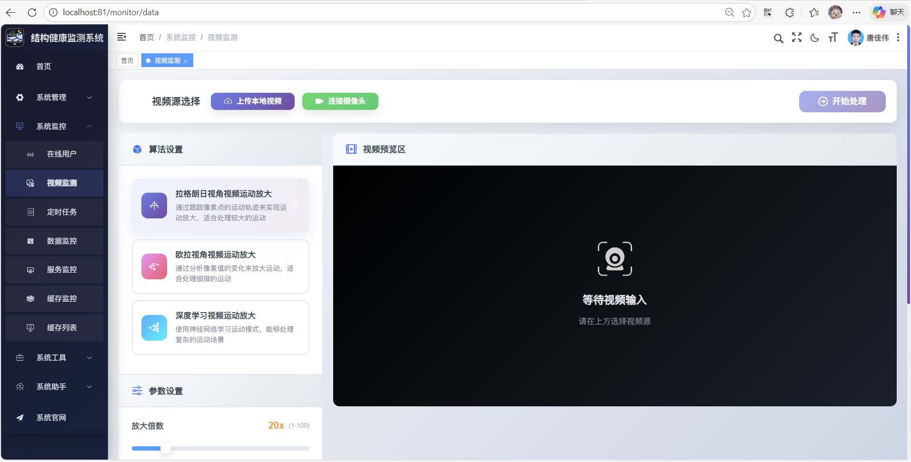

### 4.2 后端

#### 4.2.1 整体开发框架

```shell
E:\RuoYiProject\MoMagTracker-Compare\
├── tracker-admin/
│   └── src/main/java/tracker/web/controller/monitor/
│       └── VideoMonitorController.java     # 视频监控控制器
├── tracker-system/
│   └── src/main/java/tracker/system/service/
│       ├── IVideoProcessService.java       # 服务接口
│       └── impl/
│           └── VideoProcessServiceImpl.java # 服务实现
└── pom.xml                                  # Maven依赖配置
```

#### 4.2.1 控制器类

创建文件 `E:\RuoYiProject\MoMagTracker-Compare\tracker-admin\src\main\java\tracker\web\controller\monitor\VideoMonitorController.java`

```shell
package tracker.web.controller.monitor;

import org.springframework.web.bind.annotation.*;
import org.springframework.web.multipart.MultipartFile;
import tracker.common.core.controller.BaseController;
import tracker.common.core.domain.AjaxResult;
import tracker.common.core.domain.R;
import tracker.system.service.IVideoProcessService;
import io.swagger.annotations.Api;
import io.swagger.annotations.ApiOperation;
import org.slf4j.Logger;
import org.slf4j.LoggerFactory;

import javax.annotation.Resource;
import javax.servlet.http.HttpServletResponse;
import java.io.File;
import java.nio.file.Files;

@Api(tags = "视频监控处理接口")
@RestController
@RequestMapping("/video")
public class VideoMonitorController extends BaseController {

    private static final Logger log = LoggerFactory.getLogger(VideoMonitorController.class);

    @Resource
    private IVideoProcessService videoProcessService;

    @ApiOperation("处理视频")
    @PostMapping("/process")
    public R<Object> processVideo(
            @RequestParam("video") MultipartFile videoFile,
            @RequestParam("algorithm") String algorithm,
            @RequestParam("amplification") Double amplification,
            @RequestParam("upperThreshold") Double upperThreshold,
            @RequestParam("lowerThreshold") Double lowerThreshold) {

        try {
            String taskId = videoProcessService.processVideo(
                    videoFile,
                    algorithm,
                    amplification,
                    upperThreshold,
                    lowerThreshold
            );
            return R.ok(taskId);
        } catch (Exception e) {
            log.error("视频处理失败", e);
            return R.fail("视频处理失败：" + e.getMessage());
        }
    }

    @ApiOperation("获取处理进度")
    @GetMapping("/progress/{taskId}")
    public R<Object> getProgress(@PathVariable String taskId) {
        try {
            Double progress = videoProcessService.getProgress(taskId);
            return R.ok(progress);
        } catch (Exception e) {
            return R.fail("获取进度失败");
        }
    }

    @ApiOperation("开始实时处理")
    @PostMapping("/realtime/start")
    public R<Object> startRealtimeProcess(@RequestBody RealtimeParams params) {
        try {
            videoProcessService.startRealtimeProcess(
                    params.getAlgorithm(),
                    params.getAmplification(),
                    params.getUpperThreshold(),
                    params.getLowerThreshold()
            );
            return R.ok("实时处理已启动");
        } catch (Exception e) {
            return R.fail("启动失败：" + e.getMessage());
        }
    }

    @ApiOperation("停止实时处理")
    @PostMapping("/realtime/stop")
    public R<Object> stopRealtimeProcess() {
        try {
            videoProcessService.stopRealtimeProcess();
            return R.ok("实时处理已停止");
        } catch (Exception e) {
            return R.fail("停止失败：" + e.getMessage());
        }
    }

    @ApiOperation("下载处理结果")
    @GetMapping("/download/{taskId}")
    public void downloadResult(@PathVariable String taskId, HttpServletResponse response) {
        try {
            File resultFile = videoProcessService.getResultFile(taskId);
            response.setContentType("video/mp4");
            response.setHeader("Content-Disposition",
                    "attachment; filename=\"processed_video.mp4\"");
            Files.copy(resultFile.toPath(), response.getOutputStream());
        } catch (Exception e) {
            log.error("下载失败", e);
        }
    }

    public static class RealtimeParams {
        private String algorithm;
        private Double amplification;
        private Double upperThreshold;
        private Double lowerThreshold;

        // getters and setters
        public String getAlgorithm() { return algorithm; }
        public void setAlgorithm(String algorithm) { this.algorithm = algorithm; }
        public Double getAmplification() { return amplification; }
        public void setAmplification(Double amplification) { this.amplification = amplification; }
        public Double getUpperThreshold() { return upperThreshold; }
        public void setUpperThreshold(Double upperThreshold) { this.upperThreshold = upperThreshold; }
        public Double getLowerThreshold() { return lowerThreshold; }
        public void setLowerThreshold(Double lowerThreshold) { this.lowerThreshold = lowerThreshold; }
    }
}
```

#### 4.2.2 服务接口

创建文件 `E:\RuoYiProject\MoMagTracker-Compare\tracker-system\src\main\java\tracker\system\service\IVideoProcessService.java`

```shell
package tracker.system.service;

import org.springframework.web.multipart.MultipartFile;
import java.io.File;

public interface IVideoProcessService {

    /**
     * 处理视频文件
     */
    String processVideo(MultipartFile videoFile,
                        String algorithm,
                        Double amplification,
                        Double upperThreshold,
                        Double lowerThreshold) throws Exception;

    /**
     * 获取处理进度
     */
    Double getProgress(String taskId);

    /**
     * 开始实时处理
     */
    void startRealtimeProcess(String algorithm,
                              Double amplification,
                              Double upperThreshold,
                              Double lowerThreshold) throws Exception;

    /**
     * 停止实时处理
     */
    void stopRealtimeProcess();

    /**
     * 获取处理结果文件
     */
    File getResultFile(String taskId) throws Exception;
}
```

#### 4.2.3 服务实现类

创建文件 `E:\RuoYiProject\MoMagTracker-Compare\tracker-system\src\main\java\tracker\system\service\impl\VideoProcessServiceImpl.java`

```shell
package tracker.system.service.impl;

import org.springframework.stereotype.Service;
import org.springframework.web.multipart.MultipartFile;
import tracker.system.service.IVideoProcessService;
import org.slf4j.Logger;
import org.slf4j.LoggerFactory;

import javax.annotation.PostConstruct;
import java.io.File;
import java.io.FileNotFoundException;
import java.nio.file.Files;
import java.nio.file.Path;
import java.nio.file.Paths;
import java.util.UUID;
import java.util.concurrent.*;

@Service
public class VideoProcessServiceImpl implements IVideoProcessService {

    private static final Logger log = LoggerFactory.getLogger(VideoProcessServiceImpl.class);

    private final ExecutorService executorService = Executors.newFixedThreadPool(3);
    private final ConcurrentHashMap<String, Double> progressMap = new ConcurrentHashMap<>();
    private final String UPLOAD_DIR = "uploads/video/";
    private final String OUTPUT_DIR = "output/video/";

    @PostConstruct
    public void init() {
        try {
            new File(UPLOAD_DIR).mkdirs();
            new File(OUTPUT_DIR).mkdirs();
            log.info("视频处理服务初始化完成，上传目录：{}，输出目录：{}", UPLOAD_DIR, OUTPUT_DIR);
        } catch (Exception e) {
            log.error("初始化视频目录失败", e);
        }
    }

    @Override
    public String processVideo(MultipartFile videoFile,
                               String algorithm,
                               Double amplification,
                               Double upperThreshold,
                               Double lowerThreshold) throws Exception {

        String taskId = UUID.randomUUID().toString();
        String originalFilename = videoFile.getOriginalFilename();
        String extension = "";
        if (originalFilename != null && originalFilename.contains(".")) {
            extension = originalFilename.substring(originalFilename.lastIndexOf("."));
        }

        String inputPath = UPLOAD_DIR + taskId + extension;
        String outputPath = OUTPUT_DIR + taskId + "_processed.mp4";

        // 保存上传的文件
        Path uploadPath = Paths.get(inputPath);
        Files.copy(videoFile.getInputStream(), uploadPath);

        // 提交处理任务
        executorService.submit(() -> {
            try {
                processVideoTask(taskId, inputPath, outputPath, algorithm,
                        amplification, upperThreshold, lowerThreshold);
            } catch (Exception e) {
                log.error("视频处理任务失败", e);
                progressMap.put(taskId, -1.0);
            }
        });

        log.info("视频处理任务已提交，任务ID：{}，算法：{}，放大倍数：{}",
                taskId, algorithm, amplification);
        return taskId;
    }

    private void processVideoTask(String taskId, String inputPath, String outputPath,
                                  String algorithm, Double amplification,
                                  Double upperThreshold, Double lowerThreshold) throws Exception {

        // 模拟视频处理过程（实际项目中应集成OpenCV或其他视频处理库）
        progressMap.put(taskId, 0.0);

        // 模拟处理步骤
        for (int i = 0; i <= 100; i += 10) {
            Thread.sleep(1000); // 模拟处理时间
            progressMap.put(taskId, (double) i);

            // 根据算法处理
            switch (algorithm) {
                case "lagrangian":
                    // 模拟拉格朗日视角处理
                    log.debug("使用拉格朗日视角算法处理，放大倍数：{}", amplification);
                    break;
                case "eulerian":
                    // 模拟欧拉视角处理
                    log.debug("使用欧拉视角算法处理，阈值范围：[{}, {}]", lowerThreshold, upperThreshold);
                    break;
                case "deeplearning":
                    // 模拟深度学习处理
                    log.debug("使用深度学习算法处理");
                    break;
                default:
                    log.warn("未知算法：{}，使用默认处理", algorithm);
            }
        }

        // 模拟处理完成，创建输出文件
        File outputFile = new File(outputPath);
        if (!outputFile.exists()) {
            // 实际项目中这里应该是真实的处理结果
            // 这里我们复制输入文件作为示例
            Files.copy(Paths.get(inputPath), outputFile.toPath());
        }

        progressMap.put(taskId, 100.0);
        log.info("视频处理完成：{}", taskId);
    }

    private void processLagrangian(File inputFile, File outputFile,
                                   Double amplification, Double upperThreshold,
                                   Double lowerThreshold) {
        // TODO: 实现拉格朗日视角视频运动放大
        log.info("执行拉格朗日视角运动放大，放大倍数：{}", amplification);
    }

    private void processEulerian(File inputFile, File outputFile,
                                 Double amplification, Double upperThreshold,
                                 Double lowerThreshold) {
        // TODO: 实现欧拉视角视频运动放大
        log.info("执行欧拉视角运动放大，阈值范围：[{}, {}]", lowerThreshold, upperThreshold);
    }

    private void processDeepLearning(File inputFile, File outputFile,
                                     Double amplification, Double upperThreshold,
                                     Double lowerThreshold) {
        // TODO: 实现深度学习视频运动放大
        log.info("执行深度学习运动放大");
    }

    @Override
    public Double getProgress(String taskId) {
        return progressMap.getOrDefault(taskId, 0.0);
    }

    @Override
    public void startRealtimeProcess(String algorithm, Double amplification,
                                     Double upperThreshold, Double lowerThreshold) {
        log.info("开始实时视频处理，算法：{}，参数：[{}, {}, {}]",
                algorithm, amplification, lowerThreshold, upperThreshold);
        // TODO: 实现实时处理逻辑
    }

    @Override
    public void stopRealtimeProcess() {
        log.info("停止实时视频处理");
        // TODO: 实现停止实时处理逻辑
    }

    @Override
    public File getResultFile(String taskId) throws Exception {
        File resultFile = new File(OUTPUT_DIR + taskId + "_processed.mp4");
        if (!resultFile.exists()) {
            throw new FileNotFoundException("处理结果不存在：" + taskId);
        }
        return resultFile;
    }
}
```

#### 4.2.4 在 pom.xml 中添加依赖

在文件 `E:\RuoYiProject\MoMagTracker-Compare\pom.xml` 中添加代码

```shell
<!-- OpenCV 视频处理 -->
<dependency>
    <groupId>org.openpnp</groupId>
    <artifactId>opencv</artifactId>
    <version>4.5.5-1</version>
</dependency>

<!-- JavaCV -->
<dependency>
    <groupId>org.bytedeco</groupId>
    <artifactId>javacv-platform</artifactId>
    <version>1.5.7</version>
</dependency>

<!-- FFmpeg -->
<dependency>
    <groupId>org.bytedeco</groupId>
    <artifactId>ffmpeg-platform</artifactId>
    <version>4.4-1.5.7</version>
</dependency>
```

#### 4.2.5 添加数据库菜单记录

在 `MySQL` 数据库的 `sys_menu` 表中添加菜单记录：

```shell
-- 插入视频监测菜单
INSERT INTO sys_menu (
    menu_id, menu_name, parent_id, order_num, path, component, is_frame, 
    menu_type, visible, status, perms, icon, create_by, create_time, 
    update_by, update_time, remark
) VALUES (
    110, '视频监测', 2, 2, 'data', 'monitor/data/index', 1, 
    'C', '0', '0', 'monitor:data:list', 'monitor-data', 
    'admin', now(), 'admin', now(), '视频监测菜单'
);
```

### 4.3 修改默认视频上传文件大小配置

修改文件 `E:\RuoYiProject\MoMagTracker-Compare\tracker-admin\src\main\resources\application.yml`

```shell
# 视频处理配置
video:
  upload:
    max-size: 1024MB
    allowed-extensions: .mp4,.avi,.mov,.mkv,.flv
    
spring:
  servlet:
    multipart:
      max-file-size: 1024MB
      max-request-size: 1024MB
      enabled: true
```

### 4.4 推送至远程仓库

```shell
git status

git add .

git status

git commit -m "第五次提交，修改 README.md 文件和系统接口英文显示问题，开发视频监控模块，并融合多种视频运动放大算法，实现视频选择、视频处理前后对比结果视频基础版本"

git push -u origin master
```

- 结果

```shell
17354@LAPTOP-3CJQNHQH MINGW64 /e/RuoYiProject/MoMagTracker-System (master)
$ git status
On branch master
Your branch is up to date with 'origin/master'.

Changes not staged for commit:
  (use "git add/rm <file>..." to update what will be committed)
  (use "git restore <file>..." to discard changes in working directory)
        modified:   MoMagTracker-Vue/pom.xml
        modified:   MoMagTracker-Vue/tracker-admin/src/main/java/tracker/web/controller/system/SysLoginController.java
        modified:   MoMagTracker-Vue/tracker-admin/src/main/java/tracker/web/controller/tool/TestController.java
        modified:   MoMagTracker-Vue/tracker-admin/src/main/resources/application.yml
        deleted:    README.assets/image-20251218162854410.png
        deleted:    README.assets/image-20251218162920730.png
        deleted:    README.assets/image-20251218163808324.png
        modified:   README.md

Untracked files:
  (use "git add <file>..." to include in what will be committed)
        MoMagTracker-Vue/output/
        MoMagTracker-Vue/tracker-admin/src/main/java/tracker/web/controller/monitor/VideoMonitorController.java
        MoMagTracker-Vue/tracker-system/src/main/java/tracker/system/service/IVideoProcessService.java
        MoMagTracker-Vue/tracker-system/src/main/java/tracker/system/service/impl/VideoProcessServiceImpl.java
        MoMagTracker-Vue/uploads/
        MoMagTracker-Vue3/src/api/data/
        MoMagTracker-Vue3/src/assets/icons/svg/algorithm.svg
        MoMagTracker-Vue3/src/assets/icons/svg/camera-connect.svg
        MoMagTracker-Vue3/src/assets/icons/svg/camera-disconnect.svg
        MoMagTracker-Vue3/src/assets/icons/svg/camera-placeholder.svg
        MoMagTracker-Vue3/src/assets/icons/svg/camera-recording.svg
        MoMagTracker-Vue3/src/assets/icons/svg/camera.svg
        MoMagTracker-Vue3/src/assets/icons/svg/check.svg
        MoMagTracker-Vue3/src/assets/icons/svg/deeplearning-icon.svg
        MoMagTracker-Vue3/src/assets/icons/svg/download-white.svg
        MoMagTracker-Vue3/src/assets/icons/svg/eulerian-icon.svg
        MoMagTracker-Vue3/src/assets/icons/svg/file.svg
        MoMagTracker-Vue3/src/assets/icons/svg/lagrangian-icon.svg
        MoMagTracker-Vue3/src/assets/icons/svg/loading.svg
        MoMagTracker-Vue3/src/assets/icons/svg/monitor-data.svg
        MoMagTracker-Vue3/src/assets/icons/svg/parameter.svg
        MoMagTracker-Vue3/src/assets/icons/svg/progress.svg
        MoMagTracker-Vue3/src/assets/icons/svg/record-start.svg
        MoMagTracker-Vue3/src/assets/icons/svg/record-stop.svg
        MoMagTracker-Vue3/src/assets/icons/svg/result.svg
        MoMagTracker-Vue3/src/assets/icons/svg/screenshot.svg
        MoMagTracker-Vue3/src/assets/icons/svg/share.svg
        MoMagTracker-Vue3/src/assets/icons/svg/start-process.svg
        MoMagTracker-Vue3/src/assets/icons/svg/success.svg
        MoMagTracker-Vue3/src/assets/icons/svg/video-pause.svg
        MoMagTracker-Vue3/src/assets/icons/svg/video-play.svg
        MoMagTracker-Vue3/src/assets/icons/svg/video-preview.svg
        MoMagTracker-Vue3/src/assets/icons/svg/video-status.svg
        MoMagTracker-Vue3/src/views/monitor/data/
        README.assets/image-20251218164006419.png
        README.assets/image-20251218164028995.png
        README.assets/image-20251218164051178.png
        README.assets/image-20251223155431978.png
        README.assets/image-20251223155821546.png

no changes added to commit (use "git add" and/or "git commit -a")

17354@LAPTOP-3CJQNHQH MINGW64 /e/RuoYiProject/MoMagTracker-System (master)
$ git add .

17354@LAPTOP-3CJQNHQH MINGW64 /e/RuoYiProject/MoMagTracker-System (master)
$ git status
On branch master
Your branch is up to date with 'origin/master'.

Changes to be committed:
  (use "git restore --staged <file>..." to unstage)
        new file:   MoMagTracker-Vue/output/video/3b9d2430-1f6f-4fb1-aeb0-a4b5174aeede_processed.mp4
        new file:   MoMagTracker-Vue/output/video/4a5733af-057b-45de-910c-c659247f3363_processed.mp4
        new file:   MoMagTracker-Vue/output/video/77c4ce25-1f0c-4715-968d-3adc0d7e1095_processed.mp4
        new file:   MoMagTracker-Vue/output/video/91f37c75-3b3b-4b1d-9da3-b7f02608468c_processed.mp4
        new file:   MoMagTracker-Vue/output/video/d6e0e671-c29c-4df6-ba40-ba506049816d_processed.mp4
        modified:   MoMagTracker-Vue/pom.xml
        new file:   MoMagTracker-Vue/tracker-admin/src/main/java/tracker/web/controller/monitor/VideoMonitorController.java
        modified:   MoMagTracker-Vue/tracker-admin/src/main/java/tracker/web/controller/system/SysLoginController.java
        modified:   MoMagTracker-Vue/tracker-admin/src/main/java/tracker/web/controller/tool/TestController.java
        modified:   MoMagTracker-Vue/tracker-admin/src/main/resources/application.yml
        new file:   MoMagTracker-Vue/tracker-system/src/main/java/tracker/system/service/IVideoProcessService.java
        new file:   MoMagTracker-Vue/tracker-system/src/main/java/tracker/system/service/impl/VideoProcessServiceImpl.java
        new file:   MoMagTracker-Vue/uploads/video/3b9d2430-1f6f-4fb1-aeb0-a4b5174aeede.mp4
        new file:   MoMagTracker-Vue/uploads/video/4a5733af-057b-45de-910c-c659247f3363.mp4
        new file:   MoMagTracker-Vue/uploads/video/77c4ce25-1f0c-4715-968d-3adc0d7e1095.mp4
        new file:   MoMagTracker-Vue/uploads/video/91f37c75-3b3b-4b1d-9da3-b7f02608468c.mp4
        new file:   MoMagTracker-Vue/uploads/video/d6e0e671-c29c-4df6-ba40-ba506049816d.mp4
        new file:   MoMagTracker-Vue3/src/api/data/index.js
        new file:   MoMagTracker-Vue3/src/assets/icons/svg/algorithm.svg
        new file:   MoMagTracker-Vue3/src/assets/icons/svg/camera-connect.svg
        new file:   MoMagTracker-Vue3/src/assets/icons/svg/camera-disconnect.svg
        new file:   MoMagTracker-Vue3/src/assets/icons/svg/camera-placeholder.svg
        new file:   MoMagTracker-Vue3/src/assets/icons/svg/camera-recording.svg
        new file:   MoMagTracker-Vue3/src/assets/icons/svg/camera.svg
        new file:   MoMagTracker-Vue3/src/assets/icons/svg/check.svg
        new file:   MoMagTracker-Vue3/src/assets/icons/svg/deeplearning-icon.svg
        new file:   MoMagTracker-Vue3/src/assets/icons/svg/download-white.svg
        new file:   MoMagTracker-Vue3/src/assets/icons/svg/eulerian-icon.svg
        new file:   MoMagTracker-Vue3/src/assets/icons/svg/file.svg
        new file:   MoMagTracker-Vue3/src/assets/icons/svg/lagrangian-icon.svg
        new file:   MoMagTracker-Vue3/src/assets/icons/svg/loading.svg
        new file:   MoMagTracker-Vue3/src/assets/icons/svg/monitor-data.svg
        new file:   MoMagTracker-Vue3/src/assets/icons/svg/parameter.svg
        new file:   MoMagTracker-Vue3/src/assets/icons/svg/progress.svg
        new file:   MoMagTracker-Vue3/src/assets/icons/svg/record-start.svg
        new file:   MoMagTracker-Vue3/src/assets/icons/svg/record-stop.svg
        new file:   MoMagTracker-Vue3/src/assets/icons/svg/result.svg
        new file:   MoMagTracker-Vue3/src/assets/icons/svg/screenshot.svg
        new file:   MoMagTracker-Vue3/src/assets/icons/svg/share.svg
        new file:   MoMagTracker-Vue3/src/assets/icons/svg/start-process.svg
        new file:   MoMagTracker-Vue3/src/assets/icons/svg/success.svg
        new file:   MoMagTracker-Vue3/src/assets/icons/svg/video-pause.svg
        new file:   MoMagTracker-Vue3/src/assets/icons/svg/video-play.svg
        new file:   MoMagTracker-Vue3/src/assets/icons/svg/video-preview.svg
        new file:   MoMagTracker-Vue3/src/assets/icons/svg/video-status.svg
        new file:   MoMagTracker-Vue3/src/views/monitor/data/index.vue
        deleted:    README.assets/image-20251218162854410.png
        deleted:    README.assets/image-20251218162920730.png
        deleted:    README.assets/image-20251218163808324.png
        new file:   README.assets/image-20251218164006419.png
        new file:   README.assets/image-20251218164028995.png
        new file:   README.assets/image-20251218164051178.png
        new file:   README.assets/image-20251223155431978.png
        new file:   README.assets/image-20251223155821546.png
        modified:   README.md

17354@LAPTOP-3CJQNHQH MINGW64 /e/RuoYiProject/MoMagTracker-System (master)
$ git commit -m "第五次提交，修改 README.md 文件和系统接口英文显示问题，开发视频监控模块，并融合多种视频运动放大算法，实现视频选择、视频处理前后对比结果视频基础版本"
[master 8ae4b79] 第五次提交，修改 README.md 文件和系统接口英文显示问题，开发视频监控模块，并融合多种视频运动放大算法，实现视频选择、视频处理前后对比结果视频基础版本
 55 files changed, 4640 insertions(+), 49 deletions(-)
 create mode 100644 MoMagTracker-Vue/output/video/3b9d2430-1f6f-4fb1-aeb0-a4b5174aeede_processed.mp4
 create mode 100644 MoMagTracker-Vue/output/video/4a5733af-057b-45de-910c-c659247f3363_processed.mp4
 create mode 100644 MoMagTracker-Vue/output/video/77c4ce25-1f0c-4715-968d-3adc0d7e1095_processed.mp4
 create mode 100644 MoMagTracker-Vue/output/video/91f37c75-3b3b-4b1d-9da3-b7f02608468c_processed.mp4
 create mode 100644 MoMagTracker-Vue/output/video/d6e0e671-c29c-4df6-ba40-ba506049816d_processed.mp4
 create mode 100644 MoMagTracker-Vue/tracker-admin/src/main/java/tracker/web/controller/monitor/VideoMonitorController.java
 create mode 100644 MoMagTracker-Vue/tracker-system/src/main/java/tracker/system/service/IVideoProcessService.java
 create mode 100644 MoMagTracker-Vue/tracker-system/src/main/java/tracker/system/service/impl/VideoProcessServiceImpl.java
 create mode 100644 MoMagTracker-Vue/uploads/video/3b9d2430-1f6f-4fb1-aeb0-a4b5174aeede.mp4
 create mode 100644 MoMagTracker-Vue/uploads/video/4a5733af-057b-45de-910c-c659247f3363.mp4
 create mode 100644 MoMagTracker-Vue/uploads/video/77c4ce25-1f0c-4715-968d-3adc0d7e1095.mp4
 create mode 100644 MoMagTracker-Vue/uploads/video/91f37c75-3b3b-4b1d-9da3-b7f02608468c.mp4
 create mode 100644 MoMagTracker-Vue/uploads/video/d6e0e671-c29c-4df6-ba40-ba506049816d.mp4
 create mode 100644 MoMagTracker-Vue3/src/api/data/index.js
 create mode 100644 MoMagTracker-Vue3/src/assets/icons/svg/algorithm.svg
 create mode 100644 MoMagTracker-Vue3/src/assets/icons/svg/camera-connect.svg
 create mode 100644 MoMagTracker-Vue3/src/assets/icons/svg/camera-disconnect.svg
 create mode 100644 MoMagTracker-Vue3/src/assets/icons/svg/camera-placeholder.svg
 create mode 100644 MoMagTracker-Vue3/src/assets/icons/svg/camera-recording.svg
 create mode 100644 MoMagTracker-Vue3/src/assets/icons/svg/camera.svg
 create mode 100644 MoMagTracker-Vue3/src/assets/icons/svg/check.svg
 create mode 100644 MoMagTracker-Vue3/src/assets/icons/svg/deeplearning-icon.svg
 create mode 100644 MoMagTracker-Vue3/src/assets/icons/svg/download-white.svg
 create mode 100644 MoMagTracker-Vue3/src/assets/icons/svg/eulerian-icon.svg
 create mode 100644 MoMagTracker-Vue3/src/assets/icons/svg/file.svg
 create mode 100644 MoMagTracker-Vue3/src/assets/icons/svg/lagrangian-icon.svg
 create mode 100644 MoMagTracker-Vue3/src/assets/icons/svg/loading.svg
 create mode 100644 MoMagTracker-Vue3/src/assets/icons/svg/monitor-data.svg
 create mode 100644 MoMagTracker-Vue3/src/assets/icons/svg/parameter.svg
 create mode 100644 MoMagTracker-Vue3/src/assets/icons/svg/progress.svg
 create mode 100644 MoMagTracker-Vue3/src/assets/icons/svg/record-start.svg
 create mode 100644 MoMagTracker-Vue3/src/assets/icons/svg/record-stop.svg
 create mode 100644 MoMagTracker-Vue3/src/assets/icons/svg/result.svg
 create mode 100644 MoMagTracker-Vue3/src/assets/icons/svg/screenshot.svg
 create mode 100644 MoMagTracker-Vue3/src/assets/icons/svg/share.svg
 create mode 100644 MoMagTracker-Vue3/src/assets/icons/svg/start-process.svg
 create mode 100644 MoMagTracker-Vue3/src/assets/icons/svg/success.svg
 create mode 100644 MoMagTracker-Vue3/src/assets/icons/svg/video-pause.svg
 create mode 100644 MoMagTracker-Vue3/src/assets/icons/svg/video-play.svg
 create mode 100644 MoMagTracker-Vue3/src/assets/icons/svg/video-preview.svg
 create mode 100644 MoMagTracker-Vue3/src/assets/icons/svg/video-status.svg
 create mode 100644 MoMagTracker-Vue3/src/views/monitor/data/index.vue
 delete mode 100644 README.assets/image-20251218162854410.png
 delete mode 100644 README.assets/image-20251218162920730.png
 delete mode 100644 README.assets/image-20251218163808324.png
 create mode 100644 README.assets/image-20251218164006419.png
 create mode 100644 README.assets/image-20251218164028995.png
 create mode 100644 README.assets/image-20251218164051178.png
 create mode 100644 README.assets/image-20251223155431978.png
 create mode 100644 README.assets/image-20251223155821546.png

17354@LAPTOP-3CJQNHQH MINGW64 /e/RuoYiProject/MoMagTracker-System (master)
$ git push -u origin master
Enumerating objects: 111, done.
Counting objects: 100% (111/111), done.
Delta compression using up to 8 threads
Compressing objects: 100% (69/69), done.
Writing objects: 100% (80/80), 3.07 MiB | 1.39 MiB/s, done.
Total 80 (delta 22), reused 0 (delta 0), pack-reused 0 (from 0)
remote: Resolving deltas: 100% (22/22), completed with 19 local objects.
To 17354395073_github_account:Tang17354395073/MoMagTracker-System.git
   e2ae73e..8ae4b79  master -> master
branch 'master' set up to track 'origin/master'.
```

## 5 子系统功能开发（融合算法）

### 5.1 后端

#### 5.1.1 后端代码整体结构

```shell
E:\RuoYiProject\MoMagTracker-System\MoMagTracker-Vue\
├── tracker-admin/
│   └── src/main/java/tracker/web/controller/monitor/
│       └── VideoMonitorController.java     # 视频监控控制器
├── tracker-system/
│   └── src/main/java/tracker/system/
│       ├── config/
│       │   └── PythonScriptConfig.java     # Python脚本配置类
│       ├── service/
│       │   └── IVideoProcessService.java   # 服务接口
│       └── service/impl/
│           ├── VideoProcessServiceImpl.java # 服务实现类
│           └── PythonScriptExecutor.java   # Python脚本执行器
└── src/main/resources/
    └── application.yml                      # 配置文件
```

#### 5.1.2 控制器类（VideoMonitorController.java）

更新文件 `E:\RuoYiProject\MoMagTracker-System\MoMagTracker-Vue\tracker-admin\src\main\java\tracker\web\controller\monitor\VideoMonitorController.java`

```shell
package tracker.web.controller.monitor;

import org.springframework.web.bind.annotation.*;
import org.springframework.web.multipart.MultipartFile;
import tracker.common.annotation.Anonymous;
import tracker.common.core.controller.BaseController;
import tracker.common.core.domain.R;
import tracker.system.service.IVideoProcessService;
import io.swagger.annotations.Api;
import io.swagger.annotations.ApiOperation;
import io.swagger.annotations.ApiParam;
import org.slf4j.Logger;
import org.slf4j.LoggerFactory;

import javax.annotation.Resource;
import javax.servlet.http.HttpServletResponse;
import java.io.File;
import java.io.FileInputStream;
import java.io.OutputStream;

@Api(tags = "视频监控处理接口")
@RestController
@RequestMapping("/video")
public class VideoMonitorController extends BaseController {

    private static final Logger log = LoggerFactory.getLogger(VideoMonitorController.class);

    @Resource
    private IVideoProcessService videoProcessService;

    @ApiOperation("处理视频")
    @PostMapping("/process")
    public R<Object> processVideo(
            @ApiParam(value = "视频文件", required = true) @RequestParam("video") MultipartFile videoFile,
            @ApiParam(value = "算法类型", required = true) @RequestParam("algorithm") String algorithm,
            @ApiParam(value = "放大倍数", required = true) @RequestParam("amplification") Double amplification,
            @ApiParam(value = "时域滤波开关", required = true) @RequestParam("temporalFilter") Boolean temporalFilter,
            @ApiParam(value = "其他设置开关", required = true) @RequestParam("otherSettings") Boolean otherSettings,
            @ApiParam(value = "上限阈值", required = true) @RequestParam("upperThreshold") Double upperThreshold,
            @ApiParam(value = "下限阈值", required = true) @RequestParam("lowerThreshold") Double lowerThreshold,
            @ApiParam(value = "空间平滑参数", required = true) @RequestParam("spatialSigma") Double spatialSigma) {

        try {
            // 验证参数
            if (videoFile.isEmpty()) {
                return R.fail("请上传视频文件");
            }

            if (amplification < 1 || amplification > 100) {
                return R.fail("放大倍数必须在1-100之间");
            }

            if (upperThreshold < 0 || upperThreshold > 1) {
                return R.fail("上限阈值必须在0-1之间");
            }

            if (lowerThreshold < 0 || lowerThreshold > 0.1) {
                return R.fail("下限阈值必须在0-0.1之间");
            }

            if (spatialSigma < 0 || spatialSigma > 5) {
                return R.fail("空间平滑参数必须在0-5之间");
            }

            String taskId = videoProcessService.processVideo(
                    videoFile,
                    algorithm,
                    amplification,
                    temporalFilter,
                    otherSettings,
                    upperThreshold,
                    lowerThreshold,
                    spatialSigma
            );
            return R.ok(taskId);
        } catch (Exception e) {
            log.error("视频处理失败", e);
            return R.fail("视频处理失败：" + e.getMessage());
        }
    }

    @ApiOperation("获取处理进度")
    @GetMapping("/progress/{taskId}")
    public R<Object> getProgress(@ApiParam(value = "任务ID", required = true) @PathVariable String taskId) {
        try {
            Double progress = videoProcessService.getProgress(taskId);
            if (progress == -1.0) {
                return R.fail("任务处理失败");
            }
            return R.ok(progress);
        } catch (Exception e) {
            log.error("获取进度失败", e);
            return R.fail("获取进度失败：" + e.getMessage());
        }
    }

    @ApiOperation("开始实时处理")
    @PostMapping("/realtime/start")
    public R<Object> startRealtimeProcess(@RequestBody RealtimeParams params) {
        try {
            videoProcessService.startRealtimeProcess(
                    params.getAlgorithm(),
                    params.getAmplification(),
                    params.getTemporalFilter(),
                    params.getOtherSettings(),
                    params.getUpperThreshold(),
                    params.getLowerThreshold(),
                    params.getSpatialSigma()
            );
            return R.ok("实时处理已启动");
        } catch (Exception e) {
            log.error("启动实时处理失败", e);
            return R.fail("启动失败：" + e.getMessage());
        }
    }

    @ApiOperation("停止实时处理")
    @PostMapping("/realtime/stop")
    public R<Object> stopRealtimeProcess() {
        try {
            videoProcessService.stopRealtimeProcess();
            return R.ok("实时处理已停止");
        } catch (Exception e) {
            log.error("停止实时处理失败", e);
            return R.fail("停止失败：" + e.getMessage());
        }
    }

    @ApiOperation("下载处理结果")
    @GetMapping("/download/{taskId}")
    @Anonymous  // 添加此注解允许匿名访问
    public void downloadResult(@ApiParam(value = "任务ID", required = true) @PathVariable String taskId,
                               HttpServletResponse response) {
        try {
            File resultFile = videoProcessService.getResultFile(taskId);

            // 设置响应头
            response.setContentType("video/mp4");
            response.setHeader("Content-Disposition",
                    "attachment; filename=\"processed_video.mp4\"");
            response.setHeader("Content-Length", String.valueOf(resultFile.length()));

            // 写入响应流
            try (FileInputStream fis = new FileInputStream(resultFile);
                 OutputStream os = response.getOutputStream()) {

                byte[] buffer = new byte[1024];
                int bytesRead;
                while ((bytesRead = fis.read(buffer)) != -1) {
                    os.write(buffer, 0, bytesRead);
                }
                os.flush();
            }

            log.info("下载处理结果成功，任务ID: {}", taskId);
        } catch (Exception e) {
            log.error("下载失败", e);
            try {
                response.setContentType("application/json");
                response.setCharacterEncoding("UTF-8");
                response.getWriter().write("{\"code\":500,\"msg\":\"下载失败：" + e.getMessage() + "\"}");
            } catch (Exception ex) {
                log.error("写入错误响应失败", ex);
            }
        }
    }

    @ApiOperation("获取处理状态")
    @GetMapping("/status/{taskId}")
    public R<Object> getTaskStatus(@ApiParam(value = "任务ID", required = true) @PathVariable String taskId) {
        try {
            Double progress = videoProcessService.getProgress(taskId);

            String status;
            if (progress == null || progress == 0.0) {
                status = "PENDING";
            } else if (progress > 0 && progress < 100) {
                status = "PROCESSING";
            } else if (progress >= 100) {
                status = "COMPLETED";
            } else if (progress == -1.0) {
                status = "FAILED";
            } else {
                status = "UNKNOWN";
            }

            return R.ok(status);
        } catch (Exception e) {
            log.error("获取任务状态失败", e);
            return R.fail("获取状态失败：" + e.getMessage());
        }
    }

    public static class RealtimeParams {
        private String algorithm;
        private Double amplification;
        private Boolean temporalFilter;
        private Boolean otherSettings;
        private Double upperThreshold;
        private Double lowerThreshold;
        private Double spatialSigma;

        // getters and setters
        public String getAlgorithm() { return algorithm; }
        public void setAlgorithm(String algorithm) { this.algorithm = algorithm; }

        public Double getAmplification() { return amplification; }
        public void setAmplification(Double amplification) { this.amplification = amplification; }

        public Boolean getTemporalFilter() { return temporalFilter; }
        public void setTemporalFilter(Boolean temporalFilter) { this.temporalFilter = temporalFilter; }

        public Boolean getOtherSettings() { return otherSettings; }
        public void setOtherSettings(Boolean otherSettings) { this.otherSettings = otherSettings; }

        public Double getUpperThreshold() { return upperThreshold; }
        public void setUpperThreshold(Double upperThreshold) { this.upperThreshold = upperThreshold; }

        public Double getLowerThreshold() { return lowerThreshold; }
        public void setLowerThreshold(Double lowerThreshold) { this.lowerThreshold = lowerThreshold; }

        public Double getSpatialSigma() { return spatialSigma; }
        public void setSpatialSigma(Double spatialSigma) { this.spatialSigma = spatialSigma; }
    }
}
```

#### 5.1.3 服务接口类（IVideoProcessService.java）

修改文件 `E:\RuoYiProject\MoMagTracker-System\MoMagTracker-Vue\tracker-system\src\main\java\tracker\system\service\IVideoProcessService.java`

```shell
package tracker.system.service;

import org.springframework.web.multipart.MultipartFile;
import java.io.File;

public interface IVideoProcessService {

    /**
     * 处理视频文件
     */
    String processVideo(MultipartFile videoFile,
                        String algorithm,
                        Double amplification,
                        Boolean temporalFilter,
                        Boolean otherSettings,
                        Double upperThreshold,
                        Double lowerThreshold,
                        Double spatialSigma) throws Exception;

    /**
     * 获取处理进度
     */
    Double getProgress(String taskId);

    /**
     * 开始实时处理
     */
    void startRealtimeProcess(String algorithm,
                              Double amplification,
                              Boolean temporalFilter,
                              Boolean otherSettings,
                              Double upperThreshold,
                              Double lowerThreshold,
                              Double spatialSigma) throws Exception;

    /**
     * 停止实时处理
     */
    void stopRealtimeProcess();

    /**
     * 获取处理结果文件
     */
    File getResultFile(String taskId) throws Exception;
}
```

#### 5.1.4 服务实现类（VideoProcessServiceImpl.java）

修改文件 `E:\RuoYiProject\MoMagTracker-System\MoMagTracker-Vue\tracker-system\src\main\java\tracker\system\service\impl\VideoProcessServiceImpl.java`

```shell
package tracker.system.service.impl;

import org.springframework.stereotype.Service;
import org.springframework.web.multipart.MultipartFile;
import tracker.system.config.PythonScriptConfig;
import tracker.system.service.IVideoProcessService;
import org.slf4j.Logger;
import org.slf4j.LoggerFactory;
import org.springframework.beans.factory.annotation.Autowired;

import javax.annotation.PostConstruct;
import java.io.File;
import java.io.FileNotFoundException;
import java.nio.file.Files;
import java.nio.file.Path;
import java.nio.file.Paths;
import java.util.HashMap;
import java.util.Map;
import java.util.UUID;
import java.util.concurrent.*;

@Service
public class VideoProcessServiceImpl implements IVideoProcessService {

    private static final Logger log = LoggerFactory.getLogger(VideoProcessServiceImpl.class);

    private final ExecutorService executorService = Executors.newFixedThreadPool(3);
    private final ConcurrentHashMap<String, Double> progressMap = new ConcurrentHashMap<>();
    private final ConcurrentHashMap<String, String> taskStatusMap = new ConcurrentHashMap<>();
    private final String UPLOAD_DIR = "uploads/video/";
    private final String OUTPUT_DIR = "output/video/";

    @Autowired
    private PythonScriptConfig pythonConfig;

    @Autowired
    private PythonScriptExecutor pythonExecutor;

    @PostConstruct
    public void init() {
        try {
            new File(UPLOAD_DIR).mkdirs();
            new File(OUTPUT_DIR).mkdirs();
            log.info("视频处理服务初始化完成，上传目录：{}，输出目录：{}", UPLOAD_DIR, OUTPUT_DIR);

            // 检查Python环境
            if (pythonConfig.isEnabled()) {
                boolean pythonAvailable = pythonExecutor.checkPythonEnvironment();
                log.info("Python环境检查: {}", pythonAvailable ? "可用" : "不可用");

                if (!pythonAvailable) {
                    log.warn("Python环境不可用，部分功能可能无法正常工作");
                }
            } else {
                log.info("Python脚本功能已禁用");
            }

        } catch (Exception e) {
            log.error("初始化视频目录失败", e);
        }
    }

    @Override
    public String processVideo(MultipartFile videoFile,
                               String algorithm,
                               Double amplification,
                               Boolean temporalFilter,
                               Boolean otherSettings,
                               Double upperThreshold,
                               Double lowerThreshold,
                               Double spatialSigma) throws Exception {

        String taskId = UUID.randomUUID().toString();
        String originalFilename = videoFile.getOriginalFilename();
        String extension = "";
        if (originalFilename != null && originalFilename.contains(".")) {
            extension = originalFilename.substring(originalFilename.lastIndexOf("."));
        }

        String inputPath = UPLOAD_DIR + taskId + extension;
        String outputPath = OUTPUT_DIR + taskId + "_processed.mp4";

        // 保存上传的文件
        Path uploadPath = Paths.get(inputPath);
        Files.copy(videoFile.getInputStream(), uploadPath);

        // 提交处理任务
        executorService.submit(() -> {
            try {
                processVideoTask(taskId, inputPath, outputPath, algorithm,
                        amplification, temporalFilter, otherSettings,
                        upperThreshold, lowerThreshold, spatialSigma);
            } catch (Exception e) {
                log.error("视频处理任务失败", e);
                progressMap.put(taskId, -1.0);
                taskStatusMap.put(taskId, "FAILED");
            }
        });

        log.info("视频处理任务已提交，任务ID：{}，算法：{}，放大倍数：{}，时域滤波：{}",
                taskId, algorithm, amplification, temporalFilter);

        taskStatusMap.put(taskId, "PROCESSING");
        return taskId;
    }

    private void processVideoTask(String taskId, String inputPath, String outputPath,
                                  String algorithm, Double amplification,
                                  Boolean temporalFilter, Boolean otherSettings,
                                  Double upperThreshold, Double lowerThreshold,
                                  Double spatialSigma) {

        progressMap.put(taskId, 0.0);

        // 根据算法类型选择处理方式
        if (pythonConfig.hasScript(algorithm)) {
            // 使用Python脚本处理
            processWithPythonScript(taskId, algorithm, inputPath, outputPath,
                    amplification, temporalFilter,
                    upperThreshold, lowerThreshold, spatialSigma);
        } else {
            // 使用Java模拟处理
            processWithJavaSimulation(taskId, algorithm, amplification,
                    temporalFilter, otherSettings,
                    upperThreshold, lowerThreshold,
                    spatialSigma);
        }
    }

    private void processWithPythonScript(String taskId, String algorithm,
                                         String inputPath, String outputPath,
                                         Double amplification, Boolean temporalFilter,
                                         Double upperThreshold, Double lowerThreshold,
                                         Double spatialSigma) {
        try {
            log.info("开始Python脚本处理，任务ID: {}, 算法: {}, 输入: {}, 输出: {}",
                    taskId, algorithm, inputPath, outputPath);

            if (!pythonConfig.isEnabled()) {
                String errorMsg = "Python脚本功能未启用";
                log.error(errorMsg);
                progressMap.put(taskId, -1.0);
                taskStatusMap.put(taskId, "FAILED");
                return;
            }

            PythonScriptExecutor.ProgressCallback callback = new PythonScriptExecutor.ProgressCallback() {
                @Override
                public void onProgress(double progress) {
                    progressMap.put(taskId, progress);
                    log.debug("任务{}进度更新: {}%", taskId, progress);
                }

                @Override
                public void onStepStart(String stepName) {
                    log.info("任务{}步骤开始: {}", taskId, stepName);
                }

                @Override
                public void onStepComplete(String stepName) {
                    log.info("任务{}步骤完成: {}", taskId, stepName);
                }

                @Override
                public void onError(String error) {
                    log.error("任务{}处理错误: {}", taskId, error);
                    progressMap.put(taskId, -1.0);
                    taskStatusMap.put(taskId, "FAILED");
                }
            };

            // 构建参数映射
            Map<String, Object> parameters = new HashMap<>();
            parameters.put("alpha", amplification);
            parameters.put("temporal_filter", temporalFilter);
            parameters.put("lower_threshold", lowerThreshold);
            parameters.put("upper_threshold", upperThreshold);
            parameters.put("spatial_sigma", spatialSigma);

            // 调用Python脚本执行器
            PythonScriptExecutor.ProcessResult result = pythonExecutor.executePythonScript(
                    algorithm,
                    inputPath,
                    outputPath,
                    parameters,
                    callback
            );

            if (result.isSuccess()) {
                log.info("Python脚本处理完成，任务ID: {}, 算法: {}, 输出路径: {}",
                        taskId, algorithm, result.getOutputPath());
                progressMap.put(taskId, 100.0);
                taskStatusMap.put(taskId, "COMPLETED");
            } else {
                log.error("Python脚本处理失败，任务ID: {}, 算法: {}, 错误: {}",
                        taskId, algorithm, result.getError());
                progressMap.put(taskId, -1.0);
                taskStatusMap.put(taskId, "FAILED");
            }

        } catch (Exception e) {
            log.error("Python脚本处理异常，任务ID: {}, 算法: {}", taskId, algorithm, e);
            progressMap.put(taskId, -1.0);
            taskStatusMap.put(taskId, "FAILED");
        }
    }

    private void processWithJavaSimulation(String taskId, String algorithm,
                                           Double amplification, Boolean temporalFilter,
                                           Boolean otherSettings, Double upperThreshold,
                                           Double lowerThreshold, Double spatialSigma) {
        // Java模拟处理
        try {
            log.info("开始Java模拟处理，任务ID: {}, 算法: {}, 放大倍数: {}, 时域滤波: {}",
                    taskId, algorithm, amplification, temporalFilter);

            // 模拟处理步骤
            for (int i = 0; i <= 100; i += 10) {
                Thread.sleep(1000); // 模拟处理时间
                progressMap.put(taskId, (double) i);

                switch (algorithm) {
                    case "eulerian":
                        log.debug("使用欧拉视角算法处理，阈值范围：[{}, {}]", lowerThreshold, upperThreshold);
                        break;
                    case "deeplearning":
                        log.debug("使用深度学习算法处理，空间平滑: {}", spatialSigma);
                        break;
                    default:
                        log.warn("未知算法：{}，使用默认处理", algorithm);
                }
            }

            progressMap.put(taskId, 100.0);
            taskStatusMap.put(taskId, "COMPLETED");
            log.info("Java模拟处理完成：{}", taskId);

        } catch (Exception e) {
            log.error("Java处理任务失败", e);
            progressMap.put(taskId, -1.0);
            taskStatusMap.put(taskId, "FAILED");
        }
    }

    @Override
    public Double getProgress(String taskId) {
        Double progress = progressMap.get(taskId);
        if (progress == null) {
            return 0.0;
        }

        // 如果任务失败，返回-1
        if (progress == -1.0) {
            return -1.0;
        }

        return progress;
    }

    @Override
    public void startRealtimeProcess(String algorithm, Double amplification,
                                     Boolean temporalFilter, Boolean otherSettings,
                                     Double upperThreshold, Double lowerThreshold,
                                     Double spatialSigma) {
        log.info("开始实时视频处理，算法：{}，参数：[放大倍数={}, 时域滤波={}, 上下限阈值=[{}, {}], 空间平滑={}]",
                algorithm, amplification, temporalFilter, lowerThreshold, upperThreshold, spatialSigma);
        // TODO: 实现实时处理逻辑
    }

    @Override
    public void stopRealtimeProcess() {
        log.info("停止实时视频处理");
        // TODO: 实现停止实时处理逻辑
    }

    @Override
    public File getResultFile(String taskId) throws Exception {
        String outputPath = OUTPUT_DIR + taskId + "_processed.mp4";
        File resultFile = new File(outputPath);

        if (!resultFile.exists()) {
            // 尝试其他可能的扩展名
            String[] extensions = {".mp4", ".avi", ".mov", ".mkv"};
            for (String ext : extensions) {
                resultFile = new File(OUTPUT_DIR + taskId + "_processed" + ext);
                if (resultFile.exists()) {
                    break;
                }
            }
        }

        if (!resultFile.exists()) {
            throw new FileNotFoundException("处理结果不存在，任务ID: " + taskId);
        }

        return resultFile;
    }
}
```

#### 5.1.5 创建 Python 脚本配置类

创建文件 `E:\RuoYiProject\MoMagTracker-System\MoMagTracker-Vue\tracker-system\src\main\java\tracker\system\config\PythonScriptConfig.java`

```shell
package tracker.system.config;

import org.springframework.boot.context.properties.ConfigurationProperties;
import org.springframework.stereotype.Component;

import java.util.HashMap;
import java.util.Map;

@Component
@ConfigurationProperties(prefix = "python")
public class PythonScriptConfig {

    private String executable = "python3";
    private boolean enabled = true;
    private Map<String, String> scripts = new HashMap<>();

    // getters and setters
    public String getExecutable() {
        return executable;
    }

    public void setExecutable(String executable) {
        this.executable = executable;
    }

    public boolean isEnabled() {
        return enabled;
    }

    public void setEnabled(boolean enabled) {
        this.enabled = enabled;
    }

    public Map<String, String> getScripts() {
        return scripts;
    }

    public void setScripts(Map<String, String> scripts) {
        this.scripts = scripts;
    }

    /**
     * 根据算法名称获取脚本路径
     */
    public String getScriptPath(String algorithm) {
        return scripts.get(algorithm);
    }

    /**
     * 检查算法是否有对应的Python脚本
     */
    public boolean hasScript(String algorithm) {
        return scripts.containsKey(algorithm) && scripts.get(algorithm) != null && !scripts.get(algorithm).isEmpty();
    }
}
```

#### 5.1.5 创建 Python脚本执行器（PythonScriptExecutor.java）

创建文件 `E:\RuoYiProject\MoMagTracker-System\MoMagTracker-Vue\tracker-system\src\main\java\tracker\system\service\impl\PythonScriptExecutor.java`

```shell
package tracker.system.service.impl;

import org.slf4j.Logger;
import org.slf4j.LoggerFactory;
import org.springframework.beans.factory.annotation.Autowired;
import org.springframework.stereotype.Component;
import tracker.system.config.PythonScriptConfig;

import java.io.BufferedReader;
import java.io.File;
import java.io.IOException;
import java.io.InputStreamReader;
import java.util.*;
import java.util.concurrent.*;

@Component
public class PythonScriptExecutor {

    private static final Logger log = LoggerFactory.getLogger(PythonScriptExecutor.class);

    @Autowired
    private PythonScriptConfig pythonConfig;

    private final ExecutorService executorService = Executors.newCachedThreadPool();

    /**
     * 执行Python脚本
     */
    public ProcessResult executePythonScript(
            String algorithm,
            String inputVideoPath,
            String outputVideoPath,
            Map<String, Object> parameters,
            ProgressCallback callback) {

        ProcessResult result = new ProcessResult();

        try {
            // 检查算法是否有对应的Python脚本
            if (!pythonConfig.hasScript(algorithm)) {
                String errorMsg = String.format("算法 '%s' 没有对应的Python脚本配置", algorithm);
                log.error(errorMsg);
                result.setSuccess(false);
                result.setError(errorMsg);
                return result;
            }

            // 获取脚本路径
            String scriptPath = pythonConfig.getScriptPath(algorithm);
            File scriptFile = new File(scriptPath);
            if (!scriptFile.exists()) {
                String errorMsg = String.format("Python脚本不存在: %s", scriptPath);
                log.error(errorMsg);
                result.setSuccess(false);
                result.setError(errorMsg);
                return result;
            }

            // 构建Python命令
            String[] command = buildPythonCommand(
                    scriptPath,
                    inputVideoPath,
                    outputVideoPath,
                    parameters
            );

            log.info("执行Python脚本 - 算法: {}, 脚本: {}", algorithm, scriptPath);
            log.debug("Python命令: {}", String.join(" ", command));

            // 创建进程
            ProcessBuilder processBuilder = new ProcessBuilder(command);
            processBuilder.redirectErrorStream(true); // 合并标准错误和标准输出

            Process process = processBuilder.start();

            // 启动线程读取输出
            Future<?> outputReader = executorService.submit(() -> {
                try (BufferedReader reader = new BufferedReader(
                        new InputStreamReader(process.getInputStream(), "GBK"))) {

                    String line;
                    while ((line = reader.readLine()) != null) {
                        log.debug("Python输出: {}", line);
                        processOutput(line, result, callback);
                    }
                } catch (IOException e) {
                    log.error("读取Python输出时出错", e);
                }
            });

            // 等待进程完成
            int exitCode = process.waitFor();
            outputReader.get(); // 等待输出读取完成

            result.setExitCode(exitCode);

            // 处理结果
            handleProcessResult(result, outputVideoPath);

        } catch (Exception e) {
            log.error("执行Python脚本失败", e);
            result.setSuccess(false);
            result.setError("执行失败: " + e.getMessage());
        }

        return result;
    }

    private String[] buildPythonCommand(
            String scriptPath,
            String inputPath,
            String outputPath,
            Map<String, Object> parameters) {

        // 构建命令参数数组
        List<String> commandList = new ArrayList<>();
        commandList.add(pythonConfig.getExecutable());
        commandList.add(scriptPath);

        // 添加必需参数
        commandList.add("--input");
        commandList.add(inputPath);

        commandList.add("--output");
        commandList.add(outputPath);

        // 添加可选参数
        Object alpha = parameters.get("alpha");
        if (alpha != null) {
            commandList.add("--alpha");
            commandList.add(String.valueOf(alpha));
        }

        Object temporalFilter = parameters.get("temporal_filter");
        if (temporalFilter != null) {
            commandList.add("--temporal_filter");
            commandList.add(String.valueOf(temporalFilter));
        }

        Object lowerThreshold = parameters.get("lower_threshold");
        if (lowerThreshold != null) {
            commandList.add("--lower_threshold");
            commandList.add(String.valueOf(lowerThreshold));
        }

        Object upperThreshold = parameters.get("upper_threshold");
        if (upperThreshold != null) {
            commandList.add("--upper_threshold");
            commandList.add(String.valueOf(upperThreshold));
        }

        Object spatialSigma = parameters.get("spatial_sigma");
        if (spatialSigma != null) {
            commandList.add("--spatial_sigma");
            commandList.add(String.valueOf(spatialSigma));
        }

        return commandList.toArray(new String[0]);
    }

    private void processOutput(String line, ProcessResult result, ProgressCallback callback) {
        // 解析进度信息
        if (line.startsWith("PROGRESS:")) {
            String progressStr = line.substring(9).trim();
            try {
                double progress = Double.parseDouble(progressStr);
                if (callback != null) {
                    callback.onProgress(progress);
                }
            } catch (NumberFormatException e) {
                log.warn("无法解析进度: {}", progressStr);
            }
        }
        // 解析错误信息
        else if (line.startsWith("ERROR:")) {
            String error = line.substring(6).trim();
            result.setError(error);
            if (callback != null) {
                callback.onError(error);
            }
        }
        // 解析最终结果
        else if (line.startsWith("FINAL_RESULT:")) {
            String finalPath = line.substring(13).trim();
            result.setOutputPath(finalPath);
        }
        else if (line.startsWith("RESULT:")) {
            String finalPath = line.substring(7).trim();
            result.setOutputPath(finalPath);
        }
        else if (line.startsWith("PROGRESS_START:")) {
            String stepName = line.substring(15).trim();
            if (callback != null) {
                callback.onStepStart(stepName);
            }
        }
        else if (line.startsWith("PROGRESS_COMPLETE:")) {
            String stepName = line.substring(18).trim();
            if (callback != null) {
                callback.onStepComplete(stepName);
            }
        }
    }

    private void handleProcessResult(ProcessResult result, String expectedOutputPath) {
        if (result.getExitCode() == 0) {
            // 检查输出文件是否存在
            File outputFile = new File(expectedOutputPath);
            if (outputFile.exists() && outputFile.length() > 0) {
                result.setSuccess(true);
                log.info("Python脚本执行成功，输出文件: {}", expectedOutputPath);
            } else {
                result.setSuccess(false);
                String errorMsg = "输出文件未生成或为空";
                result.setError(errorMsg);
                log.error(errorMsg);
            }
        } else {
            result.setSuccess(false);
            if (result.getError() == null) {
                String errorMsg = "Python进程异常退出，退出码: " + result.getExitCode();
                result.setError(errorMsg);
            }
            log.error("Python脚本执行失败: {}", result.getError());
        }
    }

    /**
     * 检查Python环境是否可用
     */
    public boolean checkPythonEnvironment() {
        try {
            // 检查Python是否安装
            ProcessBuilder pb = new ProcessBuilder(pythonConfig.getExecutable(), "--version");
            Process process = pb.start();
            int exitCode = process.waitFor();

            if (exitCode != 0) {
                log.error("Python环境检查失败，退出码: {}", exitCode);
                return false;
            }

            // 检查脚本是否存在
            boolean allScriptsExist = true;
            for (Map.Entry<String, String> entry : pythonConfig.getScripts().entrySet()) {
                String algorithm = entry.getKey();
                String scriptPath = entry.getValue();

                if (scriptPath != null && !scriptPath.isEmpty()) {
                    File scriptFile = new File(scriptPath);
                    if (!scriptFile.exists()) {
                        log.warn("算法 {} 的Python脚本不存在: {}", algorithm, scriptPath);
                        allScriptsExist = false;
                    } else {
                        log.info("算法 {} 的Python脚本存在: {}", algorithm, scriptPath);
                    }
                }
            }

            // 检查依赖
            ProcessBuilder depPb = new ProcessBuilder(
                    pythonConfig.getExecutable(),
                    "-c",
                    "import cv2; import numpy; import scipy; print('Dependencies OK')"
            );
            Process depProcess = depPb.start();
            try (BufferedReader reader = new BufferedReader(
                    new InputStreamReader(depProcess.getInputStream()))) {
                String line = reader.readLine();
                log.info("Python依赖检查: {}", line);
            }
            int depExitCode = depProcess.waitFor();

            if (depExitCode != 0) {
                log.error("Python依赖检查失败，请确保已安装OpenCV, NumPy和SciPy");
                return false;
            }

            return allScriptsExist;

        } catch (Exception e) {
            log.error("检查Python环境失败", e);
            return false;
        }
    }

    /**
     * 获取算法列表
     */
    public Map<String, String> getAvailableAlgorithms() {
        return new HashMap<>(pythonConfig.getScripts());
    }

    // 进度回调接口
    public interface ProgressCallback {
        void onProgress(double progress);
        void onStepStart(String stepName);
        void onStepComplete(String stepName);
        void onError(String error);
    }

    // 处理结果类
    public static class ProcessResult {
        private boolean success;
        private String outputPath;
        private String error;
        private int exitCode;

        // getters and setters
        public boolean isSuccess() { return success; }
        public void setSuccess(boolean success) { this.success = success; }
        public String getOutputPath() { return outputPath; }
        public void setOutputPath(String outputPath) { this.outputPath = outputPath; }
        public String getError() { return error; }
        public void setError(String error) { this.error = error; }
        public int getExitCode() { return exitCode; }
        public void setExitCode(int exitCode) { this.exitCode = exitCode; }
    }
}
```

#### 5.1.5 配置文件（application.yml）

新增代码 `E:\RuoYiProject\MoMagTracker-System\MoMagTracker-Vue\tracker-admin\src\main\resources\application.yml`

```shell
# 项目相关配置
ruoyi:
  # 名称
  name: MoMagTracker
  # 版本
  version: 3.9.0
  # 版权年份
  copyrightYear: 2025
  # 文件路径
  profile: D:/MoMagTracker/uploadPath  # 建议改为项目相关路径
  # 获取ip地址开关
  addressEnabled: false
  # 验证码类型 math 数字计算 char 字符验证
  captchaType: math

# 开发环境配置
server:
  # 服务器的HTTP端口，默认为8080
  port: 8080
  servlet:
    # 应用的访问路径
    context-path: /
  tomcat:
    max-swallow-size: -1  # 不限制上传文件大小
    max-http-form-post-size: -1  # 不限制表单POST大小
    # tomcat的URI编码
    uri-encoding: UTF-8
    # 连接数满后的排队数，默认为100
    accept-count: 1000
    threads:
      # tomcat最大线程数，默认为200
      max: 800
      # Tomcat启动初始化的线程数，默认值10
      min-spare: 100

# 日志配置
logging:
  level:
    tracker: debug
    org.springframework: warn

# 用户配置
user:
  password:
    # 密码最大错误次数
    maxRetryCount: 5
    # 密码锁定时间（默认10分钟）
    lockTime: 10

# Dify配置
dify:
  api:
    url: http://8.141.94.106:21777  # Dify系统地址
    key: # 如果有API Key，填写在这里
  username: 15948660043@163.com    # Dify登录用户名
  password: tang2001 # Dify登录密码

# 视频处理配置
video:
  upload:
    max-size: 1024MB
    allowed-extensions: .mp4,.avi,.mov,.mkv,.flv

# Python脚本配置
python:
  executable: python3
  enabled: true
  # 算法脚本路径配置 - 现在可以灵活配置不同算法的脚本
  scripts:
    # 拉格朗日算法
    lagrangian: "E:/RuoYiProject/MoMagTracker-Compare/Lagrangian-based-Motion-Mag/Lagrangian-based-Motion-Magnification.py"
    # 欧拉算法
    eulerian: "E:/RuoYiProject/MoMagTracker-Compare/Eulerian-based-Motion-Mag/Eulerian-based-Motion-Magnification.py"
    # 深度学习算法
    deeplearning: "E:/RuoYiProject/MoMagTracker-Compare/Learning-based-Motion-Mag/Learning-based-Motion-Magnification.py"
    # 其他算法可以继续添加
    # example: "E:/RuoYiProject/MoMagTracker-Compare/Another-Algorithm/algorithm.py"

# Spring 配置
spring:
  # 邮件配置 - 新增网易邮箱配置
  mail:
    host: smtp.163.com  # 邮箱服务器
    port: 465           # SSL端口
    username: 15948660043@163.com  # 发件人邮箱
    password: LVxYK34uNZTgMfUM  # SMTP授权码
    default-encoding: UTF-8
    protocol: smtp
    properties:
      mail:
        smtp:
          auth: true
          starttls:
            enable: false  # 不使用 TLS
          ssl:
            enable: true   # 使用 SSL 加密
          connectiontimeout: 5000
          timeout: 5000
          writetimeout: 5000

  # 资源信息
  messages:
    # 国际化资源文件路径
    basename: i18n/messages
  profiles:
    active: druid
  # 文件上传
  servlet:
    multipart:
      # 单个文件大小
      max-file-size: 1024MB
      # 设置总上传的文件大小
      max-request-size: 1024MB
      enabled: true
  # 服务模块
  devtools:
    restart:
      # 热部署开关
      enabled: true
  # redis 配置
  redis:
    # 地址
    host: 127.0.0.1
    # 端口，默认为 6379
    port: 6379
    # 数据库索引
    database: 0
    # 密码
    password: Tang15948660043
    # 连接超时时间
    timeout: 10s
    lettuce:
      pool:
        # 连接池中的最小空闲连接
        min-idle: 0
        # 连接池中的最大空闲连接
        max-idle: 8
        # 连接池的最大数据库连接数
        max-active: 8
        # #连接池最大阻塞等待时间（使用负值表示没有限制）
        max-wait: -1ms

# 应用配置 - 新增
app:
  name: MoMagTracker

# token配置
token:
  # 令牌自定义标识
  header: Authorization
  # 令牌密钥
  secret: abcdefghijklmnopqrstuvwxyz
  # 令牌有效期（默认30分钟）
  expireTime: 30

# MyBatis配置
mybatis:
  # 搜索指定包别名
  typeAliasesPackage: tracker.**.domain
  # 配置mapper的扫描，找到所有的mapper.xml映射文件
  mapperLocations: classpath*:mapper/**/*Mapper.xml
  # 加载全局的配置文件
  configLocation: classpath:mybatis/mybatis-config.xml

# PageHelper分页插件
pagehelper:
  helperDialect: mysql
  supportMethodsArguments: true
  params: count=countSql

# Swagger配置
swagger:
  # 是否开启swagger
  enabled: true
  # 请求前缀
  pathMapping: /dev-api

# 防止XSS攻击
xss:
  # 过滤开关
  enabled: true
  # 排除链接（多个用逗号分隔）
  excludes: /system/notice
  # 匹配链接
  urlPatterns: /system/*,/monitor/*,/tool/*
```

- 结果

```shell
14:05:13.247 [http-nio-8080-exec-79] INFO  t.s.s.i.VideoProcessServiceImpl - [processVideo,100] - 视频处理任务已提交，任务ID：0ccb4306-9edf-4266-a874-8d454c6cd2d3，算法：lagrangian，放大倍数：20.0，时域滤波：false
14:05:13.248 [pool-3-thread-2] INFO  t.s.s.i.VideoProcessServiceImpl - [processWithPythonScript,136] - 开始Python脚本处理，任务ID: 0ccb4306-9edf-4266-a874-8d454c6cd2d3, 算法: lagrangian, 输入: uploads/video/0ccb4306-9edf-4266-a874-8d454c6cd2d3.mp4, 输出: output/video/0ccb4306-9edf-4266-a874-8d454c6cd2d3_processed.mp4
14:05:13.249 [pool-3-thread-2] INFO  t.s.s.i.PythonScriptExecutor - [executePythonScript,67] - 执行Python脚本 - 算法: lagrangian, 脚本: E:/RuoYiProject/MoMagTracker-Compare/Lagrangian-based-Motion-Mag/Lagrangian-based-Motion-Magnification.py
14:05:13.249 [pool-3-thread-2] DEBUG t.s.s.i.PythonScriptExecutor - [executePythonScript,68] - Python命令: E:/RuoYiProject/MoMagTracker-Compare/.venv/Scripts/python.exe E:/RuoYiProject/MoMagTracker-Compare/Lagrangian-based-Motion-Mag/Lagrangian-based-Motion-Magnification.py --input uploads/video/0ccb4306-9edf-4266-a874-8d454c6cd2d3.mp4 --output output/video/0ccb4306-9edf-4266-a874-8d454c6cd2d3_processed.mp4 --alpha 20.0 --temporal_filter false --lower_threshold 0.03 --upper_threshold 0.5 --spatial_sigma 3.0
14:05:17.472 [pool-4-thread-2] DEBUG t.s.s.i.PythonScriptExecutor - [lambda$executePythonScript$0,83] - Python输出: PROGRESS_START:初始化
14:05:17.472 [pool-4-thread-2] INFO  t.s.s.i.VideoProcessServiceImpl - [onStepStart,156] - 任务0ccb4306-9edf-4266-a874-8d454c6cd2d3步骤开始: 初始化
14:05:17.473 [pool-4-thread-2] DEBUG t.s.s.i.PythonScriptExecutor - [lambda$executePythonScript$0,83] - Python输出: ======================================================================
14:05:17.473 [pool-4-thread-2] DEBUG t.s.s.i.PythonScriptExecutor - [lambda$executePythonScript$0,83] - Python输出: 基于拉格朗日视角的视频运动放大方法
14:05:17.473 [pool-4-thread-2] DEBUG t.s.s.i.PythonScriptExecutor - [lambda$executePythonScript$0,83] - Python输出: ======================================================================
14:05:17.473 [pool-4-thread-2] DEBUG t.s.s.i.PythonScriptExecutor - [lambda$executePythonScript$0,83] - Python输出: 输入视频: uploads/video/0ccb4306-9edf-4266-a874-8d454c6cd2d3.mp4
14:05:17.473 [pool-4-thread-2] DEBUG t.s.s.i.PythonScriptExecutor - [lambda$executePythonScript$0,83] - Python输出: 输出视频: output/video/0ccb4306-9edf-4266-a874-8d454c6cd2d3_processed.mp4
14:05:17.473 [pool-4-thread-2] DEBUG t.s.s.i.PythonScriptExecutor - [lambda$executePythonScript$0,83] - Python输出: 放大因子: 20.0
14:05:17.473 [pool-4-thread-2] DEBUG t.s.s.i.PythonScriptExecutor - [lambda$executePythonScript$0,83] - Python输出: 时域滤波: 关闭
14:05:17.475 [pool-4-thread-2] DEBUG t.s.s.i.PythonScriptExecutor - [lambda$executePythonScript$0,83] - Python输出: PROGRESS:3.0
14:05:17.475 [pool-4-thread-2] DEBUG t.s.s.i.VideoProcessServiceImpl - [onProgress,151] - 任务0ccb4306-9edf-4266-a874-8d454c6cd2d3进度更新: 3.0%
14:05:17.475 [pool-4-thread-2] DEBUG t.s.s.i.PythonScriptExecutor - [lambda$executePythonScript$0,83] - Python输出: PROGRESS:3.0
14:05:17.475 [pool-4-thread-2] DEBUG t.s.s.i.VideoProcessServiceImpl - [onProgress,151] - 任务0ccb4306-9edf-4266-a874-8d454c6cd2d3进度更新: 3.0%
14:05:17.475 [pool-4-thread-2] DEBUG t.s.s.i.PythonScriptExecutor - [lambda$executePythonScript$0,83] - Python输出: PROGRESS_COMPLETE:初始化
14:05:17.475 [pool-4-thread-2] INFO  t.s.s.i.VideoProcessServiceImpl - [onStepComplete,161] - 任务0ccb4306-9edf-4266-a874-8d454c6cd2d3步骤完成: 初始化
14:05:17.476 [pool-4-thread-2] DEBUG t.s.s.i.PythonScriptExecutor - [lambda$executePythonScript$0,83] - Python输出: PROGRESS_START:读取视频
14:05:17.476 [pool-4-thread-2] INFO  t.s.s.i.VideoProcessServiceImpl - [onStepStart,156] - 任务0ccb4306-9edf-4266-a874-8d454c6cd2d3步骤开始: 读取视频
14:05:18.991 [pool-4-thread-2] DEBUG t.s.s.i.PythonScriptExecutor - [lambda$executePythonScript$0,83] - Python输出: 
14:05:18.993 [pool-4-thread-2] DEBUG t.s.s.i.PythonScriptExecutor - [lambda$executePythonScript$0,83] - Python输出: [步骤1] 读取视频并预处理...
14:05:18.993 [pool-4-thread-2] DEBUG t.s.s.i.PythonScriptExecutor - [lambda$executePythonScript$0,83] - Python输出:   开始读取视频，帧率: 30, 分辨率: 960x544
14:05:18.993 [pool-4-thread-2] DEBUG t.s.s.i.PythonScriptExecutor - [lambda$executePythonScript$0,83] - Python输出:   已读取 100 帧
14:05:18.993 [pool-4-thread-2] DEBUG t.s.s.i.PythonScriptExecutor - [lambda$executePythonScript$0,83] - Python输出:   已读取 200 帧
14:05:18.993 [pool-4-thread-2] DEBUG t.s.s.i.PythonScriptExecutor - [lambda$executePythonScript$0,83] - Python输出:   已读取 300 帧
14:05:18.993 [pool-4-thread-2] DEBUG t.s.s.i.PythonScriptExecutor - [lambda$executePythonScript$0,83] - Python输出:   读取完成，共 301 帧
14:05:18.993 [pool-4-thread-2] DEBUG t.s.s.i.PythonScriptExecutor - [lambda$executePythonScript$0,83] - Python输出:   视频信息: 960x544, 30 FPS, 处理帧数: 301
14:05:18.993 [pool-4-thread-2] DEBUG t.s.s.i.PythonScriptExecutor - [lambda$executePythonScript$0,83] - Python输出: PROGRESS:10.0
14:05:18.993 [pool-4-thread-2] DEBUG t.s.s.i.VideoProcessServiceImpl - [onProgress,151] - 任务0ccb4306-9edf-4266-a874-8d454c6cd2d3进度更新: 10.0%
14:05:18.994 [pool-4-thread-2] DEBUG t.s.s.i.PythonScriptExecutor - [lambda$executePythonScript$0,83] - Python输出: PROGRESS:10.0
14:05:18.994 [pool-4-thread-2] DEBUG t.s.s.i.VideoProcessServiceImpl - [onProgress,151] - 任务0ccb4306-9edf-4266-a874-8d454c6cd2d3进度更新: 10.0%
14:05:18.994 [pool-4-thread-2] DEBUG t.s.s.i.PythonScriptExecutor - [lambda$executePythonScript$0,83] - Python输出: PROGRESS_COMPLETE:读取视频
14:05:18.994 [pool-4-thread-2] INFO  t.s.s.i.VideoProcessServiceImpl - [onStepComplete,161] - 任务0ccb4306-9edf-4266-a874-8d454c6cd2d3步骤完成: 读取视频
14:05:18.994 [pool-4-thread-2] DEBUG t.s.s.i.PythonScriptExecutor - [lambda$executePythonScript$0,83] - Python输出: PROGRESS_START:特征点检测与跟踪
14:05:18.994 [pool-4-thread-2] INFO  t.s.s.i.VideoProcessServiceImpl - [onStepStart,156] - 任务0ccb4306-9edf-4266-a874-8d454c6cd2d3步骤开始: 特征点检测与跟踪
14:05:20.019 [pool-4-thread-2] DEBUG t.s.s.i.PythonScriptExecutor - [lambda$executePythonScript$0,83] - Python输出: 
14:05:20.019 [pool-4-thread-2] DEBUG t.s.s.i.PythonScriptExecutor - [lambda$executePythonScript$0,83] - Python输出: [步骤2] 特征点检测与轨迹跟踪...
14:05:20.019 [pool-4-thread-2] DEBUG t.s.s.i.PythonScriptExecutor - [lambda$executePythonScript$0,83] - Python输出:   开始特征点跟踪...
14:05:20.019 [pool-4-thread-2] DEBUG t.s.s.i.PythonScriptExecutor - [lambda$executePythonScript$0,83] - Python输出:   已转换 0/301 帧到灰度图
14:05:20.019 [pool-4-thread-2] DEBUG t.s.s.i.PythonScriptExecutor - [lambda$executePythonScript$0,83] - Python输出:   已转换 100/301 帧到灰度图
14:05:20.019 [pool-4-thread-2] DEBUG t.s.s.i.PythonScriptExecutor - [lambda$executePythonScript$0,83] - Python输出:   已转换 200/301 帧到灰度图
14:05:20.019 [pool-4-thread-2] DEBUG t.s.s.i.PythonScriptExecutor - [lambda$executePythonScript$0,83] - Python输出:   已转换 300/301 帧到灰度图
14:05:20.019 [pool-4-thread-2] DEBUG t.s.s.i.PythonScriptExecutor - [lambda$executePythonScript$0,83] - Python输出:   检测第一帧特征点...
14:05:20.019 [pool-4-thread-2] DEBUG t.s.s.i.PythonScriptExecutor - [lambda$executePythonScript$0,83] - Python输出:   初始化 1000 条轨迹
14:05:20.020 [pool-4-thread-2] DEBUG t.s.s.i.PythonScriptExecutor - [lambda$executePythonScript$0,83] - Python输出: PROGRESS:11.7
14:05:20.020 [pool-4-thread-2] DEBUG t.s.s.i.VideoProcessServiceImpl - [onProgress,151] - 任务0ccb4306-9edf-4266-a874-8d454c6cd2d3进度更新: 11.7%
14:05:20.346 [pool-4-thread-2] DEBUG t.s.s.i.PythonScriptExecutor - [lambda$executePythonScript$0,83] - Python输出:   已跟踪 20/300 帧，活跃轨迹: 1000
14:05:20.346 [pool-4-thread-2] DEBUG t.s.s.i.PythonScriptExecutor - [lambda$executePythonScript$0,83] - Python输出: PROGRESS:13.3
14:05:20.346 [pool-4-thread-2] DEBUG t.s.s.i.VideoProcessServiceImpl - [onProgress,151] - 任务0ccb4306-9edf-4266-a874-8d454c6cd2d3进度更新: 13.3%
14:05:20.755 [pool-4-thread-2] DEBUG t.s.s.i.PythonScriptExecutor - [lambda$executePythonScript$0,83] - Python输出:   已跟踪 40/300 帧，活跃轨迹: 1000
14:05:20.756 [pool-4-thread-2] DEBUG t.s.s.i.PythonScriptExecutor - [lambda$executePythonScript$0,83] - Python输出: PROGRESS:15.0
14:05:20.756 [pool-4-thread-2] DEBUG t.s.s.i.VideoProcessServiceImpl - [onProgress,151] - 任务0ccb4306-9edf-4266-a874-8d454c6cd2d3进度更新: 15.0%
14:05:21.020 [pool-4-thread-2] DEBUG t.s.s.i.PythonScriptExecutor - [lambda$executePythonScript$0,83] - Python输出:   已跟踪 60/300 帧，活跃轨迹: 1000
14:05:21.020 [pool-4-thread-2] DEBUG t.s.s.i.PythonScriptExecutor - [lambda$executePythonScript$0,83] - Python输出: PROGRESS:16.7
14:05:21.020 [pool-4-thread-2] DEBUG t.s.s.i.VideoProcessServiceImpl - [onProgress,151] - 任务0ccb4306-9edf-4266-a874-8d454c6cd2d3进度更新: 16.7%
14:05:21.256 [pool-4-thread-2] DEBUG t.s.s.i.PythonScriptExecutor - [lambda$executePythonScript$0,83] - Python输出:   已跟踪 80/300 帧，活跃轨迹: 1000
14:05:21.257 [pool-4-thread-2] DEBUG t.s.s.i.PythonScriptExecutor - [lambda$executePythonScript$0,83] - Python输出: PROGRESS:18.3
14:05:21.257 [pool-4-thread-2] DEBUG t.s.s.i.VideoProcessServiceImpl - [onProgress,151] - 任务0ccb4306-9edf-4266-a874-8d454c6cd2d3进度更新: 18.3%
14:05:21.554 [pool-4-thread-2] DEBUG t.s.s.i.PythonScriptExecutor - [lambda$executePythonScript$0,83] - Python输出:   已跟踪 100/300 帧，活跃轨迹: 1000
14:05:21.554 [pool-4-thread-2] DEBUG t.s.s.i.PythonScriptExecutor - [lambda$executePythonScript$0,83] - Python输出: PROGRESS:20.0
14:05:21.554 [pool-4-thread-2] DEBUG t.s.s.i.VideoProcessServiceImpl - [onProgress,151] - 任务0ccb4306-9edf-4266-a874-8d454c6cd2d3进度更新: 20.0%
14:05:21.847 [pool-4-thread-2] DEBUG t.s.s.i.PythonScriptExecutor - [lambda$executePythonScript$0,83] - Python输出:   已跟踪 120/300 帧，活跃轨迹: 1000
14:05:21.847 [pool-4-thread-2] DEBUG t.s.s.i.PythonScriptExecutor - [lambda$executePythonScript$0,83] - Python输出: PROGRESS:21.7
14:05:21.847 [pool-4-thread-2] DEBUG t.s.s.i.VideoProcessServiceImpl - [onProgress,151] - 任务0ccb4306-9edf-4266-a874-8d454c6cd2d3进度更新: 21.7%
14:05:22.073 [pool-4-thread-2] DEBUG t.s.s.i.PythonScriptExecutor - [lambda$executePythonScript$0,83] - Python输出:   已跟踪 140/300 帧，活跃轨迹: 1000
14:05:22.073 [pool-4-thread-2] DEBUG t.s.s.i.PythonScriptExecutor - [lambda$executePythonScript$0,83] - Python输出: PROGRESS:23.3
14:05:22.073 [pool-4-thread-2] DEBUG t.s.s.i.VideoProcessServiceImpl - [onProgress,151] - 任务0ccb4306-9edf-4266-a874-8d454c6cd2d3进度更新: 23.3%
14:05:22.331 [pool-4-thread-2] DEBUG t.s.s.i.PythonScriptExecutor - [lambda$executePythonScript$0,83] - Python输出:   已跟踪 160/300 帧，活跃轨迹: 1000
14:05:22.331 [pool-4-thread-2] DEBUG t.s.s.i.PythonScriptExecutor - [lambda$executePythonScript$0,83] - Python输出: PROGRESS:25.0
14:05:22.331 [pool-4-thread-2] DEBUG t.s.s.i.VideoProcessServiceImpl - [onProgress,151] - 任务0ccb4306-9edf-4266-a874-8d454c6cd2d3进度更新: 25.0%
14:05:22.572 [pool-4-thread-2] DEBUG t.s.s.i.PythonScriptExecutor - [lambda$executePythonScript$0,83] - Python输出:   已跟踪 180/300 帧，活跃轨迹: 999
14:05:22.572 [pool-4-thread-2] DEBUG t.s.s.i.PythonScriptExecutor - [lambda$executePythonScript$0,83] - Python输出: PROGRESS:26.7
14:05:22.572 [pool-4-thread-2] DEBUG t.s.s.i.VideoProcessServiceImpl - [onProgress,151] - 任务0ccb4306-9edf-4266-a874-8d454c6cd2d3进度更新: 26.7%
14:05:22.842 [pool-4-thread-2] DEBUG t.s.s.i.PythonScriptExecutor - [lambda$executePythonScript$0,83] - Python输出:   已跟踪 200/300 帧，活跃轨迹: 999
14:05:22.842 [pool-4-thread-2] DEBUG t.s.s.i.PythonScriptExecutor - [lambda$executePythonScript$0,83] - Python输出: PROGRESS:28.3
14:05:22.842 [pool-4-thread-2] DEBUG t.s.s.i.VideoProcessServiceImpl - [onProgress,151] - 任务0ccb4306-9edf-4266-a874-8d454c6cd2d3进度更新: 28.3%
14:05:23.101 [pool-4-thread-2] DEBUG t.s.s.i.PythonScriptExecutor - [lambda$executePythonScript$0,83] - Python输出:   已跟踪 220/300 帧，活跃轨迹: 999
14:05:23.101 [pool-4-thread-2] DEBUG t.s.s.i.PythonScriptExecutor - [lambda$executePythonScript$0,83] - Python输出: PROGRESS:30.0
14:05:23.101 [pool-4-thread-2] DEBUG t.s.s.i.VideoProcessServiceImpl - [onProgress,151] - 任务0ccb4306-9edf-4266-a874-8d454c6cd2d3进度更新: 30.0%
14:05:23.442 [pool-4-thread-2] DEBUG t.s.s.i.PythonScriptExecutor - [lambda$executePythonScript$0,83] - Python输出:   已跟踪 240/300 帧，活跃轨迹: 998
14:05:23.442 [pool-4-thread-2] DEBUG t.s.s.i.PythonScriptExecutor - [lambda$executePythonScript$0,83] - Python输出: PROGRESS:31.7
14:05:23.442 [pool-4-thread-2] DEBUG t.s.s.i.VideoProcessServiceImpl - [onProgress,151] - 任务0ccb4306-9edf-4266-a874-8d454c6cd2d3进度更新: 31.7%
14:05:23.727 [pool-4-thread-2] DEBUG t.s.s.i.PythonScriptExecutor - [lambda$executePythonScript$0,83] - Python输出:   已跟踪 260/300 帧，活跃轨迹: 998
14:05:23.727 [pool-4-thread-2] DEBUG t.s.s.i.PythonScriptExecutor - [lambda$executePythonScript$0,83] - Python输出: PROGRESS:33.3
14:05:23.727 [pool-4-thread-2] DEBUG t.s.s.i.VideoProcessServiceImpl - [onProgress,151] - 任务0ccb4306-9edf-4266-a874-8d454c6cd2d3进度更新: 33.3%
14:05:23.972 [pool-4-thread-2] DEBUG t.s.s.i.PythonScriptExecutor - [lambda$executePythonScript$0,83] - Python输出:   已跟踪 280/300 帧，活跃轨迹: 998
14:05:23.972 [pool-4-thread-2] DEBUG t.s.s.i.PythonScriptExecutor - [lambda$executePythonScript$0,83] - Python输出: PROGRESS:35.0
14:05:23.972 [pool-4-thread-2] DEBUG t.s.s.i.VideoProcessServiceImpl - [onProgress,151] - 任务0ccb4306-9edf-4266-a874-8d454c6cd2d3进度更新: 35.0%
14:05:24.084 [pool-4-thread-2] DEBUG t.s.s.i.PythonScriptExecutor - [lambda$executePythonScript$0,83] - Python输出:   已跟踪 300/300 帧，活跃轨迹: 998
14:05:24.084 [pool-4-thread-2] DEBUG t.s.s.i.PythonScriptExecutor - [lambda$executePythonScript$0,83] - Python输出:   后处理轨迹...
14:05:24.084 [pool-4-thread-2] DEBUG t.s.s.i.PythonScriptExecutor - [lambda$executePythonScript$0,83] - Python输出:   有效轨迹: 1000 条
14:05:24.084 [pool-4-thread-2] DEBUG t.s.s.i.PythonScriptExecutor - [lambda$executePythonScript$0,83] - Python输出:   成功提取 1000 条轨迹，轨迹长度: 301 帧
14:05:24.084 [pool-4-thread-2] DEBUG t.s.s.i.PythonScriptExecutor - [lambda$executePythonScript$0,83] - Python输出: PROGRESS:35.0
14:05:24.084 [pool-4-thread-2] DEBUG t.s.s.i.VideoProcessServiceImpl - [onProgress,151] - 任务0ccb4306-9edf-4266-a874-8d454c6cd2d3进度更新: 35.0%
14:05:24.084 [pool-4-thread-2] DEBUG t.s.s.i.PythonScriptExecutor - [lambda$executePythonScript$0,83] - Python输出: PROGRESS:35.0
14:05:24.084 [pool-4-thread-2] DEBUG t.s.s.i.VideoProcessServiceImpl - [onProgress,151] - 任务0ccb4306-9edf-4266-a874-8d454c6cd2d3进度更新: 35.0%
14:05:24.084 [pool-4-thread-2] DEBUG t.s.s.i.PythonScriptExecutor - [lambda$executePythonScript$0,83] - Python输出: PROGRESS_COMPLETE:特征点检测与跟踪
14:05:24.085 [pool-4-thread-2] INFO  t.s.s.i.VideoProcessServiceImpl - [onStepComplete,161] - 任务0ccb4306-9edf-4266-a874-8d454c6cd2d3步骤完成: 特征点检测与跟踪
14:05:24.085 [pool-4-thread-2] DEBUG t.s.s.i.PythonScriptExecutor - [lambda$executePythonScript$0,83] - Python输出: PROGRESS_START:计算轨迹运动
14:05:24.085 [pool-4-thread-2] INFO  t.s.s.i.VideoProcessServiceImpl - [onStepStart,156] - 任务0ccb4306-9edf-4266-a874-8d454c6cd2d3步骤开始: 计算轨迹运动
14:05:24.220 [pool-4-thread-2] DEBUG t.s.s.i.PythonScriptExecutor - [lambda$executePythonScript$0,83] - Python输出: 
14:05:24.220 [pool-4-thread-2] DEBUG t.s.s.i.PythonScriptExecutor - [lambda$executePythonScript$0,83] - Python输出: [步骤3] 计算轨迹运动...
14:05:24.220 [pool-4-thread-2] DEBUG t.s.s.i.PythonScriptExecutor - [lambda$executePythonScript$0,83] - Python输出:   计算轨迹运动...
14:05:24.220 [pool-4-thread-2] DEBUG t.s.s.i.PythonScriptExecutor - [lambda$executePythonScript$0,83] - Python输出:   已计算 0/1000 条轨迹的运动
14:05:24.220 [pool-4-thread-2] DEBUG t.s.s.i.PythonScriptExecutor - [lambda$executePythonScript$0,83] - Python输出:   已计算 100/1000 条轨迹的运动
14:05:24.220 [pool-4-thread-2] DEBUG t.s.s.i.PythonScriptExecutor - [lambda$executePythonScript$0,83] - Python输出:   已计算 200/1000 条轨迹的运动
14:05:24.220 [pool-4-thread-2] DEBUG t.s.s.i.PythonScriptExecutor - [lambda$executePythonScript$0,83] - Python输出:   已计算 300/1000 条轨迹的运动
14:05:24.220 [pool-4-thread-2] DEBUG t.s.s.i.PythonScriptExecutor - [lambda$executePythonScript$0,83] - Python输出:   已计算 400/1000 条轨迹的运动
14:05:24.220 [pool-4-thread-2] DEBUG t.s.s.i.PythonScriptExecutor - [lambda$executePythonScript$0,83] - Python输出:   已计算 500/1000 条轨迹的运动
14:05:24.220 [pool-4-thread-2] DEBUG t.s.s.i.PythonScriptExecutor - [lambda$executePythonScript$0,83] - Python输出:   已计算 600/1000 条轨迹的运动
14:05:24.220 [pool-4-thread-2] DEBUG t.s.s.i.PythonScriptExecutor - [lambda$executePythonScript$0,83] - Python输出:   已计算 700/1000 条轨迹的运动
14:05:24.220 [pool-4-thread-2] DEBUG t.s.s.i.PythonScriptExecutor - [lambda$executePythonScript$0,83] - Python输出:   已计算 800/1000 条轨迹的运动
14:05:24.220 [pool-4-thread-2] DEBUG t.s.s.i.PythonScriptExecutor - [lambda$executePythonScript$0,83] - Python输出:   已计算 900/1000 条轨迹的运动
14:05:24.220 [pool-4-thread-2] DEBUG t.s.s.i.PythonScriptExecutor - [lambda$executePythonScript$0,83] - Python输出: PROGRESS:45.0
14:05:24.220 [pool-4-thread-2] DEBUG t.s.s.i.VideoProcessServiceImpl - [onProgress,151] - 任务0ccb4306-9edf-4266-a874-8d454c6cd2d3进度更新: 45.0%
14:05:24.220 [pool-4-thread-2] DEBUG t.s.s.i.PythonScriptExecutor - [lambda$executePythonScript$0,83] - Python输出: PROGRESS:45.0
14:05:24.222 [pool-4-thread-2] DEBUG t.s.s.i.VideoProcessServiceImpl - [onProgress,151] - 任务0ccb4306-9edf-4266-a874-8d454c6cd2d3进度更新: 45.0%
14:05:24.222 [pool-4-thread-2] DEBUG t.s.s.i.PythonScriptExecutor - [lambda$executePythonScript$0,83] - Python输出: PROGRESS_COMPLETE:计算轨迹运动
14:05:24.222 [pool-4-thread-2] INFO  t.s.s.i.VideoProcessServiceImpl - [onStepComplete,161] - 任务0ccb4306-9edf-4266-a874-8d454c6cd2d3步骤完成: 计算轨迹运动
14:05:24.222 [pool-4-thread-2] DEBUG t.s.s.i.PythonScriptExecutor - [lambda$executePythonScript$0,83] - Python输出: PROGRESS_START:时域带通滤波
14:05:24.222 [pool-4-thread-2] INFO  t.s.s.i.VideoProcessServiceImpl - [onStepStart,156] - 任务0ccb4306-9edf-4266-a874-8d454c6cd2d3步骤开始: 时域带通滤波
14:05:24.222 [pool-4-thread-2] DEBUG t.s.s.i.PythonScriptExecutor - [lambda$executePythonScript$0,83] - Python输出: PROGRESS:55.0
14:05:24.222 [pool-4-thread-2] DEBUG t.s.s.i.VideoProcessServiceImpl - [onProgress,151] - 任务0ccb4306-9edf-4266-a874-8d454c6cd2d3进度更新: 55.0%
14:05:24.222 [pool-4-thread-2] DEBUG t.s.s.i.PythonScriptExecutor - [lambda$executePythonScript$0,83] - Python输出: PROGRESS:55.0
14:05:24.222 [pool-4-thread-2] DEBUG t.s.s.i.VideoProcessServiceImpl - [onProgress,151] - 任务0ccb4306-9edf-4266-a874-8d454c6cd2d3进度更新: 55.0%
14:05:24.222 [pool-4-thread-2] DEBUG t.s.s.i.PythonScriptExecutor - [lambda$executePythonScript$0,83] - Python输出: PROGRESS_COMPLETE:时域带通滤波
14:05:24.222 [pool-4-thread-2] INFO  t.s.s.i.VideoProcessServiceImpl - [onStepComplete,161] - 任务0ccb4306-9edf-4266-a874-8d454c6cd2d3步骤完成: 时域带通滤波
14:05:24.222 [pool-4-thread-2] DEBUG t.s.s.i.PythonScriptExecutor - [lambda$executePythonScript$0,83] - Python输出: 
14:05:24.223 [pool-4-thread-2] DEBUG t.s.s.i.PythonScriptExecutor - [lambda$executePythonScript$0,83] - Python输出: [步骤4] 时域带通滤波...
14:05:24.223 [pool-4-thread-2] DEBUG t.s.s.i.PythonScriptExecutor - [lambda$executePythonScript$0,83] - Python输出:   未使用时域滤波，跳过此步骤
14:05:24.223 [pool-4-thread-2] DEBUG t.s.s.i.PythonScriptExecutor - [lambda$executePythonScript$0,83] - Python输出: PROGRESS_START:计算稠密运动场
14:05:24.223 [pool-4-thread-2] INFO  t.s.s.i.VideoProcessServiceImpl - [onStepStart,156] - 任务0ccb4306-9edf-4266-a874-8d454c6cd2d3步骤开始: 计算稠密运动场
14:05:24.574 [pool-4-thread-2] DEBUG t.s.s.i.PythonScriptExecutor - [lambda$executePythonScript$0,83] - Python输出: 
14:05:24.574 [pool-4-thread-2] DEBUG t.s.s.i.PythonScriptExecutor - [lambda$executePythonScript$0,83] - Python输出: [步骤5] 计算稠密运动场...
14:05:24.574 [pool-4-thread-2] DEBUG t.s.s.i.PythonScriptExecutor - [lambda$executePythonScript$0,83] - Python输出:   计算稠密运动场...
14:05:24.574 [pool-4-thread-2] DEBUG t.s.s.i.PythonScriptExecutor - [lambda$executePythonScript$0,83] - Python输出: PROGRESS:55.0
14:05:24.574 [pool-4-thread-2] DEBUG t.s.s.i.VideoProcessServiceImpl - [onProgress,151] - 任务0ccb4306-9edf-4266-a874-8d454c6cd2d3进度更新: 55.0%
14:05:29.147 [pool-4-thread-2] DEBUG t.s.s.i.PythonScriptExecutor - [lambda$executePythonScript$0,83] - Python输出:   已计算 0/300 帧的运动场
14:05:29.149 [pool-4-thread-2] DEBUG t.s.s.i.PythonScriptExecutor - [lambda$executePythonScript$0,83] - Python输出: PROGRESS:56.3
14:05:29.149 [pool-4-thread-2] DEBUG t.s.s.i.VideoProcessServiceImpl - [onProgress,151] - 任务0ccb4306-9edf-4266-a874-8d454c6cd2d3进度更新: 56.3%
14:05:33.672 [pool-4-thread-2] DEBUG t.s.s.i.PythonScriptExecutor - [lambda$executePythonScript$0,83] - Python输出:   已计算 20/300 帧的运动场
14:05:33.672 [pool-4-thread-2] DEBUG t.s.s.i.PythonScriptExecutor - [lambda$executePythonScript$0,83] - Python输出: PROGRESS:57.7
14:05:33.672 [pool-4-thread-2] DEBUG t.s.s.i.VideoProcessServiceImpl - [onProgress,151] - 任务0ccb4306-9edf-4266-a874-8d454c6cd2d3进度更新: 57.7%
14:05:38.747 [pool-4-thread-2] DEBUG t.s.s.i.PythonScriptExecutor - [lambda$executePythonScript$0,83] - Python输出:   已计算 40/300 帧的运动场
14:05:38.747 [pool-4-thread-2] DEBUG t.s.s.i.PythonScriptExecutor - [lambda$executePythonScript$0,83] - Python输出: PROGRESS:59.0
14:05:38.747 [pool-4-thread-2] DEBUG t.s.s.i.VideoProcessServiceImpl - [onProgress,151] - 任务0ccb4306-9edf-4266-a874-8d454c6cd2d3进度更新: 59.0%
14:05:45.189 [pool-4-thread-2] DEBUG t.s.s.i.PythonScriptExecutor - [lambda$executePythonScript$0,83] - Python输出:   已计算 60/300 帧的运动场
14:05:45.189 [pool-4-thread-2] DEBUG t.s.s.i.PythonScriptExecutor - [lambda$executePythonScript$0,83] - Python输出: PROGRESS:60.3
14:05:45.189 [pool-4-thread-2] DEBUG t.s.s.i.VideoProcessServiceImpl - [onProgress,151] - 任务0ccb4306-9edf-4266-a874-8d454c6cd2d3进度更新: 60.3%
14:05:51.329 [pool-4-thread-2] DEBUG t.s.s.i.PythonScriptExecutor - [lambda$executePythonScript$0,83] - Python输出:   已计算 80/300 帧的运动场
14:05:51.329 [pool-4-thread-2] DEBUG t.s.s.i.PythonScriptExecutor - [lambda$executePythonScript$0,83] - Python输出: PROGRESS:61.7
14:05:51.329 [pool-4-thread-2] DEBUG t.s.s.i.VideoProcessServiceImpl - [onProgress,151] - 任务0ccb4306-9edf-4266-a874-8d454c6cd2d3进度更新: 61.7%
14:06:09.652 [pool-4-thread-2] DEBUG t.s.s.i.PythonScriptExecutor - [lambda$executePythonScript$0,83] - Python输出:   已计算 100/300 帧的运动场
14:06:09.652 [pool-4-thread-2] DEBUG t.s.s.i.PythonScriptExecutor - [lambda$executePythonScript$0,83] - Python输出: PROGRESS:63.0
14:06:09.652 [pool-4-thread-2] DEBUG t.s.s.i.VideoProcessServiceImpl - [onProgress,151] - 任务0ccb4306-9edf-4266-a874-8d454c6cd2d3进度更新: 63.0%
14:06:18.516 [pool-4-thread-2] DEBUG t.s.s.i.PythonScriptExecutor - [lambda$executePythonScript$0,83] - Python输出:   已计算 120/300 帧的运动场
14:06:18.516 [pool-4-thread-2] DEBUG t.s.s.i.PythonScriptExecutor - [lambda$executePythonScript$0,83] - Python输出: PROGRESS:64.3
14:06:18.516 [pool-4-thread-2] DEBUG t.s.s.i.VideoProcessServiceImpl - [onProgress,151] - 任务0ccb4306-9edf-4266-a874-8d454c6cd2d3进度更新: 64.3%
14:06:24.577 [pool-4-thread-2] DEBUG t.s.s.i.PythonScriptExecutor - [lambda$executePythonScript$0,83] - Python输出:   已计算 140/300 帧的运动场
14:06:24.577 [pool-4-thread-2] DEBUG t.s.s.i.PythonScriptExecutor - [lambda$executePythonScript$0,83] - Python输出: PROGRESS:65.7
14:06:24.577 [pool-4-thread-2] DEBUG t.s.s.i.VideoProcessServiceImpl - [onProgress,151] - 任务0ccb4306-9edf-4266-a874-8d454c6cd2d3进度更新: 65.7%
14:06:30.055 [pool-4-thread-2] DEBUG t.s.s.i.PythonScriptExecutor - [lambda$executePythonScript$0,83] - Python输出:   已计算 160/300 帧的运动场
14:06:30.055 [pool-4-thread-2] DEBUG t.s.s.i.PythonScriptExecutor - [lambda$executePythonScript$0,83] - Python输出: PROGRESS:67.0
14:06:30.055 [pool-4-thread-2] DEBUG t.s.s.i.VideoProcessServiceImpl - [onProgress,151] - 任务0ccb4306-9edf-4266-a874-8d454c6cd2d3进度更新: 67.0%
14:06:35.966 [pool-4-thread-2] DEBUG t.s.s.i.PythonScriptExecutor - [lambda$executePythonScript$0,83] - Python输出:   已计算 180/300 帧的运动场
14:06:35.966 [pool-4-thread-2] DEBUG t.s.s.i.PythonScriptExecutor - [lambda$executePythonScript$0,83] - Python输出: PROGRESS:68.3
14:06:35.966 [pool-4-thread-2] DEBUG t.s.s.i.VideoProcessServiceImpl - [onProgress,151] - 任务0ccb4306-9edf-4266-a874-8d454c6cd2d3进度更新: 68.3%
14:06:41.362 [pool-4-thread-2] DEBUG t.s.s.i.PythonScriptExecutor - [lambda$executePythonScript$0,83] - Python输出:   已计算 200/300 帧的运动场
14:06:41.362 [pool-4-thread-2] DEBUG t.s.s.i.PythonScriptExecutor - [lambda$executePythonScript$0,83] - Python输出: PROGRESS:69.7
14:06:41.362 [pool-4-thread-2] DEBUG t.s.s.i.VideoProcessServiceImpl - [onProgress,151] - 任务0ccb4306-9edf-4266-a874-8d454c6cd2d3进度更新: 69.7%
14:06:47.111 [pool-4-thread-2] DEBUG t.s.s.i.PythonScriptExecutor - [lambda$executePythonScript$0,83] - Python输出:   已计算 220/300 帧的运动场
14:06:47.111 [pool-4-thread-2] DEBUG t.s.s.i.PythonScriptExecutor - [lambda$executePythonScript$0,83] - Python输出: PROGRESS:71.0
14:06:47.111 [pool-4-thread-2] DEBUG t.s.s.i.VideoProcessServiceImpl - [onProgress,151] - 任务0ccb4306-9edf-4266-a874-8d454c6cd2d3进度更新: 71.0%
14:06:52.786 [pool-4-thread-2] DEBUG t.s.s.i.PythonScriptExecutor - [lambda$executePythonScript$0,83] - Python输出:   已计算 240/300 帧的运动场
14:06:52.787 [pool-4-thread-2] DEBUG t.s.s.i.PythonScriptExecutor - [lambda$executePythonScript$0,83] - Python输出: PROGRESS:72.3
14:06:52.787 [pool-4-thread-2] DEBUG t.s.s.i.VideoProcessServiceImpl - [onProgress,151] - 任务0ccb4306-9edf-4266-a874-8d454c6cd2d3进度更新: 72.3%
14:06:58.195 [pool-4-thread-2] DEBUG t.s.s.i.PythonScriptExecutor - [lambda$executePythonScript$0,83] - Python输出:   已计算 260/300 帧的运动场
14:06:58.195 [pool-4-thread-2] DEBUG t.s.s.i.PythonScriptExecutor - [lambda$executePythonScript$0,83] - Python输出: PROGRESS:73.7
14:06:58.195 [pool-4-thread-2] DEBUG t.s.s.i.VideoProcessServiceImpl - [onProgress,151] - 任务0ccb4306-9edf-4266-a874-8d454c6cd2d3进度更新: 73.7%
14:07:03.585 [pool-4-thread-2] DEBUG t.s.s.i.PythonScriptExecutor - [lambda$executePythonScript$0,83] - Python输出:   已计算 280/300 帧的运动场
14:07:03.585 [pool-4-thread-2] DEBUG t.s.s.i.PythonScriptExecutor - [lambda$executePythonScript$0,83] - Python输出: PROGRESS:75.0
14:07:03.587 [pool-4-thread-2] DEBUG t.s.s.i.VideoProcessServiceImpl - [onProgress,151] - 任务0ccb4306-9edf-4266-a874-8d454c6cd2d3进度更新: 75.0%
14:07:03.587 [pool-4-thread-2] DEBUG t.s.s.i.PythonScriptExecutor - [lambda$executePythonScript$0,83] - Python输出:   已计算 300/300 帧的运动场
14:07:03.587 [pool-4-thread-2] DEBUG t.s.s.i.PythonScriptExecutor - [lambda$executePythonScript$0,83] - Python输出: PROGRESS:75.0
14:07:03.587 [pool-4-thread-2] DEBUG t.s.s.i.VideoProcessServiceImpl - [onProgress,151] - 任务0ccb4306-9edf-4266-a874-8d454c6cd2d3进度更新: 75.0%
14:07:03.587 [pool-4-thread-2] DEBUG t.s.s.i.PythonScriptExecutor - [lambda$executePythonScript$0,83] - Python输出: PROGRESS:75.0
14:07:03.587 [pool-4-thread-2] DEBUG t.s.s.i.VideoProcessServiceImpl - [onProgress,151] - 任务0ccb4306-9edf-4266-a874-8d454c6cd2d3进度更新: 75.0%
14:07:03.587 [pool-4-thread-2] DEBUG t.s.s.i.PythonScriptExecutor - [lambda$executePythonScript$0,83] - Python输出: PROGRESS_COMPLETE:计算稠密运动场
14:07:03.588 [pool-4-thread-2] INFO  t.s.s.i.VideoProcessServiceImpl - [onStepComplete,161] - 任务0ccb4306-9edf-4266-a874-8d454c6cd2d3步骤完成: 计算稠密运动场
14:07:03.588 [pool-4-thread-2] DEBUG t.s.s.i.PythonScriptExecutor - [lambda$executePythonScript$0,83] - Python输出: PROGRESS_START:运动放大
14:07:03.588 [pool-4-thread-2] INFO  t.s.s.i.VideoProcessServiceImpl - [onStepStart,156] - 任务0ccb4306-9edf-4266-a874-8d454c6cd2d3步骤开始: 运动放大
14:07:04.013 [pool-4-thread-2] DEBUG t.s.s.i.PythonScriptExecutor - [lambda$executePythonScript$0,83] - Python输出: 
14:07:04.014 [pool-4-thread-2] DEBUG t.s.s.i.PythonScriptExecutor - [lambda$executePythonScript$0,83] - Python输出: [步骤6] 运动放大...
14:07:04.014 [pool-4-thread-2] DEBUG t.s.s.i.PythonScriptExecutor - [lambda$executePythonScript$0,83] - Python输出:   应用运动放大...
14:07:04.014 [pool-4-thread-2] DEBUG t.s.s.i.PythonScriptExecutor - [lambda$executePythonScript$0,83] - Python输出: PROGRESS:76.0
14:07:04.014 [pool-4-thread-2] DEBUG t.s.s.i.VideoProcessServiceImpl - [onProgress,151] - 任务0ccb4306-9edf-4266-a874-8d454c6cd2d3进度更新: 76.0%
14:07:04.451 [pool-4-thread-2] DEBUG t.s.s.i.PythonScriptExecutor - [lambda$executePythonScript$0,83] - Python输出:   已放大 20/300 帧
14:07:04.451 [pool-4-thread-2] DEBUG t.s.s.i.PythonScriptExecutor - [lambda$executePythonScript$0,83] - Python输出: PROGRESS:77.0
14:07:04.451 [pool-4-thread-2] DEBUG t.s.s.i.VideoProcessServiceImpl - [onProgress,151] - 任务0ccb4306-9edf-4266-a874-8d454c6cd2d3进度更新: 77.0%
14:07:04.915 [pool-4-thread-2] DEBUG t.s.s.i.PythonScriptExecutor - [lambda$executePythonScript$0,83] - Python输出:   已放大 40/300 帧
14:07:04.915 [pool-4-thread-2] DEBUG t.s.s.i.PythonScriptExecutor - [lambda$executePythonScript$0,83] - Python输出: PROGRESS:78.0
14:07:04.915 [pool-4-thread-2] DEBUG t.s.s.i.VideoProcessServiceImpl - [onProgress,151] - 任务0ccb4306-9edf-4266-a874-8d454c6cd2d3进度更新: 78.0%
14:07:05.328 [pool-4-thread-2] DEBUG t.s.s.i.PythonScriptExecutor - [lambda$executePythonScript$0,83] - Python输出:   已放大 60/300 帧
14:07:05.328 [pool-4-thread-2] DEBUG t.s.s.i.PythonScriptExecutor - [lambda$executePythonScript$0,83] - Python输出: PROGRESS:79.0
14:07:05.328 [pool-4-thread-2] DEBUG t.s.s.i.VideoProcessServiceImpl - [onProgress,151] - 任务0ccb4306-9edf-4266-a874-8d454c6cd2d3进度更新: 79.0%
14:07:05.798 [pool-4-thread-2] DEBUG t.s.s.i.PythonScriptExecutor - [lambda$executePythonScript$0,83] - Python输出:   已放大 80/300 帧
14:07:05.798 [pool-4-thread-2] DEBUG t.s.s.i.PythonScriptExecutor - [lambda$executePythonScript$0,83] - Python输出: PROGRESS:80.0
14:07:05.798 [pool-4-thread-2] DEBUG t.s.s.i.VideoProcessServiceImpl - [onProgress,151] - 任务0ccb4306-9edf-4266-a874-8d454c6cd2d3进度更新: 80.0%
14:07:06.272 [pool-4-thread-2] DEBUG t.s.s.i.PythonScriptExecutor - [lambda$executePythonScript$0,83] - Python输出:   已放大 100/300 帧
14:07:06.272 [pool-4-thread-2] DEBUG t.s.s.i.PythonScriptExecutor - [lambda$executePythonScript$0,83] - Python输出: PROGRESS:81.0
14:07:06.273 [pool-4-thread-2] DEBUG t.s.s.i.VideoProcessServiceImpl - [onProgress,151] - 任务0ccb4306-9edf-4266-a874-8d454c6cd2d3进度更新: 81.0%
14:07:06.721 [pool-4-thread-2] DEBUG t.s.s.i.PythonScriptExecutor - [lambda$executePythonScript$0,83] - Python输出:   已放大 120/300 帧
14:07:06.721 [pool-4-thread-2] DEBUG t.s.s.i.PythonScriptExecutor - [lambda$executePythonScript$0,83] - Python输出: PROGRESS:82.0
14:07:06.721 [pool-4-thread-2] DEBUG t.s.s.i.VideoProcessServiceImpl - [onProgress,151] - 任务0ccb4306-9edf-4266-a874-8d454c6cd2d3进度更新: 82.0%
14:07:07.203 [pool-4-thread-2] DEBUG t.s.s.i.PythonScriptExecutor - [lambda$executePythonScript$0,83] - Python输出:   已放大 140/300 帧
14:07:07.203 [pool-4-thread-2] DEBUG t.s.s.i.PythonScriptExecutor - [lambda$executePythonScript$0,83] - Python输出: PROGRESS:83.0
14:07:07.203 [pool-4-thread-2] DEBUG t.s.s.i.VideoProcessServiceImpl - [onProgress,151] - 任务0ccb4306-9edf-4266-a874-8d454c6cd2d3进度更新: 83.0%
14:07:07.671 [pool-4-thread-2] DEBUG t.s.s.i.PythonScriptExecutor - [lambda$executePythonScript$0,83] - Python输出:   已放大 160/300 帧
14:07:07.671 [pool-4-thread-2] DEBUG t.s.s.i.PythonScriptExecutor - [lambda$executePythonScript$0,83] - Python输出: PROGRESS:84.0
14:07:07.671 [pool-4-thread-2] DEBUG t.s.s.i.VideoProcessServiceImpl - [onProgress,151] - 任务0ccb4306-9edf-4266-a874-8d454c6cd2d3进度更新: 84.0%
14:07:08.216 [pool-4-thread-2] DEBUG t.s.s.i.PythonScriptExecutor - [lambda$executePythonScript$0,83] - Python输出:   已放大 180/300 帧
14:07:08.216 [pool-4-thread-2] DEBUG t.s.s.i.PythonScriptExecutor - [lambda$executePythonScript$0,83] - Python输出: PROGRESS:85.0
14:07:08.216 [pool-4-thread-2] DEBUG t.s.s.i.VideoProcessServiceImpl - [onProgress,151] - 任务0ccb4306-9edf-4266-a874-8d454c6cd2d3进度更新: 85.0%
14:07:08.830 [pool-4-thread-2] DEBUG t.s.s.i.PythonScriptExecutor - [lambda$executePythonScript$0,83] - Python输出:   已放大 200/300 帧
14:07:08.830 [pool-4-thread-2] DEBUG t.s.s.i.PythonScriptExecutor - [lambda$executePythonScript$0,83] - Python输出: PROGRESS:86.0
14:07:08.830 [pool-4-thread-2] DEBUG t.s.s.i.VideoProcessServiceImpl - [onProgress,151] - 任务0ccb4306-9edf-4266-a874-8d454c6cd2d3进度更新: 86.0%
14:07:09.405 [pool-4-thread-2] DEBUG t.s.s.i.PythonScriptExecutor - [lambda$executePythonScript$0,83] - Python输出:   已放大 220/300 帧
14:07:09.405 [pool-4-thread-2] DEBUG t.s.s.i.PythonScriptExecutor - [lambda$executePythonScript$0,83] - Python输出: PROGRESS:87.0
14:07:09.405 [pool-4-thread-2] DEBUG t.s.s.i.VideoProcessServiceImpl - [onProgress,151] - 任务0ccb4306-9edf-4266-a874-8d454c6cd2d3进度更新: 87.0%
14:07:09.944 [pool-4-thread-2] DEBUG t.s.s.i.PythonScriptExecutor - [lambda$executePythonScript$0,83] - Python输出:   已放大 240/300 帧
14:07:09.944 [pool-4-thread-2] DEBUG t.s.s.i.PythonScriptExecutor - [lambda$executePythonScript$0,83] - Python输出: PROGRESS:88.0
14:07:09.944 [pool-4-thread-2] DEBUG t.s.s.i.VideoProcessServiceImpl - [onProgress,151] - 任务0ccb4306-9edf-4266-a874-8d454c6cd2d3进度更新: 88.0%
14:07:10.436 [pool-4-thread-2] DEBUG t.s.s.i.PythonScriptExecutor - [lambda$executePythonScript$0,83] - Python输出:   已放大 260/300 帧
14:07:10.436 [pool-4-thread-2] DEBUG t.s.s.i.PythonScriptExecutor - [lambda$executePythonScript$0,83] - Python输出: PROGRESS:89.0
14:07:10.436 [pool-4-thread-2] DEBUG t.s.s.i.VideoProcessServiceImpl - [onProgress,151] - 任务0ccb4306-9edf-4266-a874-8d454c6cd2d3进度更新: 89.0%
14:07:10.918 [pool-4-thread-2] DEBUG t.s.s.i.PythonScriptExecutor - [lambda$executePythonScript$0,83] - Python输出:   已放大 280/300 帧
14:07:10.918 [pool-4-thread-2] DEBUG t.s.s.i.PythonScriptExecutor - [lambda$executePythonScript$0,83] - Python输出: PROGRESS:90.0
14:07:10.918 [pool-4-thread-2] DEBUG t.s.s.i.VideoProcessServiceImpl - [onProgress,151] - 任务0ccb4306-9edf-4266-a874-8d454c6cd2d3进度更新: 90.0%
14:07:10.920 [pool-4-thread-2] DEBUG t.s.s.i.PythonScriptExecutor - [lambda$executePythonScript$0,83] - Python输出:   已放大 300/300 帧
14:07:10.920 [pool-4-thread-2] DEBUG t.s.s.i.PythonScriptExecutor - [lambda$executePythonScript$0,83] - Python输出: PROGRESS:90.0
14:07:10.920 [pool-4-thread-2] DEBUG t.s.s.i.VideoProcessServiceImpl - [onProgress,151] - 任务0ccb4306-9edf-4266-a874-8d454c6cd2d3进度更新: 90.0%
14:07:10.920 [pool-4-thread-2] DEBUG t.s.s.i.PythonScriptExecutor - [lambda$executePythonScript$0,83] - Python输出: PROGRESS:90.0
14:07:10.920 [pool-4-thread-2] DEBUG t.s.s.i.VideoProcessServiceImpl - [onProgress,151] - 任务0ccb4306-9edf-4266-a874-8d454c6cd2d3进度更新: 90.0%
14:07:10.921 [pool-4-thread-2] DEBUG t.s.s.i.PythonScriptExecutor - [lambda$executePythonScript$0,83] - Python输出: PROGRESS_COMPLETE:运动放大
14:07:10.921 [pool-4-thread-2] INFO  t.s.s.i.VideoProcessServiceImpl - [onStepComplete,161] - 任务0ccb4306-9edf-4266-a874-8d454c6cd2d3步骤完成: 运动放大
14:07:10.921 [pool-4-thread-2] DEBUG t.s.s.i.PythonScriptExecutor - [lambda$executePythonScript$0,83] - Python输出: PROGRESS_START:后处理
14:07:10.921 [pool-4-thread-2] INFO  t.s.s.i.VideoProcessServiceImpl - [onStepStart,156] - 任务0ccb4306-9edf-4266-a874-8d454c6cd2d3步骤开始: 后处理
14:07:26.228 [pool-4-thread-2] DEBUG t.s.s.i.PythonScriptExecutor - [lambda$executePythonScript$0,83] - Python输出: 
14:07:26.228 [pool-4-thread-2] DEBUG t.s.s.i.PythonScriptExecutor - [lambda$executePythonScript$0,83] - Python输出: [步骤7] 后处理...
14:07:26.230 [pool-4-thread-2] DEBUG t.s.s.i.PythonScriptExecutor - [lambda$executePythonScript$0,83] - Python输出:   后处理...
14:07:26.230 [pool-4-thread-2] DEBUG t.s.s.i.PythonScriptExecutor - [lambda$executePythonScript$0,83] - Python输出: PROGRESS:95.0
14:07:26.230 [pool-4-thread-2] DEBUG t.s.s.i.VideoProcessServiceImpl - [onProgress,151] - 任务0ccb4306-9edf-4266-a874-8d454c6cd2d3进度更新: 95.0%
14:07:26.230 [pool-4-thread-2] DEBUG t.s.s.i.PythonScriptExecutor - [lambda$executePythonScript$0,83] - Python输出: PROGRESS:95.0
14:07:26.230 [pool-4-thread-2] DEBUG t.s.s.i.VideoProcessServiceImpl - [onProgress,151] - 任务0ccb4306-9edf-4266-a874-8d454c6cd2d3进度更新: 95.0%
14:07:26.230 [pool-4-thread-2] DEBUG t.s.s.i.PythonScriptExecutor - [lambda$executePythonScript$0,83] - Python输出: PROGRESS_COMPLETE:后处理
14:07:26.230 [pool-4-thread-2] INFO  t.s.s.i.VideoProcessServiceImpl - [onStepComplete,161] - 任务0ccb4306-9edf-4266-a874-8d454c6cd2d3步骤完成: 后处理
14:07:26.230 [pool-4-thread-2] DEBUG t.s.s.i.PythonScriptExecutor - [lambda$executePythonScript$0,83] - Python输出: PROGRESS_START:保存结果
14:07:26.230 [pool-4-thread-2] INFO  t.s.s.i.VideoProcessServiceImpl - [onStepStart,156] - 任务0ccb4306-9edf-4266-a874-8d454c6cd2d3步骤开始: 保存结果
14:07:26.230 [pool-4-thread-2] DEBUG t.s.s.i.PythonScriptExecutor - [lambda$executePythonScript$0,83] - Python输出: 
14:07:26.230 [pool-4-thread-2] DEBUG t.s.s.i.PythonScriptExecutor - [lambda$executePythonScript$0,83] - Python输出: [步骤8] 保存结果...
14:07:26.230 [pool-4-thread-2] DEBUG t.s.s.i.PythonScriptExecutor - [lambda$executePythonScript$0,83] - Python输出:   保存视频...
14:07:26.230 [pool-4-thread-2] DEBUG t.s.s.i.PythonScriptExecutor - [lambda$executePythonScript$0,83] - Python输出:   输出尺寸: 960x544, 帧数: 301, 帧率: 30
14:07:26.230 [pool-4-thread-2] DEBUG t.s.s.i.PythonScriptExecutor - [lambda$executePythonScript$0,83] - Python输出: PROGRESS:95.0
14:07:26.230 [pool-4-thread-2] DEBUG t.s.s.i.VideoProcessServiceImpl - [onProgress,151] - 任务0ccb4306-9edf-4266-a874-8d454c6cd2d3进度更新: 95.0%
14:07:26.287 [pool-4-thread-2] DEBUG t.s.s.i.PythonScriptExecutor - [lambda$executePythonScript$0,83] - Python输出:   已转换 0/301 帧
14:07:26.287 [pool-4-thread-2] DEBUG t.s.s.i.PythonScriptExecutor - [lambda$executePythonScript$0,83] - Python输出: PROGRESS:95.8
14:07:26.287 [pool-4-thread-2] DEBUG t.s.s.i.VideoProcessServiceImpl - [onProgress,151] - 任务0ccb4306-9edf-4266-a874-8d454c6cd2d3进度更新: 95.8%
14:07:26.369 [pool-4-thread-2] DEBUG t.s.s.i.PythonScriptExecutor - [lambda$executePythonScript$0,83] - Python输出:   已转换 100/301 帧
14:07:26.369 [pool-4-thread-2] DEBUG t.s.s.i.PythonScriptExecutor - [lambda$executePythonScript$0,83] - Python输出: PROGRESS:96.7
14:07:26.369 [pool-4-thread-2] DEBUG t.s.s.i.VideoProcessServiceImpl - [onProgress,151] - 任务0ccb4306-9edf-4266-a874-8d454c6cd2d3进度更新: 96.7%
14:07:26.470 [pool-4-thread-2] DEBUG t.s.s.i.PythonScriptExecutor - [lambda$executePythonScript$0,83] - Python输出:   已转换 200/301 帧
14:07:26.470 [pool-4-thread-2] DEBUG t.s.s.i.PythonScriptExecutor - [lambda$executePythonScript$0,83] - Python输出: PROGRESS:97.5
14:07:26.470 [pool-4-thread-2] DEBUG t.s.s.i.VideoProcessServiceImpl - [onProgress,151] - 任务0ccb4306-9edf-4266-a874-8d454c6cd2d3进度更新: 97.5%
14:07:36.549 [pool-4-thread-2] DEBUG t.s.s.i.PythonScriptExecutor - [lambda$executePythonScript$0,83] - Python输出:   已转换 300/301 帧
14:07:36.549 [pool-4-thread-2] DEBUG t.s.s.i.PythonScriptExecutor - [lambda$executePythonScript$0,83] - Python输出:   保存临时图像序列...
14:07:36.549 [pool-4-thread-2] DEBUG t.s.s.i.PythonScriptExecutor - [lambda$executePythonScript$0,83] - Python输出:   已保存 0/301 张临时图像
14:07:36.549 [pool-4-thread-2] DEBUG t.s.s.i.PythonScriptExecutor - [lambda$executePythonScript$0,83] - Python输出:   已保存 100/301 张临时图像
14:07:36.549 [pool-4-thread-2] DEBUG t.s.s.i.PythonScriptExecutor - [lambda$executePythonScript$0,83] - Python输出:   已保存 200/301 张临时图像
14:07:36.549 [pool-4-thread-2] DEBUG t.s.s.i.PythonScriptExecutor - [lambda$executePythonScript$0,83] - Python输出:   已保存 300/301 张临时图像
14:07:36.549 [pool-4-thread-2] DEBUG t.s.s.i.PythonScriptExecutor - [lambda$executePythonScript$0,83] - Python输出:   使用FFmpeg编码视频...
14:07:36.549 [pool-4-thread-2] DEBUG t.s.s.i.PythonScriptExecutor - [lambda$executePythonScript$0,83] - Python输出:   视频保存成功: output/video/0ccb4306-9edf-4266-a874-8d454c6cd2d3_processed.mp4 (0.36 MB)
14:07:36.549 [pool-4-thread-2] DEBUG t.s.s.i.PythonScriptExecutor - [lambda$executePythonScript$0,83] - Python输出: PROGRESS:100.0
14:07:36.549 [pool-4-thread-2] DEBUG t.s.s.i.VideoProcessServiceImpl - [onProgress,151] - 任务0ccb4306-9edf-4266-a874-8d454c6cd2d3进度更新: 100.0%
14:07:36.595 [pool-4-thread-2] DEBUG t.s.s.i.PythonScriptExecutor - [lambda$executePythonScript$0,83] - Python输出: PROGRESS:100.0
14:07:36.595 [pool-4-thread-2] DEBUG t.s.s.i.VideoProcessServiceImpl - [onProgress,151] - 任务0ccb4306-9edf-4266-a874-8d454c6cd2d3进度更新: 100.0%
14:07:36.595 [pool-4-thread-2] DEBUG t.s.s.i.PythonScriptExecutor - [lambda$executePythonScript$0,83] - Python输出: PROGRESS:100.0
14:07:36.595 [pool-4-thread-2] DEBUG t.s.s.i.VideoProcessServiceImpl - [onProgress,151] - 任务0ccb4306-9edf-4266-a874-8d454c6cd2d3进度更新: 100.0%
14:07:36.595 [pool-4-thread-2] DEBUG t.s.s.i.PythonScriptExecutor - [lambda$executePythonScript$0,83] - Python输出: PROGRESS_COMPLETE:保存结果
14:07:36.595 [pool-4-thread-2] INFO  t.s.s.i.VideoProcessServiceImpl - [onStepComplete,161] - 任务0ccb4306-9edf-4266-a874-8d454c6cd2d3步骤完成: 保存结果
14:07:37.054 [pool-4-thread-2] DEBUG t.s.s.i.PythonScriptExecutor - [lambda$executePythonScript$0,83] - Python输出: 
14:07:37.055 [pool-4-thread-2] DEBUG t.s.s.i.PythonScriptExecutor - [lambda$executePythonScript$0,83] - Python输出: ======================================================================
14:07:37.055 [pool-4-thread-2] DEBUG t.s.s.i.PythonScriptExecutor - [lambda$executePythonScript$0,83] - Python输出: 处理完成!
14:07:37.055 [pool-4-thread-2] DEBUG t.s.s.i.PythonScriptExecutor - [lambda$executePythonScript$0,83] - Python输出: 总耗时: 139.12秒
14:07:37.055 [pool-4-thread-2] DEBUG t.s.s.i.PythonScriptExecutor - [lambda$executePythonScript$0,83] - Python输出: 输入帧数: 301
14:07:37.055 [pool-4-thread-2] DEBUG t.s.s.i.PythonScriptExecutor - [lambda$executePythonScript$0,83] - Python输出: 输出帧数: 301
14:07:37.055 [pool-4-thread-2] DEBUG t.s.s.i.PythonScriptExecutor - [lambda$executePythonScript$0,83] - Python输出: 输出视频: output/video/0ccb4306-9edf-4266-a874-8d454c6cd2d3_processed.mp4
14:07:37.055 [pool-4-thread-2] DEBUG t.s.s.i.PythonScriptExecutor - [lambda$executePythonScript$0,83] - Python输出: ======================================================================
14:07:37.055 [pool-4-thread-2] DEBUG t.s.s.i.PythonScriptExecutor - [lambda$executePythonScript$0,83] - Python输出: FINAL_RESULT:output/video/0ccb4306-9edf-4266-a874-8d454c6cd2d3_processed.mp4
14:07:37.104 [http-nio-8080-exec-15] INFO  t.w.c.m.VideoMonitorController - [downloadResult,155] - 下载处理结果成功，任务ID: 0ccb4306-9edf-4266-a874-8d454c6cd2d3
14:07:37.571 [pool-3-thread-2] INFO  t.s.s.i.PythonScriptExecutor - [handleProcessResult,211] - Python脚本执行成功，输出文件: output/video/0ccb4306-9edf-4266-a874-8d454c6cd2d3_processed.mp4
14:07:37.573 [pool-3-thread-2] INFO  t.s.s.i.VideoProcessServiceImpl - [processWithPythonScript,190] - Python脚本处理完成，任务ID: 0ccb4306-9edf-4266-a874-8d454c6cd2d3, 算法: lagrangian, 输出路径: output/video/0ccb4306-9edf-4266-a874-8d454c6cd2d3_processed.mp4
```

### 5.2 前端（index.vue）

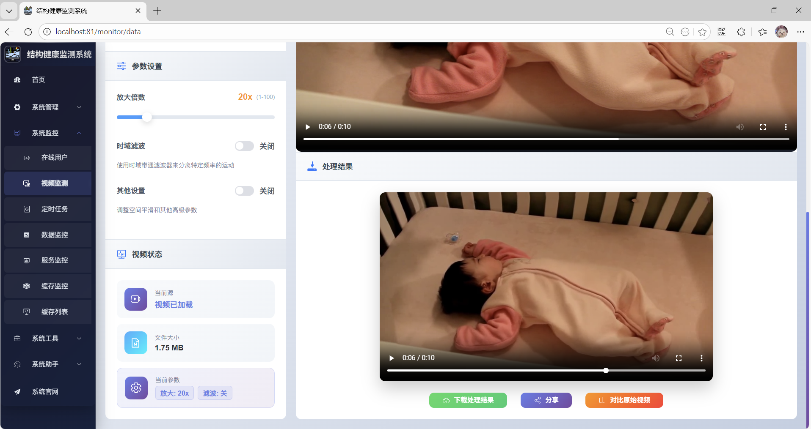

新增代码 `E:\RuoYiProject\MoMagTracker-System\MoMagTracker-Vue3\src\views\monitor\data\index.vue`

```shell
<template>
  <div class="app-container video-monitor">
    <!-- 顶部操作栏 -->
    <div class="top-action-bar">
      <div class="left-actions">
        <!-- 视频源选择 -->
        <div class="video-source-group">
          <div class="section-header">
            <!-- 自定义SVG图标 -->
            <svg-icon icon-class="video-source" class-name="header-icon custom-svg-icon"></svg-icon>
            <span class="section-label">视频源选择</span>
          </div>
          <div class="action-buttons">
            <el-upload
              class="upload-action"
              :show-file-list="false"
              :before-upload="handleVideoUpload"
              accept="video/*"
            >
              <el-button class="source-btn upload-btn">
                <svg-icon icon-class="upload" class-name="btn-svg-icon"></svg-icon>
                上传本地视频
              </el-button>
            </el-upload>
            
            <el-button 
              v-if="!cameraConnected"
              class="source-btn camera-btn"
              @click="connectCamera"
            >
              <svg-icon icon-class="camera-connect" class-name="btn-svg-icon"></svg-icon>
              连接摄像头
            </el-button>
            
            <el-button 
              v-else
              class="source-btn disconnect-btn"
              @click="disconnectCamera"
            >
              <svg-icon icon-class="camera-disconnect" class-name="btn-svg-icon"></svg-icon>
              断开摄像头
            </el-button>
          </div>
        </div>
      </div>
      
      <div class="right-actions">
        <!-- 开始处理按钮 -->
        <el-button 
          class="process-btn"
          :class="{ 'processing': processing }"
          @click="startProcessing"
          :loading="processing"
          :disabled="!videoSrc && !cameraConnected"
          size="large"
        >
          <svg-icon v-if="!processing" icon-class="start-process" class-name="process-svg-icon"></svg-icon>
          <svg-icon v-else icon-class="loading" class-name="process-svg-icon loading-icon"></svg-icon>
          {{ processing ? '处理中...' : '开始处理' }}
        </el-button>
      </div>
    </div>

    <!-- 主内容区 -->
    <div class="main-content">
      <!-- 左侧控制面板 -->
      <div class="control-panel">
        <el-card class="panel-card" shadow="never">
          <!-- 算法设置 -->
          <div class="panel-header-section">
            <div class="panel-header">
              <!-- 自定义SVG图标 -->
              <svg-icon icon-class="algorithm" class-name="header-icon custom-svg-icon"></svg-icon>
              <span class="header-title">算法设置</span>
            </div>
          </div>
          
          <div class="section-block algorithm-section">
            <div class="algorithm-options">
              <div 
                v-for="algo in algorithmOptions" 
                :key="algo.value"
                class="algorithm-item"
                :class="{ 'algorithm-active': algorithm === algo.value }"
                @click="algorithm = algo.value"
              >
                <div class="algorithm-icon" :style="{ background: algo.color }">
                  <svg-icon :icon-class="algo.icon" class-name="algo-svg-icon"></svg-icon>
                </div>
                <div class="algorithm-info">
                  <div class="algorithm-name">{{ algo.label }}</div>
                  <div class="algorithm-desc">{{ algo.desc }}</div>
                </div>
                <div v-if="algorithm === algo.value" class="algorithm-check">
                  <svg-icon icon-class="check" class-name="check-svg-icon"></svg-icon>
                </div>
              </div>
            </div>
          </div>

          <!-- 参数设置 -->
          <div class="panel-header-section">
            <div class="panel-header">
              <!-- 自定义SVG图标 -->
              <svg-icon icon-class="parameter" class-name="header-icon custom-svg-icon"></svg-icon>
              <span class="header-title">参数设置</span>
            </div>
          </div>
          
          <div class="section-block param-section">
            <!-- 放大倍数 -->
            <div class="param-item">
              <div class="param-header">
                <span class="param-label">放大倍数</span>
                <div class="param-value-group">
                  <span class="param-value" :style="{ color: getAmplificationColor() }">{{ amplification }}x</span>
                  <span class="param-range">(1-100)</span>
                </div>
              </div>
              <el-slider
                v-model="amplification"
                :min="1"
                :max="100"
                :step="1"
                :show-tooltip="true"
                @change="onAmplificationChange"
              />
            </div>

            <!-- 时域滤波开关 -->
            <div class="param-item filter-switch">
              <div class="param-header">
                <span class="param-label">时域滤波</span>
                <div class="switch-container">
                  <el-switch
                    v-model="temporalFilter"
                    active-color="#13ce66"
                    inactive-color="#ff4949"
                    @change="onTemporalFilterChange"
                  >
                  </el-switch>
                  <span class="switch-label">{{ temporalFilter ? '开启' : '关闭' }}</span>
                </div>
              </div>
              <div class="filter-description">
                使用时域带通滤波器来分离特定频率的运动
              </div>
            </div>

            <!-- 时域滤波参数（仅当时域滤波开启时显示） -->
            <div v-if="temporalFilter" class="filter-params">
              <!-- 下限阈值 -->
              <div class="param-item threshold-item">
                <div class="param-header">
                  <span class="param-label">下限阈值</span>
                  <div class="param-value-group">
                    <span class="param-value" :style="{ color: getLowerThresholdColor() }">{{ lowerThreshold.toFixed(2) }}</span>
                    <span class="param-range">(0-0.1)</span>
                  </div>
                </div>
                <el-slider
                  v-model="lowerThreshold"
                  :min="0"
                  :max="0.1"
                  :step="0.01"
                  :show-tooltip="true"
                  @change="onLowerThresholdChange"
                />
                <div class="param-description">
                  控制滤波的下限频率，较低的值允许更慢的运动通过
                </div>
              </div>
              
              <!-- 上限阈值 -->
              <div class="param-item threshold-item">
                <div class="param-header">
                  <span class="param-label">上限阈值</span>
                  <div class="param-value-group">
                    <span class="param-value" :style="{ color: getUpperThresholdColor() }">{{ upperThreshold.toFixed(1) }}</span>
                    <span class="param-range">(0-1)</span>
                  </div>
                </div>
                <el-slider
                  v-model="upperThreshold"
                  :min="0"
                  :max="1"
                  :step="0.1"
                  :show-tooltip="true"
                  @change="onUpperThresholdChange"
                />
                <div class="param-description">
                  控制滤波的上限频率，较高的值允许更快的运动通过
                </div>
              </div>
            </div>

            <!-- 其他设置开关 -->
            <div class="param-item other-settings-switch">
              <div class="param-header">
                <span class="param-label">其他设置</span>
                <div class="switch-container">
                  <el-switch
                    v-model="otherSettings"
                    active-color="#13ce66"
                    inactive-color="#ff4949"
                    @change="onOtherSettingsChange"
                  >
                  </el-switch>
                  <span class="switch-label">{{ otherSettings ? '开启' : '关闭' }}</span>
                </div>
              </div>
              <div class="filter-description">
                调整空间平滑和其他高级参数
              </div>
            </div>

            <!-- 其他设置参数（仅当其他设置开启时显示） -->
            <div v-if="otherSettings" class="other-settings-params">
              <!-- 空间平滑参数 -->
              <div class="param-item">
                <div class="param-header">
                  <span class="param-label">空间平滑</span>
                  <div class="param-value-group">
                    <span class="param-value" :style="{ color: getSpatialSigmaColor() }">{{ spatialSigma.toFixed(1) }}</span>
                    <span class="param-range">(0-5)</span>
                  </div>
                </div>
                <el-slider
                  v-model="spatialSigma"
                  :min="0"
                  :max="5"
                  :step="0.1"
                  :show-tooltip="true"
                  @change="onSpatialSigmaChange"
                />
                <div class="param-description">
                  控制空间平滑的强度，较高的值会使结果更平滑
                </div>
              </div>
              
              <!-- 这里可以添加更多其他设置参数 -->
              <!-- <div class="param-item">
                <div class="param-header">
                  <span class="param-label">其他参数</span>
                  <div class="param-value-group">
                    <span class="param-value">0.5</span>
                    <span class="param-range">(0-1)</span>
                  </div>
                </div>
                <el-slider
                  v-model="otherParam"
                  :min="0"
                  :max="1"
                  :step="0.1"
                  :show-tooltip="true"
                  @change="onOtherParamChange"
                />
                <div class="param-description">
                  其他参数描述
                </div>
              </div> -->
            </div>
          </div>

          <!-- 视频状态 -->
          <div class="panel-header-section">
            <div class="panel-header">
              <!-- 自定义SVG图标 -->
              <svg-icon icon-class="video-status" class-name="header-icon custom-svg-icon"></svg-icon>
              <span class="header-title">视频状态</span>
            </div>
          </div>

          <div class="section-block status-section">
            <div class="status-info">
              <div class="status-item">
                <div class="status-icon" :class="getStatusIconClass()">
                  <svg-icon :icon-class="getStatusIcon()" class-name="status-svg-icon"></svg-icon>
                </div>
                <div class="status-content">
                  <div class="status-label">当前源</div>
                  <div class="status-value" :class="getStatusClass()">
                    {{ getVideoStatus() }}
                  </div>
                </div>
              </div>
              
              <div v-if="videoSrc && !cameraConnected" class="status-item">
                <div class="status-icon status-icon-file">
                  <svg-icon icon-class="file" class-name="status-svg-icon"></svg-icon>
                </div>
                <div class="status-content">
                  <div class="status-label">文件大小</div>
                  <div class="status-value">
                    {{ videoFile ? formatFileSize(videoFile.size) : '未知' }}
                  </div>
                </div>
              </div>
              
              <div v-if="cameraConnected" class="status-item">
                <div class="status-icon" :class="{ 'status-icon-recording': isRecording }">
                  <svg-icon v-if="!isRecording" icon-class="camera" class-name="status-svg-icon"></svg-icon>
                  <svg-icon v-else icon-class="camera-recording" class-name="status-svg-icon"></svg-icon>
                </div>
                <div class="status-content">
                  <div class="status-label">录制状态</div>
                  <div class="status-value recording-status" :class="{ 'recording': isRecording }">
                    {{ isRecording ? '录制中' : '待录制' }}
                  </div>
                </div>
              </div>

              <!-- 参数预览 -->
              <div class="status-item param-preview">
                <div class="status-icon status-icon-params">
                  <svg-icon icon-class="now-parameter" class-name="status-svg-icon"></svg-icon>
                </div>
                <div class="status-content">
                  <div class="status-label">当前参数</div>
                  <div class="status-value">
                    <span class="param-badge">放大: {{ amplification }}x</span>
                    <span class="param-badge">滤波: {{ temporalFilter ? '开' : '关' }}</span>
                    <span v-if="temporalFilter" class="param-badge">阈值: {{ lowerThreshold.toFixed(2) }}-{{ upperThreshold.toFixed(1) }}</span>
                    <span v-if="otherSettings" class="param-badge">平滑: {{ spatialSigma.toFixed(1) }}</span>
                  </div>
                </div>
              </div>
            </div>
          </div>
        </el-card>
      </div>

      <!-- 右侧视频预览区 -->
      <div class="video-panel">
        <el-card class="panel-card" shadow="never">
          <!-- 视频预览区标题 -->
          <div class="panel-header-section">
            <div class="panel-header">
              <!-- 自定义SVG图标 -->
              <svg-icon icon-class="video-preview" class-name="header-icon custom-svg-icon"></svg-icon>
              <span class="header-title">视频预览区</span>
            </div>
          </div>
          
          <!-- 视频显示区域 -->
          <div class="video-container">
            <div v-if="videoSrc && !cameraConnected" class="video-player">
              <video
                ref="videoElement"
                :src="videoSrc"
                controls
                class="video-element"
              ></video>
            </div>
            
            <div v-else-if="cameraConnected" class="camera-preview">
              <video ref="cameraElement" autoplay class="camera-element"></video>
              <div class="camera-controls">
                <el-button-group>
                  <el-button 
                    class="camera-action-btn"
                    :class="{ 'recording': isRecording }"
                    @click="toggleRecording"
                    size="small"
                  >
                    <svg-icon v-if="!isRecording" icon-class="record-start" class-name="camera-svg-icon"></svg-icon>
                    <svg-icon v-else icon-class="record-stop" class-name="camera-svg-icon"></svg-icon>
                    {{ isRecording ? '停止录制' : '开始录制' }}
                  </el-button>
                  <el-button 
                    class="camera-action-btn" 
                    @click="captureFrame"
                    size="small"
                  >
                    <svg-icon icon-class="screenshot" class-name="camera-svg-icon"></svg-icon>
                    截图
                  </el-button>
                </el-button-group>
              </div>
            </div>
            
            <div v-else class="video-placeholder">
              <div class="placeholder-icon">
                <svg-icon icon-class="camera-placeholder" class-name="placeholder-svg-icon"></svg-icon>
              </div>
              <div class="placeholder-text">
                <p class="placeholder-title">等待视频输入</p>
                <p class="placeholder-hint">请在上方选择视频源</p>
              </div>
            </div>
          </div>

          <!-- 处理进度 -->
          <div v-if="processing" class="progress-section">
            <div class="panel-header-section">
              <div class="panel-header">
                <svg-icon v-if="processingProgress < 100" icon-class="progress" class-name="header-icon custom-svg-icon loading-icon"></svg-icon>
                <svg-icon v-else icon-class="success" class-name="header-icon custom-svg-icon"></svg-icon>
                <span class="header-title">处理进度</span>
              </div>
            </div>
            <div class="progress-content">
              <div class="progress-header">
                <span class="progress-percent" :style="{ color: getProgressColor() }">
                  {{ processingProgress }}%
                </span>
                <span class="progress-status">
                  {{ formatProgress(processingProgress) }}
                </span>
              </div>
              <el-progress 
                :percentage="processingProgress" 
                :stroke-width="10"
                :format="formatProgress"
                :color="getProgressColor()"
                class="custom-progress"
              />
            </div>
          </div>

          <!-- 处理结果 -->
          <div v-if="processedVideo" class="result-section">
            <div class="panel-header-section">
              <div class="panel-header">
                <svg-icon icon-class="result" class-name="header-icon custom-svg-icon"></svg-icon>
                <span class="header-title">处理结果</span>
              </div>
            </div>
            <div class="result-content">
              <div class="result-video-container">
                <video :src="processedVideo" controls class="result-video"></video>
              </div>
              <div class="result-actions">
                <el-button class="download-btn" @click="downloadResult">
                  <svg-icon icon-class="download-white" class-name="btn-svg-icon"></svg-icon>
                  下载处理结果
                </el-button>
                <el-button class="share-btn" @click="shareResult">
                  <svg-icon icon-class="share" class-name="btn-svg-icon"></svg-icon>
                  分享
                </el-button>
                <el-button class="compare-btn" @click="compareOriginal">
                  <svg-icon icon-class="compare" class-name="btn-svg-icon"></svg-icon>
                  对比原始视频
                </el-button>
              </div>
            </div>
          </div>
        </el-card>
      </div>
    </div>
  </div>
</template>

<script>
import * as videoApi from '@/api/data'
import { getToken } from '@/utils/auth'

export default {
  name: 'VideoMonitor',
  data() {
    return {
      algorithm: 'lagrangian',
      amplification: 20,
      temporalFilter: false, // 时域滤波开关
      otherSettings: false, // 其他设置开关
      spatialSigma: 3.0,    // 空间平滑参数
      upperThreshold: 0.5,
      lowerThreshold: 0.03,
      videoSrc: '',
      cameraConnected: false,
      processing: false,
      processingProgress: 0,
      processedVideo: '',
      videoFile: null,
      mediaStream: null,
      isRecording: false,
      mediaRecorder: null,
      recordedChunks: [],
      currentTaskId: null,
      algorithmOptions: [
        {
          value: 'lagrangian',
          label: '拉格朗日视角视频运动放大',
          desc: '通过跟踪像素点的运动轨迹来实现运动放大，适合处理较大的运动',
          icon: 'lagrangian-icon',
          color: 'linear-gradient(135deg, #667eea 0%, #764ba2 100%)'
        },
        {
          value: 'eulerian',
          label: '欧拉视角视频运动放大',
          desc: '通过分析像素值的变化来放大运动，适合处理细微的运动',
          icon: 'eulerian-icon',
          color: 'linear-gradient(135deg, #f093fb 0%, #f5576c 100%)'
        },
        {
          value: 'deeplearning',
          label: '深度学习视频运动放大',
          desc: '使用神经网络学习运动模式，能够处理复杂的运动场景',
          icon: 'deeplearning-icon',
          color: 'linear-gradient(135deg, #4facfe 0%, #00f2fe 100%)'
        }
      ]
    }
  },
  mounted() {
    this.progressTimer = null
  },
  beforeDestroy() {
    this.stopProgressPolling()
    if (this.mediaStream) {
      this.disconnectCamera()
    }
  },
  methods: {
    getVideoStatus() {
      if (this.cameraConnected) return '摄像头已连接'
      if (this.videoSrc) return '视频已加载'
      return '未选择'
    },
    
    getStatusIcon() {
      if (this.cameraConnected) return 'camera'
      if (this.videoSrc) return 'video-play'
      return 'video-pause'
    },
    
    getStatusIconClass() {
      if (this.cameraConnected) return 'status-icon-camera'
      if (this.videoSrc) return 'status-icon-video'
      return 'status-icon-none'
    },
    
    getStatusClass() {
      if (this.cameraConnected) return 'status-connected'
      if (this.videoSrc) return 'status-uploaded'
      return 'status-none'
    },
    
    getProgressColor() {
      if (this.processingProgress < 30) return '#667eea'
      if (this.processingProgress < 70) return '#f093fb'
      return '#4facfe'
    },
    
    getAmplificationColor() {
      if (this.amplification < 20) return '#4cd964'
      if (this.amplification < 50) return '#ff9500'
      if (this.amplification < 80) return '#ff3b30'
      return '#8e44ad'
    },
    
    getUpperThresholdColor() {
      if (this.upperThreshold < 0.3) return '#4cd964'
      if (this.upperThreshold < 0.7) return '#ff9500'
      return '#ff3b30'
    },
    
    getLowerThresholdColor() {
      if (this.lowerThreshold < 0.03) return '#4cd964'
      if (this.lowerThreshold < 0.07) return '#ff9500'
      return '#ff3b30'
    },
    
    getSpatialSigmaColor() {
      if (this.spatialSigma < 1) return '#4cd964'
      if (this.spatialSigma < 3) return '#ff9500'
      return '#ff3b30'
    },
    
    onAmplificationChange(value) {
      console.log('放大倍数改变:', value)
    },
    
    onTemporalFilterChange(value) {
      console.log('时域滤波开关改变:', value)
      if (!value) {
        // 关闭时域滤波时，重置阈值为默认值
        this.upperThreshold = 0.5
        this.lowerThreshold = 0.03
      }
    },
    
    onOtherSettingsChange(value) {
      console.log('其他设置开关改变:', value)
    },
    
    onSpatialSigmaChange(value) {
      console.log('空间平滑参数改变:', value)
    },
    
    onUpperThresholdChange(value) {
      console.log('上限阈值改变:', value)
      // 确保上限阈值大于下限阈值
      if (value <= this.lowerThreshold) {
        this.upperThreshold = this.lowerThreshold + 0.1
      }
    },
    
    onLowerThresholdChange(value) {
      console.log('下限阈值改变:', value)
      // 确保下限阈值小于上限阈值
      if (value >= this.upperThreshold) {
        this.lowerThreshold = Math.max(0, this.upperThreshold - 0.1)
      }
    },
    
    formatFileSize(bytes) {
      if (bytes === 0) return '0 B'
      const k = 1024
      const sizes = ['B', 'KB', 'MB', 'GB']
      const i = Math.floor(Math.log(bytes) / Math.log(k))
      return parseFloat((bytes / Math.pow(k, i)).toFixed(2)) + ' ' + sizes[i]
    },
    
    async startProcessing() {
      if (!this.videoFile && !this.cameraConnected) {
        this.$message.warning('请先选择视频源')
        return
      }

      this.processing = true
      this.processingProgress = 0
      
      try {
        const formData = new FormData()
        if (this.videoFile) {
          formData.append('video', this.videoFile)
        }
        formData.append('algorithm', this.algorithm)
        formData.append('amplification', this.amplification)
        formData.append('temporalFilter', this.temporalFilter)
        formData.append('otherSettings', this.otherSettings)
        
        // 只有当时域滤波开启时才传递阈值参数
        if (this.temporalFilter) {
          formData.append('upperThreshold', this.upperThreshold)
          formData.append('lowerThreshold', this.lowerThreshold)
        } else {
          // 如果不开启时域滤波，传递默认值
          formData.append('upperThreshold', 0.5)
          formData.append('lowerThreshold', 0.03)
        }
        
        // 只有当其他设置开启时才传递空间平滑参数
        if (this.otherSettings) {
          formData.append('spatialSigma', this.spatialSigma)
        } else {
          // 如果不开启其他设置，传递默认值
          formData.append('spatialSigma', 3.0)
        }
        
        const response = await videoApi.processVideo(formData)
        
        if (response.code === 200) {
          this.currentTaskId = response.data
          this.startProgressPolling(this.currentTaskId)
          this.$message.success('视频处理任务已提交')
        }
      } catch (error) {
        this.$message.error('处理失败：' + error.message)
        this.processing = false
      }
    },
    
    startProgressPolling(taskId) {
      this.stopProgressPolling()
      this.progressTimer = setInterval(async () => {
        try {
          const response = await videoApi.getProcessProgress(taskId)
          if (response.code === 200) {
            this.processingProgress = response.data
            if (this.processingProgress >= 100) {
              this.processing = false
              this.stopProgressPolling()
              this.downloadProcessedVideo(taskId)
            }
          }
        } catch (error) {
          console.error('获取进度失败:', error)
        }
      }, 1000)
    },
    
    stopProgressPolling() {
      if (this.progressTimer) {
        clearInterval(this.progressTimer)
        this.progressTimer = null
      }
    },
    
    async downloadProcessedVideo(taskId) {
      try {
        const response = await videoApi.downloadResult(taskId, {
          responseType: 'blob'
        })
        const url = window.URL.createObjectURL(new Blob([response]))
        this.processedVideo = url
        this.$message.success('视频处理完成')
      } catch (error) {
        this.$message.error('下载处理结果失败：' + error.message)
      }
    },
    
    downloadResult() {
      if (!this.processedVideo) {
        this.$message.warning('没有可下载的结果')
        return
      }
      
      const a = document.createElement('a')
      a.href = this.processedVideo
      a.download = `processed_video_${new Date().getTime()}.mp4`
      document.body.appendChild(a)
      a.click()
      document.body.removeChild(a)
    },
    
    shareResult() {
      this.$message.info('分享功能开发中')
    },
    
    compareOriginal() {
      if (!this.videoSrc || !this.processedVideo) {
        this.$message.warning('无法对比，请确保有原始视频和处理结果')
        return
      }
      
      // 在实际项目中，这里可以打开一个新的对比窗口
      // 这里我们简单显示一个信息
      this.$message.info('对比功能开发中，当前使用原始视频和处理后的视频')
      
      // 可以在新窗口中同时播放两个视频
      const compareWindow = window.open('', '_blank')
      if (compareWindow) {
        compareWindow.document.write(`
          <!DOCTYPE html>
          <html>
          <head>
            <title>视频对比</title>
            <style>
              body { margin: 0; padding: 20px; background: #f5f7fa; }
              .compare-container { display: flex; gap: 20px; }
              .video-wrapper { flex: 1; }
              .video-wrapper h3 { text-align: center; margin-bottom: 10px; }
              video { width: 100%; border-radius: 8px; box-shadow: 0 2px 12px rgba(0,0,0,0.1); }
            </style>
          </head>
          <body>
            <div class="compare-container">
              <div class="video-wrapper">
                <h3>原始视频</h3>
                <video src="${this.videoSrc}" controls></video>
              </div>
              <div class="video-wrapper">
                <h3>处理结果</h3>
                <video src="${this.processedVideo}" controls></video>
              </div>
            </div>
          </body>
          </html>
        `)
      }
    },
    
    formatProgress(percentage) {
      return percentage === 100 ? '处理完成' : `处理中 ${percentage}%`
    },
    
    handleVideoUpload(file) {
      this.videoFile = file
      this.videoSrc = URL.createObjectURL(file)
      this.cameraConnected = false
      if (this.mediaStream) {
        this.disconnectCamera()
      }
      return false
    },
    
    async connectCamera() {
      try {
        const stream = await navigator.mediaDevices.getUserMedia({
          video: {
            width: { ideal: 1280 },
            height: { ideal: 720 },
            facingMode: 'environment'
          },
          audio: false
        })
        
        this.mediaStream = stream
        this.cameraConnected = true
        
        if (this.$refs.cameraElement) {
          this.$refs.cameraElement.srcObject = stream
        }
        
        this.$message.success('摄像头连接成功')
      } catch (error) {
        this.$message.error('无法访问摄像头：' + error.message)
      }
    },
    
    disconnectCamera() {
      if (this.mediaStream) {
        this.mediaStream.getTracks().forEach(track => track.stop())
        this.mediaStream = null
      }
      if (this.isRecording) {
        this.stopRecording()
      }
      this.cameraConnected = false
      this.$message.info('摄像头已断开')
    },
    
    toggleRecording() {
      if (this.isRecording) {
        this.stopRecording()
      } else {
        this.startRecording()
      }
    },
    
    startRecording() {
      if (!this.mediaStream) return
      
      this.recordedChunks = []
      this.mediaRecorder = new MediaRecorder(this.mediaStream)
      
      this.mediaRecorder.ondataavailable = (event) => {
        if (event.data.size > 0) {
          this.recordedChunks.push(event.data)
        }
      }
      
      this.mediaRecorder.onstop = () => {
        const blob = new Blob(this.recordedChunks, { type: 'video/webm' })
        this.videoFile = new File([blob], 'recorded_video.webm', { type: 'video/webm' })
        this.videoSrc = URL.createObjectURL(blob)
        this.$message.success('录制完成')
      }
      
      this.mediaRecorder.start()
      this.isRecording = true
      this.$message.info('开始录制视频')
    },
    
    stopRecording() {
      if (this.mediaRecorder && this.mediaRecorder.state !== 'inactive') {
        this.mediaRecorder.stop()
      }
      this.isRecording = false
    },
    
    captureFrame() {
      if (!this.mediaStream || !this.$refs.cameraElement) return
      
      const canvas = document.createElement('canvas')
      canvas.width = this.$refs.cameraElement.videoWidth
      canvas.height = this.$refs.cameraElement.videoHeight
      const ctx = canvas.getContext('2d')
      ctx.drawImage(this.$refs.cameraElement, 0, 0, canvas.width, canvas.height)
      
      canvas.toBlob((blob) => {
        const url = URL.createObjectURL(blob)
        const a = document.createElement('a')
        a.href = url
        a.download = 'screenshot_' + new Date().getTime() + '.png'
        document.body.appendChild(a)
        a.click()
        document.body.removeChild(a)
        URL.revokeObjectURL(url)
        this.$message.success('截图已保存')
      }, 'image/png')
    }
  }
}
</script>

<style scoped lang="scss">
.app-container {
  padding: 20px;
  background: linear-gradient(135deg, #f5f7fa 0%, #c3cfe2 100%);
  min-height: calc(100vh - 84px);
}

/* SVG图标样式 */
.custom-svg-icon {
  width: 20px;
  height: 20px;
  margin-right: 12px;
  font-size: 20px;
  background: linear-gradient(135deg, #667eea 0%, #764ba2 100%);
  background-clip: text;
  -webkit-background-clip: text;
  -webkit-text-fill-color: transparent;
}

.btn-svg-icon {
  width: 16px;
  height: 16px;
  margin-right: 8px;
}

.process-svg-icon {
  width: 18px;
  height: 18px;
  margin-right: 8px;
  
  &.loading-icon {
    animation: rotate 2s linear infinite;
  }
}

.algo-svg-icon {
  width: 22px;
  height: 22px;
  color: white;
}

.check-svg-icon {
  width: 22px;
  height: 22px;
  color: #4cd964;
}

.status-svg-icon {
  width: 22px;
  height: 22px;
  color: white;
}

.camera-svg-icon {
  width: 16px;
  height: 16px;
  margin-right: 8px;
}

.placeholder-svg-icon {
  width: 80px;
  height: 80px;
  color: #667eea;
  opacity: 0.8;
}

/* 旋转动画 */
@keyframes rotate {
  from {
    transform: rotate(0deg);
  }
  to {
    transform: rotate(360deg);
  }
}

/* 顶部操作栏 */
.top-action-bar {
  display: flex;
  justify-content: space-between;
  align-items: center;
  padding: 20px;
  background: white;
  border-radius: 12px;
  margin-bottom: 20px;
  box-shadow: 0 8px 25px rgba(0, 0, 0, 0.08);
  
  .left-actions {
    .video-source-group {
      display: flex;
      align-items: center;
      gap: 20px;
      
      .section-header {
        display: flex;
        align-items: center;
        gap: 10px;
        
        .section-label {
          font-weight: 700;
          color: #2c3e50;
          font-size: 18px;
        }
      }
      
      .action-buttons {
        display: flex;
        gap: 15px;
      }
    }
  }
  
  .right-actions {
    .process-btn {
      padding: 14px 36px;
      font-size: 16px;
      font-weight: 700;
      border-radius: 12px;
      border: none;
      background: linear-gradient(135deg, #667eea 0%, #764ba2 100%);
      color: white;
      transition: all 0.3s ease;
      
      &:hover:not(:disabled) {
        transform: translateY(-3px);
        box-shadow: 0 10px 25px rgba(102, 126, 234, 0.4);
      }
      
      &:disabled {
        opacity: 0.6;
        cursor: not-allowed;
      }
      
      &.processing {
        background: linear-gradient(135deg, #ff9500 0%, #ff3b30 100%);
      }
    }
  }
}

/* 主内容区 */
.main-content {
  display: flex;
  gap: 20px;
  
  .control-panel {
    flex: 0 0 380px;
    
    .panel-card {
      border-radius: 12px;
      padding: 0;
      border: none;
      
      :deep(.el-card__body) {
        padding: 0;
      }
    }
  }
  
  .video-panel {
    flex: 1;
    
    .panel-card {
      border-radius: 12px;
      padding: 0;
      border: none;
      
      :deep(.el-card__body) {
        padding: 0;
      }
    }
  }
}

/* 统一的标题栏样式 */
.panel-header-section {
  padding: 18px 24px;
  background: linear-gradient(135deg, #f8fafc 0%, #e2e8f0 100%);
  border-bottom: 2px solid #e2e8f0;
  
  .panel-header {
    display: flex;
    align-items: center;
    
    .header-title {
      font-size: 16px;
      font-weight: 700;
      color: #2c3e50;
    }
  }
}

/* 内容区块样式 */
.section-block {
  padding: 24px;
  
  &.algorithm-section {
    border-bottom: 2px solid #e2e8f0;
  }
  
  &.param-section {
    border-bottom: 2px solid #e2e8f0;
  }
  
  &.status-section {
    border-bottom: none;
  }
}

/* 算法选择 */
.algorithm-options {
  .algorithm-item {
    display: flex;
    align-items: center;
    padding: 16px;
    border: 2px solid #e2e8f0;
    border-radius: 12px;
    margin-bottom: 12px;
    cursor: pointer;
    transition: all 0.3s ease;
    
    &:hover {
      transform: translateY(-3px);
      box-shadow: 0 8px 20px rgba(0, 0, 0, 0.1);
    }
    
    &.algorithm-active {
      border-color: transparent;
      background: linear-gradient(135deg, rgba(102, 126, 234, 0.1) 0%, rgba(118, 75, 162, 0.1) 100%);
      box-shadow: 0 8px 25px rgba(102, 126, 234, 0.15);
    }
    
    .algorithm-icon {
      width: 48px;
      height: 48px;
      border-radius: 12px;
      display: flex;
      align-items: center;
      justify-content: center;
      margin-right: 16px;
    }
    
    .algorithm-info {
      flex: 1;
      
      .algorithm-name {
        font-weight: 700;
        color: #2c3e50;
        margin-bottom: 6px;
        font-size: 15px;
      }
      
      .algorithm-desc {
        color: #718096;
        font-size: 13px;
        line-height: 1.5;
      }
    }
  }
}

/* 参数设置 */
.param-section {
  .param-item {
    margin-bottom: 28px;
    
    &.filter-switch,
    &.other-settings-switch {
      .switch-container {
        display: flex;
        align-items: center;
        gap: 12px;
        
        .switch-label {
          font-weight: 600;
          color: #4a5568;
          font-size: 16px;
        }
      }
      
      .filter-description {
        margin-top: 8px;
        color: #718096;
        font-size: 13px;
        line-height: 1.4;
      }
    }
    
    &.threshold-item {
      margin-bottom: 24px;
      padding-left: 12px;
      border-left: 3px solid rgba(102, 126, 234, 0.3);
    }
    
    .param-header {
      display: flex;
      justify-content: space-between;
      align-items: center;
      margin-bottom: 16px;
      
      .param-label {
        color: #4a5568;
        font-weight: 600;
        font-size: 15px;
      }
      
      .param-value-group {
        display: flex;
        align-items: center;
        gap: 8px;
        
        .param-value {
          font-weight: 700;
          font-size: 18px;
        }
        
        .param-range {
          color: #a0aec0;
          font-size: 12px;
          font-weight: 500;
        }
      }
    }
    
    .param-description {
      margin-top: 8px;
      color: #718096;
      font-size: 13px;
      line-height: 1.4;
      font-style: italic;
    }
  }
  
  .filter-params {
    margin: 16px 0 24px 0;
    padding: 20px;
    background: linear-gradient(135deg, rgba(102, 126, 234, 0.05) 0%, rgba(118, 75, 162, 0.05) 100%);
    border-radius: 12px;
    border: 1px solid rgba(102, 126, 234, 0.2);
  }
  
  .other-settings-params {
    margin: 16px 0 0 0;
    padding: 20px;
    background: linear-gradient(135deg, rgba(76, 217, 100, 0.05) 0%, rgba(46, 204, 113, 0.05) 100%);
    border-radius: 12px;
    border: 1px solid rgba(76, 217, 100, 0.2);
  }
  
  :deep(.el-slider) {
    .el-slider__runway {
      background-color: #e2e8f0;
      height: 8px;
      border-radius: 4px;
    }
    
    .el-slider__bar {
      height: 8px;
      border-radius: 4px;
    }
    
    .el-slider__button {
      width: 20px;
      height: 20px;
      border: 3px solid white;
      box-shadow: 0 4px 12px rgba(0, 0, 0, 0.15);
    }
  }
}

/* 视频状态 */
.status-section {
  .status-info {
    .status-item {
      display: flex;
      align-items: center;
      padding: 16px;
      background: linear-gradient(135deg, #f8fafc 0%, #f1f5f9 100%);
      border-radius: 12px;
      margin-bottom: 12px;
      
      &:last-child {
        margin-bottom: 0;
      }
      
      &.param-preview {
        background: linear-gradient(135deg, rgba(102, 126, 234, 0.1) 0%, rgba(118, 75, 162, 0.1) 100%);
        border: 1px solid rgba(102, 126, 234, 0.2);
      }
      
      .status-icon {
        width: 48px;
        height: 48px;
        border-radius: 12px;
        display: flex;
        align-items: center;
        justify-content: center;
        margin-right: 16px;
        
        &.status-icon-camera {
          background: linear-gradient(135deg, #f093fb 0%, #f5576c 100%);
        }
        
        &.status-icon-video {
          background: linear-gradient(135deg, #667eea 0%, #764ba2 100%);
        }
        
        &.status-icon-none {
          background: linear-gradient(135deg, #a0aec0 0%, #718096 100%);
        }
        
        &.status-icon-file {
          background: linear-gradient(135deg, #4facfe 0%, #00f2fe 100%);
        }
        
        &.status-icon-recording {
          background: linear-gradient(135deg, #ff9500 0%, #ff3b30 100%);
        }
        
        &.status-icon-params {
          background: linear-gradient(135deg, #667eea 0%, #764ba2 100%);
        }
      }
      
      .status-content {
        .status-label {
          color: #718096;
          font-size: 13px;
          margin-bottom: 4px;
        }
        
        .status-value {
          font-weight: 700;
          font-size: 16px;
          
          &.status-connected {
            color: #4cd964;
          }
          
          &.status-uploaded {
            color: #667eea;
          }
          
          &.status-none {
            color: #a0aec0;
          }
          
          &.recording-status {
            &.recording {
              color: #ff3b30;
            }
          }
          
          .param-badge {
            display: inline-block;
            padding: 4px 10px;
            background: rgba(102, 126, 234, 0.1);
            border-radius: 6px;
            margin-right: 8px;
            font-size: 14px;
            color: #667eea;
            border: 1px solid rgba(102, 126, 234, 0.2);
          }
        }
      }
    }
  }
}

/* 视频预览区 */
.video-container {
  position: relative;
  width: 100%;
  min-height: 450px;
  background: linear-gradient(135deg, #000 0%, #1a202c 100%);
  border-radius: 0 0 12px 12px;
  overflow: hidden;
  display: flex;
  align-items: center;
  justify-content: center;
  
  .video-player,
  .camera-preview {
    width: 100%;
    height: 100%;
    position: relative;
  }
  
  .video-element,
  .camera-element {
    width: 100%;
    height: 100%;
    object-fit: contain;
  }
  
  .camera-controls {
    position: absolute;
    bottom: 24px;
    left: 50%;
    transform: translateX(-50%);
    z-index: 10;
    
    .camera-action-btn {
      background: rgba(255, 255, 255, 0.95);
      color: #2c3e50;
      border: none;
      border-radius: 25px;
      padding: 10px 20px;
      font-weight: 600;
      transition: all 0.3s ease;
      margin: 0 5px;
      
      &:hover {
        transform: translateY(-2px);
        box-shadow: 0 8px 20px rgba(0, 0, 0, 0.2);
      }
      
      &.recording {
        background: linear-gradient(135deg, #ff9500 0%, #ff3b30 100%);
        color: white;
      }
    }
  }
  
  .video-placeholder {
    text-align: center;
    color: #a0aec0;
    
    .placeholder-text {
      .placeholder-title {
        font-size: 20px;
        margin-bottom: 8px;
        font-weight: 700;
        color: #e2e8f0;
      }
      
      .placeholder-hint {
        font-size: 15px;
        opacity: 0.8;
        color: #a0aec0;
      }
    }
  }
}

/* 处理进度 */
.progress-section {
  border-top: 2px solid #e2e8f0;
  
  .progress-content {
    padding: 24px;
    
    .progress-header {
      display: flex;
      justify-content: space-between;
      align-items: center;
      margin-bottom: 16px;
      
      .progress-percent {
        font-weight: 800;
        font-size: 28px;
      }
      
      .progress-status {
        color: #4a5568;
        font-weight: 600;
        font-size: 16px;
      }
    }
    
    .custom-progress {
      :deep(.el-progress-bar__outer) {
        background-color: #e2e8f0;
        border-radius: 8px;
        overflow: hidden;
      }
      
      :deep(.el-progress-bar__inner) {
        border-radius: 8px;
        transition: width 0.6s ease;
      }
      
      :deep(.el-progress__text) {
        font-weight: 700;
        color: #2c3e50;
        margin-left: 15px;
        font-size: 16px;
      }
    }
  }
}

/* 处理结果 */
.result-section {
  border-top: 2px solid #e2e8f0;
  
  .result-content {
    padding: 24px;
    display: flex;
    flex-direction: column;
    align-items: center;
    gap: 20px;
    
    .result-video-container {
      width: 100%;
      max-width: 700px;
      
      .result-video {
        width: 100%;
        border-radius: 12px;
        box-shadow: 0 15px 35px rgba(0, 0, 0, 0.2);
      }
    }
    
    .result-actions {
      display: flex;
      gap: 16px;
      flex-wrap: wrap;
      justify-content: center;
      
      .download-btn {
        padding: 12px 28px;
        background: linear-gradient(135deg, #4cd964 0%, #2ecc71 100%);
        color: white;
        border: none;
        border-radius: 10px;
        font-weight: 700;
        transition: all 0.3s ease;
        
        &:hover {
          transform: translateY(-3px);
          box-shadow: 0 10px 25px rgba(76, 217, 100, 0.4);
        }
      }
      
      .share-btn {
        padding: 12px 28px;
        background: linear-gradient(135deg, #667eea 0%, #764ba2 100%);
        color: white;
        border: none;
        border-radius: 10px;
        font-weight: 700;
        transition: all 0.3s ease;
        
        &:hover {
          transform: translateY(-3px);
          box-shadow: 0 10px 25px rgba(102, 126, 234, 0.4);
        }
      }
      
      .compare-btn {
        padding: 12px 28px;
        background: linear-gradient(135deg, #ff9500 0%, #ff3b30 100%);
        color: white;
        border: none;
        border-radius: 10px;
        font-weight: 700;
        transition: all 0.3s ease;
        
        &:hover {
          transform: translateY(-3px);
          box-shadow: 0 10px 25px rgba(255, 149, 0, 0.4);
        }
      }
    }
  }
}

/* 按钮样式 */
.source-btn {
  padding: 12px 24px;
  font-weight: 700;
  border-radius: 10px;
  border: none;
  transition: all 0.3s ease;
  display: inline-flex;
  align-items: center;
  box-shadow: 0 6px 15px rgba(0, 0, 0, 0.1);
  
  &.upload-btn {
    background: linear-gradient(135deg, #667eea 0%, #764ba2 100%);
    color: white;
    
    &:hover {
      transform: translateY(-3px);
      box-shadow: 0 12px 25px rgba(102, 126, 234, 0.3);
    }
  }
  
  &.camera-btn {
    background: linear-gradient(135deg, #4cd964 0%, #2ecc71 100%);
    color: white;
    
    &:hover {
      transform: translateY(-3px);
      box-shadow: 0 12px 25px rgba(76, 217, 100, 0.3);
    }
  }
  
  &.disconnect-btn {
    background: linear-gradient(135deg, #ff9500 0%, #ff3b30 100%);
    color: white;
    
    &:hover {
      transform: translateY(-3px);
      box-shadow: 0 12px 25px rgba(255, 149, 0, 0.3);
    }
  }
}

/* 响应式设计 */
@media (max-width: 1200px) {
  .main-content {
    flex-direction: column;
    
    .control-panel {
      flex: none;
      width: 100%;
    }
  }
}

@media (max-width: 768px) {
  .app-container {
    padding: 15px;
  }
  
  .top-action-bar {
    flex-direction: column;
    gap: 20px;
    padding: 15px;
    
    .left-actions {
      width: 100%;
      
      .video-source-group {
        flex-direction: column;
        align-items: flex-start;
        gap: 15px;
        
        .action-buttons {
          width: 100%;
          flex-wrap: wrap;
          
          .source-btn {
            flex: 1;
            min-width: 120px;
          }
        }
      }
    }
    
    .right-actions {
      width: 100%;
      
      .process-btn {
        width: 100%;
      }
    }
  }
  
  .video-container {
    min-height: 350px;
    
    .camera-controls {
      bottom: 15px;
      
      .camera-action-btn {
        padding: 8px 16px;
        font-size: 13px;
      }
    }
    
    .video-placeholder {
      .placeholder-svg-icon {
        width: 60px;
        height: 60px;
      }
    }
  }
  
  .algorithm-options .algorithm-item {
    padding: 12px;
  }
  
  .result-actions {
    flex-direction: column;
    align-items: center;
    
    .download-btn,
    .share-btn,
    .compare-btn {
      width: 100%;
      max-width: 300px;
    }
  }
}

@media (max-width: 480px) {
  .app-container {
    padding: 10px;
  }
  
  .top-action-bar {
    padding: 12px;
    
    .video-source-group .section-header {
      .section-label {
        font-size: 16px;
      }
    }
  }
  
  .video-container {
    min-height: 300px;
    
    .camera-controls {
      flex-direction: column;
      gap: 8px;
      bottom: 10px;
      
      .camera-action-btn {
        width: 100%;
        justify-content: center;
      }
    }
    
    .video-placeholder {
      .placeholder-svg-icon {
        width: 50px;
        height: 50px;
      }
      
      .placeholder-text .placeholder-title {
        font-size: 18px;
      }
    }
  }
  
  .param-section .filter-params,
  .param-section .other-settings-params {
    padding: 15px;
  }
  
  .status-section .status-item .status-content .status-value .param-badge {
    display: block;
    margin-bottom: 4px;
    width: fit-content;
  }
}
</style>
```

- 视频对比结果


### 5.3 推送至远程仓库

```shell
git status

git add .

git status

git commit -m "第六次提交，修改 README.md 文件，继续开发视频监控模块，实现基于拉格朗日视角的视频运动放大算法的实时处理版本"

git push -u origin master
```


